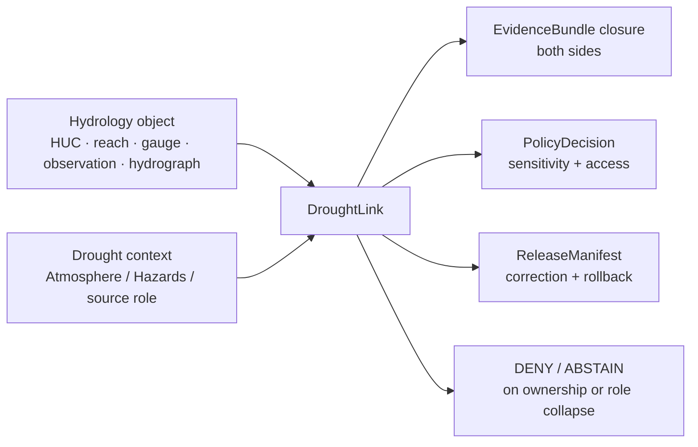

<!-- [KFM_META_BLOCK_V2]
doc_id: kfm://doc/contracts-domains-hydrology-drought-link
title: Drought Link Contract — Hydrology
type: semantic-contract
version: v0.2
status: draft; PROPOSED; schema-missing; NEEDS VERIFICATION before promotion
owners:
  - OWNER_TBD — Hydrology domain steward
  - OWNER_TBD — Drought/Hazards seam steward
  - OWNER_TBD — Atmosphere seam steward
  - OWNER_TBD — Contracts steward
  - OWNER_TBD — Source steward
  - OWNER_TBD — Evidence steward
  - OWNER_TBD — Schema steward
  - OWNER_TBD — Policy steward
  - OWNER_TBD — Release steward
  - OWNER_TBD — Docs steward
created: 2026-06-22
updated: 2026-06-22
policy_label: public-with-gates; semantic-contract; hydrology; drought-link; cross-lane-link; source-role-aware; evidence-bound; release-gated; rollback-aware; not-for-life-safety
tags: [kfm, contracts, hydrology, drought-link, DroughtLink, cross-lane, atmosphere, hazards, aggregate, modeled, source-role, EvidenceBundle, PolicyDecision, ReleaseManifest, RollbackCard, HUCUnit, FlowObservation, WaterLevelObservation]
related:
  - ./README.md
  - ./decision_envelope.md
  - ./domain_feature_identity.md
  - ./domain_layer_descriptor.md
  - ./domain_observation.md
  - ./domain_validation_report.md
  - ./huc_unit.md
  - ./flow_observation.md
  - ./water_level_observation.md
  - ./hydrograph.md
  - ../../../docs/domains/hydrology/OBJECT_FAMILIES.md
  - ../../../docs/domains/hydrology/SOURCE_ROLE_MATRIX.md
  - ../../../docs/domains/hydrology/GLOSSARY.md
  - ../../../docs/domains/hydrology/BOUNDARY.md
  - ../../../docs/domains/hydrology/FILE_SYSTEM_PLAN.md
  - ../../../schemas/contracts/v1/domains/hydrology/drought_link.schema.json
  - ../../../policy/domains/hydrology/
  - ../../../fixtures/domains/hydrology/drought_link/
  - ../../../tests/domains/hydrology/test_drought_link.*
  - ../../../data/registry/sources/hydrology/
  - ../../../release/candidates/hydrology/
notes:
  - "Expanded from a thin scaffold at contracts/domains/hydrology/drought_link.md."
  - "The exact paired schema path schemas/contracts/v1/domains/hydrology/drought_link.schema.json was not found in this session. Schema shape remains MISSING / NEEDS VERIFICATION."
  - "Hydrology object-family doctrine treats DroughtLink as a proposed cross-lane link object to Atmosphere / Hazards, not a core Hydrology observation family."
  - "DroughtLink preserves a relation between released Hydrology context and drought context. It does not make Hydrology the owner of observed or modeled atmospheric drought truth, hazard-event truth, Agriculture crop/yield truth, or emergency/water-supply guidance."
[/KFM_META_BLOCK_V2] -->

# Drought Link Contract — Hydrology

> Semantic contract for `DroughtLink`: a Hydrology cross-lane seam object that links released Hydrology context to drought context while preserving each lane's source role, evidence, temporal scope, sensitivity posture, release state, correction lineage, and rollback target.

  
  
  
  
  
  
  

`contracts/domains/hydrology/drought_link.md`

## Quick jumps

[Status](#status) · [Meaning](#meaning) · [Repo fit](#repo-fit) · [Schema posture](#schema-posture) · [Boundary rule](#boundary-rule) · [Link semantics](#link-semantics) · [Assertions](#assertions) · [Exclusions](#exclusions) · [Recommended fields](#recommended-fields) · [Source-role rules](#source-role-rules) · [Temporal rules](#temporal-rules) · [Sensitivity and publication](#sensitivity-and-publication) · [Lifecycle](#lifecycle) · [Validation](#validation) · [Rollback](#rollback) · [Evidence basis](#evidence-basis) · [Open questions](#open-questions)

---

## Status

> [!IMPORTANT]
> **Status:** `draft` / semantic contract  
> **Contract path:** `contracts/domains/hydrology/drought_link.md`  
> **Expected schema path:** `schemas/contracts/v1/domains/hydrology/drought_link.schema.json`  
> **Schema posture:** exact paired schema was **not found** in this session. This contract is semantic intent until a schema, fixtures, validators, and policy gates exist.  
> **Truth posture:** `DroughtLink` is confirmed as a Hydrology term and proposed cross-lane link object in Hydrology docs. Field-level schema, validator enforcement, fixtures, policy runtime, release artifacts, and public API behavior remain **NEEDS VERIFICATION**.

> [!CAUTION]
> `DroughtLink` is a seam object, not a drought index, drought event, atmospheric observation, crop/yield claim, water-right claim, emergency instruction, or public-release authority.

---

## Meaning

`DroughtLink` records a governed relationship between a Hydrology object and a drought-context object or source context.

It may link Hydrology context such as:

- `HUCUnit`, `Watershed`, or `ReachIdentity`;
- `FlowObservation` or `WaterLevelObservation` trends;
- `GroundwaterWell` or `AquiferObservation` public-safe derivatives;
- `Hydrograph` or `UpstreamTrace` derivatives;
- released public-safe Hydrology layers or evidence bundles;

…to drought context supplied by another lane or source family, such as modeled or aggregate drought context from Atmosphere / Hazards or a cross-lane drought surface.

It does **not** claim that Hydrology owns drought truth. It says: “this Hydrology object is linked to this drought context under these roles, evidence refs, time windows, caveats, and release constraints.”

---

## Repo fit

| Responsibility | Path or root | This contract's role |
|---|---|---|
| Human-readable link meaning | `contracts/domains/hydrology/drought_link.md` | This file; semantic contract for Hydrology's drought seam. |
| Machine schema | `schemas/contracts/v1/domains/hydrology/drought_link.schema.json` | Expected path, but not found in this session. |
| Contract root | `contracts/domains/hydrology/README.md` | Hydrology contract-root boundaries and object-family expectations. |
| Object catalog | `docs/domains/hydrology/OBJECT_FAMILIES.md` | Treats `DroughtLink` as proposed cross-lane link object. |
| Glossary | `docs/domains/hydrology/GLOSSARY.md` | Defines `DroughtLink` as a link relating Hydrology to drought context. |
| Boundary doctrine | `docs/domains/hydrology/BOUNDARY.md` | Cross-lane link rules: ownership, source role, sensitivity, EvidenceBundle support. |
| Source-role matrix | `docs/domains/hydrology/SOURCE_ROLE_MATRIX.md` | Drought/irrigation link sources commonly carry modeled or aggregate roles. |
| Decision envelope | `contracts/domains/hydrology/decision_envelope.md` | Runtime finite outcomes for requests touching the link. |
| Feature identity | `contracts/domains/hydrology/domain_feature_identity.md` | Stable identity and source-role/time/digest companion. |
| Validation report | `contracts/domains/hydrology/domain_validation_report.md` | Gate record that should catch invalid link claims. |
| Policy | `policy/domains/hydrology/` | Expected cross-lane, sensitivity, release, and source-role gates. |
| Release | `release/candidates/hydrology/` and release roots | ReleaseManifest, CorrectionNotice, RollbackCard. |

---

## Schema posture

| Schema fact | Current posture |
|---|---|
| Expected schema path | `schemas/contracts/v1/domains/hydrology/drought_link.schema.json` |
| Exact schema found? | **No** — direct fetch returned not found in this session. |
| Contract source | `docs/domains/hydrology/FILE_SYSTEM_PLAN.md` named the target path as planned/expected. |
| Object-family source | `docs/domains/hydrology/OBJECT_FAMILIES.md` / `GLOSSARY.md` name `DroughtLink` as a proposed cross-lane link. |
| Field-level enforcement | MISSING / NEEDS VERIFICATION |
| Contract promotion status | HOLD until schema, fixtures, validators, policy, release tests, and cross-lane ownership mapping exist. |

This Markdown contract defines intended meaning for review and schema design. It does not prove implementation.

---

## Boundary rule

A `DroughtLink` must preserve four cross-lane conditions:

1. **Ownership preserved** — Hydrology owns the link, not the drought truth.
2. **Source role preserved** — modeled, aggregate, observed, regulatory, administrative, candidate, and synthetic roles do not upgrade through the join.
3. **Sensitivity preserved** — the most restrictive applicable policy governs the public link.
4. **EvidenceBundle support preserved** — both sides resolve evidence before the link is used in a claim.

---

## Link semantics

| Link side | Meaning | Boundary |
|---|---|---|
| Hydrology side | The Hydrology object, layer, observation, derivative, HUC/reach/well context, or EvidenceBundle being related to drought context. | Hydrology identity and release state stay with Hydrology. |
| Drought side | The drought context, modeled/aggregate drought indicator, hazard context, atmospheric source, or external drought-source claim. | Drought/Atmosphere/Hazards identity and source role stay with the owning lane/source. |
| Link relation | The governed assertion that the two sides are related under a scope, method, time window, and evidence basis. | Link does not create new drought truth or per-place water truth. |
| Public derivative | Generalized/released map/card/export/focus context derived from the link. | Requires EvidenceBundle, PolicyDecision, ReleaseManifest, correction path, and rollback target. |

---

## Assertions

A reviewed `DroughtLink` should assert:

1. **Stable link identity** — canonical link ID and `spec_hash` over both sides, roles, temporal scope, method/scope, and normalized digest.
2. **Hydrology-side reference** — HUC, watershed, reach, gauge, observation, aquifer, hydrograph, upstream trace, layer, or EvidenceBundle ref.
3. **Drought-side reference** — drought context source, object, indicator, modeled/aggregate product, or owning-lane ref.
4. **Source-role preservation** — modeled and aggregate drought sources remain modeled/aggregate; Hydrology observations remain observed; no role upgrade.
5. **Temporal alignment** — drought window and Hydrology window are explicit and not collapsed with retrieval/release/correction time.
6. **Spatial alignment** — HUC/reach/watershed/geometry scope and drought aggregation unit are explicit; per-place certainty is not invented.
7. **Evidence closure** — EvidenceRefs/EvidenceBundles resolve for both sides before public claims.
8. **Policy/review support** — sensitivity, rights, and cross-lane review state are recorded.
9. **Release separation** — ReleaseManifest and rollback target are required before public use.
10. **Correction lineage** — changes to either side invalidate or revalidate the link.

---

## Exclusions

| Misuse | Why it is denied or abstained |
|---|---|
| Treating `DroughtLink` as a drought index | The link is relational; drought indicator truth belongs to its source/owning lane. |
| Treating drought aggregate as per-place Hydrology observation | Aggregate role loses individual/place fidelity. |
| Treating modeled drought context as observed Hydrology fact | Modeled role and uncertainty must remain visible. |
| Treating Hydrology as owner of atmospheric drought truth | Atmosphere/Hazards or source family owns drought context. |
| Inferring crop yield or irrigation need from the link alone | Agriculture owns crop/yield/irrigation claims; link only supplies Hydrology context. |
| Publishing private well / owner / parcel implications through drought joins | Sensitive/private-property joins require policy/review/generalization. |
| Using the link for emergency or water-supply instructions | KFM is not a life-safety or operational authority. |
| Public direct read from RAW/WORK/QUARANTINE | Public clients use governed APIs and released artifacts only. |
| AI summary as evidence for a link | AI is interpretive; EvidenceBundle is required. |

---

## Recommended fields

The following fields are **PROPOSED** targets for future schema expansion. They are not enforced by a confirmed `drought_link.schema.json` in this session.

| Field | Meaning |
|---|---|
| `id` | Canonical DroughtLink ID. |
| `version` | Contract/object version. |
| `spec_hash` | Deterministic digest over normalized link semantics. |
| `domain` | Must resolve to `hydrology`. |
| `object_type` | `DroughtLink`. |
| `hydrology_ref` | Hydrology-side object/layer/EvidenceBundle reference. |
| `hydrology_object_family` | HUCUnit, Watershed, ReachIdentity, FlowObservation, WaterLevelObservation, AquiferObservation, Hydrograph, etc. |
| `hydrology_source_role` | Source role on Hydrology side. |
| `drought_ref` | Drought-side object/source/context reference. |
| `drought_owner_domain` | Atmosphere, Hazards, or accepted owning lane/source context. |
| `drought_source_role` | Usually modeled or aggregate for link sources; exact role from SourceDescriptor. |
| `relation_type` | related_to_drought_context, coincident_with_drought_window, supports_drought_context, constrained_by_drought_context, or accepted enum. |
| `temporal_scope` | Hydrology window, drought window, alignment method, retrieval/release/correction times. |
| `spatial_scope` | HUC/reach/watershed/geometry scope and drought aggregation unit. |
| `method_or_basis` | How the relation was established: overlap, shared HUC, time-window join, source assertion, analyst-reviewed relation, etc. |
| `confidence_or_quality` | Optional confidence/quality field with method caveat; not truth authority. |
| `evidence_ref_ids` | EvidenceRefs for both sides and the join relation. |
| `evidence_bundle_ids` | EvidenceBundles supporting both sides and the relation. |
| `policy_decision_refs` | Policy decisions controlling exposure. |
| `review_record_refs` | Cross-lane/sensitivity review decisions. |
| `release_refs` | ReleaseManifest/PromotionDecision refs. |
| `correction_refs` | CorrectionNotice/supersession refs. |
| `rollback_refs` | RollbackCard refs. |
| `quality_flags` | schema_missing, missing_drought_owner, missing_evidence, modeled_as_observed, aggregate_as_per_place, sensitive_join, release_missing, rollback_missing. |

---

## Source-role rules

| Role condition | Required handling |
|---|---|
| Hydrology side is observed | Preserve observed time, source, unit/qualifier where applicable. |
| Drought side is modeled | Preserve model/source identity, uncertainty/caveat, and never relabel observed. |
| Drought side is aggregate | Preserve aggregation unit/window; never infer per-place certainty. |
| Hydrology side is aggregate | Preserve HUC/watershed aggregation scope. |
| Either side is candidate | No public link until admission/review/promotion resolves. |
| Either side is synthetic/AI | Cannot support observed or authoritative claim; requires representation boundary. |
| Role is missing or ambiguous | ABSTAIN/HOLD; do not infer role from filename or label. |

---

## Temporal rules

| Time element | Rule |
|---|---|
| Hydrology observed/source/valid time | Must remain distinct and visible where material. |
| Drought valid/analysis/period time | Must remain distinct from Hydrology observation time. |
| Join/alignment window | Must be explicit; time-window overlap does not prove causality. |
| Retrieval time | Does not create drought or Hydrology truth. |
| Release time | Does not define the source event or drought period. |
| Correction time | Invalidates/revalidates relation when either side changes. |

A `DroughtLink` may support a contextual statement such as “this Hydrology object was evaluated against this drought context during this time window.” It must not assert causality, risk, crop loss, water-right consequence, or emergency need unless a separate owning-lane evidence bundle and release path supports that claim.

---

## Sensitivity and publication

`DroughtLink` can amplify sensitivity because it joins water context to drought context. Publication must fail closed or require review when the relation exposes:

- private wells, owner/parcel/property inference, or groundwater vulnerability;
- critical infrastructure, water supply, intakes, dams, utilities, or exact asset exposure;
- crop/yield/irrigation implications owned by Agriculture;
- emergency/hazard interpretation owned by Hazards or official sources;
- drought condition claims without source role, time window, and EvidenceBundle closure;
- precise sensitive ecology, archaeology, land/title, or living-person-adjacent joins.

Public release should prefer generalized or aggregate context when exact links are not necessary for the released purpose.

---

## Lifecycle

| Phase | DroughtLink handling |
|---|---|
| RAW | Source-side drought or Hydrology payloads are captured separately under their owning lifecycle roots. No public link exists. |
| WORK / QUARANTINE | Candidate link is normalized; missing owner, role, time window, evidence, rights, or sensitivity review holds/quarantines it. |
| PROCESSED | Link candidate binds hydrology ref, drought ref, source roles, temporal/spatial scope, evidence refs, validation report, and quality flags. |
| CATALOG / TRIPLET | Link may appear as graph/triplet relation only with role/evidence caveats; graph projection does not become truth. |
| RELEASE CANDIDATE | Public derivative requires EvidenceBundle closure for both sides, PolicyDecision, ReviewRecord where needed, ReleaseManifest, correction path, and RollbackCard. |
| PUBLISHED | Governed API/UI may serve released public-safe link context; public clients do not read RAW/WORK/QUARANTINE directly. |
| CORRECTED / SUPERSEDED | Changes to either side, drought source revision, Hydrology source correction, policy change, or release withdrawal invalidates/revalidates the link. |

---

## Validation

Before this contract is promoted beyond draft:

- [ ] Create or verify `schemas/contracts/v1/domains/hydrology/drought_link.schema.json`.
- [ ] Decide whether `DroughtLink` belongs in the Hydrology schema home, a cross-lane link schema home, or both via profile.
- [ ] Define canonical fields for `hydrology_ref`, `drought_ref`, `drought_owner_domain`, `relation_type`, `temporal_scope`, `spatial_scope`, and `method_or_basis`.
- [ ] Add positive fixtures for HUC-to-drought-context link, gauge-observation-to-drought-window link, hydrograph-to-drought-context link, and public-safe generalized link.
- [ ] Add negative fixtures for modeled-drought-as-observed, aggregate-drought-as-per-place, missing owner domain, missing EvidenceBundle, private well exact public exposure, crop-yield inference, emergency instruction framing, candidate-as-public, and missing rollback target.
- [ ] Add validator coverage for both-side evidence closure, source role, temporal alignment, spatial scope, sensitive join, release state, correction lineage, and rollback target.
- [ ] Confirm policy can DENY/ABSTAIN on unsupported drought claims and restrict sensitive joins.
- [ ] Confirm public UI/API uses governed APIs and released artifacts only.

Recommended finite outcomes:

| Condition | Outcome |
|---|---|
| Both sides resolve identity, role, temporal/spatial scope, evidence, policy, release, correction, and rollback | `ANSWER` or release-eligible reference |
| Owner, source role, time window, evidence, or release support is incomplete | `ABSTAIN` / `HOLD` |
| Role collapse, candidate exposure, sensitive/private join, unsupported crop/hazard inference, emergency framing, or direct RAW/WORK read would occur | `DENY` |
| Schema, validator, source read, evidence lookup, policy lookup, release lookup, or cross-lane resolver fails | `ERROR` |

---

## Rollback

Rollback is required when a DroughtLink weakens cross-lane ownership, source-role integrity, evidence closure, sensitivity posture, release governance, or correction lineage.

Rollback triggers include missing schema; missing drought owner; hydrology observation used as drought truth; modeled drought context relabeled observed; aggregate drought context treated as per-place fact; crop/yield/irrigation claim inferred without Agriculture evidence; emergency/water-supply guidance inferred; private well or infrastructure-sensitive join exposed without review; candidate link published; missing EvidenceBundle, PolicyDecision, ReviewRecord, ReleaseManifest, CorrectionNotice, or RollbackCard; source correction invalidates either side; or public UI/API reads RAW/WORK/QUARANTINE directly.

Rollback artifacts should include affected DroughtLink IDs, Hydrology refs, drought refs, owning-domain refs, source descriptors, source roles, temporal/spatial scope, method/basis, EvidenceRefs/EvidenceBundles, ValidationReports, PolicyDecisions, ReviewRecords, ReleaseManifests, CorrectionNotices, RollbackCards, invalidated layer descriptors, invalidated decision envelopes, invalidated exports, and public-cache/style invalidation instructions.

---

## Evidence basis

| Source | Status | Supports | Limits |
|---|---|---|---|
| `contracts/domains/hydrology/drought_link.md` scaffold | CONFIRMED | Target existed as a planned scaffold from the Hydrology file-system plan. | Did not contain authoritative DroughtLink semantics. |
| `schemas/contracts/v1/domains/hydrology/drought_link.schema.json` fetch | CONFIRMED missing in this session | Exact paired schema was not found at expected path. | Does not prove no schema exists elsewhere. |
| `docs/domains/hydrology/OBJECT_FAMILIES.md` | CONFIRMED | Treats `DroughtLink` as proposed cross-lane link object to Atmosphere / Hazards and says linked object identity stays with owning lane. | DroughtLink is not in the core §E object table; it remains a proposed link object. |
| `docs/domains/hydrology/GLOSSARY.md` | CONFIRMED | Defines `DroughtLink` as a link relating Hydrology to drought context and confirms source-role/time/evidence constraints. | Field realization remains PROPOSED. |
| `docs/domains/hydrology/BOUNDARY.md` | CONFIRMED | Cross-lane joins preserve ownership, source role, sensitivity, and EvidenceBundle support. | Path-shaped enforcement details are partly PROPOSED. |
| `docs/domains/hydrology/SOURCE_ROLE_MATRIX.md` | CONFIRMED | Drought/irrigation link sources commonly carry modeled or aggregate roles and no Hydrology source family is admitted as synthetic. | Machine enforcement requires SourceDescriptor, policy, fixtures, and validators. |
| `contracts/domains/hydrology/README.md` | CONFIRMED | Contract-root expected family map and cross-domain link boundaries. | Orientation doc, not schema enforcement. |
| User-provided authoring role | CONFIRMED user instruction | Requires evidence-grounded, repo-ready Markdown and visible verification boundaries. | Authoring rule, not implementation proof. |

---

## Open questions

| Question | Status | Resolution path |
|---|---|---|
| Should `DroughtLink` have its own Hydrology schema or be part of a shared cross-lane link schema? | NEEDS VERIFICATION | Schema steward + domain stewards review. |
| Which domain owns canonical drought context in KFM: Atmosphere, Hazards, Climate/Drought, or source-specific profile? | NEEDS VERIFICATION | ADR/domain-boundary review. |
| Which relation types are allowed for Hydrology-to-drought links? | NEEDS VERIFICATION | Contract/schema/policy design. |
| Which source families can provide admissible drought context, and with which source roles? | NEEDS VERIFICATION | SourceDescriptor registry review. |
| Which public geometry/generalization rules apply to drought links involving groundwater, wells, or infrastructure? | NEEDS VERIFICATION | Policy/sensitivity review. |
| Which validator proves a DroughtLink cannot imply crop yield, emergency need, or observed drought truth? | NEEDS VERIFICATION | Negative fixtures and validator implementation. |

---

## Related contracts and docs

- [`./README.md`](./README.md) — Hydrology contract-root README.
- [`./decision_envelope.md`](./decision_envelope.md) — Hydrology runtime decision-envelope alias.
- [`./domain_feature_identity.md`](./domain_feature_identity.md) — Hydrology feature identity contract.
- [`./domain_layer_descriptor.md`](./domain_layer_descriptor.md) — Hydrology layer descriptor contract.
- [`./domain_observation.md`](./domain_observation.md) — Hydrology observation envelope contract.
- [`./domain_validation_report.md`](./domain_validation_report.md) — Hydrology validation-report contract.
- [`./irrigation_link.md`](./irrigation_link.md) — sibling Agriculture seam contract, if present/expanded.
- [`./water_use_link.md`](./water_use_link.md) — sibling Agriculture/water-use seam contract, if present/expanded.
- [`../../../docs/domains/hydrology/OBJECT_FAMILIES.md`](../../../docs/domains/hydrology/OBJECT_FAMILIES.md) — object-family catalog and cross-lane link object note.
- [`../../../docs/domains/hydrology/GLOSSARY.md`](../../../docs/domains/hydrology/GLOSSARY.md) — Hydrology vocabulary.
- [`../../../docs/domains/hydrology/BOUNDARY.md`](../../../docs/domains/hydrology/BOUNDARY.md) — bounded-context and cross-lane rules.
- [`../../../docs/domains/hydrology/SOURCE_ROLE_MATRIX.md`](../../../docs/domains/hydrology/SOURCE_ROLE_MATRIX.md) — source-role matrix.
- [`../../../docs/domains/hydrology/FILE_SYSTEM_PLAN.md`](../../../docs/domains/hydrology/FILE_SYSTEM_PLAN.md) — planned path source.

[Back to top](#top)
