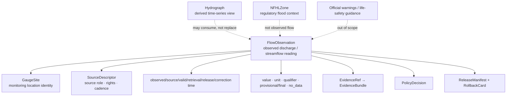

<!-- [KFM_META_BLOCK_V2]
doc_id: kfm://doc/contracts-domains-hydrology-flow-observation
title: Flow Observation Contract — Hydrology
type: semantic-contract
version: v0.2
status: draft; PROPOSED; schema-stub; NEEDS VERIFICATION before promotion
owners:
  - OWNER_TBD — Hydrology domain steward
  - OWNER_TBD — Observation steward
  - OWNER_TBD — Contracts steward
  - OWNER_TBD — Source steward
  - OWNER_TBD — Evidence steward
  - OWNER_TBD — Schema steward
  - OWNER_TBD — Policy steward
  - OWNER_TBD — Release steward
  - OWNER_TBD — Docs steward
created: 2026-06-22
updated: 2026-06-22
policy_label: public-with-gates; semantic-contract; hydrology; flow-observation; streamflow; discharge; observed-role; time-aware; evidence-bound; release-gated; rollback-aware; not-for-life-safety
tags: [kfm, contracts, hydrology, flow-observation, FlowObservation, discharge, streamflow, NWIS, GaugeSite, observed, source-role, provisional, qualifier, unit, observed-time, EvidenceBundle, CitationValidationReport, ReleaseManifest, RollbackCard]
related:
  - ./README.md
  - ./decision_envelope.md
  - ./domain_feature_identity.md
  - ./domain_layer_descriptor.md
  - ./domain_observation.md
  - ./domain_validation_report.md
  - ./evidence_bundle.md
  - ./gauge_site.md
  - ./water_level_observation.md
  - ./hydrograph.md
  - ../../../docs/domains/hydrology/OBJECT_FAMILIES.md
  - ../../../docs/domains/hydrology/SOURCE_ROLE_MATRIX.md
  - ../../../docs/domains/hydrology/API_CONTRACTS.md
  - ../../../docs/domains/hydrology/README.md
  - ../../../docs/domains/hydrology/IDENTITY_MODEL.md
  - ../../../schemas/contracts/v1/domains/hydrology/flow_observation.schema.json
  - ../../../policy/domains/hydrology/
  - ../../../fixtures/domains/hydrology/flow_observation/
  - ../../../tests/domains/hydrology/test_flow_observation.*
  - ../../../data/registry/sources/hydrology/
  - ../../../release/candidates/hydrology/
notes:
  - "Expanded from a thin scaffold at contracts/domains/hydrology/flow_observation.md."
  - "The paired schema exists at schemas/contracts/v1/domains/hydrology/flow_observation.schema.json, but it remains a PROPOSED scaffold with empty properties and additionalProperties=true."
  - "Hydrology object-family doctrine defines FlowObservation as a time-stamped discharge / streamflow observation, typically anchored to NWIS series + parameter code and an instant or aggregation window."
  - "This contract preserves observed-role posture: FlowObservation is not a forecast, modeled hydrograph, NFHL regulatory context, aggregate HUC rollup, administrative roster, candidate publication, AI summary, public layer, or life-safety guidance."
[/KFM_META_BLOCK_V2] -->

# Flow Observation Contract — Hydrology

> Semantic contract for `FlowObservation`: a time-scoped, source-role-preserved Hydrology observation representing observed discharge / streamflow evidence with source, site/series, parameter, value, unit, qualifier, provisional/final state, EvidenceBundle support, policy posture, release state, correction lineage, and rollback target.

  
  
  
  
  
  
  

`contracts/domains/hydrology/flow_observation.md`

## Quick jumps

[Status](#status) · [Meaning](#meaning) · [Repo fit](#repo-fit) · [Schema posture](#schema-posture) · [Observation boundaries](#observation-boundaries) · [Assertions](#assertions) · [Exclusions](#exclusions) · [Recommended fields](#recommended-fields) · [Source-role rules](#source-role-rules) · [Temporal rules](#temporal-rules) · [Evidence and citation posture](#evidence-and-citation-posture) · [Sensitivity and publication](#sensitivity-and-publication) · [Lifecycle](#lifecycle) · [Validation](#validation) · [Rollback](#rollback) · [Evidence basis](#evidence-basis) · [Open questions](#open-questions)

---

## Status

> [!IMPORTANT]
> **Status:** `draft` / semantic contract  
> **Contract path:** `contracts/domains/hydrology/flow_observation.md`  
> **Schema path:** `schemas/contracts/v1/domains/hydrology/flow_observation.schema.json`  
> **Schema posture:** paired schema exists, but remains a `PROPOSED` scaffold with empty `properties` and `additionalProperties: true`.  
> **Truth posture:** Hydrology docs define `FlowObservation` as a time-stamped discharge / streamflow observation. Field-level schema shape, validators, fixtures, policy enforcement, runtime route behavior, emitted EvidenceBundles, release manifests, and UI behavior remain **NEEDS VERIFICATION**.

> [!CAUTION]
> `FlowObservation` is an observed streamflow/discharge record. It is not a forecast, not a flood warning, not an NFHL regulatory zone, not an aggregate watershed fact, not a modeled hydrograph unless role-flagged elsewhere, not a public layer, and not emergency or life-safety guidance.

---

## Meaning

`FlowObservation` represents an observed discharge / streamflow value reported by an admissible Hydrology source family for a monitoring location, time, parameter, unit, and qualifier/provisional state.

It should be treated as a specialized observation family under the broader `domain_observation` envelope. It normally links to:

- a `GaugeSite` or source-provided monitoring station identity;
- a source series and parameter code;
- an observed instant or aggregation window;
- a measurement value and unit;
- source qualifier, provisional/final status, no-data flags, or caveats;
- EvidenceRef / EvidenceBundle support;
- PolicyDecision and release/correction/rollback objects before public use.

`FlowObservation` may feed a `Hydrograph` or public layer, but the downstream derivative does not become the original observed reading.

---

## Repo fit

| Responsibility | Path or root | This contract's role |
|---|---|---|
| Human-readable object meaning | `contracts/domains/hydrology/flow_observation.md` | This file; semantic contract for FlowObservation. |
| Machine schema | `schemas/contracts/v1/domains/hydrology/flow_observation.schema.json` | Confirmed scaffold; full field shape is not enforced yet. |
| Observation envelope | `contracts/domains/hydrology/domain_observation.md` | Shared observation semantics and role boundaries. |
| Evidence bundle | `contracts/domains/hydrology/evidence_bundle.md` | Hydrology alias of shared EvidenceBundle support. |
| Feature identity | `contracts/domains/hydrology/domain_feature_identity.md` | Stable ID/spec_hash/source/time/digest companion. |
| Layer descriptor | `contracts/domains/hydrology/domain_layer_descriptor.md` | Public delivery descriptor; not observation truth. |
| Decision envelope | `contracts/domains/hydrology/decision_envelope.md` | Runtime finite outcomes. |
| Object catalog | `docs/domains/hydrology/OBJECT_FAMILIES.md` | Defines FlowObservation purpose and typical identity anchor. |
| Source-role matrix | `docs/domains/hydrology/SOURCE_ROLE_MATRIX.md` | Defines observed-role basis and forbidden modeled/regulatory bases. |
| Policy | `policy/domains/hydrology/` | Expected source-role, rights, sensitivity, release, and public-exposure gates. |
| Release | `release/candidates/hydrology/` and release roots | ReleaseManifest, CorrectionNotice, RollbackCard, and promotion decisions. |

---

## Schema posture

| Schema fact | Current posture |
|---|---|
| Confirmed schema path | `schemas/contracts/v1/domains/hydrology/flow_observation.schema.json` |
| Schema status | `PROPOSED` |
| Schema title | `Flow Observation` |
| Visible properties | Empty object |
| Required fields | None visible in scaffold |
| Additional properties | `true` |
| Contract pointer | `contracts/domains/hydrology/flow_observation.md` |
| Source doc pointer | `docs/domains/hydrology/CANONICAL_PATHS.md` |
| Full FlowObservation enforcement | NEEDS VERIFICATION |

This Markdown contract defines intended semantics for review and schema design. The current schema does not enforce source role, gauge site, parameter, value, unit, qualifier, observed time, provisional status, evidence, policy, release, correction, or rollback fields.

---

## Observation boundaries

The observation is the measured/reported streamflow value. It is not the gauge-site identity itself, not a modeled hydrograph, not a regulatory zone, and not an emergency alert.

---

## Assertions

A reviewed `FlowObservation` should assert:

1. **Observation identity** — stable ID and `spec_hash` over source, site/series, parameter, temporal scope, value/unit/qualifier where material, and normalized digest.
2. **SourceDescriptor link** — source identity, source role, rights, cadence, attribution, authority limits, provisional/final posture, and citation are resolvable.
3. **Observed role** — source role is `observed`; regulatory, modeled, aggregate, administrative, candidate, and synthetic material cannot be relabeled as a flow reading.
4. **Gauge/site linkage** — a `GaugeSite` or source monitoring location ref is present where source supports it.
5. **Parameter semantics** — discharge/streamflow parameter code or source measurement type is preserved.
6. **Measurement semantics** — value, unit, qualifier, no-data state, provisional/final state, and method/caveats are preserved where supplied.
7. **Temporal separation** — observed/source/valid/retrieval/release/correction times remain distinct.
8. **Evidence closure** — public/consequential claims resolve EvidenceRef to EvidenceBundle or abstain.
9. **Policy/release support** — rights, sensitivity, review if needed, ReleaseManifest, CorrectionNotice path, and RollbackCard are present before public release.
10. **Derivative separation** — hydrographs, layers, exports, and AI answers cite the observation but do not become it.

---

## Exclusions

| Misuse | Why it is denied or abstained |
|---|---|
| Modeled hydrograph as FlowObservation | Modeled series requires role flag, model/run receipt, and uncertainty; it is not an observed reading. |
| Forecast or warning as FlowObservation | Forecast/emergency warning is not a measured discharge record and is not KFM life-safety guidance. |
| NFHL regulatory zone as FlowObservation | NFHL is regulatory context, not observed streamflow. |
| HUC/watershed aggregate as FlowObservation | Aggregate summary is not a site/series observation. |
| Water-right or administrative roster as FlowObservation | Administrative record is not a discharge measurement. |
| Candidate/source row as public FlowObservation | Candidate remains WORK/QUARANTINE until governed admission/review/promotion. |
| AI summary as evidence | AI is interpretive; EvidenceBundle is required. |
| Retrieval/release time as observed time | KFM fetch/publication time is not source observation time. |
| Public direct read from RAW/WORK/QUARANTINE | Public clients use governed APIs and released artifacts only. |
| Public layer as observation truth | Layer descriptors and tiles are delivery surfaces, not canonical observations. |

---

## Recommended fields

The following fields are **PROPOSED** targets for future schema expansion. They are not enforced by the current schema scaffold.

| Field | Meaning |
|---|---|
| `id` | Canonical FlowObservation ID. |
| `version` | Contract/object version. |
| `spec_hash` | Deterministic digest over normalized observation semantics. |
| `domain` | Must resolve to `hydrology`. |
| `object_type` | `FlowObservation`. |
| `source_descriptor_ref` | SourceDescriptor identity, role, rights, cadence, attribution, authority limits. |
| `source_record_ref` | Source-native site/series/measurement row, API record, file row, or stable record handle. |
| `source_role` | Must be `observed` for this object family after admission. |
| `gauge_site_ref` | `GaugeSite` or source monitoring-location reference. |
| `series_ref` | Source series/time-series identifier where available. |
| `parameter_code` | Discharge/streamflow parameter code or source measurement type. |
| `parameter_name` | Human-readable parameter label. |
| `measurement_value` | Numeric or coded discharge/streamflow value. |
| `unit` | Source unit and normalized unit where converted. |
| `unit_transform_ref` | Conversion/normalization receipt when unit was transformed. |
| `qualifier` | Provisional/final, estimated, ice-affected, equipment issue, no-data, QA flag, or source caveat. |
| `no_data` | Boolean/code for missing/no-data observation where source supplies it. |
| `observed_time` | Measurement time or aggregation-window timestamp. |
| `aggregation_window` | Instant, daily mean, period statistic, or source-defined window. |
| `source_time` | Source publication/update/assertion time. |
| `valid_time` | Validity interval where source supplies it. |
| `retrieval_time` | KFM fetch time; never substitutes for observation time. |
| `release_time` | KFM release time; never substitutes for source/observed time. |
| `correction_time` | Correction/supersession time. |
| `spatial_scope_ref` | Gauge/site geometry or generalized public geometry reference. |
| `geometry_role` | source_exact, exact_internal, generalized_public, withheld, restricted, or accepted enum. |
| `evidence_ref_ids` | EvidenceRefs supporting the reading. |
| `evidence_bundle_ids` | EvidenceBundles supporting public claims. |
| `policy_decision_refs` | Policy decisions controlling exposure/release. |
| `review_record_refs` | Steward/sensitivity review decisions where needed. |
| `release_refs` | ReleaseManifest/PromotionDecision refs if public. |
| `correction_refs` | CorrectionNotice/supersession refs. |
| `rollback_refs` | RollbackCard/rollback target refs. |
| `quality_flags` | schema_scaffold, missing_source_role, missing_gauge_site, missing_parameter, missing_unit, missing_observed_time, provisional_only, no_data, source_stale, modeled_as_observed, aggregate_as_site_reading, release_missing. |

---

## Source-role rules

| Source role | FlowObservation handling |
|---|---|
| `observed` | Required basis for admitted FlowObservation. Preserve source, site, parameter, value, unit, qualifier, and observed time. |
| `candidate` | Allowed only before admission/promotion. No public FlowObservation until reviewed/promoted. |
| `modeled` | Forbidden as FlowObservation. Route to `Hydrograph` or modeled derivative with receipt/uncertainty. |
| `regulatory` | Forbidden as FlowObservation. NFHL/FEMA context remains regulatory/flood context. |
| `aggregate` | Not a site/series reading. May support rollups with aggregation scope, not FlowObservation. |
| `administrative` | Site registry context may support `GaugeSite`; not a discharge reading by itself. |
| `synthetic` | Not observed reality; cannot serve as FlowObservation evidence. |

---

## Temporal rules

| Time field | Rule |
|---|---|
| `observed_time` | Required for observation claims where source supplies measurement time. |
| `aggregation_window` | Required when value is not an instant reading. |
| `source_time` | Required where source update/publication time matters. |
| `valid_time` | Required only where source supplies a valid/effective window. |
| `retrieval_time` | KFM fetch time; not observation truth. |
| `release_time` | KFM publication time; not source or observed truth. |
| `correction_time` | Correction lineage; no silent overwrite. |

If observation time, unit, parameter, or source role is missing, public answer surfaces should abstain or hold rather than infer a complete reading.

---

## Evidence and citation posture

A public or consequential FlowObservation claim requires EvidenceBundle support.

| Claim | Required support |
|---|---|
| “This was the observed discharge at site X during window Y.” | EvidenceBundle with source record, citation, observed time/window, value, unit, qualifier/provisional state, checksum, rights, sensitivity. |
| “This flow reading supports this hydrograph.” | FlowObservation EvidenceBundle plus hydrograph/model/run lineage where derived. |
| “This flow reading appears on a public layer.” | EvidenceBundle + PolicyDecision + ReleaseManifest + layer descriptor + rollback target. |
| “This flow reading is final.” | Source qualifier/final status must support it; otherwise public surface carries provisional/caveat state. |

A chart, tile, popup, or AI sentence is downstream presentation. It does not replace the EvidenceBundle.

---

## Sensitivity and publication

Flow observations are commonly public-safe, but release still depends on rights, sensitivity, source role, release state, and context. Review or restriction may be required when a flow observation is joined with:

- infrastructure assets, intakes, dams, utilities, bridges, or critical facilities;
- exact private-property, land/title, owner, or living-person-adjacent data;
- emergency/flood-warning interpretations;
- drought/irrigation/water-use claims that imply per-place certainty;
- unreleased candidate records or source terms that limit redistribution.

Public release should preserve provisional/final status and avoid life-safety framing.

---

## Lifecycle

| Phase | FlowObservation handling |
|---|---|
| RAW | Capture source payload/ref, source role, source-native site/series/record ID, parameter, value, unit, qualifier, observed/source times, geometry, and rights/sensitivity metadata. |
| WORK / QUARANTINE | Normalize parameter, value, unit, time, gauge-site link, identity, geometry role, and evidence refs; quarantine missing role/time/unit/evidence or role-collapse issues. |
| PROCESSED | Emit validated FlowObservation candidate with EvidenceRef, ValidationReport, source-role posture, and quality flags. |
| CATALOG / TRIPLET | Catalog/triplet projections cite the observation by identity and evidence; projections do not become truth. |
| RELEASE CANDIDATE | Public-safe derivative resolves EvidenceBundle, PolicyDecision, ReviewRecord if needed, ReleaseManifest, CorrectionNotice path, and RollbackCard. |
| PUBLISHED | Governed API/UI may serve released public-safe observation or derivative; public clients do not read RAW/WORK/QUARANTINE directly. |
| CORRECTED / SUPERSEDED | Source correction, value/unit/time/qualifier correction, geometry redaction, role correction, or policy change creates correction/supersession lineage and invalidates affected derivatives. |

---

## Validation

Before this contract is promoted beyond draft:

- [ ] Expand `schemas/contracts/v1/domains/hydrology/flow_observation.schema.json` beyond empty `properties`.
- [ ] Decide required fields for source descriptor, source record, gauge site, parameter, value, unit, qualifier, observed time, aggregation window, geometry role, evidence refs, policy refs, release refs, and rollback refs.
- [ ] Confirm whether `FlowObservation` inherits from or profiles `domain_observation` schema.
- [ ] Add positive fixtures for instant discharge reading, aggregation-window reading, provisional reading, no-data reading, corrected reading, and released public-safe reading.
- [ ] Add negative fixtures for modeled hydrograph as FlowObservation, NFHL/regulatory context as FlowObservation, aggregate HUC rollup as site reading, administrative registry row as reading, candidate public exposure, AI-summary-as-evidence, missing unit, missing observed time, missing EvidenceBundle, and direct RAW/WORK public access.
- [ ] Add validator coverage for source role, SourceDescriptor, gauge-site ref, parameter, value/unit/qualifier, temporal fields, geometry role, evidence, policy, release, correction, and rollback.
- [ ] Confirm public API/UI uses `decision_envelope` outcomes and never silently falls through to raw source or generic AI answer.

Recommended finite outcomes:

| Condition | Outcome |
|---|---|
| Observation, source role, parameter, value/unit/qualifier, time, evidence, policy, release, correction, and rollback resolve | `ANSWER` or release-eligible reference |
| Evidence, time, unit, parameter, gauge-site link, rights, or release support is incomplete | `ABSTAIN` / `HOLD` |
| Role collapse, candidate public exposure, synthetic-as-observed, life-safety framing, or direct RAW/WORK read would occur | `DENY` |
| Schema, validator, source read, evidence lookup, policy lookup, release lookup, or canonicalization fails | `ERROR` |

---

## Rollback

Rollback is required when FlowObservation handling weakens observed-role integrity, measurement correctness, time/unit/qualifier semantics, evidence closure, policy/release state, or correction lineage.

Rollback triggers include modeled hydrograph published as FlowObservation; NFHL/regulatory context published as FlowObservation; HUC aggregate published as site reading; administrative site/permit roster published as discharge measurement; candidate observation reaches public surface; AI summary treated as evidence; value/unit/qualifier/provisional state omitted or wrong; observed time collapsed with retrieval or release time; public API/UI reads RAW/WORK/QUARANTINE directly; source correction changes value/unit/time/qualifier; or release lacks EvidenceBundle, PolicyDecision, ReleaseManifest, CorrectionNotice path, and RollbackCard.

Rollback artifacts should include affected FlowObservation IDs, GaugeSite refs, source descriptors, source-native refs, series/parameter refs, values/units/qualifiers, temporal scope, geometry refs, EvidenceRefs/EvidenceBundles, ValidationReports, PolicyDecisions, ReviewRecords, ReleaseManifests, CorrectionNotices, RollbackCards, invalidated hydrographs, invalidated layer descriptors, invalidated decision envelopes, invalidated exports, and public-cache/style invalidation instructions.

---

## Evidence basis

| Source | Status | Supports | Limits |
|---|---|---|---|
| `contracts/domains/hydrology/flow_observation.md` scaffold | CONFIRMED | Target existed as a planned scaffold from Hydrology canonical paths. | Did not contain authoritative FlowObservation semantics. |
| `schemas/contracts/v1/domains/hydrology/flow_observation.schema.json` | CONFIRMED | Paired schema exists and points to this contract. | Empty `properties`; no field enforcement. |
| `docs/domains/hydrology/OBJECT_FAMILIES.md` | CONFIRMED | Defines FlowObservation as a time-stamped discharge/streamflow observation with NWIS/parameter/time anchor and observed/public-safe/never-forecast posture. | Concrete attributes are labeled inferred/proposed until schema realization. |
| `docs/domains/hydrology/SOURCE_ROLE_MATRIX.md` | CONFIRMED | FlowObservation may be built from observed role only; modeled/regulatory bases are forbidden; role collapse fails closed. | Machine enforcement requires SourceDescriptor, EvidenceBundle, policy, fixtures, and validators. |
| `docs/domains/hydrology/API_CONTRACTS.md` | CONFIRMED | Public paths, finite outcomes, EvidenceBundle/CitationValidationReport gates, and no direct RAW/WORK/QUARANTINE/public candidate access. | Routes/DTOs/runtime implementation remain PROPOSED / NEEDS VERIFICATION. |
| `contracts/domains/hydrology/domain_observation.md` | CONFIRMED | Shared observation-envelope boundaries and validation posture. | Semantic contract, not schema enforcement. |
| `contracts/domains/hydrology/evidence_bundle.md` | CONFIRMED | Hydrology EvidenceBundle alias and claim-scope support posture. | Bundle support is not release authority. |
| User-provided authoring role | CONFIRMED user instruction | Requires evidence-grounded, repo-ready Markdown and visible verification boundaries. | Authoring rule, not implementation proof. |

---

## Open questions

| Question | Status | Resolution path |
|---|---|---|
| Which exact fields must be required in `flow_observation.schema.json`? | NEEDS VERIFICATION | Schema steward + Hydrology observation steward review. |
| Should FlowObservation inherit from `domain_observation` or remain independent with repeated fields? | NEEDS VERIFICATION | Contract/schema design decision. |
| Which parameter-code vocabulary is canonical for discharge/streamflow in KFM? | NEEDS VERIFICATION | SourceDescriptor + schema/fixture review. |
| How should provisional/final/no-data qualifiers be normalized across sources? | NEEDS VERIFICATION | Source steward + validator review. |
| Which hydrograph contract fields cite FlowObservation inputs? | NEEDS VERIFICATION | Hydrograph contract/schema review. |
| Which validator proves modeled/regulatory/aggregate/admin/candidate/synthetic inputs cannot become FlowObservation? | NEEDS VERIFICATION | Negative fixtures and validator implementation. |

---

## Related contracts and docs

- [`./README.md`](./README.md) — Hydrology contract-root README.
- [`./domain_observation.md`](./domain_observation.md) — shared Hydrology observation envelope.
- [`./domain_feature_identity.md`](./domain_feature_identity.md) — feature identity and `spec_hash` companion.
- [`./domain_layer_descriptor.md`](./domain_layer_descriptor.md) — public layer descriptor, not observation truth.
- [`./decision_envelope.md`](./decision_envelope.md) — runtime finite-outcome carrier.
- [`./evidence_bundle.md`](./evidence_bundle.md) — Hydrology EvidenceBundle alias.
- [`./water_level_observation.md`](./water_level_observation.md) — sibling stage/gage-height observation contract, if present/expanded.
- [`./hydrograph.md`](./hydrograph.md) — derived/series contract, if present/expanded.
- [`../../../docs/domains/hydrology/OBJECT_FAMILIES.md`](../../../docs/domains/hydrology/OBJECT_FAMILIES.md) — object-family catalog.
- [`../../../docs/domains/hydrology/SOURCE_ROLE_MATRIX.md`](../../../docs/domains/hydrology/SOURCE_ROLE_MATRIX.md) — source-role anti-collapse matrix.
- [`../../../docs/domains/hydrology/API_CONTRACTS.md`](../../../docs/domains/hydrology/API_CONTRACTS.md) — governed API and finite-outcome doctrine.
- [`../../../schemas/contracts/v1/domains/hydrology/flow_observation.schema.json`](../../../schemas/contracts/v1/domains/hydrology/flow_observation.schema.json) — current schema scaffold.

[Back to top](#top)
