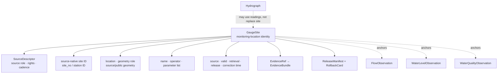

<!-- [KFM_META_BLOCK_V2]
doc_id: kfm://doc/contracts-domains-hydrology-gauge-site
title: Gauge Site Contract — Hydrology
type: semantic-contract
version: v0.2
status: draft; PROPOSED; schema-stub; NEEDS VERIFICATION before promotion
owners:
  - OWNER_TBD — Hydrology domain steward
  - OWNER_TBD — Observation steward
  - OWNER_TBD — Contracts steward
  - OWNER_TBD — Source steward
  - OWNER_TBD — Evidence steward
  - OWNER_TBD — Schema steward
  - OWNER_TBD — Policy steward
  - OWNER_TBD — Release steward
  - OWNER_TBD — Docs steward
created: 2026-06-22
updated: 2026-06-22
policy_label: public-with-gates; semantic-contract; hydrology; gauge-site; monitoring-location; observed-role; station-identity; time-aware; evidence-bound; release-gated; rollback-aware; not-for-life-safety
tags: [kfm, contracts, hydrology, gauge-site, GaugeSite, monitoring-location, NWIS, station, site_no, source-role, observed, administrative, FlowObservation, WaterLevelObservation, WaterQualityObservation, EvidenceBundle, ReleaseManifest, RollbackCard]
related:
  - ./README.md
  - ./decision_envelope.md
  - ./domain_feature_identity.md
  - ./domain_layer_descriptor.md
  - ./domain_observation.md
  - ./domain_validation_report.md
  - ./evidence_bundle.md
  - ./flow_observation.md
  - ./water_level_observation.md
  - ./water_quality_observation.md
  - ../../../docs/domains/hydrology/OBJECT_FAMILIES.md
  - ../../../docs/domains/hydrology/SOURCE_ROLE_MATRIX.md
  - ../../../docs/domains/hydrology/GLOSSARY.md
  - ../../../docs/domains/hydrology/API_CONTRACTS.md
  - ../../../docs/domains/hydrology/README.md
  - ../../../docs/domains/hydrology/IDENTITY_MODEL.md
  - ../../../schemas/contracts/v1/domains/hydrology/gauge_site.schema.json
  - ../../../policy/domains/hydrology/
  - ../../../fixtures/domains/hydrology/gauge_site/
  - ../../../tests/domains/hydrology/test_gauge_site.*
  - ../../../data/registry/sources/hydrology/
  - ../../../release/candidates/hydrology/
notes:
  - "Expanded from a thin scaffold at contracts/domains/hydrology/gauge_site.md."
  - "The paired schema exists at schemas/contracts/v1/domains/hydrology/gauge_site.schema.json, but it remains a PROPOSED scaffold with empty properties and additionalProperties=true."
  - "Hydrology object-family doctrine defines GaugeSite as a monitoring-location identity and metadata object; readings are separate FlowObservation, WaterLevelObservation, and WaterQualityObservation objects."
  - "GaugeSite may be observed site-of-record context and may also carry administrative registry context; it must not be treated as a measurement, forecast, regulatory flood determination, public layer, or life-safety authority."
[/KFM_META_BLOCK_V2] -->

# Gauge Site Contract — Hydrology

> Semantic contract for `GaugeSite`: a Hydrology monitoring-location identity and metadata object that anchors observed readings without becoming the readings themselves, a forecast, regulatory determination, public layer, or emergency authority.

  
  
  
  
  
  

`contracts/domains/hydrology/gauge_site.md`

## Quick jumps

[Status](#status) · [Meaning](#meaning) · [Repo fit](#repo-fit) · [Schema posture](#schema-posture) · [GaugeSite boundaries](#gaugesite-boundaries) · [Assertions](#assertions) · [Exclusions](#exclusions) · [Recommended fields](#recommended-fields) · [Source-role rules](#source-role-rules) · [Temporal rules](#temporal-rules) · [Evidence and citation posture](#evidence-and-citation-posture) · [Sensitivity and publication](#sensitivity-and-publication) · [Lifecycle](#lifecycle) · [Validation](#validation) · [Rollback](#rollback) · [Evidence basis](#evidence-basis) · [Open questions](#open-questions)

---

## Status

> [!IMPORTANT]
> **Status:** `draft` / semantic contract  
> **Contract path:** `contracts/domains/hydrology/gauge_site.md`  
> **Schema path:** `schemas/contracts/v1/domains/hydrology/gauge_site.schema.json`  
> **Schema posture:** paired schema exists, but remains a `PROPOSED` scaffold with empty `properties` and `additionalProperties: true`.  
> **Truth posture:** Hydrology docs define `GaugeSite` as a monitoring-location identity and metadata object. Field-level schema shape, validators, fixtures, policy enforcement, runtime route behavior, emitted EvidenceBundles, release manifests, and UI behavior remain **NEEDS VERIFICATION**.

> [!CAUTION]
> `GaugeSite` is the site/station identity. `FlowObservation`, `WaterLevelObservation`, and `WaterQualityObservation` are separate reading objects. Do not collapse the station into a reading, forecast, NFHL/regulatory context, modeled hydrograph, public layer, or life-safety guidance.

---

## Meaning

`GaugeSite` represents a Hydrology monitoring-location identity and its source-provided metadata.

It may describe a site/station such as a USGS NWIS monitoring location, state monitoring station, or other admissible Hydrology gauge site. It normally carries source-native station identity, name, location, operator/source family, parameter availability, temporal coverage, source role, evidence, rights, sensitivity, release state, correction lineage, and rollback target.

A `GaugeSite` can anchor downstream readings, but it is not itself the reading.

Typical downstream references:

- `FlowObservation` for discharge / streamflow readings;
- `WaterLevelObservation` for stage / gage-height readings;
- `WaterQualityObservation` for parameter measurements;
- `Hydrograph` for observed or modeled series views that cite site-linked inputs;
- `domain_layer_descriptor` for public-safe site/layer presentation;
- `EvidenceBundle` for cited support.

---

## Repo fit

| Responsibility | Path or root | This contract's role |
|---|---|---|
| Human-readable object meaning | `contracts/domains/hydrology/gauge_site.md` | This file; semantic contract for GaugeSite. |
| Machine schema | `schemas/contracts/v1/domains/hydrology/gauge_site.schema.json` | Confirmed scaffold; full field shape is not enforced yet. |
| Observation envelope | `contracts/domains/hydrology/domain_observation.md` | Shared observation semantics; readings stay separate from site identity. |
| Flow readings | `contracts/domains/hydrology/flow_observation.md` | Discharge/streamflow readings that may reference a GaugeSite. |
| Stage readings | `contracts/domains/hydrology/water_level_observation.md` | Stage/gage-height readings that may reference a GaugeSite. |
| Water-quality readings | `contracts/domains/hydrology/water_quality_observation.md` | Parameter measurements that may reference a GaugeSite. |
| Evidence bundle | `contracts/domains/hydrology/evidence_bundle.md` | Hydrology alias of shared EvidenceBundle support. |
| Feature identity | `contracts/domains/hydrology/domain_feature_identity.md` | Stable ID/spec_hash/source/time/digest companion. |
| Layer descriptor | `contracts/domains/hydrology/domain_layer_descriptor.md` | Public delivery descriptor; not site truth. |
| Decision envelope | `contracts/domains/hydrology/decision_envelope.md` | Runtime finite outcomes. |
| Object catalog | `docs/domains/hydrology/OBJECT_FAMILIES.md` | Defines GaugeSite purpose and typical identity anchor. |
| Source-role matrix | `docs/domains/hydrology/SOURCE_ROLE_MATRIX.md` | Defines valid observed/admin bases and prove/cannot-prove rules. |
| Policy | `policy/domains/hydrology/` | Expected source-role, rights, sensitivity, release, and public-exposure gates. |
| Release | `release/candidates/hydrology/` and release roots | ReleaseManifest, CorrectionNotice, RollbackCard, and promotion decisions. |

---

## Schema posture

| Schema fact | Current posture |
|---|---|
| Confirmed schema path | `schemas/contracts/v1/domains/hydrology/gauge_site.schema.json` |
| Schema status | `PROPOSED` |
| Schema title | `Gauge Site` |
| Visible properties | Empty object |
| Required fields | None visible in scaffold |
| Additional properties | `true` |
| Contract pointer | `contracts/domains/hydrology/gauge_site.md` |
| Source doc pointer | `docs/domains/hydrology/CANONICAL_PATHS.md` |
| Full GaugeSite enforcement | NEEDS VERIFICATION |

This Markdown contract defines intended semantics for review and schema design. The current schema does not enforce source role, site number, station name, geometry, operator, parameter list, temporal coverage, evidence, policy, release, correction, or rollback fields.

---

## GaugeSite boundaries

A GaugeSite identifies the monitoring location. The readings are separate observation objects. A site may have no active reading, multiple parameters, provisional readings, corrected readings, and changing metadata over time.

---

## Assertions

A reviewed `GaugeSite` should assert:

1. **Site identity** — stable ID and `spec_hash` over source, site ID, object role, temporal scope, and normalized digest.
2. **SourceDescriptor link** — source family, source role, rights, cadence, authority, and citation are resolvable.
3. **Source-native ID** — site number, station ID, or registry identifier is preserved.
4. **Location posture** — source geometry, public geometry, CRS, and generalized/restricted geometry roles are distinct.
5. **Metadata posture** — site name, operator, parameter availability, and status are preserved where source provides them.
6. **Temporal separation** — source/valid/retrieval/release/correction times are distinct. Site metadata time is not observation time.
7. **Observation separation** — `FlowObservation`, `WaterLevelObservation`, and `WaterQualityObservation` reference the site rather than being embedded as site truth.
8. **Evidence closure** — public/consequential site claims resolve EvidenceRef to EvidenceBundle or abstain.
9. **Policy/release support** — rights, sensitivity, review if needed, ReleaseManifest, CorrectionNotice path, and RollbackCard are present before public release.
10. **Correction lineage** — changed site metadata, location, operator, activity status, or source role can invalidate downstream observations/layers where material.

---

## Exclusions

| Misuse | Why it is denied or abstained |
|---|---|
| Site identity as flow/stage/water-quality reading | Readings are separate observation objects with their own time/value/unit/qualifier. |
| GaugeSite as forecast or flood warning | Site metadata is not forecast guidance or emergency authority. |
| NFHL regulatory zone as GaugeSite | NFHL is regulatory context, not a monitoring location. |
| Modeled hydrograph as GaugeSite | Hydrograph is derived series; site identity remains separate. |
| HUC/watershed aggregate as GaugeSite | Aggregate unit is not station identity. |
| Administrative roster as observed reading | A registry may help identify a site but does not prove a measurement. |
| Candidate site as public GaugeSite | Candidate remains WORK/QUARANTINE until governed admission/review/promotion. |
| AI summary as evidence | AI is interpretive; EvidenceBundle is required. |
| Public direct read from RAW/WORK/QUARANTINE | Public clients use governed APIs and released artifacts only. |
| Public layer as GaugeSite truth | Layer descriptors and tiles are delivery surfaces, not canonical site identity. |

---

## Recommended fields

The following fields are **PROPOSED** targets for future schema expansion. They are not enforced by the current schema scaffold.

| Field | Meaning |
|---|---|
| `id` | Canonical GaugeSite ID. |
| `version` | Contract/object version. |
| `spec_hash` | Deterministic digest over normalized site semantics. |
| `domain` | Must resolve to `hydrology`. |
| `object_type` | `GaugeSite`. |
| `source_descriptor_ref` | SourceDescriptor identity, role, rights, cadence, attribution, authority limits. |
| `source_record_ref` | Source-native site/registry record or stable handle. |
| `source_role` | Observed site-of-record context, administrative registry context, or accepted profile. |
| `site_id` | Source-native station/site number, such as `site_no` where applicable. |
| `site_name` | Source-provided site/station name. |
| `operator_or_agency` | Operating agency or data provider. |
| `parameter_refs` | Available parameter/series references, not embedded readings. |
| `site_status` | active, inactive, discontinued, provisional, unknown, or accepted enum. |
| `source_time` | Source publication/update/assertion time for site metadata. |
| `valid_time` | Validity interval for site metadata where source provides it. |
| `retrieval_time` | KFM fetch time; never substitutes for reading time. |
| `release_time` | KFM release time; never source truth. |
| `correction_time` | Correction/supersession time. |
| `spatial_scope_ref` | Site geometry or generalized public geometry reference. |
| `geometry_role` | source_exact, exact_internal, generalized_public, withheld, restricted, or accepted enum. |
| `linked_observation_refs` | Optional outbound refs to Flow/WaterLevel/WaterQuality observations; not embedded truth. |
| `evidence_ref_ids` | EvidenceRefs supporting site metadata claims. |
| `evidence_bundle_ids` | EvidenceBundles supporting public claims. |
| `policy_decision_refs` | Policy decisions controlling exposure/release. |
| `review_record_refs` | Steward/sensitivity review decisions where needed. |
| `release_refs` | ReleaseManifest/PromotionDecision refs if public. |
| `correction_refs` | CorrectionNotice/supersession refs. |
| `rollback_refs` | RollbackCard/rollback target refs. |
| `quality_flags` | schema_scaffold, missing_source_role, missing_site_id, missing_geometry_role, missing_evidence, site_metadata_stale, candidate_public_exposure, site_reading_collapse, release_missing. |

---

## Source-role rules

| Source role | GaugeSite handling |
|---|---|
| `observed` | Valid site-of-record context for monitoring locations; may anchor readings. |
| `administrative` | May support registry/site identity context; must not become a reading. |
| `candidate` | Allowed only before admission/promotion. No public GaugeSite until reviewed/promoted. |
| `modeled` | Not valid as GaugeSite identity. Modeled surfaces/series belong elsewhere. |
| `regulatory` | Not valid as GaugeSite identity unless a separate source context explicitly defines monitoring-location regulation; NFHL remains flood context. |
| `aggregate` | Not a site identity; may support summaries only. |
| `synthetic` | Not admitted source truth; cannot serve as GaugeSite evidence. |

---

## Temporal rules

| Time field | Rule |
|---|---|
| `source_time` | Required where source update/publication time matters for site metadata. |
| `valid_time` | Required where source supplies site-valid/effective window. |
| `retrieval_time` | KFM fetch time; not site truth by itself. |
| `release_time` | KFM publication time; not source truth. |
| `correction_time` | Correction lineage for site metadata/location/status changes. |
| `observed_time` | Belongs to linked observation objects, not the site identity, unless source explicitly observes the site-status event. |

Site metadata times and reading times must not be collapsed. A station can exist across many reading windows.

---

## Evidence and citation posture

A public or consequential GaugeSite claim requires EvidenceBundle support.

| Claim | Required support |
|---|---|
| “This station/site exists and is a Hydrology GaugeSite.” | EvidenceBundle with source record, site ID, source family, citation, rights, sensitivity, and checksum. |
| “This site provides discharge/stage/water-quality parameters.” | EvidenceBundle or source-record support for parameter availability; individual readings remain separate. |
| “This site appears on a public layer.” | EvidenceBundle + PolicyDecision + ReleaseManifest + layer descriptor + rollback target. |
| “This site is active/inactive/discontinued.” | Source metadata and source/valid time must support the status. |

A popup, layer, chart, or AI answer may reference GaugeSite, but it does not replace EvidenceBundle support.

---

## Sensitivity and publication

GaugeSite metadata is often public-safe, but public release still depends on rights, source terms, geometry posture, and joined context. Review or restriction may be required when site data is joined with:

- infrastructure assets, intakes, dams, utilities, bridges, levees, or critical facilities;
- exact private-property, land/title, owner, or living-person-adjacent data;
- groundwater/private well records or sensitive water-supply infrastructure;
- emergency/flood-warning interpretation;
- drought/irrigation/water-use claims that imply per-place certainty;
- unreleased candidate records or restricted source terms.

Public release should preserve site-vs-reading separation and avoid life-safety framing.

---

## Lifecycle

| Phase | GaugeSite handling |
|---|---|
| RAW | Capture source payload/ref, source role, source-native site ID, name/location/status/parameter metadata, source times, geometry, and rights/sensitivity metadata. |
| WORK / QUARANTINE | Normalize site ID, name, source role, geometry role, parameter refs, temporal scope, and evidence refs; quarantine missing source role/site ID/evidence, rights gaps, or site-reading collapse. |
| PROCESSED | Emit validated GaugeSite candidate with EvidenceRef, ValidationReport, source-role posture, and quality flags. |
| CATALOG / TRIPLET | Catalog/triplet projections cite the site by identity and evidence; projections do not become truth. |
| RELEASE CANDIDATE | Public-safe derivative resolves EvidenceBundle, PolicyDecision, ReviewRecord if needed, ReleaseManifest, CorrectionNotice path, and RollbackCard. |
| PUBLISHED | Governed API/UI may serve released public-safe site metadata or derivative; public clients do not read RAW/WORK/QUARANTINE directly. |
| CORRECTED / SUPERSEDED | Source correction, site status change, location correction, parameter-list correction, role correction, or policy change creates correction/supersession lineage and invalidates affected derivatives. |

---

## Validation

Before this contract is promoted beyond draft:

- [ ] Expand `schemas/contracts/v1/domains/hydrology/gauge_site.schema.json` beyond empty `properties`.
- [ ] Decide required fields for source descriptor, source record, site ID, name, operator, geometry role, parameter refs, site status, source/valid/retrieval/release/correction times, evidence refs, policy refs, release refs, and rollback refs.
- [ ] Confirm whether GaugeSite inherits from or profiles `domain_feature_identity` and how it links to `domain_observation` families.
- [ ] Add positive fixtures for NWIS-style station identity, active/inactive site, site with discharge/stage parameters, corrected site metadata, and released public-safe site layer entry.
- [ ] Add negative fixtures for reading embedded as GaugeSite truth, modeled hydrograph as site, NFHL/regulatory context as site, aggregate HUC rollup as site, administrative roster as measurement, candidate public exposure, AI-summary-as-evidence, missing site ID, missing EvidenceBundle, and direct RAW/WORK public access.
- [ ] Add validator coverage for source role, SourceDescriptor, site ID, geometry role, parameter refs, temporal fields, evidence, policy, release, correction, and rollback.
- [ ] Confirm public API/UI uses `decision_envelope` outcomes and never silently falls through to raw source or generic AI answer.

Recommended finite outcomes:

| Condition | Outcome |
|---|---|
| Site identity, source role, source record, geometry, evidence, policy, release, correction, and rollback resolve | `ANSWER` or release-eligible reference |
| Evidence, site ID, geometry, rights, temporal scope, parameter support, or release support is incomplete | `ABSTAIN` / `HOLD` |
| Site-reading collapse, candidate public exposure, synthetic-as-observed, sensitive join, life-safety framing, or direct RAW/WORK read would occur | `DENY` |
| Schema, validator, source read, evidence lookup, policy lookup, release lookup, or canonicalization fails | `ERROR` |

---

## Rollback

Rollback is required when GaugeSite handling weakens site identity, source-role integrity, geometry/source metadata correctness, evidence closure, policy/release state, or correction lineage.

Rollback triggers include station/site identity merged with readings; FlowObservation/WaterLevelObservation/WaterQualityObservation embedded as GaugeSite truth; modeled hydrograph published as site identity; NFHL/regulatory context published as site; aggregate HUC rollup published as site; administrative site roster published as measurement; candidate site reaches public surface; AI summary treated as evidence; site ID/location/status/parameter list omitted or wrong; source/valid/retrieval/release/correction times collapsed; public API/UI reads RAW/WORK/QUARANTINE directly; source correction changes site metadata/location/status; or release lacks EvidenceBundle, PolicyDecision, ReleaseManifest, CorrectionNotice path, and RollbackCard.

Rollback artifacts should include affected GaugeSite IDs, linked observation refs, source descriptors, source-native site refs, parameter refs, site metadata, temporal scope, geometry refs, EvidenceRefs/EvidenceBundles, ValidationReports, PolicyDecisions, ReviewRecords, ReleaseManifests, CorrectionNotices, RollbackCards, invalidated observations, invalidated hydrographs, invalidated layer descriptors, invalidated decision envelopes, invalidated exports, and public-cache/style invalidation instructions.

---

## Evidence basis

| Source | Status | Supports | Limits |
|---|---|---|---|
| `contracts/domains/hydrology/gauge_site.md` scaffold | CONFIRMED | Target existed as a planned scaffold from Hydrology canonical paths. | Did not contain authoritative GaugeSite semantics. |
| `schemas/contracts/v1/domains/hydrology/gauge_site.schema.json` | CONFIRMED | Paired schema exists and points to this contract. | Empty `properties`; no field enforcement. |
| `docs/domains/hydrology/OBJECT_FAMILIES.md` | CONFIRMED | Defines GaugeSite as monitoring-location identity and metadata; readings are separate objects. | Concrete attributes are labeled inferred/proposed until schema realization. |
| `docs/domains/hydrology/GLOSSARY.md` | CONFIRMED | Defines GaugeSite, source-role vocabulary, and USGS/NWIS observed source role context. | Field realization remains PROPOSED. |
| `docs/domains/hydrology/SOURCE_ROLE_MATRIX.md` | CONFIRMED | GaugeSite can be built from observed and administrative site-registry bases; USGS Water Data / NWIS may prove GaugeSite but not NFHL/regulatory/emergency authority. | Machine enforcement requires SourceDescriptor, EvidenceBundle, policy, fixtures, and validators. |
| `docs/domains/hydrology/API_CONTRACTS.md` | CONFIRMED | Public paths, finite outcomes, EvidenceBundle/CitationValidationReport gates, and no direct RAW/WORK/QUARANTINE/public candidate access. | Routes/DTOs/runtime implementation remain PROPOSED / NEEDS VERIFICATION. |
| `contracts/domains/hydrology/domain_observation.md` | CONFIRMED | Shared observation-envelope boundaries and site-vs-reading separation. | Semantic contract, not schema enforcement. |
| User-provided authoring role | CONFIRMED user instruction | Requires evidence-grounded, repo-ready Markdown and visible verification boundaries. | Authoring rule, not implementation proof. |

---

## Open questions

| Question | Status | Resolution path |
|---|---|---|
| Which exact fields must be required in `gauge_site.schema.json`? | NEEDS VERIFICATION | Schema steward + Hydrology observation steward review. |
| Should GaugeSite inherit from `domain_feature_identity`, `domain_observation`, or both through refs? | NEEDS VERIFICATION | Contract/schema design decision. |
| Which source-native site ID vocabularies are canonical beyond NWIS `site_no`? | NEEDS VERIFICATION | SourceDescriptor + schema/fixture review. |
| How should site activity status and parameter availability be normalized across sources? | NEEDS VERIFICATION | Source steward + validator review. |
| Which public geometry role is acceptable for each gauge/source family? | NEEDS VERIFICATION | Policy/sensitivity review. |
| Which validator proves readings cannot be embedded as GaugeSite truth? | NEEDS VERIFICATION | Negative fixtures and validator implementation. |

---

## Related contracts and docs

- [`./README.md`](./README.md) — Hydrology contract-root README.
- [`./domain_observation.md`](./domain_observation.md) — shared Hydrology observation envelope.
- [`./domain_feature_identity.md`](./domain_feature_identity.md) — feature identity and `spec_hash` companion.
- [`./domain_layer_descriptor.md`](./domain_layer_descriptor.md) — public layer descriptor, not site truth.
- [`./decision_envelope.md`](./decision_envelope.md) — runtime finite-outcome carrier.
- [`./evidence_bundle.md`](./evidence_bundle.md) — Hydrology EvidenceBundle alias.
- [`./flow_observation.md`](./flow_observation.md) — discharge/streamflow observation contract.
- [`./water_level_observation.md`](./water_level_observation.md) — sibling stage/gage-height observation contract, if present/expanded.
- [`./water_quality_observation.md`](./water_quality_observation.md) — sibling water-quality observation contract, if present/expanded.
- [`../../../docs/domains/hydrology/OBJECT_FAMILIES.md`](../../../docs/domains/hydrology/OBJECT_FAMILIES.md) — object-family catalog.
- [`../../../docs/domains/hydrology/SOURCE_ROLE_MATRIX.md`](../../../docs/domains/hydrology/SOURCE_ROLE_MATRIX.md) — source-role anti-collapse matrix.
- [`../../../docs/domains/hydrology/GLOSSARY.md`](../../../docs/domains/hydrology/GLOSSARY.md) — Hydrology vocabulary.
- [`../../../schemas/contracts/v1/domains/hydrology/gauge_site.schema.json`](../../../schemas/contracts/v1/domains/hydrology/gauge_site.schema.json) — current schema scaffold.

[Back to top](#top)
