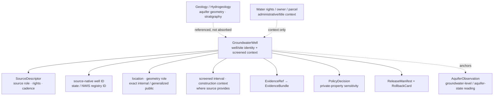

<!-- [KFM_META_BLOCK_V2]
doc_id: kfm://doc/contracts-domains-hydrology-groundwater-well
title: Groundwater Well Contract — Hydrology
type: semantic-contract
version: v0.2
status: draft; PROPOSED; schema-stub; NEEDS VERIFICATION before promotion
owners:
  - OWNER_TBD — Hydrology domain steward
  - OWNER_TBD — Groundwater/well steward
  - OWNER_TBD — Contracts steward
  - OWNER_TBD — Source steward
  - OWNER_TBD — Evidence steward
  - OWNER_TBD — Schema steward
  - OWNER_TBD — Policy steward
  - OWNER_TBD — Sensitivity reviewer
  - OWNER_TBD — Release steward
  - OWNER_TBD — Docs steward
created: 2026-06-22
updated: 2026-06-22
policy_label: public-with-gates; semantic-contract; hydrology; groundwater-well; well-identity; screened-interval; observed-role; administrative-context; private-property-risk; evidence-bound; release-gated; rollback-aware
tags: [kfm, contracts, hydrology, groundwater-well, GroundwaterWell, well-identity, screened-interval, aquifer-observation, groundwater, private-property, well-owner, source-role, observed, administrative, EvidenceBundle, RedactionReceipt, ReleaseManifest, RollbackCard]
related:
  - ./README.md
  - ./decision_envelope.md
  - ./domain_feature_identity.md
  - ./domain_layer_descriptor.md
  - ./domain_observation.md
  - ./domain_validation_report.md
  - ./evidence_bundle.md
  - ./aquifer_observation.md
  - ./water_level_observation.md
  - ../../../docs/domains/hydrology/OBJECT_FAMILIES.md
  - ../../../docs/domains/hydrology/GLOSSARY.md
  - ../../../docs/domains/hydrology/SOURCE_ROLE_MATRIX.md
  - ../../../docs/domains/hydrology/BOUNDARY.md
  - ../../../docs/domains/hydrology/API_CONTRACTS.md
  - ../../../docs/domains/hydrology/README.md
  - ../../../docs/domains/hydrology/IDENTITY_MODEL.md
  - ../../../schemas/contracts/v1/domains/hydrology/groundwater_well.schema.json
  - ../../../policy/domains/hydrology/
  - ../../../fixtures/domains/hydrology/groundwater_well/
  - ../../../tests/domains/hydrology/test_groundwater_well.*
  - ../../../data/registry/sources/hydrology/
  - ../../../release/candidates/hydrology/
notes:
  - "Expanded from a thin scaffold at contracts/domains/hydrology/groundwater_well.md."
  - "The paired schema exists at schemas/contracts/v1/domains/hydrology/groundwater_well.schema.json, but it remains a PROPOSED scaffold with empty properties and additionalProperties=true."
  - "Hydrology object-family doctrine defines GroundwaterWell as a well identity with screened-interval context and level observations; AquiferObservation remains the groundwater-level or aquifer-state observation object."
  - "GroundwaterWell is review-required because private-property and well-owner implications can arise; precise locations may require generalization/redaction and a RedactionReceipt before public release."
  - "Hydrology does not own aquifer geometry, water-right authority, parcel/title ownership, or emergency water-supply guidance."
[/KFM_META_BLOCK_V2] -->

# Groundwater Well Contract — Hydrology

> Semantic contract for `GroundwaterWell`: a Hydrology well/site identity object with screened-interval and groundwater context that can anchor groundwater-level and aquifer observations without exposing private-property-sensitive detail, absorbing Geology's aquifer-boundary authority, or becoming a water-right, parcel/title, public-layer, or emergency-guidance object.

  
  
  
  
  
  
  

`contracts/domains/hydrology/groundwater_well.md`

## Quick jumps

[Status](#status) · [Meaning](#meaning) · [Repo fit](#repo-fit) · [Schema posture](#schema-posture) · [GroundwaterWell boundaries](#groundwaterwell-boundaries) · [Assertions](#assertions) · [Exclusions](#exclusions) · [Recommended fields](#recommended-fields) · [Source-role rules](#source-role-rules) · [Temporal rules](#temporal-rules) · [Evidence and citation posture](#evidence-and-citation-posture) · [Sensitivity and publication](#sensitivity-and-publication) · [Lifecycle](#lifecycle) · [Validation](#validation) · [Rollback](#rollback) · [Evidence basis](#evidence-basis) · [Open questions](#open-questions)

---

## Status

> [!IMPORTANT]
> **Status:** `draft` / semantic contract  
> **Contract path:** `contracts/domains/hydrology/groundwater_well.md`  
> **Schema path:** `schemas/contracts/v1/domains/hydrology/groundwater_well.schema.json`  
> **Schema posture:** paired schema exists, but remains a `PROPOSED` scaffold with empty `properties` and `additionalProperties: true`.  
> **Truth posture:** Hydrology docs define `GroundwaterWell` as a well identity with screened-interval context and level observations. Field-level schema shape, validators, fixtures, policy enforcement, source-specific rights, sensitivity review, emitted EvidenceBundles, release manifests, and public API behavior remain **NEEDS VERIFICATION**.

> [!CAUTION]
> `GroundwaterWell` is a well/site identity and context object. `AquiferObservation` or other groundwater-level observations are separate reading objects. Private-property, well-owner, infrastructure, and sensitive groundwater joins fail closed or require review/generalization/redaction before public release.

---

## Meaning

`GroundwaterWell` represents a Hydrology well identity with source-provided location, construction or screened-interval context, registry/source metadata, and links to groundwater-level or aquifer-state observations.

It may describe:

- a state or NWIS well registry identity;
- a well/site of record for groundwater-level observations;
- source-provided screened interval, construction, or measurement-point context;
- public-safe generalized well context where precise location is restricted;
- a released derivative that points to `AquiferObservation` evidence without exposing private details.

It must stay separate from:

- `AquiferObservation`, which carries groundwater-level or aquifer-state readings;
- Geology/Hydrogeology aquifer geometry or stratigraphic interpretation;
- water-right, permit, allocation, owner, parcel, or title authority;
- modeled groundwater surfaces or aquifer reconstructions;
- public layer descriptors or tiles;
- AI summaries, policy decisions, release manifests, and emergency/water-supply guidance.

---

## Repo fit

| Responsibility | Path or root | This contract's role |
|---|---|---|
| Human-readable object meaning | `contracts/domains/hydrology/groundwater_well.md` | This file; semantic contract for GroundwaterWell. |
| Machine schema | `schemas/contracts/v1/domains/hydrology/groundwater_well.schema.json` | Confirmed scaffold; full field shape is not enforced yet. |
| Aquifer observation | `contracts/domains/hydrology/aquifer_observation.md` | Groundwater-level/aquifer-state observation contract; separate from well identity. |
| Observation envelope | `contracts/domains/hydrology/domain_observation.md` | Shared observation semantics and role boundaries. |
| Evidence bundle | `contracts/domains/hydrology/evidence_bundle.md` | Hydrology alias of shared EvidenceBundle support. |
| Feature identity | `contracts/domains/hydrology/domain_feature_identity.md` | Stable ID/spec_hash/source/time/digest companion. |
| Layer descriptor | `contracts/domains/hydrology/domain_layer_descriptor.md` | Public delivery descriptor; not well truth. |
| Decision envelope | `contracts/domains/hydrology/decision_envelope.md` | Runtime finite outcomes. |
| Object catalog | `docs/domains/hydrology/OBJECT_FAMILIES.md` | Defines GroundwaterWell purpose, identity anchor, and sensitivity posture. |
| Source-role matrix | `docs/domains/hydrology/SOURCE_ROLE_MATRIX.md` | Defines observed/admin bases and groundwater source-family boundaries. |
| Boundary doctrine | `docs/domains/hydrology/BOUNDARY.md` | Confirms Hydrology boundary and outside authorities. |
| Policy | `policy/domains/hydrology/` | Expected private-property, sensitivity, rights, release, and public-exposure gates. |
| Release | `release/candidates/hydrology/` and release roots | ReleaseManifest, CorrectionNotice, RollbackCard, and promotion decisions. |

---

## Schema posture

| Schema fact | Current posture |
|---|---|
| Confirmed schema path | `schemas/contracts/v1/domains/hydrology/groundwater_well.schema.json` |
| Schema status | `PROPOSED` |
| Schema title | `Groundwater Well` |
| Visible properties | Empty object |
| Required fields | None visible in scaffold |
| Additional properties | `true` |
| Contract pointer | `contracts/domains/hydrology/groundwater_well.md` |
| Source doc pointer | `docs/domains/hydrology/CANONICAL_PATHS.md` |
| Full GroundwaterWell enforcement | NEEDS VERIFICATION |

This Markdown contract defines intended semantics for review and schema design. The current schema does not enforce well identity, screened interval, aquifer context, geometry role, source role, EvidenceBundle refs, policy refs, release refs, correction refs, or rollback refs.

---

## GroundwaterWell boundaries

A GroundwaterWell identifies the well or site of record. It may anchor groundwater observations and cite aquifer context, but it does not define the aquifer body, water right, ownership, parcel boundary, or public-safe location by itself.

---

## Assertions

A reviewed `GroundwaterWell` should assert:

1. **Well identity** — stable ID and `spec_hash` over source, well ID, object role, temporal scope, geometry/source record, and normalized digest.
2. **SourceDescriptor link** — source family, source role, rights, cadence, authority, citation, and redistribution posture are resolvable.
3. **Source-native ID** — state/NWIS well registry ID or monitoring-site identifier is preserved.
4. **Screened/construction context** — screened interval, measuring point, completion context, and construction metadata are preserved when source supplies them.
5. **Observation separation** — `AquiferObservation` or groundwater-level readings reference the well rather than being embedded as well truth.
6. **Geology boundary** — aquifer geometry and hydrogeologic interpretation are referenced cross-lane; Hydrology does not silently own them.
7. **Administrative boundary** — water-right, permit, allocation, owner, parcel, and title claims remain administrative/cross-lane context.
8. **Geometry posture** — exact internal geometry, public/generalized geometry, withheld geometry, and restricted geometry are distinct.
9. **Sensitivity posture** — private-property and well-owner inference risks are policy-reviewed, generalized, redacted, or denied.
10. **Release/rollback support** — public derivatives require EvidenceBundle, PolicyDecision/ReviewRecord where needed, ReleaseManifest, CorrectionNotice path, and RollbackCard.

---

## Exclusions

| Misuse | Why it is denied or abstained |
|---|---|
| Well identity as groundwater-level reading | `AquiferObservation` carries the reading; the well anchors it. |
| Well registry row as observed aquifer-state claim | Administrative/site identity is not a measurement unless separately evidenced. |
| GroundwaterWell as aquifer geometry | Geology/Hydrogeology owns aquifer geometry and stratigraphic interpretation. |
| GroundwaterWell as water-right or ownership claim | Water-right/owner/parcel/title authority belongs to administrative/title lanes. |
| Exact private-well location as public default | Private-property/well-owner implications require review/generalization/redaction. |
| Modeled groundwater surface as GroundwaterWell | Modeled surfaces require model/run/uncertainty and separate object family. |
| Aggregate aquifer summary as individual well fact | Aggregate scope cannot prove per-well state. |
| Candidate well as public GroundwaterWell | Candidate remains WORK/QUARANTINE until governed promotion. |
| AI summary as evidence | AI is interpretive; EvidenceBundle is required. |
| Emergency or water-supply instruction | KFM Hydrology is not life-safety or operational guidance. |

---

## Recommended fields

The following fields are **PROPOSED** targets for future schema expansion. They are not enforced by the current schema scaffold.

| Field | Meaning |
|---|---|
| `id` | Canonical GroundwaterWell ID. |
| `version` | Contract/object version. |
| `spec_hash` | Deterministic digest over normalized well semantics. |
| `domain` | Must resolve to `hydrology`. |
| `object_type` | `GroundwaterWell`. |
| `source_descriptor_ref` | SourceDescriptor identity, role, rights, cadence, attribution, authority limits. |
| `source_record_ref` | Source-native well registry record or stable handle. |
| `source_role` | Observed site-of-record context, administrative registry context, or accepted profile. |
| `well_id` | State/NWIS/source-native well ID. |
| `well_name_or_label` | Source-provided label if allowed. |
| `operator_or_agency` | Operating/reporting agency or source provider where source supplies it. |
| `aquifer_context_ref` | Cross-lane aquifer/hydrogeologic context ref; not owned by Hydrology. |
| `screened_interval` | Screened interval/depth range where source supplies it. |
| `measuring_point_ref` | Measuring point/reference datum if source supplies it. |
| `well_status` | active, inactive, abandoned, monitoring, unknown, or accepted enum. |
| `linked_aquifer_observation_refs` | Outbound refs to AquiferObservation records; not embedded truth. |
| `source_time` | Source publication/update/assertion time for well metadata. |
| `valid_time` | Validity interval for well metadata where source provides it. |
| `retrieval_time` | KFM fetch time; never substitutes for observation time. |
| `release_time` | KFM release time; never source truth. |
| `correction_time` | Correction/supersession time. |
| `spatial_scope_ref` | Exact/internal, generalized, withheld, or aggregate public geometry reference. |
| `geometry_role` | exact_internal, source_exact, generalized_public, aggregate_public, withheld, restricted, or accepted enum. |
| `redaction_receipt_ref` | Redaction/generalization receipt where precise location is hidden or altered. |
| `evidence_ref_ids` | EvidenceRefs supporting well metadata claims. |
| `evidence_bundle_ids` | EvidenceBundles supporting public claims. |
| `policy_decision_refs` | Policy decisions controlling exposure/release. |
| `review_record_refs` | Steward/sensitivity review decisions where needed. |
| `release_refs` | ReleaseManifest/PromotionDecision refs if public. |
| `correction_refs` | CorrectionNotice/supersession refs. |
| `rollback_refs` | RollbackCard/rollback target refs. |
| `quality_flags` | schema_scaffold, missing_source_role, missing_well_id, missing_geometry_role, private_property_risk, owner_inference_risk, missing_redaction_receipt, aquifer_boundary_overclaim, release_missing. |

---

## Source-role rules

| Source role | GroundwaterWell handling |
|---|---|
| `observed` | Valid for well/site-of-record or reported groundwater measurement context where source supports it. |
| `administrative` | Valid for well registry/site identity context; must not become a measurement by itself. |
| `candidate` | Allowed only before admission/promotion. No public GroundwaterWell until reviewed/promoted. |
| `modeled` | Not valid as well identity. Modeled groundwater surfaces belong in modeled derivative contracts. |
| `regulatory` | Not valid as observed well record unless the source is explicitly a regulatory/admin well context and policy allows that role. |
| `aggregate` | Not an individual well identity; may support summaries only. |
| `synthetic` | Not admitted source truth; cannot serve as GroundwaterWell evidence. |

---

## Temporal rules

| Time field | Rule |
|---|---|
| `source_time` | Required where source update/publication time matters for well metadata. |
| `valid_time` | Required where source supplies a valid/effective well-status or registry window. |
| `retrieval_time` | KFM fetch time; not well truth by itself. |
| `release_time` | KFM publication time; not source truth. |
| `correction_time` | Correction lineage for well metadata, status, location, screened interval, or public geometry changes. |
| `observed_time` | Belongs to linked AquiferObservation or other measurement objects, not well identity, unless source explicitly observes a well-status event. |

Well metadata times and groundwater-level observation times must not be collapsed.

---

## Evidence and citation posture

A public or consequential GroundwaterWell claim requires EvidenceBundle support.

| Claim | Required support |
|---|---|
| “This well/site exists as a Hydrology GroundwaterWell.” | EvidenceBundle with source record, well ID, source family, citation, rights, sensitivity, and checksum. |
| “This well has screened interval/context X.” | Source record or EvidenceBundle with screened/construction context and caveats. |
| “This well is linked to aquifer context Y.” | EvidenceBundle plus cross-lane aquifer context ref; Hydrology does not own aquifer geometry. |
| “This well appears on a public layer.” | EvidenceBundle + PolicyDecision + ReviewRecord/RedactionReceipt where needed + ReleaseManifest + layer descriptor + rollback target. |
| “This well has observation Z.” | Link to AquiferObservation or observation object; reading is not embedded as well truth. |

A popup, layer, chart, export, or AI answer may reference GroundwaterWell, but it does not replace EvidenceBundle support or public-release review.

---

## Sensitivity and publication

GroundwaterWell is a **review-required** class because well location and metadata can imply private-property, owner, resource, infrastructure, or water-supply information.

Publication must fail closed or require review/generalization/redaction when the record exposes or enables:

- private well location or owner/parcel inference;
- land/title or living-person-adjacent joins;
- water-supply, intake, utility, or infrastructure vulnerability;
- exact screened interval or aquifer context with sensitive operational implications;
- drought/irrigation/water-use claims that imply per-place certainty;
- restricted source terms or unclear redistribution rights;
- cross-lane ecological, archaeological, cultural, or security-sensitive exposure.

Public derivatives should prefer generalized or aggregate geometry when precise location is not necessary. If geometry is generalized/redacted, the transform and reason should be recorded with a redaction/generalization receipt.

---

## Lifecycle

| Phase | GroundwaterWell handling |
|---|---|
| RAW | Capture source payload/ref, source role, source-native well ID, metadata, screened interval, location, status, source times, and rights/sensitivity metadata. |
| WORK / QUARANTINE | Normalize well ID, source role, geometry role, aquifer-context refs, screened interval, temporal scope, and evidence refs; quarantine missing source role/well ID/evidence, rights gaps, private-property risk, or aquifer-boundary overclaim. |
| PROCESSED | Emit validated GroundwaterWell candidate with EvidenceRef, ValidationReport, source-role posture, geometry/redaction posture, and quality flags. |
| CATALOG / TRIPLET | Catalog/triplet projections cite the well by identity and evidence; projections do not become truth. |
| RELEASE CANDIDATE | Public-safe derivative resolves EvidenceBundle, PolicyDecision, ReviewRecord/RedactionReceipt where needed, ReleaseManifest, CorrectionNotice path, and RollbackCard. |
| PUBLISHED | Governed API/UI may serve released public-safe well context or derivative; public clients do not read RAW/WORK/QUARANTINE directly. |
| CORRECTED / SUPERSEDED | Source correction, status change, location correction, screened-interval correction, aquifer-context correction, redaction change, or policy change creates correction/supersession lineage and invalidates affected derivatives. |

---

## Validation

Before this contract is promoted beyond draft:

- [ ] Expand `schemas/contracts/v1/domains/hydrology/groundwater_well.schema.json` beyond empty `properties`.
- [ ] Decide required fields for source descriptor, source record, well ID, geometry role, aquifer context ref, screened interval, measuring point, status, source/valid/retrieval/release/correction times, evidence refs, policy refs, redaction refs, release refs, and rollback refs.
- [ ] Confirm whether GroundwaterWell inherits from or profiles `domain_feature_identity` and how it links to `AquiferObservation`.
- [ ] Add positive fixtures for state/NWIS well identity, generalized public well, well with screened interval, well with linked AquiferObservation, corrected well metadata, and released public-safe well layer entry.
- [ ] Add negative fixtures for groundwater-level reading embedded as well truth, aquifer geometry absorbed into Hydrology, private well exact public exposure, owner/parcel inference, modeled groundwater surface as well, aggregate aquifer summary as well, candidate public exposure, AI-summary-as-evidence, missing well ID, missing EvidenceBundle, missing redaction receipt, and direct RAW/WORK public access.
- [ ] Add validator coverage for source role, SourceDescriptor, well ID, aquifer context, screened interval, geometry role, sensitivity, redaction/generalization receipt, evidence, policy, release, correction, and rollback.
- [ ] Confirm public API/UI uses `decision_envelope` outcomes and never silently falls through to raw source or generic AI answer.

Recommended finite outcomes:

| Condition | Outcome |
|---|---|
| Well identity, source role, source record, geometry/sensitivity posture, evidence, policy, review/redaction, release, correction, and rollback resolve | `ANSWER` or release-eligible reference |
| Evidence, well ID, geometry, rights, temporal scope, aquifer context, review, redaction receipt, or release support is incomplete | `ABSTAIN` / `HOLD` |
| Private-property exposure, owner/parcel inference, aquifer-boundary overclaim, candidate public exposure, synthetic-as-observed, life-safety framing, or direct RAW/WORK read would occur | `DENY` |
| Schema, validator, source read, evidence lookup, policy lookup, release lookup, redaction lookup, or canonicalization fails | `ERROR` |

---

## Rollback

Rollback is required when GroundwaterWell handling weakens well identity, source-role integrity, private-property protection, aquifer-boundary separation, evidence closure, policy/release state, or correction lineage.

Rollback triggers include well identity merged with AquiferObservation readings; exact private well location exposed publicly without review; owner/parcel inference exposed; aquifer geometry or hydrogeologic interpretation claimed as Hydrology-owned truth; modeled groundwater surface published as well identity; aggregate aquifer summary published as individual well; administrative registry row published as groundwater-level measurement; candidate well reaches public surface; AI summary treated as evidence; well ID/location/status/screened interval omitted or wrong; source/valid/retrieval/release/correction times collapsed; redaction/generalization receipt missing; public API/UI reads RAW/WORK/QUARANTINE directly; source correction changes well metadata/location/status; or release lacks EvidenceBundle, PolicyDecision, ReleaseManifest, CorrectionNotice path, and RollbackCard.

Rollback artifacts should include affected GroundwaterWell IDs, linked AquiferObservation refs, aquifer context refs, source descriptors, source-native well refs, screened-interval metadata, status, temporal scope, geometry/redaction refs, EvidenceRefs/EvidenceBundles, ValidationReports, PolicyDecisions, ReviewRecords, RedactionReceipts, ReleaseManifests, CorrectionNotices, RollbackCards, invalidated observations, invalidated layer descriptors, invalidated decision envelopes, invalidated exports, and public-cache/style invalidation instructions.

---

## Evidence basis

| Source | Status | Supports | Limits |
|---|---|---|---|
| `contracts/domains/hydrology/groundwater_well.md` scaffold | CONFIRMED | Target existed as a planned scaffold from Hydrology canonical paths. | Did not contain authoritative GroundwaterWell semantics. |
| `schemas/contracts/v1/domains/hydrology/groundwater_well.schema.json` | CONFIRMED | Paired schema exists and points to this contract. | Empty `properties`; no field enforcement. |
| `docs/domains/hydrology/OBJECT_FAMILIES.md` | CONFIRMED | Defines GroundwaterWell as well identity with screened-interval context and level observations; review-required with private-property/well-owner implications. | Concrete attributes are labeled inferred/proposed until schema realization. |
| `docs/domains/hydrology/GLOSSARY.md` | CONFIRMED | Defines GroundwaterWell and AquiferObservation separation; confirms Geology/hydrogeology cross-lane boundary. | Field realization remains PROPOSED. |
| `docs/domains/hydrology/SOURCE_ROLE_MATRIX.md` | CONFIRMED | GroundwaterWell may be built from observed and administrative well-registry bases; water-quality/groundwater sources may prove measurements but not aquifer-boundary regulatory truth. | Machine enforcement requires SourceDescriptor, EvidenceBundle, policy, fixtures, and validators. |
| `docs/domains/hydrology/BOUNDARY.md` | CONFIRMED | Hydrology owns Groundwater Well but not emergency alerts, ownership/parcels/title, cross-lane canonical truth, or aquifer geometry. | Path-shaped enforcement details remain partly PROPOSED. |
| `contracts/domains/hydrology/aquifer_observation.md` | CONFIRMED | Companion AquiferObservation contract separates groundwater/aquifer-state readings from well identity. | Semantic contract, not schema enforcement. |
| User-provided authoring role | CONFIRMED user instruction | Requires evidence-grounded, repo-ready Markdown and visible verification boundaries. | Authoring rule, not implementation proof. |

---

## Open questions

| Question | Status | Resolution path |
|---|---|---|
| Which exact fields must be required in `groundwater_well.schema.json`? | NEEDS VERIFICATION | Schema steward + Hydrology groundwater steward review. |
| Should GroundwaterWell inherit from `domain_feature_identity`, `domain_observation`, or a separate site/registry base profile? | NEEDS VERIFICATION | Contract/schema design decision. |
| Which source-native well ID vocabularies are canonical across state and NWIS sources? | NEEDS VERIFICATION | SourceDescriptor + schema/fixture review. |
| Which screened-interval and measuring-point fields are safe for public exposure? | NEEDS VERIFICATION | Policy/sensitivity/release review. |
| How should Geology/Hydrogeology aquifer context be referenced without absorbing aquifer geometry truth? | NEEDS VERIFICATION | Cross-lane contract review. |
| Which validator proves private-property/well-owner exposure fails closed or requires RedactionReceipt? | NEEDS VERIFICATION | Negative fixtures and validator implementation. |

---

## Related contracts and docs

- [`./README.md`](./README.md) — Hydrology contract-root README.
- [`./aquifer_observation.md`](./aquifer_observation.md) — groundwater-level / aquifer-state observation contract.
- [`./domain_observation.md`](./domain_observation.md) — shared Hydrology observation envelope.
- [`./domain_feature_identity.md`](./domain_feature_identity.md) — feature identity and `spec_hash` companion.
- [`./domain_layer_descriptor.md`](./domain_layer_descriptor.md) — public layer descriptor, not well truth.
- [`./decision_envelope.md`](./decision_envelope.md) — runtime finite-outcome carrier.
- [`./evidence_bundle.md`](./evidence_bundle.md) — Hydrology EvidenceBundle alias.
- [`../../../docs/domains/hydrology/OBJECT_FAMILIES.md`](../../../docs/domains/hydrology/OBJECT_FAMILIES.md) — object-family catalog.
- [`../../../docs/domains/hydrology/SOURCE_ROLE_MATRIX.md`](../../../docs/domains/hydrology/SOURCE_ROLE_MATRIX.md) — source-role anti-collapse matrix.
- [`../../../docs/domains/hydrology/GLOSSARY.md`](../../../docs/domains/hydrology/GLOSSARY.md) — Hydrology vocabulary.
- [`../../../docs/domains/hydrology/BOUNDARY.md`](../../../docs/domains/hydrology/BOUNDARY.md) — bounded-context boundary.
- [`../../../schemas/contracts/v1/domains/hydrology/groundwater_well.schema.json`](../../../schemas/contracts/v1/domains/hydrology/groundwater_well.schema.json) — current schema scaffold.

[Back to top](#top)
