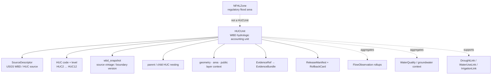

<!-- [KFM_META_BLOCK_V2]
doc_id: kfm://doc/contracts-domains-hydrology-huc-unit
title: HUC Unit Contract — Hydrology
type: semantic-contract
version: v0.2
status: draft; PROPOSED; schema-stub; NEEDS VERIFICATION before promotion
owners:
  - OWNER_TBD — Hydrology domain steward
  - OWNER_TBD — Watershed/HUC steward
  - OWNER_TBD — Contracts steward
  - OWNER_TBD — Source steward
  - OWNER_TBD — Evidence steward
  - OWNER_TBD — Schema steward
  - OWNER_TBD — Policy steward
  - OWNER_TBD — Release steward
  - OWNER_TBD — Docs steward
created: 2026-06-22
updated: 2026-06-22
policy_label: public-with-gates; semantic-contract; hydrology; huc-unit; watershed-boundary-dataset; accounting-geometry; authority-context; aggregate-safe; vintage-aware; evidence-bound; release-gated; rollback-aware
tags: [kfm, contracts, hydrology, HUCUnit, HUC, WBD, watershed, accounting-geometry, wbd_snapshot, huc_code, source-role, observed, aggregate, authority-context, EvidenceBundle, ReleaseManifest, RollbackCard]
related:
  - ./README.md
  - ./decision_envelope.md
  - ./domain_feature_identity.md
  - ./domain_layer_descriptor.md
  - ./domain_observation.md
  - ./domain_validation_report.md
  - ./evidence_bundle.md
  - ./watershed.md
  - ./hydro_feature.md
  - ./reach_identity.md
  - ../../../docs/domains/hydrology/OBJECT_FAMILIES.md
  - ../../../docs/domains/hydrology/GLOSSARY.md
  - ../../../docs/domains/hydrology/SOURCE_ROLE_MATRIX.md
  - ../../../docs/domains/hydrology/IDENTITY_MODEL.md
  - ../../../docs/domains/hydrology/API_CONTRACTS.md
  - ../../../docs/domains/hydrology/README.md
  - ../../../schemas/contracts/v1/domains/hydrology/huc_unit.schema.json
  - ../../../policy/domains/hydrology/
  - ../../../fixtures/domains/hydrology/huc_unit/
  - ../../../tests/domains/hydrology/test_huc_unit.*
  - ../../../data/registry/sources/hydrology/
  - ../../../release/candidates/hydrology/
notes:
  - "Expanded from a thin scaffold at contracts/domains/hydrology/huc_unit.md."
  - "The paired schema exists at schemas/contracts/v1/domains/hydrology/huc_unit.schema.json, but it remains a PROPOSED scaffold with empty properties and additionalProperties=true."
  - "Hydrology object-family doctrine defines HUCUnit as a Watershed Boundary Dataset hydrologic unit, HUC2 through HUC12, with typical identity anchor huc_code + wbd_snapshot."
  - "HUCUnit is accounting/context geometry and aggregate unit support; it is not a gauge observation, flow observation, floodplain regulation, observed flood extent, emergency alert, parcel/title claim, or per-place truth."
[/KFM_META_BLOCK_V2] -->

# HUC Unit Contract — Hydrology

> Semantic contract for `HUCUnit`: a Hydrology accounting-geometry object representing a Watershed Boundary Dataset hydrologic unit whose HUC code, level, hierarchy, source vintage, evidence support, release state, correction lineage, and rollback target must stay inspectable before it is used in public maps, analysis, exports, or cross-domain joins.

  
  
  
  
  
  
  

`contracts/domains/hydrology/huc_unit.md`

## Quick jumps

[Status](#status) · [Meaning](#meaning) · [Repo fit](#repo-fit) · [Schema posture](#schema-posture) · [HUCUnit boundaries](#hucunit-boundaries) · [Assertions](#assertions) · [Exclusions](#exclusions) · [Recommended fields](#recommended-fields) · [Source-role rules](#source-role-rules) · [Temporal and vintage rules](#temporal-and-vintage-rules) · [Evidence and citation posture](#evidence-and-citation-posture) · [Sensitivity and publication](#sensitivity-and-publication) · [Lifecycle](#lifecycle) · [Validation](#validation) · [Rollback](#rollback) · [Evidence basis](#evidence-basis) · [Open questions](#open-questions)

---

## Status

> [!IMPORTANT]
> **Status:** `draft` / semantic contract  
> **Contract path:** `contracts/domains/hydrology/huc_unit.md`  
> **Schema path:** `schemas/contracts/v1/domains/hydrology/huc_unit.schema.json`  
> **Schema posture:** paired schema exists, but remains a `PROPOSED` scaffold with empty `properties` and `additionalProperties: true`.  
> **Truth posture:** Hydrology docs define `HUCUnit` as a Watershed Boundary Dataset hydrologic unit, HUC2 through HUC12, identified by HUC code with WBD snapshot/vintage lineage. Field-level schema shape, validators, fixtures, policy enforcement, emitted EvidenceBundles, release manifests, and public API behavior remain **NEEDS VERIFICATION**.

> [!CAUTION]
> `HUCUnit` is accounting/context geometry. It is not an observed reading, not a regulatory flood-zone determination, not observed inundation, not a modeled hydrograph, not parcel/title authority, not a crop/yield claim, and not emergency or life-safety guidance.

---

## Meaning

`HUCUnit` represents a Watershed Boundary Dataset hydrologic unit used by Hydrology for watershed accounting, aggregation, rollups, map filtering, source alignment, cross-domain joins, and public-safe contextual layers.

It may describe:

- a HUC2, HUC4, HUC6, HUC8, HUC10, or HUC12 unit;
- HUC code, level, name, parent/child hierarchy, and area;
- WBD source snapshot or boundary vintage;
- geometry used for accounting or public context;
- released derivatives that aggregate observations, drought links, water-use links, or habitat/agriculture context by HUC.

It must remain distinct from:

- `Watershed`, the broader drainage-area concept;
- `HydroFeature` and `ReachIdentity`, which describe network/flowline features;
- `FlowObservation`, `WaterLevelObservation`, and `WaterQualityObservation`, which are observed readings;
- `NFHLZone` / `FloodContext`, which are regulatory flood-context objects;
- `ObservedFloodEvent`, which is historical/observed inundation evidence;
- modeled hydrographs, upstream traces, and cross-domain links.

---

## Repo fit

| Responsibility | Path or root | This contract's role |
|---|---|---|
| Human-readable object meaning | `contracts/domains/hydrology/huc_unit.md` | This file; semantic contract for HUCUnit. |
| Machine schema | `schemas/contracts/v1/domains/hydrology/huc_unit.schema.json` | Confirmed scaffold; full field shape is not enforced yet. |
| Contract root | `contracts/domains/hydrology/README.md` | Directory root and object-family boundaries. |
| Feature identity | `contracts/domains/hydrology/domain_feature_identity.md` | Stable ID/spec_hash/source/time/digest companion. |
| Layer descriptor | `contracts/domains/hydrology/domain_layer_descriptor.md` | Public delivery descriptor; not HUC truth. |
| Evidence bundle | `contracts/domains/hydrology/evidence_bundle.md` | Evidence support for HUC boundary/lineage claims. |
| Validation report | `contracts/domains/hydrology/domain_validation_report.md` | Gate report proving HUC shape/role/vintage/release readiness. |
| Source role matrix | `docs/domains/hydrology/SOURCE_ROLE_MATRIX.md` | Human-readable source-role and permitted/cannot-prove grid. |
| Object catalog | `docs/domains/hydrology/OBJECT_FAMILIES.md` | Defines HUCUnit purpose, identity anchor, and vintage posture. |
| Glossary | `docs/domains/hydrology/GLOSSARY.md` | Defines HUCUnit and HUC12 string expectation. |
| Policy | `policy/domains/hydrology/` | Expected public exposure, role, release, and cross-lane gates. |
| Release | `release/candidates/hydrology/` and release roots | ReleaseManifest, CorrectionNotice, RollbackCard, and promotion decisions. |

---

## Schema posture

| Schema fact | Current posture |
|---|---|
| Confirmed schema path | `schemas/contracts/v1/domains/hydrology/huc_unit.schema.json` |
| Schema status | `PROPOSED` |
| Schema title | `Huc Unit` |
| Visible properties | Empty object |
| Required fields | None visible in scaffold |
| Additional properties | `true` |
| Contract pointer | `contracts/domains/hydrology/huc_unit.md` |
| Source doc pointer | `docs/domains/hydrology/CANONICAL_PATHS.md` |
| Full HUCUnit enforcement | NEEDS VERIFICATION |

This Markdown contract defines intended semantics for review and schema design. The current schema does not enforce HUC code, HUC level, WBD snapshot, parent/child hierarchy, geometry, source role, EvidenceBundle refs, policy refs, release refs, correction refs, or rollback refs.

---

## HUCUnit boundaries

A HUCUnit is the accounting unit. It can support aggregation, filtering, spatial context, and cross-domain joins. It does not convert those aggregates into per-place or per-record truth.

---

## Assertions

A reviewed `HUCUnit` should assert:

1. **HUC identity** — stable ID and `spec_hash` over source, HUC code, HUC level, WBD snapshot/vintage, geometry fingerprint, temporal scope, and normalized digest.
2. **SourceDescriptor link** — WBD/HUC source identity, source role, rights, cadence, authority limits, and citation are resolvable.
3. **HUC code discipline** — HUC code and level are consistent; HUC12 must be represented as a 12-digit string where HUC12 is claimed.
4. **Hierarchy discipline** — parent and child HUC relationships are explicit and source-vintage-compatible.
5. **Vintage discipline** — WBD snapshots/vintages are not silently mixed.
6. **Geometry posture** — source geometry, public geometry, area, CRS/geography version, and simplification/generalization are tracked.
7. **Aggregate boundary** — HUC rollups remain aggregate/context claims, not per-place or per-record observations.
8. **Evidence closure** — public/consequential HUC claims resolve EvidenceRef to EvidenceBundle or abstain.
9. **Release support** — public HUC layers/exports require PolicyDecision where applicable, ReleaseManifest, CorrectionNotice path, and RollbackCard.
10. **Correction lineage** — WBD boundary changes, code corrections, hierarchy changes, or geometry changes invalidate dependent aggregates/layers/links as needed.

---

## Exclusions

| Misuse | Why it is denied or abstained |
|---|---|
| HUCUnit as observed flow/stage/water-quality reading | Observations are separate objects tied to place/time/source measurement. |
| HUCUnit as NFHL/floodplain regulation | NFHL/FloodContext owns regulatory flood context. |
| HUCUnit as observed inundation | ObservedFloodEvent requires observed evidence. |
| HUC aggregate as per-place truth | Aggregate scope loses per-record fidelity. |
| HUC boundary as ReachIdentity | Reaches/flowlines belong to HydroFeature/ReachIdentity. |
| WBD snapshot mixed silently with another vintage | Boundary/vintage mismatch is correctness failure. |
| HUC code inferred from ambiguous source without evidence | Ambiguity causes ABSTAIN/HOLD, not guessing. |
| Public layer as HUC source truth | Layer descriptors/tiles are delivery surfaces. |
| AI summary as evidence | EvidenceBundle is required. |
| Emergency or life-safety guidance | KFM Hydrology is not alerting or emergency authority. |

---

## Recommended fields

The following fields are **PROPOSED** targets for future schema expansion. They are not enforced by the current schema scaffold.

| Field | Meaning |
|---|---|
| `id` | Canonical HUCUnit ID. |
| `version` | Contract/object version. |
| `spec_hash` | Deterministic digest over normalized HUC semantics. |
| `domain` | Must resolve to `hydrology`. |
| `object_type` | `HUCUnit`. |
| `source_descriptor_ref` | SourceDescriptor identity, role, rights, cadence, attribution, authority limits. |
| `source_record_ref` | Source-native WBD/HUC record or stable handle. |
| `source_role` | Observed boundary/context or aggregate unit role as admitted. |
| `huc_code` | HUC code string. |
| `huc_level` | HUC2, HUC4, HUC6, HUC8, HUC10, HUC12, or accepted enum. |
| `huc_name` | Source-provided unit name where available. |
| `parent_huc_ref` | Parent HUC identity reference. |
| `child_huc_refs` | Child HUC identity references, if material. |
| `wbd_snapshot` | WBD source snapshot/vintage. |
| `valid_time` | Valid/effective period of source boundary where available. |
| `source_time` | Source publication/update/assertion time. |
| `retrieval_time` | KFM fetch time; not source truth. |
| `release_time` | KFM publication time; not source truth. |
| `correction_time` | Correction/supersession time. |
| `geometry_ref` | Source or processed geometry reference. |
| `geometry_role` | source_exact, generalized_public, aggregate_public, withheld, or accepted enum. |
| `area` | Source/normalized area where available, with unit and transform receipt. |
| `crs_or_geography_version_ref` | CRS/geography version support where material. |
| `linked_aggregate_refs` | Downstream rollups/analytics that depend on this HUC. |
| `evidence_ref_ids` | EvidenceRefs supporting HUC claims. |
| `evidence_bundle_ids` | EvidenceBundles supporting public claims. |
| `policy_decision_refs` | Policy decisions controlling exposure/release. |
| `release_refs` | ReleaseManifest/PromotionDecision refs if public. |
| `correction_refs` | CorrectionNotice/supersession refs. |
| `rollback_refs` | RollbackCard/rollback target refs. |
| `quality_flags` | schema_scaffold, missing_source_role, missing_huc_code, invalid_huc_level, invalid_huc12_length, missing_wbd_snapshot, mixed_vintage, geometry_mismatch, aggregate_as_per_place, release_missing. |

---

## Source-role rules

| Source role | HUCUnit handling |
|---|---|
| `observed` | May support boundary/context identity where admitted as WBD/HUC boundary source role. |
| `aggregate` | May support HUC-level rollups and summaries; must preserve aggregation scope. |
| `administrative` | May support source registry/accounting context where source family requires it. |
| `modeled` | Not the default HUCUnit source role; modeled catchments/terrain-derived units must stay modeled/derived. |
| `regulatory` | Not a HUCUnit basis unless a separate regulatory context is explicitly modeled; NFHL remains separate. |
| `candidate` | Allowed only before admission/promotion; no public HUCUnit until reviewed/promoted. |
| `synthetic` | Not admitted source truth; cannot serve as HUCUnit evidence. |

---

## Temporal and vintage rules

| Time/vintage element | Rule |
|---|---|
| `wbd_snapshot` | Required for meaningful HUC identity and boundary comparison. |
| `source_time` | Required where source publication/update time matters. |
| `valid_time` | Required where source supplies boundary/effective window. |
| `retrieval_time` | KFM fetch time; never substitutes for WBD snapshot or valid time. |
| `release_time` | KFM publication time; not source truth. |
| `correction_time` | Correction lineage for boundary, code, hierarchy, or geometry changes. |
| mixed vintage | Must be detected, held, corrected, or explicitly modeled as crosswalk/compare output. |

A HUC code without snapshot/vintage support is usually insufficient for high-trust publication because WBD boundaries can change across releases.

---

## Evidence and citation posture

A public or consequential HUCUnit claim requires EvidenceBundle support.

| Claim | Required support |
|---|---|
| “This HUCUnit exists and has code X.” | EvidenceBundle with WBD/source record, HUC code, level, citation, rights, sensitivity, and checksum. |
| “This HUCUnit has boundary geometry Y.” | EvidenceBundle with WBD snapshot/vintage, geometry reference, CRS/geography version, transform/checksum. |
| “This HUCUnit is parent/child of another HUC.” | EvidenceBundle or source record supporting hierarchy within same WBD snapshot. |
| “This HUC layer is public-ready.” | EvidenceBundle + PolicyDecision as needed + ReleaseManifest + layer descriptor + rollback target. |
| “This HUC rollup says X.” | EvidenceBundle for both the HUC geometry and the source observations/aggregates used in the rollup. |

A map tile, label, chart, graph node, or AI answer may reference HUCUnit, but it does not replace EvidenceBundle support.

---

## Sensitivity and publication

HUCUnit boundaries are generally public-safe, but derived joins can increase risk. Publication still depends on rights, source role, release state, and downstream context.

Review or restriction may be required when HUCUnit is joined with:

- private wells, groundwater, parcels, owner/title, or living-person-adjacent data;
- infrastructure, utilities, intakes, dams, levees, bridges, or critical facilities;
- sensitive ecology, archaeology, cultural, or security-relevant locations;
- crop/yield/irrigation/water-use claims that imply per-place certainty;
- unreleased candidate data or restricted source terms.

Public release should preserve aggregation scope and avoid overstating HUC-level values as per-place observations.

---

## Lifecycle

| Phase | HUCUnit handling |
|---|---|
| RAW | Capture WBD/HUC source payload/ref, source role, source-native HUC record, code, name, level, hierarchy, geometry, snapshot/vintage, rights, and sensitivity metadata. |
| WORK / QUARANTINE | Normalize HUC code/level, WBD snapshot, hierarchy, geometry, area, CRS/geography version, evidence refs; quarantine missing code/snapshot/evidence, mixed vintage, invalid hierarchy, or geometry mismatch. |
| PROCESSED | Emit validated HUCUnit candidate with EvidenceRef, ValidationReport, source-role posture, geometry/vintage posture, and quality flags. |
| CATALOG / TRIPLET | Catalog/triplet projections cite the HUC by identity and evidence; projections do not become truth. |
| RELEASE CANDIDATE | Public-safe derivative resolves EvidenceBundle, PolicyDecision where needed, ReleaseManifest, CorrectionNotice path, and RollbackCard. |
| PUBLISHED | Governed API/UI may serve released public-safe HUC context or derivative; public clients do not read RAW/WORK/QUARANTINE directly. |
| CORRECTED / SUPERSEDED | Source correction, WBD snapshot update, HUC code/hierarchy change, geometry change, or policy change creates correction/supersession lineage and invalidates affected derivatives. |

---

## Validation

Before this contract is promoted beyond draft:

- [ ] Expand `schemas/contracts/v1/domains/hydrology/huc_unit.schema.json` beyond empty `properties`.
- [ ] Decide required fields for source descriptor, HUC code, HUC level, WBD snapshot, geometry ref, hierarchy refs, source/valid/retrieval/release/correction times, evidence refs, policy refs, release refs, and rollback refs.
- [ ] Confirm whether HUCUnit inherits from or profiles `domain_feature_identity` and how it relates to `Watershed`.
- [ ] Add positive fixtures for HUC2, HUC8, HUC10, HUC12, parent/child hierarchy, WBD snapshot update, generalized public layer entry, and released public-safe HUC layer entry.
- [ ] Add negative fixtures for invalid HUC level, invalid HUC12 length, missing WBD snapshot, mixed WBD vintage, HUC aggregate as per-place truth, flow observation embedded as HUC truth, NFHL regulatory zone as HUCUnit, AI-summary-as-evidence, missing EvidenceBundle, and direct RAW/WORK public access.
- [ ] Add validator coverage for source role, SourceDescriptor, HUC code/level, WBD snapshot, hierarchy, geometry, CRS/geography version, evidence, policy, release, correction, and rollback.
- [ ] Confirm public API/UI uses `decision_envelope` outcomes and never silently falls through to raw source or generic AI answer.

Recommended finite outcomes:

| Condition | Outcome |
|---|---|
| HUC identity, source role, HUC code/level, WBD snapshot, hierarchy/geometry, evidence, policy, release, correction, and rollback resolve | `ANSWER` or release-eligible reference |
| Evidence, HUC code, HUC level, WBD snapshot, hierarchy, geometry, rights, or release support is incomplete | `ABSTAIN` / `HOLD` |
| Mixed vintage, aggregate-as-per-place, role collapse, candidate public exposure, sensitive join, life-safety framing, or direct RAW/WORK read would occur | `DENY` |
| Schema, validator, source read, evidence lookup, policy lookup, release lookup, or canonicalization fails | `ERROR` |

---

## Rollback

Rollback is required when HUCUnit handling weakens watershed accounting identity, WBD vintage, hierarchy, geometry, source-role integrity, evidence closure, policy/release state, or correction lineage.

Rollback triggers include missing WBD snapshot; HUC code/level mismatch; invalid HUC12 representation; mixed WBD vintages silently merged; parent/child hierarchy mismatch; geometry or CRS/geography version mismatch; aggregate HUC rollup published as per-place observation; HUC boundary treated as NFHL/regulatory flood zone; FlowObservation/WaterLevelObservation embedded as HUC truth; candidate HUC reaches public surface; AI summary treated as evidence; public API/UI reads RAW/WORK/QUARANTINE directly; source correction changes boundary/code/hierarchy; or release lacks EvidenceBundle, PolicyDecision, ReleaseManifest, CorrectionNotice path, and RollbackCard.

Rollback artifacts should include affected HUCUnit IDs, HUC codes, HUC levels, WBD snapshots, parent/child refs, geometry refs, area/CRS refs, source descriptors, source-native refs, temporal scope, EvidenceRefs/EvidenceBundles, ValidationReports, PolicyDecisions, ReleaseManifests, CorrectionNotices, RollbackCards, invalidated rollups, invalidated cross-lane links, invalidated layer descriptors, invalidated decision envelopes, invalidated exports, and public-cache/style invalidation instructions.

---

## Evidence basis

| Source | Status | Supports | Limits |
|---|---|---|---|
| `contracts/domains/hydrology/huc_unit.md` scaffold | CONFIRMED | Target existed as a planned scaffold from Hydrology canonical paths. | Did not contain authoritative HUCUnit semantics. |
| `schemas/contracts/v1/domains/hydrology/huc_unit.schema.json` | CONFIRMED | Paired schema exists and points to this contract. | Empty `properties`; no field enforcement. |
| `docs/domains/hydrology/OBJECT_FAMILIES.md` | CONFIRMED | Defines HUCUnit as WBD HUC2–HUC12 accounting/context unit with huc_code + wbd_snapshot identity posture, HUC12 string note, public-safe role, and no silent vintage mixing. | Concrete attributes are labeled inferred/proposed until schema realization. |
| `docs/domains/hydrology/GLOSSARY.md` | CONFIRMED | Defines HUCUnit, HUC12 12-digit rule, and WBD snapshot lineage. | Field realization remains PROPOSED outside the glossary. |
| `docs/domains/hydrology/SOURCE_ROLE_MATRIX.md` | CONFIRMED | USGS WBD/HUC12 may prove HUCUnit/Watershed boundary geometry but is not authoritative for observed flow, floodplain regulation, or observed flood extent. | Machine enforcement requires SourceDescriptor, EvidenceBundle, policy, fixtures, and validators. |
| `docs/domains/hydrology/IDENTITY_MODEL.md` | CONFIRMED | Deterministic spec_hash / identity hashing posture and object identity flow. | Per-object digest field realization remains PROPOSED. |
| User-provided authoring role | CONFIRMED user instruction | Requires evidence-grounded, repo-ready Markdown and visible verification boundaries. | Authoring rule, not implementation proof. |

---

## Open questions

| Question | Status | Resolution path |
|---|---|---|
| Which exact fields must be required in `huc_unit.schema.json`? | NEEDS VERIFICATION | Schema steward + Hydrology watershed/HUC steward review. |
| Should HUCUnit inherit from `domain_feature_identity`, from a shared boundary-geometry contract, or stand alone? | NEEDS VERIFICATION | Contract/schema design decision. |
| Which WBD snapshot identifier vocabulary is canonical? | NEEDS VERIFICATION | SourceDescriptor + schema/fixture review. |
| Which HUC levels are accepted, and should HUC12 length be schema-enforced? | NEEDS VERIFICATION | Schema and fixtures. |
| How should WBD vintage comparison/crosswalks be represented? | NEEDS VERIFICATION | Identity/crosswalk contract review. |
| Which validator proves HUC aggregates cannot be interpreted as per-place observations? | NEEDS VERIFICATION | Negative fixtures and validator implementation. |

---

## Related contracts and docs

- [`./README.md`](./README.md) — Hydrology contract-root README.
- [`./domain_feature_identity.md`](./domain_feature_identity.md) — feature identity and `spec_hash` companion.
- [`./domain_layer_descriptor.md`](./domain_layer_descriptor.md) — public layer descriptor, not HUC truth.
- [`./decision_envelope.md`](./decision_envelope.md) — runtime finite-outcome carrier.
- [`./evidence_bundle.md`](./evidence_bundle.md) — Hydrology EvidenceBundle alias.
- [`./watershed.md`](./watershed.md) — broader watershed contract, if present/expanded.
- [`./hydro_feature.md`](./hydro_feature.md) — hydro feature contract, if present/expanded.
- [`./reach_identity.md`](./reach_identity.md) — reach identity contract, if present/expanded.
- [`../../../docs/domains/hydrology/OBJECT_FAMILIES.md`](../../../docs/domains/hydrology/OBJECT_FAMILIES.md) — object-family catalog.
- [`../../../docs/domains/hydrology/GLOSSARY.md`](../../../docs/domains/hydrology/GLOSSARY.md) — Hydrology vocabulary.
- [`../../../docs/domains/hydrology/SOURCE_ROLE_MATRIX.md`](../../../docs/domains/hydrology/SOURCE_ROLE_MATRIX.md) — source-role anti-collapse matrix.
- [`../../../docs/domains/hydrology/IDENTITY_MODEL.md`](../../../docs/domains/hydrology/IDENTITY_MODEL.md) — deterministic identity/hash posture.
- [`../../../schemas/contracts/v1/domains/hydrology/huc_unit.schema.json`](../../../schemas/contracts/v1/domains/hydrology/huc_unit.schema.json) — current schema scaffold.

[Back to top](#top)
