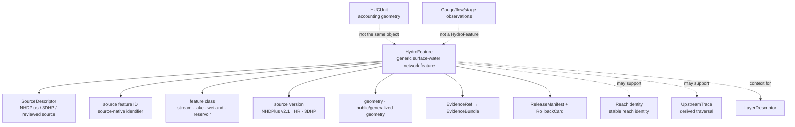

<!-- [KFM_META_BLOCK_V2]
doc_id: kfm://doc/contracts-domains-hydrology-hydro-feature
title: Hydro Feature Contract — Hydrology
type: semantic-contract
version: v0.2
status: draft; PROPOSED; schema-stub; NEEDS VERIFICATION before promotion
owners:
  - OWNER_TBD — Hydrology domain steward
  - OWNER_TBD — Surface-water network steward
  - OWNER_TBD — Contracts steward
  - OWNER_TBD — Source steward
  - OWNER_TBD — Evidence steward
  - OWNER_TBD — Schema steward
  - OWNER_TBD — Policy steward
  - OWNER_TBD — Release steward
  - OWNER_TBD — Docs steward
created: 2026-06-22
updated: 2026-06-22
policy_label: public-with-gates; semantic-contract; hydrology; hydro-feature; surface-water-network; authority-network; version-aware; evidence-bound; release-gated; rollback-aware
tags: [kfm, contracts, hydrology, HydroFeature, surface-water-network, stream, lake, wetland, reservoir, NHDPlus, 3DHP, network-identity, source-role, observed, modeled, ReachIdentity, EvidenceBundle, ReleaseManifest, RollbackCard]
related:
  - ./README.md
  - ./decision_envelope.md
  - ./domain_feature_identity.md
  - ./domain_layer_descriptor.md
  - ./domain_observation.md
  - ./domain_validation_report.md
  - ./evidence_bundle.md
  - ./huc_unit.md
  - ./watershed.md
  - ./reach_identity.md
  - ./upstream_trace.md
  - ../../../docs/domains/hydrology/OBJECT_FAMILIES.md
  - ../../../docs/domains/hydrology/GLOSSARY.md
  - ../../../docs/domains/hydrology/SOURCE_ROLE_MATRIX.md
  - ../../../docs/domains/hydrology/IDENTITY_MODEL.md
  - ../../../docs/domains/hydrology/API_CONTRACTS.md
  - ../../../docs/domains/hydrology/README.md
  - ../../../schemas/contracts/v1/domains/hydrology/hydro_feature.schema.json
  - ../../../policy/domains/hydrology/
  - ../../../fixtures/domains/hydrology/hydro_feature/
  - ../../../tests/domains/hydrology/test_hydro_feature.*
  - ../../../data/registry/sources/hydrology/
  - ../../../release/candidates/hydrology/
notes:
  - "Expanded from a thin scaffold at contracts/domains/hydrology/hydro_feature.md."
  - "The paired schema exists at schemas/contracts/v1/domains/hydrology/hydro_feature.schema.json, but it remains a PROPOSED scaffold with empty properties and additionalProperties=true."
  - "Hydrology object-family doctrine defines HydroFeature as a surface-water network feature — stream, lake, wetland, or reservoir — with typical identity anchor NHDPlus version or 3DHP plus feature identifier."
  - "HydroFeature is generic network/context geometry and must be distinguished from ReachIdentity, which is the stable flowline reach identity across vintages."
  - "HydroFeature is not an observed gauge reading, HUC accounting unit, NFHL regulatory area, observed flood event, public layer, source truth, or emergency guidance."
[/KFM_META_BLOCK_V2] -->

# Hydro Feature Contract — Hydrology

> Semantic contract for `HydroFeature`: a Hydrology surface-water network feature representing a stream, lake, wetland, reservoir, or related network/context geometry from an admitted hydrography source, with source version, feature class, geometry, evidence, release state, correction lineage, and rollback target kept inspectable.

  
  
  
  
  
  
  

`contracts/domains/hydrology/hydro_feature.md`

## Quick jumps

[Status](#status) · [Meaning](#meaning) · [Repo fit](#repo-fit) · [Schema posture](#schema-posture) · [HydroFeature boundaries](#hydrofeature-boundaries) · [Assertions](#assertions) · [Exclusions](#exclusions) · [Recommended fields](#recommended-fields) · [Source-role rules](#source-role-rules) · [Temporal and version rules](#temporal-and-version-rules) · [Evidence and citation posture](#evidence-and-citation-posture) · [Sensitivity and publication](#sensitivity-and-publication) · [Lifecycle](#lifecycle) · [Validation](#validation) · [Rollback](#rollback) · [Evidence basis](#evidence-basis) · [Open questions](#open-questions)

---

## Status

> [!IMPORTANT]
> **Status:** `draft` / semantic contract  
> **Contract path:** `contracts/domains/hydrology/hydro_feature.md`  
> **Schema path:** `schemas/contracts/v1/domains/hydrology/hydro_feature.schema.json`  
> **Schema posture:** paired schema exists, but remains a `PROPOSED` scaffold with empty `properties` and `additionalProperties: true`.  
> **Truth posture:** Hydrology docs define `HydroFeature` as a surface-water network feature — stream, lake, wetland, or reservoir — with source/version tracking. Field-level schema shape, validators, fixtures, policy enforcement, emitted EvidenceBundles, release manifests, and public API behavior remain **NEEDS VERIFICATION**.

> [!CAUTION]
> `HydroFeature` is generic network/context geometry. It is not a stable `ReachIdentity`, not a `HUCUnit`, not an observed gauge reading, not a flood regulation, not observed inundation, not a public layer, and not emergency or life-safety guidance.

---

## Meaning

`HydroFeature` represents a surface-water network feature admitted into the Hydrology lane from a source such as NHDPlus HR, NHDPlus v2.1, 3DHP, or another reviewed hydrography source family.

It may describe:

- stream, river, canal, lake, wetland, reservoir, or similar surface-water feature classes;
- source-native feature identifier and geometry;
- feature class/type and source version;
- public-safe generalized geometry where needed;
- network/context geometry used by layer descriptors, reach matching, upstream traces, watershed context, and cross-domain joins.

It must remain distinct from:

- `ReachIdentity`, which is the stable identity of a flowline reach across vintages;
- `HUCUnit`, which is watershed accounting geometry;
- `GaugeSite`, `FlowObservation`, and `WaterLevelObservation`, which are monitoring-site and observed-reading families;
- `NFHLZone` / `FloodContext`, which are regulatory/contextual flood objects;
- `ObservedFloodEvent`, which is observed inundation evidence;
- derived `Hydrograph` or `UpstreamTrace` results.

---

## Repo fit

| Responsibility | Path or root | This contract's role |
|---|---|---|
| Human-readable object meaning | `contracts/domains/hydrology/hydro_feature.md` | This file; semantic contract for HydroFeature. |
| Machine schema | `schemas/contracts/v1/domains/hydrology/hydro_feature.schema.json` | Confirmed scaffold; full field shape is not enforced yet. |
| Feature identity | `contracts/domains/hydrology/domain_feature_identity.md` | Stable ID/spec_hash/source/time/digest companion. |
| Layer descriptor | `contracts/domains/hydrology/domain_layer_descriptor.md` | Public delivery descriptor; not feature truth. |
| Evidence bundle | `contracts/domains/hydrology/evidence_bundle.md` | Evidence support for feature identity/geometry claims. |
| Validation report | `contracts/domains/hydrology/domain_validation_report.md` | Gate report proving feature shape/role/version/release readiness. |
| HUC unit | `contracts/domains/hydrology/huc_unit.md` | Accounting geometry; distinct from HydroFeature. |
| Reach identity | `contracts/domains/hydrology/reach_identity.md` | Stable reach identity; distinct from generic HydroFeature. |
| Object catalog | `docs/domains/hydrology/OBJECT_FAMILIES.md` | Defines HydroFeature purpose, identity anchor, and version posture. |
| Source role matrix | `docs/domains/hydrology/SOURCE_ROLE_MATRIX.md` | Defines observed/modeled roles and what NHDPlus/3DHP may prove. |
| Policy | `policy/domains/hydrology/` | Expected source-role, release, sensitivity, and public-exposure gates. |
| Release | `release/candidates/hydrology/` and release roots | ReleaseManifest, CorrectionNotice, RollbackCard, and promotion decisions. |

---

## Schema posture

| Schema fact | Current posture |
|---|---|
| Confirmed schema path | `schemas/contracts/v1/domains/hydrology/hydro_feature.schema.json` |
| Schema status | `PROPOSED` |
| Schema title | `Hydro Feature` |
| Visible properties | Empty object |
| Required fields | None visible in scaffold |
| Additional properties | `true` |
| Contract pointer | `contracts/domains/hydrology/hydro_feature.md` |
| Source doc pointer | `docs/domains/hydrology/CANONICAL_PATHS.md` |
| Full HydroFeature enforcement | NEEDS VERIFICATION |

This Markdown contract defines intended semantics for review and schema design. The current schema does not enforce feature ID, feature class, source/version, geometry, source role, EvidenceBundle refs, policy refs, release refs, correction refs, or rollback refs.

---

## HydroFeature boundaries

A HydroFeature is the source-feature/context feature. It may support reach identity, network traversal, or public layers, but it does not become those downstream objects.

---

## Assertions

A reviewed `HydroFeature` should assert:

1. **Feature identity** — stable ID and `spec_hash` over source, feature identifier, feature class, source version, temporal scope, geometry fingerprint, and normalized digest.
2. **SourceDescriptor link** — hydrography source identity, source role, rights, cadence, authority limits, and citation are resolvable.
3. **Source-native ID** — source feature ID or stable feature handle is preserved.
4. **Feature class discipline** — stream, river, lake, wetland, reservoir, canal, connector, or source class remains visible.
5. **Version discipline** — NHDPlus/3DHP/source version is explicit and not silently mixed.
6. **Geometry posture** — source geometry, public/generalized geometry, CRS/geography version, and topology checks are tracked.
7. **Reach separation** — `ReachIdentity` remains the stable reach object; HydroFeature is the generic feature family.
8. **Observation separation** — gauge/flow/stage/water-quality observations reference or intersect features but do not become features.
9. **Evidence closure** — public/consequential feature claims resolve EvidenceRef to EvidenceBundle or abstain.
10. **Release/rollback support** — public feature layers/exports require PolicyDecision where applicable, ReleaseManifest, CorrectionNotice path, and RollbackCard.

---

## Exclusions

| Misuse | Why it is denied or abstained |
|---|---|
| HydroFeature as ReachIdentity | ReachIdentity owns stable flowline reach identity across vintages. |
| HydroFeature as HUCUnit | HUCUnit owns watershed accounting geometry. |
| HydroFeature as observed flow/stage/water-quality reading | Observations are separate source/time/value objects. |
| HydroFeature as NFHL or floodplain regulation | NFHL/FloodContext owns regulatory flood context. |
| HydroFeature as observed inundation | ObservedFloodEvent requires observed evidence. |
| Modeled catchment as observed feature without role flag | Derived/model role must remain visible. |
| Source versions silently mixed | Version mismatch is correctness failure. |
| Public layer as HydroFeature source truth | Layer descriptors/tiles are delivery surfaces. |
| AI summary as evidence | EvidenceBundle is required. |
| Emergency or life-safety guidance | KFM Hydrology is not alerting or emergency authority. |

---

## Recommended fields

The following fields are **PROPOSED** targets for future schema expansion. They are not enforced by the current schema scaffold.

| Field | Meaning |
|---|---|
| `id` | Canonical HydroFeature ID. |
| `version` | Contract/object version. |
| `spec_hash` | Deterministic digest over normalized feature semantics. |
| `domain` | Must resolve to `hydrology`. |
| `object_type` | `HydroFeature`. |
| `source_descriptor_ref` | SourceDescriptor identity, role, rights, cadence, attribution, authority limits. |
| `source_record_ref` | Source-native hydrography feature record or stable handle. |
| `source_role` | Observed network identity or modeled/derived geometry role as admitted. |
| `source_family` | NHDPlus v2.1, NHDPlus HR, 3DHP, state source, or accepted source family. |
| `source_version` | Source version/vintage such as NHDPlus HR release or 3DHP snapshot. |
| `feature_id` | Source-native feature identifier. |
| `feature_class` | Stream, river, lake, wetland, reservoir, canal, connector, or accepted enum. |
| `feature_name` | Source-provided name where available. |
| `geometry_ref` | Source or processed geometry reference. |
| `geometry_role` | source_exact, generalized_public, derived_model, withheld, restricted, or accepted enum. |
| `crs_or_geography_version_ref` | CRS/geography version support where material. |
| `topology_ref` | Network/topology relationship reference where material. |
| `linked_reach_identity_refs` | ReachIdentity refs supported by this feature, if any. |
| `linked_huc_refs` | HUCUnit/Watershed refs, if material. |
| `source_time` | Source publication/update/assertion time. |
| `valid_time` | Valid/effective window for source geometry where available. |
| `retrieval_time` | KFM fetch time; not source truth. |
| `release_time` | KFM publication time; not source truth. |
| `correction_time` | Correction/supersession time. |
| `evidence_ref_ids` | EvidenceRefs supporting feature claims. |
| `evidence_bundle_ids` | EvidenceBundles supporting public claims. |
| `policy_decision_refs` | Policy decisions controlling exposure/release. |
| `release_refs` | ReleaseManifest/PromotionDecision refs if public. |
| `correction_refs` | CorrectionNotice/supersession refs. |
| `rollback_refs` | RollbackCard/rollback target refs. |
| `quality_flags` | schema_scaffold, missing_source_role, missing_feature_id, missing_source_version, mixed_version, topology_mismatch, geometry_mismatch, feature_reach_collapse, modeled_as_observed, release_missing. |

---

## Source-role rules

| Source role | HydroFeature handling |
|---|---|
| `observed` | May support admitted network/feature identity where source provides feature geometry/context. |
| `modeled` | May support derived flow/catchment or derived geometry only with role flag and transform/model lineage. |
| `aggregate` | Not a feature identity by itself; may support summaries only. |
| `administrative` | May support source registry/accounting context where explicitly admitted. |
| `regulatory` | Not HydroFeature by default; NFHL/FloodContext remains separate. |
| `candidate` | Allowed only before admission/promotion; no public HydroFeature until reviewed/promoted. |
| `synthetic` | Not admitted source truth; cannot serve as HydroFeature evidence. |

---

## Temporal and version rules

| Time/version element | Rule |
|---|---|
| `source_version` | Required for meaningful HydroFeature identity and comparison. |
| `source_time` | Required where source publication/update time matters. |
| `valid_time` | Required where source supplies geometry/effective window. |
| `retrieval_time` | KFM fetch time; never substitutes for source version or valid time. |
| `release_time` | KFM publication time; not source truth. |
| `correction_time` | Correction lineage for feature ID, class, geometry, topology, or version changes. |
| mixed versions | Must be detected, held, corrected, or explicitly modeled as crosswalk/compare output. |

A feature ID without source version/vintage support is usually insufficient for high-trust publication because hydrography source identities and geometries can change across releases.

---

## Evidence and citation posture

A public or consequential HydroFeature claim requires EvidenceBundle support.

| Claim | Required support |
|---|---|
| “This HydroFeature exists and has class X.” | EvidenceBundle with source record, feature ID, source version, feature class, citation, rights, sensitivity, and checksum. |
| “This HydroFeature has geometry Y.” | EvidenceBundle with source version/vintage, geometry reference, CRS/geography version, transform/checksum. |
| “This HydroFeature supports ReachIdentity Z.” | EvidenceBundle or source/crosswalk record supporting the relationship and any ambiguity outcome. |
| “This HydroFeature layer is public-ready.” | EvidenceBundle + PolicyDecision as needed + ReleaseManifest + layer descriptor + rollback target. |
| “This HydroFeature supports an upstream trace.” | EvidenceBundle for network topology/version plus trace/run/algorithm receipt. |

A map tile, label, chart, graph node, or AI answer may reference HydroFeature, but it does not replace EvidenceBundle support.

---

## Sensitivity and publication

HydroFeature geometry is generally public-safe, but derived joins can increase risk. Publication still depends on rights, source role, release state, and downstream context.

Review or restriction may be required when HydroFeature is joined with:

- private wells, groundwater, parcels, owner/title, or living-person-adjacent data;
- infrastructure, utilities, intakes, dams, levees, bridges, or critical facilities;
- sensitive ecology, archaeology, cultural, or security-relevant locations;
- crop/yield/irrigation/water-use claims that imply per-place certainty;
- unreleased candidate data or restricted source terms.

Public release should preserve source version, geometry role, and derivative/observed distinction.

---

## Lifecycle

| Phase | HydroFeature handling |
|---|---|
| RAW | Capture source payload/ref, source role, source-native feature ID, class/name, geometry, topology, source version, rights, and sensitivity metadata. |
| WORK / QUARANTINE | Normalize feature ID, source version, class, geometry, topology, CRS/geography version, evidence refs; quarantine missing feature ID/version/evidence, mixed versions, topology mismatch, or role-collapse issues. |
| PROCESSED | Emit validated HydroFeature candidate with EvidenceRef, ValidationReport, source-role posture, geometry/version posture, and quality flags. |
| CATALOG / TRIPLET | Catalog/triplet projections cite the feature by identity and evidence; projections do not become truth. |
| RELEASE CANDIDATE | Public-safe derivative resolves EvidenceBundle, PolicyDecision where needed, ReleaseManifest, CorrectionNotice path, and RollbackCard. |
| PUBLISHED | Governed API/UI may serve released public-safe HydroFeature context or derivative; public clients do not read RAW/WORK/QUARANTINE directly. |
| CORRECTED / SUPERSEDED | Source correction, source-version update, feature ID/class change, geometry/topology change, or policy change creates correction/supersession lineage and invalidates affected derivatives. |

---

## Validation

Before this contract is promoted beyond draft:

- [ ] Expand `schemas/contracts/v1/domains/hydrology/hydro_feature.schema.json` beyond empty `properties`.
- [ ] Decide required fields for source descriptor, source record, source family, source version, feature ID, feature class, geometry ref, topology ref, source/valid/retrieval/release/correction times, evidence refs, policy refs, release refs, and rollback refs.
- [ ] Confirm whether HydroFeature inherits from or profiles `domain_feature_identity` and how it relates to `ReachIdentity`.
- [ ] Add positive fixtures for stream feature, lake/reservoir feature, wetland feature, NHDPlus HR feature, 3DHP feature, feature-to-reach relation, generalized public layer entry, and released public-safe feature layer entry.
- [ ] Add negative fixtures for missing source version, mixed source versions, HydroFeature as ReachIdentity, HydroFeature as HUCUnit, observation embedded as feature truth, NFHL regulatory zone as feature, observed flood extent as feature, modeled geometry relabeled observed, AI-summary-as-evidence, missing EvidenceBundle, and direct RAW/WORK public access.
- [ ] Add validator coverage for source role, SourceDescriptor, feature ID/class, source version, geometry/topology, CRS/geography version, evidence, policy, release, correction, and rollback.
- [ ] Confirm public API/UI uses `decision_envelope` outcomes and never silently falls through to raw source or generic AI answer.

Recommended finite outcomes:

| Condition | Outcome |
|---|---|
| Feature identity, source role, feature ID/class, source version, geometry/topology, evidence, policy, release, correction, and rollback resolve | `ANSWER` or release-eligible reference |
| Evidence, feature ID, feature class, source version, topology, geometry, rights, or release support is incomplete | `ABSTAIN` / `HOLD` |
| Mixed version, feature/reach collapse, modeled-as-observed, role collapse, candidate public exposure, sensitive join, life-safety framing, or direct RAW/WORK read would occur | `DENY` |
| Schema, validator, source read, evidence lookup, policy lookup, release lookup, or canonicalization fails | `ERROR` |

---

## Rollback

Rollback is required when HydroFeature handling weakens surface-water network identity, source version, feature class, geometry/topology, source-role integrity, evidence closure, policy/release state, or correction lineage.

Rollback triggers include missing source version; mixed NHDPlus/3DHP versions silently merged; source feature ID/class mismatch; geometry or CRS/geography version mismatch; topology mismatch; HydroFeature merged with ReachIdentity without recorded crosswalk; HydroFeature treated as HUCUnit; observation embedded as feature truth; NFHL/regulatory context published as HydroFeature; observed flood event published as HydroFeature; modeled catchment relabeled observed; candidate feature reaches public surface; AI summary treated as evidence; public API/UI reads RAW/WORK/QUARANTINE directly; source correction changes feature ID/class/geometry/topology; or release lacks EvidenceBundle, PolicyDecision, ReleaseManifest, CorrectionNotice path, and RollbackCard.

Rollback artifacts should include affected HydroFeature IDs, source feature IDs, source versions, feature classes, geometry refs, topology refs, linked ReachIdentity refs, linked HUC refs, source descriptors, source-native refs, temporal scope, EvidenceRefs/EvidenceBundles, ValidationReports, PolicyDecisions, ReleaseManifests, CorrectionNotices, RollbackCards, invalidated upstream traces, invalidated cross-lane links, invalidated layer descriptors, invalidated decision envelopes, invalidated exports, and public-cache/style invalidation instructions.

---

## Evidence basis

| Source | Status | Supports | Limits |
|---|---|---|---|
| `contracts/domains/hydrology/hydro_feature.md` scaffold | CONFIRMED | Target existed as a planned scaffold from Hydrology canonical paths. | Did not contain authoritative HydroFeature semantics. |
| `schemas/contracts/v1/domains/hydrology/hydro_feature.schema.json` | CONFIRMED | Paired schema exists and points to this contract. | Empty `properties`; no field enforcement. |
| `docs/domains/hydrology/OBJECT_FAMILIES.md` | CONFIRMED | Defines HydroFeature as stream/lake/wetland/reservoir surface-water network feature with NHDPlus/3DHP version + feature ID posture and distinction from ReachIdentity. | Concrete attributes are labeled inferred/proposed until schema realization. |
| `docs/domains/hydrology/GLOSSARY.md` | CONFIRMED | Defines HydroFeature as a generic surface-water network feature and distinguishes it from ReachIdentity. | Field realization remains PROPOSED outside the glossary. |
| `docs/domains/hydrology/SOURCE_ROLE_MATRIX.md` | CONFIRMED | NHDPlus HR/3DHP may prove ReachIdentity/network/flow direction and derived catchment; object-family matrix allows HydroFeature from observed and modeled/derived geometry roles. | Machine enforcement requires SourceDescriptor, EvidenceBundle, policy, fixtures, and validators. |
| `docs/domains/hydrology/IDENTITY_MODEL.md` | CONFIRMED | Deterministic spec_hash / identity hashing posture and object identity flow. | Per-object digest field realization remains PROPOSED. |
| User-provided authoring role | CONFIRMED user instruction | Requires evidence-grounded, repo-ready Markdown and visible verification boundaries. | Authoring rule, not implementation proof. |

---

## Open questions

| Question | Status | Resolution path |
|---|---|---|
| Which exact fields must be required in `hydro_feature.schema.json`? | NEEDS VERIFICATION | Schema steward + Hydrology network steward review. |
| Should HydroFeature inherit from `domain_feature_identity`, from a shared network-feature contract, or stand alone? | NEEDS VERIFICATION | Contract/schema design decision. |
| Which NHDPlus/3DHP version identifiers are canonical? | NEEDS VERIFICATION | SourceDescriptor + schema/fixture review. |
| Which feature classes are canonical across NHDPlus v2.1, HR, 3DHP, and state sources? | NEEDS VERIFICATION | Source steward + validator review. |
| How should HydroFeature-to-ReachIdentity crosswalks be represented? | NEEDS VERIFICATION | Identity/crosswalk contract review. |
| Which validator proves HydroFeature cannot be used as observed reading, NFHL regulation, or observed flood event? | NEEDS VERIFICATION | Negative fixtures and validator implementation. |

---

## Related contracts and docs

- [`./README.md`](./README.md) — Hydrology contract-root README.
- [`./domain_feature_identity.md`](./domain_feature_identity.md) — feature identity and `spec_hash` companion.
- [`./domain_layer_descriptor.md`](./domain_layer_descriptor.md) — public layer descriptor, not feature truth.
- [`./decision_envelope.md`](./decision_envelope.md) — runtime finite-outcome carrier.
- [`./evidence_bundle.md`](./evidence_bundle.md) — Hydrology EvidenceBundle alias.
- [`./huc_unit.md`](./huc_unit.md) — HUC accounting unit contract.
- [`./reach_identity.md`](./reach_identity.md) — stable reach identity contract, if present/expanded.
- [`./upstream_trace.md`](./upstream_trace.md) — derived traversal contract, if present/expanded.
- [`../../../docs/domains/hydrology/OBJECT_FAMILIES.md`](../../../docs/domains/hydrology/OBJECT_FAMILIES.md) — object-family catalog.
- [`../../../docs/domains/hydrology/GLOSSARY.md`](../../../docs/domains/hydrology/GLOSSARY.md) — Hydrology vocabulary.
- [`../../../docs/domains/hydrology/SOURCE_ROLE_MATRIX.md`](../../../docs/domains/hydrology/SOURCE_ROLE_MATRIX.md) — source-role anti-collapse matrix.
- [`../../../docs/domains/hydrology/IDENTITY_MODEL.md`](../../../docs/domains/hydrology/IDENTITY_MODEL.md) — deterministic identity/hash posture.
- [`../../../schemas/contracts/v1/domains/hydrology/hydro_feature.schema.json`](../../../schemas/contracts/v1/domains/hydrology/hydro_feature.schema.json) — current schema scaffold.

[Back to top](#top)
