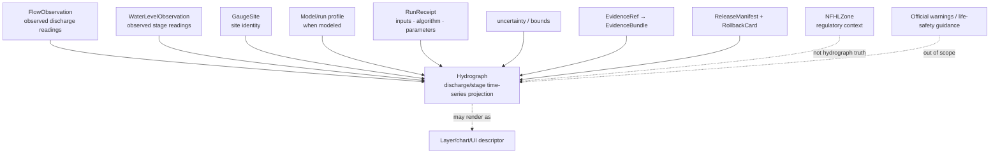

<!-- [KFM_META_BLOCK_V2]
doc_id: kfm://doc/contracts-domains-hydrology-hydrograph
title: Hydrograph Contract — Hydrology
type: semantic-contract
version: v0.2
status: draft; PROPOSED; schema-stub; NEEDS VERIFICATION before promotion
owners:
  - OWNER_TBD — Hydrology domain steward
  - OWNER_TBD — Hydrograph/time-series steward
  - OWNER_TBD — Modeling/receipt steward
  - OWNER_TBD — Contracts steward
  - OWNER_TBD — Source steward
  - OWNER_TBD — Evidence steward
  - OWNER_TBD — Schema steward
  - OWNER_TBD — Policy steward
  - OWNER_TBD — Release steward
  - OWNER_TBD — Docs steward
created: 2026-06-22
updated: 2026-06-22
policy_label: public-with-gates; semantic-contract; hydrology; hydrograph; time-series; discharge; stage; modeled-series; observed-series; run-receipt; uncertainty-bounds; evidence-bound; release-gated; rollback-aware; not-for-life-safety
tags: [kfm, contracts, hydrology, Hydrograph, time-series, discharge, stage, FlowObservation, WaterLevelObservation, GaugeSite, modeled, observed-series, role_model_run_ref, run-receipt, uncertainty, EvidenceBundle, ReleaseManifest, RollbackCard]
related:
  - ./README.md
  - ./decision_envelope.md
  - ./domain_feature_identity.md
  - ./domain_layer_descriptor.md
  - ./domain_observation.md
  - ./domain_validation_report.md
  - ./evidence_bundle.md
  - ./flow_observation.md
  - ./water_level_observation.md
  - ./gauge_site.md
  - ./hydro_feature.md
  - ./reach_identity.md
  - ../../../docs/domains/hydrology/OBJECT_FAMILIES.md
  - ../../../docs/domains/hydrology/GLOSSARY.md
  - ../../../docs/domains/hydrology/SOURCE_ROLE_MATRIX.md
  - ../../../docs/domains/hydrology/API_CONTRACTS.md
  - ../../../docs/domains/hydrology/IDENTITY_MODEL.md
  - ../../../docs/domains/hydrology/README.md
  - ../../../schemas/contracts/v1/domains/hydrology/hydrograph.schema.json
  - ../../../policy/domains/hydrology/
  - ../../../fixtures/domains/hydrology/hydrograph/
  - ../../../tests/domains/hydrology/test_hydrograph.*
  - ../../../data/registry/sources/hydrology/
  - ../../../release/candidates/hydrology/
notes:
  - "Expanded from a thin scaffold at contracts/domains/hydrology/hydrograph.md."
  - "The paired schema exists at schemas/contracts/v1/domains/hydrology/hydrograph.schema.json, but it remains a PROPOSED scaffold with empty properties and additionalProperties=true."
  - "Hydrology object-family doctrine defines Hydrograph as a derived projection of discharge or stage over time, typically composed from underlying observation objects and inheriting temporal scope."
  - "Source-role doctrine states Hydrograph can legitimately span observed and modeled bases, but it must carry a role flag and, when modeled, a role_model_run_ref / run receipt and bounds."
  - "Hydrograph is not a raw observation, not an emergency forecast/warning, not NFHL regulation, not observed flood extent, not release authority, and not AI-generated truth."
[/KFM_META_BLOCK_V2] -->

# Hydrograph Contract — Hydrology

> Semantic contract for `Hydrograph`: a Hydrology time-series projection of discharge or stage over time that may be observed-series-backed or modeled, but must preserve source role, underlying observation lineage, model/run receipt, uncertainty bounds, EvidenceBundle support, release state, correction lineage, and rollback target.

  
  
  
  
  
  
  

`contracts/domains/hydrology/hydrograph.md`

## Quick jumps

[Status](#status) · [Meaning](#meaning) · [Repo fit](#repo-fit) · [Schema posture](#schema-posture) · [Hydrograph boundaries](#hydrograph-boundaries) · [Assertions](#assertions) · [Exclusions](#exclusions) · [Recommended fields](#recommended-fields) · [Source-role rules](#source-role-rules) · [Temporal and series rules](#temporal-and-series-rules) · [Evidence and citation posture](#evidence-and-citation-posture) · [Sensitivity and publication](#sensitivity-and-publication) · [Lifecycle](#lifecycle) · [Validation](#validation) · [Rollback](#rollback) · [Evidence basis](#evidence-basis) · [Open questions](#open-questions)

---

## Status

> [!IMPORTANT]
> **Status:** `draft` / semantic contract  
> **Contract path:** `contracts/domains/hydrology/hydrograph.md`  
> **Schema path:** `schemas/contracts/v1/domains/hydrology/hydrograph.schema.json`  
> **Schema posture:** paired schema exists, but remains a `PROPOSED` scaffold with empty `properties` and `additionalProperties: true`.  
> **Truth posture:** Hydrology docs define `Hydrograph` as a derived projection of discharge or stage over time. Field-level schema shape, validators, fixtures, model/run receipt structure, policy enforcement, emitted EvidenceBundles, release manifests, and public API behavior remain **NEEDS VERIFICATION**.

> [!CAUTION]
> `Hydrograph` is a time-series projection. It is not a raw `FlowObservation` or `WaterLevelObservation`, not an NFHL regulatory object, not observed flood evidence, not an emergency forecast or warning, not a public layer, and not source truth by itself.

---

## Meaning

`Hydrograph` represents a derived or composed discharge/stage time-series view over a time window.

It may describe:

- an observed-series hydrograph composed from released `FlowObservation` or `WaterLevelObservation` inputs;
- a modeled or reconstructed hydrograph with model identity, run receipt, input refs, uncertainty bounds, and explicit modeled role;
- a public-safe chart or layer-backed time-series descriptor when release, evidence, policy, and rollback state are complete;
- a derived view used by Focus Mode, Evidence Drawer, or map UI only through governed APIs and released artifacts.

It must not erase the difference between:

- source observations and derived time-series views;
- observed series and modeled series;
- measurement time and model/run/evaluation/release time;
- chart rendering and evidence support;
- publication readiness and proof support.

---

## Repo fit

| Responsibility | Path or root | This contract's role |
|---|---|---|
| Human-readable object meaning | `contracts/domains/hydrology/hydrograph.md` | This file; semantic contract for Hydrograph. |
| Machine schema | `schemas/contracts/v1/domains/hydrology/hydrograph.schema.json` | Confirmed scaffold; full field shape is not enforced yet. |
| Flow readings | `contracts/domains/hydrology/flow_observation.md` | Observed discharge/streamflow inputs that may compose an observed hydrograph. |
| Stage readings | `contracts/domains/hydrology/water_level_observation.md` | Observed stage/gage-height inputs that may compose an observed hydrograph. |
| Gauge site | `contracts/domains/hydrology/gauge_site.md` | Monitoring location identity for source series. |
| Evidence bundle | `contracts/domains/hydrology/evidence_bundle.md` | Evidence support for input series, model/run inputs, and public claims. |
| Validation report | `contracts/domains/hydrology/domain_validation_report.md` | Gate report proving series role, inputs, model/run, evidence, and release readiness. |
| Layer descriptor | `contracts/domains/hydrology/domain_layer_descriptor.md` | Public delivery descriptor; not hydrograph truth. |
| Decision envelope | `contracts/domains/hydrology/decision_envelope.md` | Runtime finite outcomes. |
| Object catalog | `docs/domains/hydrology/OBJECT_FAMILIES.md` | Defines Hydrograph purpose, identity anchor, and modeled-role posture. |
| Source-role matrix | `docs/domains/hydrology/SOURCE_ROLE_MATRIX.md` | Defines observed/modeled bases and role-model-run requirement. |
| Policy | `policy/domains/hydrology/` | Expected source-role, release, sensitivity, and public-exposure gates. |
| Release | `release/candidates/hydrology/` and release roots | ReleaseManifest, CorrectionNotice, RollbackCard, and promotion decisions. |

---

## Schema posture

| Schema fact | Current posture |
|---|---|
| Confirmed schema path | `schemas/contracts/v1/domains/hydrology/hydrograph.schema.json` |
| Schema status | `PROPOSED` |
| Schema title | `Hydrograph` |
| Visible properties | Empty object |
| Required fields | None visible in scaffold |
| Additional properties | `true` |
| Contract pointer | `contracts/domains/hydrology/hydrograph.md` |
| Source doc pointer | `docs/domains/hydrology/CANONICAL_PATHS.md` |
| Full Hydrograph enforcement | NEEDS VERIFICATION |

This Markdown contract defines intended semantics for review and schema design. The current schema does not enforce series refs, input observation refs, model/run refs, source role, time window, uncertainty bounds, EvidenceBundle refs, policy refs, release refs, correction refs, or rollback refs.

---

## Hydrograph boundaries

A Hydrograph is a projection or composed series. It may cite observed readings, model runs, and network context, but it does not replace those inputs.

---

## Assertions

A reviewed `Hydrograph` should assert:

1. **Series identity** — stable ID and `spec_hash` over source, series role, input refs, temporal scope, model/run profile where present, and normalized digest.
2. **Series role** — observed-series-backed or modeled-series role is explicit; modeled outputs are never relabeled observed.
3. **Input lineage** — FlowObservation, WaterLevelObservation, GaugeSite, HydroFeature/ReachIdentity, and other inputs are referenced rather than embedded as anonymous truth.
4. **Model/run receipt** — modeled hydrographs carry model identity, run receipt, parameters, input digests, and uncertainty/bounds.
5. **Temporal separation** — observed/input time, model run time, retrieval time, release time, and correction time remain distinct.
6. **Unit/parameter clarity** — discharge/stage parameter, unit, datum/reference point, qualifier, and aggregation window remain visible where material.
7. **Evidence closure** — public/consequential hydrograph claims resolve EvidenceRef to EvidenceBundle or abstain.
8. **Policy/release support** — rights, sensitivity, review if needed, ReleaseManifest, CorrectionNotice path, and RollbackCard are present before public release.
9. **Derivative separation** — charts, layers, exports, and AI answers cite the hydrograph but do not become the hydrograph or its evidence.
10. **Correction lineage** — source observation correction, model rerun, input change, or policy change invalidates affected hydrographs and downstream derivatives.

---

## Exclusions

| Misuse | Why it is denied or abstained |
|---|---|
| Hydrograph as raw observation | Source observations remain FlowObservation or WaterLevelObservation objects. |
| Modeled hydrograph as observed reading | Modeled role, model identity, run receipt, and uncertainty must remain visible. |
| Hydrograph as forecast or warning | KFM Hydrology is not emergency/life-safety authority unless separate official source/release supports a bounded context. |
| NFHL regulatory context as hydrograph | NFHL is regulatory flood context, not discharge/stage time series. |
| Observed flood extent as hydrograph | ObservedFloodEvent owns inundation evidence. |
| HUC aggregate as site hydrograph | HUC rollups are aggregate/context summaries, not site time series. |
| Chart/tile as hydrograph truth | Delivery surfaces are not sovereign truth or proof. |
| AI summary as hydrograph evidence | EvidenceBundle and, where modeled, RunReceipt are required. |
| Candidate or experimental run as public hydrograph | Candidate/model outputs require governed review, evidence, policy, release, and rollback. |
| Retrieval/release time as observed/model time | KFM fetch/publication time is not source/model truth. |

---

## Recommended fields

The following fields are **PROPOSED** targets for future schema expansion. They are not enforced by the current schema scaffold.

| Field | Meaning |
|---|---|
| `id` | Canonical Hydrograph ID. |
| `version` | Contract/object version. |
| `spec_hash` | Deterministic digest over normalized hydrograph semantics. |
| `domain` | Must resolve to `hydrology`. |
| `object_type` | `Hydrograph`. |
| `series_role` | observed_series, modeled_series, reconstructed_series, aggregate_series, or accepted enum. |
| `source_descriptor_refs` | SourceDescriptor refs for input observations and/or model sources. |
| `input_observation_refs` | FlowObservation / WaterLevelObservation refs used as inputs. |
| `gauge_site_ref` | GaugeSite/site identity where the series is site-linked. |
| `hydro_feature_ref` | HydroFeature or ReachIdentity ref where network context matters. |
| `parameter_code` | Discharge/stage parameter code or series variable. |
| `parameter_name` | Human-readable variable label. |
| `unit` | Source and normalized unit where applicable. |
| `datum_or_reference_point` | Datum/reference point for stage series where applicable. |
| `series_window` | Start/end time window represented. |
| `aggregation_window` | Instant, daily mean, period statistic, model timestep, or accepted enum. |
| `source_time` | Source publication/update/assertion time for inputs. |
| `observed_time_range` | Time range of underlying observations where observed-series-backed. |
| `model_run_time` | Model/run evaluation time where modeled. |
| `retrieval_time` | KFM fetch time; not series truth. |
| `release_time` | KFM release time; not source/model truth. |
| `correction_time` | Correction/supersession time. |
| `model_identity_ref` | Model profile/algorithm/version reference where modeled. |
| `role_model_run_ref` | RunReceipt / model-run receipt where modeled. |
| `input_digest_refs` | Digests for source inputs/model inputs. |
| `uncertainty_bounds` | Confidence interval, ensemble spread, error bounds, or accepted uncertainty representation. |
| `evidence_ref_ids` | EvidenceRefs supporting the series. |
| `evidence_bundle_ids` | EvidenceBundles supporting public claims. |
| `policy_decision_refs` | Policy decisions controlling exposure/release. |
| `release_refs` | ReleaseManifest/PromotionDecision refs if public. |
| `correction_refs` | CorrectionNotice/supersession refs. |
| `rollback_refs` | RollbackCard/rollback target refs. |
| `quality_flags` | schema_scaffold, missing_series_role, missing_input_observation, missing_model_run_ref, missing_uncertainty, modeled_as_observed, missing_time_window, unit_mismatch, provisional_inputs, release_missing. |

---

## Source-role rules

| Source role / series role | Hydrograph handling |
|---|---|
| `observed_series` | May be composed from observed FlowObservation/WaterLevelObservation inputs; source observations remain separate objects. |
| `modeled_series` | Valid only with model identity, run receipt, inputs, parameters, uncertainty/bounds, and role flag. |
| `reconstructed_series` | Treat as modeled/derived unless source evidence proves observed measurements. |
| `aggregate_series` | Preserve aggregation unit/window; never imply per-site reading. |
| `regulatory` | Not a hydrograph basis by default; NFHL/FloodContext remains separate. |
| `candidate` | Allowed only before review/release; no public Hydrograph until governed promotion. |
| `synthetic` | Not admitted source truth; AI/simulation cannot be relabeled observed. |

---

## Temporal and series rules

| Time/series element | Rule |
|---|---|
| `series_window` | Required for any hydrograph. |
| `observed_time_range` | Required for observed-series-backed hydrographs. |
| `model_run_time` | Required for modeled hydrographs. |
| `source_time` | Required where source publication/update time matters. |
| `retrieval_time` | KFM fetch time; never substitutes for observed or model-run time. |
| `release_time` | KFM publication time; not source/model truth. |
| `correction_time` | Correction lineage for input changes, model reruns, or public release changes. |
| `aggregation_window` | Must be explicit when the series is aggregated or resampled. |

A hydrograph may align observation windows and model windows, but the alignment does not erase which values were observed and which were modeled.

---

## Evidence and citation posture

A public or consequential Hydrograph claim requires EvidenceBundle support.

| Claim | Required support |
|---|---|
| “This hydrograph is based on observed readings.” | EvidenceBundle for input observations, site/series, parameter, unit, qualifier, and observed time range. |
| “This hydrograph is modeled.” | EvidenceBundle plus model identity, run receipt, inputs, parameters, uncertainty/bounds, and model-run time. |
| “This hydrograph appears on a public chart/layer.” | EvidenceBundle + ValidationReport + PolicyDecision + ReleaseManifest + layer/visual descriptor + rollback target. |
| “This hydrograph supports a Focus Mode answer.” | EvidenceBundle + CitationValidationReport + decision envelope; no raw source or AI-only answer. |
| “This hydrograph is corrected/superseded.” | CorrectionNotice links old/new series and invalidated downstream artifacts. |

A chart, graph line, map layer, or AI answer is downstream presentation. It does not replace EvidenceBundle, RunReceipt, or ReleaseManifest support.

---

## Sensitivity and publication

Hydrographs are often public-safe when based on public observations, but derived or joined series can increase risk. Review or restriction may be required when a hydrograph:

- is generated from private or restricted source inputs;
- is linked to infrastructure, dams, intakes, utilities, bridges, levees, or critical facilities;
- is joined with private wells, parcels, land/title, owner, or living-person-adjacent data;
- is used to imply emergency flood guidance or operational water-supply decisions;
- is connected to drought/irrigation/water-use claims that imply per-place certainty;
- includes candidate/unreviewed observations or experimental model runs;
- omits uncertainty/bounds for modeled outputs.

Public release should preserve series role, provisional/final input status, model/run caveats, uncertainty/bounds, and not-for-life-safety notices where needed.

---

## Lifecycle

| Phase | Hydrograph handling |
|---|---|
| RAW | Source observations, model inputs, and run inputs are captured under their owning lifecycle roots; no public hydrograph exists. |
| WORK / QUARANTINE | Compose candidate hydrograph; normalize input refs, series role, parameter/unit, temporal window, model/run refs, uncertainty, evidence refs; quarantine missing role/time/evidence/run receipt or role-collapse issues. |
| PROCESSED | Emit validated Hydrograph candidate with EvidenceRef, ValidationReport, input lineage, model/run lineage where applicable, source-role posture, and quality flags. |
| CATALOG / TRIPLET | Catalog/triplet projections cite the hydrograph and inputs by identity and evidence; projections do not become truth. |
| RELEASE CANDIDATE | Public-safe derivative resolves EvidenceBundle, PolicyDecision, ReviewRecord if needed, ReleaseManifest, CorrectionNotice path, and RollbackCard. |
| PUBLISHED | Governed API/UI may serve released public-safe hydrograph/chart/layer context; public clients do not read RAW/WORK/QUARANTINE directly. |
| CORRECTED / SUPERSEDED | Input correction, model rerun, parameter/unit fix, uncertainty update, or policy change creates correction/supersession lineage and invalidates affected derivatives. |

---

## Validation

Before this contract is promoted beyond draft:

- [ ] Expand `schemas/contracts/v1/domains/hydrology/hydrograph.schema.json` beyond empty `properties`.
- [ ] Decide required fields for series role, input observation refs, GaugeSite ref, parameter, unit, series window, model identity, role_model_run_ref, uncertainty bounds, evidence refs, policy refs, release refs, correction refs, and rollback refs.
- [ ] Define whether Hydrograph inherits from `domain_feature_identity`, `domain_observation`, a shared time-series contract, or a derivative/run-receipt profile.
- [ ] Add positive fixtures for observed discharge hydrograph, observed stage hydrograph, modeled hydrograph with run receipt, reconstructed hydrograph, corrected hydrograph, and released public-safe chart/layer hydrograph.
- [ ] Add negative fixtures for modeled hydrograph relabeled observed, missing model run receipt, missing uncertainty for modeled output, no input observation refs, HUC aggregate as site hydrograph, NFHL as hydrograph, forecast/emergency warning as KFM hydrograph, AI-summary-as-evidence, missing EvidenceBundle, and direct RAW/WORK public access.
- [ ] Add validator coverage for source role, input lineage, model/run receipt, parameter/unit, temporal fields, uncertainty, evidence, policy, release, correction, and rollback.
- [ ] Confirm public API/UI uses `decision_envelope` outcomes and never silently falls through to raw source or generic AI answer.

Recommended finite outcomes:

| Condition | Outcome |
|---|---|
| Hydrograph identity, series role, inputs, time window, model/run refs where applicable, uncertainty, evidence, policy, release, correction, and rollback resolve | `ANSWER` or release-eligible reference |
| Evidence, input refs, series role, time window, unit/parameter, run receipt, uncertainty, rights, or release support is incomplete | `ABSTAIN` / `HOLD` |
| Modeled-as-observed, missing model/run receipt, candidate public exposure, synthetic-as-observed, life-safety framing, or direct RAW/WORK read would occur | `DENY` |
| Schema, validator, source read, evidence lookup, model/run lookup, policy lookup, release lookup, or canonicalization fails | `ERROR` |

---

## Rollback

Rollback is required when Hydrograph handling weakens series-role integrity, input lineage, model/run receipt, uncertainty posture, evidence closure, policy/release state, or correction lineage.

Rollback triggers include modeled hydrograph published as observed; modeled/reconstructed series missing model identity/run receipt/uncertainty; observed hydrograph missing input observations; HUC aggregate presented as site hydrograph; NFHL/regulatory context published as hydrograph; emergency/forecast guidance framed as KFM hydrograph; candidate/experimental run reaches public surface; AI summary treated as evidence; parameter/unit/time window omitted or wrong; observed/model/retrieval/release/correction times collapsed; public API/UI reads RAW/WORK/QUARANTINE directly; source observation correction or model rerun invalidates the series; or release lacks EvidenceBundle, PolicyDecision, ReleaseManifest, CorrectionNotice path, and RollbackCard.

Rollback artifacts should include affected Hydrograph IDs, source descriptors, GaugeSite refs, FlowObservation/WaterLevelObservation refs, HydroFeature/ReachIdentity refs, model identity refs, role_model_run_refs, input digests, series windows, parameter/unit refs, uncertainty bounds, EvidenceRefs/EvidenceBundles, ValidationReports, PolicyDecisions, ReviewRecords, ReleaseManifests, CorrectionNotices, RollbackCards, invalidated charts/layers, invalidated decision envelopes, invalidated exports, and public-cache/style invalidation instructions.

---

## Evidence basis

| Source | Status | Supports | Limits |
|---|---|---|---|
| `contracts/domains/hydrology/hydrograph.md` scaffold | CONFIRMED | Target existed as a planned scaffold from Hydrology file-system plan. | Did not contain authoritative Hydrograph semantics. |
| `schemas/contracts/v1/domains/hydrology/hydrograph.schema.json` | CONFIRMED | Paired schema exists and points to this contract. | Empty `properties`; no field enforcement. |
| `docs/domains/hydrology/OBJECT_FAMILIES.md` | CONFIRMED | Defines Hydrograph as a derived projection of discharge or stage over time, with model identity, run receipt, uncertainty bounds, and never relabeled observed posture. | Concrete attributes are labeled inferred/proposed until schema realization. |
| `docs/domains/hydrology/GLOSSARY.md` | CONFIRMED | Defines Hydrograph as derived projection and modeled-role object with model identity, run receipt, and bounds. | Field realization remains PROPOSED outside the glossary. |
| `docs/domains/hydrology/SOURCE_ROLE_MATRIX.md` | CONFIRMED | Hydrograph can legitimately span observed and modeled; it must carry a role flag and modeled hydrographs require `role_model_run_ref`. | Machine enforcement requires SourceDescriptor, EvidenceBundle, policy, fixtures, and validators. |
| `docs/domains/hydrology/OBJECT_FAMILIES.md` object-family spine | CONFIRMED | Shows FlowObservation and WaterLevelObservation feeding Hydrograph in the Hydrology object spine. | Diagram is doctrine/reference, not runtime implementation. |
| User-provided authoring role | CONFIRMED user instruction | Requires evidence-grounded, repo-ready Markdown and visible verification boundaries. | Authoring rule, not implementation proof. |

---

## Open questions

| Question | Status | Resolution path |
|---|---|---|
| Which exact fields must be required in `hydrograph.schema.json`? | NEEDS VERIFICATION | Schema steward + Hydrograph/time-series steward review. |
| Should Hydrograph inherit from `domain_feature_identity`, a shared time-series contract, or a modeled-run profile? | NEEDS VERIFICATION | Contract/schema design decision. |
| What is the canonical shape and location of `role_model_run_ref` / RunReceipt? | NEEDS VERIFICATION | Modeling/receipt contract review. |
| Which uncertainty/bounds representation is canonical? | NEEDS VERIFICATION | Schema/fixture/model steward review. |
| How should observed-series and modeled-series hydrographs share a schema without role collapse? | NEEDS VERIFICATION | Source-role fixtures and validator implementation. |
| Which validator proves hydrographs cannot be used as emergency/life-safety guidance? | NEEDS VERIFICATION | Negative fixtures and policy enforcement. |

---

## Related contracts and docs

- [`./README.md`](./README.md) — Hydrology contract-root README.
- [`./domain_feature_identity.md`](./domain_feature_identity.md) — feature identity and `spec_hash` companion.
- [`./domain_observation.md`](./domain_observation.md) — shared observation envelope.
- [`./domain_layer_descriptor.md`](./domain_layer_descriptor.md) — public layer descriptor, not hydrograph truth.
- [`./decision_envelope.md`](./decision_envelope.md) — runtime finite-outcome carrier.
- [`./evidence_bundle.md`](./evidence_bundle.md) — Hydrology EvidenceBundle alias.
- [`./flow_observation.md`](./flow_observation.md) — observed discharge/streamflow input contract.
- [`./water_level_observation.md`](./water_level_observation.md) — observed stage/gage-height input contract, if present/expanded.
- [`./gauge_site.md`](./gauge_site.md) — monitoring-location identity contract.
- [`./hydro_feature.md`](./hydro_feature.md) — network/context feature contract.
- [`./reach_identity.md`](./reach_identity.md) — stable reach identity contract, if present/expanded.
- [`../../../docs/domains/hydrology/OBJECT_FAMILIES.md`](../../../docs/domains/hydrology/OBJECT_FAMILIES.md) — object-family catalog.
- [`../../../docs/domains/hydrology/GLOSSARY.md`](../../../docs/domains/hydrology/GLOSSARY.md) — Hydrology vocabulary.
- [`../../../docs/domains/hydrology/SOURCE_ROLE_MATRIX.md`](../../../docs/domains/hydrology/SOURCE_ROLE_MATRIX.md) — source-role anti-collapse matrix.
- [`../../../schemas/contracts/v1/domains/hydrology/hydrograph.schema.json`](../../../schemas/contracts/v1/domains/hydrology/hydrograph.schema.json) — current schema scaffold.

[Back to top](#top)
