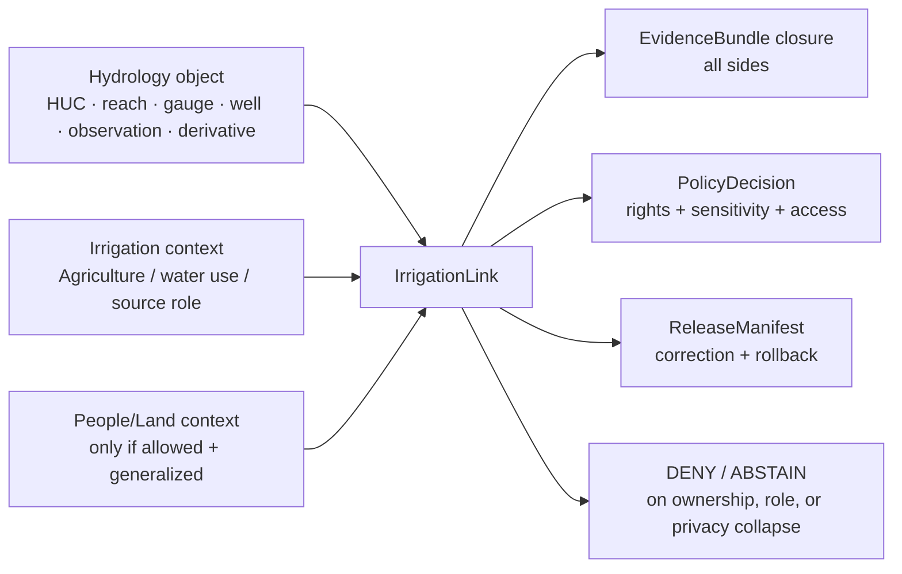
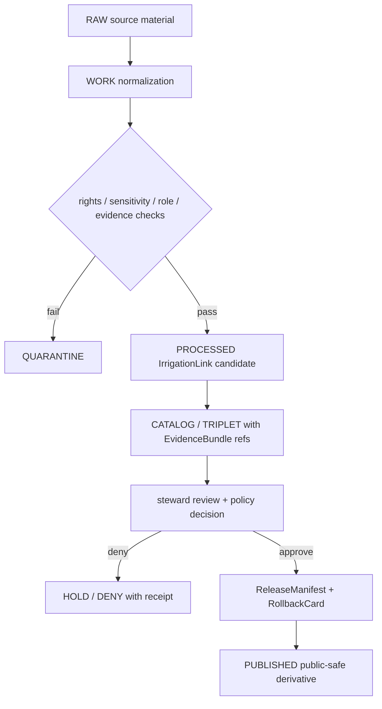

<!-- [KFM_META_BLOCK_V2]
doc_id: kfm://doc/contracts-domains-hydrology-irrigation-link
title: Irrigation Link Contract — Hydrology
type: semantic-contract
version: v0.2
status: draft; PROPOSED; schema-missing; NEEDS VERIFICATION before promotion
owners:
  - OWNER_TBD — Hydrology domain steward
  - OWNER_TBD — Agriculture seam steward
  - OWNER_TBD — People/Land seam steward
  - OWNER_TBD — Contracts steward
  - OWNER_TBD — Source steward
  - OWNER_TBD — Evidence steward
  - OWNER_TBD — Schema steward
  - OWNER_TBD — Policy steward
  - OWNER_TBD — Release steward
  - OWNER_TBD — Docs steward
created: 2026-06-22
updated: 2026-06-22
policy_label: public-with-gates; semantic-contract; hydrology; irrigation-link; cross-lane-link; source-role-aware; evidence-bound; release-gated; rollback-aware; not-for-water-rights-adjudication; not-for-life-safety
tags: [kfm, contracts, hydrology, irrigation-link, IrrigationLink, cross-lane, agriculture, people-land, water-use, groundwater, source-role, EvidenceBundle, PolicyDecision, ReleaseManifest, RollbackCard, HUCUnit, ReachIdentity, FlowObservation, WaterLevelObservation, GroundwaterWell, WaterUseLink]
related:
  - ./README.md
  - ./decision_envelope.md
  - ./domain_feature_identity.md
  - ./domain_layer_descriptor.md
  - ./domain_observation.md
  - ./domain_validation_report.md
  - ./huc_unit.md
  - ./flow_observation.md
  - ./water_level_observation.md
  - ./groundwater_well.md
  - ./drought_link.md
  - ../../../docs/domains/hydrology/OBJECT_FAMILIES.md
  - ../../../docs/domains/hydrology/SOURCE_ROLE_MATRIX.md
  - ../../../docs/domains/hydrology/GLOSSARY.md
  - ../../../docs/domains/hydrology/BOUNDARY.md
  - ../../../docs/domains/hydrology/FILE_SYSTEM_PLAN.md
  - ../../../docs/domains/agriculture/OBJECT_FAMILIES.md
  - ../../../docs/domains/agriculture/OBJECTS.md
  - ../../../schemas/contracts/v1/domains/hydrology/irrigation_link.schema.json
  - ../../../schemas/contracts/v1/domains/agriculture/irrigation_link.schema.json
  - ../../../policy/domains/hydrology/
  - ../../../policy/domains/agriculture/
  - ../../../fixtures/domains/hydrology/irrigation_link/
  - ../../../tests/domains/hydrology/test_irrigation_link.*
  - ../../../data/registry/sources/hydrology/
  - ../../../release/candidates/hydrology/
notes:
  - "Expanded from a thin scaffold at contracts/domains/hydrology/irrigation_link.md."
  - "The exact paired schema path schemas/contracts/v1/domains/hydrology/irrigation_link.schema.json was not found in this session."
  - "The Agriculture paired schema path schemas/contracts/v1/domains/agriculture/irrigation_link.schema.json was also not found in this session."
  - "Hydrology docs treat IrrigationLink as a proposed cross-lane link object to Agriculture. Agriculture docs also name IrrigationLink as OF-AG-05 with Agriculture-side ownership. This file defines the Hydrology-side semantic boundary and does not claim ownership of irrigation administration, water-right truth, crop/yield truth, landowner identity, or emergency/water-supply guidance."
[/KFM_META_BLOCK_V2] -->

# Irrigation Link Contract — Hydrology

> Semantic contract for `IrrigationLink`: a Hydrology cross-lane seam object that links released Hydrology context to irrigation context while preserving each lane's source role, evidence, temporal scope, sensitivity posture, release state, correction lineage, and rollback target.

  
  
  
  
  
  
  

`contracts/domains/hydrology/irrigation_link.md`

## Quick jumps

[Status](#status) · [Meaning](#meaning) · [Repo fit](#repo-fit) · [Schema posture](#schema-posture) · [Boundary rule](#boundary-rule) · [Link semantics](#link-semantics) · [Assertions](#assertions) · [Exclusions](#exclusions) · [Recommended fields](#recommended-fields) · [Source-role rules](#source-role-rules) · [Temporal rules](#temporal-rules) · [Sensitivity and publication](#sensitivity-and-publication) · [Lifecycle](#lifecycle) · [Validation](#validation) · [Rollback](#rollback) · [Evidence basis](#evidence-basis) · [Open questions](#open-questions)

---

## Status

> [!IMPORTANT]
> **Status:** `draft` / semantic contract  
> **Contract path:** `contracts/domains/hydrology/irrigation_link.md`  
> **Expected Hydrology schema path:** `schemas/contracts/v1/domains/hydrology/irrigation_link.schema.json`  
> **Expected Agriculture schema path:** `schemas/contracts/v1/domains/agriculture/irrigation_link.schema.json`  
> **Schema posture:** exact paired schemas were **not found** in this session. This contract is semantic intent until schema, fixtures, validators, and policy gates exist.  
> **Truth posture:** `IrrigationLink` is confirmed as a Hydrology/Agriculture seam term in inspected docs. Field-level schema, validator enforcement, fixtures, policy runtime, release artifacts, and public API behavior remain **NEEDS VERIFICATION**.

> [!CAUTION]
> `IrrigationLink` is a seam object, not an irrigation permit, water-right adjudication, irrigation-need model, crop-yield explanation, private-well disclosure, parcel ownership claim, emergency water-supply instruction, or publication authority.

---

## Meaning

`IrrigationLink` records a governed relationship between a Hydrology object and an irrigation-context object or source context.

It may link Hydrology context such as:

- `HUCUnit`, `Watershed`, or `ReachIdentity`;
- `FlowObservation` or `WaterLevelObservation` trends;
- `GroundwaterWell` or `AquiferObservation` public-safe derivatives;
- `WaterUseLink`, `Hydrograph`, or `UpstreamTrace` derivatives;
- released public-safe Hydrology layers or evidence bundles;

…to irrigation context supplied by Agriculture, People/Land, state water-office records, or another governed source family.

It does **not** claim that Hydrology owns irrigation truth. It says: "this Hydrology object is linked to this irrigation context under these roles, evidence refs, time windows, caveats, sensitivity constraints, and release conditions."

---

## Repo fit

| Responsibility | Path or root | This contract's role |
|---|---|---|
| Human-readable Hydrology-side link meaning | `contracts/domains/hydrology/irrigation_link.md` | This file; semantic contract for Hydrology's irrigation seam. |
| Agriculture-side contract candidate | `contracts/domains/agriculture/irrigation_link.md` | Expected Agriculture-side semantic contract; existence and content remain NEEDS VERIFICATION in this session. |
| Machine schema — Hydrology profile | `schemas/contracts/v1/domains/hydrology/irrigation_link.schema.json` | Expected path, but not found in this session. |
| Machine schema — Agriculture profile | `schemas/contracts/v1/domains/agriculture/irrigation_link.schema.json` | Expected path, but not found in this session. |
| Contract root | `contracts/domains/hydrology/README.md` | Hydrology contract-root boundaries and object-family expectations. |
| Hydrology object catalog | `docs/domains/hydrology/OBJECT_FAMILIES.md` | Treats `IrrigationLink` as a proposed cross-lane link object. |
| Hydrology glossary | `docs/domains/hydrology/GLOSSARY.md` | Defines `IrrigationLink` as a link relating Hydrology to irrigation context. |
| Hydrology boundary doctrine | `docs/domains/hydrology/BOUNDARY.md` | Agriculture seam: reach identity and water-availability context may bound irrigation links; observed flow is not a yield input without modeling. |
| Source-role matrix | `docs/domains/hydrology/SOURCE_ROLE_MATRIX.md` | Drought/irrigation link sources commonly carry modeled or aggregate roles; per-parcel certainty is denied. |
| Agriculture object register | `docs/domains/agriculture/OBJECT_FAMILIES.md` | Names `IrrigationLink` as `OF-AG-05` with Agriculture-side edge responsibility and sensitivity escalation. |
| Decision envelope | `contracts/domains/hydrology/decision_envelope.md` | Runtime finite outcomes for requests touching the link. |
| Feature identity | `contracts/domains/hydrology/domain_feature_identity.md` | Stable identity and source-role/time/digest companion. |
| Validation report | `contracts/domains/hydrology/domain_validation_report.md` | Gate record that should catch invalid link claims. |
| Policy | `policy/domains/hydrology/`, `policy/domains/agriculture/` | Expected cross-lane, sensitivity, rights, release, and source-role gates. |
| Release | `release/candidates/hydrology/` and release roots | ReleaseManifest, PromotionDecision, CorrectionNotice, RollbackCard. |

---

## Schema posture

| Schema fact | Current posture |
|---|---|
| Hydrology expected schema path | `schemas/contracts/v1/domains/hydrology/irrigation_link.schema.json` |
| Agriculture expected schema path | `schemas/contracts/v1/domains/agriculture/irrigation_link.schema.json` |
| Exact Hydrology schema found? | **No** — direct fetch returned not found in this session. |
| Exact Agriculture schema found? | **No** — direct fetch returned not found in this session. |
| Hydrology contract source | `docs/domains/hydrology/FILE_SYSTEM_PLAN.md` named the target path as planned/expected. |
| Object-family sources | Hydrology `OBJECT_FAMILIES.md` / `GLOSSARY.md` name `IrrigationLink` as a proposed cross-lane link; Agriculture `OBJECT_FAMILIES.md` names it as `OF-AG-05`. |
| Field-level enforcement | MISSING / NEEDS VERIFICATION |
| Contract promotion status | HOLD until schema, fixtures, validators, policy, release tests, source registry rows, and cross-lane ownership mapping exist. |

This Markdown contract defines intended meaning for review and schema design. It does not prove implementation.

---

## Boundary rule

An `IrrigationLink` must preserve five cross-lane conditions:

1. **Ownership preserved** — Hydrology owns the Hydrology-side relation, not irrigation administration, water-right adjudication, crop/yield truth, or landowner identity.
2. **Source role preserved** — observed, administrative, modeled, aggregate, regulatory, candidate, and synthetic roles do not upgrade through the join.
3. **Sensitivity preserved** — the most restrictive applicable policy governs the public link, especially well-owner, operator, parcel, or withdrawal joins.
4. **EvidenceBundle support preserved** — every side resolves evidence before the link is used in a claim.
5. **Release state preserved** — no link becomes public merely because both sides exist; it must pass release gates with a rollback target.

---

## Link semantics

| Link side | Meaning | Boundary |
|---|---|---|
| Hydrology side | The HUC, watershed, reach, gauge, flow/water-level observation, groundwater/well context, water-use relation, layer, derivative, or EvidenceBundle being related to irrigation context. | Hydrology identity, source role, and release state stay with Hydrology. |
| Irrigation side | The irrigation context, water-use/withdrawal context, state administrative record, Agriculture object, modeled irrigation surface, or source-family claim. | Irrigation / Agriculture / source identity and source role stay with the owning lane/source. |
| Land / owner side | Optional, policy-sensitive context such as water-right ownership or parcel-adjacent information. | Does not become public exact data without rights, sensitivity, aggregation/redaction, and steward review. |
| Link relation | The governed assertion that the sides are related under a scope, method, time window, evidence basis, and policy posture. | Link does not create irrigation entitlement, irrigation need, yield attribution, per-parcel certainty, or owner disclosure. |
| Public derivative | Generalized/released map/card/export/focus context derived from the link. | Requires EvidenceBundle, PolicyDecision, ReleaseManifest, correction path, and rollback target. |

---

## Assertions

A reviewed `IrrigationLink` should assert:

1. **Stable link identity** — canonical link ID and `spec_hash` over both sides, roles, temporal scope, method/scope, sensitivity posture, and normalized digest.
2. **Hydrology-side reference** — HUC, watershed, reach, gauge, observation, aquifer/well context, hydrograph, upstream trace, layer, water-use link, or EvidenceBundle ref.
3. **Irrigation-side reference** — Agriculture `IrrigationLink`, water-use object, administrative source, modeled/aggregate irrigation context, or owning-lane ref.
4. **Optional land/owner sensitivity reference** — only as a policy-gated ref, not as public owner disclosure.
5. **Source-role preservation** — observed flow remains observed; administrative water-right or allocation records remain administrative; modeled irrigation estimates remain modeled; aggregate summaries remain aggregate.
6. **Temporal alignment** — hydrology observation windows, irrigation season/year, administrative effective dates, retrieval time, release time, and correction time are explicit and not collapsed.
7. **Spatial alignment** — HUC/reach/well/field/parcel/aggregation unit scope is explicit; per-place certainty is not invented from aggregate context.
8. **Evidence closure** — EvidenceRefs/EvidenceBundles resolve for each side before public claims.
9. **Policy/review support** — rights, sensitivity, source terms, and cross-lane review state are recorded.
10. **Release separation** — ReleaseManifest and rollback target are required before public use.
11. **Correction lineage** — changes to either side invalidate or revalidate the link.

---

## Exclusions

| Misuse | Why it is denied or abstained |
|---|---|
| Treating `IrrigationLink` as a water right, permit, allocation, or legal entitlement | The link is relational; administrative/legal truth belongs to the source and owning lane. |
| Treating observed streamflow as crop yield or irrigation need without a model | Observed Hydrology context does not become Agriculture analysis by being joined. |
| Treating aggregate irrigation context as per-parcel truth | Aggregate role loses individual/place fidelity. |
| Treating modeled irrigation estimate as observed water use | Modeled role and uncertainty must remain visible. |
| Publishing private well, owner, operator, or parcel implications through irrigation joins | Sensitive/private-property joins require rights, policy review, aggregation, redaction, or denial. |
| Using the link for emergency water-supply instructions | KFM is not a life-safety or operational authority. |
| Using the link for regulatory enforcement or adjudication | KFM is an evidence-publication system, not a legal decision-maker. |
| Public direct read from RAW/WORK/QUARANTINE | Public clients use governed APIs and released artifacts only. |
| AI summary as evidence for a link | AI is interpretive; EvidenceBundle is required. |

---

## Recommended fields

The following fields are **PROPOSED** targets for future schema expansion. They are not enforced by a confirmed `irrigation_link.schema.json` in this session.

| Field | Meaning |
|---|---|
| `id` | Canonical IrrigationLink ID. |
| `version` | Contract/object version. |
| `spec_hash` | Deterministic digest over normalized link semantics. |
| `domain` | For this Hydrology-side profile, must resolve to `hydrology`. |
| `object_type` | `IrrigationLink`. |
| `hydrology_ref` | Hydrology-side object/layer/EvidenceBundle reference. |
| `hydrology_object_family` | HUCUnit, Watershed, ReachIdentity, FlowObservation, WaterLevelObservation, GroundwaterWell, AquiferObservation, Hydrograph, UpstreamTrace, WaterUseLink, etc. |
| `hydrology_source_role` | Source role on Hydrology side. |
| `irrigation_ref` | Irrigation-side object/source/context reference. |
| `irrigation_owner_domain` | Usually `agriculture`; may reference a source-family owner where no Agriculture object exists yet. |
| `irrigation_source_role` | Administrative, observed, modeled, aggregate, candidate, or other admitted role. |
| `land_sensitive_ref` | Optional opaque reference to People/Land context; must not expose owner/parcel detail publicly without policy gates. |
| `relation_type` | Controlled relation such as `bounds_irrigation_context`, `supports_water_use_context`, `coincident_with_irrigation_area`, `administrative_link_only`, or `modeled_association`. |
| `method` | Join method or modeling method used to relate the sides. |
| `spatial_scope` | HUC/reach/well/field/parcel/aggregation unit scope and public-safe geometry class. |
| `temporal_scope` | Irrigation season/year, hydrology observation/model window, source effective dates, retrieval time, release time, correction time. |
| `evidence_refs` | EvidenceRefs required for all sides of the link. |
| `policy_decision_ref` | PolicyDecision that allowed, restricted, generalized, or denied use. |
| `aggregation_receipt_ref` | Required when aggregate context is published or used to avoid per-place inference. |
| `redaction_receipt_ref` | Required when precise well/parcel/operator detail is generalized or suppressed. |
| `release_manifest_ref` | ReleaseManifest proving public exposure is gated. |
| `rollback_ref` | RollbackCard or rollback target. |
| `limitations` | Caveats, non-authoritative boundaries, and not-for-life-safety/non-adjudication language. |

---

## Source-role rules

`IrrigationLink` commonly touches several role classes. Role is set at source admission and must not be upgraded by a link.

| Source / context family | Common role | Allowed use in `IrrigationLink` | Denied use |
|---|---|---|---|
| USGS Water Data / NWIS | observed | Hydrology-side flow/water-level context for a place/time. | Irrigation entitlement, crop yield, permit status, or emergency guidance. |
| WBD / HUC | authority/context or aggregate | Spatial accounting unit for water context. | Per-parcel irrigation certainty. |
| NHDPlus / 3DHP | authority/context or modeled | Reach identity and network context. | Observed withdrawal/use unless separately evidenced. |
| State water-office records | administrative / observed / aggregate | Water use, permit, allocation, or administrative context when rights and source terms permit. | Scientific hydrologic observation unless the source itself supports that role. |
| Agriculture irrigation context | administrative / observed / modeled / aggregate | Irrigation-side object or context when Agriculture evidence is preserved. | Hydrology-side observation or legal entitlement unless proven by owning source. |
| Well-log / groundwater context | observed / administrative / context | Public-safe groundwater/well context after policy review. | Owner-resolvable private-well disclosure. |
| Modeled irrigation surfaces | modeled | Analytical context with model identity, inputs, uncertainty, and run receipt. | Observed irrigation use or per-field truth. |
| Aggregate irrigation summaries | aggregate | County/HUC/region-level context with aggregation receipt. | Per-place/per-parcel certainty. |
| AI-generated summaries | synthetic / interpretive carrier | User-facing explanation only after citation validation. | Evidence, source truth, or role upgrade. |

---

## Temporal rules

An `IrrigationLink` must not collapse distinct time kinds.

| Time kind | Required treatment |
|---|---|
| `hydrology_observed_time` | Time of observed flow, level, water quality, or groundwater measurement. |
| `hydrology_valid_time` | Valid period for Hydrology derivative, HUC/reach vintage, or released layer. |
| `irrigation_activity_time` | Irrigation season, event window, reporting year, or modeled period. |
| `administrative_effective_time` | Effective period for administrative water-use, permit, allocation, or source record. |
| `source_time` | Source publication/revision time. |
| `retrieval_time` | When KFM retrieved or froze the source material. |
| `release_time` | When a governed KFM artifact was published. |
| `correction_time` | When a correction, withdrawal, supersession, or rollback was recorded. |

If the source only supports a coarse period such as county-year, HUC-season, or reporting year, public surfaces must show the coarse period and abstain from finer temporal claims.

---

## Sensitivity and publication

`IrrigationLink` is public only after policy gates. Default handling should assume increased sensitivity when irrigation context can be joined to well, parcel, operator, landowner, or private water-use detail.

| Exposure pattern | Default posture |
|---|---|
| HUC/county/regional aggregate irrigation context | Potentially public after evidence, rights, aggregation receipt, and release review. |
| Reach/HUC context linked to public Hydrology evidence only | Potentially public if source role and limitations are visible. |
| Well-level irrigation context | Review-required; generalize or redact precise location unless source terms and policy allow exact exposure. |
| Parcel/operator/owner-resolvable irrigation context | DENY public exact exposure unless a specific policy decision, rights basis, review record, and redaction/aggregation path allow a restricted derivative. |
| Modeled irrigation estimate | Public only with model identity, uncertainty, scope, and no observed-use implication. |
| Emergency water shortage / operational advice | Out of scope; DENY or direct users to official authorities without turning KFM into an alerting system. |

Public UI and API surfaces must present `IrrigationLink` with badges or fields showing: source role, spatial scope, temporal scope, evidence status, policy decision, release state, and caveats.

---

## Lifecycle

Promotion is a governed state transition. Moving a file, joining tables, or generating a map layer does not publish an `IrrigationLink`.

---

## Validation

Minimum validation expectations before promotion:

| Gate | Required check |
|---|---|
| Schema | `irrigation_link.schema.json` exists in the approved schema home and validates valid/invalid fixtures. |
| Identity | `id` and `spec_hash` are deterministic over both sides, roles, time scopes, method, and sensitivity posture. |
| Source role | No role upgrade across the link; observed/model/aggregate/administrative roles remain explicit. |
| Evidence closure | EvidenceRefs resolve to EvidenceBundles for all sides. |
| Rights | Source terms allow the specific derivative and redistribution class. |
| Sensitivity | Well, parcel, owner, and operator joins are generalized, redacted, restricted, or denied as required. |
| Temporal | Hydrology observation time, irrigation activity time, administrative effective time, retrieval time, release time, and correction time stay distinct. |
| Spatial | Aggregation unit and geometry scope are explicit; aggregate-to-per-place claims DENY. |
| Policy | PolicyDecision records allow/restrict/deny outcome with reason codes. |
| Release | ReleaseManifest, PromotionDecision, CorrectionNotice path, and RollbackCard exist before public exposure. |
| UI/API | Public surfaces include caveats and abstain/deny on unsupported questions. |

Negative fixtures should include at least:

- aggregate irrigation summary presented as parcel-level truth;
- modeled irrigation estimate presented as observed water use;
- observed flow used as crop yield or irrigation-need proof without a model;
- private well / owner / parcel details exposed publicly;
- administrative water-right record treated as hydrologic observation;
- AI summary treated as evidence;
- RAW/WORK/QUARANTINE candidate exposed on a public route.

---

## Rollback

A released `IrrigationLink` must be rollback-ready.

Rollback is required when:

- either side's source record is corrected, withdrawn, superseded, or reclassified;
- a source-role error is discovered;
- a sensitivity/rights decision changes;
- a spatial join is found invalid or over-precise;
- a modeled or aggregate surface was presented as observed/per-place truth;
- a public artifact omitted the required caveat, release state, or evidence reference;
- an owner/operator/parcel inference escaped into a public artifact.

Rollback must record:

| Rollback item | Required content |
|---|---|
| `rollback_ref` | Stable rollback target or RollbackCard ID. |
| `affected_release_manifest_ref` | ReleaseManifest being withdrawn, corrected, or superseded. |
| `reason_code` | Rights, sensitivity, role-collapse, evidence-missing, temporal mismatch, spatial mismatch, stale source, or implementation error. |
| `replacement_ref` | Replacement release, correction notice, or abstention record. |
| `public_notice_required` | Whether a public correction notice is required. |

---

## Evidence basis

This contract is based on current repository evidence and KFM doctrine visible in this session:

| Evidence | Supports | Limit |
|---|---|---|
| `contracts/domains/hydrology/README.md` | Names `IrrigationLink` among Hydrology accepted contract inputs and cross-domain link objects. | Does not define full fields or schema. |
| `docs/domains/hydrology/OBJECT_FAMILIES.md` | Treats `IrrigationLink` as a proposed cross-lane link object and states Hydrology does not own irrigation administration. | Field-level schema remains proposed. |
| `docs/domains/hydrology/GLOSSARY.md` | Defines `IrrigationLink` as a cross-lane term relating Hydrology to irrigation context. | Does not settle public exposure policy. |
| `docs/domains/hydrology/BOUNDARY.md` | Agriculture seam: reach identity and water-availability context may bound irrigation links; observed flow is not a yield input without modeling. | Does not implement policy. |
| `docs/domains/hydrology/SOURCE_ROLE_MATRIX.md` | Drought/irrigation sources are modeled/aggregate context and are not authoritative for per-parcel certainty or per-place observation. | Matrix is human-readable; SourceDescriptor registry wins if conflicting. |
| `docs/domains/agriculture/OBJECT_FAMILIES.md` | Names `IrrigationLink` as Agriculture `OF-AG-05`, with Hydrology and People/Land citations and sensitivity escalation. | Agriculture-side contract/schema existence remains NEEDS VERIFICATION. |
| Direct fetch of expected Hydrology schema | `schemas/contracts/v1/domains/hydrology/irrigation_link.schema.json` returned not found. | Absence in fetch does not prove no future branch or generated artifact exists. |
| Direct fetch of expected Agriculture schema | `schemas/contracts/v1/domains/agriculture/irrigation_link.schema.json` returned not found. | Absence in fetch does not prove no future branch or generated artifact exists. |

---

## Open questions

| ID | Question | Evidence needed | Status |
|---|---|---|---|
| OQ-HYD-IRR-01 | Should `IrrigationLink` have one canonical semantic contract in Agriculture with a Hydrology profile, or separate Agriculture/Hydrology contracts with a shared schema? | ADR or contracts steward decision. | OPEN / NEEDS VERIFICATION |
| OQ-HYD-IRR-02 | Which schema home will own the machine shape: Hydrology, Agriculture, shared cross-domain, or profile pair? | Accepted schema ADR and mounted schema index. | OPEN / NEEDS VERIFICATION |
| OQ-HYD-IRR-03 | Which source-role enum values are final for this object: `administrative`, `observed`, `modeled`, `aggregate`, `context`, or a reduced canonical set? | SourceDescriptor schema + ADR-S-04 source-role vocabulary. | OPEN / NEEDS VERIFICATION |
| OQ-HYD-IRR-04 | What public aggregation threshold prevents irrigation links from exposing operator, well-owner, or parcel-sensitive information? | Sensitivity policy + fixtures. | OPEN / NEEDS VERIFICATION |
| OQ-HYD-IRR-05 | Which Kansas water-office sources are admissible and what redistribution terms apply? | SourceDescriptor + rights review. | OPEN / NEEDS VERIFICATION |
| OQ-HYD-IRR-06 | What negative fixtures prove aggregate-to-per-place and private-well disclosure denial? | Invalid fixtures and policy tests. | OPEN / NEEDS VERIFICATION |
| OQ-HYD-IRR-07 | Should public maps show irrigation links at HUC, county, basin, or generalized reach scale by default? | Map release policy and usability review. | OPEN / NEEDS VERIFICATION |

---

## Definition of done

This contract can move beyond draft only when:

- a schema exists in the approved schema home;
- Hydrology and Agriculture ownership boundaries are settled;
- valid and invalid fixtures exist;
- policy gates enforce role, rights, sensitivity, temporal, spatial, and release constraints;
- tests cover public-deny cases for parcel/operator/well-owner exposure and per-place inference;
- source descriptors exist for each active source family;
- at least one no-network fixture slice resolves EvidenceBundle refs;
- release and rollback artifacts exist for the first public-safe derivative;
- docs in Hydrology and Agriculture agree or a drift entry/ADR records the remaining conflict.

[Back to top](#top)
