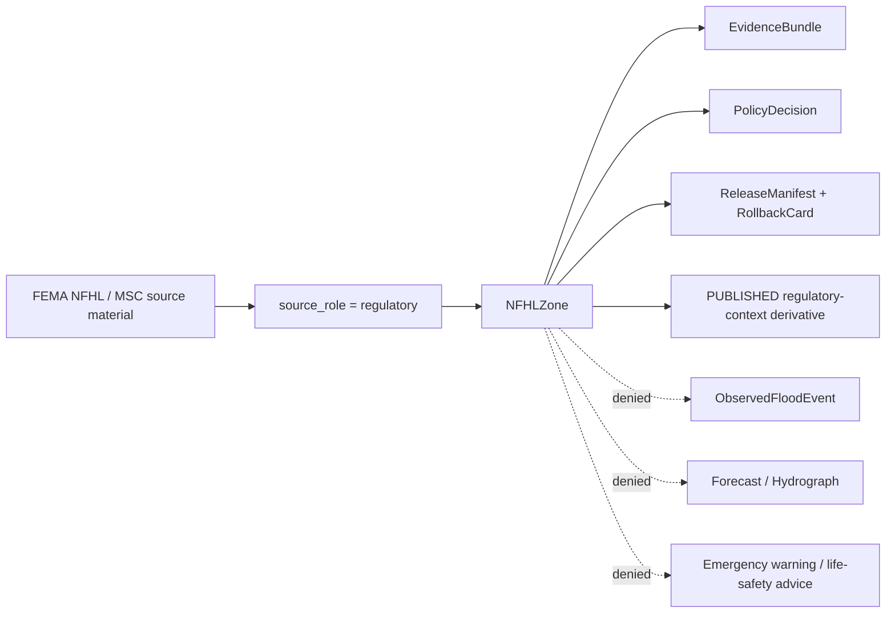
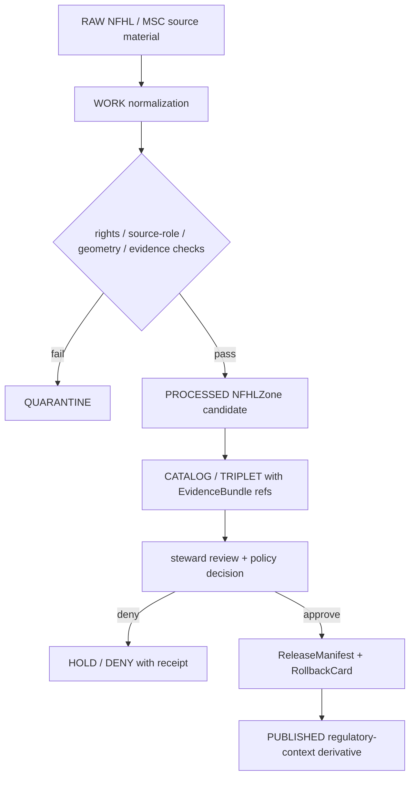

<!-- [KFM_META_BLOCK_V2]
doc_id: kfm://doc/contracts-domains-hydrology-nfhl-zone
title: NFHL Zone Contract — Hydrology
type: semantic-contract
version: v0.2
status: draft; PROPOSED; schema-scaffold; NEEDS VERIFICATION before promotion
owners:
  - OWNER_TBD — Hydrology domain steward
  - OWNER_TBD — Flood/regulatory-context steward
  - OWNER_TBD — Hazards seam steward
  - OWNER_TBD — Contracts steward
  - OWNER_TBD — Source steward
  - OWNER_TBD — Evidence steward
  - OWNER_TBD — Schema steward
  - OWNER_TBD — Policy steward
  - OWNER_TBD — Release steward
  - OWNER_TBD — Docs steward
created: NEEDS VERIFICATION — scaffold existed before v0.2 expansion
updated: 2026-06-22
policy_label: public-with-gates; semantic-contract; hydrology; NFHLZone; FloodContext; regulatory-only; source-role-aware; evidence-bound; release-gated; rollback-aware; not-observed-flood; not-forecast; not-life-safety
tags: [kfm, contracts, hydrology, nfhl-zone, NFHLZone, FloodContext, FEMA, NFHL, MSC, regulatory, flood-context, source-role, EvidenceBundle, PolicyDecision, ReleaseManifest, RollbackCard, ObservedFloodEvent, Hydrograph]
related:
  - ./README.md
  - ./decision_envelope.md
  - ./domain_feature_identity.md
  - ./domain_layer_descriptor.md
  - ./domain_observation.md
  - ./domain_validation_report.md
  - ./observed_flood_event.md
  - ./hydrograph.md
  - ../../../docs/domains/hydrology/OBJECT_FAMILIES.md
  - ../../../docs/domains/hydrology/SOURCE_ROLE_MATRIX.md
  - ../../../docs/domains/hydrology/GLOSSARY.md
  - ../../../docs/domains/hydrology/BOUNDARY.md
  - ../../../docs/domains/hydrology/CANONICAL_PATHS.md
  - ../../../docs/domains/hydrology/FILE_SYSTEM_PLAN.md
  - ../../../schemas/contracts/v1/domains/hydrology/nfhl_zone.schema.json
  - ../../../policy/domains/hydrology/
  - ../../../fixtures/domains/hydrology/nfhl_zone/
  - ../../../tests/domains/hydrology/test_nfhl_zone.*
  - ../../../data/registry/sources/hydrology/
  - ../../../release/candidates/hydrology/
notes:
  - "Expanded from a thin scaffold at contracts/domains/hydrology/nfhl_zone.md."
  - "The paired schema file exists at schemas/contracts/v1/domains/hydrology/nfhl_zone.schema.json, but current evidence shows it is still a PROPOSED scaffold with empty properties and additionalProperties: true. Field-level machine enforcement remains NEEDS VERIFICATION."
  - "NFHLZone is regulatory flood-hazard context only. It must never be represented as observed inundation, real-time flooding, modeled forecast, emergency warning, or life-safety guidance."
[/KFM_META_BLOCK_V2] -->

# NFHL Zone Contract — Hydrology

> Semantic contract for `NFHLZone`: a Hydrology regulatory-context object for FEMA National Flood Hazard Layer material. It preserves NFHL as **regulatory flood-hazard context only** and denies any collapse into observed inundation, modeled forecast, emergency alert, or life-safety instruction.

  
  
  
  
  
  
  

`contracts/domains/hydrology/nfhl_zone.md`

## Quick jumps

[Status](#status) · [Meaning](#meaning) · [Repo fit](#repo-fit) · [Schema posture](#schema-posture) · [Boundary rule](#boundary-rule) · [Truth-class separation](#truth-class-separation) · [Assertions](#assertions) · [Exclusions](#exclusions) · [Recommended fields](#recommended-fields) · [Source-role rules](#source-role-rules) · [Temporal rules](#temporal-rules) · [Sensitivity and publication](#sensitivity-and-publication) · [Lifecycle](#lifecycle) · [Validation](#validation) · [Rollback](#rollback) · [Evidence basis](#evidence-basis) · [Open questions](#open-questions)

---

## Status

> [!IMPORTANT]
> **Status:** `draft` / semantic contract  
> **Contract path:** `contracts/domains/hydrology/nfhl_zone.md`  
> **Paired schema path:** `schemas/contracts/v1/domains/hydrology/nfhl_zone.schema.json`  
> **Schema posture:** schema file exists, but is still a **PROPOSED scaffold** with no defined properties. This contract states semantic intent; field-level validation and policy enforcement remain **NEEDS VERIFICATION**.  
> **Truth posture:** `NFHLZone` meaning is confirmed by Hydrology glossary, object-family, boundary, and source-role docs. Runtime/API/UI enforcement, fixtures, release artifacts, and policy gates remain **NEEDS VERIFICATION**.

> [!WARNING]
> `NFHLZone` is **regulatory context only**. Any use as observed flooding, current inundation, forecast inundation, modeled hydrograph output, emergency alert, or life-safety instruction must fail closed.

---

## Meaning

`NFHLZone` represents a FEMA National Flood Hazard Layer flood-hazard area as admitted into KFM Hydrology under a **regulatory** source role.

It may support claims such as:

- a released feature is part of a cited NFHL regulatory layer;
- a feature has a regulatory flood-hazard classification, effective date, panel identity, or version identity;
- a location or area has **flood regulatory context** within a released KFM artifact;
- a map drawer can show the regulatory source, effective date, caveats, release state, and correction path.

It does **not** prove:

- observed flooding happened there;
- water is currently present;
- flooding is forecast;
- a hydraulic model produced the boundary;
- KFM is issuing an emergency warning;
- a property, parcel, or owner has a final legal determination from KFM.

KFM may publish public-safe `NFHLZone` derivatives only through governed release paths with evidence, source role, policy decision, review state, release manifest, and rollback target visible.

---

## Repo fit

| Responsibility | Path or root | This contract's role |
|---|---|---|
| Human-readable object meaning | `contracts/domains/hydrology/nfhl_zone.md` | This file; semantic contract for `NFHLZone`. |
| Machine-readable shape | `schemas/contracts/v1/domains/hydrology/nfhl_zone.schema.json` | Present, but currently only a scaffold; field-level enforcement remains incomplete. |
| Contract root | `contracts/domains/hydrology/README.md` | Hydrology contract-root boundaries and object-family expectations. |
| Object catalog | `docs/domains/hydrology/OBJECT_FAMILIES.md` | Defines `NFHLZone / FloodContext` as regulatory context and denies observed/forecast framing. |
| Glossary | `docs/domains/hydrology/GLOSSARY.md` | Defines `NFHLZone` as FEMA regulatory flood-hazard area with `source_role: regulatory`. |
| Boundary doctrine | `docs/domains/hydrology/BOUNDARY.md` | States regulatory ≠ observed and Hydrology is not an alert authority. |
| Source-role matrix | `docs/domains/hydrology/SOURCE_ROLE_MATRIX.md` | Requires NFHL to be regulatory, never observed or modeled. |
| Decision envelope | `contracts/domains/hydrology/decision_envelope.md` | Runtime finite outcomes for requests touching NFHL. |
| Feature identity | `contracts/domains/hydrology/domain_feature_identity.md` | Stable identity and source-role/time/digest companion. |
| Validation report | `contracts/domains/hydrology/domain_validation_report.md` | Gate record that should catch invalid NFHL claims. |
| Policy | `policy/domains/hydrology/` | Expected role, rights, release, UI-warning, and anti-collapse gates. |
| Fixtures/tests | `fixtures/domains/hydrology/nfhl_zone/`, `tests/domains/hydrology/` | Expected valid/invalid cases for schema and role-collapse checks. |
| Release | `release/candidates/hydrology/` and release roots | ReleaseManifest, PromotionDecision, CorrectionNotice, RollbackCard. |

---

## Schema posture

| Schema fact | Current posture |
|---|---|
| Expected schema path | `schemas/contracts/v1/domains/hydrology/nfhl_zone.schema.json` |
| Exact schema found? | **Yes** — direct fetch found a JSON Schema file. |
| Schema maturity | **PROPOSED scaffold** only. The schema description says fields are to be defined by the owning steward. |
| Field-level properties | Empty object (`properties: {}`) in current evidence. |
| Additional properties | Currently `true`; not yet restrictive. |
| Semantic contract promotion status | HOLD until schema fields, fixtures, validators, policy gates, and release checks are implemented. |

This Markdown contract defines intended meaning for review and schema design. It does not by itself prove validation enforcement.

---

## Boundary rule

An `NFHLZone` must preserve the regulatory boundary at every stage:

A valid `NFHLZone` claim says: **this released feature carries FEMA NFHL regulatory flood-hazard context under a specific source, version, effective date, geometry scope, evidence reference, and release record.**

A valid `NFHLZone` claim must never say: **this is observed flooding, current water, forecast flooding, model output, or a KFM emergency determination.**

---

## Truth-class separation

| Truth class | Object / owner | Allowed meaning | Must not become |
|---|---|---|---|
| Regulatory flood context | `NFHLZone` / `FloodContext` | FEMA regulatory flood-hazard area and contextual framing. | Observed flooding, forecast, event, emergency instruction. |
| Observed inundation | `ObservedFloodEvent` | Historical or sourced inundation evidence. | NFHL-derived regulatory assumption. |
| Modeled projection | `Hydrograph` or model-owned derivative | Modeled discharge/stage or forecast-like projection with uncertainty and run receipt. | Observation or regulatory determination. |
| Emergency warning | Hazards / official authorities | Official warning or life-safety communication outside KFM authority. | KFM-issued alert or Hydrology claim. |

> [!CAUTION]
> The most important failure case is **NFHL-as-observed-flood**. It must `DENY` at publication and `ABSTAIN` at AI answer time unless the user is explicitly asking about regulatory context and the EvidenceBundle resolves.

---

## Assertions

A reviewed `NFHLZone` should assert:

1. **Stable zone identity** — canonical ID and `spec_hash` over source identity, panel/version/effective date, geometry digest, source role, and normalized attributes.
2. **Source role** — fixed as `regulatory`; never `observed`, `modeled`, `candidate`, or `synthetic` for NFHL-derived features.
3. **Source reference** — SourceDescriptor for FEMA NFHL / MSC material with rights, retrieval, cadence, and source limitations.
4. **Regulatory attributes** — zone code/classification, panel or DFIRM reference, version reference, effective date, and any official metadata carried by the admitted source.
5. **Geometry scope** — geometry, CRS, source vintage, generalization profile if published, and validity checks.
6. **Temporal scope** — effective date / valid interval, source time, retrieval time, release time, and correction time kept distinct.
7. **Evidence closure** — EvidenceRefs resolve before public claims.
8. **Policy support** — rights, source terms, public exposure posture, and UI caveat requirements recorded.
9. **Release separation** — ReleaseManifest and rollback target required before public surfaces expose the derivative.
10. **Correction lineage** — superseded NFHL versions, geometry changes, stale sources, or policy changes trigger review and possible rollback.

---

## Exclusions

| Misuse | Required outcome |
|---|---|
| Presenting NFHL as observed inundation | `DENY` publication; `ABSTAIN` or correct at AI surface. |
| Presenting NFHL as current flooding | `DENY`; direct users to official emergency/weather sources if relevant. |
| Presenting NFHL as forecast inundation | `DENY`; forecast/model truth belongs elsewhere and needs model/run evidence. |
| Creating `ObservedFloodEvent` from NFHL alone | `DENY`; observed events require observed evidence. |
| Treating NFHL as a KFM legal adjudication | `DENY`; KFM can cite regulatory context, not issue legal determinations. |
| Treating NFHL as parcel/title/insurance advice | `DENY` or `ABSTAIN`; KFM is not a title, insurance, legal, or emergency authority. |
| Publishing candidate or unreviewed NFHL derivatives | `DENY`; route through validation, evidence, policy, review, and release. |
| Public direct read from RAW/WORK/QUARANTINE | `DENY`; public clients use governed APIs and released artifacts. |
| AI summary as evidence for NFHL | `DENY`; AI may explain cited evidence but cannot replace it. |

---

## Recommended fields

The following fields are **PROPOSED** targets for future schema expansion. The current schema scaffold does not enforce them yet.

| Field | Meaning |
|---|---|
| `id` | Canonical NFHLZone ID. |
| `version` | Contract/object version. |
| `spec_hash` | Deterministic digest over normalized NFHL semantics. |
| `domain` | Must resolve to `hydrology`. |
| `object_type` | `NFHLZone`. |
| `source_ref` | SourceDescriptor / EvidenceRef for FEMA NFHL / MSC material. |
| `source_role` | Must be `regulatory`. |
| `nfhl_panel_ref` | DFIRM/panel reference or equivalent source-local identifier. |
| `version_id` | Source version, `VERSION_ID`, or equivalent lineage field. |
| `effective_date` | Effective date from the source where available. |
| `valid_time` | Valid interval for the regulatory context. |
| `source_time` | Source publication/revision time. |
| `retrieval_time` | Time KFM retrieved or froze the source material. |
| `release_time` | Governed KFM release time. |
| `correction_time` | Correction/supersession time, when applicable. |
| `zone_code` | Source zone/classification code. |
| `zone_label` | Human-readable regulatory context label. |
| `geometry_ref` | Geometry pointer, digest, CRS, and source vintage. |
| `geometry_digest` | Digest over normalized geometry or geometry artifact. |
| `generalization_ref` | Public-safe simplification/generalization record, if applied. |
| `evidence_refs` | EvidenceRefs required for public claims. |
| `policy_decision_ref` | PolicyDecision allowing/restricting/denying exposure. |
| `release_manifest_ref` | ReleaseManifest proving public exposure is gated. |
| `rollback_ref` | RollbackCard or rollback target. |
| `limitations` | Required caveats: regulatory context only; not observed flood; not forecast; not life-safety guidance. |

---

## Source-role rules

| Rule | Required behavior |
|---|---|
| NFHL source role | Always `regulatory` for NFHL-derived features. |
| Observed role | Forbidden for `NFHLZone`. Use `ObservedFloodEvent` only when observed evidence exists. |
| Modeled role | Forbidden for `NFHLZone`. Use model/run-bearing objects for modeled derivatives. |
| Candidate role | Allowed only for pre-promotion intake/candidate artifacts outside public release; public `NFHLZone` must be released. |
| Synthetic role | Forbidden as source truth; AI summaries are interpretive carriers only. |
| Aggregation | Aggregated views must preserve that they are regulatory-context summaries, not observed events. |
| Cross-lane joins | Must preserve NFHL as regulatory context when used by Hazards, Settlements, Infrastructure, Frontier Matrix, or UI surfaces. |

---

## Temporal rules

An `NFHLZone` must keep these time meanings separate:

| Time kind | Required treatment |
|---|---|
| `effective_date` | Regulatory effective date from the NFHL/DFIRM context where supplied. |
| `valid_time` | Period during which this regulatory context is valid for KFM's released object. |
| `source_time` | Source publication, update, or version time. |
| `retrieval_time` | When KFM retrieved/froze the source material. |
| `release_time` | When KFM published the released derivative. |
| `correction_time` | When KFM corrected, superseded, withdrew, or rolled back the object. |
| `observed_time` | **Not applicable** to NFHL as regulatory context; use only for observed evidence in other object families. |
| `forecast_time` | **Not applicable** to NFHL; forecast/model time belongs to model-bearing objects. |

If a public user asks whether a location flooded at a specific time, `NFHLZone` alone cannot answer. The correct behavior is `ABSTAIN` or route to `ObservedFloodEvent` / official source context if available.

---

## Sensitivity and publication

NFHL regulatory context is generally public-facing by nature, but KFM still gates publication because representation can mislead or overreach.

| Exposure pattern | Default posture |
|---|---|
| Released NFHL regulatory layer with evidence and caveats | Public with regulatory-context banner. |
| Feature drawer showing zone, version, effective date, source, and release state | Public if EvidenceBundle and ReleaseManifest resolve. |
| NFHL joined to observed flood event | Allowed only if observed event has separate observed evidence; NFHL remains regulatory. |
| NFHL joined to parcel, owner, insurance, or title claims | ABSTAIN or DENY unless a separate policy-cleared product exists; KFM does not provide legal/title/insurance advice. |
| NFHL displayed as emergency or current flood status | DENY. |
| NFHL in AI Focus Mode | Answer only as regulatory context with citation; ABSTAIN on observed/current/forecast/emergency questions unsupported by evidence. |

Public surfaces must display a plain-language caveat such as:

> FEMA NFHL context is regulatory flood-hazard information. It is not an observed flood record, a current flood condition, a forecast, or KFM emergency guidance.

---

## Lifecycle

Promotion is a governed state transition. A shapefile, tile, schema scaffold, or map source does not become public truth by existing in the repo.

---

## Validation

Minimum validation expectations before promotion:

| Gate | Required check |
|---|---|
| Schema | `nfhl_zone.schema.json` defines required fields and validates valid/invalid fixtures. |
| Identity | `id` and `spec_hash` are deterministic over source, version, effective date, geometry digest, role, and normalized attributes. |
| Source role | Source role must be `regulatory`; observed/model roles DENY. |
| Evidence closure | EvidenceRefs resolve to EvidenceBundles. |
| Rights/source terms | SourceDescriptor confirms allowed use and redistribution posture. |
| Geometry | CRS, geometry validity, geometry digest, source vintage, and public-safe transform recorded. |
| Temporal | Effective/source/retrieval/release/correction times stay distinct. |
| Policy | PolicyDecision records regulatory caveat, public exposure posture, and anti-collapse conditions. |
| Release | ReleaseManifest, PromotionDecision, correction path, and RollbackCard exist before public exposure. |
| UI/API | Public DTOs include source role, caveat, release state, and deny/abstain behavior for unsupported questions. |

Negative fixtures should include at least:

- NFHL zone presented as observed inundation;
- NFHL zone presented as current flood status;
- NFHL zone presented as forecast inundation;
- NFHL-derived `ObservedFloodEvent` with no observed evidence;
- AI summary used as evidence;
- RAW/WORK/QUARANTINE candidate exposed on a public route;
- missing effective date or version metadata where the source should supply it;
- stale or superseded NFHL version shown without stale/supersession state.

---

## Rollback

A released `NFHLZone` must be rollback-ready.

Rollback is required when:

- the source version is superseded or withdrawn;
- geometry, zone code, effective date, or panel identity changes;
- the object was published without EvidenceBundle closure;
- the object was rendered as observed/current/forecast flooding;
- public UI omitted the regulatory-context caveat;
- rights/source terms change;
- a schema or validator bug allowed invalid role collapse;
- a public layer used stale or mismatched geometry without stale-state marking.

Rollback must record:

| Rollback item | Required content |
|---|---|
| `rollback_ref` | Stable rollback target or RollbackCard ID. |
| `affected_release_manifest_ref` | ReleaseManifest being withdrawn, corrected, or superseded. |
| `reason_code` | Source supersession, role-collapse, evidence-missing, temporal mismatch, geometry mismatch, rights change, stale source, or implementation error. |
| `replacement_ref` | Replacement release, correction notice, or abstention record. |
| `public_notice_required` | Whether public correction notice is required. |

---

## Evidence basis

| Evidence | Supports | Limit |
|---|---|---|
| `contracts/domains/hydrology/nfhl_zone.md` scaffold | Target path already existed as a scaffold and needed authoritative content. | Scaffold had no semantic detail. |
| `schemas/contracts/v1/domains/hydrology/nfhl_zone.schema.json` | Paired schema exists. | Current schema is a PROPOSED scaffold with empty properties and permissive additionalProperties. |
| `docs/domains/hydrology/GLOSSARY.md` | Defines `NFHLZone` as FEMA regulatory flood-hazard area; says it is never observed flood and carries effective/version/panel metadata. | Field names and enforcement remain proposed. |
| `docs/domains/hydrology/OBJECT_FAMILIES.md` | States NFHL/FloodContext is regulatory, not hydrologic event, and DENYs observed/forecast framing. | Does not prove runtime enforcement. |
| `docs/domains/hydrology/BOUNDARY.md` | States regulatory ≠ observed and Hydrology is not an alert authority. | Does not implement UI/API gates. |
| `docs/domains/hydrology/SOURCE_ROLE_MATRIX.md` | Requires FEMA NFHL / MSC to be regulatory and not observed/modeled; `NFHLZone` may be built only from regulatory basis. | Matrix is human-readable; SourceDescriptor registry and policy/tests must enforce. |

---

## Open questions

| ID | Question | Evidence needed | Status |
|---|---|---|---|
| OQ-HYD-NFHL-01 | Which exact NFHL source attributes are mandatory for KFM v1: `DFIRM_ID`, `VERSION_ID`, `EFFECTIVE_DATE`, zone code, panel metadata, or a source-specific subset? | Completed schema + fixtures + source descriptor. | OPEN / NEEDS VERIFICATION |
| OQ-HYD-NFHL-02 | What is the canonical stale-state rule when FEMA updates or supersedes NFHL geometry? | Source watcher policy + release/stale-state policy. | OPEN / NEEDS VERIFICATION |
| OQ-HYD-NFHL-03 | Which UI caveat wording is required for every NFHL map layer, feature drawer, export, and Focus Mode answer? | Map/UI contract + policy test. | OPEN / NEEDS VERIFICATION |
| OQ-HYD-NFHL-04 | Should `FloodContext` share the same schema as `NFHLZone`, or should it be a separate context wrapper that can include NFHL plus other regulatory/context sources? | Contracts/schema ADR or steward decision. | OPEN / NEEDS VERIFICATION |
| OQ-HYD-NFHL-05 | Which negative fixtures prove NFHL-as-observed and NFHL-as-forecast denial? | Invalid fixtures + policy tests. | OPEN / NEEDS VERIFICATION |
| OQ-HYD-NFHL-06 | What public zoom/generalization rules apply to NFHL geometry in KFM tiles? | Map release policy and performance/accessibility review. | OPEN / NEEDS VERIFICATION |

---

## Definition of done

This contract can move beyond draft only when:

- the schema defines required fields and no longer permits unconstrained objects;
- valid and invalid fixtures exist;
- policy gates deny NFHL-as-observed, NFHL-as-forecast, and NFHL-as-alert claims;
- public UI/API surfaces show source role and regulatory-context caveat;
- SourceDescriptor rows exist for active NFHL/MSC source material;
- a no-network fixture slice resolves EvidenceBundle refs;
- release and rollback artifacts exist for the first public-safe derivative;
- docs, schema, policy, fixtures, and tests agree on the regulatory-only boundary.

[Back to top](#top)
