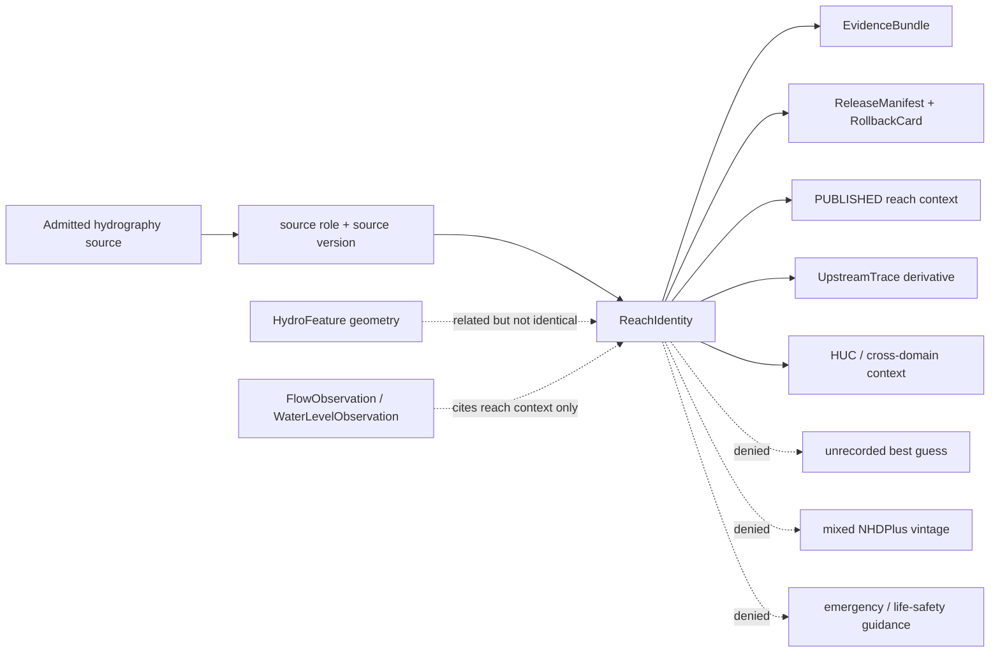
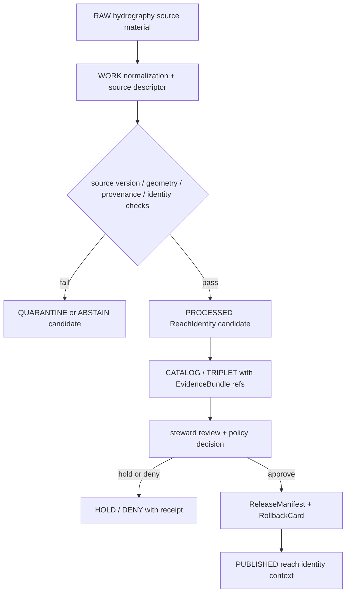

<!-- [KFM_META_BLOCK_V2]
doc_id: kfm://doc/contracts-domains-hydrology-reach-identity
title: Reach Identity Contract — Hydrology
type: semantic-contract
version: v0.2
status: draft; PROPOSED; schema-scaffold; NEEDS VERIFICATION before promotion
owners:
  - OWNER_TBD — Hydrology domain steward
  - OWNER_TBD — Surface-water network steward
  - OWNER_TBD — Crosswalk/identity steward
  - OWNER_TBD — Contracts steward
  - OWNER_TBD — Source steward
  - OWNER_TBD — Evidence steward
  - OWNER_TBD — Schema steward
  - OWNER_TBD — Policy steward
  - OWNER_TBD — Release steward
  - OWNER_TBD — Docs steward
created: NEEDS VERIFICATION — scaffold existed before v0.2 expansion
updated: 2026-06-22
policy_label: public-with-gates; semantic-contract; hydrology; ReachIdentity; surface-water-network; NHDPlus; 3DHP; version-aware; ABSTAIN-on-ambiguity; evidence-bound; release-gated; rollback-aware; not-gauge-observation; not-generic-hydro-feature; not-emergency-guidance
tags: [kfm, contracts, hydrology, ReachIdentity, HydroFeature, HUCUnit, NHDPlus, 3DHP, COMID, reachcode, permanent_identifier, vpuid, HUC12, upstream-trace, source-role, EvidenceBundle, PolicyDecision, ReleaseManifest, RollbackCard, spec_hash]
related:
  - ./README.md
  - ./domain_feature_identity.md
  - ./hydro_feature.md
  - ./huc_unit.md
  - ./watershed.md
  - ./upstream_trace.md
  - ./hydrograph.md
  - ./decision_envelope.md
  - ./domain_validation_report.md
  - ../../../docs/domains/hydrology/IDENTITY_MODEL.md
  - ../../../docs/domains/hydrology/OBJECT_FAMILIES.md
  - ../../../docs/domains/hydrology/GLOSSARY.md
  - ../../../docs/domains/hydrology/SOURCE_ROLE_MATRIX.md
  - ../../../docs/domains/hydrology/BOUNDARY.md
  - ../../../docs/domains/hydrology/CANONICAL_PATHS.md
  - ../../../docs/domains/hydrology/FILE_SYSTEM_PLAN.md
  - ../../../schemas/contracts/v1/domains/hydrology/reach_identity.schema.json
  - ../../../policy/domains/hydrology/
  - ../../../fixtures/domains/hydrology/reach_identity/
  - ../../../tests/domains/hydrology/test_reach_identity.*
  - ../../../data/registry/sources/hydrology/
  - ../../../release/candidates/hydrology/
notes:
  - "Expanded from a thin scaffold at contracts/domains/hydrology/reach_identity.md."
  - "The paired schema exists at schemas/contracts/v1/domains/hydrology/reach_identity.schema.json, but current evidence shows it is still a PROPOSED scaffold with empty properties and additionalProperties: true."
  - "Hydrology docs define ReachIdentity as the stable identity of a flowline reach with NHDPlus permanent identifier, reachcode, version, and nhdplus_version discipline."
  - "Ambiguous reach identity must ABSTAIN; it must never be guessed or silently resolved by an unrecorded heuristic."
[/KFM_META_BLOCK_V2] -->

<a id="top"></a>

# Reach Identity Contract — Hydrology

> Semantic contract for `ReachIdentity`: the stable, evidence-bounded identity of a flowline reach across source vintages. It preserves NHDPlus / 3DHP version discipline, records deterministic identity inputs, and fails closed when reach matching is ambiguous.

<p>
  
  
  
  
  
  
  
</p>

`contracts/domains/hydrology/reach_identity.md`

## Quick jumps

[Status](#status) · [Meaning](#meaning) · [Repo fit](#repo-fit) · [Schema posture](#schema-posture) · [Reach identity boundaries](#reach-identity-boundaries) · [Identity contract](#identity-contract) · [Assertions](#assertions) · [Exclusions](#exclusions) · [Recommended fields](#recommended-fields) · [Source-role rules](#source-role-rules) · [Temporal and version rules](#temporal-and-version-rules) · [ABSTAIN triggers](#abstain-triggers) · [Evidence and citation posture](#evidence-and-citation-posture) · [Sensitivity and publication](#sensitivity-and-publication) · [Lifecycle](#lifecycle) · [Validation](#validation) · [Rollback](#rollback) · [Evidence basis](#evidence-basis) · [Open questions](#open-questions)

---

## Status

> [!IMPORTANT]
> **Status:** `draft` / semantic contract  
> **Contract path:** `contracts/domains/hydrology/reach_identity.md`  
> **Schema path:** `schemas/contracts/v1/domains/hydrology/reach_identity.schema.json`  
> **Schema posture:** paired schema exists, but remains a `PROPOSED` scaffold with empty `properties` and `additionalProperties: true`.  
> **Truth posture:** Hydrology docs define `ReachIdentity` as stable flowline-reach identity, typically anchored by NHDPlus permanent identifier + reachcode + version. Field-level schema shape, validators, fixtures, source descriptors, policy enforcement, emitted EvidenceBundles, release manifests, public DTOs, and runtime behavior remain **NEEDS VERIFICATION**.

> [!CAUTION]
> Ambiguous reach identity is an `ABSTAIN`, not a guess. KFM must not silently substitute a nearby reach, mix NHDPlus vintages, treat a heuristic crosswalk as authoritative without provenance, or publish a reach identity when the source/version/digest cannot be inspected.

---

## Meaning

`ReachIdentity` represents the stable identity of a flowline reach within Hydrology. It is the identity-bearing object that lets KFM say which reach is being referenced across source vintages, network derivatives, upstream traces, HUC joins, and cross-domain context.

It may describe:

- a flowline reach identity from NHDPlus v2.1, NHDPlus HR, 3DHP, or another admitted hydrography source family;
- source-native identity values such as permanent identifier, reachcode, COMID where applicable, `vpuid`, or successor source keys;
- the source version or hydrography vintage used to interpret the identity;
- the provenance of a reach-to-HUC, reach-to-feature, or reach-to-trace decision;
- the EvidenceBundle, policy decision, release state, and rollback path for public use.

It must remain distinct from:

- `HydroFeature`, which is generic surface-water feature geometry or feature class;
- `HUCUnit`, which is watershed accounting geometry;
- `GaugeSite`, `FlowObservation`, and `WaterLevelObservation`, which are monitoring-site or observed-reading objects;
- `UpstreamTrace`, which is a derived traversal over admitted reach identities;
- `Hydrograph`, which is a modeled/derived time series over observations or model inputs;
- `NFHLZone` and `ObservedFloodEvent`, which belong to flood-context truth classes.

---

## Repo fit

| Responsibility | Path or root | This contract's role |
|---|---|---|
| Human-readable object meaning | `contracts/domains/hydrology/reach_identity.md` | This file; semantic contract for `ReachIdentity`. |
| Machine schema | `schemas/contracts/v1/domains/hydrology/reach_identity.schema.json` | Confirmed file, but only a permissive scaffold in current evidence. |
| Generic hydro feature contract | `contracts/domains/hydrology/hydro_feature.md` | Companion boundary: feature geometry is not stable reach identity. |
| HUC accounting context | `contracts/domains/hydrology/huc_unit.md` | Companion for HUC joins and COMID/HUC12 crosswalks. |
| Derived network trace | `contracts/domains/hydrology/upstream_trace.md` | Consumes admitted reach identity; does not replace it. |
| Identity doctrine | `docs/domains/hydrology/IDENTITY_MODEL.md` | Defines deterministic identity rule, reach identity example, ABSTAIN posture, and provenance fields. |
| Object catalog | `docs/domains/hydrology/OBJECT_FAMILIES.md` | Defines `ReachIdentity` purpose, identity anchor, attributes, and ambiguity rule. |
| Glossary | `docs/domains/hydrology/GLOSSARY.md` | Defines `ReachIdentity` as stable flowline reach identity with NHDPlus identifier/reachcode/version discipline. |
| Source-role matrix | `docs/domains/hydrology/SOURCE_ROLE_MATRIX.md` | Allows `ReachIdentity` from observed/network and modeled NHD-derived basis; forbids role collapse. |
| Policy | `policy/domains/hydrology/` | Expected ABSTAIN, role, rights, source-vintage, and publication gates. |
| Fixtures/tests | `fixtures/domains/hydrology/reach_identity/`, `tests/domains/hydrology/` | Expected valid/invalid cases for identity, version drift, provenance, and ambiguity. |
| Source registry | `data/registry/sources/hydrology/` | Expected SourceDescriptor instances for NHDPlus / 3DHP-oriented hydrography sources. |
| Release | `release/candidates/hydrology/` and release roots | Expected PromotionDecision, ReleaseManifest, CorrectionNotice, and RollbackCard paths. |

---

## Schema posture

| Schema fact | Current posture |
|---|---|
| Expected schema path | `schemas/contracts/v1/domains/hydrology/reach_identity.schema.json` |
| Exact schema found? | **Yes** — direct fetch found a JSON Schema file. |
| Schema maturity | **PROPOSED scaffold** only. The schema description says fields are to be defined by the owning domain steward. |
| Field-level properties | Empty object (`properties: {}`) in current evidence. |
| Additional properties | Currently `true`; not yet restrictive. |
| Semantic contract promotion status | HOLD until schema fields, fixtures, validators, source descriptors, policy gates, release checks, and rollback records exist. |

This file defines intended meaning and review criteria. It does not prove that a validator, API, tile service, or Focus Mode surface enforces the rules.

---

## Reach identity boundaries



A valid `ReachIdentity` claim says: **this released KFM object refers to this source-versioned reach identity, with source role, temporal scope, normalized digest, evidence, policy posture, and rollback path inspectable.**

A valid `ReachIdentity` claim must never say: **this unverified nearby feature is probably the same reach, this NHDPlus version can be silently substituted, this model-derived attribute is observed, or this reach context is emergency guidance.**

---

## Identity contract

KFM Hydrology identity doctrine uses the same deterministic shape across object families:

```text
identity(object) = f(source_id, object_role, temporal_scope, normalized_digest)
```

For `ReachIdentity`, the identity-bearing inputs should include at least:

| Component | Reach-specific meaning |
|---|---|
| `source_id` | Registered NHDPlus / 3DHP-oriented SourceDescriptor, including rights, source role, version, and source limitations. |
| `object_role` | `ReachIdentity`; prevents collision with `HydroFeature`, `HUCUnit`, `UpstreamTrace`, or observation families. |
| `temporal_scope` | Source vintage band, valid interval, or version-specific reach identity interval. |
| `normalized_digest` | Deterministic digest over normalized identity-bearing values, geometry fingerprint where material, provenance, source version, and ambiguity decision state. |

`ReachIdentity` is especially sensitive to version drift because NHDPlus v2.1, NHDPlus HR, and 3DHP successor identifiers must not be treated as interchangeable unless an explicit, evidence-backed crosswalk says so.

---

## Assertions

A reviewed `ReachIdentity` should assert:

1. **Stable reach ID** — canonical object ID and `spec_hash` over the source, source version, reach identifier fields, temporal scope, and normalized provenance.
2. **Source descriptor** — source family, source role, rights, retrieval state, source limitations, and source version recorded.
3. **Source-native identifiers** — permanent identifier, reachcode, COMID where applicable, `vpuid`, or successor 3DHP reference captured without silent substitution.
4. **Version discipline** — `nhdplus_version` or equivalent source-vintage field required; mixed-vintage batches fail closed.
5. **Geometry/provenance companion** — geometry digest, catchment/flowline fingerprint, or source feature reference recorded where identity depends on geometry.
6. **Ambiguity state** — no ambiguous identity reaches `PUBLISHED`; ambiguous cases carry ranked candidates, reason codes, and `ABSTAIN`/`HOLD` outcome.
7. **Evidence closure** — EvidenceRefs resolve to EvidenceBundles before public claims, exports, AI answers, or map feature drawers treat the identity as authoritative.
8. **Policy support** — rights, source role, source limitations, sensitivity joins, and publication posture recorded.
9. **Release separation** — ReleaseManifest and rollback target required for public surfaces.
10. **Correction lineage** — superseded source versions, crosswalk revisions, changed geometry, and corrected identifiers remain auditable.

---

## Exclusions

| Misuse | Required outcome |
|---|---|
| Treating `HydroFeature` geometry as stable reach identity without source-versioned identifiers | `ABSTAIN` or `DENY`, depending on surface. |
| Mixing NHDPlus v2.1, HR, and 3DHP identifiers without explicit crosswalk provenance | `ABSTAIN`; do not publish. |
| Guessing nearest reach when identity is ambiguous | `ABSTAIN`; record candidate set if available. |
| Treating VAAs or derived flow/catchment attributes as observed readings | `DENY` role collapse; label modeled/derived basis. |
| Using reach identity as a gauge observation | `DENY`; use `GaugeSite`, `FlowObservation`, or `WaterLevelObservation`. |
| Using reach identity as a flood regulation or observed flood event | `DENY`; use `NFHLZone` or `ObservedFloodEvent` with proper evidence. |
| Publishing candidate reach matches from RAW/WORK/QUARANTINE | `DENY`; public clients use released artifacts only. |
| Using AI summary as evidence for reach matching | `DENY`; AI may explain evidence but cannot replace it. |
| Cross-domain use that overrides the owning lane's canonical claim | `DENY`; Hydrology lends reach context only. |

---

## Recommended fields

The following fields are **PROPOSED** targets for future schema expansion. The current schema scaffold does not enforce them yet.

| Field | Meaning |
|---|---|
| `id` | Canonical KFM `ReachIdentity` ID. |
| `version` | Contract/object version. |
| `spec_hash` | Deterministic digest over normalized identity-bearing fields. |
| `domain` | Must resolve to `hydrology`. |
| `object_type` | `ReachIdentity`. |
| `source_ref` | SourceDescriptor or EvidenceRef for admitted hydrography source. |
| `source_role` | Role basis for the reach identity; must preserve admitted source role. |
| `source_family` | NHDPlus v2.1, NHDPlus HR, 3DHP, or steward-approved source family. |
| `nhdplus_version` | Version/vintage discriminator; required when NHDPlus-derived. |
| `permanent_identifier` | Source-native permanent identifier where present. |
| `reachcode` | Source-native reachcode where present. |
| `comid` | COMID where applicable; not universal across all future source families. |
| `vpuid` | Vector processing unit or source partition where applicable. |
| `universal_reference_id` | PROPOSED 3DHP/successor field; exact name NEEDS VERIFICATION. |
| `geometry_ref` | Source geometry pointer or KFM geometry artifact reference. |
| `geometry_digest` | Digest over normalized reach geometry/catchment fingerprint where material. |
| `temporal_scope` | Source vintage band or valid interval for this identity. |
| `source_time` | Source publication/version time. |
| `retrieval_time` | KFM retrieval/freeze time. |
| `release_time` | Governed KFM release time. |
| `correction_time` | Supersession/correction time, if applicable. |
| `crosswalk_ref` | Crosswalk or mapping record used when identity is transferred across versions or HUCs. |
| `decision_reason` | Official crosswalk, area-weighted overlay, centroid heuristic, snap-to-pour-point, steward-reviewed, or other controlled value. |
| `alignment_score` | Score supporting a heuristic or overlay match, where applicable. |
| `candidate_reaches` | Ranked candidates retained for review when ambiguity prevents release. |
| `ambiguity_status` | `resolved`, `ambiguous`, `unsupported`, `out_of_scope`, or other controlled value. |
| `evidence_refs` | EvidenceRefs required for public claims. |
| `policy_decision_ref` | PolicyDecision allowing, restricting, denying, or holding the claim. |
| `release_manifest_ref` | ReleaseManifest proving public exposure is gated. |
| `rollback_ref` | RollbackCard or rollback target. |
| `limitations` | Caveats: version-bound, not observation, not emergency guidance, crosswalk confidence limits. |

---

## Source-role rules

| Source or claim basis | Allowed posture for `ReachIdentity` | Discipline |
|---|---|---|
| NHDPlus HR / NHDPlus v2.1 / 3DHP network identity | Allowed as network identity/context basis. | Preserve permanent IDs, reachcode, version/vintage, and source descriptor. |
| NHD-derived flow/catchment/VAAs | Allowed only when labeled modeled/derived where applicable. | Never relabel VAAs or derived attributes as observed gauge readings. |
| USGS Water Data / NWIS gauge observations | May cite reach context but does not define `ReachIdentity` by itself. | Observations are separate objects. |
| WBD / HUC12 | May bound reach/HUC crosswalk context. | HUC identity does not replace reach identity. |
| FEMA NFHL / MSC | Not a reach identity source. | Regulatory flood context only. |
| AI summaries or synthetic reconstructions | Not source truth. | Interpretive carrier only; cannot prove reach identity. |
| Candidate matches | Allowed only before promotion. | Public surfaces must ABSTAIN/HOLD until reviewed and released. |

> [!NOTE]
> Hydrology docs sometimes use shorthand such as `authority-network` or `context` for network identity, while the source-role matrix also uses the canonical role vocabulary (`observed`, `modeled`, etc.). The controlling implementation must preserve whatever role vocabulary is adopted by SourceDescriptor and policy. Until the enum is schema-confirmed, exact role-field realization remains **NEEDS VERIFICATION**.

---

## Temporal and version rules

`ReachIdentity` is a version-bound identity object. These time/version meanings must stay distinct:

| Dimension | Required treatment |
|---|---|
| `source_time` | Source publication or version time for NHDPlus / 3DHP material. |
| `temporal_scope` | Vintage band or valid interval for this reach identity. |
| `retrieval_time` | When KFM retrieved/froze the source material. Does not by itself change identity. |
| `release_time` | When KFM published a released derivative. Kept out of identity digest unless release content changes. |
| `correction_time` | When KFM corrected, superseded, or rolled back the identity. |
| `observed_time` | Not a reach-identity time unless the object is being joined to an observation; observations remain separate families. |
| `nhdplus_version` / source version | Required discriminator. v2.1, HR, and 3DHP cannot be silently mixed. |
| `wbd_snapshot` | Required when reach identity is mapped to HUC/HUC12 context. |

---

## ABSTAIN triggers

`ReachIdentity` must use finite outcomes rather than hidden fallbacks.

| Trigger | Required outcome |
|---|---|
| No source version or `nhdplus_version` where required | `ABSTAIN` / validation `FAIL`. |
| Multiple candidate reaches with no deterministic, evidence-backed tie-break | `ABSTAIN`; retain candidates for review. |
| Crosswalk uses heuristic but lacks `decision_reason`, `algorithm_version`, or `alignment_score` | `ABSTAIN`. |
| Low or missing alignment score where overlay/heuristic is used | `ABSTAIN` unless steward-reviewed policy says otherwise. |
| Mixed NHDPlus v2.1 / HR / 3DHP batch without explicit mapping record | `ABSTAIN`. |
| Out-of-scope geography for the source/crosswalk | `ABSTAIN` or `DENY`, depending on policy. |
| Missing EvidenceBundle or unresolved EvidenceRef | `ABSTAIN` for answer surfaces; `HOLD` or `DENY` for publication. |
| Rights/source limitations unresolved | `DENY` or `HOLD` until source descriptor and policy allow use. |

---

## Evidence and citation posture

A public `ReachIdentity` surface must expose or resolve:

- SourceDescriptor for the hydrography source;
- source version / `nhdplus_version` / successor source identifier;
- identity-bearing source-native IDs;
- crosswalk provenance where a reach is mapped to HUC or successor ID;
- EvidenceBundle or EvidenceRef closure;
- PolicyDecision with finite outcome;
- ReleaseManifest for public exposure;
- rollback target and correction lineage.

Public answers or map drawers should use language like:

> This reach identity is version-bound to the cited hydrography source and release. It is not a gauge reading, not a flood forecast, and not emergency guidance. Ambiguous reach matches abstain rather than guessing.

---

## Sensitivity and publication

`ReachIdentity` is generally public-safe as network identity, but publication still requires gates because cross-domain joins can create exposure or false precision.

| Exposure pattern | Default posture |
|---|---|
| Released reach identity with source/version/evidence/release state | Public with source-version caveat. |
| Reach identity used as context for habitat/flora/fauna occurrences | Public only after sensitive occurrence joins are redacted/generalized by the owning lane. |
| Reach identity joined to infrastructure/asset exposure | Review-required; exact-asset exposure may be staged-access. |
| Reach identity joined to irrigation/water-use context | Context only; no yield/use/admin conclusion without owning-lane evidence. |
| Reach identity used for emergency guidance | DENY. KFM is not an alert authority. |
| Reach identity candidate or ambiguous match | Do not publish; ABSTAIN/HOLD. |

---

## Lifecycle



Promotion is a governed state transition. A source file, schema scaffold, crosswalk table, tile, or AI answer does not become canonical reach truth by existing.

---

## Validation

Minimum validation expectations before promotion:

| Gate | Required check |
|---|---|
| Schema | `reach_identity.schema.json` defines required fields and validates valid/invalid fixtures. |
| Identity | `id` and `spec_hash` are deterministic over source, source version, object role, temporal scope, identifiers, and normalized digest. |
| Source role | Source role preserved from SourceDescriptor; derived/model fields labeled where applicable. |
| Version discipline | `nhdplus_version` or successor source version required; mixed vintage cases fail closed. |
| Geometry/provenance | Geometry digest, crosswalk provenance, decision reason, and algorithm version recorded when material. |
| Ambiguity | Ambiguous matches produce `ABSTAIN`/`HOLD`, not silent match. |
| Evidence closure | EvidenceRefs resolve to EvidenceBundles. |
| Rights/source terms | SourceDescriptor confirms allowed use and redistribution posture. |
| Policy | PolicyDecision records allowed/restricted/denied exposure and cross-domain caveats. |
| Release | ReleaseManifest, PromotionDecision, correction path, and RollbackCard exist before public exposure. |
| UI/API | Public DTOs include source/version, evidence, caveat, release state, and ABSTAIN behavior for ambiguous cases. |

Negative fixtures should include at least:

- missing `nhdplus_version`;
- mixed v2.1/HR/3DHP identifiers with no crosswalk;
- two plausible reaches with no deterministic tie-break;
- heuristic crosswalk with missing `decision_reason`;
- low `alignment_score` with no steward override;
- VAA/model-derived attribute labeled as observed;
- unresolved EvidenceRef;
- candidate reach match exposed on a public route;
- AI-generated explanation used as identity evidence;
- out-of-scope geography without source coverage.

---

## Rollback

A released `ReachIdentity` must be rollback-ready.

Rollback is required when:

- source hydrography version is superseded or withdrawn;
- source-native ID, reachcode, geometry, or `vpuid` changes;
- crosswalk algorithm or threshold is corrected;
- a mixed-vintage batch was published;
- a heuristic match was published as authoritative without provenance;
- EvidenceBundle closure was missing;
- rights/source terms change;
- sensitive cross-domain joins exposed more than the owning lane allows;
- public UI omitted the source-version / ambiguity caveat.

Rollback must record:

| Rollback item | Required content |
|---|---|
| `rollback_ref` | Stable rollback target or RollbackCard ID. |
| `affected_release_manifest_ref` | ReleaseManifest being withdrawn, corrected, or superseded. |
| `reason_code` | Source supersession, version drift, geometry mismatch, low alignment, ambiguous identity, evidence missing, rights change, sensitive join, or implementation error. |
| `replacement_ref` | Replacement release, correction notice, or abstention record. |
| `public_notice_required` | Whether public correction notice is required. |

---

## Evidence basis

| Evidence | Supports | Limit |
|---|---|---|
| `contracts/domains/hydrology/reach_identity.md` scaffold | Target path already existed as a scaffold and needed authoritative content. | Scaffold had no semantic detail. |
| `schemas/contracts/v1/domains/hydrology/reach_identity.schema.json` | Paired schema exists. | Current schema is a PROPOSED scaffold with empty properties and permissive additionalProperties. |
| `docs/domains/hydrology/GLOSSARY.md` | Defines `ReachIdentity` as stable flowline reach identity with NHDPlus permanent identifier, reachcode, version, and ABSTAIN-on-ambiguity discipline. | Field names and validators remain proposed. |
| `docs/domains/hydrology/OBJECT_FAMILIES.md` | Defines purpose, identity anchor, attributes, role/sensitivity, and ambiguity rule. | Does not prove runtime enforcement. |
| `docs/domains/hydrology/IDENTITY_MODEL.md` | Defines deterministic identity rule, temporal separation, reach identity crosswalk example, provenance fields, and ABSTAIN triggers. | Some field shapes and exact prefixes remain PROPOSED/NEEDS VERIFICATION. |
| `docs/domains/hydrology/SOURCE_ROLE_MATRIX.md` | Shows ReachIdentity may be based on observed/network and modeled NHD-derived roles and that source roles are fixed at admission. | Role enum implementation still needs schema/policy confirmation. |
| `docs/domains/hydrology/BOUNDARY.md` | Confirms Hydrology owns HydroFeature/ReachIdentity and uses reach identity as context for downstream lanes without overriding their truth. | Does not implement UI/API gates. |

---

## Open questions

| ID | Question | Evidence needed | Status |
|---|---|---|---|
| OQ-HYD-REACH-01 | Which exact identifier fields are mandatory across NHDPlus v2.1, HR, and 3DHP? | Completed schema + source descriptors + fixtures. | OPEN / NEEDS VERIFICATION |
| OQ-HYD-REACH-02 | What is the canonical 3DHP successor identity field name and mapping from COMID/reachcode? | 3DHP source profile + steward ADR or schema decision. | OPEN / NEEDS VERIFICATION |
| OQ-HYD-REACH-03 | What threshold or policy determines low-alignment ABSTAIN for overlay/heuristic crosswalks? | Validator policy + negative fixtures. | OPEN / NEEDS VERIFICATION |
| OQ-HYD-REACH-04 | Where should crosswalk schemas live if a COMID↔HUC12 or reach-vintage mapping is cross-cutting? | Directory Rules / ADR decision: domain schema vs crosswalk schema root. | OPEN / NEEDS VERIFICATION |
| OQ-HYD-REACH-05 | Which public DTO fields must appear in feature drawers and Focus Mode answers? | API/UI contract and policy tests. | OPEN / NEEDS VERIFICATION |
| OQ-HYD-REACH-06 | Which sensitive downstream joins require staged access or generalization when using reach identity context? | Policy/domains + map release review. | OPEN / NEEDS VERIFICATION |

---

## Definition of done

This contract can move beyond draft only when:

- the schema defines required fields and no longer permits unconstrained objects;
- valid and invalid fixtures exist;
- source descriptors exist for active NHDPlus / 3DHP-oriented sources;
- validators prove deterministic IDs, source-version discipline, ABSTAIN triggers, and no-network fixture behavior;
- policy gates deny unreviewed candidates, mixed-vintage matches, role collapse, and unsupported public claims;
- public UI/API surfaces show source version, evidence, caveat, release state, and ABSTAIN behavior;
- release and rollback artifacts exist for the first public-safe derivative;
- docs, schema, policy, fixtures, and tests agree on the reach identity boundary.

[Back to top](#top)
