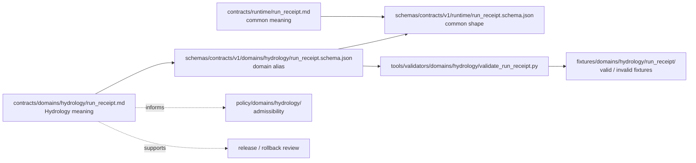
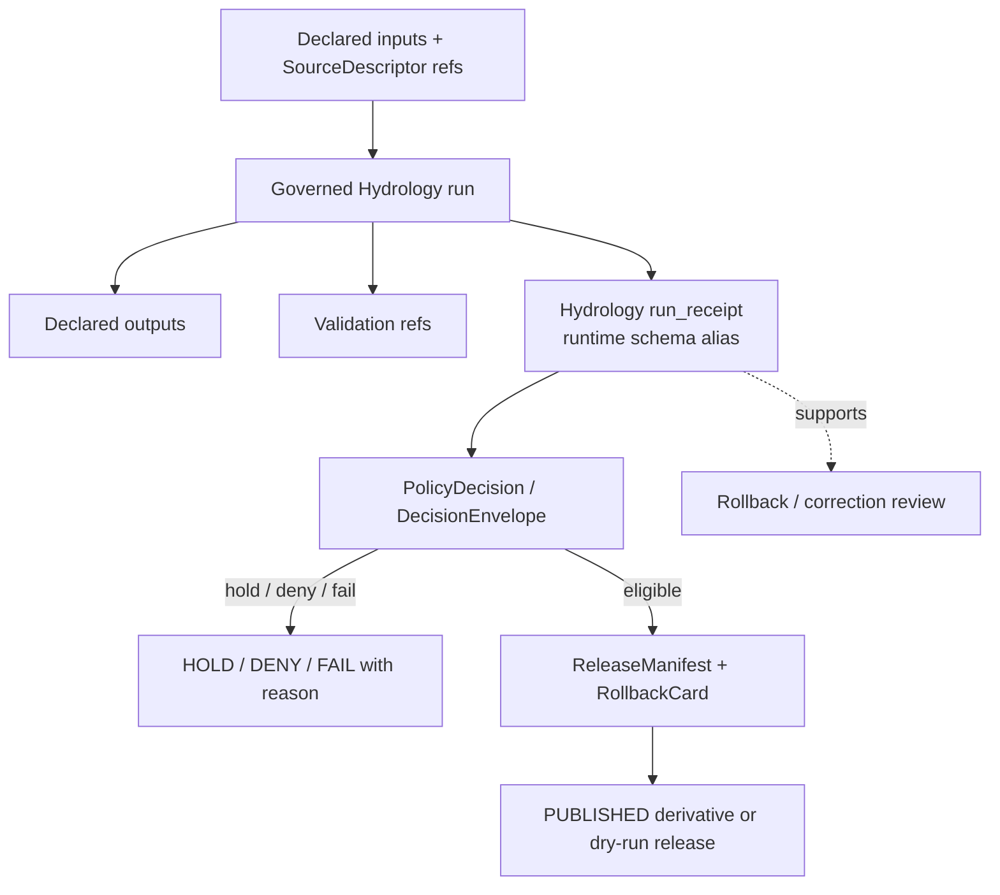

<!-- [KFM_META_BLOCK_V2]
doc_id: kfm://doc/contracts-domains-hydrology-run-receipt
title: Run Receipt Contract — Hydrology
type: semantic-contract
version: v0.2
status: draft; PROPOSED; schema-alias; runtime-ref; CONFLICTED standard shape; NEEDS VERIFICATION before promotion
owners:
  - OWNER_TBD — Hydrology domain steward
  - OWNER_TBD — Runtime/proofs steward
  - OWNER_TBD — Contracts steward
  - OWNER_TBD — Schema steward
  - OWNER_TBD — Evidence steward
  - OWNER_TBD — Policy steward
  - OWNER_TBD — Release steward
  - OWNER_TBD — Docs steward
created: NEEDS VERIFICATION — thin alias existed before v0.2 expansion
updated: 2026-06-22
policy_label: public-with-gates; semantic-contract; hydrology; run-receipt; runtime-alias; proof-bearing; evidence-bound; source-role-aware; validation-bound; release-gated; rollback-aware; no-publication-without-receipt
tags: [kfm, contracts, hydrology, RunReceipt, run_receipt, runtime, receipt, proof, EvidenceBundle, SourceDescriptor, ValidationReport, PolicyDecision, ReleaseManifest, RollbackCard, spec_hash, provenance, governed-run, no-network-fixture]
related:
  - ./README.md
  - ./decision_envelope.md
  - ./domain_validation_report.md
  - ./evidence_bundle.md
  - ./hydrograph.md
  - ./reach_identity.md
  - ../../runtime/run_receipt.md
  - ../../../schemas/contracts/v1/domains/hydrology/run_receipt.schema.json
  - ../../../schemas/contracts/v1/runtime/run_receipt.schema.json
  - ../../../docs/standards/RUN_RECEIPT.md
  - ../../../docs/architecture/contract-schema-policy-split.md
  - ../../../docs/domains/hydrology/THIN_SLICE.md
  - ../../../docs/domains/hydrology/README.md
  - ../../../docs/domains/hydrology/SOURCE_ROLE_MATRIX.md
  - ../../../docs/runbooks/hydrology/PROMOTION_RUNBOOK.md
  - ../../../docs/runbooks/hydrology/ROLLBACK_RUNBOOK.md
  - ../../../fixtures/domains/hydrology/run_receipt/
  - ../../../tools/validators/domains/hydrology/validate_run_receipt.py
  - ../../../policy/domains/hydrology/
  - ../../../release/candidates/hydrology/
notes:
  - "Expanded from a thin domain-lane alias contract at contracts/domains/hydrology/run_receipt.md."
  - "The Hydrology schema is present and aliases the common runtime run_receipt schema through allOf/$ref, with unevaluatedProperties=false."
  - "The common runtime schema is present and defines a smaller concrete field set than the broader docs/standards/RUN_RECEIPT.md standard. Treat the broader standard shape as CONFLICTED / NEEDS VERIFICATION until ADR/schema alignment is resolved."
  - "This contract adds Hydrology semantics without adding Hydrology-only fields outside the current alias schema."
[/KFM_META_BLOCK_V2] -->

# Run Receipt Contract — Hydrology

> Semantic contract for the Hydrology-domain `run_receipt`: a domain-lane alias of the shared runtime `RunReceipt` shape, used to prove that a Hydrology ingest, validation, transform, dry-run release, rollback, or governed runtime step happened under inspectable inputs, outputs, source descriptors, validation references, code reference, deterministic hash, and finite outcome.

  
  
  
  
  
  
  

`contracts/domains/hydrology/run_receipt.md`

## Quick jumps

[Status](#status) · [Meaning](#meaning) · [Repo fit](#repo-fit) · [Schema posture](#schema-posture) · [Alias boundary](#alias-boundary) · [Hydrology receipt roles](#hydrology-receipt-roles) · [Required fields](#required-fields) · [Assertions](#assertions) · [Exclusions](#exclusions) · [Lifecycle](#lifecycle) · [Validation](#validation) · [Rollback](#rollback) · [Evidence basis](#evidence-basis) · [Open questions](#open-questions)

---

## Status

> [!IMPORTANT]
> **Status:** `draft` / semantic contract / Hydrology domain alias  
> **Contract path:** `contracts/domains/hydrology/run_receipt.md`  
> **Hydrology schema path:** `schemas/contracts/v1/domains/hydrology/run_receipt.schema.json`  
> **Common runtime schema path:** `schemas/contracts/v1/runtime/run_receipt.schema.json`  
> **Schema posture:** the Hydrology schema is present and aliases the common runtime schema with `allOf/$ref`; it also sets `unevaluatedProperties: false`. The common runtime schema is present and defines a concrete required field set.  
> **Standard posture:** `docs/standards/RUN_RECEIPT.md` describes a richer proposed receipt standard and acknowledges schema-layout/field-name drift. Treat the Hydrology alias as current repo evidence, and treat broader standard alignment as **CONFLICTED / NEEDS VERIFICATION**.

> [!CAUTION]
> A Hydrology `run_receipt` does not make an output true, safe, publishable, rights-cleared, or public. It proves a governed run record exists. Evidence closure, policy decisions, validation results, release manifests, rollback targets, and source-role discipline still decide whether a claim can move forward.

---

## Meaning

A Hydrology `run_receipt` is the lane-specific semantic face of the shared runtime `RunReceipt`. It records that a Hydrology operation ran with declared inputs, outputs, code reference, source descriptor references, validation references, deterministic hash, and finite outcome.

It is used for Hydrology operations such as:

- source intake or no-network fixture processing;
- HUC / watershed fixture generation;
- reach identity and crosswalk validation;
- gauge observation transform or validation;
- NFHL regulatory-context processing;
- hydrograph generation where the run must remain inspectable;
- EvidenceBundle, LayerManifest, MapReleaseManifest, or Focus Mode thin-slice proof steps;
- promotion dry runs, rollback drills, and correction workflows.

The receipt is not the claim itself. It is a proof-bearing companion object that makes the run inspectable and replay-reviewable.

---

## Repo fit

| Responsibility | Path or root | This contract's role |
|---|---|---|
| Hydrology semantic alias | `contracts/domains/hydrology/run_receipt.md` | This file; explains Hydrology meaning while preserving the shared runtime shape. |
| Common runtime meaning | `contracts/runtime/run_receipt.md` | Shared runtime contract that Hydrology aliases rather than forks. |
| Hydrology schema alias | `schemas/contracts/v1/domains/hydrology/run_receipt.schema.json` | Domain schema wrapper that `$ref`s the common runtime schema. |
| Common runtime schema | `schemas/contracts/v1/runtime/run_receipt.schema.json` | Current concrete machine shape for the referenced receipt. |
| Validator | `tools/validators/domains/hydrology/validate_run_receipt.py` | Runs the Hydrology alias schema over Hydrology fixtures. |
| Hydrology contract root | `contracts/domains/hydrology/README.md` | Defines this folder as human-readable meaning, not schema/policy/data/release authority. |
| Architecture split | `docs/architecture/contract-schema-policy-split.md` | Explains meaning / shape / admissibility / proof separation. |
| Thin-slice proof lane | `docs/domains/hydrology/THIN_SLICE.md` | Places `RunReceipt` in the Hydrology no-network proof chain. |
| Policy | `policy/domains/hydrology/`, `policy/runtime/` | Expected admissibility gates; enforcement remains NEEDS VERIFICATION unless tested. |
| Fixtures/tests | `fixtures/domains/hydrology/run_receipt/`, tests under Hydrology/runtime | Expected proof of valid and invalid receipts. |
| Release/rollback | `release/candidates/hydrology/` and release roots | Receipts support release review, rollback, and correction paths. |

---

## Schema posture

| Schema fact | Current repo evidence |
|---|---|
| Hydrology schema exists | Yes: `schemas/contracts/v1/domains/hydrology/run_receipt.schema.json`. |
| Alias mechanism | `allOf` with `$ref` to `https://schemas.kfm.local/contracts/v1/runtime/run_receipt.schema.json`. |
| Extra Hydrology fields | None in this step; `unevaluatedProperties: false` blocks undeclared additions after evaluation. |
| Common runtime schema exists | Yes: `schemas/contracts/v1/runtime/run_receipt.schema.json`. |
| Common required fields | `run_id`, `stage`, `inputs`, `outputs`, `code_ref`, `spec_hash`, `source_descriptor_refs`, `validation_refs`, `outcome`. |
| Common outcome enum | `SUCCESS`, `PARTIAL`, `FAIL`. |
| Runtime `spec_hash` pattern | `^sha256:[a-f0-9]{64}$`. |
| Broader standard conflict | `docs/standards/RUN_RECEIPT.md` discusses richer `RunReceipt` fields and `jcs:sha256:<hex>` language; alignment remains **CONFLICTED / NEEDS VERIFICATION**. |

This contract must not add Hydrology-only fields unless the schema is intentionally changed. Until then, Hydrology-specific interpretation belongs in companion references, validation refs, EvidenceBundles, PolicyDecisions, ReleaseManifests, or later schema revisions.

---

## Alias boundary

The Hydrology `run_receipt` is an alias, not a fork.

The boundary is intentional:

- `contracts/domains/hydrology/run_receipt.md` explains Hydrology-specific meaning.
- `schemas/contracts/v1/domains/hydrology/run_receipt.schema.json` binds Hydrology to the common runtime shape.
- `contracts/runtime/run_receipt.md` remains the shared semantic home for the runtime receipt family.
- Hydrology may constrain use through validation, source descriptors, policy, and release gates without inventing a parallel receipt object.

---

## Hydrology receipt roles

| Hydrology run | What the receipt should prove | What it does not prove by itself |
|---|---|---|
| Source intake / fixture admission | The run used declared inputs and source descriptor refs. | Source rights, authority, or public release unless policy confirms. |
| HUC / watershed processing | Inputs, outputs, code ref, validation refs, and outcome were recorded. | That the geometry is current or publishable without EvidenceBundle and release state. |
| Reach identity / crosswalk validation | The run recorded the code and validation refs for identity resolution. | That ambiguous reaches may be guessed; ambiguity still ABSTAINS. |
| Gauge observation transform | The run produced declared outputs from declared inputs. | That observations are final, non-provisional, or emergency guidance. |
| NFHL regulatory-context processing | The run recorded NFHL processing steps. | That NFHL is observed inundation, forecast flooding, or KFM alert authority. |
| Hydrograph generation | The run records model/transform execution and validation refs. | That modeled output is observed truth or suitable for public safety use. |
| Thin-slice proof lane | The run participates in the no-network proof chain. | That a live connector, public API, UI route, or release is implemented unless separately verified. |
| Release dry run / rollback drill | The run is auditable. | That release is allowed without ReleaseManifest, PolicyDecision, and rollback target. |

---

## Required fields

The current common runtime schema requires these fields. Hydrology receipts must satisfy them through the alias schema.

| Field | Meaning in Hydrology |
|---|---|
| `run_id` | Stable identifier for the governed Hydrology run. |
| `stage` | Lifecycle or pipeline stage the run belongs to, such as intake, validation, transform, dry-run release, rollback, or correction. Controlled values remain NEEDS VERIFICATION. |
| `inputs` | Declared input artifact refs, fixture refs, source refs, or prior governed outputs. |
| `outputs` | Declared output refs created or checked by the run. |
| `code_ref` | Code, tool, workflow, commit, script, or validator reference used to perform the run. Exact format remains schema/policy work. |
| `spec_hash` | Deterministic digest for the run spec under the current runtime schema pattern `sha256:<64 hex>`. Broader `jcs:sha256:<hex>` standard alignment remains open. |
| `source_descriptor_refs` | SourceDescriptor references that carry source role, rights, cadence, and authority limits. |
| `validation_refs` | ValidationReport, validator output, fixture proof, or related validation artifacts. |
| `outcome` | Finite schema enum: `SUCCESS`, `PARTIAL`, or `FAIL`. Mapping to API outcomes (`ANSWER`, `ABSTAIN`, `DENY`, `ERROR`) and release outcomes (`ALLOW`, `DENY`, `HOLD`, `ERROR`) must be defined by policy/decision envelopes. |

---

## Assertions

A reviewed Hydrology `run_receipt` should assert:

1. **Run identity** — `run_id` uniquely identifies a governed execution and is stable enough to cite in validation/release records.
2. **Stage clarity** — `stage` says where the run belongs in the lifecycle or proof chain.
3. **Input/output closure** — every declared output can be traced back to declared inputs and code reference.
4. **Source role preservation** — referenced SourceDescriptors retain their admitted roles; receipts do not upgrade source authority.
5. **Validation linkage** — `validation_refs` identify the validation evidence used by promotion or denial gates.
6. **Finite outcome** — `SUCCESS`, `PARTIAL`, or `FAIL` is explicit; there is no silent success.
7. **No schema fork** — Hydrology adds no fields outside the alias schema unless the schema is updated and reviewed.
8. **Release separation** — a receipt supports release review but does not replace ReleaseManifest, PromotionDecision, CorrectionNotice, or RollbackCard.
9. **AI subordination** — AI summaries may reference receipts, but they cannot become evidence or policy authority.
10. **Rollback usefulness** — receipts must be sufficient to identify what ran, what changed, and what needs rollback review.

---

## Exclusions

| Misuse | Required posture |
|---|---|
| Treating a `run_receipt` as factual proof that a hydrology claim is true | `DENY` / correct framing. It proves a run record, not truth. |
| Treating a `run_receipt` as release approval | `DENY`; release requires release artifacts and policy decision. |
| Adding Hydrology-only fields while schema aliases common runtime shape | `DENY` until schema is intentionally revised. |
| Publishing outputs because `outcome = SUCCESS` | `DENY`; success is not public release. |
| Upgrading a SourceDescriptor role because the run succeeded | `DENY`; source role is fixed at admission. |
| Using receipt signature/hash as a substitute for EvidenceBundle | `ABSTAIN` or `DENY`; cite-or-abstain still applies. |
| Using receipt to bypass rights, sensitivity, review, or rollback gates | `DENY`. |
| Treating AIReceipt / RunReceipt as sovereign language truth | `DENY`; AI remains evidence-subordinate. |

---

## Lifecycle

A receipt may be emitted in RAW/WORK processing, validation, transform, dry-run release, rollback, or correction contexts. Public clients still consume governed APIs and released artifacts, not internal run logs or pre-publication artifacts.

---

## Validation

Minimum validation expectations before treating this contract as promotion-ready:

| Gate | Required check |
|---|---|
| Schema alias | Hydrology schema resolves the runtime `$ref` and blocks unexpected fields. |
| Common schema | Runtime schema remains available and version-pinned. |
| Fixtures | `fixtures/domains/hydrology/run_receipt/` includes valid and invalid examples. |
| Validator | Hydrology validator runs the alias schema over Hydrology fixtures. |
| Outcome mapping | Policy or decision-envelope docs define how `SUCCESS/PARTIAL/FAIL` map to Hydrology API/release outcomes. |
| Source descriptors | `source_descriptor_refs` resolve to admitted source descriptors with role, rights, and cadence. |
| Validation refs | `validation_refs` resolve to actual validation reports or proof artifacts. |
| Release checks | Release cannot proceed without ReleaseManifest and rollback target. |
| Standard drift | Runtime schema, Hydrology alias, and `docs/standards/RUN_RECEIPT.md` drift is either resolved by ADR or carried explicitly. |

Negative fixtures should include at least:

- missing `run_id`;
- missing `code_ref`;
- malformed `spec_hash` under the current runtime schema pattern;
- undeclared Hydrology-only field rejected by alias schema;
- `outcome` outside `SUCCESS/PARTIAL/FAIL`;
- missing `source_descriptor_refs`;
- missing `validation_refs`;
- receipt with `SUCCESS` but missing release/rollback companion artifacts in promotion tests;
- receipt that attempts to upgrade source role or claim public release by itself.

---

## Rollback

A `run_receipt` supports rollback by naming what ran, what inputs were consumed, what outputs were produced, what code was used, and which validation refs were consulted.

Rollback or correction review is required when:

- the run used the wrong source descriptor or stale source role;
- validation refs were missing, invalid, or later superseded;
- a schema/validator bug allowed malformed receipts;
- a run marked `SUCCESS` but produced outputs that fail policy or release gates;
- a Hydrology-specific field was emitted outside the alias schema;
- outputs were published without ReleaseManifest or rollback target;
- standard drift caused incompatible receipt interpretation.

Rollback review should record:

| Rollback item | Required content |
|---|---|
| `run_id` | Receipt run being reviewed. |
| `affected_outputs` | Output refs from the receipt that may need withdrawal or correction. |
| `validation_refs` | Validation records used or found missing. |
| `reason_code` | Schema drift, validation failure, wrong source descriptor, stale source, missing evidence, missing rollback target, policy mismatch, or implementation error. |
| `replacement_run_id` | Replacement run receipt if the operation is rerun. |
| `release_manifest_ref` | Release record affected, if public exposure occurred. |
| `public_notice_required` | Whether the correction needs public notice. |

---

## Evidence basis

| Evidence | Supports | Limit |
|---|---|---|
| `contracts/domains/hydrology/run_receipt.md` existing file | Target file already existed as a thin Hydrology alias contract. | Existing file had minimal semantics and no KFM Meta Block. |
| `schemas/contracts/v1/domains/hydrology/run_receipt.schema.json` | Hydrology schema aliases the common runtime schema and points to Hydrology fixtures, validator, and policy roots. | Does not add Hydrology-specific fields. |
| `schemas/contracts/v1/runtime/run_receipt.schema.json` | Current concrete runtime field set and required fields. | Field set is smaller/different from broader standard doc. |
| `contracts/runtime/run_receipt.md` | Common runtime meaning and lifecycle scaffold. | Thin scaffold; not a full standard. |
| `tools/validators/domains/hydrology/validate_run_receipt.py` | Hydrology validator path exists and runs the Hydrology schema against Hydrology fixtures. | Does not prove fixtures exist or tests pass. |
| `docs/architecture/contract-schema-policy-split.md` | Confirms meaning/shape/admissibility/proof separation. | Does not decide RunReceipt field drift. |
| `docs/domains/hydrology/THIN_SLICE.md` | Places `RunReceipt` in the Hydrology no-network proof chain and release/rollback expectations. | Some thin-slice paths and artifacts are PROPOSED in that doc. |
| `docs/standards/RUN_RECEIPT.md` | Defines broader RunReceipt doctrine and exposes schema/field drift. | Conflicts with current runtime schema shape; needs ADR/schema reconciliation. |

---

## Open questions

| ID | Question | Evidence needed | Status |
|---|---|---|---|
| OQ-HYD-RUN-01 | Should Hydrology continue to alias `schemas/contracts/v1/runtime/run_receipt.schema.json`, or migrate to the broader receipt-standard home? | ADR/schema decision resolving RunReceipt layout drift. | OPEN / CONFLICTED |
| OQ-HYD-RUN-02 | Should `spec_hash` use `sha256:<hex>` as current runtime schema requires, or `jcs:sha256:<hex>` as the standards doc recommends? | Hash-policy and schema ADR. | OPEN / CONFLICTED |
| OQ-HYD-RUN-03 | Which controlled values are allowed for Hydrology `stage`? | Schema enum or policy profile. | OPEN / NEEDS VERIFICATION |
| OQ-HYD-RUN-04 | How do runtime outcomes `SUCCESS/PARTIAL/FAIL` map to API outcomes `ANSWER/ABSTAIN/DENY/ERROR` and release outcomes `ALLOW/DENY/HOLD/ERROR`? | Decision-envelope/policy mapping and tests. | OPEN / NEEDS VERIFICATION |
| OQ-HYD-RUN-05 | Do Hydrology run-receipt fixtures currently exist and pass the domain validator? | Fixture/test run evidence. | OPEN / NEEDS VERIFICATION |
| OQ-HYD-RUN-06 | Should Hydrology add domain-specific receipt constraints through policy rather than schema fields? | Policy design and fixture suite. | OPEN / PROPOSED |

---

## Definition of done

This contract can move beyond draft only when:

- the Hydrology alias schema, common runtime schema, and RunReceipt standard are reconciled or intentionally documented as compatible profiles;
- valid and invalid Hydrology run-receipt fixtures exist;
- the Hydrology validator is exercised in tests or CI;
- `source_descriptor_refs` and `validation_refs` resolve in a no-network Hydrology fixture slice;
- policy gates prove that receipt success does not equal public release;
- release and rollback workflows require receipts but do not treat them as substitutes for ReleaseManifest or RollbackCard;
- standard drift around schema home, field names, `spec_hash`, and outcome mapping is closed by ADR or explicit compatibility note.

[Back to top](#top)
