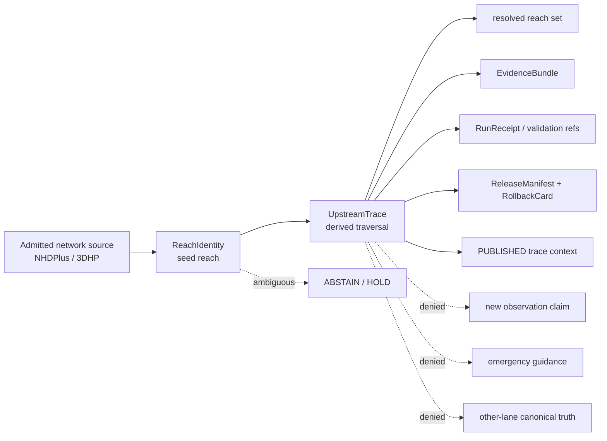
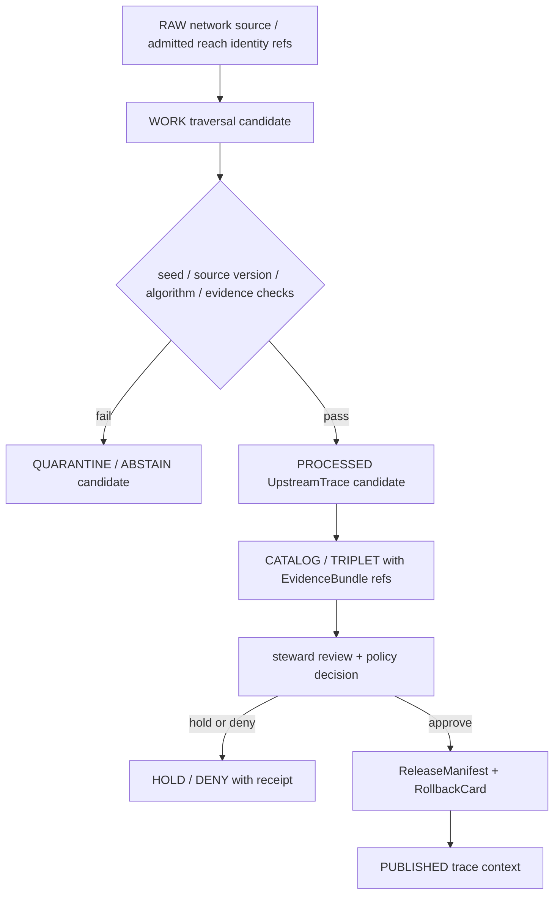

<!-- [KFM_META_BLOCK_V2]
doc_id: kfm://doc/contracts-domains-hydrology-upstream-trace
title: Upstream Trace Contract — Hydrology
type: semantic-contract
version: v0.2
status: draft; PROPOSED; schema-missing; NEEDS VERIFICATION before promotion
owners:
  - OWNER_TBD — Hydrology domain steward
  - OWNER_TBD — Surface-water network steward
  - OWNER_TBD — Reach identity steward
  - OWNER_TBD — Contracts steward
  - OWNER_TBD — Source steward
  - OWNER_TBD — Evidence steward
  - OWNER_TBD — Schema steward
  - OWNER_TBD — Policy steward
  - OWNER_TBD — Release steward
  - OWNER_TBD — Docs steward
created: NEEDS VERIFICATION — scaffold existed before v0.2 expansion
updated: 2026-06-22
policy_label: public-with-gates; semantic-contract; hydrology; UpstreamTrace; derived-network-traversal; ReachIdentity-dependent; modeled-network; evidence-bound; release-gated; rollback-aware; not-new-observation; not-source-truth; not-emergency-guidance
tags: [kfm, contracts, hydrology, UpstreamTrace, ReachIdentity, HydroFeature, HUCUnit, NHDPlus, 3DHP, upstream, downstream, network-trace, derived, modeled, EvidenceBundle, PolicyDecision, ReleaseManifest, RollbackCard, spec_hash]
related:
  - ./README.md
  - ./domain_feature_identity.md
  - ./reach_identity.md
  - ./hydro_feature.md
  - ./huc_unit.md
  - ./watershed.md
  - ./hydrograph.md
  - ./decision_envelope.md
  - ./domain_validation_report.md
  - ../../../docs/domains/hydrology/OBJECT_FAMILIES.md
  - ../../../docs/domains/hydrology/GLOSSARY.md
  - ../../../docs/domains/hydrology/SOURCE_ROLE_MATRIX.md
  - ../../../docs/domains/hydrology/BOUNDARY.md
  - ../../../docs/domains/hydrology/IDENTITY_MODEL.md
  - ../../../docs/domains/hydrology/CANONICAL_PATHS.md
  - ../../../docs/domains/hydrology/FILE_SYSTEM_PLAN.md
  - ../../../schemas/contracts/v1/domains/hydrology/upstream_trace.schema.json
  - ../../../policy/domains/hydrology/
  - ../../../fixtures/domains/hydrology/upstream_trace/
  - ../../../tests/domains/hydrology/test_upstream_trace.*
  - ../../../data/registry/sources/hydrology/
  - ../../../release/candidates/hydrology/
notes:
  - "Expanded from a thin scaffold at contracts/domains/hydrology/upstream_trace.md."
  - "Current repo evidence did not find schemas/contracts/v1/domains/hydrology/upstream_trace.schema.json. The expected schema path is named by the Hydrology object-home crosswalk, but implementation remains NEEDS VERIFICATION."
  - "Hydrology docs define UpstreamTrace as a derived network-traversal projection over admitted network identity, not a new observation."
  - "If the seed ReachIdentity is ambiguous, the trace must ABSTAIN/HOLD rather than guess."
[/KFM_META_BLOCK_V2] -->

# Upstream Trace Contract — Hydrology

> Semantic contract for `UpstreamTrace`: a derived Hydrology network-traversal projection that starts from an admitted `ReachIdentity`, records traversal direction and resolved reach set, preserves source-version discipline, and remains evidence-bound, release-gated, and rollback-ready.

  
  
  
  
  
  
  

`contracts/domains/hydrology/upstream_trace.md`

## Quick jumps

[Status](#status) · [Meaning](#meaning) · [Repo fit](#repo-fit) · [Schema posture](#schema-posture) · [Trace boundary](#trace-boundary) · [Assertions](#assertions) · [Exclusions](#exclusions) · [Recommended fields](#recommended-fields) · [Source-role rules](#source-role-rules) · [Temporal and version rules](#temporal-and-version-rules) · [ABSTAIN and DENY triggers](#abstain-and-deny-triggers) · [Sensitivity and publication](#sensitivity-and-publication) · [Lifecycle](#lifecycle) · [Validation](#validation) · [Rollback](#rollback) · [Evidence basis](#evidence-basis) · [Open questions](#open-questions)

---

## Status

> [!IMPORTANT]
> **Status:** `draft` / semantic contract  
> **Contract path:** `contracts/domains/hydrology/upstream_trace.md`  
> **Expected schema path:** `schemas/contracts/v1/domains/hydrology/upstream_trace.schema.json`  
> **Schema posture:** expected by Hydrology object-home crosswalk, but not found in current repo fetch/search evidence. Field-level schema shape, validators, fixtures, policy enforcement, emitted EvidenceBundles, release manifests, public DTOs, and runtime behavior remain **NEEDS VERIFICATION**.  
> **Truth posture:** Hydrology docs define `UpstreamTrace` as a derived network-traversal projection over admitted network identity, with seed `ReachIdentity`, traversal direction, resolved reach set, and `nhdplus_version` discipline.

> [!CAUTION]
> `UpstreamTrace` is **derived**. It is not a new observation, not a source truth object, not a gauge reading, not a flood forecast, not a regulatory determination, and not emergency guidance. If the seed `ReachIdentity` is ambiguous, the trace must `ABSTAIN` or `HOLD` rather than guess.

---

## Meaning

`UpstreamTrace` represents a deterministic network traversal over admitted Hydrology network identity. It answers a bounded network question such as:

- which reaches are upstream of a seed reach;
- which reaches are downstream of a seed reach;
- what reach set was resolved under a specific hydrography version;
- what traversal algorithm, source version, evidence refs, and release state produced the result.

It depends on `ReachIdentity`. The seed reach, source version, traversal direction, traversal rules, resolved reach set, and run/provenance records must remain inspectable.

It may be used as context for maps, evidence drawers, habitat/wetland context, infrastructure crossing analysis, water-availability cells, or hydrology Focus Mode answers. It must not silently replace the underlying `ReachIdentity`, `HydroFeature`, `HUCUnit`, observation, or source descriptor.

---

## Repo fit

| Responsibility | Path or root | This contract's role |
|---|---|---|
| Human-readable object meaning | `contracts/domains/hydrology/upstream_trace.md` | This file; semantic contract for `UpstreamTrace`. |
| Machine-readable shape | `schemas/contracts/v1/domains/hydrology/upstream_trace.schema.json` | Expected by object-home crosswalk, but not found in current repo evidence. |
| Seed identity contract | `contracts/domains/hydrology/reach_identity.md` | Required upstream dependency; ambiguous seed identity causes ABSTAIN/HOLD. |
| Network feature companion | `contracts/domains/hydrology/hydro_feature.md` | Provides generic surface-water feature context, not stable traversal identity by itself. |
| Accounting geometry companion | `contracts/domains/hydrology/huc_unit.md` | May bound or summarize traces; does not replace reach identity. |
| Derived time-series companion | `contracts/domains/hydrology/hydrograph.md` | Separate derived family; a trace is network traversal, not hydrograph output. |
| Object catalog | `docs/domains/hydrology/OBJECT_FAMILIES.md` | Defines UpstreamTrace purpose, identity anchor, fields, and derived role. |
| Glossary | `docs/domains/hydrology/GLOSSARY.md` | Defines UpstreamTrace as a derived network-traversal projection. |
| Source-role matrix | `docs/domains/hydrology/SOURCE_ROLE_MATRIX.md` | Classifies UpstreamTrace as modeled/network traversal basis. |
| Boundary doctrine | `docs/domains/hydrology/BOUNDARY.md` | Confirms Hydrology owns network-trace derivatives and lends reach context without overriding other lanes. |
| Policy | `policy/domains/hydrology/` | Expected ABSTAIN/DENY gates for ambiguous seed, mixed vintage, sensitivity joins, and release state. |
| Fixtures/tests | `fixtures/domains/hydrology/upstream_trace/`, `tests/domains/hydrology/` | Expected valid/invalid examples and negative-path proof. |
| Release | `release/candidates/hydrology/` and release roots | ReleaseManifest, PromotionDecision, CorrectionNotice, and RollbackCard expected before public exposure. |

---

## Schema posture

| Schema fact | Current posture |
|---|---|
| Expected schema path | `schemas/contracts/v1/domains/hydrology/upstream_trace.schema.json` |
| Exact schema found? | **No** — direct fetch returned 404 and repository search did not find the schema path. |
| Object-home crosswalk | Names `UpstreamTrace` → `upstream_trace.md` / `upstream_trace.schema.json` / default role `derived`. |
| Field-level enforcement | Missing / NEEDS VERIFICATION. |
| Contract promotion status | HOLD until schema, fixtures, validator, policy gates, release checks, and rollback records exist. |

This Markdown contract defines intended meaning and review criteria. It must not be treated as machine validation.

---

## Trace boundary

A valid `UpstreamTrace` claim says: **under this cited hydrography version and traversal algorithm, this seed `ReachIdentity` resolves to this upstream/downstream reach set, with evidence, run receipt, policy posture, release state, and rollback target inspectable.**

A valid `UpstreamTrace` claim must never say: **these reaches were observed flooding, this trace is a gauge observation, this trace is a regulatory flood zone, this trace is emergency advice, or this trace overrides another lane's canonical truth.**

---

## Assertions

A reviewed `UpstreamTrace` should assert:

1. **Seed identity** — the trace starts from a resolved `ReachIdentity` with source version and EvidenceBundle closure.
2. **Traversal direction** — upstream, downstream, bidirectional, or other controlled direction is explicit.
3. **Traversal basis** — algorithm, network version, source family, and traversal rule set are recorded.
4. **Resolved reach set** — output reaches are deterministic and tied to the same version discipline unless an explicit cross-version mapping is reviewed.
5. **No silent ambiguity** — ambiguous seed, ambiguous edge, cyclic topology, mixed version, or incomplete network creates `ABSTAIN`/`HOLD`, not a hidden best guess.
6. **Derived role** — trace is modeled/derived network traversal, not direct observation or regulatory truth.
7. **Evidence closure** — EvidenceRefs resolve before public claims or Focus Mode answers cite the trace.
8. **Run/provenance support** — traversal run, code reference, validation refs, and spec hash are inspectable when a trace is generated.
9. **Release separation** — public exposure requires ReleaseManifest and rollback target.
10. **Correction lineage** — changed network source, traversal algorithm, source version, or seed identity triggers correction/rollback review.

---

## Exclusions

| Misuse | Required outcome |
|---|---|
| Generating a trace from ambiguous `ReachIdentity` | `ABSTAIN` / `HOLD`; do not guess. |
| Mixing NHDPlus v2.1, HR, and 3DHP reach IDs without an explicit crosswalk | `ABSTAIN` / validation `FAIL`. |
| Presenting trace output as observed water, flow, flood, or stage | `DENY`; observations live in observation families. |
| Presenting trace output as regulatory flood context | `DENY`; use `NFHLZone` / `FloodContext`. |
| Presenting trace output as emergency warning or evacuation guidance | `DENY`; Hydrology is not alert authority. |
| Treating trace as source truth rather than derived output | `DENY`; source truth remains source descriptor + admitted network identity. |
| Overriding Soil, Habitat, Fauna, Flora, Agriculture, Infrastructure, or Frontier Matrix truth | `DENY`; Hydrology lends context only. |
| Publicly exposing RAW/WORK/QUARANTINE traces | `DENY`; public clients use governed APIs and released artifacts. |
| Using AI summary as evidence for a trace | `DENY`; AI may explain cited evidence, not replace it. |

---

## Recommended fields

The following fields are **PROPOSED** targets for future schema expansion because the paired schema was not found in current repo evidence.

| Field | Meaning |
|---|---|
| `id` | Canonical KFM `UpstreamTrace` ID. |
| `version` | Contract/object version. |
| `spec_hash` | Deterministic digest over normalized trace inputs and outputs. |
| `domain` | Must resolve to `hydrology`. |
| `object_type` | `UpstreamTrace`. |
| `seed_reach_ref` | Reference to admitted `ReachIdentity`. |
| `seed_reach_version` | Source network version for the seed reach. |
| `source_ref` | SourceDescriptor or EvidenceRef for the admitted network source. |
| `source_role` | Derived/model/network traversal role basis; exact enum realization NEEDS VERIFICATION. |
| `nhdplus_version` | NHDPlus / 3DHP source-vintage discriminator. |
| `traversal_direction` | `upstream`, `downstream`, `bidirectional`, or controlled value. |
| `traversal_algorithm` | Algorithm/tool and semantic version used. |
| `traversal_parameters` | Cutoffs, filters, max distance, network class filters, or other bounded parameters. |
| `resolved_reach_refs` | Ordered or unordered set of resolved reach identities, with order semantics explicit. |
| `edge_count` | Count of traversed edges, when useful for validation. |
| `reach_count` | Count of resolved reaches. |
| `cycle_flags` | Whether cycles/braids/loops were detected and how they were handled. |
| `ambiguity_status` | `resolved`, `ambiguous`, `unsupported`, `out_of_scope`, or controlled value. |
| `decision_reason` | Official traversal, reviewed algorithm, heuristic fallback, steward override, or other controlled value. |
| `run_receipt_ref` | RunReceipt for generated trace execution. |
| `validation_refs` | DomainValidationReport or validator output. |
| `evidence_refs` | EvidenceRefs required for public claims. |
| `policy_decision_ref` | PolicyDecision allowing/restricting/denying/holding the trace. |
| `release_manifest_ref` | ReleaseManifest proving public exposure is gated. |
| `rollback_ref` | RollbackCard or rollback target. |
| `limitations` | Caveats: derived trace, version-bound, not observation, not emergency guidance. |

---

## Source-role rules

| Basis | UpstreamTrace posture | Discipline |
|---|---|---|
| Admitted `ReachIdentity` | Required seed basis. | Must be resolved, versioned, and evidence-bound. |
| NHDPlus / 3DHP network | Allowed traversal basis. | Preserve source version and role; no silent vintage mixing. |
| VAAs / derived network attributes | Allowed only as modeled/derived support where labeled. | Never relabel as direct observation. |
| Gauge observations | May contextualize but do not define the trace. | Observations are separate object families. |
| WBD / HUC units | May bound or summarize the trace. | HUC accounting geometry does not replace reach identity. |
| NFHL / flood context | Not a trace source. | Regulatory context only, never observed flood. |
| AI summaries | Not source truth. | Interpretive carrier only; cannot prove traversal. |

---

## Temporal and version rules

| Dimension | Required treatment |
|---|---|
| `source_time` | Source publication or version time for the network data. |
| `temporal_scope` | Inherited from seed `ReachIdentity` and network version. |
| `retrieval_time` | When KFM retrieved/froze the source material. |
| `run_time` | When traversal was executed; belongs in receipt/provenance. |
| `release_time` | When KFM published a released trace derivative. |
| `correction_time` | When KFM corrected, superseded, withdrew, or rolled back the trace. |
| `observed_time` | Not applicable to the trace itself; observations remain separate. |
| `nhdplus_version` / source version | Required discriminator. Mixed versions fail closed unless explicitly mapped. |

---

## ABSTAIN and DENY triggers

| Trigger | Required outcome |
|---|---|
| Seed `ReachIdentity` unresolved or ambiguous | `ABSTAIN` / `HOLD`. |
| Network source version missing | `ABSTAIN` / validation `FAIL`. |
| Mixed source versions without explicit mapping | `ABSTAIN` / validation `FAIL`. |
| Traversal algorithm/version missing | `ABSTAIN` until provenance is supplied. |
| Resolved reach set is non-deterministic across runs | `FAIL` and quarantine candidate. |
| Braided/cyclic network handling not recorded | `ABSTAIN` / `HOLD`. |
| EvidenceRefs unresolved | `ABSTAIN` for answer surfaces; `HOLD` or `DENY` for publication. |
| Trace framed as observation, regulation, forecast, or emergency guidance | `DENY`. |
| Public surface attempts direct RAW/WORK trace read | `DENY`. |

---

## Sensitivity and publication

`UpstreamTrace` is usually public-safe when it only exposes released network context, but downstream joins can create sensitivity or false precision.

| Exposure pattern | Default posture |
|---|---|
| Released trace from public network identity with evidence and caveat | Public with derived/version-bound caveat. |
| Trace joined to habitat/flora/fauna occurrences | Owning ecological lane controls redaction/generalization; sensitive occurrences fail closed. |
| Trace joined to infrastructure or exact asset exposure | Review-required; exact-asset exposure may be staged-access. |
| Trace joined to irrigation/water-use context | Context only; Agriculture or water-use lane owns use/yield/admin claims. |
| Trace used for emergency decision-making | DENY. KFM is not an alert authority. |
| Candidate, ambiguous, or unreleased trace | Do not publish. |

Public surfaces should use a caveat like:

> This upstream trace is a derived network traversal from a released reach identity and source version. It is not a gauge observation, flood forecast, regulatory determination, or emergency instruction.

---

## Lifecycle

Promotion is a governed state transition. A traversal result, graph query, tile, vector index, or AI answer does not become canonical truth by existing.

---

## Validation

Minimum validation expectations before promotion:

| Gate | Required check |
|---|---|
| Schema | `upstream_trace.schema.json` exists and defines required fields. |
| Seed identity | `seed_reach_ref` resolves to admitted `ReachIdentity`. |
| Version discipline | Network source version is explicit and not silently mixed. |
| Determinism | Same inputs + same algorithm + same source version produce same resolved reach set and `spec_hash`. |
| Algorithm provenance | Tool name/version, parameters, and run receipt are recorded. |
| Ambiguity handling | Ambiguous seed/edge/cycle cases produce `ABSTAIN`/`HOLD`, not best guess. |
| Evidence closure | EvidenceRefs resolve to EvidenceBundles. |
| Source terms | SourceDescriptor confirms allowed use/redistribution posture. |
| Policy | PolicyDecision records derived-trace caveat and any sensitivity restrictions. |
| Release | ReleaseManifest, PromotionDecision, correction path, and RollbackCard exist before public exposure. |
| UI/API | Public DTOs include seed reach, source version, caveat, evidence, release state, and finite outcome behavior. |

Negative fixtures should include at least:

- missing seed reach;
- ambiguous seed reach;
- missing source version;
- mixed NHDPlus / 3DHP versions without crosswalk;
- traversal algorithm omitted;
- non-deterministic resolved reach order where order matters;
- cyclic/braided network without recorded handling;
- unresolved EvidenceRef;
- candidate trace exposed on public route;
- trace labeled as observed flood, gauge reading, or emergency guidance.

---

## Rollback

A released `UpstreamTrace` must be rollback-ready.

Rollback is required when:

- seed `ReachIdentity` is corrected, withdrawn, or re-versioned;
- source network version is superseded or found mismatched;
- traversal algorithm, parameters, or edge rules change;
- deterministic trace output changes for the same declared inputs;
- ambiguous trace was published as resolved;
- evidence or validation refs are missing or superseded;
- sensitive downstream join exposed more than policy allows;
- public UI omitted derived/version-bound caveat;
- release occurred without rollback target.

Rollback must record:

| Rollback item | Required content |
|---|---|
| `rollback_ref` | Stable rollback target or RollbackCard ID. |
| `affected_release_manifest_ref` | ReleaseManifest being withdrawn, corrected, or superseded. |
| `seed_reach_ref` | Seed reach identity affected. |
| `affected_trace_ref` | UpstreamTrace object or release artifact affected. |
| `reason_code` | Seed correction, source supersession, version drift, algorithm change, ambiguity, evidence missing, sensitive join, or implementation error. |
| `replacement_ref` | Replacement trace, correction notice, or abstention record. |
| `public_notice_required` | Whether public correction notice is required. |

---

## Evidence basis

| Evidence | Supports | Limit |
|---|---|---|
| `contracts/domains/hydrology/upstream_trace.md` scaffold | Target file already existed as a scaffold and needed authoritative content. | Scaffold had no semantic detail. |
| Missing `schemas/contracts/v1/domains/hydrology/upstream_trace.schema.json` fetch/search | Schema was not found in current repo evidence. | Absence from search/fetch is not proof it cannot exist elsewhere; expected path remains NEEDS VERIFICATION. |
| `docs/domains/hydrology/GLOSSARY.md` | Defines `UpstreamTrace` as a derived network-traversal projection and not a new observation. | Field realization is PROPOSED. |
| `docs/domains/hydrology/OBJECT_FAMILIES.md` | Defines purpose, identity anchor, key attributes, derived role, and schema crosswalk expectation. | Does not prove runtime/schema implementation. |
| `docs/domains/hydrology/SOURCE_ROLE_MATRIX.md` | Classifies `UpstreamTrace` as modeled/network traversal basis. | Role enum implementation and field shape need schema/policy confirmation. |
| `docs/domains/hydrology/BOUNDARY.md` | Confirms Hydrology owns network-trace derivatives and lends reach context to other lanes without overriding their truth. | Does not implement UI/API gates. |

---

## Open questions

| ID | Question | Evidence needed | Status |
|---|---|---|---|
| OQ-HYD-UPTRACE-01 | Where is or should `upstream_trace.schema.json` live, and why is the expected path missing? | Schema commit, ADR, or migration note. | OPEN / NEEDS VERIFICATION |
| OQ-HYD-UPTRACE-02 | What exact traversal directions and controlled values are allowed? | Schema enum + fixtures. | OPEN / NEEDS VERIFICATION |
| OQ-HYD-UPTRACE-03 | Which algorithm/tool is canonical for the first proof-bearing Hydrology slice? | Pipeline spec + run receipt fixtures. | OPEN / NEEDS VERIFICATION |
| OQ-HYD-UPTRACE-04 | How are braided/cyclic network cases represented and tested? | Validator policy + negative fixtures. | OPEN / NEEDS VERIFICATION |
| OQ-HYD-UPTRACE-05 | Is resolved reach set order significant, and how is it canonicalized for `spec_hash`? | Canonicalization rule + schema. | OPEN / NEEDS VERIFICATION |
| OQ-HYD-UPTRACE-06 | Which public DTO fields must appear in map feature drawers and Focus Mode answers? | API/UI contract + policy tests. | OPEN / NEEDS VERIFICATION |

---

## Definition of done

This contract can move beyond draft only when:

- `upstream_trace.schema.json` exists at the accepted schema home or a documented ADR explains the alternate home;
- valid and invalid fixtures exist;
- validators prove deterministic trace output, source-version discipline, and ambiguity outcomes;
- `seed_reach_ref` resolves to an admitted `ReachIdentity` in a no-network fixture slice;
- policy gates deny observations/regulations/emergency claims made from traces;
- public UI/API surfaces show seed reach, source version, derived-trace caveat, evidence, release state, and finite outcome behavior;
- release and rollback artifacts exist for the first public-safe trace derivative;
- docs, schema, policy, fixtures, and tests agree on the derived network-trace boundary.

[Back to top](#top)
