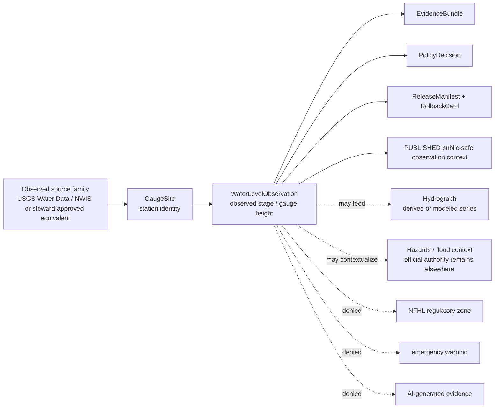
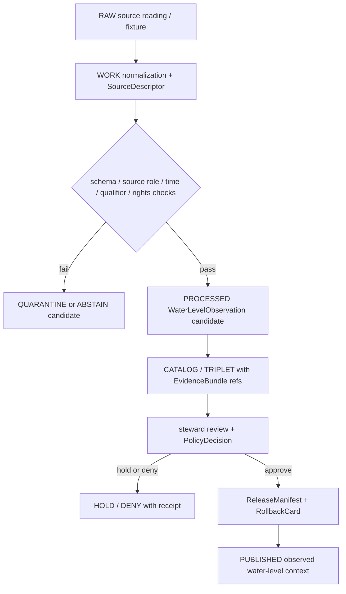

<!-- [KFM_META_BLOCK_V2]
doc_id: kfm://doc/contracts-domains-hydrology-water-level-observation
title: Water Level Observation Contract — Hydrology
type: semantic-contract
version: v0.2
status: draft; PROPOSED; schema-scaffold; NEEDS VERIFICATION before promotion
owners:
  - OWNER_TBD — Hydrology domain steward
  - OWNER_TBD — Observation steward
  - OWNER_TBD — Gauge/stage data steward
  - OWNER_TBD — Contracts steward
  - OWNER_TBD — Source steward
  - OWNER_TBD — Evidence steward
  - OWNER_TBD — Schema steward
  - OWNER_TBD — Policy steward
  - OWNER_TBD — Release steward
  - OWNER_TBD — Docs steward
created: NEEDS VERIFICATION — scaffold existed before v0.2 expansion
updated: 2026-06-22
policy_label: public-with-gates; semantic-contract; hydrology; water-level-observation; gauge-height; stage; observed-role; provisional-final-aware; time-aware; evidence-bound; release-gated; rollback-aware; not-forecast; not-regulatory; not-life-safety
tags: [kfm, contracts, hydrology, WaterLevelObservation, water-level, gauge-height, stage, NWIS, GaugeSite, parameter-code, 00065, unit, qualifier, no-data, provisional, final, observed-time, EvidenceBundle, CitationValidationReport, ReleaseManifest, RollbackCard]
related:
  - ./README.md
  - ./decision_envelope.md
  - ./domain_feature_identity.md
  - ./domain_layer_descriptor.md
  - ./domain_observation.md
  - ./domain_validation_report.md
  - ./evidence_bundle.md
  - ./gauge_site.md
  - ./flow_observation.md
  - ./water_quality_observation.md
  - ./hydrograph.md
  - ./nfhl_zone.md
  - ./observed_flood_event.md
  - ../../../docs/domains/hydrology/OBJECT_FAMILIES.md
  - ../../../docs/domains/hydrology/SOURCE_ROLE_MATRIX.md
  - ../../../docs/domains/hydrology/GLOSSARY.md
  - ../../../docs/domains/hydrology/BOUNDARY.md
  - ../../../docs/domains/hydrology/API_CONTRACTS.md
  - ../../../docs/domains/hydrology/README.md
  - ../../../docs/domains/hydrology/IDENTITY_MODEL.md
  - ../../../schemas/contracts/v1/domains/hydrology/water_level_observation.schema.json
  - ../../../policy/domains/hydrology/
  - ../../../fixtures/domains/hydrology/water_level_observation/
  - ../../../tests/domains/hydrology/test_water_level_observation.*
  - ../../../data/registry/sources/hydrology/
  - ../../../release/candidates/hydrology/
notes:
  - "Expanded from a thin scaffold at contracts/domains/hydrology/water_level_observation.md."
  - "The paired schema exists at schemas/contracts/v1/domains/hydrology/water_level_observation.schema.json, but current evidence shows it is still a PROPOSED scaffold with empty properties and additionalProperties=true."
  - "Hydrology object-family doctrine defines WaterLevelObservation as a time-stamped gauge-height / stage observation, typically anchored to NWIS series + parameter code such as 00065."
  - "This contract preserves observed-role posture: WaterLevelObservation is not a forecast, modeled hydrograph, NFHL regulatory context, observed flood event, public layer, or life-safety authority."
[/KFM_META_BLOCK_V2] -->

# Water Level Observation Contract — Hydrology

> Semantic contract for `WaterLevelObservation`: a time-scoped, source-role-preserved Hydrology observation representing observed gauge height / stage evidence with source, site/series, parameter, value, unit, qualifier, provisional/final state, EvidenceBundle support, policy posture, release state, correction lineage, and rollback target.

  
  
  
  
  
  
  

`contracts/domains/hydrology/water_level_observation.md`

## Quick jumps

[Status](#status) · [Meaning](#meaning) · [Repo fit](#repo-fit) · [Schema posture](#schema-posture) · [Observation boundaries](#observation-boundaries) · [Assertions](#assertions) · [Exclusions](#exclusions) · [Recommended fields](#recommended-fields) · [Source-role rules](#source-role-rules) · [Temporal rules](#temporal-rules) · [Evidence and citation posture](#evidence-and-citation-posture) · [Sensitivity and publication](#sensitivity-and-publication) · [Lifecycle](#lifecycle) · [Validation](#validation) · [Rollback](#rollback) · [Evidence basis](#evidence-basis) · [Open questions](#open-questions)

---

## Status

> [!IMPORTANT]
> **Status:** `draft` / semantic contract  
> **Contract path:** `contracts/domains/hydrology/water_level_observation.md`  
> **Schema path:** `schemas/contracts/v1/domains/hydrology/water_level_observation.schema.json`  
> **Schema posture:** paired schema exists, but remains a `PROPOSED` scaffold with empty `properties` and `additionalProperties: true`.  
> **Truth posture:** Hydrology docs define `WaterLevelObservation` as a time-stamped gauge-height / stage observation. Field-level schema shape, validators, fixtures, policy enforcement, runtime route behavior, emitted EvidenceBundles, release manifests, and UI behavior remain **NEEDS VERIFICATION**.

> [!CAUTION]
> `WaterLevelObservation` is an observed stage / gauge-height record. It is not a forecast, not a flood warning, not an NFHL regulatory zone, not an observed flood event, not a modeled hydrograph unless role-flagged elsewhere, not a public layer, and not emergency or life-safety guidance.

---

## Meaning

`WaterLevelObservation` represents an observed water-level, stage, or gauge-height value reported by an admissible Hydrology source family for a monitoring location, time, parameter, unit, qualifier, and provisional/final status.

It should be treated as a specialized observation family under the broader `domain_observation` envelope. It normally links to:

- a `GaugeSite` or source-provided monitoring station identity;
- a source series and parameter code, commonly NWIS gauge height parameter `00065` where applicable;
- an observed instant or aggregation window;
- a stage / gauge-height / water-level value and unit;
- a datum or vertical reference when the source provides one;
- source qualifier, provisional/final status, no-data flags, or caveats;
- EvidenceRef / EvidenceBundle support;
- PolicyDecision and release/correction/rollback objects before public use.

`WaterLevelObservation` may feed a `Hydrograph`, flood-context narrative, evidence drawer, or public layer descriptor, but the downstream derivative does not become the original observed reading.

---

## Repo fit

| Responsibility | Path or root | This contract's role |
|---|---|---|
| Human-readable object meaning | `contracts/domains/hydrology/water_level_observation.md` | This file; semantic contract for `WaterLevelObservation`. |
| Machine schema | `schemas/contracts/v1/domains/hydrology/water_level_observation.schema.json` | Confirmed scaffold; full field shape is not enforced yet. |
| Observation envelope | `contracts/domains/hydrology/domain_observation.md` | Shared observation semantics and role boundaries. |
| Gauge/site identity | `contracts/domains/hydrology/gauge_site.md` | Monitoring-location identity; not the reading itself. |
| Flow readings | `contracts/domains/hydrology/flow_observation.md` | Sibling observed discharge/streamflow reading family. |
| Water-quality readings | `contracts/domains/hydrology/water_quality_observation.md` | Sibling parameter-measurement observation family. |
| Hydrograph | `contracts/domains/hydrology/hydrograph.md` | Derived time-series projection that may consume observations but must not relabel modeled output as observed. |
| NFHL regulatory context | `contracts/domains/hydrology/nfhl_zone.md` | Separate regulatory context; not observed stage. |
| Observed flood evidence | `contracts/domains/hydrology/observed_flood_event.md` | Separate observed inundation family; not the same as a water-level reading. |
| Evidence bundle | `contracts/domains/hydrology/evidence_bundle.md` | Hydrology alias of shared EvidenceBundle support. |
| Feature identity | `contracts/domains/hydrology/domain_feature_identity.md` | Stable ID/spec_hash/source/time/digest companion. |
| Layer descriptor | `contracts/domains/hydrology/domain_layer_descriptor.md` | Public delivery descriptor; not observation truth. |
| Decision envelope | `contracts/domains/hydrology/decision_envelope.md` | Runtime finite outcomes. |
| Object catalog | `docs/domains/hydrology/OBJECT_FAMILIES.md` | Defines WaterLevelObservation purpose and typical identity anchor. |
| Source-role matrix | `docs/domains/hydrology/SOURCE_ROLE_MATRIX.md` | Defines observed-role basis and forbidden modeled/regulatory bases. |
| Policy | `policy/domains/hydrology/` | Expected source-role, rights, sensitivity, release, and public-exposure gates. |
| Release | `release/candidates/hydrology/` and release roots | ReleaseManifest, CorrectionNotice, RollbackCard, and promotion decisions. |

---

## Schema posture

| Schema fact | Current posture |
|---|---|
| Expected schema path | `schemas/contracts/v1/domains/hydrology/water_level_observation.schema.json` |
| Exact schema found? | **Yes** — direct repo fetch found a JSON Schema file. |
| Schema maturity | **PROPOSED scaffold** only. The schema description says fields are to be defined by the owning domain steward. |
| Field-level properties | Empty object (`properties: {}`) in current evidence. |
| Additional properties | Currently `true`; not yet restrictive. |
| Semantic contract promotion status | HOLD until schema fields, fixtures, validators, source descriptors, policy gates, release checks, and rollback records exist. |

This file defines intended meaning and review criteria. It does not prove that a validator, API, tile service, or Focus Mode surface enforces the rules.

---

## Observation boundaries

A valid `WaterLevelObservation` claim says: **this source reported this stage/gauge-height/water-level value for this site, parameter, time, unit, qualifier, and provisional/final state, with evidence and release posture inspectable.**

A valid `WaterLevelObservation` claim must never say: **this is a forecast, this is an emergency warning, this is a regulatory flood-zone determination, this proves observed inundation by itself, or this modeled derivative is an observed reading.**

---

## Assertions

A reviewed `WaterLevelObservation` should assert:

1. **Observation identity** — stable object ID and `spec_hash` over source, site/series, parameter, time, value, unit, qualifier, status, and normalized digest.
2. **Source descriptor** — source family, source role, rights, retrieval state, source limitations, and activation posture recorded.
3. **Observed role** — the object is an observed reading and must not be admitted as regulatory, modeled, aggregate, candidate-published, or synthetic truth.
4. **Gauge/site reference** — observation references a `GaugeSite` or source-native monitoring-location identity; the site is not the reading.
5. **Parameter discipline** — stage/gauge-height/water-level parameter code or source parameter identifier is recorded and not confused with discharge, water quality, or derived flood status.
6. **Value discipline** — value, unit, datum/vertical reference where applicable, qualifier, provisional/final state, and no-data behavior are explicit.
7. **Temporal discipline** — observed time or aggregation window remains distinct from retrieval time, release time, and correction time.
8. **Evidence closure** — EvidenceRefs resolve to EvidenceBundles before public claims, exports, AI answers, or map drawers treat the observation as authoritative.
9. **Policy support** — rights, source role, sensitivity, freshness, provisional/final state, and publication posture recorded.
10. **Release separation** — ReleaseManifest and rollback target required for public surfaces.
11. **Correction lineage** — provisional-to-final updates, source corrections, unit/datum corrections, and changed qualifiers remain auditable.

---

## Exclusions

| Misuse | Required outcome |
|---|---|
| Treating `GaugeSite` metadata as the water-level reading | `DENY`; site identity and observation are separate. |
| Treating a water-level observation as a forecast | `DENY`; forecasts/projections belong to modeled objects such as `Hydrograph` with role flags. |
| Treating stage/gauge-height as discharge without a conversion/model | `DENY`; use `FlowObservation` or an explicit modeled transform with receipt and uncertainty. |
| Treating a water-level reading as NFHL regulatory context | `DENY`; use `NFHLZone` / `FloodContext`. |
| Treating a water-level reading alone as an observed flood event | `ABSTAIN` or `DENY`; observed inundation requires its own evidence family. |
| Publishing provisional/candidate readings without status and caveat | `DENY` or `HOLD`, depending on policy. |
| Publishing RAW/WORK/QUARANTINE observations to public clients | `DENY`; public clients use governed APIs and released artifacts. |
| Using AI summary as evidence for the reading | `DENY`; AI may explain cited evidence, not replace it. |
| Giving emergency instructions from a reading | `DENY`; KFM is not alert authority. |

---

## Recommended fields

The following fields are **PROPOSED** targets for future schema expansion. The current schema scaffold does not enforce them yet.

| Field | Meaning |
|---|---|
| `id` | Canonical KFM `WaterLevelObservation` ID. |
| `version` | Contract/object version. |
| `spec_hash` | Deterministic digest over normalized identity-bearing fields. |
| `domain` | Must resolve to `hydrology`. |
| `object_type` | `WaterLevelObservation`. |
| `source_ref` | SourceDescriptor or EvidenceRef for admitted observation source. |
| `source_role` | Must preserve observed role for direct readings. |
| `source_family` | NWIS / USGS Water Data, state water office, or steward-approved source family. |
| `gauge_site_ref` | `GaugeSite` or source-native monitoring-location reference. |
| `site_no` | Source-native station/site identifier where applicable. |
| `series_ref` | Source series identifier, endpoint, or dataset key. |
| `parameter_code` | Gauge-height/stage/water-level parameter code, e.g. NWIS `00065` where applicable. |
| `parameter_name` | Human-readable source parameter name. |
| `value` | Reported water-level/stage/gauge-height value. |
| `unit` | Source unit, normalized unit, or both. |
| `datum_ref` | Datum or vertical reference, where source provides one. |
| `qualifier` | Source qualifier flags. |
| `provisional_status` | Provisional, approved/final, corrected, estimated, ice-affected, no-data, or controlled equivalent. |
| `no_data` | Explicit no-data/missing-value state. |
| `observed_time` | Time of the reading. |
| `aggregation_window` | Window when the value is an aggregate rather than an instant. |
| `retrieval_time` | KFM retrieval/freeze time. |
| `release_time` | Governed KFM release time. |
| `correction_time` | Supersession/correction time, if applicable. |
| `evidence_refs` | EvidenceRefs required for public claims. |
| `policy_decision_ref` | PolicyDecision allowing, restricting, denying, or holding the observation. |
| `release_manifest_ref` | ReleaseManifest proving public exposure is gated. |
| `rollback_ref` | RollbackCard or rollback target. |
| `limitations` | Caveats: provisional, datum-specific, not forecast, not flood warning, not regulatory context. |

---

## Source-role rules

| Basis | WaterLevelObservation posture | Discipline |
|---|---|---|
| USGS Water Data / NWIS gauge height | Allowed observed basis. | Preserve site/series, parameter code, time, unit, qualifier, and provisional/final state. |
| State water office stage data | Potentially observed or administrative depending on descriptor. | SourceDescriptor decides role; do not upgrade by promotion. |
| GaugeSite metadata | Context only. | Station/site identity is not the reading. |
| FlowObservation / discharge data | Separate observation family. | Stage is not discharge unless an explicit transform/model is recorded. |
| Hydrograph | Derived/model or series view. | May consume water-level observations but must not relabel model output as observed. |
| FEMA NFHL / MSC | Not valid basis. | Regulatory flood context only, never observed stage. |
| AI summaries / synthetic reconstructions | Not source truth. | Interpretive carriers only. |

---

## Temporal rules

`WaterLevelObservation` is time-sensitive. These times must stay distinct:

| Time | Required treatment |
|---|---|
| `observed_time` | When the stage/gauge-height/water-level value was observed or reported for the station. |
| `aggregation_window` | Required when the value is an average/min/max/windowed statistic rather than an instant. |
| `source_time` | Source publication/update time, where provided. |
| `retrieval_time` | When KFM retrieved/froze the source payload. Does not replace observed time. |
| `valid_time` | Applies if the observation has an explicit validity interval; otherwise do not invent one. |
| `release_time` | When KFM published a released derivative. Not the observation time. |
| `correction_time` | When provisional/final status, value, qualifier, unit, datum, or source correction superseded the earlier record. |

---

## Evidence and citation posture

A public `WaterLevelObservation` surface must expose or resolve:

- SourceDescriptor with source role, rights, cadence, and limitations;
- site/series identity and parameter code/name;
- observed time or aggregation window;
- value, unit, qualifier, datum where applicable, and provisional/final status;
- EvidenceBundle or EvidenceRef closure;
- PolicyDecision with finite outcome;
- ReleaseManifest for public exposure;
- rollback target and correction lineage.

Public answers or map drawers should use language like:

> This is a released observed stage/gauge-height reading from the cited source and time. It is not a forecast, flood warning, regulatory flood-zone determination, or emergency instruction.

---

## Sensitivity and publication

`WaterLevelObservation` is often public-safe when sourced from public gauge networks, but release still requires review because time, exact place, datum, provisional status, and downstream joins can mislead users.

| Exposure pattern | Default posture |
|---|---|
| Released public gauge-height/stage reading with source, time, unit, qualifier, and status | Public with citation and caveat. |
| Provisional real-time reading | Public only with provisional caveat and freshness context. |
| Reading with unknown rights or source terms | HOLD/DENY until SourceDescriptor and policy allow use. |
| Reading joined to sensitive habitat/flora/fauna or exact asset exposure | Owning lane controls redaction/generalization; sensitive joins fail closed. |
| Reading used as crop-yield, irrigation, or water-use input | Requires explicit model/cross-lane evidence; observed reading alone is context only. |
| Reading used for emergency guidance | DENY. KFM is not an alert authority. |

---

## Lifecycle

Promotion is a governed state transition. A source payload, schema scaffold, dashboard card, tile, graph projection, vector index, or AI answer does not become canonical observation truth by existing.

---

## Validation

Minimum validation expectations before promotion:

| Gate | Required check |
|---|---|
| Schema | `water_level_observation.schema.json` defines required fields and validates valid/invalid fixtures. |
| Source role | Direct readings carry observed role and are not admitted as regulatory/modeled/synthetic truth. |
| Site/series identity | `GaugeSite` or source-native site identity resolves. |
| Parameter discipline | Parameter identifies stage/gauge-height/water-level, not discharge or water quality. |
| Value/unit/datum | Value, unit, datum/ref where applicable, qualifier, and no-data state are explicit. |
| Temporal discipline | Observed time/window, retrieval time, release time, and correction time do not collapse. |
| Provisional/final state | Provisional/corrected/final/estimated status is retained. |
| Evidence closure | EvidenceRefs resolve to EvidenceBundles. |
| Rights/source terms | SourceDescriptor confirms allowed use and redistribution posture. |
| Policy | PolicyDecision records release, caveats, restrictions, or denial. |
| Release | ReleaseManifest, PromotionDecision, correction path, and RollbackCard exist before public exposure. |
| UI/API | Public DTOs include source, time, value, unit, status, caveat, evidence, and finite outcome behavior. |

Negative fixtures should include at least:

- missing observed time;
- missing parameter code/name;
- discharge parameter used as water-level observation;
- missing unit;
- missing provisional/final status where the source exposes it;
- no-data value treated as numeric measurement;
- unresolved GaugeSite/source station;
- unresolved EvidenceRef;
- candidate/provisional reading published without caveat;
- water-level reading labeled as forecast, NFHL/regulatory context, observed flood event, or emergency warning;
- AI-generated explanation used as observation evidence.

---

## Rollback

A released `WaterLevelObservation` must be rollback-ready.

Rollback is required when:

- source value, unit, datum, qualifier, or provisional/final status is corrected;
- source station/series identity was wrong or superseded;
- observed time/window was wrong or collapsed with retrieval/release time;
- no-data value was treated as a real measurement;
- reading was published with unknown rights or unresolved SourceDescriptor;
- evidence closure was missing;
- reading was framed as forecast, flood warning, regulatory determination, or observed flood event;
- public UI omitted source/time/unit/status caveats;
- sensitive downstream join exposed more than policy allows.

Rollback must record:

| Rollback item | Required content |
|---|---|
| `rollback_ref` | Stable rollback target or RollbackCard ID. |
| `affected_release_manifest_ref` | ReleaseManifest being withdrawn, corrected, or superseded. |
| `affected_observation_ref` | WaterLevelObservation object or public artifact affected. |
| `reason_code` | Source correction, unit/datum error, time error, status correction, evidence missing, rights change, role collapse, sensitive join, or implementation error. |
| `replacement_ref` | Replacement observation, correction notice, or abstention record. |
| `public_notice_required` | Whether public correction notice is required. |

---

## Evidence basis

| Evidence | Supports | Limit |
|---|---|---|
| `contracts/domains/hydrology/water_level_observation.md` scaffold | Target file already existed as a scaffold and needed authoritative content. | Scaffold had no semantic detail. |
| `schemas/contracts/v1/domains/hydrology/water_level_observation.schema.json` | Paired schema exists. | Current schema is a PROPOSED scaffold with empty properties and permissive additionalProperties. |
| `docs/domains/hydrology/GLOSSARY.md` | Defines `WaterLevelObservation` as a time-stamped gauge-height/stage observation and confirms observed-role/provisional-final discipline. | Field realization is PROPOSED. |
| `docs/domains/hydrology/OBJECT_FAMILIES.md` | Defines observation families as direct time-stamped in-situ readings and gives WaterLevelObservation purpose, identity anchor, attributes, and public-safe observed role. | Does not prove runtime/schema implementation. |
| `docs/domains/hydrology/SOURCE_ROLE_MATRIX.md` | Confirms WaterLevelObservation may be built from observed role and forbids regulatory/modeled role collapse. | Role enum implementation and policy enforcement need schema/policy confirmation. |
| `docs/domains/hydrology/BOUNDARY.md` | Confirms Hydrology owns FlowObservation/WaterLevelObservation and never issues emergency warnings; observed context does not override other lanes. | Does not implement UI/API gates. |
| `contracts/domains/hydrology/gauge_site.md` and `flow_observation.md` | Existing adjacent contracts establish local style and observation/site separation. | Do not prove WaterLevelObservation schema maturity. |

---

## Open questions

| ID | Question | Evidence needed | Status |
|---|---|---|---|
| OQ-HYD-WLO-01 | Which fields are mandatory for the first schema version? | Schema steward decision + fixtures. | OPEN / NEEDS VERIFICATION |
| OQ-HYD-WLO-02 | Which exact source status values represent provisional, final, corrected, estimated, and no-data? | Source profile and policy enum. | OPEN / NEEDS VERIFICATION |
| OQ-HYD-WLO-03 | How should datum/vertical reference be represented across sources? | Schema + source profile + normalization rule. | OPEN / NEEDS VERIFICATION |
| OQ-HYD-WLO-04 | Which stage/gauge-height parameter codes are allowed besides NWIS `00065`? | Source family profiles and fixtures. | OPEN / NEEDS VERIFICATION |
| OQ-HYD-WLO-05 | What freshness caveat is required for near-real-time readings? | Policy and UI/API contract. | OPEN / NEEDS VERIFICATION |
| OQ-HYD-WLO-06 | Which public DTO fields must appear in feature drawers and Focus Mode answers? | API/UI contract + policy tests. | OPEN / NEEDS VERIFICATION |

---

## Definition of done

This contract can move beyond draft only when:

- the schema defines required fields and no longer permits unconstrained objects;
- valid and invalid fixtures exist;
- source descriptors exist for active water-level / gauge-height sources;
- validators prove observed-role discipline, parameter discipline, unit/datum handling, provisional/final state, no-data handling, and temporal separation;
- policy gates deny forecast/regulatory/emergency/source-role collapse and unsupported public claims;
- public UI/API surfaces show source, observed time/window, value, unit, status, caveat, evidence, release state, and finite outcome behavior;
- release and rollback artifacts exist for the first public-safe observation derivative;
- docs, schema, policy, fixtures, and tests agree on the WaterLevelObservation boundary.

[Back to top](#top)
