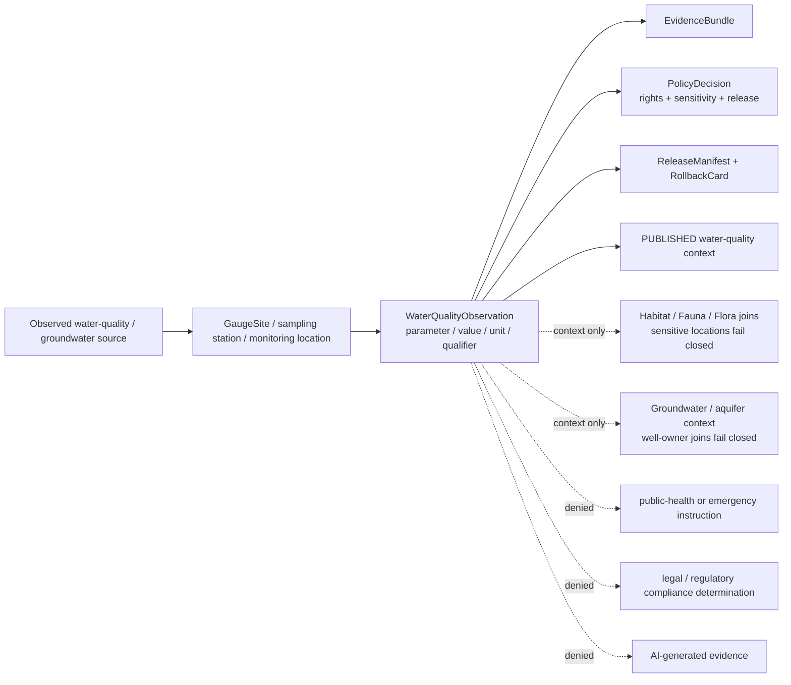
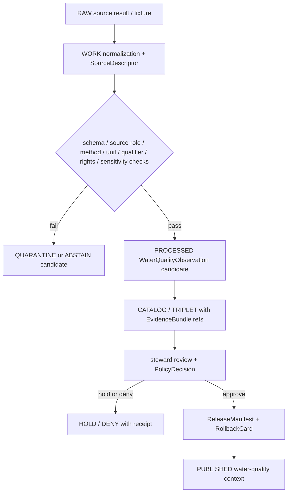

<!-- [KFM_META_BLOCK_V2]
doc_id: kfm://doc/contracts-domains-hydrology-water-quality-observation
title: Water Quality Observation Contract — Hydrology
type: semantic-contract
version: v0.2
status: draft; PROPOSED; schema-scaffold; NEEDS VERIFICATION before promotion
owners:
  - OWNER_TBD — Hydrology domain steward
  - OWNER_TBD — Observation steward
  - OWNER_TBD — Water-quality data steward
  - OWNER_TBD — Contracts steward
  - OWNER_TBD — Source steward
  - OWNER_TBD — Evidence steward
  - OWNER_TBD — Schema steward
  - OWNER_TBD — Policy steward
  - OWNER_TBD — Release steward
  - OWNER_TBD — Docs steward
created: NEEDS VERIFICATION — scaffold existed before v0.2 expansion
updated: 2026-06-22
policy_label: public-with-gates; semantic-contract; hydrology; water-quality-observation; parameter-measurement; observed-role; method-aware; detection-limit-aware; sensitive-joins-fail-closed; time-aware; evidence-bound; release-gated; rollback-aware; not-forecast; not-regulatory; not-life-safety
tags: [kfm, contracts, hydrology, WaterQualityObservation, water-quality, parameter, characteristic, method, value, unit, qualifier, detection-limit, reporting-limit, sample-time, sampling-window, GaugeSite, station, observed, source-role, sensitive-join, EvidenceBundle, CitationValidationReport, ReleaseManifest, RollbackCard]
related:
  - ./README.md
  - ./decision_envelope.md
  - ./domain_feature_identity.md
  - ./domain_layer_descriptor.md
  - ./domain_observation.md
  - ./domain_validation_report.md
  - ./evidence_bundle.md
  - ./gauge_site.md
  - ./flow_observation.md
  - ./water_level_observation.md
  - ./groundwater_well.md
  - ./aquifer_observation.md
  - ./hydrograph.md
  - ./observed_flood_event.md
  - ../../../docs/domains/hydrology/OBJECT_FAMILIES.md
  - ../../../docs/domains/hydrology/SOURCE_ROLE_MATRIX.md
  - ../../../docs/domains/hydrology/GLOSSARY.md
  - ../../../docs/domains/hydrology/BOUNDARY.md
  - ../../../docs/domains/hydrology/API_CONTRACTS.md
  - ../../../docs/domains/hydrology/README.md
  - ../../../docs/domains/hydrology/IDENTITY_MODEL.md
  - ../../../schemas/contracts/v1/domains/hydrology/water_quality_observation.schema.json
  - ../../../policy/domains/hydrology/
  - ../../../fixtures/domains/hydrology/water_quality_observation/
  - ../../../tests/domains/hydrology/test_water_quality_observation.*
  - ../../../data/registry/sources/hydrology/
  - ../../../release/candidates/hydrology/
notes:
  - "Expanded from a thin scaffold at contracts/domains/hydrology/water_quality_observation.md."
  - "The paired schema exists at schemas/contracts/v1/domains/hydrology/water_quality_observation.schema.json, but current evidence shows it is still a PROPOSED scaffold with empty properties and additionalProperties=true."
  - "Hydrology object-family doctrine defines WaterQualityObservation as a parameter/value/unit/qualifier water-quality observation with parameter, method, and detection/reporting-limit discipline."
  - "Sensitive joins fail closed and rights vary by program; release requires source descriptors, evidence closure, policy decision, and rollback path."
[/KFM_META_BLOCK_V2] -->

# Water Quality Observation Contract — Hydrology

> Semantic contract for `WaterQualityObservation`: a time-scoped, source-role-preserved Hydrology observation representing a water-quality parameter measurement with characteristic, method, value, unit, qualifier, detection/reporting limits, sampling context, EvidenceBundle support, policy posture, release state, correction lineage, and rollback target.

  
  
  
  
  
  
  

`contracts/domains/hydrology/water_quality_observation.md`

## Quick jumps

[Status](#status) · [Meaning](#meaning) · [Repo fit](#repo-fit) · [Schema posture](#schema-posture) · [Observation boundaries](#observation-boundaries) · [Assertions](#assertions) · [Exclusions](#exclusions) · [Recommended fields](#recommended-fields) · [Source-role rules](#source-role-rules) · [Temporal rules](#temporal-rules) · [Evidence and citation posture](#evidence-and-citation-posture) · [Sensitivity and publication](#sensitivity-and-publication) · [Lifecycle](#lifecycle) · [Validation](#validation) · [Rollback](#rollback) · [Evidence basis](#evidence-basis) · [Open questions](#open-questions)

---

## Status

> [!IMPORTANT]
> **Status:** `draft` / semantic contract  
> **Contract path:** `contracts/domains/hydrology/water_quality_observation.md`  
> **Schema path:** `schemas/contracts/v1/domains/hydrology/water_quality_observation.schema.json`  
> **Schema posture:** paired schema exists, but remains a `PROPOSED` scaffold with empty `properties` and `additionalProperties: true`.  
> **Truth posture:** Hydrology docs define `WaterQualityObservation` as a parameter/value/unit/qualifier water-quality observation. Field-level schema shape, validators, fixtures, policy enforcement, runtime route behavior, emitted EvidenceBundles, release manifests, and UI behavior remain **NEEDS VERIFICATION**.

> [!CAUTION]
> `WaterQualityObservation` is an observed parameter measurement. It is not a forecast, not a water-quality advisory, not a regulatory determination, not a modeled hydrograph, not a public-health instruction, and not emergency or life-safety guidance. Sensitive joins fail closed.

---

## Meaning

`WaterQualityObservation` represents an observed water-quality measurement or sample result reported by an admissible Hydrology source family for a monitoring location, time or sampling window, characteristic/parameter, method, value, unit, qualifier, and reporting context.

It should be treated as a specialized observation family under the broader `domain_observation` envelope. It normally links to:

- a `GaugeSite`, monitoring station, sampling location, or source-provided station identity;
- a source dataset, sample, series, activity, or result identifier;
- a characteristic / parameter name and source-native parameter code where applicable;
- analytical method, sampling method, laboratory/method context, or reviewed placeholder when unavailable;
- result value, unit, detection limit, reporting limit, remark code, qualifier, and no-data state;
- sampling instant or sampling window;
- EvidenceRef / EvidenceBundle support;
- PolicyDecision and release/correction/rollback objects before public use.

`WaterQualityObservation` may provide context for hydrology, habitat, fauna/flora, public map drawers, or Focus Mode answers, but it does not become the owning truth for ecological occurrence, public-health advisory, legal compliance status, land/title claim, or emergency instruction.

---

## Repo fit

| Responsibility | Path or root | This contract's role |
|---|---|---|
| Human-readable object meaning | `contracts/domains/hydrology/water_quality_observation.md` | This file; semantic contract for `WaterQualityObservation`. |
| Machine schema | `schemas/contracts/v1/domains/hydrology/water_quality_observation.schema.json` | Confirmed scaffold; full field shape is not enforced yet. |
| Observation envelope | `contracts/domains/hydrology/domain_observation.md` | Shared observation semantics and role boundaries. |
| Gauge/site identity | `contracts/domains/hydrology/gauge_site.md` | Monitoring-location identity; not the measurement itself. |
| Flow readings | `contracts/domains/hydrology/flow_observation.md` | Sibling observed discharge/streamflow reading family. |
| Stage readings | `contracts/domains/hydrology/water_level_observation.md` | Sibling observed stage/gage-height reading family. |
| Groundwater context | `contracts/domains/hydrology/groundwater_well.md`, `contracts/domains/hydrology/aquifer_observation.md` | Related but distinct groundwater observation / well context; private-property joins may require review. |
| Hydrograph | `contracts/domains/hydrology/hydrograph.md` | Separate derived projection; does not convert water-quality results into modeled time-series truth. |
| Observed flood evidence | `contracts/domains/hydrology/observed_flood_event.md` | Separate observed inundation family; water-quality measurement alone is not a flood event. |
| Evidence bundle | `contracts/domains/hydrology/evidence_bundle.md` | Hydrology alias of shared EvidenceBundle support. |
| Feature identity | `contracts/domains/hydrology/domain_feature_identity.md` | Stable ID/spec_hash/source/time/digest companion. |
| Layer descriptor | `contracts/domains/hydrology/domain_layer_descriptor.md` | Public delivery descriptor; not observation truth. |
| Decision envelope | `contracts/domains/hydrology/decision_envelope.md` | Runtime finite outcomes. |
| Object catalog | `docs/domains/hydrology/OBJECT_FAMILIES.md` | Defines WaterQualityObservation purpose, identity anchor, attributes, and sensitivity posture. |
| Source-role matrix | `docs/domains/hydrology/SOURCE_ROLE_MATRIX.md` | Defines observed-role basis and source-role preservation. |
| Policy | `policy/domains/hydrology/` | Expected source-role, rights, sensitivity, release, and public-exposure gates. |
| Release | `release/candidates/hydrology/` and release roots | ReleaseManifest, CorrectionNotice, RollbackCard, and promotion decisions. |

---

## Schema posture

| Schema fact | Current posture |
|---|---|
| Expected schema path | `schemas/contracts/v1/domains/hydrology/water_quality_observation.schema.json` |
| Exact schema found? | **Yes** — direct repo fetch found a JSON Schema file. |
| Schema maturity | **PROPOSED scaffold** only. The schema description says fields are to be defined by the owning domain steward. |
| Field-level properties | Empty object (`properties: {}`) in current evidence. |
| Additional properties | Currently `true`; not yet restrictive. |
| Semantic contract promotion status | HOLD until schema fields, fixtures, validators, source descriptors, policy gates, release checks, and rollback records exist. |

This file defines intended meaning and review criteria. It does not prove that a validator, API, tile service, or Focus Mode surface enforces the rules.

---

## Observation boundaries

A valid `WaterQualityObservation` claim says: **this source reported this water-quality parameter result for this station/sample/time/method/value/unit/qualifier, with evidence and release posture inspectable.**

A valid `WaterQualityObservation` claim must never say: **this is a public-health advisory, legal compliance decision, emergency instruction, ecological occurrence truth, or AI-generated evidence.**

---

## Assertions

A reviewed `WaterQualityObservation` should assert:

1. **Observation identity** — stable object ID and `spec_hash` over source, station/sample, characteristic, method, time/window, result, unit, qualifier, and normalized digest.
2. **Source descriptor** — source family, source role, rights, retrieval state, source limitations, and activation posture recorded.
3. **Observed role** — the object is an observed measurement/sample result when admitted as direct evidence; source role must not be upgraded by joins or promotion.
4. **Station/sample reference** — observation references a `GaugeSite`, source station, sampling location, activity, or sample identifier; the site/sample container is not the result itself.
5. **Parameter discipline** — characteristic/parameter name, code where applicable, method, and result context are recorded and not confused with flow, stage, flood context, or modeled hydrograph.
6. **Measurement discipline** — value, unit, detection/reporting limit, remark code, qualifier, no-data behavior, and result status are explicit.
7. **Temporal discipline** — sample time/window, result time where material, retrieval time, release time, and correction time remain distinct.
8. **Evidence closure** — EvidenceRefs resolve to EvidenceBundles before public claims, exports, AI answers, or map drawers treat the observation as authoritative.
9. **Sensitivity handling** — joins to rare species, habitat, private wells, living-person, parcel/title, or exact-asset context are redacted, generalized, staged, denied, or held according to policy.
10. **Release separation** — ReleaseManifest and rollback target are required for public surfaces.
11. **Correction lineage** — corrected lab results, changed qualifiers, method updates, unit conversions, and source withdrawals remain auditable.

---

## Exclusions

| Misuse | Required outcome |
|---|---|
| Treating station metadata as the water-quality result | `DENY`; station identity and result are separate. |
| Treating a water-quality measurement as a legal compliance determination | `DENY`; KFM can cite data, not substitute for regulatory authority. |
| Treating a water-quality result as public-health advice or emergency guidance | `DENY`; KFM is not medical, emergency, or public-health authority. |
| Treating a water-quality observation as flow, stage, or hydrograph output | `DENY`; use the appropriate Hydrology family or explicit model with receipt. |
| Treating a result with censored/remarked/detection-limit value as exact numeric truth | `DENY` or `ABSTAIN`; preserve qualifier and limit semantics. |
| Publishing results with unknown rights, source terms, or unresolved EvidenceRefs | `HOLD` / `DENY`. |
| Joining to rare species, sensitive habitat, private wells, parcels, living people, or exact assets without policy review | `DENY` / generalize / redact / staged access. |
| Publishing RAW/WORK/QUARANTINE water-quality observations to public clients | `DENY`; public clients use governed APIs and released artifacts. |
| Using AI summary as evidence for the result | `DENY`; AI may explain cited evidence, not replace it. |

---

## Recommended fields

The following fields are **PROPOSED** targets for future schema expansion. The current schema scaffold does not enforce them yet.

| Field | Meaning |
|---|---|
| `id` | Canonical KFM `WaterQualityObservation` ID. |
| `version` | Contract/object version. |
| `spec_hash` | Deterministic digest over normalized identity-bearing fields. |
| `domain` | Must resolve to `hydrology`. |
| `object_type` | `WaterQualityObservation`. |
| `source_ref` | SourceDescriptor or EvidenceRef for admitted observation source. |
| `source_role` | Observed/context/admin basis as admitted; must preserve original role. |
| `source_family` | Water-quality / groundwater program, NWIS water-quality, state program, or steward-approved source family. |
| `gauge_site_ref` | `GaugeSite`, monitoring station, sampling location, or source-native station reference. |
| `site_no` | Source-native station/site identifier where applicable. |
| `activity_id` | Source-native sampling activity, sample, or event identifier. |
| `result_id` | Source-native result identifier. |
| `characteristic_name` | Parameter/characteristic being measured. |
| `parameter_code` | Source-native parameter code where applicable. |
| `sample_media` | Water, groundwater, sediment, tissue, or controlled value where applicable. |
| `sample_fraction` | Dissolved, total, filtered, unfiltered, or controlled value. |
| `method_ref` | Analytical/sampling method reference. |
| `value` | Reported result value when numeric and not censored. |
| `unit` | Source unit, normalized unit, or both. |
| `remark_code` | Less-than, greater-than, estimated, non-detect, or other source result qualifier. |
| `detection_limit` | Detection limit where supplied. |
| `reporting_limit` | Reporting/quantitation limit where supplied. |
| `qualifier` | Source qualifier flags and caveats. |
| `result_status` | Preliminary, accepted, corrected, rejected, estimated, censored, or controlled equivalent. |
| `no_data` | Explicit no-data/missing-value state. |
| `sample_time` | Sampling instant or representative time. |
| `sampling_window` | Start/end time when result represents a window. |
| `result_time` | Lab/result publication time where material. |
| `retrieval_time` | KFM retrieval/freeze time. |
| `release_time` | Governed KFM release time. |
| `correction_time` | Supersession/correction time, if applicable. |
| `sensitivity_flags` | Sensitive joins, private-well risk, rare-species/habitat join risk, exact-location risk. |
| `evidence_refs` | EvidenceRefs required for public claims. |
| `policy_decision_ref` | PolicyDecision allowing, restricting, denying, or holding the observation. |
| `release_manifest_ref` | ReleaseManifest proving public exposure is gated. |
| `rollback_ref` | RollbackCard or rollback target. |
| `limitations` | Caveats: method-specific, censored result, rights-limited, not advisory, not emergency guidance. |

---

## Source-role rules

| Basis | WaterQualityObservation posture | Discipline |
|---|---|---|
| Water-quality / groundwater program result | Allowed observed/context basis depending on admitted SourceDescriptor. | Preserve characteristic, method, value, unit, qualifier, limit, time, and rights. |
| USGS/NWIS water-quality result | Allowed observed basis when admitted as direct result. | Preserve station/sample/result identity and qualifier semantics. |
| State water-quality records | Allowed only according to SourceDescriptor role/rights. | Administrative or aggregate records must not be relabeled as direct observations. |
| GaugeSite metadata | Context only. | Station/site identity is not the measurement. |
| FlowObservation / WaterLevelObservation | Separate observation families. | Do not conflate discharge/stage with water-quality parameters. |
| Hydrograph | Derived/model or series view. | Does not convert result into model truth or advisory. |
| NFHL / flood context | Not valid basis for water-quality measurement. | Regulatory flood context only. |
| AI summaries / synthetic reconstructions | Not source truth. | Interpretive carriers only. |

---

## Temporal rules

`WaterQualityObservation` is time-sensitive. These times must stay distinct:

| Time | Required treatment |
|---|---|
| `sample_time` | When the sample/result represents the water condition. |
| `sampling_window` | Required when the result represents a start/end sampling interval. |
| `result_time` | When the lab/result was produced or published, where material. |
| `source_time` | Source publication/update time, where provided. |
| `retrieval_time` | When KFM retrieved/froze the source payload. Does not replace sample time. |
| `valid_time` | Applies only if source explicitly declares validity interval; otherwise do not invent one. |
| `release_time` | When KFM published a released derivative. Not the sample time. |
| `correction_time` | When corrected, rejected, recoded, requalified, or superseded. |

---

## Evidence and citation posture

A public `WaterQualityObservation` surface must expose or resolve:

- SourceDescriptor with source role, rights, cadence, and limitations;
- station/sample/result identity;
- characteristic/parameter, method, sample media/fraction where material;
- sample time/window and result time where material;
- value, unit, qualifier, remark code, detection/reporting limit, and no-data state;
- EvidenceBundle or EvidenceRef closure;
- PolicyDecision with finite outcome and sensitivity handling;
- ReleaseManifest for public exposure;
- rollback target and correction lineage.

Public answers or map drawers should use language like:

> This is a released observed water-quality result from the cited source and sample context. It is method- and qualifier-bound, and it is not a public-health advisory, legal compliance decision, forecast, or emergency instruction.

---

## Sensitivity and publication

`WaterQualityObservation` may be public-safe when sourced from public monitoring programs and displayed with method/qualifier caveats. It becomes higher-risk when joined with private wells, parcels, living-person context, rare species, sensitive habitat, tribal/cultural resources, infrastructure exposure, or exact location contexts.

| Exposure pattern | Default posture |
|---|---|
| Released public monitoring result with source, method, value, unit, qualifier, and sample time | Public with citation and caveat. |
| Result with unknown rights or unclear source terms | HOLD/DENY until SourceDescriptor and policy allow use. |
| Censored/non-detect/estimated result | Public only if qualifier and detection/reporting-limit semantics are preserved. |
| Private-well or owner-joinable result | Review-required; generalize, redact, staged-access, or deny. |
| Rare species / sensitive habitat join | Owning ecological lane controls redaction/generalization; sensitive occurrences fail closed. |
| Public-health advisory or legal compliance framing | DENY unless an official source and policy profile explicitly allow citation as that official advisory/determination. |
| Emergency guidance | DENY. KFM is not an alert authority. |

---

## Lifecycle

Promotion is a governed state transition. A source payload, schema scaffold, dashboard card, tile, graph projection, vector index, or AI answer does not become canonical observation truth by existing.

---

## Validation

Minimum validation expectations before promotion:

| Gate | Required check |
|---|---|
| Schema | `water_quality_observation.schema.json` defines required fields and validates valid/invalid fixtures. |
| Source role | Direct results preserve admitted source role and are not promoted from candidate/synthetic/AI-generated carriers. |
| Station/sample identity | `GaugeSite`, station, sampling location, activity ID, or source-native sample/result identity resolves. |
| Parameter discipline | Characteristic/parameter/code identifies the measured analyte/property and is not confused with flow, stage, or flood context. |
| Method discipline | Method/sample media/fraction are recorded where source provides them or explicitly marked unavailable. |
| Value/unit/limit discipline | Value, unit, qualifier, remark code, detection/reporting limit, no-data state, and censored-result behavior are explicit. |
| Temporal discipline | Sample time/window, result time, retrieval time, release time, and correction time do not collapse. |
| Evidence closure | EvidenceRefs resolve to EvidenceBundles. |
| Rights/source terms | SourceDescriptor confirms allowed use and redistribution posture. |
| Sensitivity | Private-well, ecological, parcel/living-person, cultural, and exact-location joins fail closed unless policy allows release. |
| Policy | PolicyDecision records release, caveats, restrictions, or denial. |
| Release | ReleaseManifest, PromotionDecision, correction path, and RollbackCard exist before public exposure. |
| UI/API | Public DTOs include source, sample context, parameter, value/unit/qualifier, method/limits where applicable, caveat, evidence, and finite outcome behavior. |

Negative fixtures should include at least:

- missing characteristic/parameter;
- missing value and no explicit no-data/censored state;
- missing unit;
- non-detect/censored result treated as exact numeric value;
- missing method where source requires it;
- missing sample time/window;
- unresolved station/sample/result identity;
- unresolved EvidenceRef;
- unknown rights or source terms allowed through;
- private-well or rare-species/sensitive-habitat join exposed without redaction/generalization;
- water-quality result labeled as public-health advisory, legal compliance determination, forecast, or emergency warning;
- AI-generated explanation used as observation evidence.

---

## Rollback

A released `WaterQualityObservation` must be rollback-ready.

Rollback is required when:

- source value, unit, method, qualifier, remark code, detection/reporting limit, or result status is corrected;
- source station/sample/result identity was wrong or superseded;
- sample time/window was wrong or collapsed with retrieval/release time;
- censored/non-detect value was treated as exact measurement;
- result was published with unknown rights or unresolved SourceDescriptor;
- evidence closure was missing;
- sensitive join exposed more than policy allows;
- result was framed as public-health advisory, legal compliance determination, forecast, or emergency guidance;
- public UI omitted source/sample/method/unit/qualifier caveats.

Rollback must record:

| Rollback item | Required content |
|---|---|
| `rollback_ref` | Stable rollback target or RollbackCard ID. |
| `affected_release_manifest_ref` | ReleaseManifest being withdrawn, corrected, or superseded. |
| `affected_observation_ref` | WaterQualityObservation object or public artifact affected. |
| `reason_code` | Source correction, method error, unit error, limit/qualifier error, time error, evidence missing, rights change, sensitive join, role collapse, or implementation error. |
| `replacement_ref` | Replacement observation, correction notice, or abstention record. |
| `public_notice_required` | Whether public correction notice is required. |

---

## Evidence basis

| Evidence | Supports | Limit |
|---|---|---|
| `contracts/domains/hydrology/water_quality_observation.md` scaffold | Target file already existed as a scaffold and needed authoritative content. | Scaffold had no semantic detail. |
| `schemas/contracts/v1/domains/hydrology/water_quality_observation.schema.json` | Paired schema exists. | Current schema is a PROPOSED scaffold with empty properties and permissive additionalProperties. |
| `docs/domains/hydrology/GLOSSARY.md` | Defines `WaterQualityObservation` as a parameter/value/unit/qualifier observation; parameter discipline and sensitive joins fail closed. | Field realization is PROPOSED. |
| `docs/domains/hydrology/OBJECT_FAMILIES.md` | Defines observation families as direct time-stamped in-situ readings and gives WaterQualityObservation purpose, identity anchor, attributes, observed role, and sensitivity posture. | Does not prove runtime/schema implementation. |
| `docs/domains/hydrology/SOURCE_ROLE_MATRIX.md` | Confirms water-quality/groundwater sources may carry observed/context/aggregate/administrative roles depending on admission, and WaterQualityObservation is an observed-role family. | Role enum implementation and policy enforcement need schema/policy confirmation. |
| `docs/domains/hydrology/BOUNDARY.md` | Confirms Hydrology owns water-quality observations and does not own emergency alerts, other-domain canonical claims, or life-safety guidance. | Does not implement UI/API gates. |
| Existing `gauge_site.md`, `flow_observation.md`, and `water_level_observation.md` contracts | Establish local style and observation/site separation. | Do not prove WaterQualityObservation schema maturity. |

---

## Open questions

| ID | Question | Evidence needed | Status |
|---|---|---|---|
| OQ-HYD-WQO-01 | Which fields are mandatory for the first schema version? | Schema steward decision + fixtures. | OPEN / NEEDS VERIFICATION |
| OQ-HYD-WQO-02 | Which source parameter vocabularies and characteristic identifiers are accepted? | Source profiles + crosswalk rules. | OPEN / NEEDS VERIFICATION |
| OQ-HYD-WQO-03 | How should detection limits, reporting limits, remark codes, and censored/non-detect values be represented? | Schema + source profile + validator fixtures. | OPEN / NEEDS VERIFICATION |
| OQ-HYD-WQO-04 | Which method/sample-media/fraction fields are required for each source family? | Source family profiles and fixtures. | OPEN / NEEDS VERIFICATION |
| OQ-HYD-WQO-05 | What redaction/generalization is required for private wells, sensitive ecology joins, and exact-location risk? | Policy profile + redaction fixtures. | OPEN / NEEDS VERIFICATION |
| OQ-HYD-WQO-06 | Which public DTO fields must appear in feature drawers and Focus Mode answers? | API/UI contract + policy tests. | OPEN / NEEDS VERIFICATION |

---

## Definition of done

This contract can move beyond draft only when:

- the schema defines required fields and no longer permits unconstrained objects;
- valid and invalid fixtures exist;
- source descriptors exist for active water-quality/groundwater sources;
- validators prove observed-role discipline, parameter/method/unit/limit handling, no-data/censored-result handling, temporal separation, rights checks, and sensitivity joins;
- policy gates deny advisory/legal/emergency/source-role collapse and unsupported public claims;
- public UI/API surfaces show source, sample context, parameter, method, value, unit, qualifier, detection/reporting-limit status, caveat, evidence, release state, and finite outcome behavior;
- release and rollback artifacts exist for the first public-safe observation derivative;
- docs, schema, policy, fixtures, and tests agree on the WaterQualityObservation boundary.

[Back to top](#top)
