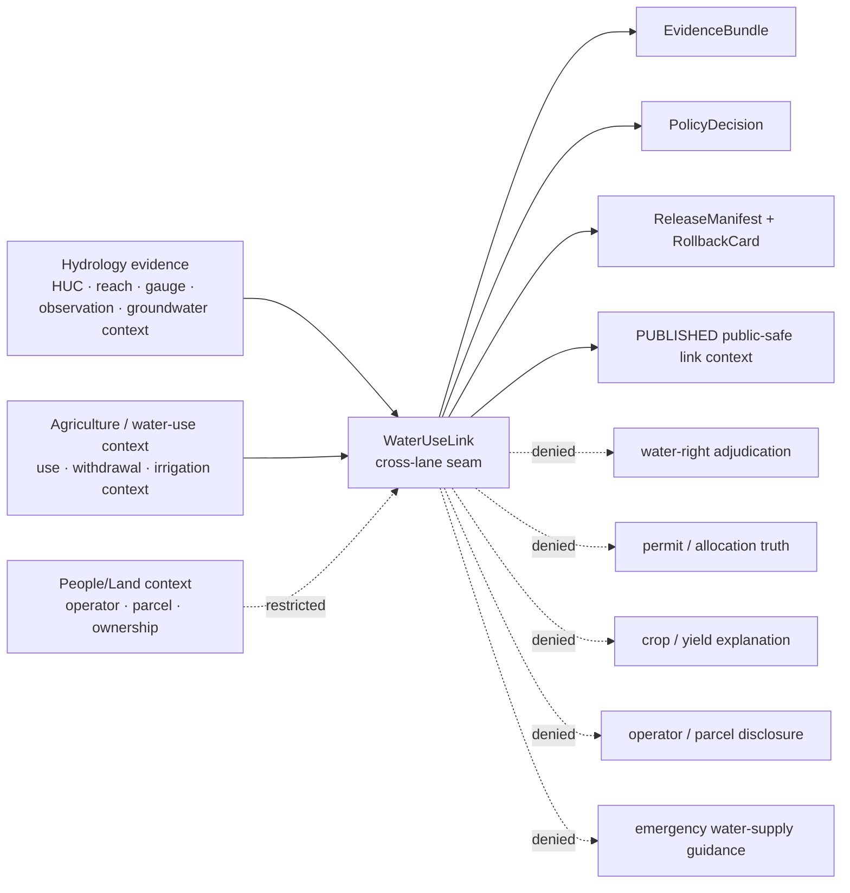
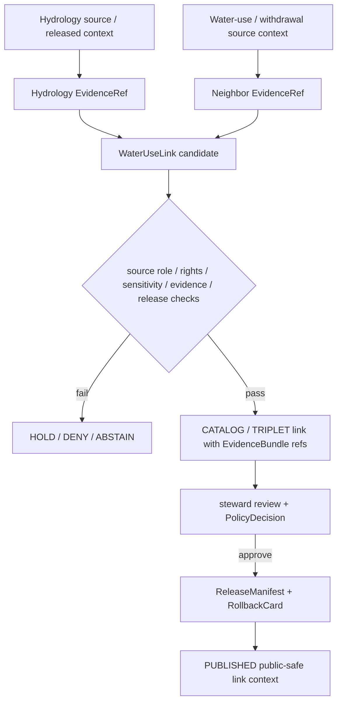

<!-- [KFM_META_BLOCK_V2]
doc_id: kfm://doc/contracts-domains-hydrology-water-use-link
title: Water Use Link Contract — Hydrology
type: semantic-contract
version: v0.2
status: draft; PROPOSED; schema-missing; cross-lane-link; NEEDS VERIFICATION before promotion
owners:
  - OWNER_TBD — Hydrology domain steward
  - OWNER_TBD — Agriculture seam steward
  - OWNER_TBD — Water-use / withdrawal source steward
  - OWNER_TBD — People/Land seam steward
  - OWNER_TBD — Contracts steward
  - OWNER_TBD — Source steward
  - OWNER_TBD — Evidence steward
  - OWNER_TBD — Schema steward
  - OWNER_TBD — Policy steward
  - OWNER_TBD — Release steward
  - OWNER_TBD — Docs steward
created: NEEDS VERIFICATION — scaffold existed before v0.2 expansion
updated: 2026-06-22
policy_label: public-with-gates; semantic-contract; hydrology; WaterUseLink; water-use; withdrawal-context; cross-lane-link; agriculture-seam; source-role-aware; rights-aware; sensitivity-aware; evidence-bound; release-gated; rollback-aware; not-water-rights-adjudication; not-withdrawal-truth; not-crop-yield-truth; not-operator-disclosure; not-life-safety
tags: [kfm, contracts, hydrology, WaterUseLink, water-use-link, cross-lane, agriculture, people-land, water-use, withdrawal, irrigation, HUCUnit, Watershed, ReachIdentity, GaugeSite, FlowObservation, WaterLevelObservation, GroundwaterWell, AquiferObservation, SourceDescriptor, EvidenceBundle, PolicyDecision, ReleaseManifest, RollbackCard]
related:
  - ./README.md
  - ./decision_envelope.md
  - ./domain_feature_identity.md
  - ./domain_layer_descriptor.md
  - ./domain_observation.md
  - ./domain_validation_report.md
  - ./evidence_bundle.md
  - ./huc_unit.md
  - ./watershed.md
  - ./reach_identity.md
  - ./gauge_site.md
  - ./flow_observation.md
  - ./water_level_observation.md
  - ./groundwater_well.md
  - ./aquifer_observation.md
  - ./irrigation_link.md
  - ./drought_link.md
  - ../../../docs/domains/hydrology/OBJECT_FAMILIES.md
  - ../../../docs/domains/hydrology/SOURCE_ROLE_MATRIX.md
  - ../../../docs/domains/hydrology/GLOSSARY.md
  - ../../../docs/domains/hydrology/BOUNDARY.md
  - ../../../docs/domains/hydrology/API_CONTRACTS.md
  - ../../../docs/domains/hydrology/README.md
  - ../../../docs/domains/hydrology/IDENTITY_MODEL.md
  - ../../../docs/domains/hydrology/FILE_SYSTEM_PLAN.md
  - ../../../docs/domains/agriculture/CROSS_LANE.md
  - ../../../docs/domains/agriculture/OBJECT_FAMILIES.md
  - ../../../docs/domains/agriculture/OBJECTS.md
  - ../../../schemas/contracts/v1/domains/hydrology/water_use_link.schema.json
  - ../../../policy/domains/hydrology/
  - ../../../policy/domains/agriculture/
  - ../../../fixtures/domains/hydrology/water_use_link/
  - ../../../tests/domains/hydrology/test_water_use_link.*
  - ../../../data/registry/sources/hydrology/
  - ../../../release/candidates/hydrology/
notes:
  - "Expanded from a thin scaffold at contracts/domains/hydrology/water_use_link.md."
  - "The exact paired schema path schemas/contracts/v1/domains/hydrology/water_use_link.schema.json was not found in this session. This document is semantic intent until schema, fixtures, validators, and policy gates exist."
  - "Hydrology docs define WaterUseLink as a link relating Hydrology to water-use/withdrawal context and explicitly keep crop, yield, and withdrawal claims outside Hydrology ownership."
  - "Agriculture cross-lane docs say Agriculture consumes Hydrology objects for irrigation, drought, and water-use context, but must not republish Hydrology canonical objects; field-level withdrawal/operator joins are deny-default."
[/KFM_META_BLOCK_V2] -->

# Water Use Link Contract — Hydrology

> Semantic contract for `WaterUseLink`: a Hydrology cross-lane seam object that relates released Hydrology context to water-use or withdrawal context while preserving source role, evidence, rights, sensitivity, temporal scope, release state, correction lineage, and rollback target.

  
  
  
  
  
  
  

`contracts/domains/hydrology/water_use_link.md`

## Quick jumps

[Status](#status) · [Meaning](#meaning) · [Repo fit](#repo-fit) · [Schema posture](#schema-posture) · [Boundary rule](#boundary-rule) · [Link semantics](#link-semantics) · [Assertions](#assertions) · [Exclusions](#exclusions) · [Recommended fields](#recommended-fields) · [Source-role rules](#source-role-rules) · [Temporal rules](#temporal-rules) · [Sensitivity and publication](#sensitivity-and-publication) · [Lifecycle](#lifecycle) · [Validation](#validation) · [Rollback](#rollback) · [Evidence basis](#evidence-basis) · [Open questions](#open-questions)

---

## Status

> [!IMPORTANT]
> **Status:** `draft` / semantic contract / cross-lane link  
> **Contract path:** `contracts/domains/hydrology/water_use_link.md`  
> **Expected Hydrology schema path:** `schemas/contracts/v1/domains/hydrology/water_use_link.schema.json`  
> **Schema posture:** exact paired schema was **not found** in this session. This contract is semantic intent until schema, fixtures, validators, and policy gates exist.  
> **Truth posture:** `WaterUseLink` is confirmed as a Hydrology/Agriculture seam term in inspected docs. Field-level schema, validator enforcement, fixtures, policy runtime, release artifacts, source registry activation, and public API behavior remain **NEEDS VERIFICATION**.

> [!CAUTION]
> `WaterUseLink` is a seam object, not a water right, withdrawal permit, allocation adjudication, crop-yield explanation, irrigation administration record, operator disclosure, parcel ownership claim, private-well disclosure, public layer, or emergency water-supply instruction.

---

## Meaning

`WaterUseLink` records a governed relationship between a Hydrology object and a water-use / withdrawal context object, source record, or cross-lane evidence reference.

It may link Hydrology context such as:

- `HUCUnit` or `Watershed` accounting geometry;
- `ReachIdentity`, `HydroFeature`, or public-safe network context;
- `GaugeSite`, `FlowObservation`, or `WaterLevelObservation` readings as cited context;
- `GroundwaterWell` or `AquiferObservation` only when policy permits public-safe use;
- `Hydrograph`, `UpstreamTrace`, or other released derived context;
- `EvidenceBundle`, `SourceDescriptor`, and `PolicyDecision` records that explain why the link may be used;

…to water-use or withdrawal context owned by Agriculture, source registry records, state water-office records, People/Land records, or another governed lane.

It does **not** claim that Hydrology owns water-use, withdrawal, crop, yield, permit, title, parcel, operator, or adjudication truth. It says: **this Hydrology object is related to this water-use context under these source roles, identity keys, evidence refs, time windows, caveats, sensitivity constraints, release state, correction lineage, and rollback conditions.**

---

## Repo fit

| Responsibility | Path or root | This contract's role |
|---|---|---|
| Human-readable Hydrology-side link meaning | `contracts/domains/hydrology/water_use_link.md` | This file; semantic contract for Hydrology's water-use seam. |
| Machine schema — Hydrology profile | `schemas/contracts/v1/domains/hydrology/water_use_link.schema.json` | Expected path, but not found in this session. |
| Hydrology contract root | `contracts/domains/hydrology/README.md` | Human-readable Hydrology object and seam meanings. |
| Hydrology object catalog | `docs/domains/hydrology/OBJECT_FAMILIES.md` | Treats `WaterUseLink` as a proposed cross-lane link object. |
| Hydrology glossary | `docs/domains/hydrology/GLOSSARY.md` | Defines `WaterUseLink` as a link relating Hydrology to water-use/withdrawal context. |
| Hydrology boundary doctrine | `docs/domains/hydrology/BOUNDARY.md` | Hydrology lends context across bounded seams without owning other lanes' claims. |
| Agriculture cross-lane doctrine | `docs/domains/agriculture/CROSS_LANE.md` | Agriculture consumes Hydrology objects for irrigation, drought, and water-use context; it must not republish Hydrology canonical truth. |
| Irrigation seam sibling | `contracts/domains/hydrology/irrigation_link.md` | Related but narrower irrigation-specific seam. |
| Drought seam sibling | `contracts/domains/hydrology/drought_link.md` | Related Atmosphere/Hazards seam. |
| Decision envelope | `contracts/domains/hydrology/decision_envelope.md` | Runtime finite outcomes for requests touching the link. |
| Feature identity | `contracts/domains/hydrology/domain_feature_identity.md` | Stable ID/spec_hash/source/time/digest companion. |
| Validation report | `contracts/domains/hydrology/domain_validation_report.md` | Gate record that should catch invalid link claims. |
| Evidence bundle | `contracts/domains/hydrology/evidence_bundle.md` | Evidence closure for public claims and release review. |
| Policy | `policy/domains/hydrology/`, `policy/domains/agriculture/` | Expected cross-lane, sensitivity, rights, release, and source-role gates. |
| Release | `release/candidates/hydrology/` and release roots | ReleaseManifest, PromotionDecision, CorrectionNotice, RollbackCard. |

---

## Schema posture

| Schema fact | Current posture |
|---|---|
| Hydrology expected schema path | `schemas/contracts/v1/domains/hydrology/water_use_link.schema.json` |
| Exact schema found? | **No** — direct fetch returned 404 and repository search did not find a paired schema. |
| Field-level enforcement | Missing / NEEDS VERIFICATION. |
| Contract promotion status | HOLD until schema, fixtures, validators, source descriptors, policy gates, release checks, and rollback records exist. |

This Markdown file defines intended meaning and review criteria. It must not be treated as machine validation or implementation proof.

---

## Boundary rule

`WaterUseLink` is a relationship object. It does not transfer ownership of claims across the seam.

Hydrology may supply water context. Agriculture, People/Land, state water-office records, or another owning lane retain authority over use, withdrawal, operator, parcel, allocation, permit, or crop/yield claims.

---

## Link semantics

A valid `WaterUseLink` claim should answer a bounded relationship question, such as:

- which Hydrology HUC/reach/gauge context is cited for a water-use context record;
- which public-safe Hydrology evidence supports a water-use map drawer or Focus Mode answer;
- which time window and source version constrain the link;
- which source roles are preserved on both sides;
- whether sensitivity, rights, or review gates allow public exposure;
- which correction or rollback path applies if either side changes.

A valid `WaterUseLink` claim must never answer:

- who owns the water right;
- whether a withdrawal is legally valid;
- how much a private operator used unless the source, rights, sensitivity, and policy gates explicitly allow release;
- whether a crop yield was caused by water use;
- whether a private well or parcel should be exposed;
- whether emergency water-supply action is required.

---

## Assertions

A reviewed `WaterUseLink` should assert:

1. **Hydrology anchor** — the Hydrology-side object resolves to released or reviewable Hydrology identity such as `HUCUnit`, `Watershed`, `ReachIdentity`, `GaugeSite`, observation, groundwater context, or derived context.
2. **Neighboring context** — the water-use / withdrawal-side reference is explicitly owned by its source, Agriculture, People/Land, state water-office record, or another governed lane.
3. **Source-role preservation** — observed, modeled, aggregate, administrative, regulatory, candidate, and synthetic roles are never upgraded by the link.
4. **Temporal alignment** — the link declares source time, observation/valid time where applicable, retrieval time, release time, and correction time without collapsing them.
5. **Evidence closure** — each side has EvidenceRefs that resolve to EvidenceBundles before public claims, exports, map drawers, or AI answers use the link.
6. **Rights and sensitivity** — withdrawal, operator, parcel, private-well, and exact-location risk gates are explicit and fail closed when unresolved.
7. **Bounded wording** — public surfaces describe the link as context, not adjudication, permit truth, crop-yield proof, or emergency instruction.
8. **Release separation** — ReleaseManifest and rollback target are required before public exposure.
9. **Correction lineage** — changes to either Hydrology context or water-use context cascade to the link and dependent downstream artifacts.
10. **AI subordination** — AI may explain the cited link, but cannot create the link or treat itself as evidence.

---

## Exclusions

| Misuse | Required outcome |
|---|---|
| Treating `WaterUseLink` as a water right, permit, allocation, or adjudication | `DENY`; owning legal/administrative authority must be cited separately. |
| Treating Hydrology context as Agriculture crop/yield truth | `DENY` unless a governed model and evidence chain explicitly support the derivative. |
| Treating observed flow or stage as a yield or use input without a model | `DENY` / `ABSTAIN`; observation remains context. |
| Re-publishing Hydrology observations as Agriculture canonical data | `DENY`; cross-lane consumers cite Hydrology EvidenceRefs. |
| Joining identifiable operator, parcel, private-well, or withdrawal records into public surfaces without policy review | `DENY` / generalize / redact / staged access. |
| Publishing candidate/unreleased water-use links | `DENY`; public clients use governed APIs and released artifacts. |
| Using AI summaries as evidence for water use | `DENY`; AI may explain cited evidence only. |
| Issuing drought, irrigation, water-supply, legal, emergency, or public-health instructions | `DENY`; KFM is not that authority. |

---

## Recommended fields

The following fields are **PROPOSED** targets for a future schema because the paired schema was not found in current repo evidence.

| Field | Meaning |
|---|---|
| `id` | Canonical KFM `WaterUseLink` ID. |
| `version` | Contract/object version. |
| `spec_hash` | Deterministic digest over normalized identity-bearing fields. |
| `domain` | Must resolve to `hydrology` for the Hydrology-side profile. |
| `object_type` | `WaterUseLink`. |
| `hydrology_ref` | Hydrology object ref: HUC, reach, gauge, observation, groundwater, hydrograph, upstream trace, or released layer. |
| `hydrology_object_type` | `HUCUnit`, `Watershed`, `ReachIdentity`, `GaugeSite`, `FlowObservation`, `WaterLevelObservation`, `GroundwaterWell`, `AquiferObservation`, `Hydrograph`, etc. |
| `water_use_ref` | Neighboring source, Agriculture, state-office, People/Land, or governed water-use/withdrawal context reference. |
| `water_use_owner_domain` | Owning lane/source for the water-use side. |
| `relationship_type` | Context relation such as `bounds`, `supports_context`, `co_occurs_with`, `summarizes_over`, `cites`, or controlled equivalent. |
| `join_key_type` | HUC, reach, gauge, aquifer, station, administrative unit, permit-area, public aggregate, or other controlled key. |
| `join_key_value` | Normalized join key value; exact format is schema work. |
| `spatial_scope` | HUC/reach/area/geometry scope or generalized scope. |
| `temporal_scope` | Window where the link is meaningful. |
| `source_role_hydrology` | Source role for the Hydrology-side evidence. |
| `source_role_water_use` | Source role for the neighboring water-use context. |
| `rights_status` | Rights/licensing posture for both sides. |
| `sensitivity_flags` | Operator, parcel, private-well, exact-withdrawal, exact-location, living-person, or other risk flags. |
| `generalization_ref` | Redaction/generalization transform when precise detail is withheld. |
| `evidence_refs` | EvidenceRefs for both sides of the link. |
| `policy_decision_ref` | PolicyDecision allowing, restricting, denying, or holding the link. |
| `release_manifest_ref` | ReleaseManifest proving public exposure is gated. |
| `rollback_ref` | RollbackCard or rollback target. |
| `limitations` | Caveats: context only, not water-right truth, not withdrawal proof, not crop-yield proof, not emergency instruction. |

---

## Source-role rules

| Basis | WaterUseLink posture | Discipline |
|---|---|---|
| Public HUC / watershed context | Allowed context basis. | Accounting geometry does not become withdrawal truth. |
| Reach / hydrography identity | Allowed context basis. | Preserve version and reach identity; ambiguous reach identity ABSTAINS. |
| Gauge observations | Allowed as cited Hydrology context. | Observed reading remains observed; not a yield/use input without explicit model. |
| Groundwater / aquifer context | Review-required where private-well or location risk appears. | Generalize, redact, stage, or deny when owner/parcel inference is possible. |
| State water-office records | May be observed, aggregate, administrative, or candidate depending on SourceDescriptor. | Role is fixed at admission and travels with the record. |
| Agriculture water-use context | Neighboring-lane context, not Hydrology truth. | Hydrology link must cite, not own, crop/yield/withdrawal claims. |
| People/Land or parcel/operator context | Restricted / deny-default. | Public exposure requires explicit review, rights, sensitivity transform, and release. |
| AI summaries | Not source truth. | Interpretive carrier only. |

---

## Temporal rules

A `WaterUseLink` may connect objects with different time semantics. Keep them separate:

| Time | Required treatment |
|---|---|
| `hydrology_observed_time` | Observed time for flow/stage/water-quality readings when used. |
| `hydrology_source_time` | Source version/publication time for Hydrology context. |
| `water_use_source_time` | Source publication/effective time for the water-use context. |
| `water_use_valid_time` | Permit/use/allocation/accounting validity interval when the owning source provides it. |
| `retrieval_time` | KFM retrieval/freeze time for each side. |
| `link_created_time` | When the link candidate was generated. |
| `release_time` | When KFM published a released link derivative. |
| `correction_time` | When either side or the link itself was corrected, withdrawn, or superseded. |

Do not use retrieval time as a substitute for observation time, permit/effective time, or release time.

---

## Sensitivity and publication

`WaterUseLink` is sensitivity-prone because water-use and withdrawal context can become operator-, parcel-, well-, or business-identifiable.

| Exposure pattern | Default posture |
|---|---|
| HUC-level or watershed-level public aggregate with released evidence | Public with context-only caveat. |
| Reach/gauge context linked to public aggregate water-use context | Public only if rights and caveats are explicit. |
| Field-level, parcel-level, private-well, or operator-linkable withdrawal context | DENY by default; staged access or redaction/generalization only after review. |
| Unknown rights or source terms | HOLD/DENY until SourceDescriptor and policy allow use. |
| Crop/yield causation claim | DENY unless a governed model, EvidenceBundle, PolicyDecision, and ReleaseManifest support the derivative. |
| Legal/adjudicative/permitting interpretation | DENY unless quoting an official released determination as external evidence with caveat. |
| Emergency water-supply guidance | DENY. KFM is not an alert authority. |

Public surfaces should use caveat language like:

> This is a released cross-lane context link between Hydrology evidence and water-use context. It is not a water-right decision, permit record, withdrawal proof, operator disclosure, crop-yield explanation, or emergency instruction.

---

## Lifecycle

Promotion is a governed state transition. Moving a link file, rendering a map layer, generating an AI summary, or joining two datasets does not publish the link.

---

## Validation

Minimum validation expectations before promotion:

| Gate | Required check |
|---|---|
| Schema | `water_use_link.schema.json` exists and defines required fields. |
| Hydrology ref | Hydrology-side object resolves and is eligible for the requested use. |
| Neighbor ref | Water-use/withdrawal context resolves to its owning source or lane. |
| Source role | Roles on both sides are preserved and not upgraded by the link. |
| Join keys | HUC/reach/gauge/aquifer/admin/public-aggregate keys are normalized and documented. |
| Rights | Both sides have clear rights/source terms for the proposed exposure. |
| Sensitivity | Operator, parcel, private-well, exact withdrawal, living-person, and exact-location risks are denied, redacted, generalized, or staged. |
| Evidence closure | EvidenceRefs resolve to EvidenceBundles. |
| Policy | PolicyDecision records allow/restrict/deny/hold outcome and obligations. |
| Release | ReleaseManifest, PromotionDecision, correction path, and RollbackCard exist before public exposure. |
| UI/API | Public DTOs include caveat, source roles, evidence, release state, sensitivity disposition, and finite outcome behavior. |

Negative fixtures should include at least:

- missing Hydrology ref;
- missing water-use owner/source ref;
- unresolved EvidenceRef;
- observed flow used as crop/yield proof without model;
- NFHL/regulatory context treated as observed flood or withdrawal truth;
- private-well or parcel/operator join exposed publicly;
- exact withdrawal record with unknown rights;
- candidate/unreleased link exposed to public client;
- AI summary used as evidence;
- missing rollback target;
- link framed as water-right, permit, allocation, adjudication, or emergency guidance.

---

## Rollback

A released `WaterUseLink` must be rollback-ready.

Rollback is required when:

- Hydrology-side object is corrected, withdrawn, or superseded;
- water-use / withdrawal-side source record is corrected, withdrawn, or found rights-restricted;
- source role on either side was misclassified;
- join key or spatial/temporal scope was wrong;
- operator, parcel, private-well, exact-withdrawal, or exact-location exposure violated policy;
- link wording implied water-right adjudication, withdrawal proof, crop-yield causation, or emergency guidance;
- public UI omitted context-only caveat;
- release occurred without rollback target.

Rollback must record:

| Rollback item | Required content |
|---|---|
| `rollback_ref` | Stable rollback target or RollbackCard ID. |
| `affected_release_manifest_ref` | ReleaseManifest being withdrawn, corrected, or superseded. |
| `affected_link_ref` | WaterUseLink object or public artifact affected. |
| `hydrology_ref` | Hydrology object affected. |
| `water_use_ref` | Water-use / withdrawal-side object or source ref affected. |
| `reason_code` | Source correction, rights change, role collapse, join-key error, sensitivity breach, wording error, evidence missing, or implementation error. |
| `replacement_ref` | Replacement link, correction notice, generalized/redacted version, or abstention record. |
| `public_notice_required` | Whether public correction notice is required. |

---

## Evidence basis

| Evidence | Supports | Limit |
|---|---|---|
| `contracts/domains/hydrology/water_use_link.md` scaffold | Target file already existed as a scaffold and needed authoritative content. | Scaffold had no semantic detail. |
| Missing `schemas/contracts/v1/domains/hydrology/water_use_link.schema.json` fetch/search | Paired schema was not found in current repo evidence. | Absence from search/fetch is not proof no alternate future home exists; schema home remains NEEDS VERIFICATION. |
| `docs/domains/hydrology/GLOSSARY.md` | Defines `WaterUseLink` as a link relating Hydrology to water-use/withdrawal context. | Does not define field-level schema. |
| `docs/domains/hydrology/OBJECT_FAMILIES.md` | Treats `WaterUseLink` as a proposed cross-lane link object; Hydrology does not own crop/yield/withdrawal claims. | Link-object family status remains OPEN/PROPOSED in that doc. |
| `docs/domains/hydrology/BOUNDARY.md` | Confirms Hydrology lends context across bounded seams and must not convert observed flow into crop-yield input without modeling. | Does not implement policy or UI gates. |
| `docs/domains/agriculture/CROSS_LANE.md` | Confirms Agriculture consumes Hydrology objects for irrigation, drought, and water-use context, must not republish Hydrology canonical truth, and field-level withdrawal/operator joins are deny-default. | Agriculture-side implementation remains PROPOSED/NEEDS VERIFICATION in that doc. |
| `contracts/domains/hydrology/irrigation_link.md` | Provides adjacent Hydrology cross-lane style and related irrigation seam constraints. | IrrigationLink is narrower than WaterUseLink and also lacks paired schema evidence. |

---

## Open questions

| ID | Question | Evidence needed | Status |
|---|---|---|---|
| OQ-HYD-WUL-01 | Should `WaterUseLink` be a first-class Hydrology object family, a link record only, or a Hydrology profile of an Agriculture-owned edge? | ADR or domain-steward decision. | OPEN / PROPOSED |
| OQ-HYD-WUL-02 | Where should `water_use_link.schema.json` live, and should Agriculture have a paired schema/profile? | Schema home decision and migration note. | OPEN / NEEDS VERIFICATION |
| OQ-HYD-WUL-03 | Which join keys are allowed for the first proof slice: HUC, reach, gauge, aquifer, public aggregate, permit-area, or other key? | Schema + fixtures + policy. | OPEN / NEEDS VERIFICATION |
| OQ-HYD-WUL-04 | What source-role profiles are allowed for state water-office records: observed, aggregate, administrative, candidate, or mixed profiles? | SourceDescriptor profiles and source registry. | OPEN / NEEDS VERIFICATION |
| OQ-HYD-WUL-05 | What redaction/generalization is required for field-level withdrawal, private wells, parcels, operators, and exact-location joins? | Policy profile + redaction fixtures. | OPEN / NEEDS VERIFICATION |
| OQ-HYD-WUL-06 | Which public DTO fields must appear in feature drawers and Focus Mode answers? | API/UI contract + policy tests. | OPEN / NEEDS VERIFICATION |

---

## Definition of done

This contract can move beyond draft only when:

- the accepted schema home exists and defines required fields;
- valid and invalid fixtures exist;
- source descriptors exist for the Hydrology and water-use/withdrawal source families used by the first slice;
- validators prove source-role preservation, join-key validity, rights posture, sensitivity disposition, and evidence closure;
- policy gates deny water-right, permit, withdrawal-proof, crop-yield, operator/parcel/private-well disclosure, and emergency-guidance misuse;
- public UI/API surfaces show context-only caveat, source roles, evidence, release state, sensitivity disposition, and finite outcome behavior;
- release and rollback artifacts exist for the first public-safe link derivative;
- Hydrology, Agriculture, People/Land, schema, policy, fixtures, and tests agree on the WaterUseLink boundary.

[Back to top](#top)
