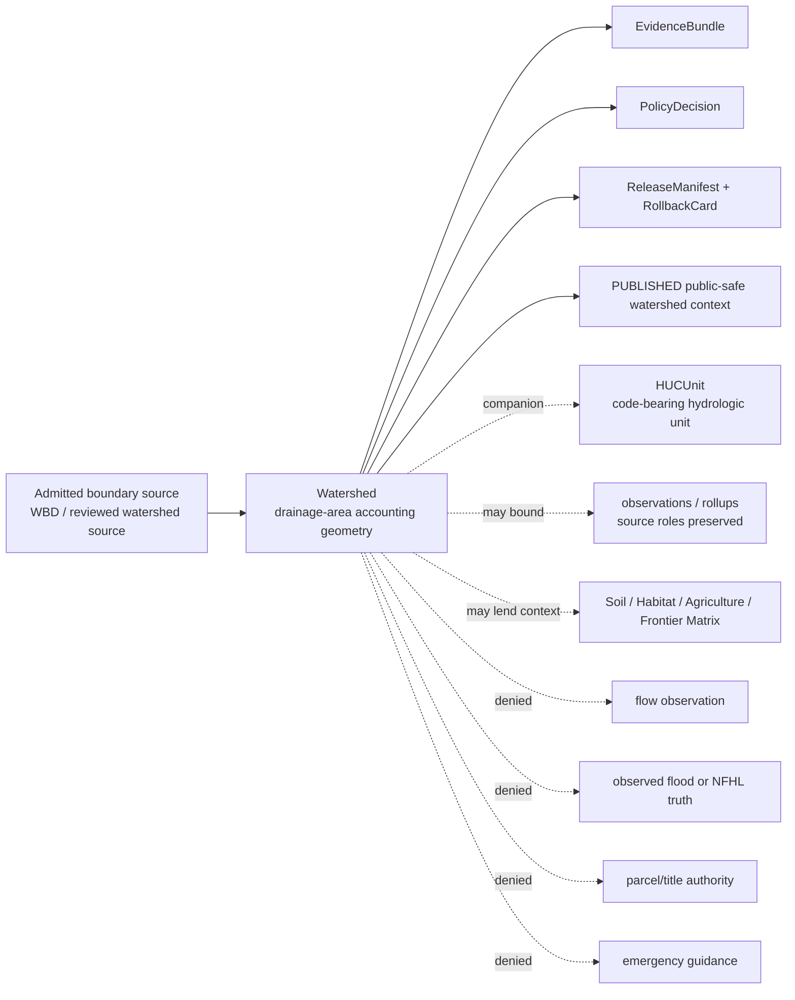
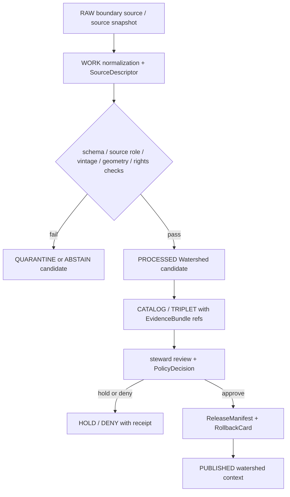

<!-- [KFM_META_BLOCK_V2]
doc_id: kfm://doc/contracts-domains-hydrology-watershed
title: Watershed Contract — Hydrology
type: semantic-contract
version: v0.2
status: draft; PROPOSED; schema-scaffold; NEEDS VERIFICATION before promotion
owners:
  - OWNER_TBD — Hydrology domain steward
  - OWNER_TBD — Watershed/HUC steward
  - OWNER_TBD — Spatial foundation steward
  - OWNER_TBD — Contracts steward
  - OWNER_TBD — Source steward
  - OWNER_TBD — Evidence steward
  - OWNER_TBD — Schema steward
  - OWNER_TBD — Policy steward
  - OWNER_TBD — Release steward
  - OWNER_TBD — Docs steward
created: NEEDS VERIFICATION — scaffold existed before v0.2 expansion
updated: 2026-06-22
policy_label: public-with-gates; semantic-contract; hydrology; watershed; drainage-area; accounting-geometry; authority-context; vintage-aware; evidence-bound; release-gated; rollback-aware; not-observation; not-regulatory-flood-zone; not-emergency-guidance
tags: [kfm, contracts, hydrology, Watershed, watershed, drainage-area, WBD, HUC, HUCUnit, huc-nesting, wbd_snapshot, outlet, accounting-geometry, source-role, authority-context, aggregate, EvidenceBundle, ReleaseManifest, RollbackCard]
related:
  - ./README.md
  - ./decision_envelope.md
  - ./domain_feature_identity.md
  - ./domain_layer_descriptor.md
  - ./domain_observation.md
  - ./domain_validation_report.md
  - ./evidence_bundle.md
  - ./huc_unit.md
  - ./hydro_feature.md
  - ./reach_identity.md
  - ./flow_observation.md
  - ./water_level_observation.md
  - ./water_quality_observation.md
  - ./nfhl_zone.md
  - ./observed_flood_event.md
  - ./hydrograph.md
  - ./upstream_trace.md
  - ./water_use_link.md
  - ./drought_link.md
  - ./irrigation_link.md
  - ../../../docs/domains/hydrology/OBJECT_FAMILIES.md
  - ../../../docs/domains/hydrology/GLOSSARY.md
  - ../../../docs/domains/hydrology/SOURCE_ROLE_MATRIX.md
  - ../../../docs/domains/hydrology/BOUNDARY.md
  - ../../../docs/domains/hydrology/API_CONTRACTS.md
  - ../../../docs/domains/hydrology/README.md
  - ../../../docs/domains/hydrology/IDENTITY_MODEL.md
  - ../../../docs/domains/hydrology/CANONICAL_PATHS.md
  - ../../../schemas/contracts/v1/domains/hydrology/watershed.schema.json
  - ../../../policy/domains/hydrology/
  - ../../../fixtures/domains/hydrology/watershed/
  - ../../../tests/domains/hydrology/test_watershed.*
  - ../../../data/registry/sources/hydrology/
  - ../../../release/candidates/hydrology/
notes:
  - "Expanded from a thin scaffold at contracts/domains/hydrology/watershed.md."
  - "The paired schema exists at schemas/contracts/v1/domains/hydrology/watershed.schema.json, but current evidence shows it is still a PROPOSED scaffold with empty properties and additionalProperties=true."
  - "Hydrology object-family doctrine defines Watershed as a drainage area whose surface flow converges to a common outlet, with typical identity anchor WBD snapshot + HUC nesting."
  - "Watershed is accounting/context geometry. It is not an observed reading, NFHL regulatory flood zone, observed flood extent, modeled hydrograph, parcel/title claim, crop/yield claim, or emergency guidance."
[/KFM_META_BLOCK_V2] -->

# Watershed Contract — Hydrology

> Semantic contract for `Watershed`: a Hydrology accounting-geometry object representing a drainage area whose surface flow converges to a common outlet, with source vintage, outlet reference, hierarchy, evidence support, release state, correction lineage, and rollback target kept inspectable.

  
  
  
  
  
  
  

`contracts/domains/hydrology/watershed.md`

## Quick jumps

[Status](#status) · [Meaning](#meaning) · [Repo fit](#repo-fit) · [Schema posture](#schema-posture) · [Watershed boundaries](#watershed-boundaries) · [Assertions](#assertions) · [Exclusions](#exclusions) · [Recommended fields](#recommended-fields) · [Source-role rules](#source-role-rules) · [Temporal and vintage rules](#temporal-and-vintage-rules) · [Evidence and citation posture](#evidence-and-citation-posture) · [Sensitivity and publication](#sensitivity-and-publication) · [Lifecycle](#lifecycle) · [Validation](#validation) · [Rollback](#rollback) · [Evidence basis](#evidence-basis) · [Open questions](#open-questions)

---

## Status

> [!IMPORTANT]
> **Status:** `draft` / semantic contract  
> **Contract path:** `contracts/domains/hydrology/watershed.md`  
> **Schema path:** `schemas/contracts/v1/domains/hydrology/watershed.schema.json`  
> **Schema posture:** paired schema exists, but remains a `PROPOSED` scaffold with empty `properties` and `additionalProperties: true`.  
> **Truth posture:** Hydrology docs define `Watershed` as a drainage area whose surface flow converges to a common outlet, with typical identity anchor `WBD snapshot + HUC nesting`. Field-level schema shape, validators, fixtures, policy enforcement, emitted EvidenceBundles, release manifests, and public API behavior remain **NEEDS VERIFICATION**.

> [!CAUTION]
> `Watershed` is accounting/context geometry. It is not an observed reading, not a regulatory flood-zone determination, not observed inundation, not a modeled hydrograph, not parcel/title authority, not a crop/yield claim, and not emergency or life-safety guidance.

---

## Meaning

`Watershed` represents a drainage area whose surface flow converges toward a common outlet or outlet context. Hydrology uses it as an accounting, aggregation, filtering, map-context, cross-domain alignment, and public-safe geography object.

It may describe:

- a named or source-defined drainage area;
- an outlet reference or downstream convergence context;
- parent/child watershed or HUC nesting;
- area, geometry, and source vintage;
- WBD snapshot or equivalent watershed boundary source lineage;
- rollups or released derivatives that summarize observations, drought links, water-use links, habitat/agriculture context, or Frontier Matrix cells by watershed.

`Watershed` overlaps with `HUCUnit` but is not identical to it. `HUCUnit` is the explicit Watershed Boundary Dataset hydrologic-unit code object. `Watershed` is the broader drainage-area/accounting concept that may use HUC nesting, WBD snapshots, outlets, or other reviewed source lineage.

It must remain distinct from:

- `HUCUnit`, the code-bearing hydrologic unit object;
- `HydroFeature` and `ReachIdentity`, which describe network/flowline features;
- `GaugeSite`, which is a monitoring-location identity;
- `FlowObservation`, `WaterLevelObservation`, and `WaterQualityObservation`, which are observed readings;
- `NFHLZone` / `FloodContext`, which are regulatory/context flood objects;
- `ObservedFloodEvent`, which is historical/observed inundation evidence;
- `Hydrograph`, `UpstreamTrace`, and cross-domain links, which are derived/contextual objects.

---

## Repo fit

| Responsibility | Path or root | This contract's role |
|---|---|---|
| Human-readable object meaning | `contracts/domains/hydrology/watershed.md` | This file; semantic contract for `Watershed`. |
| Machine schema | `schemas/contracts/v1/domains/hydrology/watershed.schema.json` | Confirmed scaffold; full field shape is not enforced yet. |
| HUC companion | `contracts/domains/hydrology/huc_unit.md` | Code-bearing Watershed Boundary Dataset hydrologic-unit companion. |
| Contract root | `contracts/domains/hydrology/README.md` | Directory root and object-family boundaries. |
| Feature identity | `contracts/domains/hydrology/domain_feature_identity.md` | Stable ID/spec_hash/source/time/digest companion. |
| Layer descriptor | `contracts/domains/hydrology/domain_layer_descriptor.md` | Public delivery descriptor; not watershed truth. |
| Evidence bundle | `contracts/domains/hydrology/evidence_bundle.md` | Evidence support for watershed boundary/lineage claims. |
| Validation report | `contracts/domains/hydrology/domain_validation_report.md` | Gate report proving geometry/source-role/vintage/release readiness. |
| Object catalog | `docs/domains/hydrology/OBJECT_FAMILIES.md` | Defines Watershed purpose, identity anchor, attributes, and sensitivity posture. |
| Glossary | `docs/domains/hydrology/GLOSSARY.md` | Defines Watershed and HUCUnit discipline. |
| Source-role matrix | `docs/domains/hydrology/SOURCE_ROLE_MATRIX.md` | Defines WBD/HUC role posture and object-family role basis. |
| Boundary doctrine | `docs/domains/hydrology/BOUNDARY.md` | Defines Hydrology ownership and cross-lane context seams. |
| Policy | `policy/domains/hydrology/` | Expected public exposure, role, release, sensitivity, and cross-lane gates. |
| Release | `release/candidates/hydrology/` and release roots | ReleaseManifest, CorrectionNotice, RollbackCard, and promotion decisions. |

---

## Schema posture

| Schema fact | Current posture |
|---|---|
| Confirmed schema path | `schemas/contracts/v1/domains/hydrology/watershed.schema.json` |
| Schema status | `PROPOSED` |
| Schema title | `Watershed` |
| Visible properties | Empty object |
| Required fields | None visible in scaffold |
| Additional properties | `true` |
| Field-level enforcement | Missing / NEEDS VERIFICATION |

This Markdown contract defines intended meaning and review criteria. It does not prove that a validator, fixture suite, API, tile service, or Focus Mode surface enforces the rules.

---

## Watershed boundaries

A valid `Watershed` claim says: **this drainage-area geometry/hierarchy/outlet context came from this admitted source and vintage, with evidence, role, policy posture, release state, and rollback path inspectable.**

A valid `Watershed` claim must never say: **this is a direct flow/stage measurement, observed flood extent, regulatory flood determination, legal boundary, parcel/title truth, crop-yield explanation, or emergency instruction.**

---

## Assertions

A reviewed `Watershed` should assert:

1. **Drainage-area identity** — stable object ID and `spec_hash` over source, object role, temporal/vintage scope, geometry or source-native identifier, outlet reference, and normalized digest.
2. **Source lineage** — source descriptor, WBD snapshot or equivalent source vintage, retrieval time, rights posture, and source limitations recorded.
3. **Outlet / convergence context** — outlet reference or downstream convergence context present when source supports it; otherwise marked unavailable rather than invented.
4. **Hierarchy** — parent/child HUC or watershed nesting preserved where the source provides it.
5. **Geometry discipline** — geometry/projection/generalization must be source-aware and must not be treated as the Spatial Foundation truth system.
6. **Vintage discipline** — WBD/source snapshots must not be silently mixed across public products or joins.
7. **Role preservation** — watershed boundary/context role stays authority/context or aggregate unit support; it is not upgraded into observation, regulation, model, or legal truth by promotion.
8. **Evidence closure** — EvidenceRefs resolve to EvidenceBundles before public claims, exports, AI answers, or map drawers treat the watershed as authoritative context.
9. **Cross-lane context** — Soil, Habitat/Fauna/Flora, Agriculture, Hazards, Settlements/Infrastructure, and Frontier Matrix may consume public-safe watershed context without taking Hydrology ownership.
10. **Release separation** — ReleaseManifest and rollback target required for public surfaces.
11. **Correction lineage** — boundary, vintage, hierarchy, outlet, or geometry corrections cascade to dependent rollups, links, tiles, and answers.

---

## Exclusions

| Misuse | Required outcome |
|---|---|
| Treating a watershed boundary as a streamflow/stage/water-quality observation | `DENY`; use observation families. |
| Treating a watershed as NFHL regulatory flood context | `DENY`; use `NFHLZone` / `FloodContext`. |
| Treating a watershed as observed flood extent | `DENY`; use `ObservedFloodEvent` with observed evidence. |
| Treating watershed geometry as parcel/title or legal ownership boundary | `DENY`; People/Land or official legal source owns that context. |
| Treating a watershed rollup as individual-record fidelity | `DENY` or `ABSTAIN`; aggregate role must be preserved. |
| Mixing WBD/source vintages without explicit mapping or caveat | `ABSTAIN` / validation `FAIL`. |
| Joining sensitive ecology, private wells, or exact-asset context without owning-lane policy | `DENY` / generalize / redact / staged access. |
| Publishing RAW/WORK/QUARANTINE watershed candidates to public clients | `DENY`; public clients use governed APIs and released artifacts. |
| Using AI summary as evidence for watershed identity or geometry | `DENY`; AI may explain cited evidence, not replace it. |
| Issuing emergency, legal, regulatory, title, or water-supply instructions from a watershed context | `DENY`. |

---

## Recommended fields

The following fields are **PROPOSED** targets for future schema expansion. The current schema scaffold does not enforce them yet.

| Field | Meaning |
|---|---|
| `id` | Canonical KFM `Watershed` ID. |
| `version` | Contract/object version. |
| `spec_hash` | Deterministic digest over normalized identity-bearing fields. |
| `domain` | Must resolve to `hydrology`. |
| `object_type` | `Watershed`. |
| `source_ref` | SourceDescriptor or EvidenceRef for admitted boundary source. |
| `source_role` | Authority/context or aggregate-support role as admitted; exact enum realization NEEDS VERIFICATION. |
| `source_family` | WBD, HUC source, or steward-approved watershed boundary source. |
| `wbd_snapshot` | WBD/source snapshot, vintage, or source version discriminator. |
| `watershed_id` | Source-native watershed identifier where applicable. |
| `name` | Source-provided watershed name. |
| `outlet_ref` | Outlet, pour point, reach, or downstream convergence reference where source supports it. |
| `huc_refs` | Related HUCUnit references when the watershed is tied to HUC nesting. |
| `parent_ref` | Parent watershed/HUC reference. |
| `child_refs` | Child watershed/HUC references. |
| `area` | Area value with unit and source. |
| `geometry_ref` | Geometry storage/reference, not inline truth by default. |
| `crs_ref` | Coordinate reference system / GeographyVersion reference where applicable. |
| `generalization_ref` | Public geometry simplification/redaction transform when used. |
| `temporal_scope` | Vintage/valid window for boundary use, if source provides one. |
| `retrieval_time` | KFM retrieval/freeze time. |
| `release_time` | Governed KFM release time. |
| `correction_time` | Supersession/correction time, if applicable. |
| `evidence_refs` | EvidenceRefs required for public claims. |
| `policy_decision_ref` | PolicyDecision allowing, restricting, denying, or holding the watershed. |
| `release_manifest_ref` | ReleaseManifest proving public exposure is gated. |
| `rollback_ref` | RollbackCard or rollback target. |
| `limitations` | Caveats: vintage-bound, context geometry, not observation, not flood authority, not legal boundary. |

---

## Source-role rules

| Basis | Watershed posture | Discipline |
|---|---|---|
| USGS WBD / HUC source | Allowed authority/context boundary basis. | Preserve WBD snapshot/vintage and HUC nesting. |
| Aggregate unit rollups | Allowed as aggregate support. | Rollups do not preserve individual-record fidelity. |
| NHDPlus / 3DHP network context | Related but separate network basis. | Use `HydroFeature` or `ReachIdentity` for network/flowline identity. |
| Gauge observations | Context that may be aggregated by watershed. | Observed readings remain observations; watershed is not the reading. |
| NFHL / FEMA flood data | Not watershed truth. | Regulatory flood context belongs to `NFHLZone` / `FloodContext`. |
| Soil / Agriculture / Habitat joins | Downstream consuming contexts. | Owning lanes retain their canonical truth and policy gates. |
| Spatial Foundation CRS/base layers | Infrastructure dependency. | Hydrology consumes CRS/geography version; it does not redefine shared spatial authority. |
| AI summaries | Not source truth. | Interpretive carrier only. |

---

## Temporal and vintage rules

`Watershed` is source-vintage sensitive. These times and versions must stay distinct:

| Time/version | Required treatment |
|---|---|
| `wbd_snapshot` / source vintage | Required when boundary source is WBD or snapshot-based. |
| `source_time` | Source publication/effective/update time, where provided. |
| `temporal_scope` | Boundary validity or use window, when source declares one. |
| `retrieval_time` | When KFM retrieved/froze the source payload. Does not replace source time or snapshot. |
| `release_time` | When KFM published a released watershed derivative. |
| `correction_time` | When boundary, hierarchy, area, outlet, or source lineage was corrected, withdrawn, or superseded. |

Do not silently mix WBD/source vintages in the same public layer, rollup, or cross-lane join. If a crosswalk is required, it must be explicit, cited, validated, and rollback-ready.

---

## Evidence and citation posture

A public `Watershed` surface must expose or resolve:

- SourceDescriptor with source role, rights, cadence, and limitations;
- source-native identifier/name, WBD/source snapshot, and hierarchy where available;
- outlet reference or explicit unavailable marker where needed;
- geometry/projection/generalization reference;
- EvidenceBundle or EvidenceRef closure;
- PolicyDecision with finite outcome;
- ReleaseManifest for public exposure;
- rollback target and correction lineage.

Public answers or map drawers should use language like:

> This watershed is released Hydrology accounting/context geometry from the cited source and snapshot. It is not a gauge observation, observed flood extent, regulatory flood determination, legal boundary, crop/yield claim, or emergency instruction.

---

## Sensitivity and publication

`Watershed` is generally public-safe as contextual accounting geometry, but publication still requires source, version, geometry, and downstream-join review.

| Exposure pattern | Default posture |
|---|---|
| Released watershed geometry from public WBD/source snapshot | Public with vintage/source caveat. |
| Watershed-level aggregates with released evidence | Public if aggregate role and source limitations are visible. |
| Mixed-vintage watershed layers | HOLD until crosswalk/transform is explicit and reviewed. |
| Watershed joined to sensitive habitat/flora/fauna occurrences | Owning ecological lane controls redaction/generalization; sensitive occurrences fail closed. |
| Watershed joined to exact infrastructure/asset exposure | Review-required; exact-asset exposure may be staged-access. |
| Watershed joined to private wells, parcels, operators, or living-person data | DENY by default unless policy permits staged/redacted access. |
| Emergency, legal, flood-regulatory, crop-yield, or water-supply instruction | DENY. |

---

## Lifecycle

Promotion is a governed state transition. A boundary file, geometry tile, graph projection, rollup, vector index, or AI answer does not become canonical watershed truth by existing.

---

## Validation

Minimum validation expectations before promotion:

| Gate | Required check |
|---|---|
| Schema | `watershed.schema.json` defines required fields and validates valid/invalid fixtures. |
| Source role | Boundary/context and aggregate support roles are preserved. |
| Source lineage | SourceDescriptor, WBD/source snapshot, retrieval time, and rights posture resolve. |
| Identity | Source-native watershed ID, name, outlet, hierarchy, or HUC refs resolve as applicable. |
| Geometry | Geometry reference, CRS/GeographyVersion, area/unit, and generalization transform are explicit. |
| Vintage discipline | Mixed WBD/source vintages fail closed unless explicitly crosswalked. |
| Evidence closure | EvidenceRefs resolve to EvidenceBundles. |
| Policy | PolicyDecision records release, caveats, restrictions, or denial. |
| Release | ReleaseManifest, PromotionDecision, correction path, and RollbackCard exist before public exposure. |
| UI/API | Public DTOs include source, snapshot/vintage, hierarchy/outlet caveat, evidence, release state, and finite outcome behavior. |

Negative fixtures should include at least:

- missing source snapshot/vintage;
- missing source descriptor;
- geometry with unknown CRS;
- HUC nesting conflict;
- mixed-vintage input without crosswalk;
- watershed presented as observation, NFHL/regulatory zone, observed flood event, or emergency guidance;
- aggregate watershed rollup presented as individual-record truth;
- unresolved EvidenceRef;
- unreleased candidate watershed exposed to public client;
- sensitive ecological/private-well/asset join exposed without policy transform;
- AI-generated summary used as boundary evidence.

---

## Rollback

A released `Watershed` must be rollback-ready.

Rollback is required when:

- source boundary, WBD snapshot, hierarchy, outlet, area, or geometry is corrected;
- source version/vintage was misdeclared or mixed silently;
- CRS/generalization transform was wrong;
- watershed was used as observation, flood authority, legal boundary, or emergency guidance;
- aggregate role was hidden and users could infer individual-record fidelity;
- sensitive downstream join exposed more than policy allows;
- evidence closure was missing;
- public UI omitted source/snapshot/vintage caveat;
- release occurred without rollback target.

Rollback must record:

| Rollback item | Required content |
|---|---|
| `rollback_ref` | Stable rollback target or RollbackCard ID. |
| `affected_release_manifest_ref` | ReleaseManifest being withdrawn, corrected, or superseded. |
| `affected_watershed_ref` | Watershed object or public artifact affected. |
| `reason_code` | Source correction, vintage error, geometry error, CRS error, hierarchy error, role collapse, sensitive join, evidence missing, or implementation error. |
| `replacement_ref` | Replacement watershed, correction notice, generalized version, or abstention record. |
| `public_notice_required` | Whether public correction notice is required. |

---

## Evidence basis

| Evidence | Supports | Limit |
|---|---|---|
| `contracts/domains/hydrology/watershed.md` scaffold | Target file already existed as a scaffold and needed authoritative content. | Scaffold had no semantic detail. |
| `schemas/contracts/v1/domains/hydrology/watershed.schema.json` | Paired schema exists. | Current schema is a PROPOSED scaffold with empty properties and permissive additionalProperties. |
| `docs/domains/hydrology/GLOSSARY.md` | Defines Watershed as a drainage area whose surface flow converges to a common outlet; notes accounting geometry and vintage sensitivity. | Field realization is PROPOSED. |
| `docs/domains/hydrology/OBJECT_FAMILIES.md` | Defines Watershed purpose, typical identity anchor, attributes, and public-safe authority/context role. | Does not prove runtime/schema implementation. |
| `docs/domains/hydrology/SOURCE_ROLE_MATRIX.md` | Confirms WBD/HUC role basis and Watershed/HUC aggregate-support posture. | Role enum implementation and policy enforcement need schema/policy confirmation. |
| `docs/domains/hydrology/BOUNDARY.md` | Confirms Hydrology owns Watershed/HUCUnit and lends context to downstream lanes while not owning other-domain truth or emergency authority. | Does not implement UI/API gates. |
| `contracts/domains/hydrology/huc_unit.md` | Existing adjacent contract establishes local style and the distinction between HUCUnit and broader watershed context. | Does not prove Watershed schema maturity. |

---

## Open questions

| ID | Question | Evidence needed | Status |
|---|---|---|---|
| OQ-HYD-WS-01 | Which fields are mandatory for the first schema version? | Schema steward decision + fixtures. | OPEN / NEEDS VERIFICATION |
| OQ-HYD-WS-02 | How should `Watershed` and `HUCUnit` differ in schema and public DTOs? | Schema profiles + API contract. | OPEN / NEEDS VERIFICATION |
| OQ-HYD-WS-03 | Which source snapshots/vintages are accepted for the first public-safe proof slice? | Source registry and release manifest. | OPEN / NEEDS VERIFICATION |
| OQ-HYD-WS-04 | What geometry simplification/generalization is required for public maps? | Spatial Foundation policy + geometry fixtures. | OPEN / NEEDS VERIFICATION |
| OQ-HYD-WS-05 | How are outlet references represented when source data lacks a stable outlet identifier? | Schema + validation fixtures. | OPEN / NEEDS VERIFICATION |
| OQ-HYD-WS-06 | Which public DTO fields must appear in map feature drawers and Focus Mode answers? | API/UI contract + policy tests. | OPEN / NEEDS VERIFICATION |

---

## Definition of done

This contract can move beyond draft only when:

- the schema defines required fields and no longer permits unconstrained objects;
- valid and invalid fixtures exist;
- source descriptors exist for active watershed/WBD source families;
- validators prove source-role preservation, source vintage discipline, identity/hierarchy checks, geometry/CRS handling, and mixed-vintage fail-closed behavior;
- policy gates deny observation/regulatory/emergency/legal/crop-yield/source-role collapse and unsupported public claims;
- public UI/API surfaces show source, snapshot/vintage, hierarchy/outlet caveat, evidence, release state, and finite outcome behavior;
- release and rollback artifacts exist for the first public-safe watershed derivative;
- docs, schema, policy, fixtures, and tests agree on the Watershed boundary.

[Back to top](#top)
