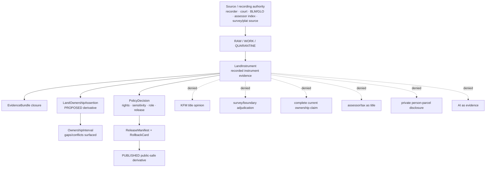
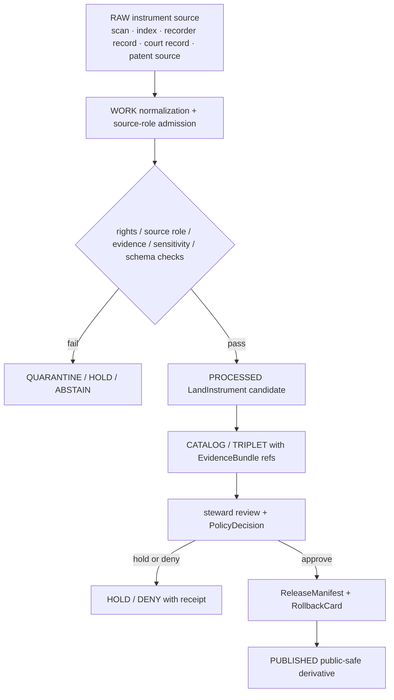

<!-- [KFM_META_BLOCK_V2]
doc_id: kfm://doc/contracts-domains-people-dna-land-land-instrument
title: LandInstrument Contract — People / DNA / Land
type: semantic-contract
version: v0.2
status: draft; PROPOSED; schema-missing; title-sensitive; NEEDS VERIFICATION before promotion
owners:
  - OWNER_TBD — People/DNA/Land domain steward
  - OWNER_TBD — Land/title assertion steward
  - OWNER_TBD — Land records source steward
  - OWNER_TBD — Parcel/legal-description steward
  - OWNER_TBD — Contracts steward
  - OWNER_TBD — Source steward
  - OWNER_TBD — Evidence steward
  - OWNER_TBD — Schema steward
  - OWNER_TBD — Policy steward
  - OWNER_TBD — Release steward
  - OWNER_TBD — Docs steward
created: NEEDS VERIFICATION — scaffold existed before v0.2 expansion
updated: 2026-06-22
policy_label: restricted-review; title-sensitive; land-instrument; evidence-bound; source-role-aware; parcel-sensitive; person-parcel-deny-default; release-gated; rollback-aware; not-title-opinion; not-legal-advice
tags: [kfm, contracts, people-dna-land, LandInstrument, land-instrument, deed, title-instrument, patent, mortgage, lien, easement, lease, probate, mineral, water, access, legal-description, parcel-version, land-ownership-assertion, ownership-interval, EvidenceBundle, SourceDescriptor, PolicyDecision, ReleaseManifest, RollbackCard]
related:
  - ./land-ownership/README.md
  - ./people/README.md
  - ./genealogy/README.md
  - ../../../docs/domains/people-dna-land/LAND_OWNERSHIP.md
  - ../../../docs/domains/people-dna-land/CHAIN_OF_TITLE_NOTES.md
  - ../../../docs/domains/people-dna-land/sublanes/land_ownership.md
  - ../../../docs/domains/people-dna-land/SCOPE_AND_BOUNDARY.md
  - ../../../docs/domains/people-dna-land/CANONICAL_PATHS.md
  - ../../../docs/domains/people-dna-land/SENSITIVITY_PROFILE.md
  - ../../../docs/domains/people-dna-land/IDENTITY_MODEL.md
  - ../../../docs/domains/people-dna-land/SOURCE_REGISTRY.md
  - ../../../schemas/contracts/v1/domains/people-dna-land/LandInstrument.schema.json
  - ../../../policy/domains/people-dna-land/
  - ../../../fixtures/domains/people-dna-land/
  - ../../../tests/domains/people-dna-land/
  - ../../../release/candidates/people-dna-land/
notes:
  - "Expanded from a thin scaffold at contracts/domains/people-dna-land/LandInstrument.md."
  - "The expected paired schema path schemas/contracts/v1/domains/people-dna-land/LandInstrument.schema.json was not found in this session; field-level enforcement is NEEDS VERIFICATION."
  - "This document preserves the existing PascalCase filename because that is the current target path. It does not settle naming conventions for future contract files."
  - "LandInstrument is evidence of a recorded instrument and its source/recording context. It is not, by itself, a title opinion, complete chain of title, marketable-title determination, survey boundary, or legal advice."
[/KFM_META_BLOCK_V2] -->

# LandInstrument Contract — People / DNA / Land

> Semantic contract for `LandInstrument`: a recorded or source-attested instrument affecting land interests, title context, encumbrances, access, mineral/water rights, probate succession, or related land-record meaning — represented as evidence, not as KFM-issued title truth.

  
  
  
  
  
  
  
  

`contracts/domains/people-dna-land/LandInstrument.md`

## Quick jumps

[Status](#status) · [Meaning](#meaning) · [Repo fit](#repo-fit) · [Schema posture](#schema-posture) · [Authority boundaries](#authority-boundaries) · [Instrument families](#instrument-families) · [Assertions](#assertions) · [Exclusions](#exclusions) · [Recommended fields](#recommended-fields) · [Source-role rules](#source-role-rules) · [Temporal rules](#temporal-rules) · [Evidence and citation posture](#evidence-and-citation-posture) · [Sensitivity and publication](#sensitivity-and-publication) · [Lifecycle](#lifecycle) · [Validation](#validation) · [Rollback](#rollback) · [Evidence basis](#evidence-basis) · [Open questions](#open-questions)

---

## Status

> [!IMPORTANT]
> **Status:** `draft` / semantic contract  
> **Contract path:** `contracts/domains/people-dna-land/LandInstrument.md`  
> **Expected schema path checked:** `schemas/contracts/v1/domains/people-dna-land/LandInstrument.schema.json`  
> **Schema posture:** exact paired schema was **not found** in this session. Field-level enforcement, fixtures, policy tests, and public DTO behavior remain **NEEDS VERIFICATION**.  
> **Truth posture:** current repo docs define `LandInstrument` as a recorded legal instrument affecting title or rights. This contract defines semantic intent only; it is not implementation proof.

> [!CAUTION]
> KFM land instruments are **evidence records and cited context**, not legal opinions. A `LandInstrument` can support a `LandOwnershipAssertion` or `OwnershipInterval`, but it does not by itself prove complete current ownership, marketable title, boundary truth, heirship, mineral/water-right status, or legal entitlement.

---

## Meaning

`LandInstrument` is the parent semantic object for a recorded or source-attested instrument affecting land interests. It may include patents, deeds, mortgages, liens, easements, leases, mineral or water instruments, access instruments, probate/court instruments, plats/surveys when used as cited land-record evidence, and other steward-approved land instruments.

A `LandInstrument` asserts that an instrument exists in a particular source/recording context. It preserves:

- the instrument type and source role;
- recording authority and source identifier;
- parties as stated by the source;
- execution, recording, effective, source, retrieval, review, release, and correction times as distinct time kinds;
- legal description text and any normalized parse with confidence/caveats;
- references to parcel versions, PLSS, surveys, plats, or geography versions when cited;
- rights, sensitivity, evidence, policy, release, correction, and rollback posture.

It may feed derived objects such as `LandOwnershipAssertion`, `OwnershipInterval`, `ParcelVersion`, or chain-of-title candidates. Those derivatives must surface gaps and conflicts rather than smoothing them.

---

## Repo fit

| Responsibility | Path or root | This contract's role |
|---|---|---|
| Human-readable object meaning | `contracts/domains/people-dna-land/LandInstrument.md` | This file; semantic contract for `LandInstrument`. |
| Land contract README | `contracts/domains/people-dna-land/land-ownership/README.md` | Orientation for land-ownership contract files. |
| Domain land doctrine | `docs/domains/people-dna-land/LAND_OWNERSHIP.md` | Defines land terms, source-role discipline, instrument families, and chain-of-title posture. |
| Land sublane doctrine | `docs/domains/people-dna-land/sublanes/land_ownership.md` | Sublane-level land ownership rules and duplicate/path-convention warnings. |
| Chain-of-title notes | `docs/domains/people-dna-land/CHAIN_OF_TITLE_NOTES.md` | Expected companion for chain gaps and interval reasoning. |
| Identity model | `docs/domains/people-dna-land/IDENTITY_MODEL.md` | Deterministic identity and deny-default identity posture. |
| Machine schema | `schemas/contracts/v1/domains/people-dna-land/LandInstrument.schema.json` | Expected by this file, but not found in this session. |
| Policy | `policy/domains/people-dna-land/` | Expected allow/deny/restrict/abstain gates. |
| Fixtures/tests | `fixtures/domains/people-dna-land/`, `tests/domains/people-dna-land/` | Expected proof of valid/invalid instrument behavior. |
| Source registry | `data/registry/sources/people-dna-land/` or repo-confirmed registry home | Source roles, rights, cadence, caveats, and activation state. |
| Release and rollback | `release/candidates/people-dna-land/` and release roots | ReleaseManifest, PromotionDecision, CorrectionNotice, RollbackCard. |

---

## Schema posture

| Schema fact | Current posture |
|---|---|
| Expected schema path checked | `schemas/contracts/v1/domains/people-dna-land/LandInstrument.schema.json` |
| Exact schema found? | **No** — direct fetch returned 404. |
| Field-level enforcement | Missing / NEEDS VERIFICATION. |
| Contract promotion status | HOLD until schema, fixtures, validators, source descriptors, policy gates, release checks, and rollback records exist. |

This Markdown file defines intended meaning and review criteria. It must not be treated as machine validation or implementation proof.

---

## Authority boundaries

A valid `LandInstrument` claim says: **this instrument record exists in this source/recording context, with these parties, time roles, land-description references, source role, rights posture, evidence refs, review state, release state, and rollback path.**

A valid `LandInstrument` claim must never say: **KFM certifies title, current ownership, marketable title, survey boundary, heirship, mineral/water-right entitlement, or legal conclusion.**

---

## Instrument families

| Instrument family | What it may evidence | Required caveat |
|---|---|---|
| Land patent | Original public-to-private transfer context. | Root-of-title context, not complete modern chain. |
| Deed | Conveyance of a stated interest between named parties. | Interest conveyed is source-scoped; chain gaps remain visible. |
| Mortgage / lien | Encumbrance against an interest. | Encumbrance context, not ownership conveyance by itself. |
| Easement / access | Non-possessory right, access, burden, or reservation. | Burdens/rights context; not fee ownership. |
| Lease | Possessory interest for a term. | Limited temporal interest; not fee title. |
| Mineral / water instrument | Severed-estate, mineral, royalty, water, or appropriation-related context. | Rights are specialized and review-required; permits/regulatory records may have different source roles. |
| Probate / court instrument | Succession, partition, order, guardianship, or court-mediated transfer context. | Court/source scope preserved; heirship and title conclusions are not inferred silently. |
| Plat / survey / legal-description support | Boundary description, survey, lot/block, PLSS, or geometry context. | Geometry and parse are not title boundary proof. |
| Assessor / tax roll | Taxpayer-of-record, valuation, or administrative context. | Administrative only; never title truth. |

---

## Assertions

A reviewed `LandInstrument` should assert:

1. **Instrument identity** — stable ID or deterministic digest over source, instrument role/type, recording authority, record identifier, time scope, and normalized payload.
2. **Source role** — role is fixed at admission and preserved through every downstream derivative.
3. **Instrument existence** — evidence supports that the instrument exists in the cited source context.
4. **Parties as stated** — grantor/grantee/claimant/heir/trustee/executor/party names are preserved as source text, not silently resolved to canonical persons.
5. **Time-role separation** — execution, effective, recording, source, retrieval, review, release, and correction times remain distinct.
6. **Land-description support** — legal description, parcel refs, PLSS refs, plat/survey refs, and geometry refs retain source/caveat/confidence.
7. **Derived-claim separation** — ownership assertions, intervals, chain reasoning, title context, and public summaries are separate downstream claims.
8. **Rights and sensitivity** — private person↔parcel joins, living-person details, restricted records, and source-rights gaps fail closed.
9. **Evidence closure** — EvidenceRefs resolve to EvidenceBundles before public claims or AI answers rely on the instrument.
10. **Release separation** — public use requires ReleaseManifest, review state, correction path, and rollback target.

---

## Exclusions

| Misuse | Required outcome |
|---|---|
| Treating a single instrument as complete chain of title | `ABSTAIN` / `DENY`; require chain reasoning with gaps surfaced. |
| Treating an assessor/tax record as a deed/title instrument | `DENY`; administrative role stays administrative. |
| Treating parcel geometry as a title boundary | `DENY`; cite geometry as context only. |
| Treating party strings as canonical person identity | `ABSTAIN` until identity evidence/review supports the link. |
| Treating OCR/extracted text as authoritative without source image/ref | `ABSTAIN` / review-required. |
| Publishing private person↔parcel joins | `DENY` unless policy permits a transformed/restricted surface. |
| Issuing legal, title, survey, tax, mineral, water-right, or heirship advice | `DENY`; external authorized authority required. |
| Using AI summary as evidence | `DENY`; AI may explain cited evidence only. |
| Publishing RAW/WORK/QUARANTINE instrument candidates | `DENY`; public clients use governed APIs and released artifacts. |

---

## Recommended fields

The following fields are **PROPOSED** targets for a future schema because the paired schema was not found in this session.

| Field | Meaning |
|---|---|
| `id` | Canonical KFM `LandInstrument` ID. |
| `version` | Contract/object version. |
| `spec_hash` | Deterministic digest over normalized identity-bearing fields. |
| `domain` | Must resolve to `people-dna-land`. |
| `object_type` | `LandInstrument`. |
| `instrument_type` | Controlled value: patent, deed, mortgage, lien, easement, lease, mineral, water, access, probate, court order, plat, survey, etc. |
| `source_ref` | SourceDescriptor or source registry ref. |
| `source_role` | Role set at admission. |
| `recording_authority` | County recorder, court, federal/state office, land office, or source authority. |
| `record_identifier` | Book/page, instrument number, patent number, case number, tract book ref, or equivalent. |
| `parties_as_stated` | Source-stated party strings with roles and no silent canonical-person merge. |
| `legal_description_ref` | LegalDescription ref or inline source text if schema allows. |
| `parcel_version_refs` | ParcelVersion refs when cited as context, not proof. |
| `interest_type` | Fee, life estate, mineral, water, easement, leasehold, lien, mortgage, access, reservation, etc. |
| `execution_time` | When the instrument was executed, if known. |
| `effective_time` | When the instrument takes effect, if source provides it. |
| `recording_time` | Recording/filing time. |
| `source_time` | Source publication/update time. |
| `retrieval_time` | KFM retrieval/freeze time. |
| `release_time` | KFM governed release time. |
| `correction_time` | Correction/supersession/withdrawal time. |
| `rights_status` | Rights/licensing/redistribution posture. |
| `sensitivity_flags` | Person-parcel, living-person, residence, probate, cultural/sovereignty, exact-location, restricted-record, or other flags. |
| `evidence_refs` | EvidenceRefs required for public claims. |
| `policy_decision_ref` | PolicyDecision allowing, restricting, denying, or holding use. |
| `release_manifest_ref` | ReleaseManifest proving public exposure is gated. |
| `rollback_ref` | RollbackCard or rollback target. |
| `limitations` | Caveats: evidence not title, not legal advice, chain gaps possible, geometry not boundary proof. |

---

## Source-role rules

| Basis | LandInstrument posture | Discipline |
|---|---|---|
| Recorded instrument | May be authority for existence/recording of that record. | Derived ownership claim remains an assertion. |
| Recorder/court index | Often administrative index/context. | Index is not the full instrument unless source proves it. |
| Assessor/tax record | Administrative context. | Never deed, title, observed conveyance, or title truth. |
| Georeferenced plat/survey reconstruction | Modeled/derived context. | Requires run receipt, uncertainty, source caveats. |
| Public-land patent source | Authority/context for patent record. | Does not prove complete modern ownership chain. |
| OCR/extraction | Candidate/model layer over a source. | Requires source image/ref and review before authority claims. |
| AI summary | Synthetic/interpretive. | Never evidence; cite underlying EvidenceBundle. |

---

## Temporal rules

A `LandInstrument` should preserve time roles without collapse:

| Time kind | Required treatment |
|---|---|
| `execution_time` | Date signed/executed, if source provides it. |
| `effective_time` | Legal/effective date if stated; do not infer silently. |
| `recording_time` | Recorder/court/source filing time; key identity anchor where available. |
| `source_time` | Source publication/update time. |
| `retrieval_time` | KFM retrieval/freeze time; not a substitute for recording/effective time. |
| `review_time` | Steward or policy review time. |
| `release_time` | KFM release time. |
| `correction_time` | Correction, supersession, withdrawal, or rollback time. |

Do not collapse instrument execution, recording, effective, retrieval, review, or release time into one generic `date`.

---

## Evidence and citation posture

A public or reviewer-facing `LandInstrument` surface must expose or resolve:

- SourceDescriptor and source-role posture;
- citation target, source identifier, recording authority, and record identifier;
- parties as stated, with identity-resolution caveats;
- legal description text/ref and parcel/geometry caveats;
- EvidenceBundle refs;
- PolicyDecision outcome and obligations;
- ReleaseManifest, correction path, and RollbackCard;
- limitation text saying KFM records evidence and does not certify title.

Public wording should use language like:

> This is a released land-instrument evidence record from the cited source. It is not a KFM title opinion, marketable-title determination, survey boundary, legal advice, or complete current-ownership claim.

---

## Sensitivity and publication

`LandInstrument` may appear public in many recording systems, but KFM still must review rights, sensitivity, source role, and public recombination risk.

| Exposure pattern | Default posture |
|---|---|
| Historical public instrument citation with no living-person/private-join risk | Public-safe only after evidence, rights, review, release, and caveat gates. |
| Private person↔parcel join | DENY by default; transformed/restricted surfaces only if policy allows. |
| Living-person party/residence details | DENY/HOLD unless policy and consent/review allow the requested use. |
| Probate/heirship context | Review-required; do not infer heirship or legal status. |
| Mineral/water/severed-estate context | Review-required; do not infer current rights. |
| Assessor/tax context | Administrative only; public wording must not imply title. |
| Unknown source rights or redistribution terms | HOLD/DENY until source registry resolves rights. |
| AI-generated chain or title narrative | DENY as evidence; may be explanatory only with cited EvidenceBundles. |

---

## Lifecycle

Promotion is a governed state transition. A recorded instrument, parsed legal description, georeferenced parcel, chain graph, map drawer, or AI summary does not become title truth by existing.

---

## Validation

Minimum validation expectations before promotion:

| Gate | Required check |
|---|---|
| Schema | `LandInstrument.schema.json` exists in the accepted schema home and validates fixtures. |
| Source descriptor | Source ID, source role, rights, cadence, caveat, and citation template resolve. |
| Record identity | Recording authority + record identifier + instrument type + relevant time fields are present or explicitly unavailable. |
| Source role | Recorded authority/index/administrative/modeled/candidate/synthetic layers stay distinct. |
| Parties | Parties as stated are preserved; canonical person/entity resolution is separate and review-gated. |
| Legal description | Original text preserved; parse confidence and caveats retained. |
| Geometry/parcel | Parcel refs and geometry are context only and do not satisfy title or boundary proof. |
| Evidence closure | EvidenceRefs resolve to EvidenceBundles. |
| Sensitivity | Private person↔parcel, living-person, probate, exact-location, restricted-record, and cultural/sovereignty risks are handled. |
| Release | ReleaseManifest, PromotionDecision, correction path, and RollbackCard exist before public exposure. |

Negative fixtures should include at least:

- assessor/tax record treated as title;
- parcel geometry treated as title boundary;
- deed treated as complete current ownership chain;
- OCR text with missing source image/ref;
- unresolved EvidenceRef;
- private person↔parcel join exposed publicly;
- candidate owner match exposed publicly;
- AI chain summary treated as evidence;
- missing source rights;
- missing rollback target.

---

## Rollback

Rollback is required when:

- source record, recording authority, record ID, or instrument type was wrong;
- source role was misclassified;
- assessor/tax data was framed as title truth;
- parcel geometry or legal-description parse was framed as boundary proof;
- party string was wrongly merged to a person/entity;
- private person↔parcel or living-person details were exposed beyond policy;
- source rights changed or were misread;
- chain-of-title derivative hid a gap or conflict;
- public wording implied legal advice, title opinion, current ownership, or marketable-title determination;
- release occurred without rollback target.

Rollback must record affected instrument refs, affected derivatives, release manifests, reason code, replacement/correction refs, and whether public correction notice is required.

---

## Evidence basis

| Evidence | Supports | Limit |
|---|---|---|
| `contracts/domains/people-dna-land/LandInstrument.md` scaffold | Target file existed and needed authoritative content. | Scaffold had no semantic detail. |
| Missing `schemas/contracts/v1/domains/people-dna-land/LandInstrument.schema.json` fetch | Expected paired schema was not found in this session. | Does not prove no future/alternate schema home exists. |
| `docs/domains/people-dna-land/LAND_OWNERSHIP.md` | Defines `LandInstrument`, instrument families, source roles, identity sketch, and chain-of-title posture. | Some field-level realization and path claims are PROPOSED. |
| `docs/domains/people-dna-land/sublanes/land_ownership.md` | Reinforces assertion-first land ownership posture, assessor/tax not title, parcel geometry not proof, and path-convention conflicts. | Sublane file is doctrine/reference, not runtime proof. |
| `contracts/domains/people-dna-land/land-ownership/README.md` | Adjacent contract-folder orientation and title-sensitive boundaries. | Proposed subfolder; not authority by itself. |
| `docs/domains/people-dna-land/SENSITIVITY_PROFILE.md` | Deny-default posture for private person↔parcel joins and living-person/DNA/title-sensitive classes. | Policy implementation remains NEEDS VERIFICATION. |

---

## Open questions

| ID | Question | Evidence needed | Status |
|---|---|---|---|
| OQ-PDL-LI-01 | Should this contract keep PascalCase filename `LandInstrument.md` or migrate to repo-normalized lowercase/underscore naming? | Naming ADR or contract inventory rule. | OPEN / NEEDS VERIFICATION |
| OQ-PDL-LI-02 | What is the accepted schema path and case convention for `LandInstrument`? | Schema steward decision + migration note. | OPEN / NEEDS VERIFICATION |
| OQ-PDL-LI-03 | Which instrument types belong in the first controlled vocabulary? | Source registry + domain steward review. | OPEN |
| OQ-PDL-LI-04 | How should water/mineral/severed-estate instruments cross-reference Hydrology, Geology, Agriculture, or legal/regulatory records? | Cross-domain ADR or policy profile. | OPEN |
| OQ-PDL-LI-05 | Which public-safe fixtures may be used without exposing living people, private person↔parcel joins, or title-sensitive records? | Fixture policy + synthetic/redacted examples. | OPEN / REVIEW REQUIRED |

[Back to top](#top)
