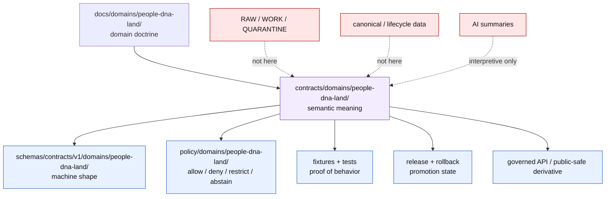

<!-- [KFM_META_BLOCK_V2]
doc_id: kfm://doc/contracts-domains-people-dna-land-readme
title: People / DNA / Land Contracts README
type: readme
version: v0.2
status: draft; contract-lane-orientation; restricted-review; NEEDS VERIFICATION before promotion
owners:
  - OWNER_TBD — People/DNA/Land domain steward
  - OWNER_TBD — Contracts steward
  - OWNER_TBD — Living-person privacy steward
  - OWNER_TBD — DNA/privacy steward
  - OWNER_TBD — Land/title assertion steward
  - OWNER_TBD — Consent steward
  - OWNER_TBD — Source steward
  - OWNER_TBD — Evidence steward
  - OWNER_TBD — Schema steward
  - OWNER_TBD — Policy steward
  - OWNER_TBD — Release steward
  - OWNER_TBD — Docs steward
created: NEEDS VERIFICATION — scaffold existed before v0.2 expansion
updated: 2026-06-22
policy_label: restricted-review; semantic-contracts; people-dna-land; living-person-aware; DNA-aware; title-sensitive; evidence-bound; source-role-aware; consent-aware; release-gated; rollback-aware; not-schema-home; not-policy-home; not-data-home; not-publication-authority
tags: [kfm, contracts, people-dna-land, README, semantic-contracts, PeopleContracts, GenealogyContracts, LandOwnershipContracts, LandInstrument, PersonAssertion, PersonCanonical, GenealogyRelationship, RelationshipAssertion, DNAMatchEvidence, LandOwnershipAssertion, EvidenceBundle, PolicyDecision, ConsentGrant, RevocationReceipt, ReleaseManifest, RollbackCard, restricted]
related:
  - ./people/README.md
  - ./genealogy/README.md
  - ./land-ownership/README.md
  - ./LandInstrument.md
  - ../../../docs/domains/people-dna-land/README.md
  - ../../../docs/domains/people-dna-land/CANONICAL_PATHS.md
  - ../../../docs/domains/people-dna-land/IDENTITY_MODEL.md
  - ../../../docs/domains/people-dna-land/LAND_OWNERSHIP.md
  - ../../../docs/domains/people-dna-land/SENSITIVITY_PROFILE.md
  - ../../../docs/domains/people-dna-land/CONSENT_MODEL.md
  - ../../../docs/domains/people-dna-land/SCOPE_AND_BOUNDARY.md
  - ../../../docs/domains/people-dna-land/sublanes/README.md
  - ../../../schemas/contracts/v1/domains/people-dna-land/
  - ../../../policy/domains/people-dna-land/
  - ../../../fixtures/domains/people-dna-land/
  - ../../../tests/domains/people-dna-land/
  - ../../../release/candidates/people-dna-land/
notes:
  - "Expanded from a generic greenfield scaffold at contracts/domains/people-dna-land/README.md."
  - "This README is the contract-lane orientation for human-readable semantic contracts only."
  - "It does not create schema, policy, source registry, lifecycle-data, consent, proof, receipt, release, canonical store, title, or publication authority."
  - "Current child contract/subfolder conventions are draft/PROPOSED and need steward or ADR acceptance before promotion."
[/KFM_META_BLOCK_V2] -->

<a id="top"></a>

# People / DNA / Land Contracts

Contract-lane README for human-readable semantic contracts in `contracts/domains/people-dna-land/`; this folder explains object and edge meaning for People / Genealogy / DNA / Land without becoming a schema home, policy home, source registry, lifecycle-data store, canonical-person store, title authority, consent store, release gate, or publication surface.

<p>
  
  
  
  
  
  
  
  
</p>

> [!IMPORTANT]
> **Status:** draft / contract-lane orientation  
> **Path:** `contracts/domains/people-dna-land/README.md`  
> **Owning root:** `contracts/` — human-readable semantic meaning for domain objects and edges.  
> **Domain segment:** `people-dna-land`.  
> **Implementation depth:** schemas, fixtures, policy tests, source registries, release manifests, emitted receipts/proofs, public API behavior, and runtime enforcement remain **NEEDS VERIFICATION** unless named evidence proves them.

> [!CAUTION]
> This is a high-risk lane. Living-person fields, raw DNA / genomic evidence, DNA-derived relationship or identity hints, private person↔parcel joins, exact residence exposure, rights-uncertain sources, and title-sensitive land claims fail closed unless evidence, rights, consent where required, policy, review, release, correction, and rollback gates all pass.

## Quick jumps

[Scope](#scope) · [Repo fit](#repo-fit) · [Accepted inputs](#accepted-inputs) · [Exclusions](#exclusions) · [Contract index](#contract-index) · [Directory map](#directory-map) · [Authority boundaries](#authority-boundaries) · [Sensitivity gates](#sensitivity-gates) · [Validation expectations](#validation-expectations) · [Maintenance checklist](#maintenance-checklist) · [Rollback](#rollback) · [Evidence basis](#evidence-basis) · [Open questions](#open-questions)

---

## Scope

`contracts/domains/people-dna-land/` is the semantic-contract lane for the People / Genealogy / DNA / Land bounded context.

This README orients maintainers to:

- what contract files belong in this folder;
- which child contract groups currently exist;
- which claims must be labeled `PROPOSED`, `NEEDS VERIFICATION`, `DENY`, or `ABSTAIN`;
- how this lane relates to docs, schemas, policy, fixtures, tests, source registries, data lifecycle, and release roots;
- how to avoid turning generated text, tree imports, raw DNA, assessor rows, parcel geometry, or AI summaries into unsupported truth.

In scope:

- human-readable semantic contracts for People / Genealogy / DNA / Land object families;
- contract README files that explain object meaning, accepted inputs, exclusions, validation expectations, and rollback posture;
- object contracts such as `LandInstrument.md` and future equivalents for person, genealogy, DNA, and land object families;
- cross-contract boundary notes for living-person, DNA, consent, genealogy, land/title, parcel, and private join risks.

Out of scope:

- JSON Schemas and machine validation shapes;
- policy rules and consent enforcement;
- source descriptors and rights registries;
- raw/work/quarantine/processed/catalog/published data;
- canonical person stores, DNA stores, title stores, or parcel stores;
- public API routes, UI components, Focus Mode render behavior, map layers, or generated AI answers;
- release decisions, proof/receipt objects, rollback records, or promotion state.

---

## Repo fit

| Responsibility | Correct root | This README's boundary |
|---|---|---|
| Human-readable semantic contracts | `contracts/domains/people-dna-land/` | This folder. Defines meaning and review expectations. |
| Domain doctrine and architecture | `docs/domains/people-dna-land/` | Explains domain-wide doctrine, boundary, path conflicts, sensitivity, identity, land, DNA, and API posture. |
| Machine schemas | `schemas/contracts/v1/domains/people-dna-land/` or accepted schema home | Schemas define shape; contract docs must not duplicate schema authority. |
| Policy | `policy/domains/people-dna-land/` plus accepted sensitivity/consent/access homes | Policy decides allow/deny/restrict/abstain. |
| Fixtures and tests | `fixtures/domains/people-dna-land/`, `tests/domains/people-dna-land/` | Proves validator and policy behavior. |
| Source registry | `data/registry/sources/people-dna-land/` or repo-confirmed source-registry home | Owns source roles, rights, cadence, caveats, activation state. |
| Lifecycle data | `data/raw/`, `data/work/`, `data/quarantine/`, `data/processed/`, `data/catalog/`, `data/published/` domain segments | Stores evidence-bearing artifacts by lifecycle phase; never contract docs. |
| Packages/pipelines | `packages/domains/people-dna-land/`, `pipelines/domains/people-dna-land/`, `pipeline_specs/people-dna-land/` | Implementation/spec helpers; may reference contracts but cannot replace them. |
| Release and rollback | `release/candidates/people-dna-land/` and release roots | Owns PromotionDecision, ReleaseManifest, CorrectionNotice, RollbackCard. |

> [!WARNING]
> Do **not** treat this folder as canonical for schemas, policy, source registries, data lifecycle, release, proof, receipt, consent, or public API behavior. The parent docs path register identifies `contracts/domains/people-dna-land/` as a meaning lane, not as a universal authority bucket.

---

## Accepted inputs

Contract files in this folder may describe admitted or proposed object meanings for:

| Object/input family | Contract treatment | Required guardrail |
|---|---|---|
| Person assertions, name assertions, identity candidates, life/residence/migration events | Assertion-first people contracts. | Living-person output fails closed; `PersonCanonical` is not public truth by itself. |
| Genealogy relationships, family groups, relationship hypotheses | Assertion-first genealogy contracts. | Relationship edges require evidence, contradiction handling, review, and sensitivity gates. |
| DNA match evidence, DNA-derived hints, DNA kit token references | Restricted DNA contract references only. | Raw IDs, vendor IDs, and segment data must never be public. |
| Land instruments, deed/title/probate/court records, parcel/legal-description context | Evidence-bound land contracts. | KFM records evidence; it does not issue title opinions or legal conclusions. |
| Assessor records and tax records | Administrative context contracts. | Never title truth; never observed conveyance. |
| Consent, review, evidence, policy, release, rollback refs | Governance references in semantic docs. | Records live in owning roots; contract docs may require but not store them. |
| Tree/GEDCOM/source exports | Source-role and assertion semantics only. | Raw payloads stay in lifecycle roots; tree imports are candidate/model material until reviewed. |

---

## Exclusions

| Do not put here | Correct owner / home | Why |
|---|---|---|
| JSON Schema files | `schemas/contracts/v1/domains/people-dna-land/` | Schemas own machine-checkable shape. |
| Rego/OPA/policy bundles, consent rules, rights rules, redaction rules | `policy/domains/people-dna-land/` and accepted policy roots | Policy owns finite allow/deny/restrict/abstain behavior. |
| Source descriptors and rights registries | `data/registry/sources/people-dna-land/` or accepted registry home | Source authority and rights posture must remain auditable. |
| Raw DNA, GEDCOM, scans, deeds, parcel downloads, census/vital/court files | `data/raw/`, `data/work/`, `data/quarantine/` domain lifecycle lanes | Lifecycle and sensitivity controls belong outside contracts. |
| PersonCanonical records, raw identity records, private residence records | Governed canonical/lifecycle stores | Contracts describe meaning; they do not store people. |
| ConsentGrant, RevocationReceipt, ConsentSidecar, PolicyDecision records | Consent/policy/review homes | Consent is render-time governance, not README content. |
| ReleaseManifest, CorrectionNotice, RollbackCard, proof, receipt, catalog objects | Release/proof/receipt/catalog roots | Promotion and rollback are governed artifacts. |
| Public UI, Focus Mode, map layers, API routes | `apps/`, `ui/`, `web/`, governed API roots | Public clients use governed interfaces and released artifacts. |
| Legal, title, survey, tribal-citizenship, DNA-medical, or identity adjudication | External authorized authority or owning governance lane | KFM may record cited evidence and abstain; it does not adjudicate these. |

---

## Contract index

Current contract files and folders observed or established in this session:

| Contract path | Role | Status posture |
|---|---|---|
| `README.md` | This parent contract-lane orientation. | Draft / restricted-review. |
| `people/README.md` | People/person contract-folder orientation. | Draft; PROPOSED subfolder; living-person fail-closed. |
| `genealogy/README.md` | Genealogy contract-folder orientation. | Draft; PROPOSED subfolder; relationship/living-person/DNA risks. |
| `land-ownership/README.md` | Land-ownership contract-folder orientation. | Draft; PROPOSED subfolder; title/parcel/private-join risks. |
| `LandInstrument.md` | Semantic contract for recorded land instruments. | Draft; schema-missing; title-sensitive; filename case convention unresolved. |

Likely future contract candidates are **PROPOSED** until created and reviewed:

| Candidate | Likely purpose | Gate |
|---|---|---|
| `PersonAssertion.md` or `people/person_assertion.md` | Source-scoped person existence/name claim. | Living-person and evidence gates. |
| `NameAssertion.md` or `people/name_assertion.md` | Source-stated name variant. | Original-source preservation. |
| `LifeEvent.md` / `ResidenceEvent.md` / `MigrationEvent.md` | Person event contracts. | Exact residence and living-person gates. |
| `RelationshipAssertion.md` / `FamilyGroup.md` | Genealogy edge/group contracts. | Evidence, contradiction, review gates. |
| `DNAMatchEvidence.md` / `DNAKitToken.md` | DNA evidence references. | T4/restricted; raw IDs never public. |
| `LandOwnershipAssertion.md` / `OwnershipInterval.md` | Land assertion/interval contracts. | Evidence not title; chain gaps surfaced. |
| `LegalDescription.md` / `ParcelVersion.md` | Legal-description and parcel-version contracts. | Geometry not title-boundary proof. |
| `AssessorRecord.md` / `TaxRecord.md` | Administrative land context. | Administrative only; never title truth. |

---

## Directory map

```text
contracts/domains/people-dna-land/
├── README.md                    # this contract-lane guide
├── LandInstrument.md            # draft semantic contract; schema missing
├── people/
│   └── README.md                # draft / PROPOSED people contract subfolder
├── genealogy/
│   └── README.md                # draft / PROPOSED genealogy contract subfolder
└── land-ownership/
    └── README.md                # draft / PROPOSED land-ownership contract subfolder
```

> [!NOTE]
> The child subfolders are currently orientation surfaces, not settled authority partitions. If future maintainers choose flat contract files instead of subfolders, record the migration in an ADR or migration note and preserve redirects/links where practical.

---

## Authority boundaries



A contract in this folder may say what an object **means**. It must not say that a record is released, policy-approved, rights-cleared, living-person-safe, consent-authorized, schema-valid, title-valid, or publicly renderable unless those supporting artifacts exist and are cited.

---

## Sensitivity gates

| Risk family | Default posture | Contract wording requirement |
|---|---|---|
| Living-person identity or residence | DENY / HOLD / restricted review | Public examples must be synthetic, historical, aggregate, or reviewed. |
| Raw DNA / genomic / kit/vendor/segment data | T4 deny by default | Never public; contracts may define references but not expose raw identifiers. |
| DNA-derived identity or relationship hypotheses | Restricted / review-required | Modeled/candidate, never authoritative on its own. |
| Private person↔parcel join | DENY by default | Generalized/restricted output only if policy allows. |
| Assessor/tax record as title | DENY | Administrative role must be preserved. |
| Parcel geometry as title boundary | DENY | Geometry is context/version, not title proof. |
| Rights-uncertain source material | HOLD / ABSTAIN | Source registry and rights review required. |
| AI-generated relationship/title/person narrative | ABSTAIN as evidence | AI may explain cited EvidenceBundles only. |

---

## Validation expectations

Before this contract lane can be treated as mature, maintainers should verify:

- every contract file has KFM Meta Block v2 and clear owner placeholders or confirmed owners;
- schemas exist for promoted object families and do not drift from contract meaning;
- fixtures cover living-person, DNA, consent, private person↔parcel, source-role collapse, assessor-as-title, parcel-geometry-as-boundary, unresolved EvidenceRef, missing ReleaseManifest, and rollback scenarios;
- policy tests enforce deny-by-default and consent/render gates;
- source registries record source role, rights, cadence, caveats, activation state, and citation templates;
- public DTOs and UI surfaces use released artifacts and governed APIs only;
- AI answers cite EvidenceBundles and abstain when support is insufficient;
- release and rollback artifacts exist for any public or semi-public derivative.

---

## Maintenance checklist

- [ ] Confirm whether child contract subfolders are accepted or should migrate to flat files.
- [ ] Confirm the accepted schema path and naming convention for People/DNA/Land contracts.
- [ ] Add or verify child contract files for person, genealogy, DNA, and land object families.
- [ ] Add fixtures and tests for no-leak and anti-collapse cases.
- [ ] Add parent/child README cross-links after each new contract is created.
- [ ] Update docs/registers if path, naming, or authority drift is discovered.
- [ ] Ensure every public-facing derivative has EvidenceBundle, PolicyDecision, ReviewRecord, ReleaseManifest, correction path, and RollbackCard.

---

## Rollback

Rollback or correction is required when this README or any child contract:

- presents this folder as schema, policy, registry, lifecycle-data, release, consent, proof, receipt, canonical store, title, or publication authority;
- weakens living-person, DNA, consent, rights, source-role, review, release, or rollback gates;
- turns tree imports, raw DNA, source rows, assessor/tax records, parcel geometry, family lore, or AI narratives into truth;
- publishes private person↔parcel, living-person, DNA-derived, rights-uncertain, or title-sensitive material without policy/release support;
- hides path or naming conflicts instead of surfacing them;
- removes evidence, citation, correction, or rollback expectations from contract meaning.

Rollback target: revert the offending README/contract commit, record the drift if authority boundaries were affected, and invalidate downstream derivatives that cited the weakened contract.

---

## Evidence basis

| Evidence | Supports | Limit |
|---|---|---|
| `contracts/domains/people-dna-land/README.md` prior scaffold | Target file existed as generic greenfield scaffold. | Scaffold overstated authority and lacked KFM sensitivity/contract boundaries. |
| `docs/domains/people-dna-land/CANONICAL_PATHS.md` | Domain segment, lane fan-out, contract root role, and deny-default path posture. | Path register does not prove implementation maturity. |
| `docs/domains/people-dna-land/README.md` | Domain landing doctrine: assertion-first, DNA restrictions, assessor/tax and parcel caveats, consent/release posture, segment conflict. | It is a docs landing page, not a schema/policy/runtime proof. |
| `contracts/domains/people-dna-land/people/README.md` | Adjacent people contract-folder style and living-person fail-closed posture. | Proposed child subfolder. |
| `contracts/domains/people-dna-land/genealogy/README.md` | Adjacent genealogy contract-folder style and relationship/living-person/DNA posture. | Proposed child subfolder. |
| `contracts/domains/people-dna-land/land-ownership/README.md` | Adjacent land-ownership contract-folder style and title/parcel boundaries. | Proposed child subfolder. |
| `contracts/domains/people-dna-land/LandInstrument.md` | Object-level land instrument contract and schema-missing posture. | Draft semantic contract; schema missing. |

---

## Open questions

| ID | Question | Status |
|---|---|---|
| OQ-PDL-CONTRACTS-01 | Should this contract lane use subfolders (`people/`, `genealogy/`, `land-ownership/`) or flat object files only? | OPEN / NEEDS VERIFICATION |
| OQ-PDL-CONTRACTS-02 | What exact schema-home and filename-case convention pairs with these contracts? | OPEN / ADR NEEDED |
| OQ-PDL-CONTRACTS-03 | Which DNA contract files may safely exist without encouraging raw DNA exposure? | OPEN / RESTRICTED REVIEW |
| OQ-PDL-CONTRACTS-04 | Which historical examples are safe for fixtures without exposing living persons, private parcels, or rights-uncertain records? | OPEN / REVIEW REQUIRED |
| OQ-PDL-CONTRACTS-05 | Which contracts should be promoted first after schemas, policy tests, and fixtures exist? | OPEN |

[Back to top](#top)
