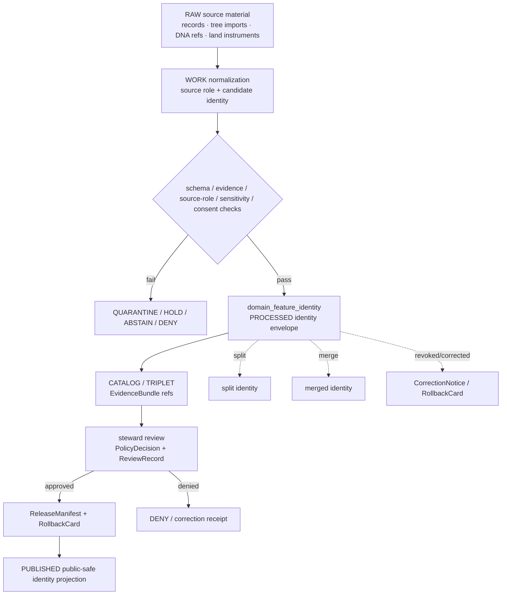

<!-- [KFM_META_BLOCK_V2]
doc_id: kfm://doc/contracts-domains-people-dna-land-domain-feature-identity
title: Domain Feature Identity Contract — People / DNA / Land
type: semantic-contract
version: v0.2
status: draft; PROPOSED; schema-scaffold; restricted-review; NEEDS VERIFICATION before promotion
owners:
  - OWNER_TBD — People/DNA/Land domain steward
  - OWNER_TBD — Identity steward
  - OWNER_TBD — Contracts steward
  - OWNER_TBD — Living-person privacy steward
  - OWNER_TBD — DNA/privacy steward
  - OWNER_TBD — Land/title assertion steward
  - OWNER_TBD — Consent steward
  - OWNER_TBD — Source steward
  - OWNER_TBD — Evidence steward
  - OWNER_TBD — Schema steward
  - OWNER_TBD — Policy steward
  - OWNER_TBD — Release steward
  - OWNER_TBD — Docs steward
created: NEEDS VERIFICATION — scaffold existed before v0.2 expansion
updated: 2026-06-22
policy_label: restricted-review; semantic-contract; domain-feature-identity; people-dna-land; deterministic-identity; spec-hash; source-role-aware; temporal-scope-aware; living-person-aware; DNA-aware; title-sensitive; evidence-bound; consent-aware; release-gated; rollback-aware; not-person-truth; not-title-truth; not-publication-authority
tags: [kfm, contracts, people-dna-land, domain-feature-identity, identity, deterministic-id, spec_hash, source-id, object-role, temporal-scope, normalized-digest, PersonAssertion, PersonIdentityCandidate, PersonCanonical, GenealogyRelationship, DNAMatchEvidence, LandInstrument, LandOwnershipAssertion, ParcelVersion, EvidenceBundle, PolicyDecision, ConsentGrant, RevocationReceipt, ReleaseManifest, RollbackCard]
related:
  - ./README.md
  - ./people/README.md
  - ./genealogy/README.md
  - ./land-ownership/README.md
  - ./LandInstrument.md
  - ../../../docs/domains/people-dna-land/IDENTITY_MODEL.md
  - ../../../docs/domains/people-dna-land/README.md
  - ../../../docs/domains/people-dna-land/CANONICAL_PATHS.md
  - ../../../docs/domains/people-dna-land/SENSITIVITY_PROFILE.md
  - ../../../docs/domains/people-dna-land/CONSENT_MODEL.md
  - ../../../docs/domains/people-dna-land/LAND_OWNERSHIP.md
  - ../../../docs/domains/people-dna-land/SCOPE_AND_BOUNDARY.md
  - ../../../schemas/contracts/v1/domains/people-dna-land/domain_feature_identity.schema.json
  - ../../../policy/domains/people-dna-land/
  - ../../../fixtures/domains/people-dna-land/domain_feature_identity/
  - ../../../tests/domains/people-dna-land/
  - ../../../release/candidates/people-dna-land/
notes:
  - "Expanded from a greenfield semantic-contract scaffold at contracts/domains/people-dna-land/domain_feature_identity.md."
  - "The paired schema exists, but current evidence shows it is a PROPOSED scaffold requiring only id, defining spec_hash/version, and allowing additionalProperties=true."
  - "DomainFeatureIdentity supports deterministic identity, deduplication, lineage, correction, and rollback. It is not a person truth claim, relationship truth claim, DNA claim, title claim, consent grant, policy decision, or release authority."
  - "The identity recipe is grounded in the People/DNA/Land identity model: source id + object role + temporal scope + normalized digest. Field realization remains PROPOSED until schema, fixtures, validators, policy tests, and release proofs are verified."
[/KFM_META_BLOCK_V2] -->

<a id="top"></a>

# Domain Feature Identity Contract — People / DNA / Land

> Semantic contract for `domain_feature_identity`: the deterministic identity envelope used to keep People / Genealogy / DNA / Land objects stable across source refreshes, candidate matching, review, correction, revocation, release, and rollback — without turning identity into truth, consent, title, or publication authority.

<p>
  
  
  
  
  
  
  
  
</p>

`contracts/domains/people-dna-land/domain_feature_identity.md`

## Quick jumps

[Status](#status) · [Meaning](#meaning) · [Repo fit](#repo-fit) · [Schema posture](#schema-posture) · [Assertions](#assertions) · [Exclusions](#exclusions) · [Recommended semantics](#recommended-semantics) · [Identity rules](#identity-rules) · [Source-role and temporal rules](#source-role-and-temporal-rules) · [Sensitivity and consent posture](#sensitivity-and-consent-posture) · [Lifecycle](#lifecycle) · [Validation](#validation) · [Rollback](#rollback) · [Evidence basis](#evidence-basis) · [Open questions](#open-questions)

---

## Status

> [!IMPORTANT]
> **Status:** `draft` / semantic contract  
> **Contract path:** `contracts/domains/people-dna-land/domain_feature_identity.md`  
> **Schema path:** `schemas/contracts/v1/domains/people-dna-land/domain_feature_identity.schema.json`  
> **Truth posture:** the target file and paired schema are confirmed from current repo evidence. The schema is still a PROPOSED scaffold with limited required shape. Full field semantics, fixtures, validator behavior, policy enforcement, source registry records, release manifests, public DTO behavior, and runtime behavior remain **NEEDS VERIFICATION**.

> [!CAUTION]
> `domain_feature_identity` is identity support. It does **not** make a person assertion true, does **not** merge people, does **not** prove a genealogy relationship, does **not** expose DNA evidence, does **not** certify title or ownership, does **not** grant consent, and does **not** publish anything.

---

## Meaning

`domain_feature_identity` records the stable identity and lineage posture of a People / Genealogy / DNA / Land domain object or feature. It supports deterministic re-identification, deduplication, review, split/merge tracking, correction, revocation, derivative invalidation, and rollback.

It answers questions like:

- Which domain object is being identified?
- Which `source id`, `object role`, `temporal scope`, and `normalized digest` shaped the identity?
- Which version of the identity is current, candidate, superseded, split, merged, corrected, quarantined, released, demoted, or rolled back?
- Which EvidenceBundle, source descriptor, policy decision, consent gate, review state, release manifest, or rollback target must be consulted before the identity can be used?
- Which downstream objects depend on the identity?

This contract is intentionally conservative. A stable identifier is useful for auditability, but stable identity is not source truth. KFM still needs evidence, source role, policy, review, consent where required, release state, and rollback support before a consequential claim is answered, rendered, exported, or promoted.

---

## Repo fit

| Responsibility | Path or root | This contract's role |
|---|---|---|
| Identity meaning | `contracts/domains/people-dna-land/domain_feature_identity.md` | This semantic contract. |
| Contract-lane orientation | `contracts/domains/people-dna-land/README.md` | Parent guide for this contract lane. |
| People contract group | `contracts/domains/people-dna-land/people/README.md` | Person assertion/candidate/canonical boundary. |
| Genealogy contract group | `contracts/domains/people-dna-land/genealogy/README.md` | Relationship/family/hypothesis boundary. |
| Land contract group | `contracts/domains/people-dna-land/land-ownership/README.md` | Land/title/parcel/private-join boundary. |
| Object-level land contract | `contracts/domains/people-dna-land/LandInstrument.md` | Example object using identity support. |
| Machine schema shape | `schemas/contracts/v1/domains/people-dna-land/domain_feature_identity.schema.json` | Linked only; current schema is scaffold. |
| Domain identity doctrine | `docs/domains/people-dna-land/IDENTITY_MODEL.md` | Defines the identity model and deterministic formula. |
| Sensitivity and consent | `docs/domains/people-dna-land/SENSITIVITY_PROFILE.md`, `docs/domains/people-dna-land/CONSENT_MODEL.md` | Deny-default and render-gate doctrine. |
| Source registry | `data/registry/sources/people-dna-land/` or accepted source-registry home | Source roles, rights, cadence, caveats, activation state. |
| Policy | `policy/domains/people-dna-land/` | Expected allow/deny/restrict/abstain gates. |
| Fixtures/tests | `fixtures/domains/people-dna-land/domain_feature_identity/`, `tests/domains/people-dna-land/` | Expected proof; not established by this document. |
| Release/correction/rollback | `release/candidates/people-dna-land/` and release roots | Required downstream governance. |

---

## Schema posture

The paired schema exists and is **PROPOSED**, but it is not yet a full implementation contract.

| Schema fact | Current evidence |
|---|---|
| Schema file path | `schemas/contracts/v1/domains/people-dna-land/domain_feature_identity.schema.json` |
| Schema title | `domain_feature_identity` |
| Declared properties | `spec_hash`, `id`, `version` |
| Required fields | `id` |
| Additional properties | `true` |
| Schema status | `PROPOSED` |
| Contract doc pointer | `contracts/domains/people-dna-land/domain_feature_identity.md` |
| Fixtures root pointer | `fixtures/domains/people-dna-land/domain_feature_identity/` |
| Validator pointer | `tools/validators/domains/people-dna-land/validate_domain_feature_identity.py` |
| Policy pointer | `policy/domains/people-dna-land/` |

> [!WARNING]
> The schema pointer to a validator path does not prove that the validator exists or runs. Treat validator, fixture, CI, and policy enforcement as **NEEDS VERIFICATION** until current repo evidence confirms them.

---

## Assertions

A reviewed `domain_feature_identity` may assert:

1. **Identifier assignment** — this domain object has this KFM identity value under the recorded identity recipe.
2. **Identity basis** — the identity was derived from source id, object role, temporal scope, and normalized digest.
3. **Version posture** — this identity version is current, superseded, corrected, split, merged, quarantined, released, demoted, or rolled back.
4. **Object-family boundary** — identity belongs to a specific People / DNA / Land object family such as `PersonAssertion`, `PersonIdentityCandidate`, `PersonCanonical`, `NameAssertion`, `LifeEvent`, `RelationshipAssertion`, `DNAMatchEvidence`, `LandInstrument`, `LandOwnershipAssertion`, `ParcelVersion`, or `OwnershipInterval`.
5. **Evidence dependency** — the identity depends on EvidenceRefs or EvidenceBundles that must resolve before consequential use.
6. **Policy dependency** — use may require PolicyDecision, ConsentGrant, RevocationReceipt, ReviewRecord, ReleaseManifest, and RollbackCard checks.
7. **Derivative dependency** — downstream records may need invalidation if this identity is split, merged, corrected, revoked, or rolled back.

---

## Exclusions

`domain_feature_identity` must not assert:

| Misuse | Required outcome |
|---|---|
| Stable identifier means the source claim is true | `ABSTAIN` / require EvidenceBundle and source-role review. |
| Person identity candidate is canonical | `DENY` unless steward review and canonicalization evidence exist. |
| `PersonCanonical` is public by default | `DENY` unless release, tier, consent where required, and rollback gates pass. |
| Authority IRI is sole truth of a person | `ABSTAIN`; authority IRIs are anchors/routing aids, not sovereign truth. |
| DNA kit/vendor ID or segment can be exposed | `DENY`; raw DNA identifiers and segments are not public. |
| Relationship hypothesis is public relationship truth | `DENY` unless evidence, consent where required, review, and release gates pass. |
| Land instrument proves complete current ownership | `ABSTAIN`; chain-of-title gaps and conflicts must be surfaced. |
| Assessor/tax record is title truth | `DENY`; administrative source role remains administrative. |
| Parcel geometry is a title boundary | `DENY`; geometry is context/versioned representation, not title proof. |
| Identity object grants consent or publication | `DENY`; consent and release are separate governance objects. |
| AI summary can supply identity evidence | `DENY`; AI is interpretive and evidence-subordinate. |

---

## Recommended semantics

The following field meanings are **PROPOSED** until schema expansion and fixtures prove them.

| Field | Meaning |
|---|---|
| `id` | Canonical KFM identity object identifier. Required by the current scaffold schema. |
| `version` | Contract/object version. Present in schema but not required. |
| `spec_hash` | Deterministic hash over identity-bearing normalized content. Present in schema but not required. |
| `domain` | Expected value: `people-dna-land`. |
| `object_role` | Object family being identified: `PersonAssertion`, `PersonIdentityCandidate`, `PersonCanonical`, `LandInstrument`, etc. |
| `source_ref` | SourceDescriptor or source registry reference. |
| `source_role` | Role set at admission and preserved through promotion. |
| `source_native_id` | Source-native identifier when available and safe to retain. |
| `temporal_scope` | Identity-relevant source/observed/valid interval or date scope. |
| `normalized_digest` | Digest input or reference derived from canonicalized identity payload. |
| `canonicalization_profile` | JCS/SHA-256 or other approved canonicalization profile. |
| `identity_state` | Candidate/current/superseded/split/merged/corrected/quarantined/released/rolled-back. |
| `supersedes_refs` | Prior identities replaced by this version. |
| `superseded_by_ref` | Replacement identity when this one is retired. |
| `split_from_ref` | Prior identity split into narrower identities. |
| `merged_from_refs` | Prior identities merged after review. |
| `evidence_refs` | EvidenceRefs or EvidenceBundle refs supporting identity basis. |
| `policy_decision_ref` | PolicyDecision governing use or publication. |
| `consent_ref` | ConsentGrant / RevocationReceipt reference where living-person or DNA-derived material is involved. |
| `review_ref` | ReviewRecord or steward approval/denial reference. |
| `release_manifest_ref` | ReleaseManifest proving public/semi-public exposure is gated. |
| `rollback_ref` | RollbackCard or rollback target. |
| `limitations` | Human-readable caveats: identity not truth, not consent, not publication, not title, not DNA exposure. |

---

## Identity rules

People / DNA / Land identity doctrine uses a deterministic identity rule:

```text
identity(obj) = digest_fn(
  canonicalize(source_id ⊕ object_role ⊕ temporal_scope ⊕ payload)
)
```

This contract applies that rule as follows:

| Component | Contract discipline |
|---|---|
| `source_id` | Must resolve to a SourceDescriptor or accepted source-registry record before consequential use. |
| `object_role` | Must name the object family so unrelated objects cannot collide. |
| `temporal_scope` | Must preserve the identity-relevant time window; do not collapse all times into one `date`. |
| `payload` | Must include identity-bearing source content only; volatile fetch/order/runtime fields should not affect identity. |
| `canonicalize` | Canonicalization profile must be recorded. JCS + SHA-256 is the doctrinal default for this lane unless ADR says otherwise. |
| `digest_fn` | Digest output should be stable, reproducible, and suitable for audit. |

The rule is structural. It does not decide whether two different source assertions refer to the same person, whether a relationship is true, whether a DNA hypothesis can be rendered, or whether a land instrument proves title.

---

## Source-role and temporal rules

Source role and time posture are identity-bearing.

| Rule | Required behavior |
|---|---|
| Source role fixed at admission | Do not upgrade candidate, administrative, modeled, or synthetic material by promotion tone. |
| Object role prevents collision | `NameAssertion`, `PersonAssertion`, `LandInstrument`, and `AssessorRecord` cannot share identity solely because source text overlaps. |
| Source time is distinct | When the source was created/published remains separate from observed or valid time. |
| Observed time is distinct | The asserted event time remains separate from source publication and KFM retrieval time. |
| Valid time is distinct | Residence, ownership, relationship, and parcel-version intervals need interval semantics where available. |
| Retrieval time is distinct | KFM fetch time is freshness/provenance metadata, not identity truth by itself. |
| Release time is distinct | Publication time belongs to release governance, not source truth. |
| Correction time is distinct | Correction, demotion, revocation, split/merge, and rollback require their own timestamps. |

---

## Sensitivity and consent posture

Identity can be sensitive even when the identifier is opaque.

| Identity family | Default posture | Required guardrail |
|---|---|---|
| Living-person identity or residence | T4 / deny-default unless transformed and reviewed. | Consent or aggregation/redaction gate + ReviewRecord + PolicyDecision. |
| Raw DNA kit/vendor ID | Never public. | Use internal token patterns only; raw IDs stay out of public surfaces. |
| DNA segment identity | T4; restricted research only where allowed. | Named consent/agreement + review + policy; never public tier. |
| DNA-derived relationship hypothesis | Restricted/candidate. | Evidence + consent + review; never authoritative on its own. |
| Private person↔parcel identity | Deny-default. | Generalized/de-identified restricted surface only if policy allows. |
| Land/title identity | Evidence-bound and title-sensitive. | Never legal/title/survey advice; release caveats required. |
| Assessor/tax identity | Administrative context. | Never title truth or observed conveyance. |
| Historical non-living person identity | Potentially public-safe after review. | EvidenceBundle + ReleaseManifest + caveats. |

Consent does not publish data. It constrains what a render gate may materialize if evidence, policy, review, release, and rollback gates also pass.

---

## Lifecycle



Promotion is a governed state transition. Identity objects can move through lifecycle states, but the identifier itself does not bypass policy, consent, review, or release.

---

## Validation

Minimum validation expectations before promotion:

| Gate | Required check |
|---|---|
| Schema | Schema defines required identity fields beyond `id`, or the scaffold status remains explicit. |
| Canonicalization | Spec hash recipe and canonicalization profile are recorded and reproducible. |
| Source closure | `source_ref` resolves to an admitted SourceDescriptor with role, rights, and caveats. |
| Object-role discipline | Object family is explicit and prevents cross-family collision. |
| Temporal scope | Source/observed/valid/retrieval/release/correction times are not collapsed. |
| Evidence closure | EvidenceRefs resolve before consequential claims. |
| Sensitivity | Living-person, DNA, private person↔parcel, residence, title, and rights risks fail closed. |
| Consent | ConsentGate/ConsentGrant/RevocationReceipt is checked where required; missing or revoked consent denies. |
| Review | Splits, merges, canonicalization, release, and public-safe projections carry ReviewRecord. |
| Release | ReleaseManifest and rollback target exist before public/semi-public use. |

Negative fixtures should include at least:

- missing source reference;
- missing object role;
- changed payload producing unchanged spec hash;
- volatile retrieval order changing identity;
- source time collapsed with observed or valid time;
- `PersonIdentityCandidate` exposed as `PersonCanonical`;
- living-person identity emitted without policy/consent/release gates;
- DNA kit/vendor ID emitted publicly;
- assessor/tax identity treated as title truth;
- parcel geometry identity treated as title boundary;
- unresolved EvidenceRef;
- release without rollback target.

---

## Rollback

Rollback or correction is required when:

- identity recipe or canonicalization profile was wrong;
- `source_id`, `object_role`, temporal scope, or normalized digest was wrong;
- two identities were incorrectly merged;
- one identity must be split into multiple identities;
- an identity was attached to the wrong person, relationship, DNA reference, land instrument, parcel version, or ownership interval;
- a living-person, DNA, private person↔parcel, or title-sensitive identity was exposed beyond policy;
- consent was revoked or missing;
- EvidenceBundle closure failed;
- release occurred without ReleaseManifest or rollback target.

Rollback must record the affected identity refs, affected downstream derivatives, release manifests, reason code, replacement or tombstone refs, and whether public correction notice is required.

---

## Evidence basis

| Evidence | Supports | Limit |
|---|---|---|
| `contracts/domains/people-dna-land/domain_feature_identity.md` scaffold | Target contract existed and needed semantic content. | Scaffold had placeholders only. |
| `schemas/contracts/v1/domains/people-dna-land/domain_feature_identity.schema.json` | Paired schema path, schema title, `id`, `version`, `spec_hash`, required `id`, additionalProperties=true, x-kfm pointers. | Does not prove validator exists, fixtures exist, policy runs, or schema is mature. |
| `docs/domains/people-dna-land/IDENTITY_MODEL.md` | Domain identity purpose, object families, deterministic rule, temporal distinctions, assertion→candidate→canonical flow, sensitivity tiers, and authority-anchor caveats. | Some path/schema/policy realization remains PROPOSED or conflicted. |
| `contracts/domains/people-dna-land/README.md` | Contract-lane boundary: meaning only, not schema/policy/data/release authority. | Contract README is draft and implementation maturity remains NEEDS VERIFICATION. |
| `contracts/domains/people-dna-land/people/README.md` | People contract posture: assertion-first, living-person fail-closed. | Proposed child subfolder. |
| `contracts/domains/people-dna-land/genealogy/README.md` | Genealogy contract posture: relationship/living-person/DNA risks. | Proposed child subfolder. |
| `contracts/domains/people-dna-land/land-ownership/README.md` | Land/title posture: evidence not title, parcel geometry not title proof. | Proposed child subfolder. |
| `contracts/domains/people-dna-land/LandInstrument.md` | Object contract style and title-sensitive identity dependency. | Draft semantic contract; paired LandInstrument schema was not found. |

---

## Open questions

| ID | Question | Evidence needed | Status |
|---|---|---|---|
| OQ-PDL-DFI-01 | Which fields should become required in the schema beyond `id`? | Schema steward decision + fixtures. | OPEN / NEEDS VERIFICATION |
| OQ-PDL-DFI-02 | What exact `spec_hash` grammar should be enforced here: bare SHA-256, `sha256:<hex>`, or `jcs:sha256:<hex>`? | Canonicalization ADR + schema update. | OPEN / ADR NEEDED |
| OQ-PDL-DFI-03 | How are split/merge/correction states represented without leaking sensitive identities? | Policy + fixture design. | OPEN / RESTRICTED REVIEW |
| OQ-PDL-DFI-04 | Which object families get first-class domain_feature_identity records first? | Implementation roadmap + steward priority. | OPEN |
| OQ-PDL-DFI-05 | How should domain_feature_identity interact with release manifests and public DTOs? | API/release contract + tests. | OPEN / NEEDS VERIFICATION |

[Back to top](#top)
