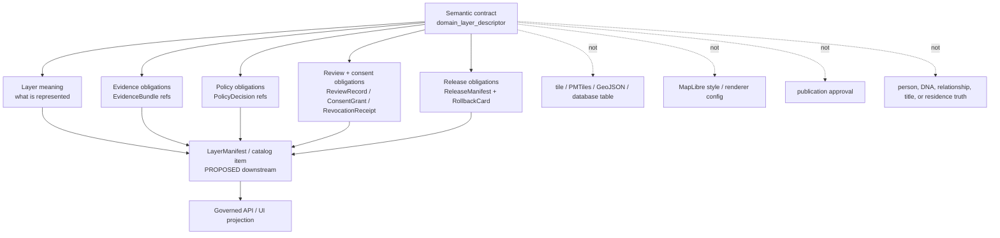
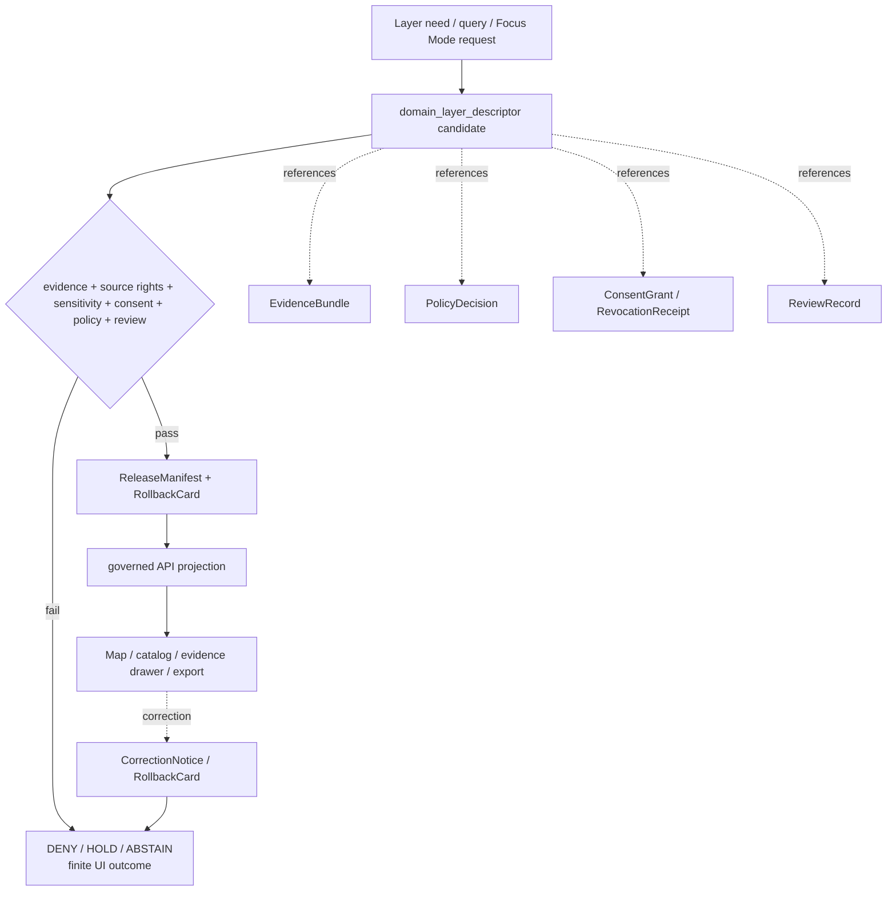

<!-- [KFM_META_BLOCK_V2]
doc_id: kfm://doc/contracts-domains-people-dna-land-domain-layer-descriptor
title: Domain Layer Descriptor Contract — People / DNA / Land
type: semantic-contract
version: v0.2
status: draft; PROPOSED; schema-scaffold; restricted-review; NEEDS VERIFICATION before promotion
owners:
  - OWNER_TBD — People/DNA/Land domain steward
  - OWNER_TBD — Map/UI steward
  - OWNER_TBD — Contracts steward
  - OWNER_TBD — Living-person privacy steward
  - OWNER_TBD — DNA/privacy steward
  - OWNER_TBD — Land/title assertion steward
  - OWNER_TBD — Consent steward
  - OWNER_TBD — Source steward
  - OWNER_TBD — Evidence steward
  - OWNER_TBD — Schema steward
  - OWNER_TBD — Policy steward
  - OWNER_TBD — Release steward
  - OWNER_TBD — Docs steward
created: NEEDS VERIFICATION — scaffold existed before v0.2 expansion
updated: 2026-06-23
policy_label: restricted-review; semantic-contract; domain-layer-descriptor; people-dna-land; map-ui; layer-boundary; living-person-aware; DNA-aware; title-sensitive; evidence-bound; source-role-aware; consent-aware; release-gated; rollback-aware; not-layer-manifest; not-tile; not-style; not-publication-authority
tags: [kfm, contracts, people-dna-land, domain-layer-descriptor, layer, map-ui, FocusMode, public-safe-projection, EvidenceBundle, PolicyDecision, ReviewRecord, ConsentGrant, RevocationReceipt, ReleaseManifest, RollbackCard, redaction, aggregation, k-anonymity, person, genealogy, DNA, land, parcel, title-sensitive, restricted]
related:
  - ./README.md
  - ./domain_feature_identity.md
  - ./people/README.md
  - ./genealogy/README.md
  - ./land-ownership/README.md
  - ./LandInstrument.md
  - ../../../docs/domains/people-dna-land/README.md
  - ../../../docs/domains/people-dna-land/CANONICAL_PATHS.md
  - ../../../docs/domains/people-dna-land/IDENTITY_MODEL.md
  - ../../../docs/domains/people-dna-land/SENSITIVITY_PROFILE.md
  - ../../../docs/domains/people-dna-land/CONSENT_MODEL.md
  - ../../../docs/domains/people-dna-land/LAND_OWNERSHIP.md
  - ../../../docs/domains/people-dna-land/SCOPE_AND_BOUNDARY.md
  - ../../../schemas/contracts/v1/domains/people-dna-land/domain_layer_descriptor.schema.json
  - ../../../policy/domains/people-dna-land/
  - ../../../fixtures/domains/people-dna-land/domain_layer_descriptor/
  - ../../../tests/domains/people-dna-land/
  - ../../../release/candidates/people-dna-land/
notes:
  - "Expanded from a greenfield semantic-contract scaffold at contracts/domains/people-dna-land/domain_layer_descriptor.md."
  - "The paired schema exists, but current evidence shows it is a PROPOSED scaffold requiring only id, defining spec_hash/version, and allowing additionalProperties=true."
  - "DomainLayerDescriptor describes governed layer meaning, sensitivity posture, evidence obligations, and permitted public-safe projection behavior. It is not a tile, style, API response, layer manifest, policy decision, release approval, or publication authority."
  - "People/DNA/Land layer descriptors must fail closed for living-person, raw DNA/genomic, DNA-derived identity/relationship, private person-parcel, exact residence, title-sensitive, and rights-uncertain surfaces unless evidence, policy, consent where required, review, release, correction, and rollback gates pass."
[/KFM_META_BLOCK_V2] -->

<a id="top"></a>

# Domain Layer Descriptor Contract — People / DNA / Land

> Semantic contract for `domain_layer_descriptor`: the People / DNA / Land object that describes the governed meaning, evidence posture, sensitivity posture, consent requirements, permitted transformations, release dependencies, and rollback obligations of a map/UI/catalog layer before it can be consumed by a map shell, Focus Mode surface, evidence drawer, export, or governed API projection.

<p>
  
  
  
  
  
  
  
  
</p>

`contracts/domains/people-dna-land/domain_layer_descriptor.md`

## Quick jumps

[Status](#status) · [Meaning](#meaning) · [Repo fit](#repo-fit) · [Layer boundary](#layer-boundary) · [Schema posture](#schema-posture) · [Accepted uses](#accepted-uses) · [Exclusions](#exclusions) · [Recommended fields](#recommended-fields) · [Invariants](#invariants) · [Sensitivity and consent gates](#sensitivity-and-consent-gates) · [Lifecycle](#lifecycle) · [Validation](#validation) · [Rollback](#rollback) · [Evidence basis](#evidence-basis) · [Open questions](#open-questions)

---

## Status

> [!IMPORTANT]
> **Status:** `draft` / semantic contract  
> **Owner:** `OWNER_TBD`  
> **Contract path:** `contracts/domains/people-dna-land/domain_layer_descriptor.md`  
> **Schema path:** `schemas/contracts/v1/domains/people-dna-land/domain_layer_descriptor.schema.json`  
> **Truth posture:** target path and paired schema are confirmed from current repo evidence. The schema is still a PROPOSED scaffold with limited required shape. Full field semantics, fixtures, validator behavior, policy enforcement, source registry records, release manifests, public DTO behavior, map rendering behavior, and runtime behavior remain **NEEDS VERIFICATION**.

> [!CAUTION]
> This contract defines layer meaning only. It does **not** authorize publication, map rendering, tile generation, Focus Mode display, exact residence exposure, DNA-derived relationship display, private person↔parcel disclosure, title/ownership claims, export, API response, or public browsing.

---

## Meaning

`domain_layer_descriptor` describes a governed People / DNA / Land layer candidate or released layer projection in terms that are inspectable before use.

It may describe:

- what People / DNA / Land object family, projection, aggregate, or public-safe derivative the layer represents;
- what EvidenceBundle, source role, PolicyDecision, ReviewRecord, ConsentGrant, RevocationReceipt, ReleaseManifest, and RollbackCard obligations apply;
- what sensitivity tier, redaction, aggregation, k-anonymity, geometry generalization, de-identification, caveat text, or denial behavior applies;
- what labels, legends, filters, time controls, evidence-drawer links, and export rules are allowed;
- what finite UI outcome must occur when evidence, consent, policy, review, source rights, release, or rollback support is missing.

It exists so a People / DNA / Land layer is never just a style, tile endpoint, vector table, scene, or AI-generated explanation. A layer must carry its claim boundary, evidence boundary, policy boundary, consent boundary, review boundary, release boundary, and rollback boundary.

---

## Repo fit

```text
contracts/
└── domains/
    └── people-dna-land/
        ├── README.md
        ├── domain_layer_descriptor.md
        ├── domain_feature_identity.md
        ├── LandInstrument.md
        ├── people/
        │   └── README.md
        ├── genealogy/
        │   └── README.md
        └── land-ownership/
            └── README.md
```

| Root or object | Relationship |
|---|---|
| `./README.md` | Contract-lane boundary: semantic meaning only, not schema/policy/data/release authority. |
| `./domain_feature_identity.md` | Identity envelope that a layer may reference for stable feature identity and rollback. |
| `./people/README.md` | People/person assertion boundary for living-person and identity claims. |
| `./genealogy/README.md` | Relationship/family/hypothesis boundary. |
| `./land-ownership/README.md` | Land/title/person↔parcel boundary. |
| `./LandInstrument.md` | Land instrument object contract that may feed land-record layers. |
| `../../../docs/domains/people-dna-land/IDENTITY_MODEL.md` | Identity doctrine: assertion-first, source→candidate→canonical, tier and consent gates. |
| `../../../docs/domains/people-dna-land/SENSITIVITY_PROFILE.md` | Deny-default posture for living-person, DNA, and private person↔parcel surfaces. |
| `../../../docs/domains/people-dna-land/CONSENT_MODEL.md` | Consent/render-gate doctrine and revocation posture. |
| `../../../schemas/contracts/v1/domains/people-dna-land/domain_layer_descriptor.schema.json` | Current schema scaffold. |
| `../../../policy/domains/people-dna-land/` | Expected allow/deny/restrict/abstain policy home. |
| `../../../fixtures/domains/people-dna-land/domain_layer_descriptor/` | Expected fixture home. |
| `../../../release/candidates/people-dna-land/` | Expected release and rollback review surface. |

---

## Layer boundary

`domain_layer_descriptor` must preserve the difference between layer description and layer publication.



A layer descriptor may say what a layer is allowed to represent when gates pass. It must not claim the layer is released, policy-approved, rights-cleared, evidence-complete, living-person-safe, DNA-safe, title-safe, or renderable unless separate artifacts prove those states.

---

## Schema posture

The paired schema exists and is **PROPOSED**, but it is not yet a full implementation contract.

| Schema fact | Current evidence |
|---|---|
| Schema file path | `schemas/contracts/v1/domains/people-dna-land/domain_layer_descriptor.schema.json` |
| Schema title | `domain_layer_descriptor` |
| Declared properties | `spec_hash`, `id`, `version` |
| Required fields | `id` |
| Additional properties | `true` |
| Schema status | `PROPOSED` |
| Contract doc pointer | `contracts/domains/people-dna-land/domain_layer_descriptor.md` |
| Fixtures root pointer | `fixtures/domains/people-dna-land/domain_layer_descriptor/` |
| Validator pointer | `tools/validators/domains/people-dna-land/validate_domain_layer_descriptor.py` |
| Policy pointer | `policy/domains/people-dna-land/` |

> [!WARNING]
> The schema pointer to a validator path does not prove that the validator exists or runs. Treat validator, fixture, CI, policy, API, and renderer behavior as **NEEDS VERIFICATION** until current repo evidence confirms them.

---

## Accepted uses

A `domain_layer_descriptor` may describe these layer families when the required gates are present:

| Layer family | May describe | Required posture |
|---|---|---|
| Historical person aggregate | County, township, tract, or time-binned non-identifying person/person-event summary. | EvidenceBundle + aggregation/redaction + release caveat. |
| Public historical person layer | Non-living, public-safe, source-cited people or events. | Review + EvidenceBundle + ReleaseManifest. |
| Genealogy relationship aggregate | Aggregated or public-safe relationship patterns. | No living-person exposure; relationship evidence and caveats required. |
| DNA-derived aggregate | k-anonymized or de-identified aggregate, never raw kit/segment display. | Consent/policy/review gate; no public raw DNA. |
| Land-instrument layer | Public-safe instrument citations, abstracts, or generalized footprints. | Evidence not title; rights/review/release required. |
| Parcel/person context layer | Generalized/de-identified parcel-person context. | Private join denied unless policy permits transformed surface. |
| Review-only layer | Steward/reviewer restricted layer for unresolved candidates. | T3/T4 controls; no public surface. |
| Denial layer response | Empty/withheld/needs-review outcome where gates fail. | Finite UI outcome with reason code; no sensitive leakage. |

---

## Exclusions

`domain_layer_descriptor` must not be used as:

| Misuse | Required outcome |
|---|---|
| MapLibre style, PMTiles file, GeoJSON, GeoParquet, raster, vector tile, or database table | Put in renderer/data/tile roots; this contract may only describe meaning. |
| LayerManifest, ReleaseManifest, or catalog publication approval | Require downstream release/catalog artifacts. |
| EvidenceBundle, PolicyDecision, ReviewRecord, ConsentGrant, or RollbackCard | Reference those artifacts; do not replace them. |
| Public proof that a person lived at an exact place | `DENY` unless living-person and residence policy permits a transformed surface. |
| Public DNA match, kit, vendor, segment, triangulation, or relationship layer | `DENY` for raw; restricted/aggregate only when policy and consent allow. |
| Title/ownership certification or parcel-boundary proof | `DENY`; land layers are evidence/context, not title or survey truth. |
| Assessor/tax-as-title surface | `DENY`; administrative context remains administrative. |
| AI-generated story layer or relationship/title narrative | `ABSTAIN` as evidence; AI may explain cited released artifacts only. |
| Public layer over RAW/WORK/QUARANTINE candidates | `DENY`; public clients use governed APIs and released artifacts. |

---

## Recommended fields

The following field meanings are **PROPOSED** until schema expansion and fixtures prove them.

| Field | Meaning |
|---|---|
| `id` | Canonical descriptor identifier. Required by current scaffold schema. |
| `version` | Contract/object version. Present in schema but not required. |
| `spec_hash` | Deterministic hash of descriptor content. Present in schema but not required. |
| `domain` | Expected value: `people-dna-land`. |
| `layer_key` | Stable layer identifier used by catalog/UI. |
| `layer_title` | Human-readable layer title. |
| `layer_family` | Person, genealogy, DNA, land, parcel, aggregate, review-only, denial/withheld. |
| `represented_object_types` | Object contracts represented by this layer. |
| `source_role_summary` | Source-role posture for the represented objects. |
| `evidence_refs` | EvidenceBundle/EvidenceRef obligations. |
| `policy_decision_ref` | PolicyDecision controlling use/render/export. |
| `review_ref` | ReviewRecord or steward review requirement. |
| `consent_requirements` | ConsentGrant/RevocationReceipt dependencies where living-person or DNA-derived content is involved. |
| `release_manifest_ref` | ReleaseManifest required before public/semi-public exposure. |
| `rollback_ref` | RollbackCard or rollback target. |
| `sensitivity_tier` | T0–T4 or policy-equivalent sensitivity level. |
| `allowed_transforms` | Redaction, aggregation, k-anonymity, geometry generalization, delayed release, denial. |
| `geometry_posture` | Exact, generalized, centroid, masked, withheld, aggregate, none. |
| `time_controls` | Allowed temporal filters and time kinds represented. |
| `legend_rules` | Labels and caveats that must be shown. |
| `evidence_drawer_rules` | What supporting citation/evidence details may be shown. |
| `export_rules` | Whether export is denied, restricted, generalized, or allowed. |
| `empty_state` | UI outcome when layer is denied, withheld, missing evidence, or needs review. |
| `limitations` | Human-readable caveats for truth, title, DNA, consent, and release boundaries. |

---

## Invariants

1. **Layer description is not publication.** A descriptor can specify obligations; it cannot release a layer.
2. **Layer style is not truth.** Visual styling, legends, colors, opacity, clustering, and popups are downstream presentation.
3. **Evidence closure is required.** Public or semi-public layer claims must resolve EvidenceRefs to EvidenceBundles.
4. **Policy closure is required.** Missing PolicyDecision produces deny/hold/abstain behavior, not permissive rendering.
5. **Consent is render-time governance.** Consent may permit a constrained use; it does not publish data by itself.
6. **T4 material fails closed.** Living-person, raw DNA, exact residence, private person↔parcel, and title-sensitive joins are denied/restricted by default.
7. **Geometry is not title.** Parcel geometry and layer footprints do not prove title boundaries.
8. **Assessor/tax records are administrative.** Administrative context does not become title truth through a layer.
9. **AI is interpretive.** Generated labels or summaries cannot replace EvidenceBundle, PolicyDecision, ReviewRecord, ReleaseManifest, or RollbackCard.
10. **Rollback must invalidate downstream surfaces.** If a layer descriptor or its dependencies are corrected, revoked, demoted, or rolled back, public derivatives must be invalidated or corrected.

---

## Sensitivity and consent gates

| Gate | Default outcome when missing | Required proof before render/export |
|---|---|---|
| EvidenceBundle | `ABSTAIN` / hide claims | Resolved EvidenceBundle or released derivative. |
| Source rights | `HOLD` / `DENY` | Source registry rights and redistribution posture. |
| Living-person status | `DENY` / restricted review | Consent or aggregation/redaction path + review + policy. |
| Raw DNA / segment / kit ID | `DENY` | No public transform; restricted only under explicit agreement. |
| DNA-derived relationship/identity | `DENY` / restricted review | Consent + review + policy + evidence; usually aggregate/de-identified only. |
| Exact residence | `DENY` / generalize | Redaction/aggregation and policy-approved geometry posture. |
| Private person↔parcel join | `DENY` | De-identification/generalization and explicit policy approval. |
| Land/title claim | `ABSTAIN` unless caveated | Evidence context + no title/legal/survey implication + release caveats. |
| Review state | `HOLD` | ReviewRecord or steward decision. |
| Release state | `HOLD` | ReleaseManifest + RollbackCard. |

---

## Lifecycle



The descriptor can be prepared before release, but any public or semi-public layer must wait for release-state evidence. Promotion is governed, not implied by file placement or map configuration.

---

## Validation

Minimum validation expectations before promotion:

| Gate | Required check |
|---|---|
| Schema | Schema defines layer fields beyond `id`, or scaffold status remains visible. |
| Contract links | Represented object contracts exist and match layer family. |
| Evidence | EvidenceRefs resolve to EvidenceBundles or released derivatives. |
| Source role | Source role and rights are preserved and not upgraded by rendering. |
| Sensitivity | T0–T4 posture, living-person, DNA, private person↔parcel, residence, and title flags are evaluated. |
| Consent | ConsentGrant and RevocationReceipt behavior is checked where required. |
| Geometry | Geometry posture is explicit: exact, generalized, masked, aggregate, withheld, or none. |
| Labels/legend | Mandatory caveats are present: evidence not truth, not title, not raw DNA, not legal advice where needed. |
| Export | Export rules deny or transform sensitive material. |
| Release | ReleaseManifest and RollbackCard exist before public/semi-public use. |
| UI finite outcomes | Missing evidence/policy/consent/release produces a finite denial/hold/abstain state. |

Negative fixtures should include at least:

- public layer missing EvidenceBundle;
- public layer missing PolicyDecision;
- layer exposing living-person residence;
- layer exposing raw DNA kit/segment data;
- DNA-derived relationship layer without consent/review;
- private person↔parcel join rendered publicly;
- land instrument layer implying title proof;
- parcel geometry layer implying boundary proof;
- assessor/tax layer implying ownership truth;
- export allowed despite sensitivity deny;
- ReleaseManifest missing rollback target.

---

## Rollback

Rollback or correction is required when:

- layer descriptor references the wrong object family, source, evidence, policy, review, consent, release, or rollback artifact;
- sensitivity tier was too permissive;
- living-person, DNA, exact residence, private person↔parcel, or title-sensitive content was exposed beyond policy;
- a public label or legend implied source truth, title truth, legal advice, raw DNA visibility, or canonical identity without support;
- geometry precision was too exact;
- export rules leaked restricted material;
- consent was revoked;
- EvidenceBundle, source rights, or ReleaseManifest was corrected, withdrawn, or superseded.

Rollback must record affected layer descriptor refs, affected tile/API/catalog/UI/export derivatives, reason code, replacement descriptor if any, public correction notice if required, and cache invalidation targets.

---

## Evidence basis

| Evidence | Supports | Limit |
|---|---|---|
| `contracts/domains/people-dna-land/domain_layer_descriptor.md` scaffold | Target contract existed and needed semantic content. | Scaffold had placeholders only. |
| `schemas/contracts/v1/domains/people-dna-land/domain_layer_descriptor.schema.json` | Paired schema path, schema title, `id`, `version`, `spec_hash`, required `id`, additionalProperties=true, x-kfm pointers. | Does not prove validator exists, fixtures exist, policy runs, API surfaces exist, or renderer behavior exists. |
| `contracts/domains/archaeology/domain_layer_descriptor.md` | Established local contract pattern for a sensitive domain layer descriptor. | Archaeology sensitivity differs; People/DNA/Land rules must be stricter for living-person, DNA, consent, and title risks. |
| `contracts/domains/people-dna-land/README.md` | Contract-lane boundary: meaning only, not schema/policy/data/release authority. | Draft; implementation maturity remains NEEDS VERIFICATION. |
| `contracts/domains/people-dna-land/domain_feature_identity.md` | Identity support boundary and release/rollback dependency model. | Draft; schema scaffold. |
| `docs/domains/people-dna-land/IDENTITY_MODEL.md` | Assertion-first identity model, public projection gates, sensitivity tiers, and authority-anchor caveats. | Some path/schema/policy realization remains PROPOSED or conflicted. |
| `contracts/domains/people-dna-land/people/README.md` | People contract posture: assertion-first, living-person fail-closed. | Proposed child subfolder. |
| `contracts/domains/people-dna-land/genealogy/README.md` | Genealogy contract posture: relationship/living-person/DNA risks. | Proposed child subfolder. |
| `contracts/domains/people-dna-land/land-ownership/README.md` | Land/title posture: evidence not title, parcel geometry not title proof. | Proposed child subfolder. |
| `contracts/domains/people-dna-land/LandInstrument.md` | Object contract style and title-sensitive layer dependency. | Draft semantic contract; paired LandInstrument schema was not found. |

---

## Open questions

| ID | Question | Evidence needed | Status |
|---|---|---|---|
| OQ-PDL-DLD-01 | Which fields should become required in the schema beyond `id`? | Schema steward decision + fixtures. | OPEN / NEEDS VERIFICATION |
| OQ-PDL-DLD-02 | Is `domain_layer_descriptor` the right object name, or should it align with a cross-domain `LayerDescriptor`/`LayerManifest` vocabulary? | Map/UI ADR + contract inventory. | OPEN / ADR NEEDED |
| OQ-PDL-DLD-03 | Which layer families are allowed for public People/DNA/Land Focus Mode? | Policy + release profile + UI contract. | OPEN / RESTRICTED REVIEW |
| OQ-PDL-DLD-04 | What are the exact k-anonymity and geometry-generalization thresholds for living-person/DNA-derived overlays? | Policy profile + sensitivity fixtures. | OPEN / POLICY NEEDED |
| OQ-PDL-DLD-05 | How should descriptor changes invalidate tiles, catalog records, API cache, exports, and saved Focus Mode states? | Release/rollback contract + tests. | OPEN / NEEDS VERIFICATION |

[Back to top](#top)
