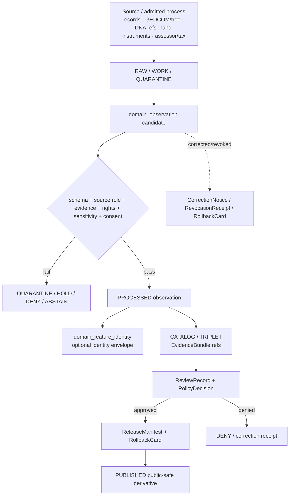

<!-- [KFM_META_BLOCK_V2]
doc_id: kfm://doc/contracts-domains-people-dna-land-domain-observation
title: Domain Observation Contract — People / DNA / Land
type: semantic-contract
version: v0.2
status: draft; PROPOSED; schema-scaffold; restricted-review; NEEDS VERIFICATION before promotion
owners:
  - OWNER_TBD — People/DNA/Land domain steward
  - OWNER_TBD — Observation steward
  - OWNER_TBD — Contracts steward
  - OWNER_TBD — Living-person privacy steward
  - OWNER_TBD — DNA/privacy steward
  - OWNER_TBD — Land/title assertion steward
  - OWNER_TBD — Consent steward
  - OWNER_TBD — Source steward
  - OWNER_TBD — Evidence steward
  - OWNER_TBD — Schema steward
  - OWNER_TBD — Policy steward
  - OWNER_TBD — Release steward
  - OWNER_TBD — Docs steward
created: NEEDS VERIFICATION — scaffold existed before v0.2 expansion
updated: 2026-06-23
policy_label: restricted-review; semantic-contract; domain-observation; people-dna-land; source-scoped; assertion-first; temporal-scope-aware; evidence-bound; source-role-aware; living-person-aware; DNA-aware; title-sensitive; consent-aware; release-gated; rollback-aware; not-canonical-truth; not-policy-decision; not-publication-authority
tags: [kfm, contracts, people-dna-land, domain-observation, observation, source-role, source-scoped, temporal-scope, PersonAssertion, NameAssertion, LifeEvent, ResidenceEvent, MigrationEvent, RelationshipAssertion, DNAMatchEvidence, LandInstrument, AssessorRecord, TaxRecord, EvidenceBundle, PolicyDecision, ConsentGrant, RevocationReceipt, ReleaseManifest, RollbackCard]
related:
  - ./README.md
  - ./domain_feature_identity.md
  - ./domain_layer_descriptor.md
  - ./people/README.md
  - ./genealogy/README.md
  - ./land-ownership/README.md
  - ./LandInstrument.md
  - ../../../docs/domains/people-dna-land/IDENTITY_MODEL.md
  - ../../../docs/domains/people-dna-land/README.md
  - ../../../docs/domains/people-dna-land/CANONICAL_PATHS.md
  - ../../../docs/domains/people-dna-land/SENSITIVITY_PROFILE.md
  - ../../../docs/domains/people-dna-land/CONSENT_MODEL.md
  - ../../../docs/domains/people-dna-land/LAND_OWNERSHIP.md
  - ../../../docs/domains/people-dna-land/SCOPE_AND_BOUNDARY.md
  - ../../../schemas/contracts/v1/domains/people-dna-land/domain_observation.schema.json
  - ../../../policy/domains/people-dna-land/
  - ../../../fixtures/domains/people-dna-land/domain_observation/
  - ../../../tests/domains/people-dna-land/
  - ../../../release/candidates/people-dna-land/
notes:
  - "Expanded from a greenfield semantic-contract scaffold at contracts/domains/people-dna-land/domain_observation.md."
  - "The paired schema exists, but current evidence shows it is a PROPOSED scaffold requiring only id, defining spec_hash/version, and allowing additionalProperties=true."
  - "DomainObservation is a source-scoped observation wrapper for People/DNA/Land object families. It is not canonical identity, relationship truth, DNA proof, title proof, consent, policy approval, release approval, or publication authority."
  - "Field realization remains PROPOSED until schema, fixtures, validators, policy tests, source registries, release manifests, and rollback proofs are verified."
[/KFM_META_BLOCK_V2] -->

<a id="top"></a>

# Domain Observation Contract — People / DNA / Land

> Semantic contract for `domain_observation`: the source-scoped observation wrapper for People / Genealogy / DNA / Land assertions, events, relationship claims, DNA-derived observations, and land-record observations — preserving source role, time scope, evidence, sensitivity, consent, review, release, and rollback posture without turning an observation into canonical truth.

<p>
  
  
  
  
  
  
  
  
</p>

`contracts/domains/people-dna-land/domain_observation.md`

## Quick jumps

[Status](#status) · [Meaning](#meaning) · [Repo fit](#repo-fit) · [Schema posture](#schema-posture) · [Accepted uses](#accepted-uses) · [Exclusions](#exclusions) · [Recommended fields](#recommended-fields) · [Invariants](#invariants) · [Observation families](#observation-families) · [Source-role and temporal rules](#source-role-and-temporal-rules) · [Sensitivity and consent gates](#sensitivity-and-consent-gates) · [Lifecycle](#lifecycle) · [Validation](#validation) · [Rollback](#rollback) · [Evidence basis](#evidence-basis) · [Open questions](#open-questions)

---

## Status

> [!IMPORTANT]
> **Status:** `draft` / semantic contract  
> **Owner:** `OWNER_TBD`  
> **Contract path:** `contracts/domains/people-dna-land/domain_observation.md`  
> **Schema path:** `schemas/contracts/v1/domains/people-dna-land/domain_observation.schema.json`  
> **Truth posture:** target path and paired schema are confirmed from current repo evidence. The schema is still a PROPOSED scaffold with limited required shape. Full field semantics, fixtures, validator behavior, policy enforcement, source registry records, release manifests, public DTO behavior, UI behavior, and runtime behavior remain **NEEDS VERIFICATION**.

> [!CAUTION]
> `domain_observation` is an observation wrapper. It does **not** merge people, does **not** prove a genealogy relationship, does **not** expose DNA evidence, does **not** certify title or ownership, does **not** grant consent, does **not** decide policy, and does **not** publish anything.

---

## Meaning

`domain_observation` carries the common observation semantics shared by People / DNA / Land object families.

It exists to preserve:

- source identity and source role;
- object family and observation role;
- source, observed, valid, retrieval, release, and correction time distinctions;
- source-stated values before normalization or canonicalization;
- support geography or place context where applicable;
- source caveats, confidence, contradiction posture, review status, and evidence references;
- sensitivity, consent, rights, release, correction, and rollback dependencies.

A `domain_observation` may support a `PersonAssertion`, `NameAssertion`, `LifeEvent`, `ResidenceEvent`, `MigrationEvent`, `RelationshipAssertion`, `DNA Match Evidence`, `LandInstrument`, `AssessorRecord`, `TaxRecord`, `ParcelVersion`, or other object-family-specific contract. The object-family contract owns the specific payload meaning. This contract owns the shared observation posture.

It is not a universal claim of truth. It records that a source, model, administrative record, or admitted observation asserted something under a scoped context. Whether that observation can become a canonical identity, relationship, layer, public summary, or released derivative depends on evidence, policy, consent where required, review, release, and rollback support.

---

## Repo fit

```text
contracts/
└── domains/
    └── people-dna-land/
        ├── README.md
        ├── domain_observation.md
        ├── domain_feature_identity.md
        ├── domain_layer_descriptor.md
        ├── LandInstrument.md
        ├── people/
        │   └── README.md
        ├── genealogy/
        │   └── README.md
        └── land-ownership/
            └── README.md
```

| Root or object | Relationship |
|---|---|
| `./README.md` | Contract-lane boundary: semantic meaning only. |
| `./domain_feature_identity.md` | Stable identity envelope that an observation may reference or feed. |
| `./domain_layer_descriptor.md` | Layer/public-safe projection descriptor that may consume released observations. |
| `./people/README.md` | Person assertion, name assertion, identity candidate, and event boundaries. |
| `./genealogy/README.md` | Relationship and family hypothesis boundaries. |
| `./land-ownership/README.md` | Land/title/person↔parcel observation boundaries. |
| `./LandInstrument.md` | Object contract for recorded land instruments, a major land observation family. |
| `../../../docs/domains/people-dna-land/IDENTITY_MODEL.md` | Identity and observation doctrine: object families, deterministic identity, temporal distinctions, sensitivity tiers. |
| `../../../schemas/contracts/v1/domains/people-dna-land/domain_observation.schema.json` | Current schema scaffold. |
| `../../../policy/domains/people-dna-land/` | Expected policy decision home; behavior not verified here. |
| `../../../fixtures/domains/people-dna-land/domain_observation/` | Expected fixture home from schema metadata. |
| `../../../release/candidates/people-dna-land/` | Expected release and rollback review surface. |

---

## Schema posture

The paired schema exists and is **PROPOSED**, but it is not yet a full implementation contract.

| Schema fact | Current evidence |
|---|---|
| Schema file path | `schemas/contracts/v1/domains/people-dna-land/domain_observation.schema.json` |
| Schema title | `domain_observation` |
| Declared properties | `spec_hash`, `id`, `version` |
| Required fields | `id` |
| Additional properties | `true` |
| Schema status | `PROPOSED` |
| Contract doc pointer | `contracts/domains/people-dna-land/domain_observation.md` |
| Fixtures root pointer | `fixtures/domains/people-dna-land/domain_observation/` |
| Validator pointer | `tools/validators/domains/people-dna-land/validate_domain_observation.py` |
| Policy pointer | `policy/domains/people-dna-land/` |

> [!WARNING]
> The schema pointer to a validator path does not prove that the validator exists or runs. Treat validator, fixture, CI, policy, API, and UI behavior as **NEEDS VERIFICATION** until current repo evidence confirms them.

---

## Accepted uses

| Use | Allowed? | Rule |
|---|---:|---|
| Carrying source-scoped observation semantics | Yes | Preserve source role, time, object family, evidence, caveats, and sensitivity posture. |
| Supporting person, genealogy, DNA, or land object contracts | Yes | Observation supplies common wrapper semantics; object contracts own payload meaning. |
| Supporting deterministic identity or deduplication | Conditional | Feed identity only through `domain_feature_identity` rules; do not merge by observation alone. |
| Supporting review and release gates | Conditional | May reference required governance artifacts; must not replace them. |
| Acting as EvidenceBundle or proof closure | No | Evidence/proof objects remain separate. |
| Acting as consent, policy, or release approval | No | Consent, policy, and release artifacts remain separate. |
| Acting as map/UI layer descriptor | No | `domain_layer_descriptor` owns layer boundary and render/export rules. |
| Acting as public API payload by itself | No | Public clients use governed APIs and released derivatives. |

---

## Exclusions

`domain_observation` must not be used as:

| Misuse | Required outcome |
|---|---|
| Canonical person identity | Use `PersonIdentityCandidate` and `PersonCanonical` review flow; observation remains source-scoped. |
| Genealogy relationship truth | Use relationship contracts with evidence, contradiction, consent where required, review, and release. |
| Raw DNA proof or public DNA layer | `DENY`; raw kit/vendor IDs and segments are restricted/denied by default. |
| Title or ownership certification | `DENY` / `ABSTAIN`; land observations are evidence/context only. |
| Assessor/tax as title | `DENY`; administrative role remains administrative. |
| Parcel geometry as boundary proof | `DENY`; geometry is context/versioned representation. |
| Source record storage | Store RAW/WORK/QUARANTINE payloads in data lifecycle roots. |
| AI-generated evidence | `DENY`; AI may explain cited evidence but cannot supply it. |
| Public render permission | Requires PolicyDecision, ReviewRecord, ReleaseManifest, rollback target, and consent where applicable. |

---

## Recommended fields

The following field meanings are **PROPOSED** until schema expansion and fixtures prove them.

| Field | Meaning |
|---|---|
| `id` | Canonical observation identifier. Required by current scaffold schema. |
| `version` | Contract/object version. Present in schema but not required. |
| `spec_hash` | Deterministic hash over normalized observation content. Present in schema but not required. |
| `domain` | Expected value: `people-dna-land`. |
| `object_family` | Person, genealogy, DNA, land, parcel, consent, or other owned family. |
| `observation_role` | Source assertion, administrative observation, modeled candidate, aggregate, context, review-only, or released derivative input. |
| `source_ref` | SourceDescriptor or source registry reference. |
| `source_role` | Role set at admission and preserved downstream. |
| `source_native_id` | Source-native identifier when safe and permitted. |
| `source_value_raw` | Source-stated value or pointer to source value, preserving original wording where safe. |
| `normalized_value_ref` | Normalized value or object-family ref; never replaces the source-stated form. |
| `observed_subject_ref` | Person assertion, relationship, DNA token, land instrument, parcel version, or other subject ref. |
| `source_time` | When the source was created, published, recorded, or observed. |
| `observed_time` | When the source says the event/observation occurred. |
| `valid_time` | Interval during which an assertion is held to apply, if applicable. |
| `retrieval_time` | KFM retrieval/freeze time. |
| `release_time` | KFM governed release time, if released. |
| `correction_time` | Correction, demotion, revocation, or rollback time. |
| `place_ref` | Place/geography reference where applicable and policy-safe. |
| `geometry_posture` | Exact, generalized, masked, aggregate, withheld, or none. |
| `confidence` | Source/model/review confidence, if allowed. |
| `contradiction_refs` | Conflicting observations or review notes. |
| `evidence_refs` | EvidenceRefs or EvidenceBundle refs supporting the observation. |
| `policy_decision_ref` | PolicyDecision governing use or publication. |
| `consent_ref` | ConsentGrant / RevocationReceipt reference where living-person or DNA-derived material is involved. |
| `review_ref` | ReviewRecord or steward review ref. |
| `release_manifest_ref` | ReleaseManifest proving public/semi-public exposure is gated. |
| `rollback_ref` | RollbackCard or rollback target. |
| `limitations` | Caveats: observation not truth, not canonical identity, not title, not consent, not publication. |

---

## Invariants

1. **Observation is source-scoped.** It records a source or admitted process assertion under a scope; it is not final truth.
2. **Source role is fixed at admission.** Promotion cannot convert candidate, administrative, modeled, aggregate, or synthetic material into observed truth.
3. **Object family must be explicit.** People, genealogy, DNA, and land observations carry different risks and cannot share semantics by implication.
4. **Time roles stay distinct.** Source, observed, valid, retrieval, release, and correction times must not collapse into one date.
5. **Source-stated values are preserved.** Normalization does not erase original wording where review requires it and policy allows retention.
6. **Evidence closure is required.** Consequential claims need EvidenceBundle support.
7. **Policy closure is required.** Missing or denying PolicyDecision prevents public use.
8. **Consent is separate.** Consent constrains rendering but does not publish an observation by itself.
9. **Release is separate.** Public use requires ReleaseManifest and rollback target.
10. **Rollback invalidates derivatives.** Corrected, revoked, demoted, split, or merged observations must propagate to dependent identities, layers, graph edges, exports, and AI summaries.

---

## Observation families

| Family | Example observation | Default posture |
|---|---|---|
| Person assertion | A source states a person name, age, birth/death, occupation, household, or biographical fact. | Assertion-first; living-person fail-closed. |
| Name assertion | A source states a name variant or spelling. | Preserve as stated; not canonical identity by itself. |
| Life event | Birth, death, marriage, burial, military service, naturalization, court/probate event. | Evidence-bound; time/place/source-scoped. |
| Residence / migration | A source states residence, movement, household, or migration context. | Exact living-person residence denied by default. |
| Genealogy relationship | A source states or implies parent, spouse, sibling, family group, or relationship. | Relationship hypothesis until evidence/review support. |
| DNA match evidence | Vendor or comparable source indicates genetic match or segment. | Raw IDs/segments denied; tokenized/restricted only. |
| Consent / revocation observation | Consent granted, changed, expired, or revoked. | Governance artifact references; not stored here as authority. |
| Land instrument | Recorder/court/public-land source states an instrument exists. | Evidence not title; instrument source-scoped. |
| Assessor/tax observation | Taxpayer, valuation, owner-of-record, parcel/admin entry. | Administrative context; never title truth. |
| Parcel/legal-description observation | Source describes parcel, PLSS, lot/block, legal-description text, or geometry. | Geometry/context only; not boundary proof. |
| Aggregate observation | An aggregation/redaction result for public-safe display. | Requires receipt/review; does not expose raw inputs. |

---

## Source-role and temporal rules

| Rule | Required behavior |
|---|---|
| Source role fixed at admission | Keep `observed`, `administrative`, `candidate`, `modeled`, `aggregate`, `context`, `restricted`, or `synthetic` role explicit where used. |
| Source value separate from normalized value | Do not hide source wording, spelling, title, relationship text, or legal description behind normalized output. |
| Person/canonical separation | Observation may feed identity candidate review, but cannot create `PersonCanonical` alone. |
| Relationship separation | Observation may support a relationship, but relationship truth requires separate contract and review flow. |
| Title separation | Land observation may support title context; it cannot certify ownership, title, boundary, mineral/water rights, or legal conclusions. |
| Source time distinct | When a source was created or recorded remains separate from observed/valid time. |
| Observed time distinct | The time the source says the event occurred is preserved. |
| Valid time distinct | Residence, relationship, ownership, and parcel-version intervals need interval handling where available. |
| Retrieval time distinct | KFM fetch time is provenance/freshness metadata. |
| Release/correction time distinct | Release and correction belong to governance, not source truth. |

---

## Sensitivity and consent gates

| Gate | Default outcome when missing | Required proof before public use |
|---|---|---|
| EvidenceBundle | `ABSTAIN` | Resolved EvidenceBundle or released derivative. |
| Source rights | `HOLD` / `DENY` | Source registry rights and redistribution posture. |
| Living-person status | `DENY` / restricted review | Consent or aggregation/redaction path + ReviewRecord + PolicyDecision. |
| Exact residence | `DENY` / generalize | Redaction/aggregation and policy-approved geometry posture. |
| Raw DNA / kit / segment | `DENY` | No public transform; restricted use only under explicit agreement. |
| DNA-derived relationship or identity | `DENY` / restricted review | Consent + review + policy + evidence; usually aggregate/de-identified only. |
| Private person↔parcel join | `DENY` | De-identification/generalization and explicit policy approval. |
| Land/title claim | `ABSTAIN` unless caveated | Evidence context + no title/legal/survey implication + release caveats. |
| Review state | `HOLD` | ReviewRecord or steward decision. |
| Release state | `HOLD` | ReleaseManifest + RollbackCard. |

---

## Lifecycle



Promotion is governed. A source observation can be stable, well-cited, and useful without being public, canonical, title-valid, DNA-safe, or relationship truth.

---

## Validation

Minimum validation expectations before promotion:

| Gate | Required check |
|---|---|
| Schema | Schema defines observation fields beyond `id`, or scaffold status remains visible. |
| Source role | Source role is explicit and fixed at admission. |
| Object family | Observation family is explicit and compatible with referenced object contract. |
| Time axes | Source/observed/valid/retrieval/release/correction times are not collapsed. |
| Evidence | EvidenceRefs resolve to EvidenceBundles or released derivatives. |
| Rights | Source rights and redistribution posture resolve. |
| Sensitivity | Living-person, DNA, private person↔parcel, residence, and title-sensitive risks are evaluated. |
| Consent | ConsentGrant and RevocationReceipt behavior is checked where required. |
| Review | ReviewRecord exists for canonicalization, relationship, DNA, title, or public release contexts. |
| Release | ReleaseManifest and rollback target exist before public/semi-public use. |

Negative fixtures should include at least:

- observation missing source role;
- observation missing object family;
- source value overwritten by normalized value;
- source time collapsed with observed or valid time;
- `PersonAssertion` observation emitted as `PersonCanonical`;
- relationship observation emitted as relationship truth;
- raw DNA kit/segment observation emitted publicly;
- living-person residence observation emitted publicly;
- private person↔parcel observation emitted publicly;
- assessor/tax observation treated as title;
- parcel geometry observation treated as boundary proof;
- unresolved EvidenceRef;
- release without rollback target.

---

## Rollback

Rollback or correction is required when:

- source record, source role, object family, source-stated value, time scope, or normalized value was wrong;
- an observation was promoted as canonical identity or relationship truth without review;
- living-person, DNA, private person↔parcel, residence, or title-sensitive observations were exposed beyond policy;
- source rights changed or were misread;
- consent was revoked, expired, or discovered missing;
- EvidenceBundle closure failed;
- public wording implied legal/title/survey advice, DNA proof, identity certainty, or relationship certainty;
- release occurred without ReleaseManifest or rollback target.

Rollback must record affected observation refs, affected identities, graph edges, layers, API/cache/export artifacts, release manifests, reason code, replacement/tombstone refs, and whether public correction notice is required.

---

## Evidence basis

| Evidence | Supports | Limit |
|---|---|---|
| `contracts/domains/people-dna-land/domain_observation.md` scaffold | Target contract existed and needed semantic content. | Scaffold had placeholders only. |
| `schemas/contracts/v1/domains/people-dna-land/domain_observation.schema.json` | Paired schema path, schema title, `id`, `version`, `spec_hash`, required `id`, additionalProperties=true, x-kfm pointers. | Does not prove validator exists, fixtures exist, policy runs, API surfaces exist, or UI behavior exists. |
| `contracts/domains/agriculture/domain_observation.md` | Local pattern for a domain observation semantic contract. | Agriculture risk posture differs; People/DNA/Land requires stricter living-person, DNA, consent, title, and private-join gates. |
| `docs/domains/people-dna-land/IDENTITY_MODEL.md` | Object families, assertion-first identity, deterministic identity, source-role/time distinctions, sensitivity tiers, and public projection caveats. | Some path/schema/policy realization remains PROPOSED or conflicted. |
| `contracts/domains/people-dna-land/README.md` | Contract-lane boundary: meaning only, not schema/policy/data/release authority. | Draft; implementation maturity remains NEEDS VERIFICATION. |
| `contracts/domains/people-dna-land/domain_feature_identity.md` | Identity support boundary and release/rollback dependency model. | Draft; schema scaffold. |
| `contracts/domains/people-dna-land/domain_layer_descriptor.md` | Layer/render/export boundary for released observation derivatives. | Draft; schema scaffold. |
| `contracts/domains/people-dna-land/people/README.md` | People contract posture: assertion-first, living-person fail-closed. | Proposed child subfolder. |
| `contracts/domains/people-dna-land/genealogy/README.md` | Genealogy contract posture: relationship/living-person/DNA risks. | Proposed child subfolder. |
| `contracts/domains/people-dna-land/land-ownership/README.md` | Land/title posture: evidence not title, parcel geometry not title proof. | Proposed child subfolder. |
| `contracts/domains/people-dna-land/LandInstrument.md` | Land-record observation dependency and title-sensitive posture. | Draft semantic contract; paired LandInstrument schema was not found. |

---

## Open questions

| ID | Question | Evidence needed | Status |
|---|---|---|---|
| OQ-PDL-OBS-01 | Which fields should become required in the schema beyond `id`? | Schema steward decision + fixtures. | OPEN / NEEDS VERIFICATION |
| OQ-PDL-OBS-02 | Should `domain_observation` be a generic wrapper for all source-scoped observations or split into person/genealogy/DNA/land observation contracts? | Contract inventory + ADR. | OPEN / ADR NEEDED |
| OQ-PDL-OBS-03 | Which observation families are safe for public examples and fixtures? | Sensitivity review + synthetic/redacted fixture plan. | OPEN / RESTRICTED REVIEW |
| OQ-PDL-OBS-04 | How should observation corrections invalidate `domain_feature_identity`, graph edges, layers, exports, and AI summaries? | Release/rollback contract + tests. | OPEN / NEEDS VERIFICATION |
| OQ-PDL-OBS-05 | What exact source-role enum is accepted for People/DNA/Land observations? | Source steward + schema update. | OPEN |

[Back to top](#top)
