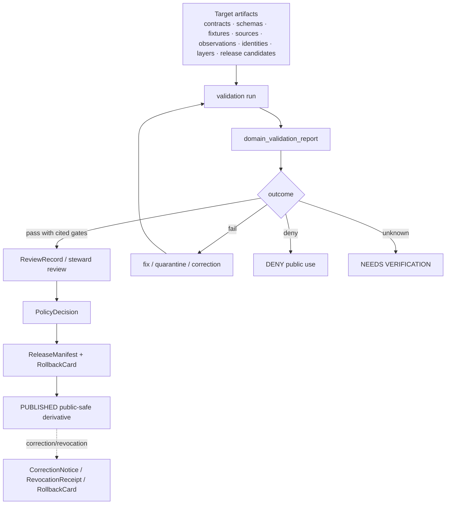

<!-- [KFM_META_BLOCK_V2]
doc_id: kfm://doc/contracts-domains-people-dna-land-domain-validation-report
title: Domain Validation Report Contract — People / DNA / Land
type: semantic-contract
version: v0.2
status: draft; PROPOSED; schema-scaffold; restricted-review; NEEDS VERIFICATION before promotion
owners:
  - OWNER_TBD — People/DNA/Land domain steward
  - OWNER_TBD — Validation steward
  - OWNER_TBD — Contracts steward
  - OWNER_TBD — Living-person privacy steward
  - OWNER_TBD — DNA/privacy steward
  - OWNER_TBD — Land/title assertion steward
  - OWNER_TBD — Consent steward
  - OWNER_TBD — Source steward
  - OWNER_TBD — Evidence steward
  - OWNER_TBD — Schema steward
  - OWNER_TBD — Policy steward
  - OWNER_TBD — Release steward
  - OWNER_TBD — Docs steward
created: NEEDS VERIFICATION — scaffold existed before v0.2 expansion
updated: 2026-06-23
policy_label: restricted-review; semantic-contract; domain-validation-report; people-dna-land; validation; evidence-bound; source-role-aware; living-person-aware; DNA-aware; title-sensitive; consent-aware; release-gated; rollback-aware; not-validator-code; not-proof-closure; not-policy-decision; not-review-approval; not-release-approval
tags: [kfm, contracts, people-dna-land, domain-validation-report, validation, report, schema, fixture, validator, no-leak, EvidenceBundle, PolicyDecision, ReviewRecord, ConsentGrant, RevocationReceipt, ReleaseManifest, RollbackCard, PersonAssertion, PersonCanonical, RelationshipAssertion, DNAMatchEvidence, LandInstrument, LandOwnershipAssertion, domain_observation, domain_feature_identity, domain_layer_descriptor]
related:
  - ./README.md
  - ./domain_observation.md
  - ./domain_feature_identity.md
  - ./domain_layer_descriptor.md
  - ./people/README.md
  - ./genealogy/README.md
  - ./land-ownership/README.md
  - ./LandInstrument.md
  - ../../../docs/domains/people-dna-land/IDENTITY_MODEL.md
  - ../../../docs/domains/people-dna-land/README.md
  - ../../../docs/domains/people-dna-land/CANONICAL_PATHS.md
  - ../../../docs/domains/people-dna-land/SENSITIVITY_PROFILE.md
  - ../../../docs/domains/people-dna-land/CONSENT_MODEL.md
  - ../../../docs/domains/people-dna-land/LAND_OWNERSHIP.md
  - ../../../docs/domains/people-dna-land/SCOPE_AND_BOUNDARY.md
  - ../../../schemas/contracts/v1/domains/people-dna-land/domain_validation_report.schema.json
  - ../../../policy/domains/people-dna-land/
  - ../../../fixtures/domains/people-dna-land/domain_validation_report/
  - ../../../tests/domains/people-dna-land/
  - ../../../release/candidates/people-dna-land/
notes:
  - "Expanded from a greenfield semantic-contract scaffold at contracts/domains/people-dna-land/domain_validation_report.md."
  - "The paired schema exists, but current evidence shows it is a PROPOSED scaffold requiring only id, defining spec_hash/version, and allowing additionalProperties=true."
  - "DomainValidationReport records validation scope, outcomes, failures, unknowns, evidence references, and follow-up. It is not validator code, EvidenceBundle closure, PolicyDecision, ReviewRecord, ReleaseManifest, or publication approval."
  - "People/DNA/Land validation must include no-leak gates for living-person, raw DNA/genomic, DNA-derived relationship/identity, private person-parcel, exact residence, title-sensitive, source-rights, consent, release, and rollback risks."
[/KFM_META_BLOCK_V2] -->

<a id="top"></a>

# Domain Validation Report Contract — People / DNA / Land

> Semantic contract for `domain_validation_report`: the People / DNA / Land validation-report object used to record what was checked, what passed, what failed, what remains unknown, and what follow-up is required before observations, identities, relationships, DNA-derived artifacts, land/title contexts, layer descriptors, or release candidates can advance.

<p>
  
  
  
  
  
  
  
  
</p>

`contracts/domains/people-dna-land/domain_validation_report.md`

## Quick jumps

[Status](#status) · [Meaning](#meaning) · [Repo fit](#repo-fit) · [Validation boundary](#validation-boundary) · [Schema posture](#schema-posture) · [Accepted uses](#accepted-uses) · [Exclusions](#exclusions) · [Recommended fields](#recommended-fields) · [Invariants](#invariants) · [Validation families](#validation-families) · [No-leak gates](#no-leak-gates) · [Lifecycle](#lifecycle) · [Validation of this contract](#validation-of-this-contract) · [Rollback](#rollback) · [Evidence basis](#evidence-basis) · [Open questions](#open-questions)

---

## Status

> [!IMPORTANT]
> **Status:** `draft` / semantic contract  
> **Owner:** `OWNER_TBD`  
> **Contract path:** `contracts/domains/people-dna-land/domain_validation_report.md`  
> **Schema path:** `schemas/contracts/v1/domains/people-dna-land/domain_validation_report.schema.json`  
> **Truth posture:** target path and paired schema are confirmed from current repo evidence. The schema is still a PROPOSED scaffold with limited required shape. Full field semantics, fixtures, validator behavior, policy enforcement, source registry records, release manifests, public DTO behavior, UI behavior, and runtime behavior remain **NEEDS VERIFICATION**.

> [!CAUTION]
> This contract defines report meaning only. It does **not** prove a claim, run validation code, close EvidenceBundles, approve policy, approve review, grant consent, publish data, certify title, expose DNA, or authorize public release.

---

## Meaning

`domain_validation_report` records validation results for People / DNA / Land objects, contracts, schemas, fixtures, transformations, layer descriptors, release candidates, and governance references.

It captures:

- validation scope and target artifacts;
- validator, rule-set, schema, policy, fixture, or review checks used;
- pass/fail/hold/deny/abstain outcomes;
- warnings, errors, blockers, and unknowns;
- sensitivity, consent, source-role, rights, evidence, review, release, and rollback findings;
- references to EvidenceBundles, PolicyDecisions, ConsentGrants, RevocationReceipts, ReviewRecords, ReleaseManifests, RollbackCards, test logs, fixtures, and correction records where available;
- required follow-up before promotion, release, public rendering, export, or AI answer use.

A validation report is not the validator itself. It is also not proof that an underlying claim is true. It records the state of checks and gaps so promotion can remain auditable and reversible.

---

## Repo fit

```text
contracts/
└── domains/
    └── people-dna-land/
        ├── README.md
        ├── domain_validation_report.md
        ├── domain_observation.md
        ├── domain_feature_identity.md
        ├── domain_layer_descriptor.md
        ├── LandInstrument.md
        ├── people/
        │   └── README.md
        ├── genealogy/
        │   └── README.md
        └── land-ownership/
            └── README.md
```

| Root or object | Relationship |
|---|---|
| `./README.md` | Contract-lane boundary: semantic meaning only. |
| `./domain_observation.md` | Observation wrapper that may produce validation findings. |
| `./domain_feature_identity.md` | Identity envelope requiring validation before split/merge/release. |
| `./domain_layer_descriptor.md` | Layer descriptor requiring validation before render/export/release. |
| `./people/README.md` | People contract posture for assertion/canonical identity validation. |
| `./genealogy/README.md` | Relationship and family-hypothesis validation boundary. |
| `./land-ownership/README.md` | Land/title/private-join validation boundary. |
| `./LandInstrument.md` | Land-record contract requiring title-sensitive validation caveats. |
| `../../../schemas/contracts/v1/domains/people-dna-land/domain_validation_report.schema.json` | Current schema scaffold. |
| `../../../policy/domains/people-dna-land/` | Expected policy decision home; behavior not verified here. |
| `../../../fixtures/domains/people-dna-land/domain_validation_report/` | Expected fixture home from schema metadata. |
| `../../../release/candidates/people-dna-land/` | Expected release and rollback review surface. |

---

## Validation boundary

`domain_validation_report` must preserve the difference between checking, proving, reviewing, deciding, consenting, and releasing.

| Boundary | Rule |
|---|---|
| Validation report vs. validator | The report records results; validator code lives in tools/package homes. |
| Validation report vs. EvidenceBundle | A passing check does not replace EvidenceBundle resolution. |
| Validation report vs. source rights | The report may record rights checks; source registry controls the source posture. |
| Validation report vs. consent | The report may require or cite consent; it does not grant consent. |
| Validation report vs. policy | The report may cite or require a PolicyDecision; it does not decide policy. |
| Validation report vs. review | The report may require review; it does not approve review. |
| Validation report vs. release | The report may gate release; it does not publish or authorize release. |
| Validation report vs. runtime behavior | API/UI/map/export behavior remains unverified unless tested and cited. |

---

## Schema posture

The paired schema exists and is **PROPOSED**, but it is not yet a full implementation contract.

| Schema fact | Current evidence |
|---|---|
| Schema file path | `schemas/contracts/v1/domains/people-dna-land/domain_validation_report.schema.json` |
| Schema title | `domain_validation_report` |
| Declared properties | `spec_hash`, `id`, `version` |
| Required fields | `id` |
| Additional properties | `true` |
| Schema status | `PROPOSED` |
| Contract doc pointer | `contracts/domains/people-dna-land/domain_validation_report.md` |
| Fixtures root pointer | `fixtures/domains/people-dna-land/domain_validation_report/` |
| Validator pointer | `tools/validators/domains/people-dna-land/validate_domain_validation_report.py` |
| Policy pointer | `policy/domains/people-dna-land/` |

> [!WARNING]
> The schema pointer to a validator path does not prove that the validator exists or runs. Treat validator, fixture, CI, policy, API, UI, and release behavior as **NEEDS VERIFICATION** until current repo evidence confirms them.

---

## Accepted uses

| Use | Allowed? | Rule |
|---|---:|---|
| Recording schema/contract/fixture validation outcomes | Yes | Include target, rule set, version, outcome, and issues. |
| Recording no-leak validation for sensitive People/DNA/Land surfaces | Yes | Include living-person, DNA, private person↔parcel, residence, and title checks. |
| Blocking promotion or release when validation fails | Yes | Use finite status: fail, deny, hold, abstain, needs-review. |
| Supporting steward review | Yes | Validation may provide evidence to review; review remains separate. |
| Supporting release readiness | Conditional | Report may say release gates are satisfied only when required artifacts are cited. |
| Acting as the validator implementation | No | Validator code belongs in tools/packages. |
| Acting as EvidenceBundle or proof closure | No | Evidence and proof objects remain separate. |
| Acting as PolicyDecision, ConsentGrant, ReviewRecord, or ReleaseManifest | No | Governance artifacts remain separate. |
| Authorizing public display or export | No | Release, policy, and governed API paths decide exposure. |

---

## Exclusions

`domain_validation_report` must not be used as:

| Misuse | Required outcome |
|---|---|
| Proof that a person claim is true | `ABSTAIN`; require EvidenceBundle and review where consequential. |
| Proof that a relationship is true | `ABSTAIN`; validation can confirm structure, not relationship truth. |
| Proof that DNA evidence can be public | `DENY`; raw DNA and DNA-derived identities remain restricted/denied by default. |
| Proof of title, ownership, heirship, mineral/water rights, or parcel boundary | `DENY` / `ABSTAIN`; KFM does not issue legal/title/survey opinions. |
| Consent or revocation ledger | Reference ConsentGrant/RevocationReceipt; do not replace them. |
| Policy approval or reviewer approval | Reference PolicyDecision/ReviewRecord; do not replace them. |
| Release approval | Reference ReleaseManifest/RollbackCard; do not replace them. |
| CI success claim without logs | `NEEDS VERIFICATION`; cite workflow/log/artifact evidence. |
| Public API/UI behavior claim without tests | `NEEDS VERIFICATION`; cite runtime/API/UI test evidence. |

---

## Recommended fields

The following field meanings are **PROPOSED** until schema expansion and fixtures prove them.

| Field | Meaning |
|---|---|
| `id` | Canonical validation report identifier. Required by current scaffold schema. |
| `version` | Contract/object version. Present in schema but not required. |
| `spec_hash` | Deterministic hash of report content. Present in schema but not required. |
| `domain` | Expected value: `people-dna-land`. |
| `validation_run_id` | Stable identifier for the validation run. |
| `target_refs` | Contracts, schemas, fixtures, source descriptors, data artifacts, release candidates, or API/UI artifacts checked. |
| `validation_scope` | Contract, schema, fixture, source, evidence, policy, consent, no-leak, release, rollback, API, UI, export, or layer scope. |
| `rule_set_refs` | Validator, policy profile, schema version, fixture set, or checklist references. |
| `run_time` | Validation execution time. |
| `source_snapshot_refs` | Commit, artifact, dataset, source registry, or release candidate snapshot. |
| `outcome` | pass, fail, warn, hold, deny, abstain, needs-review, needs-verification. |
| `findings` | Findings with severity, code, target, evidence, and recommended action. |
| `blockers` | Issues that prevent promotion or release. |
| `warnings` | Issues that do not block but require review. |
| `unknowns` | Explicit unknowns that cannot be upgraded through tone. |
| `evidence_refs` | EvidenceBundle or proof refs used by the validation. |
| `policy_decision_refs` | PolicyDecision refs checked or required. |
| `consent_refs` | ConsentGrant / RevocationReceipt refs checked or required. |
| `review_refs` | ReviewRecord refs checked or required. |
| `release_manifest_refs` | ReleaseManifest refs checked or required. |
| `rollback_refs` | RollbackCard or rollback target refs. |
| `next_actions` | Required follow-up before promotion/release. |
| `limitations` | What the report does not prove. |

---

## Invariants

1. **Report is not proof closure.** Passing validation does not replace EvidenceBundle resolution.
2. **Report is not policy.** PolicyDecision remains separate and finite.
3. **Report is not review.** Steward/release review remains separate.
4. **Report is not consent.** ConsentGrant and RevocationReceipt remain separate.
5. **Report is not release.** ReleaseManifest and RollbackCard remain separate.
6. **Unknowns remain visible.** A report cannot silently convert `UNKNOWN` into `PASS`.
7. **Deny-default risks fail closed.** Living-person, DNA, private person↔parcel, exact residence, title-sensitive, and rights-uncertain cases block release unless all gates are cited.
8. **Negative tests matter.** No-leak failures are more important than happy-path structural success.
9. **Source role is validated.** Candidate, administrative, modeled, aggregate, restricted, and synthetic sources cannot be promoted by wording.
10. **Rollback is validation scope.** Release-readiness validation must include rollback target and downstream invalidation checks.

---

## Validation families

| Validation family | Checks | Fails when |
|---|---|---|
| Contract shape | Required contract docs, metadata, links, and boundaries are present. | Contract claims authority outside `contracts/`. |
| Schema shape | Schema required fields, enum posture, additionalProperties, and pointers are acceptable. | Schema is missing or scaffold status is hidden. |
| Fixture coverage | Positive and negative fixtures exist. | Sensitive no-leak cases are missing. |
| Source-role validation | SourceDescriptor/source role resolves and remains fixed. | Administrative/candidate/model/synthetic source is upgraded to truth. |
| Evidence validation | EvidenceRefs resolve. | Consequential claim lacks EvidenceBundle closure. |
| Sensitivity validation | T0–T4, living-person, DNA, private join, residence, title, and rights risks are evaluated. | Risk is ignored or public output defaults open. |
| Consent validation | ConsentGrant/RevocationReceipt/expiry/scope are checked. | Missing, revoked, expired, or out-of-scope consent is treated as allowed. |
| Policy validation | PolicyDecision finite outcome is checked. | No policy decision or permissive default. |
| Review validation | ReviewRecord and separation-of-duty expectations are checked. | Required review missing. |
| Release validation | ReleaseManifest and RollbackCard exist before public/semi-public use. | Release or rollback target missing. |
| Runtime/export validation | API/UI/layer/export behavior matches contract and policy. | Public path bypasses governed interface or leaks sensitive data. |

---

## No-leak gates

A People/DNA/Land validation report should explicitly test or mark `NEEDS VERIFICATION` for these gates:

| Gate | Required negative case |
|---|---|
| Living-person identity | Public output denied without policy + consent/transform + review + release. |
| Exact residence | Exact point/parcel/residence withheld or generalized. |
| Raw DNA / kit / segment | Raw vendor IDs, kit IDs, segments, triangulation details denied from public outputs. |
| DNA-derived relationship | Relationship/identity hypothesis withheld unless consent, evidence, review, and policy allow restricted/aggregate use. |
| Private person↔parcel join | Denied unless de-identified/generalized and policy-approved. |
| Assessor/tax as title | Denied; administrative role preserved. |
| Parcel geometry as title boundary | Denied; geometry treated as context only. |
| Land instrument as complete title | Abstain/deny; chain gaps and legal caveats preserved. |
| AI-generated claim | Denied as evidence; AI answer cites EvidenceBundle or abstains. |
| Missing rollback | Release-readiness fails when rollback target is absent. |

---

## Lifecycle



Validation may gate promotion. It does not itself promote.

---

## Validation of this contract

This contract should be considered ready for promotion only when:

- the schema has required fields beyond `id` or the scaffold status remains visible;
- fixture coverage exists for pass, fail, deny, hold, abstain, and needs-verification outcomes;
- no-leak fixtures cover living-person, DNA, private person↔parcel, exact residence, title-sensitive, rights, consent, and rollback failures;
- validator implementation exists and is cited;
- policy tests prove deny-default behavior;
- release-readiness checks require ReleaseManifest and RollbackCard;
- API/UI/export tests prove public clients do not bypass governed interfaces;
- documentation links to this contract and its schema are current.

---

## Rollback

Rollback or correction is required when:

- a report incorrectly marked failed validation as passing;
- a report hid unknowns, blockers, source-role gaps, evidence gaps, consent gaps, policy gaps, release gaps, or rollback gaps;
- a no-leak gate failed but was downgraded to warning;
- report wording implied proof closure, review approval, policy approval, consent, title opinion, DNA safety, or release approval;
- public derivatives relied on an invalid or superseded report;
- validator, schema, fixture, policy, source registry, consent, evidence, release, or rollback evidence changed.

Rollback must record affected validation report refs, affected promotion decisions, affected release candidates, downstream layers/API/UI/export artifacts, reason code, replacement validation report if any, and public correction notice if required.

---

## Evidence basis

| Evidence | Supports | Limit |
|---|---|---|
| `contracts/domains/people-dna-land/domain_validation_report.md` scaffold | Target contract existed and needed semantic content. | Scaffold had placeholders only. |
| `schemas/contracts/v1/domains/people-dna-land/domain_validation_report.schema.json` | Paired schema path, schema title, `id`, `version`, `spec_hash`, required `id`, additionalProperties=true, x-kfm pointers. | Does not prove validator exists, fixtures exist, policy runs, API surfaces exist, or UI behavior exists. |
| `contracts/domains/archaeology/domain_validation_report.md` | Local sensitive-domain pattern for validation-report meaning and boundary. | Archaeology risk differs; People/DNA/Land requires stronger living-person, DNA, consent, title, and private-join gates. |
| `contracts/domains/people-dna-land/README.md` | Contract-lane boundary: meaning only, not schema/policy/data/release authority. | Draft; implementation maturity remains NEEDS VERIFICATION. |
| `contracts/domains/people-dna-land/domain_observation.md` | Observation validation targets and source-scoped posture. | Draft; schema scaffold. |
| `contracts/domains/people-dna-land/domain_feature_identity.md` | Identity validation targets and split/merge/rollback posture. | Draft; schema scaffold. |
| `contracts/domains/people-dna-land/domain_layer_descriptor.md` | Layer/render/export validation targets. | Draft; schema scaffold. |
| `docs/domains/people-dna-land/IDENTITY_MODEL.md` | Assertion-first identity model, public projection gates, sensitivity tiers, and authority-anchor caveats. | Some path/schema/policy realization remains PROPOSED or conflicted. |
| `contracts/domains/people-dna-land/people/README.md` | People contract posture: assertion-first, living-person fail-closed. | Proposed child subfolder. |
| `contracts/domains/people-dna-land/genealogy/README.md` | Genealogy contract posture: relationship/living-person/DNA risks. | Proposed child subfolder. |
| `contracts/domains/people-dna-land/land-ownership/README.md` | Land/title posture: evidence not title, parcel geometry not title proof. | Proposed child subfolder. |
| `contracts/domains/people-dna-land/LandInstrument.md` | Land-record validation target and title-sensitive posture. | Draft semantic contract; paired LandInstrument schema was not found. |

---

## Open questions

| ID | Question | Evidence needed | Status |
|---|---|---|---|
| OQ-PDL-DVR-01 | Which fields should become required in the schema beyond `id`? | Schema steward decision + fixtures. | OPEN / NEEDS VERIFICATION |
| OQ-PDL-DVR-02 | What validation outcome enum should be accepted: pass/fail/warn/hold/deny/abstain/needs-review/needs-verification? | Validator + policy contract alignment. | OPEN / ADR NEEDED |
| OQ-PDL-DVR-03 | Which no-leak tests are mandatory before any public People/DNA/Land Focus Mode release? | Policy profile + release checklist. | OPEN / RESTRICTED REVIEW |
| OQ-PDL-DVR-04 | Where should validation logs and machine-readable results live relative to this semantic contract? | Directory Rules + validator/report ADR. | OPEN |
| OQ-PDL-DVR-05 | How should a failed validation report invalidate cached layers, API responses, exports, graph edges, and AI summaries? | Release/rollback contract + tests. | OPEN / NEEDS VERIFICATION |

[Back to top](#top)
