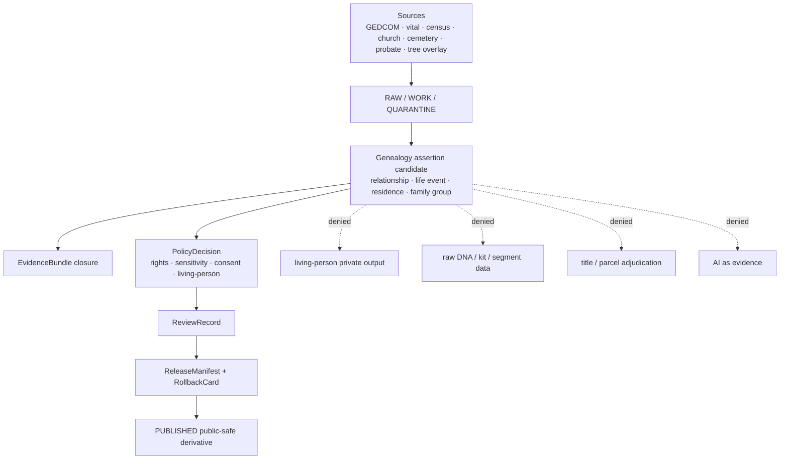

<!-- [KFM_META_BLOCK_V2]
doc_id: kfm://doc/contracts-domains-people-dna-land-genealogy-readme
title: Genealogy Contracts README — People / DNA / Land
type: readme
version: v0.1
status: draft; PROPOSED genealogy contract subfolder; restricted-review; NEEDS VERIFICATION before promotion
owners:
  - OWNER_TBD — People/DNA/Land domain steward
  - OWNER_TBD — Genealogy assertion steward
  - OWNER_TBD — Living-person privacy steward
  - OWNER_TBD — Consent steward
  - OWNER_TBD — Source steward
  - OWNER_TBD — Evidence steward
  - OWNER_TBD — Schema steward
  - OWNER_TBD — Policy steward
  - OWNER_TBD — Release steward
  - OWNER_TBD — Docs steward
created: 2026-06-22
updated: 2026-06-22
policy_label: restricted-review; deny-by-default; living-person-aware; genealogy; evidence-bound; consent-aware; source-role-aware; release-gated; rollback-aware
tags: [kfm, contracts, people-dna-land, genealogy, README, semantic-contracts, assertion-first, relationship-assertions, life-events, evidencebundle, consent, living-person, privacy, restricted]
related:
  - ../README.md
  - ../../../../docs/domains/people-dna-land/SCOPE_AND_BOUNDARY.md
  - ../../../../docs/domains/people-dna-land/CANONICAL_PATHS.md
  - ../../../../docs/domains/people-dna-land/SENSITIVITY_PROFILE.md
  - ../../../../docs/domains/people-dna-land/CONSENT_MODEL.md
  - ../../../../docs/domains/people-dna-land/sublanes/README.md
  - ../../../../docs/domains/people-dna-land/sublanes/genealogy.md
  - ../../../../docs/domains/people-dna-land/PEOPLE_DOMAIN_MODEL.md
  - ../../../../docs/domains/people-dna-land/API_CONTRACTS.md
  - ../../../../schemas/contracts/v1/domains/people-dna-land/
  - ../../../../policy/domains/people-dna-land/
  - ../../../../fixtures/domains/people-dna-land/
  - ../../../../tests/domains/people-dna-land/
  - ../../../../release/candidates/people-dna-land/
notes:
  - "Created as the README for the user-requested path contracts/domains/people-dna-land/genealogy/."
  - "The domain segment people-dna-land is supported by current repo docs; the genealogy subdivision is treated as PROPOSED because the docs surface unresolved sublane/folder-count questions."
  - "This README orients semantic contracts only. It does not create schema, policy, source registry, lifecycle-data, release, consent, or publication authority."
  - "Genealogy claims remain assertion-first and evidence-bound; living-person and DNA-derived outputs fail closed unless evidence, rights, consent, policy, review, release, and rollback gates pass."
[/KFM_META_BLOCK_V2] -->

<a id="top"></a>

# Genealogy Contracts — People / DNA / Land

README for genealogy semantic contracts under `contracts/domains/people-dna-land/genealogy/`; this folder may describe assertion-first genealogy meanings, but it must not become a parallel schema, policy, consent, source-registry, lifecycle-data, release, or publication authority.

<p>
  
  
  
  
  
  
  
  
</p>

> [!IMPORTANT]
> **Status:** draft / README-like contract folder orientation  
> **Path:** `contracts/domains/people-dna-land/genealogy/README.md`  
> **Owning root:** `contracts/` — human-readable semantic meaning for domain objects and edges.  
> **Domain segment:** `people-dna-land`.  
> **Genealogy subdivision posture:** **PROPOSED / NEEDS VERIFICATION**. Current docs surface an unresolved split between a three-sublane model (`people` / `dna` / `land`) and a standalone `genealogy` sublane. This README is safe only as an orientation layer until an ADR or steward decision settles the folder convention.

> [!CAUTION]
> Genealogy contracts touch person identity, kinship, residence, life events, potentially living people, and sometimes DNA-derived relationship hypotheses. Default public posture is **DENY / ABSTAIN / restricted review** until evidence, rights, source role, consent where required, sensitivity policy, review state, release state, correction path, and rollback target are all inspectable.

## Quick jumps

[Scope](#scope) · [Repo fit](#repo-fit) · [Accepted inputs](#accepted-inputs) · [Exclusions](#exclusions) · [Authority boundaries](#authority-boundaries) · [Expected contract families](#expected-contract-families) · [Trust-boundary flow](#trust-boundary-flow) · [Sensitivity and consent gates](#sensitivity-and-consent-gates) · [Validation expectations](#validation-expectations) · [Maintenance checklist](#maintenance-checklist) · [Rollback](#rollback) · [Open questions](#open-questions) · [Evidence basis](#evidence-basis)

---

## Scope

`contracts/domains/people-dna-land/genealogy/` is the proposed contract-folder home for human-readable semantic contracts that explain genealogy meaning inside the People / DNA / Land bounded context.

This README is for maintainers who need to know what kinds of genealogy contract documents may live here, which gates they must respect, and which claims must fail closed.

In scope:

- assertion-first genealogy relationships;
- family-group and household relationship semantics;
- life-event, residence-event, migration-event, burial/cemetery, church, census, court, probate, obituary, directory, and vital-record contract meaning;
- relationship hypotheses, including DNA-derived hypotheses only as restricted, evidence-bound, consent-aware claims;
- source-role discipline for family trees, GEDCOM imports, vital records, public records, archival sources, user-supplied material, and modeled/candidate tree overlays;
- EvidenceBundle, ReviewRecord, PolicyDecision, ReleaseManifest, CorrectionNotice, and RollbackCard expectations for any public-safe derivative.

Out of scope here:

- machine schemas;
- policy rules;
- source registries;
- consent records;
- raw GEDCOM or source files;
- DNA kit/vendor IDs, DNA segments, or raw genomic material;
- land/title contracts except where a genealogy relationship cites a land instrument as evidence;
- public APIs, UI, Focus Mode render behavior, MapLibre layers, or generated AI answers.

---

## Repo fit

| Responsibility | Path or root | This README's position |
|---|---|---|
| Human-readable genealogy contract meaning | `contracts/domains/people-dna-land/genealogy/` | This requested folder. **PROPOSED** subdivision; safe as an orientation layer. |
| Whole-domain semantic contracts | `contracts/domains/people-dna-land/` | Parent contract lane for People / DNA / Land object meanings. |
| Domain doctrine | `docs/domains/people-dna-land/` | Scope, boundary, architecture, sensitivity, consent, source, API, and release doctrine. |
| Genealogy doctrine | `docs/domains/people-dna-land/sublanes/genealogy.md` | Current genealogy sublane doctrine; itself notes sublane-count conflict. |
| Machine schemas | `schemas/contracts/v1/domains/people-dna-land/` | Machine-checkable shapes; this README must not define schema authority. |
| Policy | `policy/domains/people-dna-land/`, plus consent/sensitivity policy homes as accepted by ADR | Allow/deny/restrict/abstain decisions. |
| Fixtures/tests | `fixtures/domains/people-dna-land/`, `tests/domains/people-dna-land/` | Proof of validator and policy behavior. |
| Source registry | `data/registry/sources/people-dna-land/` or repo-confirmed registry home | Source roles, rights, cadence, caveats, and activation state. |
| Lifecycle data | `data/raw/`, `data/work/`, `data/quarantine/`, `data/processed/`, `data/catalog/`, `data/published/` domain segments | Evidence-bearing artifacts by lifecycle phase; not contract docs. |
| Release and rollback | `release/candidates/people-dna-land/` and release roots | Promotion decisions, release manifests, correction notices, rollback cards. |

> [!WARNING]
> Do **not** create sublane-specific parallel homes such as `schemas/.../genealogy/`, `policy/.../genealogy/`, `data/raw/.../genealogy/`, or `release/.../genealogy/` from this README alone. If subdivision is needed beyond contract documentation, record an ADR or migration note first.

---

## Accepted inputs

A genealogy contract in this folder may describe how the following inputs are interpreted after admission through the KFM trust membrane. These are not raw-data storage permissions.

| Input family | Typical source role posture | Contract requirement |
|---|---|---|
| GEDCOM / GEDZip / tree export metadata | `candidate`, `modeled`, or source-declared role after admission | Treat as RAW intake only; never publish source IDs or tree contents directly. |
| Vital records | `observed`, `administrative`, or `authority/context` depending on source | Preserve source time, event time, jurisdiction/source caveats, and evidence ref. |
| Census, directory, school, church, cemetery, military, obituary, probate, and court records | Usually `observed`, `administrative`, or `context`; source-specific | Contract must preserve citation, event scope, name as-stated, uncertainty, and source role. |
| Family tree overlays / crowd-contributed trees | `candidate` or `modeled` until reviewed | Must remain hypothesis or assertion, not canonical person truth. |
| Relationship hypotheses | `candidate` / `modeled` | Must carry confidence, evidence refs, contradiction state, and review state. |
| DNA-derived relationship evidence | restricted; consent-gated; often `candidate` / `modeled` derivative | Never public by default; raw kit/vendor IDs and segments stay out of this folder. |
| Consent / revocation references | governance artifacts | A contract may require them, but the records live in consent/policy/registry homes. |
| Land instruments cited as genealogy evidence | source role set by People/DNA/Land land contract | May support a relationship or residence assertion; does not turn genealogy into title truth. |

---

## Exclusions

| Do not put here | Correct owner / home | Reason |
|---|---|---|
| Raw GEDCOM files, uploaded family-tree exports, scans, OCR text, or source payloads | `data/raw/people-dna-land/`, `data/work/people-dna-land/`, or `data/quarantine/people-dna-land/` | Lifecycle and rights controls must remain auditable outside contracts. |
| JSON Schema files | `schemas/contracts/v1/domains/people-dna-land/` | Schemas own machine-checkable shape. |
| OPA/Rego/policy files or consent rules | `policy/domains/people-dna-land/` and accepted consent/sensitivity policy homes | Policy owns allow/deny/restrict/abstain behavior. |
| Source descriptors and source registries | `data/registry/sources/people-dna-land/` or repo-confirmed source-registry home | Source authority, cadence, and rights are registry state. |
| DNA kit IDs, vendor IDs, raw segments, genotypes, or raw match tables | Restricted DNA lifecycle / consent-controlled homes | Never public; not contract text. |
| ConsentGrant, RevocationReceipt, ConsentSidecar records | Consent registry / policy / review-console homes | Consent is a render-time governance gate, not a README artifact. |
| PersonCanonical data or living-person identity records | Lifecycle data and governed canonical stores | Contracts describe meaning; they do not store people. |
| Title determinations, parcel ownership truth, legal advice | Land/title contracts plus external legal authority | Genealogy may cite evidence but cannot adjudicate title. |
| Public API routes, UI components, Focus Mode answers, or map layers | `apps/`, `ui/`, `web/`, governed API roots, or repo-confirmed homes | Public surfaces must use released artifacts and governed APIs. |
| AI-generated relationship narratives as truth | Governed AI outputs with AIReceipt and EvidenceBundle citations | Generated language is interpretive and evidence-subordinate. |

---

## Authority boundaries

Genealogy contracts are assertion-first. They describe how claims are represented and reviewed; they do not make family history true by being written down.



A valid genealogy contract should preserve these boundaries:

- source claims stay source-scoped and time-scoped;
- names remain `NameAssertion`-style evidence until reconciled;
- kinship remains `RelationshipAssertion` or reviewed relationship, not assumed fact;
- family-tree imports are candidate/model material until reviewed;
- living-person and DNA-derived material fail closed;
- public outputs are released derivatives, not canonical stores;
- correction and revocation must invalidate downstream derivatives.

---

## Expected contract families

The exact file list under this folder is **PROPOSED** until maintainers settle the genealogy subdivision and schema/contract inventory. Likely candidates include:

| Contract doc candidate | Purpose | Default posture |
|---|---|---|
| `README.md` | This orientation file. | Draft / restricted-review. |
| `name_assertion.md` | Meaning of a name exactly as stated by a source. | Evidence-bound; living-person fail-closed. |
| `life_event.md` | Birth, death, marriage, burial, census, residence, migration, or similar event assertion. | Time/source scoped; not canonical identity. |
| `residence_event.md` | Residence/membership event with place/time/source caveats. | Exact living-person residence denied by default. |
| `migration_event.md` | Movement assertion between places/times. | Contextual; not route/corridor ownership. |
| `relationship_assertion.md` | Parent/child, spouse, sibling, household, ancestor/descendant assertion. | Assertion-first; contradiction-aware. |
| `relationship_hypothesis.md` | Modeled or DNA/tree-derived hypothesis. | Restricted by default; never authoritative on its own. |
| `family_group.md` | Family/household grouping over persons and relationships. | Review-required where living persons appear. |
| `source_citation.md` | Genealogy citation requirements and source-role caveats. | Cite-or-abstain. |
| `genealogy_release_profile.md` | Public-safe derivative wording and required caveats. | Release-gated; rollback-ready. |

> [!NOTE]
> These are not implementation claims. They are a reviewable planning set for future contract files in this folder.

---

## Trust-boundary flow

```text
RAW source material
  -> WORK normalization
  -> QUARANTINE when rights, living-person status, DNA relation, source role, or evidence is unresolved
  -> PROCESSED assertion candidates
  -> CATALOG / TRIPLET / EvidenceBundle-backed graph candidates
  -> steward review + policy + consent checks
  -> PUBLISHED public-safe derivative only after ReleaseManifest + rollback target
```

Contract text in this folder should be written for that flow. Do not describe a shortcut where a GEDCOM, tree, AI answer, raw record, DNA match, or family narrative is published directly.

---

## Sensitivity and consent gates

Minimum gates for any genealogy contract touching publication:

| Gate | Required behavior |
|---|---|
| Living-person gate | If person may be living, default to `DENY`, `HOLD`, or restricted review unless policy and consent explicitly allow the requested use. |
| DNA-derived gate | Raw DNA, kit IDs, vendor IDs, and segments are never public; DNA-derived hypotheses are restricted and consent-scoped. |
| Rights gate | Unknown source rights, terms, or redistribution posture blocks promotion. |
| Source-role gate | Tree imports and modeled/candidate relationships cannot be upgraded into observed or canonical truth by promotion. |
| Evidence gate | EvidenceRef must resolve to EvidenceBundle before claims are rendered as authoritative. |
| Consent gate | Consent constrains rendering; it does not publish data on its own. Revocation must fail closed. |
| Review gate | Relationship, identity, living-person, DNA-derived, and culturally sensitive claims require review before release. |
| Release gate | Public derivative requires ReleaseManifest, correction path, and rollback target. |

---

## Validation expectations

Before any contract in this folder can be treated as more than draft, validation should prove:

- the target contract file belongs under the accepted contract-home convention;
- schemas exist in the accepted schema home and do not drift from the contract meaning;
- valid and invalid fixtures cover living-person, DNA-derived, rights-uncertain, source-role ambiguous, and contradictory relationship cases;
- policy tests deny raw DNA, living-person private output, source-role collapse, unreviewed tree imports, missing consent, revoked consent, and missing evidence closure;
- release tests require ReleaseManifest and rollback target before public outputs;
- public DTOs use generalized, cited, public-safe derivatives only;
- AI answers cite EvidenceBundles and abstain when support is insufficient.

---

## Maintenance checklist

- [ ] Confirm whether `contracts/domains/people-dna-land/genealogy/` is accepted by ADR or steward decision.
- [ ] Confirm parent `contracts/domains/people-dna-land/README.md` exists and links here.
- [ ] Confirm accepted schema home for People/DNA/Land genealogy object shapes.
- [ ] Confirm policy homes for living-person, consent, revocation, source-role, rights, and release gates.
- [ ] Add no-leak fixtures for raw GEDCOM IDs, living-person residence, DNA kit IDs, DNA segments, private family-tree material, and unreviewed hypotheses.
- [ ] Add rollback fixtures for consent revocation, source correction, relationship contradiction, and evidence withdrawal.
- [ ] Update docs when a genealogy contract file is created, renamed, moved, or retired.

---

## Rollback

Rollback or correction is required when this README or any child contract:

- implies genealogy subfolder authority before ADR/steward acceptance;
- turns GEDCOM, tree import, family lore, or AI narrative into source truth;
- weakens living-person, DNA, consent, rights, source-role, or review gates;
- stores raw source data, DNA identifiers, or consent records in the contract tree;
- creates parallel schema, policy, registry, lifecycle, release, proof, or receipt homes;
- publishes private or rights-uncertain claims without ReleaseManifest and rollback target;
- removes correction/revocation propagation from the contract meaning.

Rollback target: revert the offending README/contract commit, add a `DRIFT_REGISTER` entry if authority boundaries were affected, and invalidate any downstream public-facing derivative that cited the weakened contract.

---

## Open questions

| ID | Question | Status |
|---|---|---|
| OQ-PDL-GEN-CONTRACT-01 | Should `genealogy/` exist under `contracts/domains/people-dna-land/`, or should genealogy contracts live flat in the whole-domain contract folder? | OPEN / NEEDS VERIFICATION |
| OQ-PDL-GEN-CONTRACT-02 | Should genealogy be a fourth sublane, or should it remain inside the `people` sublane as the docs index currently suggests? | CONFLICTED / ADR NEEDED |
| OQ-PDL-GEN-CONTRACT-03 | Which contract files should be created first: relationship, life-event, source-citation, or release-profile contracts? | OPEN |
| OQ-PDL-GEN-CONTRACT-04 | What schema-home convention should pair with this folder without creating parallel authority? | OPEN / NEEDS VERIFICATION |
| OQ-PDL-GEN-CONTRACT-05 | Which public-safe examples may be used in fixtures without exposing living people, real DNA, or rights-uncertain family-tree data? | OPEN / REVIEW REQUIRED |

---

## Evidence basis

| Evidence | Supports | Limit |
|---|---|---|
| `docs/domains/people-dna-land/CANONICAL_PATHS.md` | `people-dna-land` domain segment and responsibility-root fan-out, including contracts under `contracts/domains/people-dna-land/`. | Treats many paths as PROPOSED until verified and surfaces path conflicts. |
| `docs/domains/people-dna-land/SCOPE_AND_BOUNDARY.md` | People/DNA/Land owns person assertions, genealogy relationships, DNA evidence, consent, and land/title-sensitive families; living-person/DNA/title boundaries are high-risk. | Contains prior repo-depth caveats and path conflict notes. |
| `docs/domains/people-dna-land/sublanes/README.md` | Documents `sublanes/` as PROPOSED and warns authority homes stay whole-domain keyed. | Uses a three-sublane model that folds genealogy into people. |
| `docs/domains/people-dna-land/sublanes/genealogy.md` | Defines genealogy as assertion-first, evidence-bound, privacy-aware and surfaces conflict over whether genealogy is standalone. | It is a docs sublane file, not contract implementation proof. |
| `docs/domains/people-dna-land/SENSITIVITY_PROFILE.md` | Deny-by-default posture for living-person, DNA, private person-parcel joins, and consent/sensitivity gates. | Policy implementation remains NEEDS VERIFICATION. |
| `docs/domains/people-dna-land/CONSENT_MODEL.md` | Consent is a render-time constraint, not publication permission; revocation fails closed. | Detailed consent machinery is PROPOSED implementation. |
| `packages/domains/people-dna-land/README.md` | Existing repo-native README style and responsibility-root separation warnings. | Package root is implementation helper space, not contract authority. |

[Back to top](#top)
