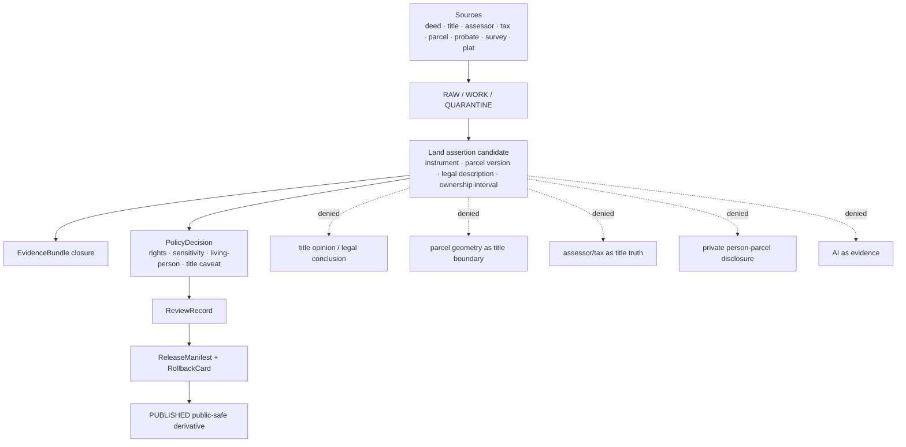

<!-- [KFM_META_BLOCK_V2]
doc_id: kfm://doc/contracts-domains-people-dna-land-land-ownership-readme
title: Land Ownership Contracts README — People / DNA / Land
type: readme
version: v0.1
status: draft; PROPOSED land-ownership contract subfolder; restricted-review; NEEDS VERIFICATION before promotion
owners:
  - OWNER_TBD — People/DNA/Land domain steward
  - OWNER_TBD — Land/title assertion steward
  - OWNER_TBD — Parcel/legal-description steward
  - OWNER_TBD — Living-person privacy steward
  - OWNER_TBD — Source steward
  - OWNER_TBD — Evidence steward
  - OWNER_TBD — Schema steward
  - OWNER_TBD — Policy steward
  - OWNER_TBD — Release steward
  - OWNER_TBD — Docs steward
created: 2026-06-22
updated: 2026-06-22
policy_label: restricted-review; title-sensitive; parcel-sensitive; person-parcel-deny-default; evidence-bound; source-role-aware; release-gated; rollback-aware; not-title-opinion; not-legal-advice
tags: [kfm, contracts, people-dna-land, land-ownership, README, semantic-contracts, title-sensitive, parcel, legal-description, land-instrument, deed, title, assessor-record, tax-record, ownership-interval, chain-of-title, evidencebundle, privacy, restricted]
related:
  - ../README.md
  - ../../../../docs/domains/people-dna-land/LAND_OWNERSHIP.md
  - ../../../../docs/domains/people-dna-land/sublanes/land_ownership.md
  - ../../../../docs/domains/people-dna-land/SCOPE_AND_BOUNDARY.md
  - ../../../../docs/domains/people-dna-land/CANONICAL_PATHS.md
  - ../../../../docs/domains/people-dna-land/SENSITIVITY_PROFILE.md
  - ../../../../docs/domains/people-dna-land/sublanes/README.md
  - ../../../../packages/domains/people-dna-land/land-ownership/README.md
  - ../../../../pipelines/domains/people-dna-land/land-ownership/README.md
  - ../../../../pipeline_specs/people-dna-land/land-ownership/README.md
  - ../../../../schemas/contracts/v1/domains/people-dna-land/
  - ../../../../policy/domains/people-dna-land/
  - ../../../../fixtures/domains/people-dna-land/
  - ../../../../tests/domains/people-dna-land/
  - ../../../../release/candidates/people-dna-land/
notes:
  - "Filled the existing empty README at contracts/domains/people-dna-land/land-ownership/README.md."
  - "The domain segment people-dna-land is supported by current repo docs; this land-ownership contract subfolder is treated as PROPOSED pending steward/ADR acceptance."
  - "This README orients semantic contracts only. It does not create schema, policy, source registry, lifecycle-data, release, consent, proof, receipt, title, or publication authority."
  - "Land-ownership claims remain evidence-bound assertions. Assessor/tax records are administrative context, parcel geometry is not title proof, and this folder must never present KFM output as legal advice or a title opinion."
[/KFM_META_BLOCK_V2] -->

<a id="top"></a>

# Land Ownership Contracts — People / DNA / Land

README for land-ownership semantic contracts under `contracts/domains/people-dna-land/land-ownership/`; this folder may describe land, parcel, instrument, legal-description, ownership-interval, and chain-of-title meanings, but it must not become a title authority, schema home, policy home, source registry, lifecycle-data store, release gate, or publication authority.

<p>
  
  
  
  
  
  
  
  
</p>

> [!IMPORTANT]
> **Status:** draft / README-like contract folder orientation  
> **Path:** `contracts/domains/people-dna-land/land-ownership/README.md`  
> **Owning root:** `contracts/` — human-readable semantic meaning for domain objects and edges.  
> **Domain segment:** `people-dna-land`.  
> **Land-ownership subdivision posture:** **PROPOSED / NEEDS VERIFICATION**. The whole-domain contract lane is valid as a responsibility-root pattern, but this child folder must not become a parallel authority without steward acceptance or ADR-backed placement.

> [!CAUTION]
> KFM land ownership is **evidence, not title**. This folder may define semantic contracts for evidence-bound assertions and contract meaning. It must never present KFM output as a legal title opinion, marketable-title determination, survey boundary, parcel adjudication, water/mineral-right conclusion, heirship ruling, or legal advice.

## Quick jumps

[Scope](#scope) · [Repo fit](#repo-fit) · [Accepted inputs](#accepted-inputs) · [Exclusions](#exclusions) · [Authority boundaries](#authority-boundaries) · [Expected contract families](#expected-contract-families) · [Trust-boundary flow](#trust-boundary-flow) · [Sensitivity and publication gates](#sensitivity-and-publication-gates) · [Validation expectations](#validation-expectations) · [Maintenance checklist](#maintenance-checklist) · [Rollback](#rollback) · [Open questions](#open-questions) · [Evidence basis](#evidence-basis)

---

## Scope

`contracts/domains/people-dna-land/land-ownership/` is the proposed contract-folder home for human-readable semantic contracts that explain land ownership meaning inside the People / DNA / Land bounded context.

This README is for maintainers who need to know what kinds of land-ownership contract documents may live here, which evidence and publication gates they must respect, and which claims must fail closed.

In scope:

- land ownership assertions;
- land instruments, deed instruments, title instruments, patents, mortgages, liens, easements, leases, probate/court instruments, and related recorded-document semantics;
- legal descriptions, PLSS references, parcel versions, land parcels, parcel-context caveats, and geometry-versus-title boundaries;
- ownership intervals and chain-of-title candidate reasoning;
- assessor record and tax record semantics as **administrative context**, not title truth;
- source-role discipline for recorder, assessor, tax, court, probate, survey, plat, public-land, user-supplied, OCR, georeferenced, modeled, and aggregate material;
- EvidenceBundle, ReviewRecord, PolicyDecision, ReleaseManifest, CorrectionNotice, and RollbackCard expectations for any public-safe derivative.

Out of scope here:

- machine schemas;
- policy rules;
- source registries;
- raw deeds, plats, title files, parcel downloads, tax rolls, assessor tables, OCR text, scans, or source payloads;
- legal advice, title opinions, title insurance, marketable-title conclusions, survey opinions, or court determinations;
- living-person private person↔parcel joins except as denied/restricted contract examples;
- public APIs, UI, Focus Mode render behavior, MapLibre layers, or generated AI answers.

---

## Repo fit

| Responsibility | Path or root | This README's position |
|---|---|---|
| Human-readable land-ownership contract meaning | `contracts/domains/people-dna-land/land-ownership/` | This requested folder. **PROPOSED** subdivision; safe as an orientation layer. |
| Whole-domain semantic contracts | `contracts/domains/people-dna-land/` | Parent contract lane for People / DNA / Land object meanings; parent README existence remains NEEDS VERIFICATION in this session. |
| Domain land doctrine | `docs/domains/people-dna-land/LAND_OWNERSHIP.md` | Land ownership model and title-sensitive doctrine. |
| Land sublane doctrine | `docs/domains/people-dna-land/sublanes/land_ownership.md` | Sublane-level land ownership guidance; surfaces duplicate/path-convention issues. |
| Domain boundary doctrine | `docs/domains/people-dna-land/SCOPE_AND_BOUNDARY.md` | Defines owned and non-owned object families and cross-lane seams. |
| Canonical path register | `docs/domains/people-dna-land/CANONICAL_PATHS.md` | Responsibility-root fan-out and path conflict notes. |
| Package helper README | `packages/domains/people-dna-land/land-ownership/README.md` | Implementation-helper boundary; not semantic-contract authority. |
| Pipeline/spec READMEs | `pipelines/domains/people-dna-land/land-ownership/README.md`, `pipeline_specs/people-dna-land/land-ownership/README.md` | Executable/declarative flow boundaries; not contract authority. |
| Machine schemas | `schemas/contracts/v1/domains/people-dna-land/` | Machine-checkable shapes; this README must not define schema authority. |
| Policy | `policy/domains/people-dna-land/`, plus accepted sensitivity/rights/access homes | Allow/deny/restrict/abstain decisions. |
| Fixtures/tests | `fixtures/domains/people-dna-land/`, `tests/domains/people-dna-land/` | Proof of validator and policy behavior. |
| Source registry | `data/registry/sources/people-dna-land/` or repo-confirmed registry home | Source roles, rights, cadence, caveats, and activation state. |
| Lifecycle data | `data/raw/`, `data/work/`, `data/quarantine/`, `data/processed/`, `data/catalog/`, `data/published/` domain segments | Evidence-bearing artifacts by lifecycle phase; not contract docs. |
| Release and rollback | `release/candidates/people-dna-land/` and release roots | Promotion decisions, release manifests, correction notices, rollback cards. |

> [!WARNING]
> Do **not** create subfolder-specific parallel homes such as `schemas/.../land-ownership/`, `policy/.../land-ownership/`, `data/raw/.../land-ownership/`, or `release/.../land-ownership/` from this README alone. If subdivision is needed beyond contract documentation, record an ADR or migration note first.

---

## Accepted inputs

A land-ownership contract in this folder may describe how the following inputs are interpreted after admission through the KFM trust membrane. These are not raw-data storage permissions.

| Input family | Typical source role posture | Contract requirement |
|---|---|---|
| Deeds, patents, mortgages, liens, leases, easements, probate/court instruments, title instruments | `observed`, `administrative`, `regulatory`, or source-specific after admission | Preserve instrument role, source, recording context, execution/effective/recording dates, parties as stated, citation, and caveats. |
| Assessor records and tax records | `administrative` | Must remain administrative context; never title truth. |
| Parcel layers, parcel IDs, parcel versions, and geometry refs | source-specific; often administrative/derived/context | Must carry geometry source, version, CRS/geography refs, precision caveats, and the rule that geometry is not title boundary proof. |
| Legal descriptions | evidence-bearing text/value objects | Preserve original text; normalized/parsed form must carry confidence and parser caveats. |
| PLSS, subdivision, lot/block, metes-and-bounds, survey, plat, and georeferenced hints | source-specific context | Keep source/vintage/geometry role explicit; do not turn hints into survey or title truth. |
| Grantor, grantee, owner-of-record, heir, trustee, executor, claimant, and party strings | assertion/context until resolved by People identity review | Keep as-stated names separate from PersonCanonical or entity truth. |
| Ownership interval and chain candidates | derived/candidate | Must show gaps, conflicts, contradiction state, evidence refs, and review state; never claim completeness by default. |
| Mineral, water, access, railroad, road, right-of-way, reservation, or severed-estate clues | source-specific; often restricted/review-required | Must preserve separate interest type and avoid legal conclusions. |
| Evidence, policy, release, correction, and rollback refs | governance/trust artifacts | Required for any public-safe derivative. |

---

## Exclusions

| Do not put here | Correct owner / home | Reason |
|---|---|---|
| Raw deeds, scans, OCR payloads, title files, tax rolls, assessor tables, parcel downloads, survey files, or probate packets | `data/raw/people-dna-land/`, `data/work/people-dna-land/`, or `data/quarantine/people-dna-land/` | Lifecycle and access controls must remain auditable outside contracts. |
| JSON Schema files | `schemas/contracts/v1/domains/people-dna-land/` | Schemas own machine-checkable shape. |
| OPA/Rego/policy files, rights rules, access rules, or redaction rules | `policy/domains/people-dna-land/` and accepted rights/sensitivity/access policy homes | Policy owns allow/deny/restrict/abstain behavior. |
| Source descriptors and source registries | `data/registry/sources/people-dna-land/` or repo-confirmed source-registry home | Source authority, cadence, rights, and caveats are registry state. |
| Consent records or living-person privacy decisions | Consent/policy/review-console homes | Consent and living-person gates are governance state, not README text. |
| PersonCanonical records or private person↔parcel joins | Lifecycle data and governed canonical stores | Contracts describe meaning; they do not store people or private joins. |
| Title opinions, boundary adjudications, marketable-title decisions, legal advice, or survey certifications | External qualified professionals / official legal authority | KFM can carry cited evidence and caveats; it is not a legal or survey authority. |
| Public API routes, UI components, Focus Mode answers, or map layers | `apps/`, `ui/`, `web/`, governed API roots, or repo-confirmed homes | Public surfaces must use released artifacts and governed APIs. |
| AI-generated title, parcel, or chain narratives as truth | Governed AI outputs with AIReceipt and EvidenceBundle citations | Generated language is interpretive and evidence-subordinate. |

---

## Authority boundaries

Land-ownership contracts are assertion-first and source-role preserving. They describe how land claims are represented and reviewed; they do not make title true by being written down.



A valid land-ownership contract should preserve these boundaries:

- an instrument is evidence of its own source/recording context, not automatic ownership truth;
- assessor and tax records remain administrative context;
- parcel geometry remains a source/versioned geometry representation, not title boundary proof;
- legal descriptions preserve original text and parsing caveats;
- ownership intervals are asserted/derived, evidence-bound, and gap-aware;
- person/entity party strings remain as-stated assertions until resolved by governed identity review;
- living-person and private person↔parcel joins fail closed;
- public outputs are released derivatives, not canonical stores;
- correction, revocation, source withdrawal, and rollback must invalidate downstream derivatives.

---

## Expected contract families

The exact file list under this folder is **PROPOSED** until maintainers settle the land-ownership subdivision and schema/contract inventory. Likely candidates include:

| Contract doc candidate | Purpose | Default posture |
|---|---|---|
| `README.md` | This orientation file. | Draft / restricted-review. |
| `land_instrument.md` | Parent meaning for recorded instruments affecting land interests. | Evidence-bound; not legal advice. |
| `deed_instrument.md` | Deed-specific instrument semantics. | Source-role and recording-date aware. |
| `title_instrument.md` | Title-bearing or title-relevant instrument semantics. | Not marketable-title determination. |
| `land_ownership_assertion.md` | Claim that a person/entity held an interest in land over a scoped interval. | Assertion-first; review-required. |
| `ownership_interval.md` | Derived or asserted time interval over evidence-bound ownership claims. | Gap/conflict surfacing required. |
| `land_parcel.md` | Parcel identity/context semantics. | Geometry not title proof. |
| `parcel_version.md` | Versioned parcel geometry/source snapshot semantics. | Source/vintage/CRS aware. |
| `legal_description.md` | Legal-description text and normalized parse semantics. | Original text preserved; parse confidence required. |
| `assessor_record.md` | Assessor context semantics. | Administrative; never title truth. |
| `tax_record.md` | Tax context semantics. | Administrative; never title truth. |
| `chain_of_title_candidate.md` | Candidate chain reasoning and gap/conflict behavior. | Never title opinion; cite-or-abstain. |
| `land_release_profile.md` | Public-safe derivative wording and required caveats. | Release-gated; rollback-ready. |

> [!NOTE]
> These are not implementation claims. They are a reviewable planning set for future contract files in this folder.

---

## Trust-boundary flow

```text
RAW source material
  -> WORK normalization
  -> QUARANTINE when rights, source role, parcel/person join, title caveat, evidence, or sensitivity is unresolved
  -> PROCESSED assertion candidates
  -> CATALOG / TRIPLET / EvidenceBundle-backed graph candidates
  -> steward review + policy checks
  -> PUBLISHED public-safe derivative only after ReleaseManifest + rollback target
```

Contract text in this folder should be written for that flow. Do not describe a shortcut where a deed, assessor row, tax record, parcel polygon, AI explanation, or chain narrative is published directly as title truth.

---

## Sensitivity and publication gates

Minimum gates for any land-ownership contract touching publication:

| Gate | Required behavior |
|---|---|
| Title-truth gate | KFM does not issue title opinions or marketable-title determinations; public wording must say evidence/assertion/context, not certified title. |
| Assessor/tax gate | Assessor and tax records remain administrative and never satisfy title by themselves. |
| Parcel-geometry gate | Parcel geometry, parcel IDs, and map layers do not prove title boundaries. |
| Private person↔parcel gate | Private person-parcel joins default to `DENY`, `HOLD`, or restricted review unless policy explicitly permits a transformed surface. |
| Living-person gate | Living-person ownership or residence disclosure fails closed unless policy/consent/review allow the requested use. |
| Rights gate | Unknown source rights, terms, or redistribution posture blocks promotion. |
| Evidence gate | EvidenceRef must resolve to EvidenceBundle before claims are rendered as authoritative. |
| Review gate | Chain-of-title, ownership interval, parcel conflict, sensitive residence, heirship, mineral/water/severed-estate, and legal-description conflicts require review before release. |
| Release gate | Public derivative requires ReleaseManifest, correction path, and rollback target. |

---

## Validation expectations

Before any contract in this folder can be treated as more than draft, validation should prove:

- the target contract file belongs under the accepted contract-home convention;
- schemas exist in the accepted schema home and do not drift from the contract meaning;
- valid and invalid fixtures cover assessor-as-title denial, parcel-geometry-as-boundary denial, unresolved EvidenceRef, source-role collapse, chain gap, conflicting instruments, private person↔parcel joins, and living-person ownership disclosure;
- policy tests deny legal/title advice framing, unreviewed public private joins, rights-uncertain sources, missing release manifests, and missing rollback targets;
- release tests require caveat text for assessor/tax/parcel/title uncertainty;
- public DTOs use generalized, cited, public-safe derivatives only;
- AI answers cite EvidenceBundles and abstain when support is insufficient.

---

## Maintenance checklist

- [ ] Confirm whether `contracts/domains/people-dna-land/land-ownership/` is accepted by ADR or steward decision.
- [ ] Confirm parent `contracts/domains/people-dna-land/README.md` exists and links here.
- [ ] Confirm accepted schema home for People/DNA/Land land-ownership object shapes.
- [ ] Confirm policy homes for title-sensitive, private person↔parcel, rights, living-person, source-role, and release gates.
- [ ] Add no-leak fixtures for private person↔parcel joins, living-person ownership, parcel geometry overclaim, assessor/tax overclaim, and source-role ambiguity.
- [ ] Add rollback fixtures for source correction, instrument contradiction, parcel-version correction, chain gap discovery, evidence withdrawal, and public wording overclaim.
- [ ] Update docs when a land-ownership contract file is created, renamed, moved, or retired.

---

## Rollback

Rollback or correction is required when this README or any child contract:

- implies land-ownership subfolder authority before ADR/steward acceptance;
- turns assessor/tax records into title truth;
- turns parcel geometry into title-boundary proof;
- turns a single deed/instrument into complete title or current ownership truth;
- weakens living-person, private person↔parcel, rights, source-role, evidence, review, release, or rollback gates;
- stores raw source data, private person↔parcel joins, or policy records in the contract tree;
- creates parallel schema, policy, registry, lifecycle, release, proof, or receipt homes;
- publishes private, rights-uncertain, or title-sensitive claims without ReleaseManifest and rollback target;
- removes correction/revocation/source-withdrawal propagation from contract meaning.

Rollback target: revert the offending README/contract commit, add a `DRIFT_REGISTER` entry if authority boundaries were affected, and invalidate any downstream public-facing derivative that cited the weakened contract.

---

## Open questions

| ID | Question | Status |
|---|---|---|
| OQ-PDL-LAND-CONTRACT-01 | Should `land-ownership/` exist under `contracts/domains/people-dna-land/`, or should land contracts live flat in the whole-domain contract folder? | OPEN / NEEDS VERIFICATION |
| OQ-PDL-LAND-CONTRACT-02 | How should this folder relate to `docs/domains/people-dna-land/sublanes/land_ownership.md`, `sublanes/land.md`, and other land README variants? | CONFLICTED / ADR NEEDED |
| OQ-PDL-LAND-CONTRACT-03 | Which contract files should be created first: land instrument, ownership assertion, parcel version, legal description, assessor record, or release profile? | OPEN |
| OQ-PDL-LAND-CONTRACT-04 | What schema-home convention should pair with this folder without creating parallel authority? | OPEN / NEEDS VERIFICATION |
| OQ-PDL-LAND-CONTRACT-05 | Which public-safe examples may be used in fixtures without exposing living people, private ownership joins, rights-uncertain deeds, or title-sensitive material? | OPEN / REVIEW REQUIRED |

---

## Evidence basis

| Evidence | Supports | Limit |
|---|---|---|
| `contracts/domains/people-dna-land/land-ownership/README.md` | Target file existed as an empty blob and needed content. | Empty file had no contract content. |
| `docs/domains/people-dna-land/LAND_OWNERSHIP.md` | Land doctrine: KFM land ownership is evidence, not title; assessor/tax records are not title truth; parcel geometry is not title-boundary proof; owned land object families are named. | Some paths in that doc carry prior PROPOSED/NEEDS VERIFICATION caveats. |
| `docs/domains/people-dna-land/sublanes/land_ownership.md` | Sublane doctrine: land ownership is assertion-first, evidence-bound, and duplicate/path-convention issues are already surfaced. | It is docs doctrine, not contract implementation proof. |
| `docs/domains/people-dna-land/SCOPE_AND_BOUNDARY.md` | People/DNA/Land owns land instruments, ownership intervals, chain-of-title reasoning, consent/review/correction, and private controls; neighboring lanes provide context only. | Contains prior repo-depth and path conflict caveats. |
| `docs/domains/people-dna-land/CANONICAL_PATHS.md` | Responsibility-root fan-out and domain segment placement for People/DNA/Land. | Treats many paths as PROPOSED until verified and surfaces path conflicts. |
| `docs/domains/people-dna-land/SENSITIVITY_PROFILE.md` | Deny-by-default posture for private person↔parcel joins, living-person fields, DNA, and sensitivity transitions. | Policy implementation remains NEEDS VERIFICATION. |
| `packages/domains/people-dna-land/land-ownership/README.md` | Existing repo-native land-ownership package README style and responsibility-root separation warnings. | Package root is implementation helper space, not contract authority. |

[Back to top](#top)
