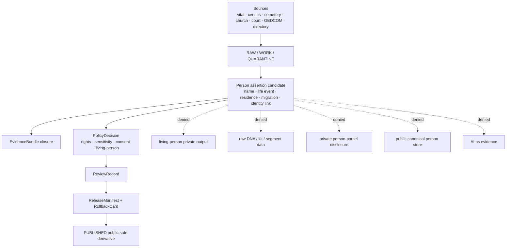

<!-- [KFM_META_BLOCK_V2]
doc_id: kfm://doc/contracts-domains-people-dna-land-people-readme
title: People Contracts README — People / DNA / Land
type: readme
version: v0.1
status: draft; PROPOSED people contract subfolder; restricted-review; NEEDS VERIFICATION before promotion
owners:
  - OWNER_TBD — People/DNA/Land domain steward
  - OWNER_TBD — Person assertion steward
  - OWNER_TBD — Identity-resolution steward
  - OWNER_TBD — Living-person privacy steward
  - OWNER_TBD — Consent steward
  - OWNER_TBD — Source steward
  - OWNER_TBD — Evidence steward
  - OWNER_TBD — Schema steward
  - OWNER_TBD — Policy steward
  - OWNER_TBD — Release steward
  - OWNER_TBD — Docs steward
created: 2026-06-22
updated: 2026-06-22
policy_label: restricted-review; living-person-aware; assertion-first; identity-resolution; evidence-bound; consent-aware; source-role-aware; release-gated; rollback-aware; not-canonical-store; not-publication-authority
tags: [kfm, contracts, people-dna-land, people, README, semantic-contracts, PersonAssertion, PersonCanonical, PersonIdentityCandidate, NameAssertion, LifeEvent, ResidenceEvent, MigrationEvent, EvidenceBundle, ConsentGrant, RevocationReceipt, living-person, privacy, restricted]
related:
  - ../README.md
  - ../../../../docs/domains/people-dna-land/sublanes/people.md
  - ../../../../docs/domains/people-dna-land/IDENTITY_MODEL.md
  - ../../../../docs/domains/people-dna-land/SCOPE_AND_BOUNDARY.md
  - ../../../../docs/domains/people-dna-land/CANONICAL_PATHS.md
  - ../../../../docs/domains/people-dna-land/SENSITIVITY_PROFILE.md
  - ../../../../docs/domains/people-dna-land/CONSENT_MODEL.md
  - ../../../../docs/domains/people-dna-land/sublanes/README.md
  - ../../../../docs/domains/people-dna-land/sublanes/genealogy.md
  - ../../../../contracts/domains/people-dna-land/genealogy/README.md
  - ../../../../contracts/domains/people-dna-land/land-ownership/README.md
  - ../../../../schemas/contracts/v1/domains/people-dna-land/
  - ../../../../policy/domains/people-dna-land/
  - ../../../../fixtures/domains/people-dna-land/
  - ../../../../tests/domains/people-dna-land/
  - ../../../../release/candidates/people-dna-land/
notes:
  - "Replaced placeholder content at contracts/domains/people-dna-land/people/README.md."
  - "The domain segment people-dna-land is supported by current repo docs; this people contract subfolder is treated as PROPOSED pending steward/ADR acceptance."
  - "This README orients semantic contracts only. It does not create schema, policy, source registry, lifecycle-data, release, consent, proof, receipt, canonical-person store, or publication authority."
  - "Person claims remain assertion-first and evidence-bound; living-person outputs fail closed unless evidence, rights, consent, policy, review, release, and rollback gates pass."
[/KFM_META_BLOCK_V2] -->

<a id="top"></a>

# People Contracts — People / DNA / Land

README for people semantic contracts under `contracts/domains/people-dna-land/people/`; this folder may describe person assertion, name assertion, identity-candidate, life-event, residence-event, migration-event, and person-canonical meanings, but it must not become a person store, schema home, policy home, source registry, consent store, lifecycle-data store, release gate, or publication authority.

<p>
  
  
  
  
  
  
  
  
</p>

> [!IMPORTANT]
> **Status:** draft / README-like contract folder orientation  
> **Path:** `contracts/domains/people-dna-land/people/README.md`  
> **Owning root:** `contracts/` — human-readable semantic meaning for domain objects and edges.  
> **Domain segment:** `people-dna-land`.  
> **People subdivision posture:** **PROPOSED / NEEDS VERIFICATION**. The whole-domain contract lane is valid as a responsibility-root pattern, but this child folder must not become a parallel authority without steward acceptance or ADR-backed placement.

> [!CAUTION]
> People contracts touch identity, names, residence, migration, family context, potentially living persons, and sometimes DNA-derived or land-linked inferences. Default public posture is **DENY / ABSTAIN / restricted review** until evidence, rights, source role, consent where required, sensitivity policy, review state, release state, correction path, and rollback target are all inspectable.

## Quick jumps

[Scope](#scope) · [Repo fit](#repo-fit) · [Accepted inputs](#accepted-inputs) · [Exclusions](#exclusions) · [Authority boundaries](#authority-boundaries) · [Expected contract families](#expected-contract-families) · [Trust-boundary flow](#trust-boundary-flow) · [Sensitivity and consent gates](#sensitivity-and-consent-gates) · [Validation expectations](#validation-expectations) · [Maintenance checklist](#maintenance-checklist) · [Rollback](#rollback) · [Open questions](#open-questions) · [Evidence basis](#evidence-basis)

---

## Scope

`contracts/domains/people-dna-land/people/` is the proposed contract-folder home for human-readable semantic contracts that explain people/person meaning inside the People / DNA / Land bounded context.

This README is for maintainers who need to know what kinds of people contract documents may live here, which gates they must respect, and which identity/publication claims must fail closed.

In scope:

- `PersonAssertion` / `Person Assertion` meanings;
- `PersonIdentityCandidate` meanings and identity-resolution boundaries;
- `PersonCanonical` semantics as a reviewed internal identity construct, not public truth by itself;
- `NameAssertion` meanings and name-as-stated discipline;
- `LifeEvent`, `ResidenceEvent`, and `MigrationEvent` meanings;
- source-role discipline for vital, cemetery, church, school, military, census, directory, court, probate, user-supplied, GEDCOM/tree, administrative, candidate, and modeled material;
- evidence, contradiction, confidence, review, correction, and rollback expectations for people-shaped claims;
- living-person, residence, DNA-derived, and private person↔parcel sensitivity boundaries.

Out of scope here:

- machine schemas;
- policy rules;
- source registries;
- consent records;
- raw GEDCOM, tree, source, census, vital-record, court, probate, or directory payloads;
- DNA kit/vendor IDs, DNA segments, or raw genomic material;
- land/title contracts except where a person record is cited as a party name or private person↔parcel risk;
- relationship/family-group contracts if the accepted ADR keeps genealogy as a separate contract folder;
- public APIs, UI, Focus Mode render behavior, MapLibre layers, or generated AI answers.

---

## Repo fit

| Responsibility | Path or root | This README's position |
|---|---|---|
| Human-readable people contract meaning | `contracts/domains/people-dna-land/people/` | This requested folder. **PROPOSED** subdivision; safe as an orientation layer. |
| Whole-domain semantic contracts | `contracts/domains/people-dna-land/` | Parent contract lane for People / DNA / Land object meanings; parent README existence remains NEEDS VERIFICATION in this session. |
| People sublane doctrine | `docs/domains/people-dna-land/sublanes/people.md` | People/person assertion and identity doctrine; surfaces flat-vs-subfolder conflict. |
| Identity model | `docs/domains/people-dna-land/IDENTITY_MODEL.md` | Domain identity-resolution model and deny-default identity posture. |
| Domain boundary doctrine | `docs/domains/people-dna-land/SCOPE_AND_BOUNDARY.md` | Defines owned and non-owned object families and cross-lane seams. |
| Canonical path register | `docs/domains/people-dna-land/CANONICAL_PATHS.md` | Responsibility-root fan-out and path conflict notes. |
| Sensitivity profile | `docs/domains/people-dna-land/SENSITIVITY_PROFILE.md` | Living-person, DNA, and private join deny-default posture. |
| Consent model | `docs/domains/people-dna-land/CONSENT_MODEL.md` | Consent and revocation gates; consent is not publication. |
| Genealogy contract README | `contracts/domains/people-dna-land/genealogy/README.md` | Adjacent proposed contract-folder orientation for relationships/life-event overlap. |
| Land ownership contract README | `contracts/domains/people-dna-land/land-ownership/README.md` | Adjacent proposed contract-folder orientation for land/title/person↔parcel overlap. |
| Machine schemas | `schemas/contracts/v1/domains/people-dna-land/` | Machine-checkable shapes; this README must not define schema authority. |
| Policy | `policy/domains/people-dna-land/`, plus accepted sensitivity/consent/access homes | Allow/deny/restrict/abstain decisions. |
| Fixtures/tests | `fixtures/domains/people-dna-land/`, `tests/domains/people-dna-land/` | Proof of validator and policy behavior. |
| Source registry | `data/registry/sources/people-dna-land/` or repo-confirmed registry home | Source roles, rights, cadence, caveats, and activation state. |
| Lifecycle data | `data/raw/`, `data/work/`, `data/quarantine/`, `data/processed/`, `data/catalog/`, `data/published/` domain segments | Evidence-bearing artifacts by lifecycle phase; not contract docs. |
| Release and rollback | `release/candidates/people-dna-land/` and release roots | Promotion decisions, release manifests, correction notices, rollback cards. |

> [!WARNING]
> Do **not** create subfolder-specific parallel homes such as `schemas/.../people/`, `policy/.../people/`, `data/raw/.../people/`, or `release/.../people/` from this README alone. If subdivision is needed beyond contract documentation, record an ADR or migration note first.

---

## Accepted inputs

A people contract in this folder may describe how the following inputs are interpreted after admission through the KFM trust membrane. These are not raw-data storage permissions.

| Input family | Typical source role posture | Contract requirement |
|---|---|---|
| Vital records | `observed`, `administrative`, or source-specific authority/context | Preserve name-as-stated, event type, event time, jurisdiction/source caveats, citation, and EvidenceRef. |
| Cemetery, burial, obituary, church, school, military, census, directory, court, and probate records | `observed`, `administrative`, `context`, or source-specific | Preserve source role, source time, event time, place context, uncertainty, and rights posture. |
| GEDCOM / GEDZip / tree export metadata | `candidate`, `modeled`, or source-declared role after admission | Treat as RAW intake only; never publish source IDs or tree contents directly. |
| Person name strings | assertion/context until reconciled | Keep `NameAssertion` distinct from canonical identity; preserve original spelling and source. |
| Identity-link candidates | `candidate` / `modeled` until reviewed | Must carry confidence, evidence refs, contradiction state, and review state. |
| Life/residence/migration event candidates | `observed`, `candidate`, or source-specific | Must preserve event type, location reference, temporal role, source caveat, and living-person risk. |
| DNA-derived identity hints | restricted; consent-gated; usually `candidate` / `modeled` derivative | Never public by default; raw kit/vendor IDs and segments stay outside this folder. |
| Land/person party references | source-role set by land-ownership contract | May support a person assertion or party-string assertion; does not create title truth or public person↔parcel disclosure. |
| Consent / revocation references | governance artifacts | A contract may require them, but the records live in consent/policy/registry homes. |

---

## Exclusions

| Do not put here | Correct owner / home | Reason |
|---|---|---|
| Raw GEDCOM files, uploaded family-tree exports, scans, OCR text, census payloads, vital-record payloads, or source files | `data/raw/people-dna-land/`, `data/work/people-dna-land/`, or `data/quarantine/people-dna-land/` | Lifecycle and rights controls must remain auditable outside contracts. |
| JSON Schema files | `schemas/contracts/v1/domains/people-dna-land/` | Schemas own machine-checkable shape. |
| OPA/Rego/policy files or consent rules | `policy/domains/people-dna-land/` and accepted consent/sensitivity policy homes | Policy owns allow/deny/restrict/abstain behavior. |
| Source descriptors and source registries | `data/registry/sources/people-dna-land/` or repo-confirmed source-registry home | Source authority, cadence, rights, and caveats are registry state. |
| ConsentGrant, RevocationReceipt, ConsentSidecar records | Consent registry / policy / review-console homes | Consent is a render-time governance gate, not a README artifact. |
| PersonCanonical records or living-person identity data | Lifecycle data and governed canonical stores | Contracts describe meaning; they do not store people. |
| DNA kit IDs, vendor IDs, raw segments, genotypes, or raw match tables | Restricted DNA lifecycle / consent-controlled homes | Never public; not contract text. |
| Land ownership, title, assessor, tax, parcel-version, and private person↔parcel data | Land-ownership contract/lifecycle/policy homes | People contracts may reference party names; they do not adjudicate title or publish private joins. |
| Public API routes, UI components, Focus Mode answers, or map layers | `apps/`, `ui/`, `web/`, governed API roots, or repo-confirmed homes | Public surfaces must use released artifacts and governed APIs. |
| AI-generated identity, biography, residence, or lineage narratives as truth | Governed AI outputs with AIReceipt and EvidenceBundle citations | Generated language is interpretive and evidence-subordinate. |

---

## Authority boundaries

People contracts are assertion-first and privacy-first. They describe how person-shaped claims are represented and reviewed; they do not make an identity true by being written down.



A valid people contract should preserve these boundaries:

- a source claim stays source-scoped and time-scoped;
- names remain `NameAssertion`-style evidence until reconciled;
- `PersonIdentityCandidate` remains a candidate until reviewed;
- `PersonCanonical` is a governed internal construct, not a public identity by itself;
- life/residence/migration events carry event time, source time, place context, and confidence/caveat;
- GEDCOM/tree imports are candidate/model material until reviewed;
- living-person, DNA-derived, and private person↔parcel material fail closed;
- public outputs are released derivatives, not canonical stores;
- correction, revocation, evidence withdrawal, and rollback must invalidate downstream derivatives.

---

## Expected contract families

The exact file list under this folder is **PROPOSED** until maintainers settle the people subdivision and schema/contract inventory. Likely candidates include:

| Contract doc candidate | Purpose | Default posture |
|---|---|---|
| `README.md` | This orientation file. | Draft / restricted-review. |
| `person_assertion.md` | Per-source claim that a person existed or was described by a source. | Evidence-bound; living-person fail-closed. |
| `person_identity_candidate.md` | Proposed cross-source identity link with confidence and support. | Candidate/review-required. |
| `person_canonical.md` | Curated internal identity construct from reviewed assertions. | Not public truth by itself. |
| `name_assertion.md` | A name exactly as stated by a source. | Original spelling/source retained. |
| `life_event.md` | Birth, death, marriage, burial, military, court, or other life-stage event assertion. | Time/source scoped. |
| `residence_event.md` | Residence/membership event with place/time/source caveats. | Exact living-person residence denied by default. |
| `migration_event.md` | Movement assertion between places/times. | Contextual; not route/corridor ownership. |
| `identity_resolution_profile.md` | Review and scoring posture for identity candidates. | Evidence-first; contradiction-aware. |
| `people_release_profile.md` | Public-safe derivative wording and required caveats. | Release-gated; rollback-ready. |

> [!NOTE]
> These are not implementation claims. They are a reviewable planning set for future contract files in this folder.

---

## Trust-boundary flow

```text
RAW source material
  -> WORK normalization
  -> QUARANTINE when rights, living-person status, DNA derivation, source role, or evidence is unresolved
  -> PROCESSED assertion candidates
  -> CATALOG / TRIPLET / EvidenceBundle-backed graph candidates
  -> steward review + policy + consent checks
  -> PUBLISHED public-safe derivative only after ReleaseManifest + rollback target
```

Contract text in this folder should be written for that flow. Do not describe a shortcut where a source record, GEDCOM, tree, AI answer, name string, census row, or residence event is published directly as canonical person truth.

---

## Sensitivity and consent gates

Minimum gates for any people contract touching publication:

| Gate | Required behavior |
|---|---|
| Living-person gate | If a person may be living, default to `DENY`, `HOLD`, or restricted review unless policy and consent explicitly allow the requested use. |
| Residence/privacy gate | Exact living-person residence or sensitive residence history fails closed unless policy permits a transformed/restricted surface. |
| DNA-derived gate | Raw DNA, kit IDs, vendor IDs, and segments are never public; DNA-derived identity hints are restricted and consent-scoped. |
| Private person↔parcel gate | Private person-parcel joins default to `DENY`, `HOLD`, or restricted review. |
| Rights gate | Unknown source rights, terms, or redistribution posture blocks promotion. |
| Source-role gate | Tree imports, modeled identity links, and candidate assertions cannot be upgraded into observed or canonical truth by promotion. |
| Evidence gate | EvidenceRef must resolve to EvidenceBundle before claims are rendered as authoritative. |
| Consent gate | Consent constrains rendering; it does not publish data on its own. Revocation must fail closed. |
| Review gate | Identity, living-person, DNA-derived, residence, culturally sensitive, and private-join claims require review before release. |
| Release gate | Public derivative requires ReleaseManifest, correction path, and rollback target. |

---

## Validation expectations

Before any contract in this folder can be treated as more than draft, validation should prove:

- the target contract file belongs under the accepted contract-home convention;
- schemas exist in the accepted schema home and do not drift from contract meaning;
- valid and invalid fixtures cover living-person private output, raw DNA-derived identity, private person↔parcel joins, tree-import authority collapse, unresolved EvidenceRef, source-role ambiguity, identity contradiction, and revoked consent;
- policy tests deny public canonical identity output, living-person residence disclosure, source-role collapse, missing consent, revoked consent, missing evidence closure, and missing release manifests;
- release tests require public-safe caveat text for person assertions, identity candidates, residence/migration events, and canonical-person summaries;
- public DTOs use generalized, cited, public-safe derivatives only;
- AI answers cite EvidenceBundles and abstain when support is insufficient.

---

## Maintenance checklist

- [ ] Confirm whether `contracts/domains/people-dna-land/people/` is accepted by ADR or steward decision.
- [ ] Confirm parent `contracts/domains/people-dna-land/README.md` exists and links here.
- [ ] Confirm accepted schema home for People/DNA/Land people object shapes.
- [ ] Confirm policy homes for living-person, consent, revocation, source-role, rights, residence, private person↔parcel, and release gates.
- [ ] Add no-leak fixtures for living-person output, living-person residence, raw DNA identifiers, private person↔parcel joins, unreviewed tree imports, and identity contradictions.
- [ ] Add rollback fixtures for consent revocation, source correction, identity merge/split correction, evidence withdrawal, and public wording overclaim.
- [ ] Update docs when a people contract file is created, renamed, moved, or retired.

---

## Rollback

Rollback or correction is required when this README or any child contract:

- implies people subfolder authority before ADR/steward acceptance;
- turns source rows, GEDCOM/tree imports, name strings, family lore, or AI narratives into person truth;
- publishes a `PersonCanonical` or identity candidate as public identity without release gates;
- weakens living-person, DNA-derived, consent, rights, source-role, review, release, or rollback gates;
- stores raw source data, DNA identifiers, private person data, private residence data, or consent records in the contract tree;
- creates parallel schema, policy, registry, lifecycle, release, proof, or receipt homes;
- publishes private or rights-uncertain claims without ReleaseManifest and rollback target;
- removes correction/revocation propagation from contract meaning.

Rollback target: revert the offending README/contract commit, add a `DRIFT_REGISTER` entry if authority boundaries were affected, and invalidate any downstream public-facing derivative that cited the weakened contract.

---

## Open questions

| ID | Question | Status |
|---|---|---|
| OQ-PDL-PEOPLE-CONTRACT-01 | Should `people/` exist under `contracts/domains/people-dna-land/`, or should people contracts live flat in the whole-domain contract folder? | OPEN / NEEDS VERIFICATION |
| OQ-PDL-PEOPLE-CONTRACT-02 | Should genealogy remain inside people contracts or stay in a separate `genealogy/` contract folder? | CONFLICTED / ADR NEEDED |
| OQ-PDL-PEOPLE-CONTRACT-03 | Which contract files should be created first: person assertion, identity candidate, person canonical, name assertion, life event, residence event, or release profile? | OPEN |
| OQ-PDL-PEOPLE-CONTRACT-04 | What schema-home convention should pair with this folder without creating parallel authority? | OPEN / NEEDS VERIFICATION |
| OQ-PDL-PEOPLE-CONTRACT-05 | Which public-safe examples may be used in fixtures without exposing living people, real DNA, private residences, or rights-uncertain family-tree data? | OPEN / REVIEW REQUIRED |

---

## Evidence basis

| Evidence | Supports | Limit |
|---|---|---|
| `contracts/domains/people-dna-land/people/README.md` | Target file existed but contained only placeholder text (`y`). | Placeholder had no contract content. |
| `docs/domains/people-dna-land/sublanes/people.md` | People doctrine: person assertions, PersonCanonical, NameAssertion, PersonIdentityCandidate, LifeEvent, ResidenceEvent, MigrationEvent, assertion-first posture, and sublane path conflicts. | Docs sublane file, not contract implementation proof. |
| `docs/domains/people-dna-land/IDENTITY_MODEL.md` | Identity model: deny-default, EvidenceBundle/PolicyDecision/ReviewRecord/ReleaseManifest/rollback gates, and implementation-depth caveats. | Some schema/contract paths in that doc are PROPOSED and conflict with newer Directory Rules path posture. |
| `docs/domains/people-dna-land/SENSITIVITY_PROFILE.md` | Deny-by-default posture for living-person fields, DNA, raw kit/vendor identifiers, private person↔parcel joins, and sensitivity tiers. | Policy implementation remains NEEDS VERIFICATION. |
| `docs/domains/people-dna-land/CONSENT_MODEL.md` | Consent is a render-time constraint, not publication permission; revocation fails closed. | Detailed consent machinery is PROPOSED implementation. |
| `contracts/domains/people-dna-land/genealogy/README.md` | Adjacent proposed contract-folder README style and relationship/genealogy boundary. | Proposed subfolder; not authority by itself. |
| `contracts/domains/people-dna-land/land-ownership/README.md` | Adjacent proposed contract-folder README style and private person↔parcel boundary. | Proposed subfolder; not authority by itself. |

[Back to top](#top)
