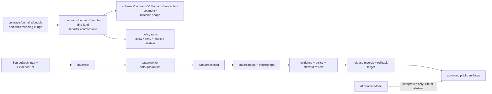

<!-- [KFM_META_BLOCK_V2]
doc_id: kfm://doc/contracts-domains-people-readme
title: contracts/domains/people/ — People Semantic Contract Bridge
type: readme
version: v0.1
status: draft; short-segment bridge; restricted-review; NEEDS VERIFICATION before promotion
owners:
  - OWNER_TBD — People/DNA/Land domain steward
  - OWNER_TBD — Person assertion steward
  - OWNER_TBD — Identity-resolution steward
  - OWNER_TBD — Living-person privacy steward
  - OWNER_TBD — Consent steward
  - OWNER_TBD — Source steward
  - OWNER_TBD — Evidence steward
  - OWNER_TBD — Schema steward
  - OWNER_TBD — Policy steward
  - OWNER_TBD — Release steward
  - OWNER_TBD — Docs steward
created: 2026-06-23
updated: 2026-06-23
policy_label: restricted-review; semantic-contracts; people; living-person-aware; assertion-first; evidence-bound; consent-aware; source-role-aware; release-gated; rollback-aware; not-schema-home; not-policy-home; not-data-home; not-canonical-person-store; not-publication-authority
tags: [kfm, contracts, domains, people, README, semantic-contracts, PersonAssertion, PersonCanonical, PersonIdentityCandidate, NameAssertion, LifeEvent, ResidenceEvent, MigrationEvent, EvidenceBundle, ConsentGrant, RevocationReceipt, PolicyDecision, ReleaseManifest, RollbackCard, living-person, restricted]
related:
  - ../README.md
  - ../people-dna-land/README.md
  - ../people-dna-land/people/README.md
  - ../people-dna-land/genealogy/README.md
  - ../people-dna-land/land-ownership/README.md
  - ../../../docs/domains/people-dna-land/README.md
  - ../../../docs/domains/people-dna-land/CANONICAL_PATHS.md
  - ../../../docs/domains/people-dna-land/IDENTITY_MODEL.md
  - ../../../docs/domains/people-dna-land/SENSITIVITY_PROFILE.md
  - ../../../docs/domains/people-dna-land/CONSENT_MODEL.md
  - ../../../schemas/contracts/v1/domains/people/
  - ../../../schemas/contracts/v1/domains/people-dna-land/
  - ../../../policy/domains/people-dna-land/
  - ../../../fixtures/domains/people-dna-land/
  - ../../../tests/domains/people-dna-land/
  - ../../../release/candidates/people-dna-land/
notes:
  - "Replaces an empty README at contracts/domains/people/README.md."
  - "Treats this path as a short-segment semantic-contract bridge, not as a new domain root and not as proof that the people segment is canonical."
  - "The broader People/Genealogy/DNA/Land contract lane remains contracts/domains/people-dna-land/ unless an ADR resolves the segment split differently."
  - "Contracts define meaning only; schemas, policy, validators, fixtures, source registries, lifecycle data, proofs, receipts, release records, API behavior, and UI behavior remain separate authority roots."
  - "Living-person outputs, DNA-derived identity hints, exact residence exposure, and private person-parcel joins fail closed unless evidence, rights, consent where required, policy, review, release, correction, and rollback gates all pass."
[/KFM_META_BLOCK_V2] -->

# People Semantic Contracts

README for the requested short-segment path `contracts/domains/people/`. This directory may orient human-readable semantic contracts for people/person objects, but it must not become a parallel domain authority, schema home, policy home, source registry, consent store, lifecycle-data store, canonical-person store, release gate, public API surface, UI surface, or publication authority.

  
  
  
  
  
  
  

> [!IMPORTANT]
> **Status:** draft / restricted-review README  
> **Path:** `contracts/domains/people/README.md`  
> **Owning root:** `contracts/` — human-readable semantic meaning only.  
> **Segment posture:** `people` is treated here as a short-segment bridge. The broader People/Genealogy/DNA/Land lane is still represented in the repo by `contracts/domains/people-dna-land/` and adjacent docs. Do not use this README alone to create duplicate schemas, policy bundles, lifecycle stores, or release lanes.

> [!CAUTION]
> People contracts touch identity, names, residence, migration, family context, potentially living persons, DNA-derived hints, and private person↔parcel joins. Public posture is **DENY / ABSTAIN / restricted review** until evidence, rights, source role, consent where required, sensitivity policy, review state, release state, correction path, and rollback target are all inspectable.

## Quick jumps

[Scope](#scope) · [Path posture](#path-posture) · [Repo fit](#repo-fit) · [Accepted inputs](#accepted-inputs) · [Exclusions](#exclusions) · [Expected people object families](#expected-people-object-families) · [Contract rules](#contract-rules) · [Trust-boundary flow](#trust-boundary-flow) · [Sensitivity and consent gates](#sensitivity-and-consent-gates) · [Validation expectations](#validation-expectations) · [Evidence basis](#evidence-basis) · [Rollback](#rollback) · [Definition of done](#definition-of-done) · [Open questions](#open-questions)

---

## Scope

`contracts/domains/people/` is a requested short-segment contracts path for people/person semantic-contract orientation.

This README is in scope for:

- explaining what people/person semantic contracts mean;
- preserving assertion-first identity language;
- naming living-person, residence, DNA-derived, and private person↔parcel risk gates;
- pointing maintainers to the broader `people-dna-land` domain contract lane;
- warning that this path is not a release, schema, policy, source, consent, data, API, UI, or AI authority;
- making the current segment tension visible instead of silently normalizing it.

This README is out of scope for:

- creating a new canonical domain segment;
- defining machine-checkable schema fields;
- authorizing public person records;
- storing `PersonCanonical` records, living-person records, GEDCOM/tree exports, DNA records, source scans, or residence data;
- deciding allow / deny / restrict / abstain policy outcomes;
- publishing AI-generated identity, biography, lineage, residence, or land narratives as truth.

---

## Path posture

This file exists because the requested target path is `contracts/domains/people/README.md`. It should be read as a compatibility/bridge README until the People/Genealogy/DNA/Land segment naming question is resolved.

| Path | Status | Meaning |
|---|---|---|
| `contracts/domains/people/README.md` | `CONFIRMED` current file after this update; `DRAFT / BRIDGE` posture | Short-segment people semantic-contract orientation. Does not supersede the broader lane. |
| `contracts/domains/people-dna-land/README.md` | `CONFIRMED` existing parent lane observed in repo | Broader People / Genealogy / DNA / Land contract-lane orientation. |
| `contracts/domains/people-dna-land/people/README.md` | `CONFIRMED` existing people subfolder README observed in repo | People/person contract-folder orientation inside the broader lane. |
| `schemas/contracts/v1/domains/people/` | `PROPOSED / NEEDS VERIFICATION` | Possible short-segment schema home if an ADR accepts it; not created or confirmed by this README. |
| `schemas/contracts/v1/domains/people-dna-land/` | `PROPOSED / NEEDS VERIFICATION` | Possible broader-domain schema home. Must not silently diverge from contracts. |
| `policy/domains/people-dna-land/` | `PROPOSED / NEEDS VERIFICATION` | Domain policy home for allow / deny / restrict / abstain behavior. |

> [!WARNING]
> Do not create sibling lifecycle, schema, policy, fixture, release, or source-registry paths under a short `people` segment from this README alone. If the project promotes the short segment to canonical, record that decision in an ADR or migration note and update both this README and `contracts/domains/people-dna-land/`.

---

## Repo fit

| Responsibility | Correct root | This README's boundary |
|---|---|---|
| Human-readable semantic contract notes | `contracts/` | This file may define meaning and guardrails only. |
| Whole-domain People/Genealogy/DNA/Land contracts | `contracts/domains/people-dna-land/` | Current broader contract lane; this README does not replace it. |
| People sublane contract orientation | `contracts/domains/people-dna-land/people/` | Existing adjacent people-oriented contract README; this README should converge with or redirect to it after ADR review. |
| Domain doctrine and architecture | `docs/domains/people-dna-land/` | Human-facing doctrine, boundaries, sensitivity, consent, and path registers. |
| Machine schemas | `schemas/contracts/v1/domains/<accepted-segment>/` | Schemas define machine shape. This README must not define field authority. |
| Policy and consent rules | `policy/domains/people-dna-land/` plus accepted sensitivity/consent homes | Policy decides finite allow / deny / restrict / abstain outcomes. |
| Fixtures and tests | `fixtures/domains/people-dna-land/`, `tests/domains/people-dna-land/` | Proof of validator and policy behavior. |
| Source registry | `data/registry/sources/people-dna-land/` or repo-confirmed source-registry home | Source roles, rights, cadence, caveats, activation state, and citation templates. |
| Lifecycle data | `data/raw/`, `data/work/`, `data/quarantine/`, `data/processed/`, `data/catalog/`, `data/published/` | Evidence-bearing artifacts by lifecycle phase; never contract docs. |
| Release and rollback | `release/` roots | Promotion decisions, release manifests, correction notices, rollback cards, signatures. |
| Public API / UI / Focus Mode | `apps/governed-api/`, `apps/explorer-web/`, or repo-confirmed governed surfaces | Public clients use governed interfaces and released artifacts only. |

---

## Accepted inputs

A people semantic contract may describe how admitted source material is interpreted after it passes source-intake and lifecycle gates. These are not raw-data storage permissions.

| Input family | Typical posture | Contract requirement |
|---|---|---|
| Vital, cemetery, burial, obituary, church, school, military, census, directory, court, and probate records | `observed`, `administrative`, `context`, or source-specific | Preserve name-as-stated, event type, event time, jurisdiction, source caveat, citation, rights posture, and EvidenceRef. |
| Person name strings and aliases | assertion/context until reviewed | Keep `NameAssertion` distinct from canonical identity; preserve original spelling and source. |
| Identity-link candidates | `candidate` / `modeled` until reviewed | Carry confidence, evidence references, contradiction state, review state, and rollback path. |
| Life, residence, and migration event candidates | `observed`, `candidate`, or source-specific | Preserve event type, location reference, temporal role, source caveat, and living-person risk. |
| GEDCOM / GEDZip / user tree metadata | `candidate`, `modeled`, or source-declared role after admission | Treat as candidate/model material until reviewed; raw tree payloads stay in lifecycle roots. |
| DNA-derived identity hints | restricted; consent-gated; usually `candidate` / `modeled` derivative | Never public by default; raw kit/vendor IDs and segments stay outside this folder. |
| Land/person party references | source-role set by the land-ownership contract | May support a person assertion or party-string assertion; does not create title truth or public person↔parcel disclosure. |
| Consent / revocation references | governance artifacts | A contract may require them, but records live in consent, policy, review, or registry homes. |

---

## Exclusions

| Do not put here | Correct owner / home | Reason |
|---|---|---|
| Raw GEDCOM files, uploaded family-tree exports, source scans, OCR text, census payloads, vital-record payloads, court files, probate files, or directory files | `data/raw/people-dna-land/`, `data/work/people-dna-land/`, or `data/quarantine/people-dna-land/` | Lifecycle and rights controls must remain auditable outside contracts. |
| JSON Schema files | `schemas/contracts/v1/domains/<accepted-segment>/` | Schemas own machine-checkable shape. |
| OPA/Rego/policy files, consent rules, rights rules, redaction rules | `policy/` roots | Policy owns finite allow / deny / restrict / abstain behavior. |
| Source descriptors and source registries | `data/registry/sources/` or repo-confirmed source-registry home | Source authority, cadence, rights, and caveats are registry state. |
| ConsentGrant, RevocationReceipt, ConsentSidecar, PolicyDecision, ReviewRecord, or ReleaseManifest records | Consent/policy/review/release homes | Contract docs may require these objects but must not store or issue them. |
| `PersonCanonical` records, living-person identity data, private residence records | Lifecycle data and governed canonical stores | Contracts describe meaning; they do not store people. |
| DNA kit IDs, vendor IDs, raw segments, genotypes, match tables, triangulation outputs | Restricted DNA lifecycle / consent-controlled homes | Never public; not contract text. |
| Land ownership, title, assessor, tax, parcel-version, and private person↔parcel data | Land-ownership contract/lifecycle/policy homes | People contracts may reference party names; they do not adjudicate title or publish private joins. |
| Public API routes, UI components, Focus Mode answers, map layers, or story outputs | Governed API/UI/release roots | Public surfaces must use released artifacts and governed APIs. |
| AI-generated identity, biography, residence, lineage, relationship, or title narratives as truth | Governed AI output with AIReceipt and EvidenceBundle citations | Generated language is interpretive and evidence-subordinate. |

---

## Expected people object families

These object-family names are semantic-contract candidates. Their field shapes, schema `$id` values, validators, fixtures, and release behavior remain `NEEDS VERIFICATION` unless separately confirmed.

| Object family | Meaning boundary | Public posture |
|---|---|---|
| `PersonAssertion` | A source-attributed claim about a person; identity is built from assertions, not asserted directly. | Depends on living-person, rights, evidence, and release gates. |
| `PersonIdentityCandidate` | A candidate identity cluster awaiting review and contradiction handling. | Not public truth. |
| `PersonCanonical` | A derived, evidence-bound canonical view over assertions. | Never sovereign truth; living-person cases fail closed. |
| `NameAssertion` | Source-attributed name claim preserving as-stated wording and source context. | Varies by source, time, living-person status, and release state. |
| `LifeEvent` | Typed event such as birth, baptism, marriage, death, burial, immigration, military service, court event, or probate event. | Living-person and exact-location gates apply. |
| `ResidenceEvent` | Place/time assertion connecting a person to a residence or settlement context. | Exact residence exposure fails closed unless reviewed and released. |
| `MigrationEvent` | Movement/corridor assertion with source and uncertainty. | Must preserve uncertainty and living-person risk. |
| `RelationshipAssertion` | Relationship/kinship claim that may cite person assertions or genealogy evidence. | Stays assertion/hypothesis unless evidence and review support stronger posture. |
| `ConsentGrant` reference | Scoped, revocable authorization required for restricted handling. | Stored outside this contract path; revocation must be honored. |
| `RevocationReceipt` reference | Record that consent was withdrawn and downstream cleanup must occur. | Stored outside this contract path; blocks affected releases. |

---

## Contract rules

People contracts under this path must preserve the following boundaries:

- contracts define semantic meaning, not machine shape;
- schemas define machine-checkable shape;
- policy roots decide allow / deny / restrict / abstain;
- source registries define source roles, rights, cadence, caveats, and activation state;
- lifecycle roots hold source material and evidence-bearing artifacts;
- fixtures and tests prove behavior;
- release roots record promotion, correction, supersession, withdrawal, and rollback;
- review records remain distinct from proof records and release records;
- people/person assertions remain distinct from canonical identity views;
- living-person, DNA-derived, exact-residence, and private person↔parcel claims fail closed unless all gates pass;
- AI may explain cited EvidenceBundles but must not create identity, residence, relationship, title, or release truth.

A people contract must not collapse source admission into evidence closure, validation success into release approval, source rows into public truth, assessor rows into title truth, parcel geometry into boundary proof, or generated narrative into evidence.

---

## Trust-boundary flow

Contracts describe meaning. They do not move data, validate schemas, make policy decisions, close evidence, perform review, publish artifacts, define routes, render maps, or authorize AI answers.

---

## Sensitivity and consent gates

| Risk family | Default posture | Contract wording requirement |
|---|---|---|
| Living-person identity, name, residence, or event | `DENY / HOLD / restricted review` | Public examples must be synthetic, historical, aggregate, or reviewed and released. |
| Exact residence or household exposure | `DENY` unless reviewed and transformed | Use generalization, aggregation, or abstention; cite release support. |
| Raw DNA / genomic / kit/vendor/segment data | `T4` deny by default | Never public; contracts may define references but not expose raw identifiers. |
| DNA-derived identity or relationship hints | restricted / review-required | Modeled/candidate, never authoritative on its own. |
| Private person↔parcel join | `DENY` by default | Generalized/restricted output only if policy allows. |
| Assessor/tax record as title | `DENY` | Administrative source role must be preserved. |
| Parcel geometry as title boundary | `DENY` | Geometry is context/version, not title proof. |
| Rights-uncertain source material | `HOLD / ABSTAIN` | Source registry and rights review required. |
| AI-generated relationship/title/person narrative | `ABSTAIN` as evidence | AI may explain cited EvidenceBundles only. |

---

## Validation expectations

Before this path can be treated as mature, maintainers should verify:

- whether `contracts/domains/people/` is accepted as a canonical short-segment, a compatibility bridge, or a redirect target;
- whether `contracts/domains/people-dna-land/people/` should remain the people subfolder or migrate into this path;
- every people contract has KFM Meta Block v2 and confirmed or placeholder owners;
- matching schemas exist for promoted object families and do not drift from contract meaning;
- fixtures cover living-person, exact-residence, DNA, consent, private person↔parcel, source-role collapse, unresolved EvidenceRef, missing ReleaseManifest, and rollback scenarios;
- policy tests enforce deny-by-default and consent/render gates;
- source registries record source role, rights, cadence, caveats, activation state, and citation templates;
- public DTOs and UI surfaces use released artifacts and governed APIs only;
- AI answers cite EvidenceBundles and abstain when support is insufficient;
- release and rollback artifacts exist for any public or semi-public derivative.

---

## Evidence basis

| Evidence | Status | Supports | Limits |
|---|---|---|---|
| Prior `contracts/domains/people/README.md` | `CONFIRMED` | Target file existed before this update and was empty. | Empty file did not establish semantic authority. |
| `contracts/README.md` | `CONFIRMED` | Contracts define semantic meaning; schemas, policy, validation, and source data are separate. | Does not resolve the People segment conflict. |
| `contracts/domains/README.md` | `CONFIRMED` | Domain-specific contract objects belong under the domain contract lane. | Minimal parent README; not a full path ADR. |
| `contracts/domains/people-dna-land/README.md` | `CONFIRMED` | Broader People / Genealogy / DNA / Land contract-lane orientation and restricted-review posture. | Does not make this short `people` path canonical. |
| `contracts/domains/people-dna-land/people/README.md` | `CONFIRMED` | Adjacent people contract-folder style and living-person fail-closed posture. | Proposed child subfolder; may need ADR/migration alignment with this path. |
| `docs/domains/people-dna-land/README.md` | `CONFIRMED doctrine / PROPOSED implementation` | Assertion-first identity, DNA restrictions, assessor/tax and parcel caveats, consent/release posture, and segment conflict. | It is a docs landing page, not schema/policy/runtime proof. |
| `Directory Rules` | `CONFIRMED doctrine` | Responsibility-root placement: contracts define meaning; schemas define shape; policy decides admissibility; domains appear as segments inside responsibility roots. | Specific People short-segment finality remains `NEEDS VERIFICATION` pending ADR or path register. |
| Uploaded authoring prompt v2 | `CONFIRMED user-supplied guidance` | Requires evidence-grounded, visually polished, implementation-honest Markdown with verification and rollback posture. | Authoring guidance, not implementation proof. |

---

## Rollback

Rollback or correction is required if this README:

- presents `contracts/domains/people/` as a settled canonical segment without ADR/path-register support;
- weakens living-person, DNA, consent, rights, source-role, evidence, review, release, or rollback gates;
- turns person assertions, identity candidates, tree imports, raw DNA, source rows, assessor/tax records, parcel geometry, family lore, or AI narratives into truth;
- suggests this path stores schemas, policies, source registries, consent records, lifecycle data, proofs, receipts, release records, canonical person records, API behavior, UI behavior, or public artifacts;
- hides the relationship between this short path and `contracts/domains/people-dna-land/`.

Rollback target: revert this README to prior empty blob SHA `8b137891791fe96927ad78e64b0aad7bded08bdc`, then record a drift or migration note if downstream documents cited this bridge as authority.

---

## Definition of done

- [ ] Segment decision recorded: canonical short segment, compatibility bridge, or redirect.
- [ ] ADR or path register reconciles `contracts/domains/people/` with `contracts/domains/people-dna-land/people/`.
- [ ] Object-level people contracts are created or explicitly marked absent.
- [ ] Matching schemas and `$id` values are verified.
- [ ] Policy tests cover living-person, DNA-derived, exact-residence, private person↔parcel, consent, rights, and release gates.
- [ ] Fixtures are synthetic or demonstrably public-safe and rights-safe.
- [ ] Public surfaces are verified to use governed APIs, released artifacts, EvidenceBundle resolution, PolicyDecision, ReviewRecord, ReleaseManifest, correction path, and RollbackCard.

---

## Open questions

| ID | Question | Status |
|---|---|---|
| OQ-PEOPLE-CONTRACTS-01 | Should `contracts/domains/people/` be canonical, a compatibility bridge, or a redirect to `contracts/domains/people-dna-land/people/`? | OPEN / ADR NEEDED |
| OQ-PEOPLE-CONTRACTS-02 | Should object contracts live flat under this path or remain under `contracts/domains/people-dna-land/people/`? | OPEN / NEEDS VERIFICATION |
| OQ-PEOPLE-CONTRACTS-03 | What accepted schema-home segment pairs with people semantic contracts? | OPEN / ADR NEEDED |
| OQ-PEOPLE-CONTRACTS-04 | Which synthetic examples are safe enough for people fixtures without exposing living persons, private residences, private parcels, or rights-uncertain records? | OPEN / REVIEW REQUIRED |
| OQ-PEOPLE-CONTRACTS-05 | Which people contract should be promoted first after schemas, policy tests, fixtures, and release checks exist? | OPEN |

<a href="#top">Back to top</a>

