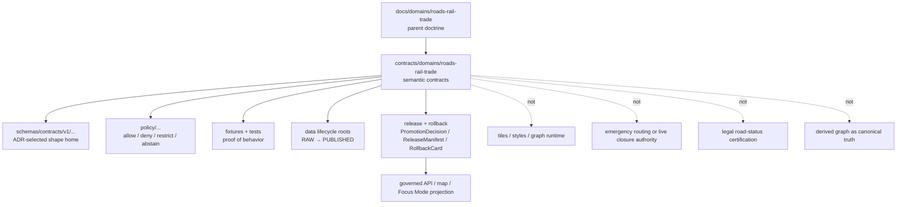

<!-- [KFM_META_BLOCK_V2]
doc_id: kfm://doc/contracts-domains-roads-rail-trade-readme
title: Roads / Rail / Trade Routes Contracts README
type: readme
version: v0.2
status: draft; semantic-contract-lane; PROPOSED; slug-CONFLICTED; NEEDS VERIFICATION before promotion
owners:
  - OWNER_TBD — Roads/Rail/Trade Routes domain steward
  - OWNER_TBD — Contracts steward
  - OWNER_TBD — Roads steward
  - OWNER_TBD — Rail steward
  - OWNER_TBD — Historic/trade-routes steward
  - OWNER_TBD — Source steward
  - OWNER_TBD — Evidence steward
  - OWNER_TBD — Schema steward
  - OWNER_TBD — Policy steward
  - OWNER_TBD — Release steward
  - OWNER_TBD — Docs steward
created: NEEDS VERIFICATION — scaffold existed before v0.2 expansion
updated: 2026-06-23
policy_label: public; contracts; roads-rail-trade; transport; semantic-contracts; source-role-aware; evidence-bound; time-aware; graph-projection-aware; release-gated; rollback-aware; slug-conflicted; not-schema-home; not-policy-home; not-data-home; not-publication-authority
tags: [kfm, contracts, roads-rail-trade, roads, rail, trade-routes, transport, road-segment, historic-route, rail-segment, depot, siding, yard, crossing, bridge, ferry, river-crossing, freight-corridor, route-event, operator-status, access-restriction, network-edge, movement-story-node, EvidenceBundle, PolicyDecision, ReleaseManifest, RollbackCard]
related:
  - ../roads/README.md
  - ../../../docs/domains/roads-rail-trade/README.md
  - ../../../docs/domains/roads-rail-trade/CANONICAL_PATHS.md
  - ../../../docs/domains/roads-rail-trade/OBJECT_FAMILIES.md
  - ../../../docs/domains/roads-rail-trade/IDENTITY_MODEL.md
  - ../../../docs/domains/roads-rail-trade/SOURCES.md
  - ../../../docs/domains/roads-rail-trade/MAP_UI_CONTRACTS.md
  - ../../../docs/domains/roads-rail-trade/GRAPH_PROJECTIONS.md
  - ../../../docs/domains/roads-rail-trade/DATA_LIFECYCLE.md
  - ../../../docs/domains/roads-rail-trade/sublanes/roads.md
  - ../../../docs/domains/roads-rail-trade/sublanes/rail.md
  - ../../../docs/domains/roads-rail-trade/sublanes/trade-routes.md
  - ../../../docs/runbooks/roads-rail-trade/PROMOTION_RUNBOOK.md
  - ../../../docs/runbooks/roads-rail-trade/ROLLBACK_RUNBOOK.md
  - ../../../schemas/contracts/v1/domains/roads-rail-trade/
  - ../../../policy/domains/roads-rail-trade/
  - ../../../fixtures/domains/roads-rail-trade/
  - ../../../tests/domains/roads-rail-trade/
  - ../../../release/candidates/roads-rail-trade/
notes:
  - "Expanded from a generic greenfield scaffold at contracts/domains/roads-rail-trade/README.md."
  - "This README is the human-readable semantic-contract lane guide for the observed contracts/domains/roads-rail-trade/ folder. It does not settle the documented roads-rail-trade vs transport contract/schema slug conflict."
  - "Current sibling contract files observed in this session are mostly PROPOSED scaffolds and must not be treated as authoritative implementation."
  - "Keep machine-checkable shape in schemas/, policy in policy/, fixtures in fixtures/, tests in tests/, source registries in data/registry, lifecycle artifacts in data/, and release/rollback in release/ unless an accepted ADR says otherwise."
[/KFM_META_BLOCK_V2] -->

<a id="top"></a>

# Roads / Rail / Trade Routes Contracts

Semantic-contract lane guide for `contracts/domains/roads-rail-trade/`, the observed human-readable contract folder for Roads / Rail / Trade Routes objects, relationships, events, and projections.

<p>
  
  
  
  
  
  
  
</p>

> [!IMPORTANT]
> **Status:** `draft` / semantic-contract-lane orientation  
> **Path:** `contracts/domains/roads-rail-trade/README.md`  
> **Owner:** `OWNER_TBD`  
> **Placement posture:** this folder exists in current repo evidence, but the broader Roads / Rail / Trade Routes doctrine records a contract/schema slug conflict between `roads-rail-trade` and `transport`. Treat this README as an observed contract-lane guide, not as an ADR resolving the slug.  
> **Truth posture:** contract docs define meaning only. Schemas, policies, fixtures, tests, source registries, release manifests, public APIs, map rendering, graph outputs, and runtime behavior remain **NEEDS VERIFICATION** unless separately cited.

> [!CAUTION]
> Do not use this `contracts/` folder as a bucket for schemas, policies, fixtures, tests, packages, pipelines, registries, source data, processed data, tiles, release manifests, or public API payloads. The previous scaffold implied that all of those belonged here; this revision corrects that boundary.

## Quick jumps

[Scope](#scope) · [Repo fit](#repo-fit) · [Accepted inputs](#accepted-inputs) · [Exclusions](#exclusions) · [Observed contract index](#observed-contract-index) · [Object-family boundaries](#object-family-boundaries) · [Authority boundaries](#authority-boundaries) · [Lifecycle](#lifecycle) · [Validation](#validation) · [Rollback](#rollback) · [Evidence basis](#evidence-basis) · [Open questions](#open-questions)

---

## Scope

`contracts/domains/roads-rail-trade/` is for human-readable semantic contracts that define what Roads / Rail / Trade Routes objects and relationships mean inside KFM.

This contract lane may describe:

- road, rail, and historic-route object meanings;
- source-role and temporal constraints for transport evidence;
- route, segment, membership, crossing, operator, restriction, status, and facility semantics;
- derived graph-projection boundaries;
- release, correction, rollback, and public-safe projection obligations;
- cross-lane boundaries with hydrology, settlements/infrastructure, archaeology, hazards, agriculture, people/land, and map/UI surfaces.

This contract lane does **not** prove implementation. Most sibling object files observed in this folder are still scaffolds. Treat the folder as a meaning surface until schemas, validators, fixtures, tests, policy decisions, release manifests, emitted proofs, and runtime/API/UI evidence are verified.

---

## Repo fit

| Responsibility | Correct root or current evidence | This README's boundary |
|---|---|---|
| Domain doctrine | `docs/domains/roads-rail-trade/` | Explains lane scope, object families, pipeline posture, source families, and path conflicts. |
| Semantic contracts | `contracts/domains/roads-rail-trade/` | This observed folder; draft until slug ADR and contract maturity are verified. |
| Road compatibility slice | `contracts/domains/roads/` | PROPOSED road-specific orientation; not canonical authority by itself. |
| Machine schemas | `schemas/contracts/v1/domains/roads-rail-trade/` or `schemas/contracts/v1/transport/` after ADR | Shape enforcement; not owned here. |
| Policy | `policy/domains/roads-rail-trade/` or ADR-selected alternate | Allow/deny/restrict/abstain decisions; not owned here. |
| Fixtures/tests | `fixtures/domains/roads-rail-trade/`, `tests/domains/roads-rail-trade/` | Proof of behavior; not owned here. |
| Source registry | `data/registry/sources/roads-rail-trade/` | Source authority, role, cadence, rights, and caveats. |
| Data lifecycle | `data/raw`, `data/work`, `data/quarantine`, `data/processed`, `data/catalog`, `data/published` lane segments | Source, intermediate, processed, catalog, and released artifacts. |
| Release/rollback | `release/candidates/roads-rail-trade/` and release roots | Promotion, release, correction, rollback. |

---

## Accepted inputs

Contract files here may define or refine semantics for:

| Input family | Accepted when | Guardrail |
|---|---|---|
| Road Segment / Rail Segment | Contract defines segment meaning, source role, geometry/time/evidence posture. | Segment is evidence/released derivative, not routing or legal-status truth by itself. |
| CorridorRoute / Historic Route / TradeRouteCorridor | Contract defines route/corridor entity meaning. | A route is not a segment; historic route claims preserve uncertainty. |
| RouteMembership | Contract defines sourced, time-scoped membership between segment and route/corridor. | Membership is separate from both route and segment. |
| Depot / Siding / Yard / TransportFacility | Contract defines transport function and evidence posture. | Settlement/infrastructure asset identity may be separately owned. |
| Crossing / Bridge / Ferry / River Crossing | Contract defines transport-side crossing relation. | Hydrology owns water evidence; infrastructure owns structure identity where applicable. |
| RouteEvent / StatusEvent / OperatorStatus / OperatorAssignment | Contract defines time-bound event or operator assertion. | Requires source-role and valid-time discipline. |
| AccessRestriction / RestrictionEvent | Contract defines restriction semantics. | Not live emergency or legal routing authority unless separately governed. |
| NetworkEdge / graph projection | Contract defines derived graph meaning. | Graph projections do not replace canonical evidence records. |
| Movement Story Node | Contract defines narrative/spatial/temporal/provenance unit. | Narrative is downstream interpretation, evidence-subordinate. |

---

## Exclusions

| Do not put here | Correct home | Why |
|---|---|---|
| JSON Schema files | `schemas/contracts/v1/...` selected by ADR | Schemas own machine-checkable shape. |
| Policy bundles | `policy/...` selected by ADR | Policy owns finite decisions. |
| Fixtures and tests | `fixtures/...`, `tests/...` | Tests/fixtures prove behavior; contract docs state meaning. |
| Validator code | `tools/validators/...` or package/tool home | Code executes checks; contracts describe them. |
| Source descriptors | `data/registry/sources/...` | Source role, cadence, rights, caveats, and activation state belong in registries. |
| RAW/WORK/QUARANTINE/PROCESSED data | `data/...` lifecycle roots | Contracts do not store source or normalized data. |
| Catalog, triplet, proof, receipt, release artifacts | `data/catalog`, `data/proofs`, `release/` | Promotion and proof remain separate object families. |
| Tiles, PMTiles, styles, APIs, UI components | map/UI/release/API roots | Delivery surfaces are downstream and governed. |
| Emergency routing, road-closure, or legal road-status advice | Authorized source/API/policy/release paths | KFM must not imply real-time safety or legal authority without explicit support. |

---

## Observed contract index

Observed files in or adjacent to this lane include:

| Path | Role | Status posture |
|---|---|---|
| `README.md` | This contract-lane guide. | Draft; semantic-contract lane; slug conflict visible. |
| `corridor_route.md` | Route/corridor semantic contract. | NEEDS VERIFICATION; observed by repository search. |
| `ferry.md` | Ferry crossing semantic contract. | NEEDS VERIFICATION; observed by repository search. |
| `freight_corridor.md` | Freight corridor semantic contract. | NEEDS VERIFICATION; observed by repository search. |
| `river_crossing.md` | Transport-side river crossing semantic contract. | NEEDS VERIFICATION; observed by repository search. |
| `route_event.md` | Time-bound route event semantic contract. | NEEDS VERIFICATION; observed by repository search. |
| `status_event.md` | Status event semantic contract. | NEEDS VERIFICATION; observed by repository search. |
| `trade_route_corridor.md` | Historic/trade-route corridor semantic contract. | NEEDS VERIFICATION; observed by repository search. |
| `yard.md` | Rail yard semantic contract. | PROPOSED scaffold observed in current repo evidence. |

> [!NOTE]
> This index is not a complete inventory. Repository search returned these files during this task, but a full tree walk, schema inventory, and object-map reconciliation remain **NEEDS VERIFICATION**.

---

## Object-family boundaries

| Family | Contract meaning | Boundary |
|---|---|---|
| Road Segment | Modern/inherited road linework as evidence or released derivative. | Not route designation, legal status, or routing truth by itself. |
| Rail Segment | Rail alignment evidence. | Operator status is separate. |
| Historic Route | Historic wagon, military, mail, emigrant, cattle, or trade route claim/corridor. | Preserve uncertainty and cultural sensitivity; not modern road truth. |
| Depot / Siding / Yard | Rail facilities. | Infrastructure/settlement identity may own physical asset truth. |
| Crossing / Bridge / Ferry / River Crossing | Transport-side crossing relationship. | Hydrology and infrastructure companion truths remain separate. |
| Freight Corridor | Freight/logistics corridor context. | Derived corridor context is not raw movement proof. |
| Route Event / Status Event | Designation, redesignation, decommissioning, operational status. | Requires source role and valid time. |
| Operator Status / Assignment | Operator/jurisdiction assertion over a segment/facility in time. | Context sources cannot become legal authority by promotion tone. |
| Access Restriction | Closure, weight/height, permitting, seasonal or access limits. | Not emergency/live-alert authority unless separately governed. |
| Network Edge | Derived graph projection edge. | Graph output does not replace canonical segment/route evidence. |
| Movement Story Node | Narrative + spatial + temporal + provenance unit for Focus Mode. | AI/narrative remains evidence-subordinate. |

---

## Authority boundaries



---

## Lifecycle

Roads / Rail / Trade Routes contracts must preserve the KFM lifecycle membrane:

```text
RAW -> WORK / QUARANTINE -> PROCESSED -> CATALOG / TRIPLET -> PUBLISHED
```

Promotion is a governed state transition. A road segment, rail segment, route name, corridor membership, crossing point, graph edge, map tile, layer, or movement story does not become public truth by being present in this folder.

---

## Validation

Before this contract lane is treated as mature, maintainers should verify:

- [ ] the ADR-selected contract/schema slug and whether `roads-rail-trade` or `transport` is canonical for contracts/schemas;
- [ ] whether `contracts/domains/roads/` remains a compatibility slice, alias, or drift;
- [ ] every observed object contract has owner, status, schema link, evidence posture, validation expectations, rollback posture, and source-role rules;
- [ ] paired schemas exist and do not drift from contract meaning;
- [ ] fixtures and tests enforce route/segment/membership separation;
- [ ] source-role tests prevent OSM/GNIS/context sources from becoming legal route/operator authority;
- [ ] graph projection tests prove NetworkEdge does not replace canonical evidence;
- [ ] restriction/status tests include valid time, source role, and release posture;
- [ ] public projections require EvidenceBundle, PolicyDecision, ReviewRecord, ReleaseManifest, correction path, and RollbackCard;
- [ ] rollback invalidates graph edges, layers, cached APIs, exports, Focus Mode states, and AI summaries.

---

## Rollback

Rollback or correction is required when this README or any child contract:

- claims that `contracts/` owns schemas, policy, fixtures, tests, packages, pipelines, source registries, data lifecycle, release, APIs, or UI runtime behavior;
- hides the `roads-rail-trade` vs `transport` slug conflict;
- treats OSM/GNIS/context geometry as legal route designation, operator authority, or emergency closure truth;
- collapses route, segment, and membership into one object;
- lets derived graph outputs replace canonical evidence records;
- implies emergency routing, live closure safety, legal road status, infrastructure ownership, or public release without required support;
- publishes or renders unsupported claims through maps, Focus Mode, exports, or AI narrative.

Rollback target: revert the offending README/contract change, record the drift if authority boundaries were affected, and invalidate downstream derivatives that cited the weakened contract.

---

## Evidence basis

| Evidence | Supports | Limit |
|---|---|---|
| `contracts/domains/roads-rail-trade/README.md` prior scaffold | Target file existed and was a greenfield scaffold. | Scaffold overclaimed authority by placing schemas/policy/tests/packages/data in contracts. |
| `docs/domains/roads-rail-trade/README.md` | Parent domain scope, object roster, lifecycle, slug divergence, and cross-root responsibility split. | Draft; implementation references remain PROPOSED. |
| `docs/domains/roads-rail-trade/CANONICAL_PATHS.md` | Documents the `roads-rail-trade` vs `transport` contract/schema slug conflict and warns not to fabricate hybrid paths. | Conflict remains unresolved by ADR. |
| `docs/domains/roads-rail-trade/OBJECT_FAMILIES.md` | Object-family roster, identity discipline, source-role posture, and route/segment/membership separation. | Some paths and object realizations remain PROPOSED. |
| `docs/domains/roads-rail-trade/sublanes/roads.md` | Road-slice scope and source-role anti-collapse. | `sublanes/` convention is PROPOSED / NEEDS VERIFICATION. |
| `contracts/domains/roads/README.md` | Road compatibility-slice posture and warning against parallel authority. | Draft; not an ADR. |
| `contracts/domains/roads-rail-trade/yard.md` | Shows sibling object contracts are still scaffolds in current repo evidence. | One file only; full inventory remains needed. |

---

## Open questions

| ID | Question | Status |
|---|---|---|
| OQ-RRT-CONTRACTS-01 | Which contract/schema home wins: `contracts/domains/roads-rail-trade/` + `schemas/contracts/v1/domains/roads-rail-trade/`, or `contracts/transport/` + `schemas/contracts/v1/transport/`? | OPEN / ADR NEEDED |
| OQ-RRT-CONTRACTS-02 | Should `contracts/domains/roads/` remain a road-specific compatibility slice, migrate here, or be removed as drift? | OPEN / ADR NEEDED |
| OQ-RRT-CONTRACTS-03 | Which observed scaffold contracts should be promoted first? | OPEN |
| OQ-RRT-CONTRACTS-04 | What exact source-role enum is accepted for transport objects? | OPEN / SOURCE STEWARD REVIEW |
| OQ-RRT-CONTRACTS-05 | Which public-safe Focus Mode/map surfaces are allowed without implying live routing, emergency advice, or legal road status? | OPEN / POLICY REVIEW |

[Back to top](#top)
