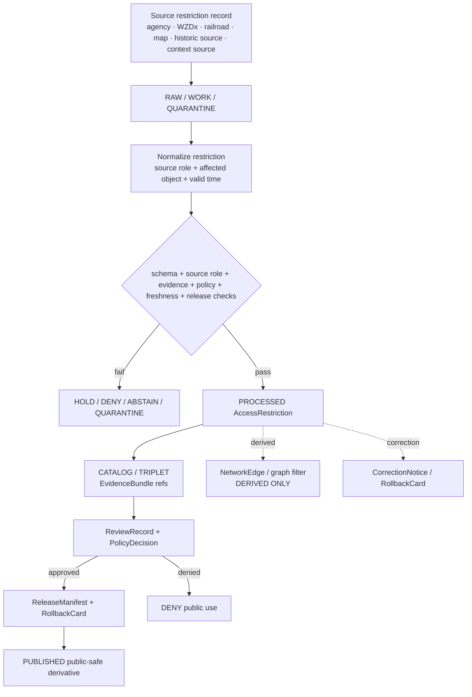

<!-- [KFM_META_BLOCK_V2]
doc_id: kfm://doc/contracts-domains-roads-rail-trade-access-restriction
title: Access Restriction Contract — Roads / Rail / Trade Routes
type: semantic-contract
version: v0.2
status: draft; PROPOSED; schema-missing; slug-CONFLICTED; NEEDS VERIFICATION before promotion
owners:
  - OWNER_TBD — Roads/Rail/Trade Routes domain steward
  - OWNER_TBD — Roads steward
  - OWNER_TBD — Rail steward
  - OWNER_TBD — Contracts steward
  - OWNER_TBD — Source steward
  - OWNER_TBD — Evidence steward
  - OWNER_TBD — Schema steward
  - OWNER_TBD — Policy steward
  - OWNER_TBD — Release steward
  - OWNER_TBD — Docs steward
created: NEEDS VERIFICATION — scaffold existed before v0.2 expansion
updated: 2026-06-23
policy_label: public; contracts; roads-rail-trade; access-restriction; restriction-event; source-role-aware; temporal-scope-aware; evidence-bound; route-segment-membership-separated; release-gated; rollback-aware; not-live-routing; not-emergency-alert; not-legal-advice; not-publication-authority
tags: [kfm, contracts, roads-rail-trade, access-restriction, restriction-event, road-segment, rail-segment, corridor-route, route-membership, crossing, bridge, ferry, transport-facility, operator-status, status-event, source-role, valid-time, EvidenceBundle, PolicyDecision, ReviewRecord, ReleaseManifest, RollbackCard]
related:
  - ./README.md
  - ./route_event.md
  - ./status_event.md
  - ./corridor_route.md
  - ./river_crossing.md
  - ./ferry.md
  - ../roads/README.md
  - ../../../docs/domains/roads-rail-trade/README.md
  - ../../../docs/domains/roads-rail-trade/CANONICAL_PATHS.md
  - ../../../docs/domains/roads-rail-trade/OBJECT_FAMILIES.md
  - ../../../docs/domains/roads-rail-trade/IDENTITY_MODEL.md
  - ../../../docs/domains/roads-rail-trade/SOURCES.md
  - ../../../docs/domains/roads-rail-trade/sublanes/roads.md
  - ../../../docs/domains/roads-rail-trade/MAP_UI_CONTRACTS.md
  - ../../../docs/runbooks/roads-rail-trade/PROMOTION_RUNBOOK.md
  - ../../../docs/runbooks/roads-rail-trade/ROLLBACK_RUNBOOK.md
  - ../../../schemas/contracts/v1/domains/roads-rail-trade/access_restriction.schema.json
  - ../../../policy/domains/roads-rail-trade/
  - ../../../fixtures/domains/roads-rail-trade/access_restriction/
  - ../../../tests/domains/roads-rail-trade/
  - ../../../release/candidates/roads-rail-trade/
notes:
  - "Expanded from a PROPOSED scaffold at contracts/domains/roads-rail-trade/access_restriction.md."
  - "A paired schema at schemas/contracts/v1/domains/roads-rail-trade/access_restriction.schema.json was not found in this task. Field realization remains PROPOSED."
  - "Parent domain docs list Access Restriction, while object-family docs use RestrictionEvent. This contract treats Access Restriction as the restriction semantics surface and preserves RestrictionEvent as the likely event-form realization pending schema/ADR review."
  - "Access restrictions are evidence-bound, source-role-aware, and time-scoped. They are not live routing, emergency alerting, legal advice, road-closure authority, or publication approval."
[/KFM_META_BLOCK_V2] -->

<a id="top"></a>

# Access Restriction Contract — Roads / Rail / Trade Routes

> Semantic contract for `access_restriction`: a source-scoped, time-aware restriction or limitation on access, movement, use, vehicle class, load, clearance, season, permit, closure, or status for a Roads / Rail / Trade Routes object — without becoming live routing, emergency alerting, legal advice, or publication authority.

<p>
  
  
  
  
  
  
  
</p>

`contracts/domains/roads-rail-trade/access_restriction.md`

## Quick jumps

[Status](#status) · [Meaning](#meaning) · [Repo fit](#repo-fit) · [Schema posture](#schema-posture) · [Accepted uses](#accepted-uses) · [Exclusions](#exclusions) · [Recommended fields](#recommended-fields) · [Invariants](#invariants) · [Restriction families](#restriction-families) · [Source-role and time rules](#source-role-and-time-rules) · [Lifecycle](#lifecycle) · [Validation](#validation) · [Rollback](#rollback) · [Evidence basis](#evidence-basis) · [Open questions](#open-questions)

---

## Status

> [!IMPORTANT]
> **Status:** `draft` / semantic contract  
> **Owner:** `OWNER_TBD`  
> **Contract path:** `contracts/domains/roads-rail-trade/access_restriction.md`  
> **Schema path:** `schemas/contracts/v1/domains/roads-rail-trade/access_restriction.schema.json` — **not found in this task**  
> **Truth posture:** target path and scaffold are confirmed from current repo evidence. Access Restriction is confirmed as a parent-domain object term, while `RestrictionEvent` is the related object-family term in the object-family reference. Exact schema fields, validator behavior, fixture coverage, policy behavior, source registry behavior, release manifests, public API behavior, map rendering, graph behavior, and runtime behavior remain **NEEDS VERIFICATION**.

> [!CAUTION]
> This contract defines meaning only. It does **not** provide live routing, emergency detour advice, road-closure authority, legal status, permit advice, engineering/safety advice, public API behavior, map rendering permission, or publication approval.

---

## Meaning

`access_restriction` records the semantic meaning of a sourced restriction affecting movement or access across a transport object.

It may describe restrictions on:

- a `Road Segment` or `Rail Segment`;
- a `CorridorRoute`, `RouteMembership`, or historic/trade route corridor;
- a `Crossing`, `Bridge`, `Ferry`, `River Crossing`, depot, siding, yard, or transport facility;
- a derived `NetworkEdge` only when the graph edge remains downstream of canonical evidence;
- a public-safe released derivative only when release, policy, evidence, and rollback gates pass.

An access restriction is a time-scoped assertion. It says a source claims a limitation exists, existed, or applies under a scope. It does not by itself prove the restriction is legally current, operationally current, safety-critical, or suitable for navigation.

---

## Repo fit

| Responsibility | Path or root | Relationship |
|---|---|---|
| Parent contract lane | `./README.md` | Defines this folder as semantic contracts only. |
| Related event contract | `./route_event.md`, `./status_event.md` | Adjacent time-bound event scaffolds. |
| Road compatibility slice | `../roads/README.md` | Road-specific orientation; not canonical authority by itself. |
| Parent doctrine | `../../../docs/domains/roads-rail-trade/README.md` | Domain scope and object roster. |
| Object families | `../../../docs/domains/roads-rail-trade/OBJECT_FAMILIES.md` | `RestrictionEvent` family and identity posture. |
| Road sublane | `../../../docs/domains/roads-rail-trade/sublanes/roads.md` | Road-specific restriction/status/operator context. |
| Schemas | `../../../schemas/contracts/v1/domains/roads-rail-trade/` or ADR-selected alternate | Machine shape; paired schema missing in this task. |
| Policy | `../../../policy/domains/roads-rail-trade/` or ADR-selected alternate | Allow/deny/restrict/abstain decisions. |
| Fixtures/tests | `../../../fixtures/domains/roads-rail-trade/`, `../../../tests/domains/roads-rail-trade/` | Behavior proof; not contract prose. |
| Source registry | `../../../data/registry/sources/roads-rail-trade/` | Source authority, cadence, rights, and caveats. |
| Release/rollback | `../../../release/candidates/roads-rail-trade/` and release roots | Promotion, release, correction, and rollback. |

---

## Schema posture

A direct paired schema was checked at:

```text
schemas/contracts/v1/domains/roads-rail-trade/access_restriction.schema.json
```

That file was **not found** in this task.

> [!WARNING]
> Because no paired schema was confirmed, every field below is **PROPOSED** semantic guidance. Do not treat it as machine-enforced until schema, fixtures, validator, policy tests, release checks, and runtime behavior are verified.

---

## Accepted uses

| Use | Allowed? | Rule |
|---|---:|---|
| Defining access restriction semantics | Yes | Must preserve source role, affected object, valid time, evidence, and release posture. |
| Supporting road/rail route status and restriction modeling | Yes | Must remain separate from route, segment, route membership, operator assignment, and status event. |
| Supporting public-safe maps or Focus Mode | Conditional | Requires EvidenceBundle, PolicyDecision, review/release state, and rollback target. |
| Supporting graph weighting or traversal filters | Conditional | Must be downstream and must not replace canonical evidence. |
| Recording historical restrictions | Yes | Must preserve source date, observed/valid interval, uncertainty, and source role. |
| Recording current administrative restrictions | Conditional | Requires authoritative or role-appropriate source and freshness/cadence posture. |
| Acting as live closure or emergency alert source | No | Requires separate real-time source, policy, review, and explicit public-safety posture. |
| Acting as legal permit or routing advice | No | KFM records evidence; it does not issue legal or safety advice. |

---

## Exclusions

`access_restriction` must not be used as:

| Misuse | Required outcome |
|---|---|
| Live navigation/routing instruction | `DENY` unless separately governed as a real-time routing system. |
| Emergency closure/evacuation alert | `DENY`; hazards/emergency authority remains separate. |
| Legal road-status certification | `ABSTAIN` / require authoritative source and legal caveat. |
| Permit, trucking, oversize/overweight, or clearance advice | `ABSTAIN`; cite source and caveat; do not advise. |
| Proof that a route/segment is public or private | `ABSTAIN`; access restriction is one assertion, not full status proof. |
| Replacement for `StatusEvent` or `RouteEvent` | Keep event type and restriction semantics distinct. |
| Replacement for source registry | Source role, rights, cadence, and caveats live in source registry. |
| Replacement for policy/release | PolicyDecision and ReleaseManifest remain separate. |
| Public API or map payload | Use governed API/released artifacts only. |

---

## Recommended fields

The following fields are **PROPOSED** until a schema is added and validated.

| Field | Meaning |
|---|---|
| `id` | Canonical restriction identifier. |
| `version` | Contract/object version. |
| `spec_hash` | Deterministic hash over normalized restriction content. |
| `domain` | Expected value: `roads-rail-trade` unless ADR selects another slug. |
| `restriction_type` | Closure, weight, height, width, length, hazmat, seasonal, permit, toll/access, pedestrian/bicycle, rail embargo, service suspension, construction, flood/condition, or other controlled enum. |
| `affected_object_ref` | Road Segment, Rail Segment, RouteMembership, CorridorRoute, Crossing, Bridge, Ferry, River Crossing, TransportFacility, NetworkEdge, or other scoped object. |
| `affected_object_role` | Segment, route, membership, crossing, facility, graph edge, or released derivative. |
| `source_ref` | SourceDescriptor/source registry reference. |
| `source_role` | Authority/administrative/observed/context/candidate/modeled/aggregate/synthetic/restricted role, as accepted by the lane. |
| `source_native_id` | Source-native restriction/event identifier if present and safe. |
| `restriction_value` | Numeric or categorical threshold, when applicable. |
| `restriction_unit` | Tons, pounds, feet, inches, meters, vehicle class, permit class, date range, etc. |
| `directionality` | Both directions, one direction, route-bound direction, facility-bound, unknown. |
| `spatial_scope` | Affected segment, route interval, crossing, facility, milepost range, generalized geometry, or withheld geometry. |
| `valid_time` | Time interval during which the restriction is asserted to apply. |
| `source_time` | Source creation, publication, recording, or update time. |
| `retrieval_time` | KFM retrieval/freeze time. |
| `release_time` | KFM governed release time, if released. |
| `confidence` | Confidence or review posture, if allowed. |
| `caveat` | Human-readable warning: not live routing/legal/emergency advice. |
| `evidence_refs` | EvidenceRefs or EvidenceBundle refs. |
| `policy_decision_ref` | PolicyDecision governing use or publication. |
| `review_ref` | ReviewRecord or steward review ref. |
| `release_manifest_ref` | ReleaseManifest for public/semi-public exposure. |
| `rollback_ref` | RollbackCard or rollback target. |

---

## Invariants

1. **Restriction is not route identity.** Access restriction must not collapse into RouteMembership, CorridorRoute, Road Segment, or Rail Segment identity.
2. **Restriction is time-scoped.** Valid time, source time, retrieval time, release time, and correction time must remain distinct.
3. **Source role is not optional.** Administrative, contextual, modeled, candidate, or community-source restriction data cannot become legal/current status by promotion tone.
4. **Public use is release-gated.** ReleaseManifest and RollbackCard are required for public or semi-public projection.
5. **Graph use is derived.** Restrictions may influence graph filters or weights only as downstream projections that cite the source restriction.
6. **Emergency use fails closed.** Missing real-time source, freshness, policy, or public-safety authorization blocks emergency/routing claims.
7. **Legal advice is denied.** KFM may cite evidence and caveats; it does not advise drivers, permit applicants, agencies, or responders.
8. **Corrections propagate.** Corrected or revoked restrictions must invalidate dependent layers, graph edges, routes, exports, and AI summaries.

---

## Restriction families

| Family | Example | Special caution |
|---|---|---|
| Closure | Road closed, bridge closed, ferry suspended, rail line out of service. | Not emergency/live status without current authoritative source. |
| Weight / load | Bridge load limit, truck weight restriction. | Not legal permit advice; units/source date required. |
| Height / clearance | Low bridge, underpass, tunnel, wire, grade separation. | Not routing safety advice; vertical datum/source precision required. |
| Width / length | Narrow bridge, lane width, oversize route limit. | Requires source role and valid interval. |
| Hazmat / cargo | Hazmat prohibition, commodity restriction, rail embargo. | Sensitive/security and policy review may apply. |
| Seasonal / weather | Seasonal road, weather closure, flood closure. | Hazards/hydrology own event truth where applicable. |
| Permit / toll / access | Permit-only, private access, toll, restricted facility access. | Legal/access status requires authority and caveat. |
| Mode restriction | No pedestrians, bicycles, trucks, buses, rail service class. | Requires mode ontology and source role. |
| Construction / work zone | Lane closure, detour, work-zone restriction. | WZDx or agency source freshness required for current use. |
| Historic restriction | Historic gate, road order, military/trade-route access constraint. | Historic claim; not modern access status. |

---

## Source-role and time rules

| Rule | Required behavior |
|---|---|
| Authority is source-bound | KDOT, county, municipal, railroad, federal, WZDx, OSM, GNIS, historical maps, newspapers, and field observations have different authority limits. |
| Current status needs cadence | A restriction cannot be called current unless source freshness and retrieval cadence support that claim. |
| Historical status needs caveat | Historic restrictions must be labeled historical/claim/context, not modern access. |
| Valid time is required when available | Restrictions without valid interval must show `UNKNOWN` or `NEEDS VERIFICATION`. |
| Observed/source/retrieval/release/correction times stay separate | Do not collapse time axes into a single `date`. |
| Geometry precision is scoped | Use exact geometry only when rights, safety, sensitivity, and source precision allow it. |
| Cross-lane causes are cited, not owned | Flood closures cite hydrology/hazards; bridge structure identity cites settlements/infrastructure; cultural-route restrictions cite archaeology where relevant. |

---

## Lifecycle



---

## Validation

Minimum validation expectations before promotion:

- [ ] paired schema exists or schema gap remains explicit;
- [ ] source role resolves to an admitted source registry record;
- [ ] affected object ref resolves and object role is explicit;
- [ ] route, segment, membership, status event, and restriction are not collapsed;
- [ ] valid/source/retrieval/release/correction times are separate;
- [ ] units and thresholds are normalized without erasing source value;
- [ ] current/live status is denied unless cadence and source freshness support it;
- [ ] public layer/API/export requires EvidenceBundle, PolicyDecision, ReviewRecord, ReleaseManifest, and RollbackCard;
- [ ] graph projection uses restriction only as derived filter/weight and cites the source restriction;
- [ ] emergency/legal/permit/routing advice is denied by default.

Negative fixtures should include:

- OSM/GNIS/context source treated as legal restriction authority;
- restriction without valid time shown as current;
- route membership collapsed into access restriction;
- bridge load limit rendered as legal permit advice;
- flood closure rendered without hydrology/hazard context;
- WZDx or agency restriction rendered after stale freshness window;
- graph edge restriction replacing source record;
- public layer missing ReleaseManifest or RollbackCard.

---

## Rollback

Rollback or correction is required when:

- source role, source value, unit, valid time, affected object, or geometry was wrong;
- a restriction was presented as current, legal, emergency, or routing advice without support;
- a community/context/historic source was promoted to authority incorrectly;
- public map/API/export output leaked stale or unsupported restriction status;
- graph edges, route memberships, or AI summaries depended on an invalid restriction;
- ReleaseManifest, PolicyDecision, EvidenceBundle, source registry, or rollback target was missing or later corrected.

Rollback must identify affected restriction refs, affected objects, graph derivatives, map layers, API/cache/export artifacts, AI summaries, release manifests, reason code, replacement/tombstone refs, and public correction notice if required.

---

## Evidence basis

| Evidence | Supports | Limit |
|---|---|---|
| `contracts/domains/roads-rail-trade/access_restriction.md` scaffold | Target file existed and was a planned PROPOSED scaffold. | Scaffold contained no semantic contract. |
| Missing direct schema check | A direct paired schema at `schemas/contracts/v1/domains/roads-rail-trade/access_restriction.schema.json` was not found in this task. | Does not rule out alternate `transport` schema path; slug conflict remains. |
| `contracts/domains/roads-rail-trade/README.md` | Contract-lane boundary, accepted `AccessRestriction / RestrictionEvent` semantics, and exclusion of schemas/policy/data/release from contracts. | Draft; slug conflict unresolved. |
| `docs/domains/roads-rail-trade/OBJECT_FAMILIES.md` | Confirms `RestrictionEvent` as a family and the identity rule basis. | Field realization remains PROPOSED. |
| `docs/domains/roads-rail-trade/README.md` | Confirms `Access Restriction` in the domain roster and broader transport scope. | Implementation references remain PROPOSED. |
| `route_event.md` and `status_event.md` scaffolds | Adjacent event files exist but remain scaffolds. | They do not yet define event semantics. |

---

## Open questions

| ID | Question | Status |
|---|---|---|
| OQ-RRT-AR-01 | Is the canonical object name `AccessRestriction`, `RestrictionEvent`, or both with one as event-form realization? | OPEN / ADR NEEDED |
| OQ-RRT-AR-02 | Which schema path wins for this object: `schemas/contracts/v1/domains/roads-rail-trade/`, `schemas/contracts/v1/transport/`, or another ADR-selected home? | OPEN / ADR NEEDED |
| OQ-RRT-AR-03 | Which source families are authoritative for current restrictions, historic restrictions, operator restrictions, and emergency closures? | OPEN / SOURCE STEWARD REVIEW |
| OQ-RRT-AR-04 | What freshness windows are required before a restriction can be described as current? | OPEN / POLICY + SOURCE CADENCE |
| OQ-RRT-AR-05 | Which public-safe map/Focus Mode surfaces may show restrictions without implying live routing or legal advice? | OPEN / POLICY REVIEW |

[Back to top](#top)
