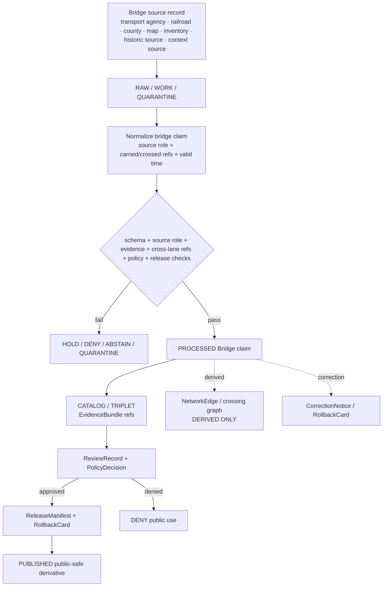

<!-- [KFM_META_BLOCK_V2]
doc_id: kfm://doc/contracts-domains-roads-rail-trade-bridge
title: Bridge Contract — Roads / Rail / Trade Routes
type: semantic-contract
version: v0.2
status: draft; PROPOSED; schema-missing; slug-CONFLICTED; NEEDS VERIFICATION before promotion
owners:
  - OWNER_TBD — Roads/Rail/Trade Routes domain steward
  - OWNER_TBD — Roads steward
  - OWNER_TBD — Rail steward
  - OWNER_TBD — Settlements/Infrastructure steward
  - OWNER_TBD — Hydrology steward
  - OWNER_TBD — Contracts steward
  - OWNER_TBD — Source steward
  - OWNER_TBD — Evidence steward
  - OWNER_TBD — Schema steward
  - OWNER_TBD — Policy steward
  - OWNER_TBD — Release steward
  - OWNER_TBD — Docs steward
created: NEEDS VERIFICATION — scaffold existed before v0.2 expansion
updated: 2026-06-23
policy_label: public; contracts; roads-rail-trade; bridge; crossing; transport-side-claim; source-role-aware; temporal-scope-aware; evidence-bound; infrastructure-boundary-aware; hydrology-boundary-aware; release-gated; rollback-aware; not-structural-inspection; not-routing-authority; not-legal-advice; not-publication-authority
tags: [kfm, contracts, roads-rail-trade, bridge, crossing, road-segment, rail-segment, corridor-route, route-membership, river-crossing, transport-facility, infrastructure-identity, hydrology, source-role, valid-time, EvidenceBundle, PolicyDecision, ReviewRecord, ReleaseManifest, RollbackCard]
related:
  - ./README.md
  - ./access_restriction.md
  - ./river_crossing.md
  - ./ferry.md
  - ./crossing.md
  - ./road_segment.md
  - ./rail_segment.md
  - ../roads/README.md
  - ../../../docs/domains/roads-rail-trade/README.md
  - ../../../docs/domains/roads-rail-trade/CANONICAL_PATHS.md
  - ../../../docs/domains/roads-rail-trade/OBJECT_FAMILIES.md
  - ../../../docs/domains/roads-rail-trade/IDENTITY_MODEL.md
  - ../../../docs/domains/roads-rail-trade/SOURCES.md
  - ../../../docs/domains/roads-rail-trade/sublanes/roads.md
  - ../../../docs/domains/roads-rail-trade/sublanes/rail.md
  - ../../../docs/domains/roads-rail-trade/MAP_UI_CONTRACTS.md
  - ../../../docs/runbooks/roads-rail-trade/PROMOTION_RUNBOOK.md
  - ../../../docs/runbooks/roads-rail-trade/ROLLBACK_RUNBOOK.md
  - ../../../schemas/contracts/v1/domains/roads-rail-trade/bridge.schema.json
  - ../../../policy/domains/roads-rail-trade/
  - ../../../fixtures/domains/roads-rail-trade/bridge/
  - ../../../tests/domains/roads-rail-trade/
  - ../../../release/candidates/roads-rail-trade/
notes:
  - "Expanded from a PROPOSED scaffold at contracts/domains/roads-rail-trade/bridge.md."
  - "A paired schema at schemas/contracts/v1/domains/roads-rail-trade/bridge.schema.json was not found in this task. Field realization remains PROPOSED."
  - "The parent domain names Bridge as an owned transport object, while the roads sublane warns that structural identity usually belongs with settlements-infrastructure. This contract therefore defines the transport-side bridge claim and cross-lane references, not full asset ownership or structural inspection authority."
  - "Bridge records are evidence-bound, source-role-aware, and time-scoped. They are not live routing, structural safety inspection, legal clearance advice, emergency alerting, or publication approval."
[/KFM_META_BLOCK_V2] -->

<a id="top"></a>

# Bridge Contract — Roads / Rail / Trade Routes

> Semantic contract for `bridge`: the transport-side bridge claim connecting a road, rail line, route, crossing, waterway, facility, or network projection to bridge evidence — without becoming structural asset truth, hydrology truth, live routing authority, engineering/safety advice, or publication approval.

<p>
  
  
  
  
  
  
  
</p>

`contracts/domains/roads-rail-trade/bridge.md`

## Quick jumps

[Status](#status) · [Meaning](#meaning) · [Repo fit](#repo-fit) · [Schema posture](#schema-posture) · [Accepted uses](#accepted-uses) · [Exclusions](#exclusions) · [Recommended fields](#recommended-fields) · [Invariants](#invariants) · [Bridge claim families](#bridge-claim-families) · [Source-role and time rules](#source-role-and-time-rules) · [Lifecycle](#lifecycle) · [Validation](#validation) · [Rollback](#rollback) · [Evidence basis](#evidence-basis) · [Open questions](#open-questions)

---

## Status

> [!IMPORTANT]
> **Status:** `draft` / semantic contract  
> **Owner:** `OWNER_TBD`  
> **Contract path:** `contracts/domains/roads-rail-trade/bridge.md`  
> **Schema path:** `schemas/contracts/v1/domains/roads-rail-trade/bridge.schema.json` — **not found in this task**  
> **Truth posture:** target path and scaffold are confirmed from current repo evidence. `Bridge` is confirmed as a Roads / Rail / Trade Routes object term, but exact schema fields, validator behavior, fixture coverage, policy behavior, source registry behavior, release manifests, public API behavior, map rendering, graph behavior, and runtime behavior remain **NEEDS VERIFICATION**.

> [!CAUTION]
> This contract defines bridge meaning only. It does **not** certify structural condition, inspection status, load safety, legal clearance, public accessibility, routing suitability, emergency status, hydrologic condition, infrastructure asset ownership, map/API behavior, or publication approval.

---

## Meaning

`bridge` records the semantic meaning of a transport-side bridge claim inside Roads / Rail / Trade Routes.

It may represent that a source asserts a bridge:

- carries or intersects a `Road Segment`, `Rail Segment`, `CorridorRoute`, or `RouteMembership`;
- participates in a `Crossing`, `River Crossing`, or other transport crossing relation;
- is associated with a transport facility, route event, status event, operator assertion, or access restriction;
- has a source-scoped name, identifier, geometry, route relation, crossing relation, or restriction context;
- may feed a released map layer or network graph only as a governed, evidence-cited, release-gated derivative.

The bridge contract owns the **transport-side claim**: how the bridge relates to movement, route evidence, crossing evidence, and transport semantics. The structural asset identity of the bridge may belong to `settlements-infrastructure` or another infrastructure/asset contract. The waterbody, flood, river, or ford evidence crossed by the bridge belongs to `hydrology`. Hazard causes, emergency closures, and live conditions belong to hazard/source-specific governed paths.

---

## Repo fit

| Responsibility | Path or root | Relationship |
|---|---|---|
| Parent contract lane | `./README.md` | Defines this folder as semantic contracts only. |
| Related crossing contracts | `./river_crossing.md`, `./ferry.md`, `./crossing.md` | Adjacent transport crossing meanings, where present. |
| Related restriction/event contracts | `./access_restriction.md`, `./route_event.md`, `./status_event.md` | Bridge restrictions/status/event semantics. |
| Road compatibility slice | `../roads/README.md` | Road-side bridge relation orientation; not canonical authority by itself. |
| Parent doctrine | `../../../docs/domains/roads-rail-trade/README.md` | Domain scope and object roster. |
| Object families | `../../../docs/domains/roads-rail-trade/OBJECT_FAMILIES.md` | `Bridge` family and identity posture. |
| Road sublane | `../../../docs/domains/roads-rail-trade/sublanes/roads.md` | Road-side bridge relation and cross-lane non-ownership. |
| Schemas | `../../../schemas/contracts/v1/domains/roads-rail-trade/` or ADR-selected alternate | Machine shape; paired schema missing in this task. |
| Policy | `../../../policy/domains/roads-rail-trade/` or ADR-selected alternate | Allow/deny/restrict/abstain decisions. |
| Fixtures/tests | `../../../fixtures/domains/roads-rail-trade/`, `../../../tests/domains/roads-rail-trade/` | Behavior proof; not contract prose. |
| Source registry | `../../../data/registry/sources/roads-rail-trade/` | Source authority, cadence, rights, and caveats. |
| Release/rollback | `../../../release/candidates/roads-rail-trade/` and release roots | Promotion, release, correction, and rollback. |

---

## Schema posture

A direct paired schema was checked at:

```text
schemas/contracts/v1/domains/roads-rail-trade/bridge.schema.json
```

That file was **not found** in this task.

> [!WARNING]
> Because no paired schema was confirmed, every field below is **PROPOSED** semantic guidance. Do not treat it as machine-enforced until schema, fixtures, validator, policy tests, release checks, source registry records, and runtime behavior are verified.

---

## Accepted uses

| Use | Allowed? | Rule |
|---|---:|---|
| Defining transport-side bridge semantics | Yes | Must preserve source role, affected segment/route/crossing, time, evidence, and release posture. |
| Linking a bridge to road/rail/corridor evidence | Yes | Keep segment, route, membership, crossing, and bridge identity separate. |
| Linking to hydrology or infrastructure evidence | Yes | Cite other domain refs; do not absorb their truth. |
| Supporting access restrictions or status events | Conditional | Use separate restriction/status contracts and valid-time discipline. |
| Supporting map/Focus Mode display | Conditional | Requires EvidenceBundle, PolicyDecision, review/release state, and rollback target. |
| Supporting graph topology | Conditional | Derived graph edges must cite the source bridge/crossing relation and not replace it. |
| Certifying structural safety or load condition | No | Requires authoritative source and is not KFM engineering advice. |
| Acting as live closure/routing authority | No | Requires separate real-time source, policy, review, and public-safety posture. |

---

## Exclusions

`bridge` must not be used as:

| Misuse | Required outcome |
|---|---|
| Structural asset canonical identity for all bridge facts | Reference infrastructure/asset contracts; this contract owns transport-side claim only. |
| Hydrology truth | Cite hydrology for river, waterbody, flood, ford, or water-condition evidence. |
| Inspection or structural safety certificate | `DENY` / `ABSTAIN`; KFM does not issue engineering judgments. |
| Load-rating, clearance, or permit advice | Use `access_restriction` and caveat source/valid time; do not advise. |
| Live closure or emergency route status | `DENY`; hazards/emergency authority remains separate. |
| Legal public-access status | `ABSTAIN` unless authoritative source and release caveat support it. |
| Replacement for Road Segment, Rail Segment, CorridorRoute, RouteMembership, Crossing, or NetworkEdge | Keep object families separate. |
| Public API/map payload | Use governed API/released artifacts only. |
| Publication approval | ReleaseManifest and RollbackCard remain separate. |

---

## Recommended fields

The following fields are **PROPOSED** until a schema is added and validated.

| Field | Meaning |
|---|---|
| `id` | Canonical bridge contract object identifier. |
| `version` | Contract/object version. |
| `spec_hash` | Deterministic hash over normalized bridge claim content. |
| `domain` | Expected value: `roads-rail-trade` unless ADR selects another slug. |
| `bridge_name` | Source-stated bridge name, if present. |
| `bridge_source_id` | Source-native bridge identifier, if present and safe. |
| `source_ref` | SourceDescriptor/source registry reference. |
| `source_role` | Authority/administrative/observed/context/candidate/modeled/aggregate/synthetic/restricted role, as accepted by the lane. |
| `carried_object_ref` | Road Segment, Rail Segment, CorridorRoute, RouteMembership, or facility carried by the bridge. |
| `crossed_object_ref` | River, road, rail, route, waterbody, valley, grade separation, or other crossed object reference. |
| `crossing_ref` | Crossing/RiverCrossing/Ferry or crossing relationship ref, if separate. |
| `infrastructure_asset_ref` | External infrastructure/asset identity ref, if owned by settlements-infrastructure or another lane. |
| `hydrology_ref` | Hydrology object ref for river/waterbody/flood/ford context, if applicable. |
| `geometry_ref` | Geometry or generalized geometry reference, not structural truth by itself. |
| `valid_time` | Interval during which this bridge relation is asserted to apply. |
| `source_time` | Source creation, publication, recording, inspection, or update time. |
| `retrieval_time` | KFM retrieval/freeze time. |
| `release_time` | KFM governed release time, if released. |
| `status_refs` | StatusEvent/RouteEvent/AccessRestriction refs, if any. |
| `evidence_refs` | EvidenceRefs or EvidenceBundle refs. |
| `policy_decision_ref` | PolicyDecision governing use or publication. |
| `review_ref` | ReviewRecord or steward review ref. |
| `release_manifest_ref` | ReleaseManifest for public/semi-public exposure. |
| `rollback_ref` | RollbackCard or rollback target. |
| `limitations` | Caveats: transport-side claim only; not engineering, legal, hydrology, routing, or release authority. |

---

## Invariants

1. **Bridge is not universal infrastructure truth.** This contract defines transport-side bridge semantics, not every asset, inspection, maintenance, owner, or structural condition claim.
2. **Bridge is not hydrology.** Water, river, flood, ford, or regulatory water evidence remains Hydrology-owned.
3. **Bridge is not route identity.** It may carry or cross a route/segment, but it is not the route, segment, or membership.
4. **Bridge is not restriction.** Load, clearance, closure, and permit limits belong in access/status/restriction semantics and must remain time-scoped.
5. **Source role is required.** Context/community/geographic sources cannot become structural, legal, safety, or operator authority by promotion tone.
6. **Time roles stay separate.** Source, observed, valid, retrieval, release, and correction times must not collapse into one date.
7. **Graph use is derived.** Bridge-related NetworkEdges are downstream projections and cannot replace source bridge evidence.
8. **Release is separate.** Public surfaces require EvidenceBundle, PolicyDecision, review where required, ReleaseManifest, and RollbackCard.

---

## Bridge claim families

| Family | Example | Boundary |
|---|---|---|
| Road bridge relation | Bridge carries a road segment or route. | Road-side relation only; infrastructure asset identity may be separate. |
| Rail bridge relation | Bridge carries rail alignment. | Rail-side relation only; operator/status separate. |
| River/water crossing bridge | Bridge crosses a river, creek, floodplain, or ford context. | Hydrology owns water evidence. |
| Grade-separation bridge | Road over rail, rail over road, road over road. | Crossing relationship must stay separate from carried/crossed objects. |
| Historic bridge claim | Historic source states a bridge existed or was used by a route. | Historical claim; not modern asset/current access truth. |
| Bridge facility context | Bridge associated with a transport facility, yard, depot, trail, or corridor. | Facility/settlement identity may be separate. |
| Bridge restriction/status context | Load limit, closure, condition, status, clearance, or work zone. | Use status/access restriction semantics; not engineering advice. |

---

## Source-role and time rules

| Rule | Required behavior |
|---|---|
| Authority is source-bound | Transportation agencies, railroads, counties, municipalities, NBI-style inventories, maps, OSM, GNIS, newspapers, and historic sources have different authority limits. |
| Asset and transport roles stay separate | A bridge can be a transport relation here while its asset identity remains infrastructure-owned. |
| Current status needs cadence | A bridge cannot be called open, closed, restricted, current, safe, or unsafe unless source freshness and policy support that claim. |
| Historic status needs caveat | Historic bridge existence/use claims must not become modern access or structural claims. |
| Hydrology is referenced, not absorbed | River/flood/waterbody context cites hydrology objects where applicable. |
| Geometry precision is scoped | Exact geometry requires source rights, precision, sensitivity, and release support. |
| Times stay distinct | Valid/source/retrieval/release/correction times are separate fields or explicit unknowns. |

---

## Lifecycle



---

## Validation

Minimum validation expectations before promotion:

- [ ] paired schema exists or schema gap remains explicit;
- [ ] source role resolves to an admitted source registry record;
- [ ] carried object, crossed object, and crossing relation are separated where applicable;
- [ ] infrastructure asset identity is referenced rather than silently owned when outside this lane;
- [ ] hydrology refs are used for rivers, waterbodies, flood, ford, or water-condition evidence;
- [ ] route, segment, membership, crossing, bridge, status, and restriction objects are not collapsed;
- [ ] valid/source/retrieval/release/correction times are separate;
- [ ] public layer/API/export requires EvidenceBundle, PolicyDecision, ReviewRecord, ReleaseManifest, and RollbackCard;
- [ ] graph projection uses bridge only as derived crossing/topology evidence and cites the source record;
- [ ] structural inspection, live closure, emergency, legal, routing, and permit-advice claims are denied by default.

Negative fixtures should include:

- OSM/GNIS/context bridge geometry treated as legal/structural authority;
- bridge object treated as full infrastructure asset canonical identity;
- river/water evidence absorbed without Hydrology ref;
- load/clearance restriction emitted as legal permit advice;
- bridge closure rendered as live emergency status without source freshness;
- route membership collapsed into bridge identity;
- graph edge replacing source bridge record;
- public layer missing ReleaseManifest or RollbackCard.

---

## Rollback

Rollback or correction is required when:

- source role, source value, geometry, valid time, carried/crossed object, crossing ref, infrastructure ref, or hydrology ref was wrong;
- a bridge was presented as structurally safe/unsafe, open/closed, legally accessible, or routing-suitable without support;
- a community/context/historic source was promoted to authority incorrectly;
- public map/API/export output leaked stale or unsupported bridge status;
- graph edges, route memberships, restrictions, status events, or AI summaries depended on an invalid bridge claim;
- ReleaseManifest, PolicyDecision, EvidenceBundle, source registry, or rollback target was missing or later corrected.

Rollback must identify affected bridge refs, affected route/segment/crossing/restriction/status refs, graph derivatives, map layers, API/cache/export artifacts, AI summaries, release manifests, reason code, replacement/tombstone refs, and public correction notice if required.

---

## Evidence basis

| Evidence | Supports | Limit |
|---|---|---|
| `contracts/domains/roads-rail-trade/bridge.md` scaffold | Target file existed and was a planned PROPOSED scaffold. | Scaffold contained no semantic contract. |
| Missing direct schema check | A direct paired schema at `schemas/contracts/v1/domains/roads-rail-trade/bridge.schema.json` was not found in this task. | Does not rule out alternate `transport` schema path; slug conflict remains. |
| `docs/domains/roads-rail-trade/README.md` | Confirms `Bridge` in the domain object roster and says structure identity is settlement-owned. | Implementation references remain PROPOSED. |
| `docs/domains/roads-rail-trade/OBJECT_FAMILIES.md` | Confirms `Bridge` as an object family and gives the identity-rule basis. | Field realization remains PROPOSED. |
| `docs/domains/roads-rail-trade/sublanes/roads.md` | Confirms road-side bridge claim and cross-lane non-ownership: structural identity belongs with settlements-infrastructure; water evidence with hydrology. | Sublane convention remains PROPOSED / NEEDS VERIFICATION. |
| `contracts/domains/roads-rail-trade/README.md` | Contract-lane boundary and separation from schemas, policy, data, release, APIs, and map/runtime behavior. | Draft; slug conflict unresolved. |

---

## Open questions

| ID | Question | Status |
|---|---|---|
| OQ-RRT-BRIDGE-01 | Is `Bridge` a first-class Roads/Rail/Trade object, or only the transport-side relation to an infrastructure-owned asset? | OPEN / CROSS-LANE ADR NEEDED |
| OQ-RRT-BRIDGE-02 | Which schema path wins for this object: `schemas/contracts/v1/domains/roads-rail-trade/`, `schemas/contracts/v1/transport/`, or another ADR-selected home? | OPEN / ADR NEEDED |
| OQ-RRT-BRIDGE-03 | Which source families are authoritative for bridge identity, carried/crossed routes, structure inventory, restrictions, and current status? | OPEN / SOURCE STEWARD REVIEW |
| OQ-RRT-BRIDGE-04 | What bridge condition/status details are public-safe, restricted, or denied? | OPEN / POLICY REVIEW |
| OQ-RRT-BRIDGE-05 | How should bridge corrections invalidate network edges, crossings, access restrictions, map layers, exports, and AI summaries? | OPEN / ROLLBACK TEST NEEDED |

[Back to top](#top)
