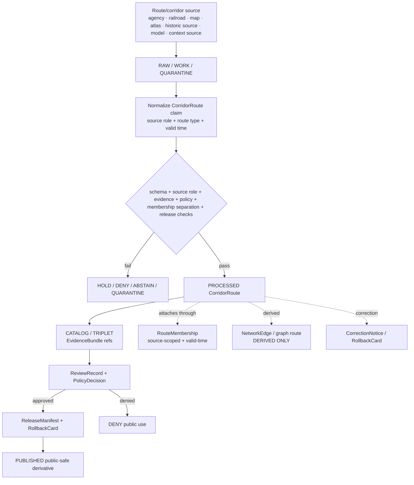

<!-- [KFM_META_BLOCK_V2]
doc_id: kfm://doc/contracts-domains-roads-rail-trade-corridor-route
title: Corridor Route Contract — Roads / Rail / Trade Routes
type: semantic-contract
version: v0.3
status: draft; PROPOSED; bounded-schema-profile; slug-CONFLICTED; NEEDS VERIFICATION before promotion
owners:
  - OWNER_TBD — Roads/Rail/Trade Routes domain steward
  - OWNER_TBD — Roads steward
  - OWNER_TBD — Rail steward
  - OWNER_TBD — Historic/trade-routes steward
  - OWNER_TBD — Contracts steward
  - OWNER_TBD — Source steward
  - OWNER_TBD — Evidence steward
  - OWNER_TBD — Schema steward
  - OWNER_TBD — Policy steward
  - OWNER_TBD — Release steward
  - OWNER_TBD — Docs steward
created: NEEDS VERIFICATION — scaffold existed before v0.2 expansion
updated: 2026-08-03
policy_label: public; contracts; roads-rail-trade; corridor-route; route-entity; source-role-aware; temporal-scope-aware; evidence-bound; route-segment-membership-separated; graph-projection-aware; release-gated; rollback-aware; not-segment; not-route-membership; not-live-routing; not-legal-designation-authority; not-publication-authority
tags: [kfm, contracts, roads-rail-trade, corridor-route, route, route-membership, road-segment, rail-segment, historic-route, trade-route-corridor, network-edge, movement-story-node, source-role, valid-time, EvidenceBundle, PolicyDecision, ReviewRecord, ReleaseManifest, RollbackCard]
related:
  - ./README.md
  - ./trade_route_corridor.md
  - ./route_event.md
  - ./status_event.md
  - ./access_restriction.md
  - ./road_segment.md
  - ./rail_segment.md
  - ../roads/README.md
  - ../../../docs/domains/roads-rail-trade/README.md
  - ../../../docs/domains/roads-rail-trade/CANONICAL_PATHS.md
  - ../../../docs/domains/roads-rail-trade/OBJECT_FAMILIES.md
  - ../../../docs/domains/roads-rail-trade/IDENTITY_MODEL.md
  - ../../../docs/domains/roads-rail-trade/SOURCES.md
  - ../../../docs/domains/roads-rail-trade/CORRIDOR_ROUTE_SCHEMA_PROFILE.md
  - ../../../docs/domains/roads-rail-trade/sublanes/roads.md
  - ../../../docs/domains/roads-rail-trade/sublanes/rail.md
  - ../../../docs/domains/roads-rail-trade/sublanes/trade-routes.md
  - ../../../docs/domains/roads-rail-trade/MAP_UI_CONTRACTS.md
  - ../../../docs/domains/roads-rail-trade/GRAPH_PROJECTIONS.md
  - ../../../docs/runbooks/roads-rail-trade/PROMOTION_RUNBOOK.md
  - ../../../docs/runbooks/roads-rail-trade/ROLLBACK_RUNBOOK.md
  - ../../../schemas/contracts/v1/domains/roads-rail-trade/corridor_route.schema.json
  - ../../../tools/validators/domains/roads-rail-trade/validate_corridor_route.py
  - ../../../fixtures/domains/roads-rail-trade/corridor_route/
  - ../../../tests/schemas/test_corridor_route_contract.py
  - ../../../policy/domains/roads-rail-trade/
  - ../../../release/candidates/roads-rail-trade/
notes:
  - "Expanded from a PROPOSED scaffold at contracts/domains/roads-rail-trade/corridor_route.md."
  - "v0.3 binds this semantic contract to a bounded Draft 2020-12 schema, synthetic fixtures, a no-network validator, and focused tests. The profile remains PROPOSED and creates no source, policy, review, release, routing, or publication authority."
  - "CorridorRoute is the route/designation/corridor entity itself. RouteMembership attaches segments to that route under a source role and temporal scope. RoadSegment and RailSegment remain separate evidence objects."
  - "Corridor routes are evidence-bound, source-role-aware, and time-scoped. They are not live routing, legal route-designation authority, graph truth, map publication, or release approval."
[/KFM_META_BLOCK_V2] -->

<a id="top"></a>

# Corridor Route Contract — Roads / Rail / Trade Routes

> Semantic contract for `corridor_route`: the route, corridor, designation, line, trail, or named transport entity that segments may belong to through sourced, time-scoped `RouteMembership` assertions — without collapsing the route into its segments, graph edges, map linework, or public routing authority.

<p>
  
  
  
  
  
  
  
</p>

`contracts/domains/roads-rail-trade/corridor_route.md`

## Quick jumps

[Status](#status) · [Meaning](#meaning) · [Repo fit](#repo-fit) · [Schema posture](#schema-posture) · [Accepted uses](#accepted-uses) · [Exclusions](#exclusions) · [Recommended fields](#recommended-fields) · [Invariants](#invariants) · [Corridor route families](#corridor-route-families) · [Source-role and time rules](#source-role-and-time-rules) · [Lifecycle](#lifecycle) · [Validation](#validation) · [Rollback](#rollback) · [Evidence basis](#evidence-basis) · [Open questions](#open-questions)

---

## Status

> [!IMPORTANT]
> **Status:** `draft` / semantic contract with bounded schema profile  
> **Owner:** `OWNER_TBD`  
> **Contract path:** `contracts/domains/roads-rail-trade/corridor_route.md`  
> **Schema path:** `schemas/contracts/v1/domains/roads-rail-trade/corridor_route.schema.json` — **PROPOSED bounded profile**  
> **Validator path:** `tools/validators/domains/roads-rail-trade/validate_corridor_route.py` — **CONFIRMED fixture-only executable in this slice**  
> **Truth posture:** the contract, paired schema, validator, synthetic fixtures, and focused tests are repository artifacts. Source admission, real-route identity, source registry resolution, policy behavior, review, release manifests, public API behavior, map rendering, graph materialization, and runtime behavior remain **NEEDS VERIFICATION**.

> [!CAUTION]
> This contract defines corridor-route meaning only. It does **not** certify legal route designation, public accessibility, current routing suitability, emergency detour status, map/API behavior, graph truth, or publication approval.

---

## Meaning

`corridor_route` records the semantic meaning of a route or corridor as an entity in its own right.

A corridor route may represent:

- a modern road route, highway, truck route, scenic byway, detour corridor, or road designation;
- a rail line, rail corridor, service corridor, or freight corridor grouping;
- a historic route, military road, emigrant route, mail route, cattle trail, stage route, or trade corridor when the object is treated as a route/corridor entity rather than one segment;
- a generalized route corridor used by public-safe map or Focus Mode surfaces;
- a parent route that receives sourced `RouteMembership` assertions from Road Segments, Rail Segments, crossings, facilities, or historic-route claims.

A corridor route is not the same thing as a segment. A route is the thing a designation, source, or interpretation refers to; a segment is a piece of road/rail alignment evidence; membership is the sourced, temporal relationship attaching a segment to the route.

---

## Repo fit

| Responsibility | Path or root | Relationship |
|---|---|---|
| Parent contract lane | `./README.md` | Defines this folder as semantic contracts only. |
| Trade/historic corridor relation | `./trade_route_corridor.md` | Related generalized or historic corridor semantics. |
| Route events/status/restrictions | `./route_event.md`, `./status_event.md`, `./access_restriction.md` | Time-bound changes and constraints on route/corridor use. |
| Segment contracts | `./road_segment.md`, `./rail_segment.md` where present | Segment evidence remains separate from route identity. |
| Road compatibility slice | `../roads/README.md` | Road-specific orientation; not canonical authority by itself. |
| Parent doctrine | `../../../docs/domains/roads-rail-trade/README.md` | Domain scope and object roster. |
| Object families | `../../../docs/domains/roads-rail-trade/OBJECT_FAMILIES.md` | `CorridorRoute`, `RouteMembership`, `Road Segment`, `Rail Segment` vocabulary and identity posture. |
| Profile documentation | `../../../docs/domains/roads-rail-trade/CORRIDOR_ROUTE_SCHEMA_PROFILE.md` | Bounded fixture-only realization and deliberate holds. |
| Road sublane | `../../../docs/domains/roads-rail-trade/sublanes/roads.md` | Route/segment/membership separation for road routes. |
| Schema | `../../../schemas/contracts/v1/domains/roads-rail-trade/corridor_route.schema.json` | Bounded machine shape; path slug conflict remains ADR-bound. |
| Validator | `../../../tools/validators/domains/roads-rail-trade/validate_corridor_route.py` | No-network PASS/ABSTAIN/DENY/ERROR profile; not policy or release authority. |
| Fixtures/tests | `../../../fixtures/domains/roads-rail-trade/corridor_route/`, `../../../tests/schemas/test_corridor_route_contract.py` | Synthetic behavior proof; not route evidence. |
| Policy | `../../../policy/domains/roads-rail-trade/` or ADR-selected alternate | Allow/deny/restrict/abstain decisions. |
| Source registry | `../../../data/registry/sources/roads-rail-trade/` | Source authority, cadence, rights, and caveats. |
| Release/rollback | `../../../release/candidates/roads-rail-trade/` and release roots | Promotion, release, correction, and rollback. |

---

## Schema posture

The paired profile is:

```text
schemas/contracts/v1/domains/roads-rail-trade/corridor_route.schema.json
```

It is a **PROPOSED bounded profile**, not a fully admitted domain schema. It makes the source-packet minimum fields machine-required, separates route identity from segment/membership/geometry truth, checks deterministic content identity, and requires release closure when a candidate claims released posture.

The companion validator and fixtures prove only deterministic shape and anti-collapse behavior. They do not prove source rights, current source status, source-role acceptance, policy execution, reviewer authority, release readiness, historical accuracy, exact alignment, public access, or live routing suitability.

---

## Accepted uses

| Use | Allowed? | Rule |
|---|---:|---|
| Defining route/corridor entity semantics | Yes | Must preserve route identity separate from segment and membership. |
| Grouping segment memberships | Yes | Use sourced `RouteMembership` assertions; do not embed segment membership as route truth. |
| Modeling modern road or rail designations | Conditional | Requires source role and valid-time support for designation claims. |
| Modeling historic or trade-route corridors | Conditional | Must preserve uncertainty, claim status, and cultural/sensitivity caveats. |
| Supporting map/Focus Mode display | Conditional | Requires EvidenceBundle, PolicyDecision, release state, and rollback target. |
| Supporting graph projection | Conditional | Graph edges are derived and must cite route/segment/membership evidence. |
| Certifying legal/current route designation | No | Requires authoritative source, valid time, policy, and caveat; KFM does not issue legal opinions. |
| Acting as live routing or detour authority | No | Requires separate real-time governance; denied by default. |

---

## Exclusions

`corridor_route` must not be used as:

| Misuse | Required outcome |
|---|---|
| Road Segment or Rail Segment | Use segment contracts for alignment evidence. |
| RouteMembership | Use a membership contract/object for segment-to-route relationships. |
| NetworkEdge or graph truth | Graph projections are downstream and derived. |
| AccessRestriction or StatusEvent | Use event/restriction contracts with valid time and source role. |
| Legal route-designation certificate | `ABSTAIN` unless authoritative source and caveat are present; still not legal advice. |
| Emergency detour or live route advisory | `DENY` unless governed as a real-time route system. |
| Public map/API payload | Use governed API/released artifacts only. |
| Publication approval | ReleaseManifest and RollbackCard remain separate. |

---

## Recommended fields

The paired schema now realizes these fields as a **PROPOSED fixture-only profile**. Their semantic meaning remains governed by this contract, while source, policy, review, release, and runtime admission remain separate.

| Field | Meaning |
|---|---|
| `id` | Canonical corridor route identifier. |
| `version` | Contract/object version. |
| `spec_hash` | Deterministic hash over normalized corridor route content. |
| `domain` | Expected value: `roads-rail-trade` unless ADR selects another slug. |
| `route_name` | Source-stated name or label. |
| `route_designation` | Designation such as route number, line name, trail name, historic route name, or corridor label. |
| `route_type` | Road, rail, freight, historic, trade, military, emigrant, mail, cattle, scenic, detour, generalized, or other controlled type. |
| `approximate_dates` | Source-supported approximate date range or bounded date statement. |
| `date_uncertainty` | Explicit uncertainty attached to approximate dates. |
| `geometry_accuracy` | Surveyed, authoritative alignment, approximate, derived geocode, or unknown. |
| `source_ref` | SourceDescriptor/source registry reference. |
| `source_role` | Authority/official/administrative/observed/context/candidate/modeled/aggregate/synthetic/restricted role. |
| `source_native_id` | Source-native route identifier if present and safe. |
| `valid_time` | Interval during which the route/designation/corridor claim is asserted to apply. |
| `membership_refs` | RouteMembership refs, not embedded segment truth. |
| `geometry_ref` | Generalized or released route geometry, if any; not canonical membership by itself. |
| `network_projection_refs` | Downstream NetworkEdge/graph refs, if any. |
| `historic_claim_refs` | Historic RouteClaim or TradeRouteCorridor refs, if applicable. |
| `evidence_refs` | EvidenceRefs or EvidenceBundle refs. |
| `confidence` | Bounded confidence on the candidate representation, never a replacement for evidence. |
| `representation_layer` | Explicit authoritative-versus-derived classification. |
| `changed` | Changed, unchanged, or unknown comparison posture. |
| `policy_decision_ref` | PolicyDecision governing use or publication. |
| `review_ref` | ReviewRecord or steward review ref. |
| `release_manifest_ref` | ReleaseManifest for public/semi-public exposure. |
| `rollback_ref` | RollbackCard or rollback target. |
| `limitations` | Caveats: route not segment; membership separate; graph/map not truth; no live/legal routing authority. |

---

## Invariants

1. **Route is not segment.** A CorridorRoute cannot replace Road Segment or Rail Segment evidence.
2. **Membership is separate.** Segment-to-route inclusion belongs in RouteMembership with source role and valid time.
3. **Designation is source-scoped.** Route name, number, corridor label, or historic name must preserve source role and time scope.
4. **Geometry is derivative.** A route line or corridor geometry is a released/generalized representation, not the membership truth itself.
5. **Graph output is derived.** NetworkEdge and route traversal outputs cannot replace CorridorRoute, Segment, or RouteMembership records.
6. **Historic routes remain claims unless reviewed.** Historic/trade-route corridors must preserve uncertainty, evidence, sensitivity, and review status.
7. **Legal/live authority is denied by default.** KFM does not issue live routing, detour, legal designation, or permit advice through this contract.
8. **Release is separate.** Public surfaces require EvidenceBundle, PolicyDecision, review where required, ReleaseManifest, and RollbackCard.

---

## Corridor route families

| Family | Example | Boundary |
|---|---|---|
| Modern road route | Highway, county route, truck route, scenic byway. | Requires source-role support; not live routing/legal advice. |
| Modern rail route/line | Railroad line, branch, corridor, service route. | Operator status and rail segment evidence remain separate. |
| Freight corridor | Freight/logistics corridor grouping. | Corridor context is not raw movement proof. |
| Historic route | Military road, emigrant road, mail route, stage route, cattle trail. | Historical claim/corridor; not modern route status. |
| Trade route corridor | Generalized trade or movement corridor. | May require cultural sensitivity and generalized geometry. |
| Detour/temporary corridor | Temporary alternate route or construction detour. | Requires freshness and source cadence; not live advice by default. |
| Public-safe map corridor | Released generalized line/corridor for UI. | Requires release/caveat; not canonical membership truth. |

---

## Source-role and time rules

| Rule | Required behavior |
|---|---|
| Authority is source-bound | Agency, railroad, county, historical map, newspaper, OSM, GNIS, atlas, field observation, and modeled source roles must remain distinct. |
| Route designation needs source role | A label or number does not become legal route designation without role-appropriate source support. |
| Membership needs valid time | Segment inclusion must be time-scoped through RouteMembership when available. |
| Historic route needs caveat | Historic/trade route corridors must carry uncertainty, evidence limits, and sensitivity posture. |
| Geometry does not define membership | A line drawn through segments is not sufficient to prove route membership. |
| Times stay distinct | Source, observed, valid, retrieval, release, and correction times must not collapse into one date. |
| Corrections propagate | Route rename, redesignation, decommissioning, split, merge, or demotion must invalidate dependent memberships, graph edges, layers, exports, and AI summaries. |

---

## Lifecycle


```mermaid
flowchart TD
  SRC["Route/corridor source\nagency · railroad · map · atlas · historic source · model · context source"] --> RAW["RAW / WORK / QUARANTINE"]
  RAW --> NORM["Normalize CorridorRoute claim\nsource role + route type + valid time"]
  NORM --> CHECK{"schema + source role + evidence + policy + membership separation + release checks"}
  CHECK -->|fail| HOLD["HOLD / DENY / ABSTAIN / QUARANTINE"]
  CHECK -->|pass| PROC["PROCESSED CorridorRoute"]
  PROC --> CAT["CATALOG / TRIPLET\nEvidenceBundle refs"]
  CAT --> REVIEW["ReviewRecord + PolicyDecision"]
  REVIEW -->|approved| REL["ReleaseManifest + RollbackCard"]
  REVIEW -->|denied| DENY["DENY public use"]
  REL --> PUB["PUBLISHED public-safe derivative"]
  PROC -. attaches through .-> RM["RouteMembership\nsource-scoped + valid-time"]
  PROC -. derived .-> GRAPH["NetworkEdge / graph route\nDERIVED ONLY"]
  PROC -. correction .-> ROLLBACK["CorrectionNotice / RollbackCard"]
```

---

## Validation

Minimum validation expectations before promotion:

- [x] paired bounded schema exists;
- [x] deterministic no-network fixtures cover PASS, ABSTAIN, and exact DENY boundaries;
- [x] CorridorRoute, Road/Rail Segment, RouteMembership, embedded geometry, live routing, and publication approval are not collapsed;
- [x] approximate dates, date uncertainty, geometry accuracy, source role, evidence posture, confidence, representation layer, and change state are machine-required;
- [ ] source role resolves to an admitted source registry record;
- [ ] route designation/name/source-native ID preserve accepted source context;
- [ ] public layer/API/export resolves EvidenceBundle, PolicyDecision, ReviewRecord, ReleaseManifest, and RollbackCard;
- [ ] graph projection cites accepted route/segment/membership evidence;
- [ ] live routing, legal designation, permit, detour, and emergency advice remain denied by the governed runtime.

Current negative fixtures cover:

- authoritative representation from derived geocoding;
- bound evidence with no EvidenceRef;
- embedded segment truth;
- a live-routing-authority claim;
- missing temporal uncertainty;
- sensitive geometry marked for public generalization;
- released posture without policy/review/release/rollback closure;
- mismatched deterministic `spec_hash`.

---

## Rollback

Rollback or correction is required when:

- source role, route name, designation, source-native ID, route type, valid time, membership refs, geometry, or release caveat was wrong;
- a route was presented as legal/current/routing/emergency authority without support;
- geometry or graph output was used as membership truth;
- historic/trade-route uncertainty or sensitivity was removed;
- public map/API/export output leaked stale or unsupported route status;
- graph edges, route memberships, restrictions, status events, or AI summaries depended on an invalid route claim;
- ReleaseManifest, PolicyDecision, EvidenceBundle, source registry, or rollback target was missing or later corrected.

Rollback must identify affected route refs, membership refs, segment refs, graph derivatives, map layers, API/cache/export artifacts, AI summaries, release manifests, reason code, replacement/tombstone refs, and public correction notice if required.

---

## Evidence basis

| Evidence | Supports | Limit |
|---|---|---|
| Existing semantic contract and domain docs | Confirm the CorridorRoute/RouteMembership/Segment separation and domain boundaries. | Draft; slug conflict remains. |
| `New Ideas 3-31-26.pdf` historical-route packet | Supports the minimum route entity fields and four fail-closed gate categories used by the profile. | Design source; not route evidence or implementation proof. |
| Paired schema, validator, fixtures, and focused tests | Confirm bounded machine shape, deterministic hash, PASS/ABSTAIN/DENY behavior, and anti-collapse enforcement. | Fixture-only; no source admission, policy execution, review, release, or publication. |
| `docs/domains/roads-rail-trade/OBJECT_FAMILIES.md` | Confirms `CorridorRoute` and `RouteMembership`, with route as grouping and membership as associative object. | Field realization remains PROPOSED. |
| `docs/domains/roads-rail-trade/sublanes/roads.md` | Confirms modern roads include RouteMembership and CorridorRoute, and states route is an entity distinct from a segment. | Sublane convention remains PROPOSED / NEEDS VERIFICATION. |

---

## Open questions

| ID | Question | Status |
|---|---|---|
| OQ-RRT-CORRIDOR-01 | Is `CorridorRoute` the canonical route entity name for both modern road/rail routes and historic/trade corridors, or should historic corridors use separate contracts only? | OPEN / ADR NEEDED |
| OQ-RRT-CORRIDOR-02 | Which schema path wins for this object: `schemas/contracts/v1/domains/roads-rail-trade/`, `schemas/contracts/v1/transport/`, or another ADR-selected home? | OPEN / ADR NEEDED |
| OQ-RRT-CORRIDOR-03 | Which source families are authoritative for route designation, route renaming, decommissioning, and membership? | OPEN / SOURCE STEWARD REVIEW |
| OQ-RRT-CORRIDOR-04 | What geometry representation is allowed for public historic/trade routes without overstating certainty or sensitivity? | OPEN / POLICY REVIEW |
| OQ-RRT-CORRIDOR-05 | How should route corrections invalidate memberships, graph edges, map layers, exports, and AI summaries? | OPEN / ROLLBACK TEST NEEDED |

[Back to top](#top)
