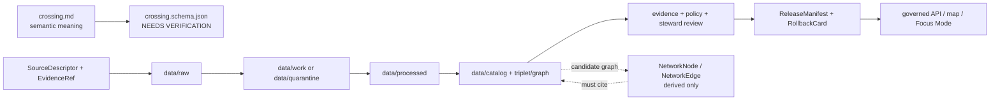

<!-- [KFM_META_BLOCK_V2]
doc_id: kfm://doc/contracts-domains-roads-rail-trade-crossing
title: Crossing Contract — Roads / Rail / Trade Routes
type: semantic-contract
version: v0.2
status: draft; PROPOSED; schema-missing; slug-CONFLICTED; NEEDS VERIFICATION before promotion
owners:
  - OWNER_TBD — Roads/Rail/Trade Routes domain steward
  - OWNER_TBD — Roads steward
  - OWNER_TBD — Rail steward
  - OWNER_TBD — Hydrology steward
  - OWNER_TBD — Settlements/Infrastructure steward
  - OWNER_TBD — Contracts steward
  - OWNER_TBD — Source steward
  - OWNER_TBD — Evidence steward
  - OWNER_TBD — Schema steward
  - OWNER_TBD — Policy steward
  - OWNER_TBD — Release steward
  - OWNER_TBD — Docs steward
created: NEEDS VERIFICATION — scaffold existed before v0.2 expansion
updated: 2026-06-23
policy_label: public; contracts; roads-rail-trade; crossing; grade-crossing; road-rail-crossing; intersection; transport-side-claim; source-role-aware; temporal-scope-aware; evidence-bound; hydrology-boundary-aware; infrastructure-boundary-aware; graph-projection-aware; release-gated; rollback-aware; not-routing-authority; not-live-closure-authority; not-legal-advice; not-publication-authority
tags: [kfm, contracts, roads-rail-trade, crossing, road-rail-crossing, grade-crossing, intersection, road-segment, rail-segment, corridor-route, route-membership, bridge, ferry, river-crossing, network-node, network-edge, access-restriction, route-event, status-event, source-role, valid-time, EvidenceBundle, PolicyDecision, ReviewRecord, ReleaseManifest, RollbackCard]
related:
  - ./README.md
  - ./bridge.md
  - ./ferry.md
  - ./river_crossing.md
  - ./access_restriction.md
  - ./route_event.md
  - ./status_event.md
  - ./road_segment.md
  - ./rail_segment.md
  - ./network_edge.md
  - ../roads/README.md
  - ../../../docs/domains/roads-rail-trade/README.md
  - ../../../docs/domains/roads-rail-trade/CANONICAL_PATHS.md
  - ../../../docs/domains/roads-rail-trade/OBJECT_FAMILIES.md
  - ../../../docs/domains/roads-rail-trade/IDENTITY_MODEL.md
  - ../../../docs/domains/roads-rail-trade/SOURCES.md
  - ../../../docs/domains/roads-rail-trade/GRAPH_PROJECTIONS.md
  - ../../../docs/domains/roads-rail-trade/MAP_UI_CONTRACTS.md
  - ../../../docs/runbooks/roads-rail-trade/PROMOTION_RUNBOOK.md
  - ../../../docs/runbooks/roads-rail-trade/ROLLBACK_RUNBOOK.md
  - ../../../schemas/contracts/v1/domains/roads-rail-trade/crossing.schema.json
  - ../../../policy/domains/roads-rail-trade/
  - ../../../fixtures/domains/roads-rail-trade/crossing/
  - ../../../tests/domains/roads-rail-trade/
  - ../../../release/candidates/roads-rail-trade/
notes:
  - "Expanded from a PROPOSED scaffold at contracts/domains/roads-rail-trade/crossing.md."
  - "A paired schema at schemas/contracts/v1/domains/roads-rail-trade/crossing.schema.json was not found in this task. Field realization remains PROPOSED."
  - "The parent domain names Crossing as a Roads / Rail / Trade Routes object. This contract defines the transport-side crossing claim, not hydrology truth, bridge/ferry/ford specialization, legal access status, live routing, or publication approval."
  - "The Roads / Rail / Trade Routes docs record a slug conflict between roads-rail-trade and transport for contract/schema homes. This file preserves the observed requested path and does not resolve the ADR question."
[/KFM_META_BLOCK_V2] -->

<a id="top"></a>

# Crossing Contract — Roads / Rail / Trade Routes

> Semantic contract for `crossing`: the transport-side claim that two or more transport or landscape features meet, intersect, pass over/under, or require a governed relation — without becoming routing advice, live closure authority, hydrology truth, bridge/ferry/ford specialization, infrastructure ownership, legal access status, graph truth, or publication approval.

<p>
  
  
  
  
  
  
  
</p>

`contracts/domains/roads-rail-trade/crossing.md`

## Quick jumps

[Status](#status) · [Meaning](#meaning) · [Repo fit](#repo-fit) · [Schema posture](#schema-posture) · [Accepted uses](#accepted-uses) · [Exclusions](#exclusions) · [Recommended fields](#recommended-fields) · [Invariants](#invariants) · [Crossing claim families](#crossing-claim-families) · [Source-role and time rules](#source-role-and-time-rules) · [Lifecycle](#lifecycle) · [Validation](#validation) · [Rollback](#rollback) · [Evidence basis](#evidence-basis) · [Open questions](#open-questions)

---

## Status

> [!IMPORTANT]
> **Status:** `draft` / semantic contract  
> **Owner:** `OWNER_TBD`  
> **Contract path:** `contracts/domains/roads-rail-trade/crossing.md`  
> **Schema path:** `schemas/contracts/v1/domains/roads-rail-trade/crossing.schema.json` — **not found in this task**  
> **Truth posture:** the target path and prior scaffold are confirmed from current repo evidence. `Crossing` is confirmed as a Roads / Rail / Trade Routes object term. Exact schema fields, validator behavior, fixture coverage, policy behavior, source-registry behavior, release manifests, emitted proofs, public API behavior, map rendering, graph behavior, and runtime behavior remain **NEEDS VERIFICATION**.

> [!CAUTION]
> This contract defines crossing meaning only. It does **not** certify safe passage, active closure status, legal access, right-of-way, grade-separation safety, rail operating status, bridge condition, ferry service status, flood/ford condition, emergency routing, map/API behavior, or publication approval.

---

## Meaning

`crossing` records the semantic meaning of a transport-side crossing claim inside Roads / Rail / Trade Routes.

It may represent that a source asserts:

- a `Road Segment` crosses, intersects, joins, passes over, or passes under another road, rail line, route, corridor, water feature, trail, or landscape barrier;
- a `Rail Segment` crosses a road, rail line, route, corridor, water feature, or access feature;
- a crossing is at-grade, grade-separated, bridged, ferried, forded, tunneled, seasonal, historic, candidate, modeled, administrative, or observed;
- a `Crossing` participates in route membership, access restriction, route event, status event, operator assignment, network-node, network-edge, map display, or Focus Mode explanation;
- the same physical place may require specialized companion records such as `Bridge`, `Ferry`, or `River Crossing` when the evidence supports those more specific semantics.

The crossing contract owns the **transport-side relation**: how the crossing affects movement, route evidence, topology, and public-safe representation. Waterbody evidence remains Hydrology-owned. Bridge or ferry specialization remains in the related contract. Canonical infrastructure asset identity may belong to Settlements/Infrastructure. Hazard causes and live closure status remain in hazard/source-specific governed paths.

---

## Repo fit

| Responsibility | Path or root | Relationship |
|---|---|---|
| Parent contract lane | `./README.md` | Defines this folder as semantic contracts only. |
| Related crossing specializations | `./bridge.md`, `./ferry.md`, `./river_crossing.md` | Adjacent transport crossing meanings, where present. |
| Related route/event/restriction contracts | `./access_restriction.md`, `./route_event.md`, `./status_event.md` | Crossing restrictions, status, and temporal event semantics. |
| Related segment contracts | `./road_segment.md`, `./rail_segment.md` | Crossing endpoints or carried/crossed transport features. |
| Related graph contract | `./network_edge.md` | Derived topology; graph output must cite crossing evidence. |
| Parent doctrine | `../../../docs/domains/roads-rail-trade/README.md` | Domain scope and object roster. |
| Object families | `../../../docs/domains/roads-rail-trade/OBJECT_FAMILIES.md` | `Crossing` family and identity posture. |
| Graph projections | `../../../docs/domains/roads-rail-trade/GRAPH_PROJECTIONS.md` | Derived graph use of crossing and network nodes/edges. |
| Schemas | `../../../schemas/contracts/v1/domains/roads-rail-trade/` or ADR-selected alternate | Machine shape; paired schema missing in this task. |
| Policy | `../../../policy/domains/roads-rail-trade/` or ADR-selected alternate | Allow/deny/restrict/abstain decisions. |
| Fixtures/tests | `../../../fixtures/domains/roads-rail-trade/`, `../../../tests/domains/roads-rail-trade/` | Behavior proof; not contract prose. |
| Source registry | `../../../data/registry/sources/roads-rail-trade/` | Source authority, cadence, rights, and caveats. |
| Release/rollback | `../../../release/candidates/roads-rail-trade/` and release roots | Promotion, release, correction, and rollback. |

---

## Schema posture

A direct paired schema was checked at:

```text
schemas/contracts/v1/domains/roads-rail-trade/crossing.schema.json
```

That file was **not found** in this task.

> [!WARNING]
> Because no paired schema was confirmed, every field below is **PROPOSED** semantic guidance. Do not treat it as machine-enforced until schema, fixtures, validator, policy tests, source registry records, release checks, and runtime behavior are verified.

---

## Accepted uses

| Use | Allowed? | Rule |
|---|---:|---|
| Defining transport-side crossing semantics | Yes | Preserve source role, crossed/carried objects, crossing mode, time, evidence, and release posture. |
| Linking road, rail, route, water, or facility evidence | Yes | Keep segment, route, membership, crossing, bridge, ferry, river/ford, and facility identities separate. |
| Modeling a road-rail or at-grade crossing | Yes | Preserve source role and valid time; do not imply active safety status. |
| Modeling grade separation | Conditional | Use crossing mode and companion `Bridge`/tunnel/structure refs where supported; do not certify engineering safety. |
| Supporting graph topology | Conditional | Derived `NetworkNode`/`NetworkEdge` must cite the source crossing relation and not replace it. |
| Supporting map / Evidence Drawer / Focus Mode display | Conditional | Requires EvidenceBundle, PolicyDecision, review/release state, and rollback target. |
| Supporting access restrictions or status events | Conditional | Use separate restriction/status contracts and valid-time discipline. |
| Certifying safe passage, live closure, or legal access | No | Requires authoritative real-time/legal source and is outside this contract. |
| Replacing hydrology, infrastructure, bridge, ferry, or ford truth | No | Cite owning domains/contracts; do not absorb their authority. |

---

## Exclusions

`crossing` must not be used as:

| Misuse | Required outcome |
|---|---|
| Live road or rail closure authority | `DENY` / `ABSTAIN`; current closure requires governed source-specific path. |
| Emergency route, detour, or safety advice | `DENY`; KFM is not an emergency routing authority without explicit support. |
| Legal public-access or right-of-way determination | `ABSTAIN` unless authoritative source and release caveat support it. |
| Bridge, ferry, ford, waterway, or infrastructure truth | Reference companion contracts or owning domains. |
| Grade-crossing safety certification | `ABSTAIN`; inspection/safety authority remains external and source-specific. |
| Replacement for `Road Segment`, `Rail Segment`, `CorridorRoute`, `RouteMembership`, `NetworkNode`, or `NetworkEdge` | Keep object families separate. |
| Public API/map payload | Use governed API/released artifacts only. |
| Publication approval | ReleaseManifest and RollbackCard remain separate. |

---

## Recommended fields

The following fields are **PROPOSED** until a schema is added and validated.

| Field | Meaning |
|---|---|
| `id` | Canonical crossing contract object identifier. |
| `version` | Contract/object version. |
| `spec_hash` | Deterministic hash over normalized crossing claim content. |
| `domain` | Expected value: `roads-rail-trade` unless ADR selects another slug. |
| `crossing_name` | Source-stated crossing name, if present. |
| `crossing_source_id` | Source-native crossing identifier, if present and safe. |
| `crossing_type` | Category such as `road_rail`, `road_road`, `rail_rail`, `route_route`, `water_crossing`, `trail_crossing`, `grade_separation`, `historic_candidate`, or `other`. |
| `crossing_mode` | At-grade, overpass, underpass, bridge, ferry, ford, tunnel, culvert-like passage, modeled, unknown, or source-specific. |
| `source_ref` | SourceDescriptor/source registry reference. |
| `source_role` | Accepted source role; must be preserved from admission through publication. |
| `carried_object_ref` | Road Segment, Rail Segment, CorridorRoute, RouteMembership, or facility carried through the crossing, if known. |
| `crossed_object_ref` | Road, rail, route, waterbody, trail, landscape barrier, or other crossed object reference. |
| `related_segment_refs` | Roads, rails, or other segment refs involved in the crossing relation. |
| `network_node_ref` | Derived or source-supported network node reference, if separate. |
| `network_edge_refs` | Derived graph edges relying on this crossing. |
| `bridge_ref` | Bridge record ref where the crossing is bridge-supported. |
| `ferry_ref` | Ferry record ref where ferry service is the crossing mechanism. |
| `river_crossing_ref` | River/ford/fording crossing ref where hydrology relation is material. |
| `hydrology_ref` | Hydrology object ref for waterway/waterbody/ford/flood context, if applicable. |
| `infrastructure_asset_ref` | External infrastructure/asset identity ref where owned by Settlements/Infrastructure or another lane. |
| `geometry_ref` | Point/line/polygon/generalized geometry reference; not legal location truth by itself. |
| `valid_time` | Interval during which this crossing relation is asserted to apply. |
| `source_time` | Source creation, publication, recording, inspection, or update time. |
| `retrieval_time` | KFM retrieval/freeze time. |
| `release_time` | KFM governed release time, if released. |
| `status_refs` | StatusEvent/RouteEvent/AccessRestriction refs, if any. |
| `evidence_refs` | EvidenceRefs or EvidenceBundle refs. |
| `policy_decision_ref` | PolicyDecision governing use or publication. |
| `review_ref` | ReviewRecord or steward review ref. |
| `release_manifest_ref` | ReleaseManifest for public/semi-public exposure. |
| `rollback_ref` | RollbackCard or rollback target. |
| `limitations` | Caveats: transport-side claim only; not legal, emergency, hydrology, infrastructure, routing, safety, or release authority. |

---

## Invariants

1. **Crossing is a relation, not universal truth.** It defines a transport-side relation among features, not every legal, safety, hydrology, infrastructure, or operational fact about the place.
2. **Crossing is not route identity.** A crossing may connect or intersect route/segment evidence, but it is not the route, segment, or membership.
3. **Crossing is not graph truth.** `NetworkNode` and `NetworkEdge` projections may derive from crossings, but they do not replace the evidence-backed crossing record.
4. **Crossing is not hydrology.** Water, flood, ford, river, or waterbody evidence remains Hydrology-owned.
5. **Crossing is not bridge/ferry/ford specialization.** Use companion contracts when the source supports those more specific claims.
6. **Crossing is not legal access or safety advice.** Public access, closure, rail-safety status, load limits, clearance, and emergency detours require separately governed support.
7. **Source role survives promotion.** Administrative, candidate, modeled, observed, regulatory, aggregate, synthetic, or restricted source roles never upgrade through fluent wording.
8. **Temporal support stays explicit.** Source time, valid time, retrieval time, release time, and correction time remain distinct where material.
9. **Publication requires release artifacts.** A crossing is not public truth until EvidenceBundle, PolicyDecision, review state, ReleaseManifest, correction path, and rollback target are present.

---

## Crossing claim families

| Claim family | Meaning | Special guardrail |
|---|---|---|
| `road_rail_crossing` | Road and rail features meet or intersect. | Do not imply rail safety, warning-device status, active closure, or legal crossing status without source support. |
| `road_road_intersection` | Road segments intersect or join. | Not routing truth; graph use must cite evidence and release state. |
| `rail_rail_crossing` | Rail segments intersect or connect. | Operator/ownership status remains separate. |
| `grade_separated_crossing` | One feature passes over/under another. | Bridge/tunnel/structure meaning requires companion record where material. |
| `water_crossing` | Transport feature crosses a waterbody, river, creek, drainage, or ford context. | Hydrology owns water evidence; use `river_crossing_ref` / `hydrology_ref`. |
| `historic_crossing_claim` | Historical source asserts a crossing or crossing corridor. | Preserve uncertainty, source role, and time; do not snap to modern geometry without caveat. |
| `candidate_crossing` | Connector, model, OCR, map georeference, or graph process proposes a crossing. | Candidate until reviewed; no public release without evidence and policy gates. |

---

## Source-role and time rules

Crossing records must carry source role and time as part of meaning, not as optional decoration.

| Rule | Requirement |
|---|---|
| Source role is fixed at admission | Promotion never turns a context map, candidate connector output, or administrative table into observed crossing truth. |
| Candidate crossings remain candidates | Spatial intersection alone is not evidence of a crossing; it may be a graph candidate requiring review. |
| Geometry does not equal identity | Similar coordinates from different sources, vintages, roles, or transformations remain distinct until reconciled by governed identity logic. |
| Valid time is not retrieval time | Historic crossings, abandoned rail crossings, rerouted roads, and removed bridges must preserve valid/source/retrieval/release time distinctions. |
| Restrictions are separate | Closure, weight, height, warning-device, seasonal, legal-access, or hazard status belongs in status/restriction/event contracts with valid time. |
| Release time is explicit | Public display must cite the release artifact and rollback target. |

---

## Lifecycle



Contracts describe meaning. They do not move data, validate schemas, make policy decisions, close evidence, perform review, publish artifacts, define routes, render maps, or authorize AI answers.

---

## Validation

Before this contract is treated as mature, maintainers should verify:

- [ ] the ADR-selected contract/schema slug and whether this file should remain under `contracts/domains/roads-rail-trade/` or migrate to `contracts/transport/`;
- [ ] paired schema exists and includes source role, crossed/carried refs, crossing type/mode, time axes, evidence, policy, review, release, and rollback refs;
- [ ] fixtures cover road-rail, road-road, rail-rail, grade-separated, water, historic, candidate, and modeled crossings;
- [ ] tests prevent spatial intersection from becoming confirmed crossing truth without evidence;
- [ ] tests prevent derived graph nodes/edges from replacing crossing evidence;
- [ ] tests preserve route/segment/membership/crossing separation;
- [ ] tests preserve Hydrology, Settlements/Infrastructure, Bridge, Ferry, River Crossing, Hazards, and AccessRestriction boundaries;
- [ ] policy tests block live closure, emergency routing, legal-access, and safety claims unless source/release support exists;
- [ ] public DTOs and map/Focus Mode payloads require EvidenceBundle, PolicyDecision, ReviewRecord, ReleaseManifest, correction path, and RollbackCard;
- [ ] rollback invalidates derived graph edges, layer caches, API payloads, exports, Focus Mode states, and AI summaries that cited the crossing.

---

## Rollback

Rollback or correction is required when this contract:

- claims crossing schema, policy, fixtures, tests, source registry, lifecycle data, release, API, UI, or runtime behavior exists without proof;
- hides the `roads-rail-trade` vs `transport` slug conflict;
- treats a spatial intersection as a confirmed crossing without evidence and review;
- collapses route, segment, membership, crossing, bridge, ferry, river crossing, network node, or network edge into one object;
- treats graph topology as canonical evidence;
- implies legal access, live closure, emergency routing, rail safety, bridge safety, flood/ford condition, or public release without required support;
- publishes or renders unsupported crossing claims through maps, Focus Mode, exports, graph views, or AI narrative.

Rollback target: revert this file to prior scaffold blob SHA `47c46ac3256660752c7bc4093a72b2137ee7cbdb`, record drift if authority boundaries were affected, and invalidate downstream derivatives that cited the weakened crossing contract.

---

## Evidence basis

| Evidence | Status | Supports | Limit |
|---|---|---|---|
| Prior `contracts/domains/roads-rail-trade/crossing.md` | `CONFIRMED` | Target file existed as a PROPOSED scaffold. | Scaffold did not define authoritative semantic contract content. |
| `contracts/domains/roads-rail-trade/README.md` | `CONFIRMED` | Parent contract-lane boundary, object-family index, slug conflict, lifecycle, validation, and rollback posture. | Does not prove object-level schema/test maturity. |
| `docs/domains/roads-rail-trade/README.md` | `CONFIRMED doctrine / PROPOSED implementation` | Domain scope, object roster, slug divergence, explicit non-ownership, and cross-root responsibility split. | Draft; implementation references remain PROPOSED. |
| `docs/domains/roads-rail-trade/OBJECT_FAMILIES.md` | `CONFIRMED doctrine / PROPOSED field realization` | `Crossing` object family, identity posture, source-role anti-collapse, temporal handling, and non-ownership boundaries. | Field-level schemas and cardinalities remain NEEDS VERIFICATION. |
| `contracts/domains/roads-rail-trade/bridge.md` | `CONFIRMED sibling style` | Adjacent expanded semantic-contract pattern for transport-side crossing specialization. | Bridge-specific; does not define Crossing schema. |
| `schemas/contracts/v1/domains/roads-rail-trade/crossing.schema.json` lookup | `CONFIRMED not found in this task` | Justifies `schema-missing` and PROPOSED field posture. | Does not rule out alternate schema homes such as `transport/`. |
| Uploaded authoring prompt v2 | `CONFIRMED user-supplied guidance` | Requires evidence-grounded, visually polished, implementation-honest Markdown with verification and rollback posture. | Authoring guidance, not implementation proof. |

---

## Open questions

| ID | Question | Status |
|---|---|---|
| OQ-RRT-CROSSING-01 | Should `crossing.md` remain at `contracts/domains/roads-rail-trade/` or migrate to `contracts/transport/` after slug ADR resolution? | OPEN / ADR NEEDED |
| OQ-RRT-CROSSING-02 | Which `crossing_type` and `crossing_mode` enum values are accepted by schemas and validators? | OPEN / SCHEMA REVIEW |
| OQ-RRT-CROSSING-03 | When should a crossing become a `Bridge`, `Ferry`, or `River Crossing` specialization instead of a generic crossing? | OPEN / DOMAIN REVIEW |
| OQ-RRT-CROSSING-04 | Which source families can confirm an at-grade road-rail crossing versus only propose a candidate intersection? | OPEN / SOURCE STEWARD REVIEW |
| OQ-RRT-CROSSING-05 | What public-safe map and Focus Mode language avoids implying routing, safety, legal-access, or live-closure authority? | OPEN / POLICY REVIEW |

<p align="right"><a href="#top">Back to top</a></p>
