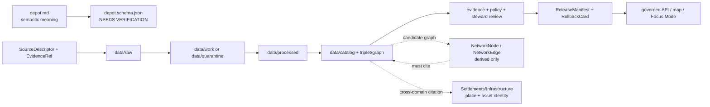

<!-- [KFM_META_BLOCK_V2]
doc_id: kfm://doc/contracts-domains-roads-rail-trade-depot
title: Depot Contract — Roads / Rail / Trade Routes
type: semantic-contract
version: v0.2
status: draft; PROPOSED; schema-missing; slug-CONFLICTED; NEEDS VERIFICATION before promotion
owners:
  - OWNER_TBD — Roads/Rail/Trade Routes domain steward
  - OWNER_TBD — Rail steward
  - OWNER_TBD — Settlements/Infrastructure steward
  - OWNER_TBD — Contracts steward
  - OWNER_TBD — Source steward
  - OWNER_TBD — Evidence steward
  - OWNER_TBD — Schema steward
  - OWNER_TBD — Policy steward
  - OWNER_TBD — Release steward
  - OWNER_TBD — Docs steward
created: NEEDS VERIFICATION — scaffold existed before v0.2 expansion
updated: 2026-06-23
policy_label: public; contracts; roads-rail-trade; depot; station; rail-facility; transport-side-claim; source-role-aware; temporal-scope-aware; evidence-bound; settlements-infrastructure-boundary-aware; operator-status-aware; graph-projection-aware; release-gated; rollback-aware; not-property-title; not-structural-inspection; not-live-service-status; not-legal-advice; not-publication-authority
tags: [kfm, contracts, roads-rail-trade, depot, station, rail, rail-segment, corridor-route, route-membership, transport-facility, siding, yard, operator-assignment, operator-status, status-event, route-event, access-restriction, settlement, infrastructure-identity, network-node, network-edge, source-role, valid-time, EvidenceBundle, PolicyDecision, ReviewRecord, ReleaseManifest, RollbackCard]
related:
  - ./README.md
  - ./rail_segment.md
  - ./siding.md
  - ./yard.md
  - ./transport_facility.md
  - ./operator_assignment.md
  - ./operator_status.md
  - ./route_event.md
  - ./status_event.md
  - ./access_restriction.md
  - ./network_node.md
  - ./network_edge.md
  - ../roads/README.md
  - ../../../docs/domains/roads-rail-trade/README.md
  - ../../../docs/domains/roads-rail-trade/CANONICAL_PATHS.md
  - ../../../docs/domains/roads-rail-trade/OBJECT_FAMILIES.md
  - ../../../docs/domains/roads-rail-trade/IDENTITY_MODEL.md
  - ../../../docs/domains/roads-rail-trade/SOURCES.md
  - ../../../docs/domains/roads-rail-trade/sublanes/rail.md
  - ../../../docs/domains/roads-rail-trade/GRAPH_PROJECTIONS.md
  - ../../../docs/domains/roads-rail-trade/MAP_UI_CONTRACTS.md
  - ../../../docs/runbooks/roads-rail-trade/PROMOTION_RUNBOOK.md
  - ../../../docs/runbooks/roads-rail-trade/ROLLBACK_RUNBOOK.md
  - ../../../schemas/contracts/v1/domains/roads-rail-trade/depot.schema.json
  - ../../../policy/domains/roads-rail-trade/
  - ../../../fixtures/domains/roads-rail-trade/depot/
  - ../../../tests/domains/roads-rail-trade/
  - ../../../release/candidates/roads-rail-trade/
notes:
  - "Expanded from a PROPOSED scaffold at contracts/domains/roads-rail-trade/depot.md."
  - "A paired schema at schemas/contracts/v1/domains/roads-rail-trade/depot.schema.json was not found in this task. Field realization remains PROPOSED."
  - "The parent domain names Depot as a Roads / Rail / Trade Routes object, while rail sublane doctrine warns that depot/facility canonical identity remains settlement/infrastructure-owned. This contract therefore defines the transport-side depot role claim, not full property, building, structural, title, legal-entity, or live-service authority."
  - "The Roads / Rail / Trade Routes docs record a slug conflict between roads-rail-trade and transport for contract/schema homes. This file preserves the observed requested path and does not resolve the ADR question."
[/KFM_META_BLOCK_V2] -->

<a id="top"></a>

# Depot Contract — Roads / Rail / Trade Routes

> Semantic contract for `depot`: the transport-side claim that a rail-associated place, building, stop, station, freight point, agency point, or historic site functioned as a depot in a rail network — without becoming settlement/infrastructure canonical identity, property title, structural condition, live service status, legal access, operator truth, graph truth, or publication approval.

<p>
  
  
  
  
  
  
  
</p>

`contracts/domains/roads-rail-trade/depot.md`

## Quick jumps

[Status](#status) · [Meaning](#meaning) · [Repo fit](#repo-fit) · [Schema posture](#schema-posture) · [Accepted uses](#accepted-uses) · [Exclusions](#exclusions) · [Recommended fields](#recommended-fields) · [Invariants](#invariants) · [Depot claim families](#depot-claim-families) · [Source-role and time rules](#source-role-and-time-rules) · [Lifecycle](#lifecycle) · [Validation](#validation) · [Rollback](#rollback) · [Evidence basis](#evidence-basis) · [Open questions](#open-questions)

---

## Status

> [!IMPORTANT]
> **Status:** `draft` / semantic contract  
> **Owner:** `OWNER_TBD`  
> **Contract path:** `contracts/domains/roads-rail-trade/depot.md`  
> **Schema path:** `schemas/contracts/v1/domains/roads-rail-trade/depot.schema.json` — **not found in this task**  
> **Truth posture:** the target path and prior scaffold are confirmed from current repo evidence. `Depot` is confirmed as a Roads / Rail / Trade Routes object term. Exact schema fields, validator behavior, fixture coverage, policy behavior, source-registry behavior, release manifests, emitted proofs, public API behavior, map rendering, graph behavior, and runtime behavior remain **NEEDS VERIFICATION**.

> [!CAUTION]
> This contract defines depot meaning only. It does **not** certify building identity, structural condition, preservation status, property ownership, title, legal access, active rail service, passenger service, freight service, operating railroad authority, ticketing, emergency status, map/API behavior, or publication approval.

---

## Meaning

`depot` records the semantic meaning of a rail-associated depot claim inside Roads / Rail / Trade Routes.

It may represent that a source asserts a depot:

- served as a passenger, freight, agency, flag-stop, station, transfer, junction, branchline, or historic rail facility;
- was associated with a `Rail Segment`, `CorridorRoute`, `RouteMembership`, `OperatorAssignment`, `OperatorStatus`, `RouteEvent`, `StatusEvent`, `Siding`, `Yard`, `NetworkNode`, or released map/Focus Mode view;
- had a source-scoped name, railroad/operator relation, timetable relation, plat/map relation, location, station code, historical period, or depot-site claim;
- may contribute to a released graph projection only as a governed, evidence-cited, release-gated derivative;
- may cite settlement, infrastructure, land, parcel, building, historical, or preservation evidence without absorbing those domains' authority.

The depot contract owns the **rail-network role claim**: how a place or facility functioned as a depot in rail movement, route evidence, operator evidence, and historical transport context. The canonical place/building/facility identity usually belongs to `settlements-infrastructure`. Property, parcel, deed, right-of-way, or ownership truth belongs to People/Land or the relevant source authority. Historic or culturally sensitive context remains owned by the appropriate domain and policy lane.

---

## Repo fit

| Responsibility | Path or root | Relationship |
|---|---|---|
| Parent contract lane | `./README.md` | Defines this folder as semantic contracts only. |
| Related rail contracts | `./rail_segment.md`, `./siding.md`, `./yard.md`, `./transport_facility.md` | Adjacent rail facility and segment meanings, where present. |
| Related operator/event contracts | `./operator_assignment.md`, `./operator_status.md`, `./route_event.md`, `./status_event.md`, `./access_restriction.md` | Depot operator, route, service, restriction, and status semantics. |
| Related graph contracts | `./network_node.md`, `./network_edge.md` | Derived topology; graph output must cite depot evidence. |
| Parent doctrine | `../../../docs/domains/roads-rail-trade/README.md` | Domain scope and object roster. |
| Object families | `../../../docs/domains/roads-rail-trade/OBJECT_FAMILIES.md` | Depot term and transport-facility/object-family posture. |
| Rail sublane dossier | `../../../docs/domains/roads-rail-trade/sublanes/rail.md` | Rail-specific realization and explicit non-ownership of depot/facility canonical identity. |
| Schemas | `../../../schemas/contracts/v1/domains/roads-rail-trade/` or ADR-selected alternate | Machine shape; paired schema missing in this task. |
| Policy | `../../../policy/domains/roads-rail-trade/` or ADR-selected alternate | Allow/deny/restrict/abstain decisions. |
| Fixtures/tests | `../../../fixtures/domains/roads-rail-trade/`, `../../../tests/domains/roads-rail-trade/` | Behavior proof; not contract prose. |
| Source registry | `../../../data/registry/sources/roads-rail-trade/` | Source authority, cadence, rights, and caveats. |
| Release/rollback | `../../../release/candidates/roads-rail-trade/` and release roots | Promotion, release, correction, and rollback. |

---

## Schema posture

A direct paired schema was checked at:

```text
schemas/contracts/v1/domains/roads-rail-trade/depot.schema.json
```

That file was **not found** in this task.

> [!WARNING]
> Because no paired schema was confirmed, every field below is **PROPOSED** semantic guidance. Do not treat it as machine-enforced until schema, fixtures, validator, policy tests, source registry records, release checks, and runtime behavior are verified.

---

## Accepted uses

| Use | Allowed? | Rule |
|---|---:|---|
| Defining rail-side depot semantics | Yes | Preserve source role, depot role, rail relation, time, evidence, and release posture. |
| Linking a depot to rail segments/routes/operators | Yes | Keep depot role, rail segment, corridor, route membership, operator, and event identity separate. |
| Citing settlement or infrastructure identity | Yes | Reference owning domain refs; do not absorb place/building/asset truth. |
| Supporting historic rail maps or Focus Mode | Conditional | Requires EvidenceBundle, PolicyDecision, review/release state, and rollback target. |
| Supporting graph topology | Conditional | Derived `NetworkNode`/`NetworkEdge` must cite depot evidence and not replace it. |
| Recording passenger/freight/agency function | Conditional | Must be source-scoped and time-scoped; not proof of current service. |
| Recording active service, ticketing, public access, or legal status | No | Requires authoritative current/legal source and separate governed posture. |
| Certifying building condition, ownership, or preservation status | No | Use owning infrastructure, property, preservation, or source authority paths. |

---

## Exclusions

`depot` must not be used as:

| Misuse | Required outcome |
|---|---|
| Canonical settlement, building, or infrastructure asset identity | Reference `settlements-infrastructure` or accepted asset contract; this contract owns rail role only. |
| Property title, deed, right-of-way, tax, or parcel truth | `ABSTAIN` or cite People/Land and source registry support. |
| Structural condition or preservation-status certificate | `DENY` / `ABSTAIN`; source-specific authority required. |
| Live passenger/freight service status | `DENY` unless current authoritative source, policy, review, and release support exist. |
| Legal public-access status | `ABSTAIN` unless authoritative source and release caveat support it. |
| Operator ownership or legal-entity truth | Use operator assignment/status contracts and legal-entity source references; do not infer. |
| Replacement for `Rail Segment`, `Siding`, `Yard`, `TransportFacility`, `NetworkNode`, or `NetworkEdge` | Keep object families separate. |
| Public API/map payload | Use governed API/released artifacts only. |
| Publication approval | ReleaseManifest and RollbackCard remain separate. |

---

## Recommended fields

The following fields are **PROPOSED** until a schema is added and validated.

| Field | Meaning |
|---|---|
| `id` | Canonical depot contract object identifier. |
| `version` | Contract/object version. |
| `spec_hash` | Deterministic hash over normalized depot claim content. |
| `domain` | Expected value: `roads-rail-trade` unless ADR selects another slug. |
| `depot_name` | Source-stated depot/station/facility name. |
| `depot_source_id` | Source-native depot or station identifier, if present and safe. |
| `depot_type` | Passenger depot, freight depot, agency station, flag stop, junction depot, union depot, historic depot site, candidate depot, or source-specific type. |
| `facility_role` | Rail-network role asserted by the source. |
| `source_ref` | SourceDescriptor/source registry reference. |
| `source_role` | Accepted source role; must be preserved from admission through publication. |
| `rail_segment_refs` | Rail Segment refs associated with this depot claim. |
| `corridor_route_refs` | CorridorRoute or historic route refs associated with the depot. |
| `route_membership_refs` | Segment-to-route membership refs that support the depot relation. |
| `operator_assignment_refs` | OperatorAssignment / OperatorStatus refs, if supported. |
| `status_refs` | StatusEvent, RouteEvent, or AccessRestriction refs, if any. |
| `siding_ref` | Siding ref where the depot relation depends on siding evidence. |
| `yard_ref` | Yard ref where the depot is associated with yard facilities. |
| `transport_facility_ref` | TransportFacility ref, if modeled separately. |
| `settlement_ref` | Settlement/place ref; cited, not owned here. |
| `infrastructure_asset_ref` | External infrastructure/building/facility identity ref, if owned by another lane. |
| `land_or_parcel_ref` | Land/parcel/right-of-way reference, if relevant and policy-safe. |
| `geometry_ref` | Point/line/polygon/generalized geometry reference; not legal location or property proof by itself. |
| `network_node_ref` | Derived or source-supported network node reference, if separate. |
| `valid_time` | Interval during which this depot role is asserted to apply. |
| `source_time` | Source creation, publication, recording, timetable, map, or update time. |
| `retrieval_time` | KFM retrieval/freeze time. |
| `release_time` | KFM governed release time, if released. |
| `evidence_refs` | EvidenceRefs or EvidenceBundle refs. |
| `policy_decision_ref` | PolicyDecision governing use or publication. |
| `review_ref` | ReviewRecord or steward review ref. |
| `release_manifest_ref` | ReleaseManifest for public/semi-public exposure. |
| `rollback_ref` | RollbackCard or rollback target. |
| `limitations` | Caveats: rail-role claim only; not property, structure, legal, live service, operator, routing, or release authority. |

---

## Invariants

1. **Depot is a rail-role claim.** It does not own every fact about the place, building, property, settlement, owner, operator, or service.
2. **Depot is not settlement/infrastructure identity.** Place/building/facility canonical identity is cited from the owning domain.
3. **Depot is not property/title truth.** Parcel, deed, right-of-way, tax, and ownership records remain People/Land or source-authority concerns.
4. **Depot is not active service truth.** Historical timetable or map evidence does not prove current passenger, freight, ticketing, or public-access status.
5. **Depot is not operator authority.** Operator assertions are separate source-scoped events/assignments.
6. **Depot is not graph truth.** Network nodes and edges may derive from depot evidence but must not replace the evidence-backed depot record.
7. **Source role survives promotion.** Administrative, candidate, modeled, observed, regulatory, aggregate, synthetic, or restricted roles never upgrade through polished wording.
8. **Temporal support stays explicit.** Source time, valid time, retrieval time, release time, and correction time remain distinct where material.
9. **Publication requires release artifacts.** A depot is not public truth until EvidenceBundle, PolicyDecision, review state, ReleaseManifest, correction path, and rollback target are present.

---

## Depot claim families

| Claim family | Meaning | Special guardrail |
|---|---|---|
| `passenger_depot` | Source asserts passenger depot/station function. | Not proof of current passenger service. |
| `freight_depot` | Source asserts freight, warehouse, stockyard, or shipping function. | Not proof of current freight service or legal access. |
| `agency_station` | Source asserts agency/railroad administrative station function. | Operator/legal status must remain source-scoped. |
| `flag_stop` | Source asserts a stop with limited or conditional service. | Preserve source time and service caveats. |
| `junction_depot` | Source asserts depot role at a junction or interchange. | Keep depot, junction, route membership, and network node separate. |
| `union_depot` | Source asserts multi-operator or multi-route depot role. | Operator assignments must be explicit and time-scoped. |
| `historic_depot_site` | Historical source asserts a depot once existed or functioned there. | Preserve uncertainty and do not imply surviving structure. |
| `candidate_depot` | OCR, map georeference, connector, or model proposes a depot. | Candidate until reviewed; no public release without evidence and policy gates. |

---

## Source-role and time rules

Depot records must carry source role and time as part of meaning, not as optional decoration.

| Rule | Requirement |
|---|---|
| Source role is fixed at admission | Promotion never turns a roster, timetable, map label, OCR hit, or connector candidate into observed depot truth. |
| Candidate depots remain candidates | A label on a map or OCR extraction may propose a depot, but review and evidence closure are required before stronger claims. |
| Geometry does not equal identity | A depot point near tracks is not enough to merge station, building, settlement, parcel, and network-node identity. |
| Valid time is not retrieval time | Historic depots, moved depots, renamed stations, abandoned lines, and successor operators require distinct time axes. |
| Operator and status are separate | Railroad/operator, active/inactive status, service type, and restrictions belong in separate time-scoped refs. |
| Release time is explicit | Public display must cite the release artifact and rollback target. |

---

## Lifecycle



Contracts describe meaning. They do not move data, validate schemas, make policy decisions, close evidence, perform review, publish artifacts, define routes, render maps, or authorize AI answers.

---

## Validation

Before this contract is treated as mature, maintainers should verify:

- [ ] the ADR-selected contract/schema slug and whether this file should remain under `contracts/domains/roads-rail-trade/` or migrate to `contracts/transport/`;
- [ ] paired schema exists and includes source role, depot type, rail/facility refs, operator refs, time axes, evidence, policy, review, release, and rollback refs;
- [ ] fixtures cover passenger depots, freight depots, agency stations, flag stops, union depots, historic depot sites, moved/renamed depots, and candidate OCR/map-label depots;
- [ ] tests prevent depot labels from becoming confirmed depot truth without evidence and review;
- [ ] tests prevent depot records from absorbing settlement/infrastructure, parcel/title, operator/legal-entity, or active-service authority;
- [ ] tests preserve depot / station / transport-facility / rail-segment / siding / yard / network-node separation;
- [ ] policy tests block live service, public access, property/title, structural condition, and legal-status claims unless source/release support exists;
- [ ] public DTOs and map/Focus Mode payloads require EvidenceBundle, PolicyDecision, ReviewRecord, ReleaseManifest, correction path, and RollbackCard;
- [ ] rollback invalidates derived graph nodes/edges, layer caches, API payloads, exports, Focus Mode states, and AI summaries that cited the depot.

---

## Rollback

Rollback or correction is required when this contract:

- claims depot schema, policy, fixtures, tests, source registry, lifecycle data, release, API, UI, or runtime behavior exists without proof;
- hides the `roads-rail-trade` vs `transport` slug conflict;
- treats a map label, roster row, OCR hit, or timetable entry as confirmed depot truth without evidence and review;
- collapses depot, station, settlement, building, parcel, rail segment, siding, yard, operator assignment, network node, or network edge into one object;
- treats graph topology as canonical evidence;
- implies property/title, structural condition, active service, legal access, operator authority, emergency status, or public release without required support;
- publishes or renders unsupported depot claims through maps, Focus Mode, exports, graph views, or AI narrative.

Rollback target: revert this file to prior scaffold blob SHA `a379dc4e347605d0f63822d3b909227f925e9ed4`, record drift if authority boundaries were affected, and invalidate downstream derivatives that cited the weakened depot contract.

---

## Evidence basis

| Evidence | Status | Supports | Limit |
|---|---|---|---|
| Prior `contracts/domains/roads-rail-trade/depot.md` | `CONFIRMED` | Target file existed as a PROPOSED scaffold. | Scaffold did not define authoritative semantic contract content. |
| `contracts/domains/roads-rail-trade/README.md` | `CONFIRMED` | Parent contract-lane boundary, object-family index, slug conflict, lifecycle, validation, and rollback posture. | Does not prove object-level schema/test maturity. |
| `docs/domains/roads-rail-trade/README.md` | `CONFIRMED doctrine / PROPOSED implementation` | Domain scope, object roster naming `Depot`, slug divergence, explicit non-ownership, and cross-root responsibility split. | Draft; implementation references remain PROPOSED. |
| `docs/domains/roads-rail-trade/OBJECT_FAMILIES.md` | `CONFIRMED doctrine / PROPOSED field realization` | Depot as object term, transport-facility family context, identity posture, source-role anti-collapse, and temporal handling. | Field-level schemas and cardinalities remain NEEDS VERIFICATION. |
| `docs/domains/roads-rail-trade/sublanes/rail.md` | `CONFIRMED doctrine / PROPOSED implementation` | Rail-specific realization of depot/siding/yard and explicit non-ownership of canonical depot/facility identity. | Sublane convention and implementation status remain PROPOSED / NEEDS VERIFICATION. |
| `contracts/domains/roads-rail-trade/bridge.md` | `CONFIRMED sibling style` | Adjacent expanded semantic-contract pattern for transport-side object with cross-lane boundaries and schema-missing posture. | Bridge-specific; does not define Depot schema. |
| `schemas/contracts/v1/domains/roads-rail-trade/depot.schema.json` lookup | `CONFIRMED not found in this task` | Justifies `schema-missing` and PROPOSED field posture. | Does not rule out alternate schema homes such as `transport/`. |
| Uploaded authoring prompt v2 | `CONFIRMED user-supplied guidance` | Requires evidence-grounded, visually polished, implementation-honest Markdown with verification and rollback posture. | Authoring guidance, not implementation proof. |

---

## Open questions

| ID | Question | Status |
|---|---|---|
| OQ-RRT-DEPOT-01 | Should `depot.md` remain at `contracts/domains/roads-rail-trade/` or migrate to `contracts/transport/` after slug ADR resolution? | OPEN / ADR NEEDED |
| OQ-RRT-DEPOT-02 | Which `depot_type` and `facility_role` enum values are accepted by schemas and validators? | OPEN / SCHEMA REVIEW |
| OQ-RRT-DEPOT-03 | When should a depot be modeled as `Depot`, `TransportFacility`, `Siding`, `Yard`, or a settlement/infrastructure asset ref? | OPEN / DOMAIN REVIEW |
| OQ-RRT-DEPOT-04 | Which source families can confirm depot function versus only propose a candidate from a map label, timetable, roster, OCR hit, or local-history source? | OPEN / SOURCE STEWARD REVIEW |
| OQ-RRT-DEPOT-05 | What public-safe map and Focus Mode language avoids implying active service, public access, property ownership, structural condition, or legal status? | OPEN / POLICY REVIEW |

<p align="right"><a href="#top">Back to top</a></p>
