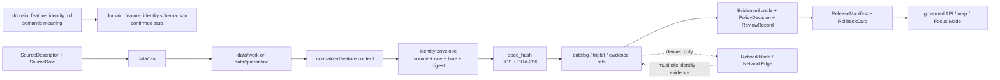

<!-- [KFM_META_BLOCK_V2]
doc_id: kfm://doc/contracts-domains-roads-rail-trade-domain-feature-identity
title: Domain Feature Identity Contract — Roads / Rail / Trade Routes
type: semantic-contract
version: v0.2
status: draft; PROPOSED; schema-stub-confirmed; validator-missing; slug-CONFLICTED; NEEDS VERIFICATION before promotion
owners:
  - OWNER_TBD — Roads/Rail/Trade Routes domain steward
  - OWNER_TBD — Identity steward
  - OWNER_TBD — Contracts steward
  - OWNER_TBD — Source steward
  - OWNER_TBD — Evidence steward
  - OWNER_TBD — Schema steward
  - OWNER_TBD — Policy steward
  - OWNER_TBD — Release steward
  - OWNER_TBD — Docs steward
created: NEEDS VERIFICATION — greenfield scaffold existed before v0.2 expansion
updated: 2026-06-23
policy_label: public; contracts; roads-rail-trade; domain-feature-identity; identity-envelope; spec-hash; source-role-aware; temporal-scope-aware; evidence-bound; graph-projection-aware; release-gated; rollback-aware; not-geometry-only; not-source-truth; not-schema-authority; not-publication-authority
tags: [kfm, contracts, roads-rail-trade, domain_feature_identity, identity, identity-envelope, spec_hash, jcs, sha256, source-role, temporal-scope, normalized-digest, EvidenceBundle, SourceDescriptor, PolicyDecision, ReviewRecord, ReleaseManifest, RollbackCard, NetworkEdge, DomainFeature]
related:
  - ./README.md
  - ./domain_observation.md
  - ./road_segment.md
  - ./rail_segment.md
  - ./corridor_route.md
  - ./route_membership.md
  - ./network_node.md
  - ./network_edge.md
  - ./crossing.md
  - ./bridge.md
  - ./ferry.md
  - ./depot.md
  - ./siding.md
  - ./yard.md
  - ../roads/README.md
  - ../../../docs/domains/roads-rail-trade/README.md
  - ../../../docs/domains/roads-rail-trade/CANONICAL_PATHS.md
  - ../../../docs/domains/roads-rail-trade/OBJECT_FAMILIES.md
  - ../../../docs/domains/roads-rail-trade/IDENTITY_MODEL.md
  - ../../../docs/domains/roads-rail-trade/DATA_LIFECYCLE.md
  - ../../../docs/domains/roads-rail-trade/GRAPH_PROJECTIONS.md
  - ../../../docs/runbooks/roads-rail-trade/PROMOTION_RUNBOOK.md
  - ../../../docs/runbooks/roads-rail-trade/ROLLBACK_RUNBOOK.md
  - ../../../schemas/contracts/v1/domains/roads-rail-trade/domain_feature_identity.schema.json
  - ../../../fixtures/domains/roads-rail-trade/domain_feature_identity/
  - ../../../policy/domains/roads-rail-trade/
  - ../../../tests/domains/roads-rail-trade/
  - ../../../release/candidates/roads-rail-trade/
notes:
  - "Expanded from a generic greenfield scaffold at contracts/domains/roads-rail-trade/domain_feature_identity.md."
  - "A paired schema stub was found at schemas/contracts/v1/domains/roads-rail-trade/domain_feature_identity.schema.json. It only requires id and leaves additionalProperties true, so field realization remains PROPOSED."
  - "The schema names a validator path at tools/validators/domains/roads-rail-trade/validate_domain_feature_identity.py, but that validator was not found in this task. Validator behavior remains NEEDS VERIFICATION."
  - "This contract defines semantic identity for domain features. It does not resolve source truth, geometry truth, graph truth, policy decisions, release state, public API shape, map rendering, or runtime behavior."
  - "The Roads / Rail / Trade Routes docs record a slug conflict between roads-rail-trade and transport for contract/schema homes. This file preserves the observed requested path and does not resolve the ADR question."
[/KFM_META_BLOCK_V2] -->

<a id="top"></a>

# Domain Feature Identity Contract — Roads / Rail / Trade Routes

> Semantic contract for `domain_feature_identity`: the evidence-bound identity envelope that tells KFM when a Roads / Rail / Trade Routes feature is the same asserted feature across source, role, time, normalization, release, correction, and graph projection — without letting geometry, source labels, map display, graph edges, or generated language become sovereign truth.

<p>
  
  
  
  
  
  
  
</p>

`contracts/domains/roads-rail-trade/domain_feature_identity.md`

## Quick jumps

[Status](#status) · [Meaning](#meaning) · [Repo fit](#repo-fit) · [Schema posture](#schema-posture) · [Accepted uses](#accepted-uses) · [Exclusions](#exclusions) · [Recommended fields](#recommended-fields) · [Identity envelope](#identity-envelope) · [Invariants](#invariants) · [Feature identity families](#feature-identity-families) · [Source-role and time rules](#source-role-and-time-rules) · [Lifecycle](#lifecycle) · [Validation](#validation) · [Rollback](#rollback) · [Evidence basis](#evidence-basis) · [Open questions](#open-questions)

---

## Status

> [!IMPORTANT]
> **Status:** `draft` / semantic contract  
> **Owner:** `OWNER_TBD`  
> **Contract path:** `contracts/domains/roads-rail-trade/domain_feature_identity.md`  
> **Schema path:** `schemas/contracts/v1/domains/roads-rail-trade/domain_feature_identity.schema.json` — **confirmed as a stub in this task**  
> **Validator path named by schema:** `tools/validators/domains/roads-rail-trade/validate_domain_feature_identity.py` — **not found in this task**  
> **Truth posture:** target path, prior scaffold, and paired schema stub are confirmed from current repo evidence. Field-level meaning is expanded here as **PROPOSED semantic guidance**. Validator behavior, fixture coverage, policy behavior, release manifests, emitted proofs, public API behavior, map rendering, graph behavior, and runtime behavior remain **NEEDS VERIFICATION**.

> [!CAUTION]
> This contract defines feature identity meaning only. It does **not** prove the feature exists, certify geometry, settle source conflicts, define legal status, publish a claim, validate a graph projection, authorize a map payload, or approve AI answers.

---

## Meaning

`domain_feature_identity` records the semantic identity envelope for a Roads / Rail / Trade Routes feature or feature-like assertion.

It may be used to describe how KFM distinguishes, compares, and preserves identity for:

- road, rail, corridor, route-membership, crossing, bridge, ferry, depot, siding, yard, freight corridor, route event, operator status, access restriction, network node, network edge, and movement-story objects;
- source-scoped features that look geometrically similar but differ by source role, time, rights, precision, review state, or normalization history;
- candidate, modeled, administrative, observed, aggregate, synthetic, regulatory, or restricted feature claims that must not collapse into each other merely because their geometry or names appear similar;
- derived graph or map features that must cite canonical evidence records instead of becoming canonical records themselves;
- corrected, superseded, or rolled-back feature identities that must remain auditable after promotion.

This contract owns the **meaning of the identity envelope**. It does not own object-specific semantics like `road_segment`, `crossing`, `depot`, or `network_edge`; those remain in their object contracts. It also does not own machine-checkable schema enforcement, validators, fixtures, source registry records, policy decisions, release manifests, public API DTOs, map rendering, or graph runtime behavior.

---

## Repo fit

| Responsibility | Path or root | Relationship |
|---|---|---|
| Parent contract lane | `./README.md` | Defines this folder as semantic contracts only. |
| Identity doctrine | `../../../docs/domains/roads-rail-trade/IDENTITY_MODEL.md` | Governs identity formula, `spec_hash`, source-role anti-collapse, and time separation. |
| Object-family doctrine | `../../../docs/domains/roads-rail-trade/OBJECT_FAMILIES.md` | Lists object families that need identity discipline. |
| Domain doctrine | `../../../docs/domains/roads-rail-trade/README.md` | Domain scope, slug conflict, and cross-root responsibility split. |
| Paired schema stub | `../../../schemas/contracts/v1/domains/roads-rail-trade/domain_feature_identity.schema.json` | Machine-shape placeholder; confirmed stub, not mature enforcement. |
| Object contracts | `./road_segment.md`, `./rail_segment.md`, `./corridor_route.md`, `./route_membership.md`, `./crossing.md`, `./bridge.md`, `./ferry.md`, `./depot.md`, `./siding.md`, `./yard.md` | Consumers of the identity envelope; each still owns its object-specific semantics. |
| Observation contract | `./domain_observation.md` | Companion scaffold for observation semantics; should not be collapsed into identity. |
| Graph contracts | `./network_node.md`, `./network_edge.md` | Derived graph identity must cite feature identity and evidence, not replace them. |
| Policy | `../../../policy/domains/roads-rail-trade/` or ADR-selected alternate | Allow/deny/restrict/abstain decisions. |
| Fixtures/tests | `../../../fixtures/domains/roads-rail-trade/`, `../../../tests/domains/roads-rail-trade/` | Behavior proof; not contract prose. |
| Source registry | `../../../data/registry/sources/roads-rail-trade/` | Source authority, cadence, rights, and caveats. |
| Release/rollback | `../../../release/candidates/roads-rail-trade/` and release roots | Promotion, release, correction, rollback, and derivative invalidation. |

---

## Schema posture

A paired schema stub was found at:

```text
schemas/contracts/v1/domains/roads-rail-trade/domain_feature_identity.schema.json
```

The stub currently:

- declares the title `domain_feature_identity`;
- points back to this contract document;
- names fixtures, validator, and policy roots;
- exposes `spec_hash`, `id`, and `version` properties;
- requires only `id`;
- leaves `additionalProperties` as `true`.

> [!WARNING]
> Because the schema is a placeholder stub and the named validator was not found in this task, every field below remains **PROPOSED** semantic guidance until schema, validator, fixtures, tests, policy checks, release checks, and runtime behavior are verified.

---

## Accepted uses

| Use | Allowed? | Rule |
|---|---:|---|
| Defining the semantic identity envelope for a transport feature | Yes | Must include source role, temporal scope, normalized digest, evidence posture, and release/correction posture. |
| Comparing two feature claims for possible identity equivalence | Yes | Use deterministic envelope comparison and documented reconciliation; never geometry alone. |
| Preserving separate identities for similar geometry from different sources | Yes | Source, role, time, rights, and normalization differences remain material. |
| Supporting object-specific contracts | Yes | Object contracts may cite this identity envelope but must keep object semantics separate. |
| Supporting graph projection | Conditional | Graph nodes/edges may derive from identity records only when they cite evidence and remain derived. |
| Supporting map/Focus Mode display | Conditional | Requires EvidenceBundle, PolicyDecision, ReviewRecord, ReleaseManifest, correction path, and RollbackCard. |
| Resolving source disagreement | Conditional | Requires explicit reconciliation record, evidence, review, and policy posture. |
| Proving feature existence or legal status | No | Identity is not truth, legal authority, or publication approval. |

---

## Exclusions

`domain_feature_identity` must not be used as:

| Misuse | Required outcome |
|---|---|
| Geometry-only identity | `DENY`; geometry can contribute content but cannot be the full identity basis. |
| Source truth | Cite EvidenceBundle and source registry; identity does not prove the source assertion is true. |
| Legal road/rail/operator/access status | `ABSTAIN` unless object-specific evidence, policy, and release state support it. |
| Object-specific contract replacement | Keep `road_segment`, `rail_segment`, `crossing`, `depot`, `network_edge`, etc. separate. |
| Observation event replacement | Use observation/event contracts for observed acts, status changes, or source events. |
| Graph canonical truth | Derived graph projections must cite feature identity and evidence; they do not become canonical records. |
| Public API/map payload by itself | Use governed API/released artifacts only. |
| Publication approval | ReleaseManifest, ReviewRecord, and RollbackCard remain separate object families. |

---

## Recommended fields

The following fields are **PROPOSED** until schema and validator behavior are expanded and verified.

| Field | Meaning |
|---|---|
| `id` | Canonical identity-record identifier. Required by current schema stub. |
| `version` | Contract/object version. |
| `spec_hash` | Deterministic hash over the normalized identity envelope. Present in current schema stub. |
| `domain` | Expected value: `roads-rail-trade` unless ADR selects another slug. |
| `feature_family` | Object family being identified, such as `road_segment`, `rail_segment`, `crossing`, `depot`, `network_edge`, or `movement_story_node`. |
| `feature_role` | Role within the family; equivalent to the identity model's `object_role` concept. |
| `source_ref` | SourceDescriptor/source registry reference. |
| `source_id` | Stable source identifier used in the identity envelope. |
| `source_role` | Source role fixed at admission and preserved through promotion. |
| `source_native_id` | External authority or source-native identifier, if present and safe. Evidence anchor, not KFM identity by itself. |
| `temporal_scope` | Identity-relevant source/valid/vintage time scope. |
| `source_time` | Source creation, publication, recording, inspection, or update time. |
| `retrieval_time` | KFM retrieval/freeze time. |
| `release_time` | KFM governed release time, if released. |
| `correction_time` | Time of correction, supersession, rollback, or deprecation where applicable. |
| `normalized_digest` | Digest over normalized feature content before final identity-envelope hash. |
| `canonicalization_method` | Expected default: JCS over JSON unless an accepted graph/RDF exception applies. |
| `hash_algorithm` | Expected default: SHA-256. |
| `identity_envelope_ref` | Reference to serialized identity envelope or receipt, if materialized separately. |
| `geometry_ref` | Geometry or generalized geometry reference; content/evidence only, not sufficient identity. |
| `evidence_refs` | EvidenceRefs or EvidenceBundle refs supporting the identity record. |
| `policy_decision_ref` | PolicyDecision governing use or publication. |
| `review_ref` | ReviewRecord or steward review ref. |
| `release_manifest_ref` | ReleaseManifest for public/semi-public exposure. |
| `rollback_ref` | RollbackCard or rollback target. |
| `supersedes_ref` | Prior identity record superseded by this one, if any. |
| `superseded_by_ref` | Later identity record replacing this one, if any. |
| `reconciliation_ref` | Record documenting identity merge/split/reconciliation, if any. |
| `limitations` | Caveats: identity only; not truth, geometry certification, legal status, release, graph, or public API authority. |

---

## Identity envelope

The identity model defines the governing envelope as:

```text
identity_envelope = ( source_id , object_role , temporal_scope , normalized_digest )
spec_hash         = "jcs:sha256:" + sha256( rfc8785_canonicalize( identity_envelope ) )
```

For this contract, the semantic mapping is:

| Identity model term | `domain_feature_identity` term | Meaning |
|---|---|---|
| `source_id` | `source_id` / `source_ref` | Which admitted source produced the feature assertion. |
| `object_role` | `feature_family` + `feature_role` | What kind of thing the source assertion is claiming and what role it plays. |
| `temporal_scope` | `temporal_scope` | Which source/valid/vintage time scope the identity belongs to. |
| `normalized_digest` | `normalized_digest` | Hash/digest of normalized content after KFM transforms and before envelope hash. |
| `spec_hash` | `spec_hash` | Deterministic identity hash over the envelope. |

> [!IMPORTANT]
> External identifiers such as source-native IDs, route numbers, crossing IDs, station names, map labels, or authority anchors may be strong evidence. They are not the full KFM identity by themselves unless an accepted contract and schema explicitly define them as part of the normalized envelope.

---

## Invariants

1. **Identity is not geometry.** Geometry may be evidence/content, but it is never sufficient by itself.
2. **Identity is not truth.** An identity record says how KFM distinguishes the assertion; it does not prove the assertion is correct.
3. **Identity is source-role-aware.** Source role is fixed at admission and must survive every promotion, reconciliation, release, and rollback.
4. **Identity is time-aware.** Source time, valid time, retrieval time, release time, correction time, and temporal scope stay distinct where material.
5. **Identity does not collapse object families.** A depot, rail segment, crossing, route membership, network node, and network edge remain separate identities even when they share coordinates or names.
6. **Identity does not replace evidence.** Every consequential identity record must resolve through EvidenceRef/EvidenceBundle before publication or authoritative answer.
7. **Identity does not replace policy.** PolicyDecision remains the allow/deny/restrict/abstain authority.
8. **Identity does not replace review.** Steward review, release state, correction lineage, and rollback target remain separate object families.
9. **Derived projections remain derived.** Graph, map, tile, API, Focus Mode, and AI outputs must cite identity/evidence records; they do not become root truth.
10. **Merges and splits require receipts.** Identity reconciliation must be auditable and reversible.

---

## Feature identity families

| Feature family | Identity concern | Guardrail |
|---|---|---|
| `road_segment` / `rail_segment` | Similar alignments from different source vintages. | Never merge by geometry alone. |
| `corridor_route` / `route_membership` | Route/corridor groupings vs segment membership. | Keep route identity and segment membership identity separate. |
| `crossing` / `bridge` / `ferry` / `river_crossing` | Same place may have multiple relation/specialization identities. | Cite companion identities; do not collapse them. |
| `depot` / `siding` / `yard` / `transport_facility` | Rail role vs place/building/facility identity. | Cite Settlements/Infrastructure where canonical facility identity belongs elsewhere. |
| `operator_assignment` / `operator_status` | Operator relation over time. | Legal entity/operator truth remains source-scoped and time-scoped. |
| `restriction_event` / `status_event` / `route_event` | Event identity differs from feature identity. | Events may affect a feature but do not become the feature. |
| `network_node` / `network_edge` | Derived topology identity. | Graph identity must cite canonical evidence and stay derived. |
| `movement_story_node` | Narrative/public-facing explanation unit. | AI/narrative identity remains evidence-subordinate and release-gated. |

---

## Source-role and time rules

| Rule | Requirement |
|---|---|
| Source role is part of identity context | Promotion never turns a candidate, aggregate, administrative, synthetic, or modeled source into observed truth. |
| External IDs are evidence anchors | Source-native IDs help match evidence, but the KFM identity envelope still records source, role, time, and digest. |
| Similarity is not equivalence | Name match, proximity, route-number match, or geometry overlap can propose reconciliation, not prove it. |
| Temporal scope is identity-relevant | A 1910 rail depot claim, a 1950 route alignment, and a 2024 road segment cannot silently collapse. |
| Correction is explicit | Corrections, supersessions, merges, and splits must preserve previous identity and rollback targets. |
| Release is separate | An identity record may exist before release; public use requires release artifacts and policy approval. |

---

## Lifecycle



Contracts describe meaning. They do not validate schema shape, execute hash computation, reconcile identities, make policy decisions, close evidence, publish artifacts, render maps, or authorize AI answers.

---

## Validation

Before this contract is treated as mature, maintainers should verify:

- [ ] the ADR-selected contract/schema slug and whether this file should remain under `contracts/domains/roads-rail-trade/` or migrate to `contracts/transport/`;
- [ ] paired schema is upgraded beyond stub status and constrains identity envelope fields, source role, temporal scope, canonicalization method, hash algorithm, evidence refs, release refs, and rollback refs;
- [ ] named validator exists and validates deterministic `spec_hash` formation;
- [ ] fixtures prove identical normalized envelopes produce identical `spec_hash` values;
- [ ] fixtures prove source, role, time, or normalized-content changes produce distinct identities unless an explicit reconciliation record exists;
- [ ] tests prevent geometry-only identity merges;
- [ ] tests prevent graph nodes/edges, map features, tiles, summaries, or AI outputs from replacing canonical identity/evidence records;
- [ ] source-role tests prevent administrative/context/candidate records from becoming observed/regulatory truth through promotion wording;
- [ ] public DTOs and map/Focus Mode payloads require EvidenceBundle, PolicyDecision, ReviewRecord, ReleaseManifest, correction path, and RollbackCard;
- [ ] rollback invalidates derived graph edges, layer caches, API payloads, exports, Focus Mode states, and AI summaries that cited the identity record.

---

## Rollback

Rollback or correction is required when this contract:

- claims validator, fixture, test, release, API, UI, graph, or runtime behavior exists without proof;
- hides the `roads-rail-trade` vs `transport` slug conflict;
- treats geometry, source-native ID, name, map label, route number, or graph node as sufficient identity by itself;
- collapses source role, object family, event identity, feature identity, graph identity, or release state;
- treats identity records as truth, policy, review, or publication approval;
- permits public maps, Focus Mode, exports, graph views, or AI narrative to render unsupported identity claims as authoritative.

Rollback target: revert this file to prior scaffold blob SHA `ec6a8e9073493be34e4c78ef59447cb6f2966521`, record drift if authority boundaries were affected, and invalidate downstream derivatives that cited the weakened identity contract.

---

## Evidence basis

| Evidence | Status | Supports | Limit |
|---|---|---|---|
| Prior `contracts/domains/roads-rail-trade/domain_feature_identity.md` | `CONFIRMED` | Target file existed as a greenfield scaffold. | Scaffold did not define authoritative semantic contract content. |
| `schemas/contracts/v1/domains/roads-rail-trade/domain_feature_identity.schema.json` | `CONFIRMED schema stub` | Paired schema exists, points to this contract, and contains `id`, `version`, `spec_hash`. | Stub requires only `id`, permits additional properties, and does not prove mature validation. |
| Named validator lookup | `CONFIRMED not found in this task` | Supports validator-missing posture. | Does not prove no alternate validator exists. |
| `contracts/domains/roads-rail-trade/README.md` | `CONFIRMED` | Parent contract-lane boundary, slug conflict, lifecycle, validation, and rollback posture. | Does not prove object-level validator/test maturity. |
| `docs/domains/roads-rail-trade/IDENTITY_MODEL.md` | `CONFIRMED doctrine / PROPOSED implementation` | Identity envelope, `spec_hash`, source-role anti-collapse, geometry-not-identity rule, and time separation. | Field realization and runtime behavior remain NEEDS VERIFICATION. |
| `docs/domains/roads-rail-trade/OBJECT_FAMILIES.md` | `CONFIRMED doctrine / PROPOSED field realization` | Object-family roster requiring identity discipline. | Field-level schemas and cardinalities remain NEEDS VERIFICATION. |
| Uploaded authoring prompt v2 | `CONFIRMED user-supplied guidance` | Requires evidence-grounded, visually polished, implementation-honest Markdown with verification and rollback posture. | Authoring guidance, not implementation proof. |

---

## Open questions

| ID | Question | Status |
|---|---|---|
| OQ-RRT-DFI-01 | Should `domain_feature_identity.md` remain at `contracts/domains/roads-rail-trade/` or migrate to `contracts/transport/` after slug ADR resolution? | OPEN / ADR NEEDED |
| OQ-RRT-DFI-02 | Which fields must be required by the schema beyond `id`, and which remain optional extension points? | OPEN / SCHEMA REVIEW |
| OQ-RRT-DFI-03 | What exact source-role enum is accepted by this lane, and how should legacy role names be mapped? | OPEN / SOURCE STEWARD REVIEW |
| OQ-RRT-DFI-04 | When does a similarity match become an identity reconciliation, and what receipt/review object records that decision? | OPEN / IDENTITY REVIEW |
| OQ-RRT-DFI-05 | Which graph-projection cases require plain JCS hashing versus graph/RDF canonicalization? | OPEN / GRAPH REVIEW |
| OQ-RRT-DFI-06 | What public-safe map and Focus Mode wording prevents identity records from being mistaken for proof, legal status, or release approval? | OPEN / POLICY REVIEW |

<p align="right"><a href="#top">Back to top</a></p>
