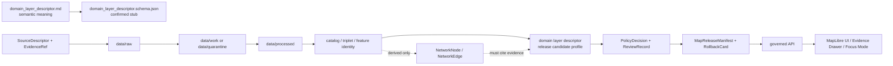

<!-- [KFM_META_BLOCK_V2]
doc_id: kfm://doc/contracts-domains-roads-rail-trade-domain-layer-descriptor
title: Domain Layer Descriptor Contract — Roads / Rail / Trade Routes
type: semantic-contract
version: v0.2
status: draft; PROPOSED; schema-stub-confirmed; validator-missing; slug-CONFLICTED; NEEDS VERIFICATION before promotion
owners:
  - OWNER_TBD — Roads/Rail/Trade Routes domain steward
  - OWNER_TBD — Map/UI steward
  - OWNER_TBD — Contracts steward
  - OWNER_TBD — Source steward
  - OWNER_TBD — Evidence steward
  - OWNER_TBD — Schema steward
  - OWNER_TBD — Policy steward
  - OWNER_TBD — Release steward
  - OWNER_TBD — Docs steward
created: NEEDS VERIFICATION — greenfield scaffold existed before v0.2 expansion
updated: 2026-06-23
policy_label: public; contracts; roads-rail-trade; domain-layer-descriptor; layer-manifest-profile; map-ui; evidence-drawer; focus-mode; source-role-aware; temporal-scope-aware; policy-aware; release-gated; rollback-aware; not-style-authority; not-tile-authority; not-renderer-authority; not-publication-authority
tags: [kfm, contracts, roads-rail-trade, domain_layer_descriptor, layer-descriptor, LayerManifest, MapReleaseManifest, StyleManifest, TileArtifactManifest, EvidenceDrawerPayload, MapContextEnvelope, FocusMode, EvidenceBundle, PolicyDecision, ReviewRecord, ReleaseManifest, RollbackCard, MapLibre]
related:
  - ./README.md
  - ./domain_feature_identity.md
  - ./domain_observation.md
  - ./road_segment.md
  - ./rail_segment.md
  - ./corridor_route.md
  - ./route_membership.md
  - ./network_node.md
  - ./network_edge.md
  - ./crossing.md
  - ./bridge.md
  - ./ferry.md
  - ./depot.md
  - ../roads/README.md
  - ../../../docs/domains/roads-rail-trade/README.md
  - ../../../docs/domains/roads-rail-trade/CANONICAL_PATHS.md
  - ../../../docs/domains/roads-rail-trade/OBJECT_FAMILIES.md
  - ../../../docs/domains/roads-rail-trade/IDENTITY_MODEL.md
  - ../../../docs/domains/roads-rail-trade/MAP_UI_CONTRACTS.md
  - ../../../docs/domains/roads-rail-trade/GRAPH_PROJECTIONS.md
  - ../../../docs/domains/roads-rail-trade/DATA_LIFECYCLE.md
  - ../../../docs/runbooks/roads-rail-trade/PROMOTION_RUNBOOK.md
  - ../../../docs/runbooks/roads-rail-trade/ROLLBACK_RUNBOOK.md
  - ../../../schemas/contracts/v1/domains/roads-rail-trade/domain_layer_descriptor.schema.json
  - ../../../fixtures/domains/roads-rail-trade/domain_layer_descriptor/
  - ../../../policy/domains/roads-rail-trade/
  - ../../../tests/domains/roads-rail-trade/
  - ../../../release/candidates/roads-rail-trade/
notes:
  - "Expanded from a generic greenfield scaffold at contracts/domains/roads-rail-trade/domain_layer_descriptor.md."
  - "A paired schema stub was found at schemas/contracts/v1/domains/roads-rail-trade/domain_layer_descriptor.schema.json. It only requires id and leaves additionalProperties true, so field realization remains PROPOSED."
  - "The schema names a validator path at tools/validators/domains/roads-rail-trade/validate_domain_layer_descriptor.py, but that validator was not found in this task. Validator behavior remains NEEDS VERIFICATION."
  - "This contract defines semantic meaning for domain layer descriptors. It does not define map styling, tile build shape, renderer behavior, governed API routes, release approval, or public publication authority."
  - "The Roads / Rail / Trade Routes docs record a slug conflict between roads-rail-trade and transport for contract/schema homes. This file preserves the observed requested path and does not resolve the ADR question."
[/KFM_META_BLOCK_V2] -->

<a id="top"></a>

# Domain Layer Descriptor Contract — Roads / Rail / Trade Routes

> Semantic contract for `domain_layer_descriptor`: the domain-specific descriptor that binds a Roads / Rail / Trade Routes map layer to its released evidence, source role, policy posture, temporal scope, trust state, drawer behavior, Focus Mode context, and rollback path — without becoming a style file, tile manifest, renderer contract, governed API route, graph truth, or publication approval.

<p>
  
  
  
  
  
  
  
</p>

`contracts/domains/roads-rail-trade/domain_layer_descriptor.md`

## Quick jumps

[Status](#status) · [Meaning](#meaning) · [Repo fit](#repo-fit) · [Schema posture](#schema-posture) · [Accepted uses](#accepted-uses) · [Exclusions](#exclusions) · [Recommended fields](#recommended-fields) · [Layer descriptor envelope](#layer-descriptor-envelope) · [Invariants](#invariants) · [Layer descriptor families](#layer-descriptor-families) · [Trust states and finite outcomes](#trust-states-and-finite-outcomes) · [Lifecycle](#lifecycle) · [Validation](#validation) · [Rollback](#rollback) · [Evidence basis](#evidence-basis) · [Open questions](#open-questions)

---

## Status

> [!IMPORTANT]
> **Status:** `draft` / semantic contract  
> **Owner:** `OWNER_TBD`  
> **Contract path:** `contracts/domains/roads-rail-trade/domain_layer_descriptor.md`  
> **Schema path:** `schemas/contracts/v1/domains/roads-rail-trade/domain_layer_descriptor.schema.json` — **confirmed as a stub in this task**  
> **Validator path named by schema:** `tools/validators/domains/roads-rail-trade/validate_domain_layer_descriptor.py` — **not found in this task**  
> **Truth posture:** target path, prior scaffold, and paired schema stub are confirmed from current repo evidence. Field-level meaning is expanded here as **PROPOSED semantic guidance**. Validator behavior, fixture coverage, policy behavior, release manifests, emitted proofs, governed API routes, public API behavior, map rendering, graph behavior, and runtime behavior remain **NEEDS VERIFICATION**.

> [!CAUTION]
> This contract defines layer descriptor meaning only. It does **not** prove a layer exists, publish a tile, define a MapLibre style, approve public exposure, certify graph correctness, authorize a governed API route, or allow the UI to read RAW, WORK, QUARANTINE, PROCESSED, canonical/internal stores, or direct model output.

---

## Meaning

`domain_layer_descriptor` records the semantic profile of a Roads / Rail / Trade Routes layer after it has been selected for governed release consideration.

It may describe:

- the domain feature families represented by a layer, such as road segments, rail segments, crossings, depots, historic route claims, trade-route corridors, freight corridors, restriction/status events, or derived graph projections;
- the layer's relationship to `LayerManifest`, `MapReleaseManifest`, `StyleManifest`, and `TileArtifactManifest` records;
- which `EvidenceRef` field resolves feature clicks into an `EvidenceDrawerPayload` and `EvidenceBundle`;
- which source-role, sensitivity, time, release, trust-state, and rollback obligations must be visible to the governed API, Evidence Drawer, Focus Mode, exports, and AI summaries;
- what the UI may preview, answer, deny, or abstain from showing when policy, rights, evidence, or release state is insufficient.

This contract owns the **domain-specific meaning** of a Roads / Rail / Trade Routes layer descriptor. It does not own cross-cutting map schemas, style syntax, tile production, renderer behavior, public API routing, publication decisions, graph canonical truth, AI answers, or release manifests.

---

## Repo fit

| Responsibility | Path or root | Relationship |
|---|---|---|
| Parent contract lane | `./README.md` | Defines this folder as semantic contracts only. |
| Map/UI doctrine | `../../../docs/domains/roads-rail-trade/MAP_UI_CONTRACTS.md` | Defines domain map/UI contract profile, LayerManifest use, Evidence Drawer, Focus Mode, and trust states. |
| Identity doctrine | `../../../docs/domains/roads-rail-trade/IDENTITY_MODEL.md` | Layer feature IDs must stay evidence/identity aware; no geometry-only identity. |
| Object families | `../../../docs/domains/roads-rail-trade/OBJECT_FAMILIES.md` | Names object families that may appear in layer descriptors. |
| Graph projections | `../../../docs/domains/roads-rail-trade/GRAPH_PROJECTIONS.md` | Derived graph layers must remain derivative and cite evidence. |
| Paired schema stub | `../../../schemas/contracts/v1/domains/roads-rail-trade/domain_layer_descriptor.schema.json` | Machine-shape placeholder; confirmed stub, not mature enforcement. |
| Object contracts | `./road_segment.md`, `./rail_segment.md`, `./crossing.md`, `./bridge.md`, `./ferry.md`, `./depot.md`, `./network_edge.md` | Object semantics for feature families represented by the layer. |
| Map schemas | `../../../schemas/contracts/v1/map/`, `../../../schemas/contracts/v1/ui/`, `../../../schemas/contracts/v1/ai/` | Cross-cutting shape homes for LayerManifest, drawer, context envelope, AI receipt, and related DTOs; not owned here. |
| Policy | `../../../policy/domains/roads-rail-trade/` or ADR-selected alternate | Allow/deny/restrict/abstain decisions. |
| Fixtures/tests | `../../../fixtures/domains/roads-rail-trade/`, `../../../tests/domains/roads-rail-trade/` | Behavior proof; not contract prose. |
| Source registry | `../../../data/registry/sources/roads-rail-trade/` | Source authority, cadence, rights, and caveats. |
| Release/rollback | `../../../release/candidates/roads-rail-trade/` and release roots | Promotion, release, correction, rollback, and derivative invalidation. |

---

## Schema posture

A paired schema stub was found at:

```text
schemas/contracts/v1/domains/roads-rail-trade/domain_layer_descriptor.schema.json
```

The stub currently:

- declares the title `domain_layer_descriptor`;
- points back to this contract document;
- names fixtures, validator, and policy roots;
- exposes `spec_hash`, `id`, and `version` properties;
- requires only `id`;
- leaves `additionalProperties` as `true`.

> [!WARNING]
> Because the schema is a placeholder stub and the named validator was not found in this task, every field below remains **PROPOSED** semantic guidance until schema, validator, fixtures, tests, policy checks, release checks, and runtime behavior are verified.

---

## Accepted uses

| Use | Allowed? | Rule |
|---|---:|---|
| Profiling a released or release-candidate Roads/Rail layer | Yes | Must bind layer identity to evidence, policy, release, source role, time, and rollback posture. |
| Connecting a layer to `LayerManifest` and `MapReleaseManifest` | Yes | Descriptor is domain-specific meaning; manifest objects remain separate. |
| Defining Evidence Drawer obligations | Yes | Must name the evidence ref field and expected EvidenceBundle resolution posture. |
| Defining Focus Mode context obligations | Yes | Must carry references and release-safe context, not raw feature payloads. |
| Describing graph/connectivity layer meaning | Conditional | Must mark graph layers as derived and cite canonical feature/evidence records. |
| Supporting public map catalogs | Conditional | Only after PolicyDecision, ReviewRecord, ReleaseManifest, and RollbackCard exist. |
| Defining style rules, tile specs, renderer code, or API routes | No | Those belong to style/tile/schema/API/runtime roots and released artifacts. |
| Hiding sensitivity with client-side styling | No | Redaction/generalization must occur before public tile/layer release. |

---

## Exclusions

`domain_layer_descriptor` must not be used as:

| Misuse | Required outcome |
|---|---|
| MapLibre style JSON | Use style roots / `StyleManifest`; this contract defines meaning only. |
| Tile artifact manifest | Use `TileArtifactManifest` / release artifacts; this contract does not describe bytes. |
| Public layer publication approval | Use PromotionDecision, ReviewRecord, ReleaseManifest, and RollbackCard. |
| Evidence Drawer replacement | Descriptor may point to EvidenceRef fields; it does not carry full EvidenceBundle truth. |
| Policy decision | Use PolicyDecision allow/deny/restrict/abstain outcomes. |
| Sensitive geometry redaction mechanism | Redact/generalize upstream; never rely on client-side filters. |
| Graph canonical truth | Derived graph/connectivity layers must cite canonical evidence records. |
| Governed API route contract | Route names and DTOs remain API/schema concerns and are NEEDS VERIFICATION unless separately proven. |
| AI context payload | Use MapContextEnvelope and AIReceipt; this descriptor only constrains what context may be referenced. |

---

## Recommended fields

The following fields are **PROPOSED** until schema and validator behavior are expanded and verified.

| Field | Meaning |
|---|---|
| `id` | Canonical layer-descriptor identifier. Required by current schema stub. |
| `version` | Contract/object version. |
| `spec_hash` | Deterministic hash over normalized descriptor content. Present in current schema stub. |
| `domain` | Expected value: `roads-rail-trade` unless ADR selects another slug. |
| `layer_id` | Stable domain layer ID, aligned to LayerManifest. |
| `layer_title` | Human-readable layer label for catalogs and UI. |
| `layer_purpose` | One-sentence purpose and audience-facing limitation. |
| `feature_families` | Object families represented by the layer. |
| `geometry_type` | Point, line, polygon, mixed, generalized, or graph projection. |
| `source_refs` | SourceDescriptor/source registry refs used by the layer. |
| `source_role_summary` | Preserved source-role posture for the layer. |
| `source_layer_refs` | Source-native layer/table/collection refs where safe. |
| `domain_feature_identity_refs` | Feature-identity refs represented by the layer. |
| `evidence_ref_field` | Feature field used to resolve EvidenceDrawerPayload. |
| `evidence_bundle_refs` | Layer-level EvidenceBundle refs or bundle index refs. |
| `policy_decision_ref` | PolicyDecision governing render/access. |
| `sensitivity_label` | Public, restricted, denied, needs-review, generalized, or policy-selected equivalent. |
| `release_state` | Released, stale, degraded, quarantined, denied, needs-review, error, or ADR-selected equivalent. |
| `trust_state` | Verified, degraded, stale, quarantined, denied, or equivalent UI trust metadata. |
| `temporal_fields` | Fields that preserve source, valid, retrieval, release, and correction times. |
| `time_window_support` | Whether the layer supports time-aware filtering or historical comparison. |
| `generalization_ref` | Redaction/generalization transform or receipt ref, if applicable. |
| `layer_manifest_ref` | LayerManifest ref. |
| `style_manifest_ref` | StyleManifest ref, if released. |
| `tile_artifact_manifest_ref` | TileArtifactManifest ref, if released. |
| `map_release_manifest_ref` | MapReleaseManifest or release manifest ref. |
| `evidence_drawer_profile` | Drawer display obligations: citations, limitations, source summary, policy state. |
| `focus_mode_profile` | What Focus Mode may reference from this layer. |
| `export_profile` | Screenshot/export/story-node citation obligations. |
| `rollback_ref` | RollbackCard or rollback target. |
| `limitations` | Caveats: descriptor only; not style, tile, renderer, API, graph truth, release, or AI authority. |

---

## Layer descriptor envelope

A layer descriptor should be treated as a governed domain profile around a released or release-candidate layer:

```text
layer_descriptor = (
  layer_id,
  feature_families,
  source_refs,
  evidence_ref_field,
  policy_decision_ref,
  release_state,
  trust_state,
  temporal_fields,
  release_manifest_ref,
  rollback_ref
)
```

It is related to, but not interchangeable with, cross-cutting map artifacts:

| Artifact | Relationship to this contract | Not owned here |
|---|---|---|
| `LayerManifest` | Carries general map-layer identity and load metadata. | Cross-cutting map schema authority. |
| `StyleManifest` | Carries released style information. | Paint/layout expressions and renderer details. |
| `TileArtifactManifest` | Carries tile artifact bytes, hashes, and storage refs. | Tile build output and artifact integrity. |
| `MapReleaseManifest` | Binds layer, style, tile, evidence, policy, and release state. | Promotion/release authority. |
| `EvidenceDrawerPayload` | Resolves clicked feature claims to EvidenceBundle projection. | Evidence truth and drawer DTO shape. |
| `MapContextEnvelope` | Carries bounded map context to Focus Mode. | AI request/response schema and raw feature payloads. |

---

## Invariants

1. **Layer descriptor is not a layer release.** It may profile release requirements, but release is a governed state transition.
2. **Layer descriptor is not style JSON.** Paint/layout/styling belongs to StyleManifest and renderer/style roots.
3. **Layer descriptor is not tile truth.** Tiles are delivery artifacts and must cite released evidence/manifest state.
4. **Layer descriptor is not evidence.** It must point to EvidenceRef/EvidenceBundle, not replace it.
5. **Layer descriptor is not policy.** PolicyDecision remains the allow/deny/restrict/abstain authority.
6. **Layer descriptor is not graph truth.** Derived graph/connectivity layers remain downstream and evidence-cited.
7. **Layer descriptor is not a client-side redaction tool.** Sensitive geometry must be generalized, redacted, denied, or staged before public tile/layer release.
8. **Layer descriptor is time-aware.** Source, valid, retrieval, release, and correction times stay distinct where material.
9. **Layer descriptor is source-role-aware.** Source role must remain visible enough to prevent administrative/context/candidate sources from becoming observed/regulatory truth by display tone.
10. **Layer descriptor is rollback-aware.** Every public/semi-public layer must have an inspectable rollback target and derivative invalidation path.

---

## Layer descriptor families

| Descriptor family | Meaning | Guardrail |
|---|---|---|
| `modern_roads_layer` | Released modern road linework or road-derived view. | Not legal routing, access, closure, or road-status authority by itself. |
| `rail_alignment_layer` | Rail segment/alignment evidence or released derivative. | Operator/status/service must stay separate and time-scoped. |
| `facility_crossing_layer` | Depot, siding, yard, crossing, bridge, ferry, or river-crossing view. | Facility identity, hydrology, and infrastructure ownership remain cross-lane cited. |
| `restriction_status_layer` | Time-aware restrictions/status events. | Not emergency/live closure authority unless separately governed. |
| `freight_corridor_layer` | Freight/logistics corridor context. | Corridor context is not raw movement proof. |
| `historic_route_claim_layer` | Historic route claims or uncertain alignments. | Must surface uncertainty, source role, generalization, sensitivity, and citation limits. |
| `trade_route_corridor_layer` | Generalized trade-route corridor display. | Cultural/sensitive route detail may require redaction, generalization, or denial. |
| `derived_graph_layer` | Connectivity/topology projection. | Must cite canonical evidence; graph does not replace segment/route/crossing truth. |
| `candidate_review_layer` | Internal/review-only candidate features. | Must not be public; review state and quarantine boundaries must be visible. |

---

## Trust states and finite outcomes

Layer descriptors should preserve public-safe trust states as metadata, not merely visual styling.

| Trust / outcome | Meaning | Descriptor obligation |
|---|---|---|
| `verified` | Released with closed evidence, policy, release, and digest checks. | Cite release and EvidenceBundle refs. |
| `degraded` | Released with known quality reduction. | Surface limitations and reason codes. |
| `stale` | Source cadence/freshness exceeded while release remains usable. | Surface source age and review need. |
| `quarantined` | Held before publication. | Must not render publicly. |
| `denied` | Policy blocks public exposure. | Do not render geometry; show safe denial reason if permitted. |
| `ANSWER` | Governed API may render/answer with evidence. | EvidenceDrawerPayload and citations required. |
| `ABSTAIN` | Evidence/support is insufficient. | Render plain-language abstention; do not guess. |
| `DENY` | Policy/rights/sensitivity/release blocks. | Render safe denial without leaking sensitive details. |
| `ERROR` | Tool, validation, or retrieval failure. | Fail closed; log/receipt path required. |

---

## Lifecycle



Contracts describe meaning. They do not validate schema shape, build tiles, style layers, publish artifacts, define API routes, render maps, or authorize AI answers.

---

## Validation

Before this contract is treated as mature, maintainers should verify:

- [ ] the ADR-selected contract/schema slug and whether this file should remain under `contracts/domains/roads-rail-trade/` or migrate to `contracts/transport/`;
- [ ] paired schema is upgraded beyond stub status and constrains layer ID, feature families, evidence field, source refs, policy refs, release state, trust state, temporal fields, manifest refs, and rollback refs;
- [ ] named validator exists and checks descriptor/manifest consistency;
- [ ] fixtures cover modern roads, rail alignments, facility/crossing views, restrictions/status timelines, freight corridors, historic route claims, trade-route corridors, derived graph layers, and candidate review layers;
- [ ] tests prevent public rendering of RAW, WORK, QUARANTINE, unreleased, denied, or candidate-only layers;
- [ ] tests prevent client-side style filters from acting as redaction controls;
- [ ] tests require EvidenceRef/EvidenceBundle resolution for consequential feature clicks;
- [ ] tests require PolicyDecision, ReviewRecord, ReleaseManifest/MapReleaseManifest, correction path, and RollbackCard before public/semi-public exposure;
- [ ] graph projection tests prove derived graph/connectivity layers do not replace canonical evidence records;
- [ ] rollback invalidates tile artifacts, style manifests, layer catalogs, API payloads, exports, Focus Mode states, graph projections, caches, and AI summaries that cited the descriptor.

---

## Rollback

Rollback or correction is required when this contract:

- claims validator, fixture, test, release, API, UI, graph, renderer, style, tile, or runtime behavior exists without proof;
- hides the `roads-rail-trade` vs `transport` slug conflict;
- treats the descriptor as a map release, style file, tile manifest, public API route, policy decision, or publication approval;
- permits public rendering of unreleased, quarantined, denied, rights-uncertain, source-weak, or sensitive layers;
- allows client-side styling to substitute for upstream redaction/generalization;
- lets graph projections, map tiles, Focus Mode, exports, or AI narrative present unsupported layer claims as authoritative.

Rollback target: revert this file to prior scaffold blob SHA `ea540b381a883c8d28566f017e852c5b216d4b29`, record drift if authority boundaries were affected, and invalidate downstream derivatives that cited the weakened layer descriptor contract.

---

## Evidence basis

| Evidence | Status | Supports | Limit |
|---|---|---|---|
| Prior `contracts/domains/roads-rail-trade/domain_layer_descriptor.md` | `CONFIRMED` | Target file existed as a greenfield scaffold. | Scaffold did not define authoritative semantic contract content. |
| `schemas/contracts/v1/domains/roads-rail-trade/domain_layer_descriptor.schema.json` | `CONFIRMED schema stub` | Paired schema exists, points to this contract, and contains `id`, `version`, `spec_hash`. | Stub requires only `id`, permits additional properties, and does not prove mature validation. |
| Named validator lookup | `CONFIRMED not found in this task` | Supports validator-missing posture. | Does not prove no alternate validator exists. |
| `contracts/domains/roads-rail-trade/README.md` | `CONFIRMED` | Parent contract-lane boundary, slug conflict, lifecycle, validation, and rollback posture. | Does not prove object-level validator/test maturity. |
| `docs/domains/roads-rail-trade/MAP_UI_CONTRACTS.md` | `CONFIRMED doctrine / PROPOSED implementation` | LayerManifest profile, Evidence Drawer, MapContextEnvelope, finite outcomes, trust states, and trust-membrane invariants. | Concrete routes, schema files, validators, and UI wiring remain NEEDS VERIFICATION. |
| `docs/domains/roads-rail-trade/IDENTITY_MODEL.md` | `CONFIRMED doctrine / PROPOSED implementation` | Identity and source-role discipline that layer descriptors must not obscure. | Runtime behavior remains NEEDS VERIFICATION. |
| Uploaded authoring prompt v2 | `CONFIRMED user-supplied guidance` | Requires evidence-grounded, visually polished, implementation-honest Markdown with verification and rollback posture. | Authoring guidance, not implementation proof. |

---

## Open questions

| ID | Question | Status |
|---|---|---|
| OQ-RRT-DLD-01 | Should `domain_layer_descriptor.md` remain at `contracts/domains/roads-rail-trade/` or migrate to `contracts/transport/` after slug ADR resolution? | OPEN / ADR NEEDED |
| OQ-RRT-DLD-02 | Which fields must be required by the schema beyond `id`, and which belong in cross-cutting `LayerManifest` or `MapReleaseManifest` schemas? | OPEN / SCHEMA REVIEW |
| OQ-RRT-DLD-03 | Which trust-state enum is canonical for public layer catalogs? | OPEN / POLICY + UI REVIEW |
| OQ-RRT-DLD-04 | What exact governed API route resolves a domain layer descriptor to public layer metadata? | OPEN / API REVIEW |
| OQ-RRT-DLD-05 | How should layer descriptors reference generalized or redacted geometry without leaking sensitive source detail? | OPEN / POLICY REVIEW |
| OQ-RRT-DLD-06 | Which graph/connectivity layers are public-safe, and which must remain review-only or generalized? | OPEN / GRAPH REVIEW |

<p align="right"><a href="#top">Back to top</a></p>
