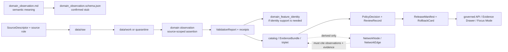

<!-- [KFM_META_BLOCK_V2]
doc_id: kfm://doc/contracts-domains-roads-rail-trade-domain-observation
title: Domain Observation Contract — Roads / Rail / Trade Routes
type: semantic-contract
version: v0.2
status: draft; PROPOSED; schema-stub-confirmed; validator-missing; slug-CONFLICTED; NEEDS VERIFICATION before promotion
owners:
  - OWNER_TBD — Roads/Rail/Trade Routes domain steward
  - OWNER_TBD — Observation/evidence steward
  - OWNER_TBD — Contracts steward
  - OWNER_TBD — Source steward
  - OWNER_TBD — Evidence steward
  - OWNER_TBD — Schema steward
  - OWNER_TBD — Policy steward
  - OWNER_TBD — Release steward
  - OWNER_TBD — Docs steward
created: NEEDS VERIFICATION — greenfield scaffold existed before v0.2 expansion
updated: 2026-06-23
policy_label: public; contracts; roads-rail-trade; domain-observation; source-role-aware; temporal-scope-aware; evidence-bound; assertion-bound; lifecycle-aware; policy-aware; release-gated; rollback-aware; not-identity-authority; not-source-truth; not-event-truth-by-itself; not-graph-truth; not-publication-authority
tags: [kfm, contracts, roads-rail-trade, domain_observation, observation, assertion, evidence, source-role, temporal-scope, SourceDescriptor, EvidenceRef, EvidenceBundle, ValidationReport, PolicyDecision, ReviewRecord, ReleaseManifest, RollbackCard, domain_feature_identity, RestrictionEvent, StatusEvent, RouteEvent]
related:
  - ./README.md
  - ./domain_feature_identity.md
  - ./domain_layer_descriptor.md
  - ./road_segment.md
  - ./rail_segment.md
  - ./corridor_route.md
  - ./route_membership.md
  - ./network_node.md
  - ./network_edge.md
  - ./crossing.md
  - ./bridge.md
  - ./ferry.md
  - ./depot.md
  - ./route_event.md
  - ./status_event.md
  - ./access_restriction.md
  - ../roads/README.md
  - ../../../docs/domains/roads-rail-trade/README.md
  - ../../../docs/domains/roads-rail-trade/CANONICAL_PATHS.md
  - ../../../docs/domains/roads-rail-trade/OBJECT_FAMILIES.md
  - ../../../docs/domains/roads-rail-trade/IDENTITY_MODEL.md
  - ../../../docs/domains/roads-rail-trade/DATA_LIFECYCLE.md
  - ../../../docs/domains/roads-rail-trade/SOURCES.md
  - ../../../docs/domains/roads-rail-trade/GRAPH_PROJECTIONS.md
  - ../../../docs/runbooks/roads-rail-trade/PROMOTION_RUNBOOK.md
  - ../../../docs/runbooks/roads-rail-trade/ROLLBACK_RUNBOOK.md
  - ../../../schemas/contracts/v1/domains/roads-rail-trade/domain_observation.schema.json
  - ../../../fixtures/domains/roads-rail-trade/domain_observation/
  - ../../../policy/domains/roads-rail-trade/
  - ../../../tests/domains/roads-rail-trade/
  - ../../../release/candidates/roads-rail-trade/
notes:
  - "Expanded from a generic greenfield scaffold at contracts/domains/roads-rail-trade/domain_observation.md."
  - "A paired schema stub was found at schemas/contracts/v1/domains/roads-rail-trade/domain_observation.schema.json. It only requires id and leaves additionalProperties true, so field realization remains PROPOSED."
  - "The schema names a validator path at tools/validators/domains/roads-rail-trade/validate_domain_observation.py, but that validator was not found in this task. Validator behavior remains NEEDS VERIFICATION."
  - "This contract defines semantic meaning for source-scoped observations and assertions. It does not define feature identity, source truth, policy decisions, release approval, graph truth, public API shape, map rendering, or runtime behavior."
  - "The Roads / Rail / Trade Routes docs record a slug conflict between roads-rail-trade and transport for contract/schema homes. This file preserves the observed requested path and does not resolve the ADR question."
[/KFM_META_BLOCK_V2] -->

<a id="top"></a>

# Domain Observation Contract — Roads / Rail / Trade Routes

> Semantic contract for `domain_observation`: the source-scoped observation or assertion record that says a Roads / Rail / Trade Routes source observed, recorded, asserted, inferred, modeled, or reported something about a transport feature, event, status, restriction, route, corridor, crossing, facility, or graph candidate — without becoming feature identity, source truth, legal status, graph truth, map truth, AI truth, or publication approval.

<p>
  
  
  
  
  
  
  
</p>

`contracts/domains/roads-rail-trade/domain_observation.md`

## Quick jumps

[Status](#status) · [Meaning](#meaning) · [Repo fit](#repo-fit) · [Schema posture](#schema-posture) · [Accepted uses](#accepted-uses) · [Exclusions](#exclusions) · [Recommended fields](#recommended-fields) · [Observation envelope](#observation-envelope) · [Invariants](#invariants) · [Observation families](#observation-families) · [Source-role and time rules](#source-role-and-time-rules) · [Lifecycle](#lifecycle) · [Validation](#validation) · [Rollback](#rollback) · [Evidence basis](#evidence-basis) · [Open questions](#open-questions)

---

## Status

> [!IMPORTANT]
> **Status:** `draft` / semantic contract  
> **Owner:** `OWNER_TBD`  
> **Contract path:** `contracts/domains/roads-rail-trade/domain_observation.md`  
> **Schema path:** `schemas/contracts/v1/domains/roads-rail-trade/domain_observation.schema.json` — **confirmed as a stub in this task**  
> **Validator path named by schema:** `tools/validators/domains/roads-rail-trade/validate_domain_observation.py` — **not found in this task**  
> **Truth posture:** target path, prior scaffold, and paired schema stub are confirmed from current repo evidence. Field-level meaning is expanded here as **PROPOSED semantic guidance**. Validator behavior, fixture coverage, policy behavior, source registry behavior, release manifests, emitted proofs, governed API routes, public API behavior, map rendering, graph behavior, and runtime behavior remain **NEEDS VERIFICATION**.

> [!CAUTION]
> This contract defines observation meaning only. It does **not** prove the observation is correct, merge identities, certify geometry, decide legal status, approve public release, validate a graph projection, authorize a live feed, or allow the UI/AI layer to bypass EvidenceBundle, policy, review, release, or rollback gates.

---

## Meaning

`domain_observation` records a source-scoped observation or assertion in the Roads / Rail / Trade Routes lane.

It may represent that a source:

- observed, reported, recorded, digitized, modeled, or asserted a road, rail, route, corridor, crossing, bridge, ferry, depot, siding, yard, restriction, status, operator relation, graph candidate, or movement-story support claim;
- contributed evidence toward a `domain_feature_identity` record without becoming that identity;
- produced a time-bound assertion such as a closure report, route designation, operator status, restriction notice, source-map label, historical route claim, or candidate connector output;
- supplied context for an EvidenceBundle, catalog/triplet projection, release-candidate layer, Evidence Drawer payload, or Focus Mode answer;
- required quarantine, redaction, generalization, steward review, or denial before public exposure.

This contract owns the **meaning of the observation record**: who or what source made the assertion, what was asserted, under what source role, at what time, with what evidence, method, uncertainty, sensitivity, policy posture, review state, and rollback path. It does not own feature identity, object-specific semantics, source authority, legal truth, live operational truth, graph truth, release approval, UI rendering, or AI narrative.

---

## Repo fit

| Responsibility | Path or root | Relationship |
|---|---|---|
| Parent contract lane | `./README.md` | Defines this folder as semantic contracts only. |
| Feature identity companion | `./domain_feature_identity.md` | Identity envelope; observations may support identity but must not replace it. |
| Layer descriptor companion | `./domain_layer_descriptor.md` | Public/release-candidate layer meaning; observations feed evidence, not display authority. |
| Object contracts | `./road_segment.md`, `./rail_segment.md`, `./crossing.md`, `./bridge.md`, `./depot.md`, `./network_edge.md` | Object-specific semantics that may cite observation records. |
| Event/restriction contracts | `./route_event.md`, `./status_event.md`, `./access_restriction.md` | Time-bound event semantics; observation record is source-scoped support, not the event itself. |
| Data lifecycle doctrine | `../../../docs/domains/roads-rail-trade/DATA_LIFECYCLE.md` | RAW → WORK/QUARANTINE → PROCESSED → CATALOG/TRIPLET → PUBLISHED gates and fail-closed posture. |
| Identity doctrine | `../../../docs/domains/roads-rail-trade/IDENTITY_MODEL.md` | Observation cannot collapse source role, identity, time, or geometry. |
| Object families | `../../../docs/domains/roads-rail-trade/OBJECT_FAMILIES.md` | Observation can support object families but does not become the family. |
| Paired schema stub | `../../../schemas/contracts/v1/domains/roads-rail-trade/domain_observation.schema.json` | Machine-shape placeholder; confirmed stub, not mature enforcement. |
| Policy | `../../../policy/domains/roads-rail-trade/` or ADR-selected alternate | Allow/deny/restrict/abstain decisions. |
| Fixtures/tests | `../../../fixtures/domains/roads-rail-trade/`, `../../../tests/domains/roads-rail-trade/` | Behavior proof; not contract prose. |
| Source registry | `../../../data/registry/sources/roads-rail-trade/` | Source authority, cadence, rights, and caveats. |
| Release/rollback | `../../../release/candidates/roads-rail-trade/` and release roots | Promotion, release, correction, rollback, and derivative invalidation. |

---

## Schema posture

A paired schema stub was found at:

```text
schemas/contracts/v1/domains/roads-rail-trade/domain_observation.schema.json
```

The stub currently:

- declares the title `domain_observation`;
- points back to this contract document;
- names fixtures, validator, and policy roots;
- exposes `spec_hash`, `id`, and `version` properties;
- requires only `id`;
- leaves `additionalProperties` as `true`.

> [!WARNING]
> Because the schema is a placeholder stub and the named validator was not found in this task, every field below remains **PROPOSED** semantic guidance until schema, validator, fixtures, tests, policy checks, release checks, and runtime behavior are verified.

---

## Accepted uses

| Use | Allowed? | Rule |
|---|---:|---|
| Capturing a source-scoped observation/assertion | Yes | Must preserve source, source role, asserted content, time, method, evidence, and limitations. |
| Supporting feature identity | Yes | Observation may support `domain_feature_identity`, but cannot replace deterministic identity logic. |
| Supporting EvidenceBundle construction | Yes | Observation should carry EvidenceRef/EvidenceBundle refs and provenance. |
| Supporting event/status/restriction records | Yes | Observation can support an event; the event contract still owns event semantics. |
| Recording candidate/model/OCR/map-label assertions | Conditional | Must remain candidate/modeled/context until reviewed; no public authority by display tone. |
| Supporting graph projections | Conditional | Derived graph edges/nodes must cite observation/evidence and remain derivative. |
| Supporting public map or Focus Mode display | Conditional | Requires PolicyDecision, ReviewRecord, ReleaseManifest, correction path, and RollbackCard. |
| Proving legal status, active closure, operator authority, or public access | No | Requires object-specific source authority, policy, review, and release support. |

---

## Exclusions

`domain_observation` must not be used as:

| Misuse | Required outcome |
|---|---|
| Feature identity | Use `domain_feature_identity`; observation may support identity but is not identity. |
| Source truth | Cite source role, EvidenceBundle, and review; observation is an assertion record. |
| Legal or operational authority | `ABSTAIN` unless authoritative source and policy/release state support the claim. |
| Live feed passthrough | `DENY`; public clients must use governed/released surfaces, not direct source APIs. |
| Object-specific contract replacement | Keep road/rail/crossing/depot/event contracts separate. |
| Graph canonical truth | Derived graph projections must cite observations/evidence and remain downstream. |
| Policy decision | Use PolicyDecision allow/deny/restrict/abstain outcomes. |
| Public API/map payload by itself | Use governed API/released artifacts only. |
| Publication approval | ReleaseManifest, ReviewRecord, and RollbackCard remain separate object families. |

---

## Recommended fields

The following fields are **PROPOSED** until schema and validator behavior are expanded and verified.

| Field | Meaning |
|---|---|
| `id` | Canonical observation-record identifier. Required by current schema stub. |
| `version` | Contract/object version. |
| `spec_hash` | Deterministic hash over normalized observation content. Present in current schema stub. |
| `domain` | Expected value: `roads-rail-trade` unless ADR selects another slug. |
| `observation_type` | Source-observed, administrative, regulatory, modeled, aggregate, candidate, synthetic, OCR/map-label, steward-review, or ADR-selected type. |
| `observation_role` | What this observation supports: feature evidence, event evidence, restriction support, route claim, status support, graph candidate, layer candidate, etc. |
| `source_ref` | SourceDescriptor/source registry reference. |
| `source_id` | Stable source identifier. |
| `source_role` | Source role fixed at admission and preserved through promotion. |
| `source_native_id` | External/source-native identifier, if present and safe. |
| `observed_feature_ref` | Feature, identity, or object ref the observation is about. |
| `observed_object_family` | Object family being observed/asserted. |
| `asserted_value` | Source-scoped assertion payload or normalized claim summary. |
| `method_ref` | Observation, extraction, transform, OCR, model, survey, feed, or steward-review method ref. |
| `confidence` | Source-scoped confidence/quality indicator, if available and policy-safe. |
| `uncertainty` | Spatial, temporal, source, interpretation, or model uncertainty. |
| `geometry_ref` | Geometry/generalized geometry reference; content/evidence only, not sufficient identity. |
| `temporal_scope` | Observation-valid source/valid/vintage time scope. |
| `observed_time` | Time the source says the observation happened, if applicable. |
| `source_time` | Source publication, recording, feed, map, roster, or update time. |
| `retrieval_time` | KFM retrieval/freeze time. |
| `release_time` | KFM governed release time, if released. |
| `correction_time` | Correction, rollback, or supersession time if applicable. |
| `evidence_refs` | EvidenceRefs or EvidenceBundle refs supporting the observation record. |
| `validation_ref` | ValidationReport or transform receipt ref. |
| `policy_decision_ref` | PolicyDecision governing use or publication. |
| `review_ref` | ReviewRecord or steward review ref. |
| `release_manifest_ref` | ReleaseManifest for public/semi-public exposure. |
| `rollback_ref` | RollbackCard or rollback target. |
| `supersedes_ref` | Prior observation superseded by this record, if any. |
| `superseded_by_ref` | Later observation replacing this one, if any. |
| `limitations` | Caveats: observation/assertion only; not identity, source truth, legal, live, graph, release, or AI authority. |

---

## Observation envelope

A domain observation should be understood as a source-scoped assertion envelope:

```text
observation = (
  source_ref,
  source_role,
  observation_type,
  observed_object_family,
  observed_feature_ref,
  asserted_value,
  method_ref,
  temporal_scope,
  evidence_refs,
  policy_decision_ref,
  review_ref,
  release_manifest_ref,
  rollback_ref
)
```

It is related to, but not interchangeable with, the adjacent object families:

| Object | Relationship to observation | Not owned by observation |
|---|---|---|
| `domain_feature_identity` | Observations may support identity resolution. | Deterministic identity envelope and reconciliation logic. |
| `Road Segment` / `Rail Segment` | Observations may assert segment geometry/status/source content. | Segment semantics and canonical identity. |
| `Crossing` / `Bridge` / `Ferry` / `Depot` | Observations may assert the presence, role, or source evidence for a facility/relation. | Object-specific meaning and cross-lane ownership. |
| `RouteEvent` / `StatusEvent` / `AccessRestriction` | Observations may support the event record. | Event semantics, valid-time status, and policy effects. |
| `NetworkNode` / `NetworkEdge` | Observations may support a candidate topology. | Graph projection truth or canonical graph identity. |
| `domain_layer_descriptor` | Observations may feed layer evidence. | Public layer descriptor, style, tile, and release posture. |

---

## Invariants

1. **Observation is an assertion record.** It records what a source asserts or reports; it does not prove the assertion by itself.
2. **Observation is not identity.** It may support a feature identity record, but deterministic identity remains separate.
3. **Observation is source-role-aware.** Source role is fixed at admission and survives normalization, review, release, and correction.
4. **Observation is time-aware.** Observed time, source time, valid time, retrieval time, release time, and correction time stay distinct where material.
5. **Observation is not geometry truth.** Geometry can be observed content, but never sufficient identity or public-safe location truth by itself.
6. **Observation is not event semantics.** Status, restriction, route, and operator events need their own contracts and valid-time rules.
7. **Observation is not policy.** PolicyDecision remains the allow/deny/restrict/abstain authority.
8. **Observation is not release.** Public exposure requires ReviewRecord, ReleaseManifest, correction path, and rollback target.
9. **Observation is not graph truth.** Graph projections can cite observations but remain downstream derivatives.
10. **Observation is not AI truth.** Focus Mode and generated summaries must resolve evidence and cite observations through EvidenceBundle; fluent language never upgrades support.

---

## Observation families

| Observation family | Meaning | Guardrail |
|---|---|---|
| `source_observed` | Direct or source-stated observation from an admitted source. | Still source-scoped; not universal truth. |
| `administrative_record` | Roster, inventory, register, agency table, or administrative compilation. | Must not be presented as observed event truth without support. |
| `regulatory_record` | Regulation, designation, restriction, or official status claim. | Legal/current meaning requires time and source authority. |
| `feed_event` | Time-bound feed item such as restriction/status/closure-like information. | No live passthrough; public use requires governed release posture. |
| `map_label` | Label or symbol extracted from a map or georeferenced layer. | Candidate/context until reviewed; do not infer existence/current status. |
| `ocr_extraction` | OCR-derived assertion from scanned/tabular source. | Requires review/validation; confidence and uncertainty visible. |
| `modeled_candidate` | Model, graph, connector, or spatial operation proposes a candidate. | Candidate only; no public truth until evidence closure. |
| `historic_claim_support` | Source supports a historic route/corridor/facility claim. | Preserve uncertainty and avoid overprecision. |
| `steward_review_note` | Human review note about source/evidence posture. | Review support, not root truth; cite review record. |
| `synthetic_fixture` | Test/fixture observation for validators. | Never public evidence; fixture only. |

---

## Source-role and time rules

| Rule | Requirement |
|---|---|
| Source role is fixed at admission | Promotion never turns administrative/context/candidate/model output into observed or regulatory truth. |
| Observation role is explicit | The record must say whether it supports a feature, event, restriction, status, route claim, graph candidate, or layer candidate. |
| Observation time is not source time | A closure observed at one time, published later, retrieved later, and released later carries distinct times. |
| Candidate observations remain candidates | Map labels, OCR, spatial intersections, graph outputs, and connector outputs stay candidate/context until reviewed. |
| Sensitive observations fail closed | Rights-uncertain, sovereignty/cultural, infrastructure-sensitive, or overprecise historic observations require quarantine, redaction, generalization, denial, or staged access. |
| Corrections preserve lineage | Superseded or corrected observations remain auditable; downstream derivatives must be invalidated or rebuilt. |

---

## Lifecycle



Contracts describe meaning. They do not validate schema shape, run source ingestion, make policy decisions, reconcile identities, publish artifacts, render maps, or authorize AI answers.

---

## Validation

Before this contract is treated as mature, maintainers should verify:

- [ ] the ADR-selected contract/schema slug and whether this file should remain under `contracts/domains/roads-rail-trade/` or migrate to `contracts/transport/`;
- [ ] paired schema is upgraded beyond stub status and constrains observation type, source role, observed object family, asserted value, method, time axes, evidence refs, policy refs, release refs, and rollback refs;
- [ ] named validator exists and validates required source/evidence/time/policy fields;
- [ ] fixtures cover source-observed, administrative, regulatory, feed-event, map-label, OCR, modeled-candidate, historic-claim, steward-review, and synthetic-fixture observations;
- [ ] tests prevent administrative records from being presented as observed event timelines without support;
- [ ] tests prevent candidate/model/OCR/map-label observations from becoming public truth without review;
- [ ] tests preserve observed/source/valid/retrieval/release/correction time distinctions;
- [ ] tests prevent observations from replacing feature identity, event contracts, graph projections, policy decisions, release manifests, or EvidenceBundles;
- [ ] public DTOs and map/Focus Mode payloads require EvidenceBundle, PolicyDecision, ReviewRecord, ReleaseManifest, correction path, and RollbackCard;
- [ ] rollback invalidates graph projections, layer descriptors, tile artifacts, API payloads, exports, Focus Mode states, caches, and AI summaries that cited the observation.

---

## Rollback

Rollback or correction is required when this contract:

- claims validator, fixture, test, release, API, UI, graph, source-registry, or runtime behavior exists without proof;
- hides the `roads-rail-trade` vs `transport` slug conflict;
- treats observation as identity, source truth, legal status, live operational truth, graph truth, release, or publication approval;
- allows administrative/context/candidate/model/OCR observations to be upgraded by display tone or AI wording;
- permits direct public source-feed passthrough or public access to RAW, WORK, QUARANTINE, canonical/internal stores, graph internals, or direct model output;
- publishes or renders unsupported observations through maps, Focus Mode, exports, graph views, or AI narrative.

Rollback target: revert this file to prior scaffold blob SHA `f2039cd20150d49329ac73d195952dbbd8b690e7`, record drift if authority boundaries were affected, and invalidate downstream derivatives that cited the weakened observation contract.

---

## Evidence basis

| Evidence | Status | Supports | Limit |
|---|---|---|---|
| Prior `contracts/domains/roads-rail-trade/domain_observation.md` | `CONFIRMED` | Target file existed as a greenfield scaffold. | Scaffold did not define authoritative semantic contract content. |
| `schemas/contracts/v1/domains/roads-rail-trade/domain_observation.schema.json` | `CONFIRMED schema stub` | Paired schema exists, points to this contract, and contains `id`, `version`, `spec_hash`. | Stub requires only `id`, permits additional properties, and does not prove mature validation. |
| Named validator lookup | `CONFIRMED not found in this task` | Supports validator-missing posture. | Does not prove no alternate validator exists. |
| `docs/domains/roads-rail-trade/DATA_LIFECYCLE.md` | `CONFIRMED doctrine / PROPOSED implementation` | Lifecycle, gate artifacts, source-role preservation, quarantine, catalog, release, and trust-membrane posture. | Implementation paths/artifact IDs remain PROPOSED / NEEDS VERIFICATION. |
| `docs/domains/roads-rail-trade/OBJECT_FAMILIES.md` | `CONFIRMED doctrine / PROPOSED field realization` | Object-family roster, source-role anti-collapse, time separation, and observation/event distinction risks. | Field-level schemas and cardinalities remain NEEDS VERIFICATION. |
| `docs/domains/roads-rail-trade/IDENTITY_MODEL.md` | `CONFIRMED doctrine / PROPOSED implementation` | Identity/geometry/source-role rules that observations must not collapse. | Runtime behavior remains NEEDS VERIFICATION. |
| Uploaded authoring prompt v2 | `CONFIRMED user-supplied guidance` | Requires evidence-grounded, visually polished, implementation-honest Markdown with verification and rollback posture. | Authoring guidance, not implementation proof. |

---

## Open questions

| ID | Question | Status |
|---|---|---|
| OQ-RRT-DOBS-01 | Should `domain_observation.md` remain at `contracts/domains/roads-rail-trade/` or migrate to `contracts/transport/` after slug ADR resolution? | OPEN / ADR NEEDED |
| OQ-RRT-DOBS-02 | Which fields must be required by the schema beyond `id`, and which belong in event-specific contracts? | OPEN / SCHEMA REVIEW |
| OQ-RRT-DOBS-03 | What exact source-role enum is canonical for observations in this lane, and how should legacy role names be mapped? | OPEN / SOURCE STEWARD REVIEW |
| OQ-RRT-DOBS-04 | What evidence/review threshold upgrades a candidate observation into support for a released feature or event? | OPEN / EVIDENCE REVIEW |
| OQ-RRT-DOBS-05 | How should live-ish source feeds be represented without becoming direct public passthroughs? | OPEN / POLICY + API REVIEW |
| OQ-RRT-DOBS-06 | What public-safe wording prevents observation records from being mistaken for verified truth, legal status, or live operational status? | OPEN / POLICY REVIEW |

<p align="right"><a href="#top">Back to top</a></p>
