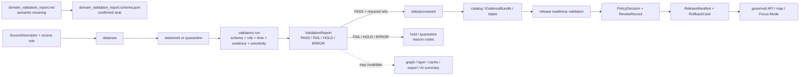

<!-- [KFM_META_BLOCK_V2]
doc_id: kfm://doc/contracts-domains-roads-rail-trade-domain-validation-report
title: Domain Validation Report Contract — Roads / Rail / Trade Routes
type: semantic-contract
version: v0.2
status: draft; PROPOSED; schema-stub-confirmed; validator-missing; slug-CONFLICTED; NEEDS VERIFICATION before promotion
owners:
  - OWNER_TBD — Roads/Rail/Trade Routes domain steward
  - OWNER_TBD — Validation steward
  - OWNER_TBD — Contracts steward
  - OWNER_TBD — Source steward
  - OWNER_TBD — Evidence steward
  - OWNER_TBD — Schema steward
  - OWNER_TBD — Policy steward
  - OWNER_TBD — Release steward
  - OWNER_TBD — Docs steward
created: NEEDS VERIFICATION — greenfield scaffold existed before v0.2 expansion
updated: 2026-06-23
policy_label: public; contracts; roads-rail-trade; domain-validation-report; validation-report; validator-outcome; gate-report; fail-closed; source-role-aware; temporal-scope-aware; evidence-bound; policy-aware; release-gated; rollback-aware; not-policy-decision; not-release-approval; not-evidence-bundle; not-runtime-proof; not-publication-authority
tags: [kfm, contracts, roads-rail-trade, domain_validation_report, ValidationReport, validation, validator, PASS, FAIL, HOLD, ERROR, SourceDescriptor, EvidenceRef, EvidenceBundle, PolicyDecision, ReviewRecord, ReleaseManifest, RollbackCard, TransformReceipt, RedactionReceipt, AggregationReceipt, ModelRunReceipt]
related:
  - ./README.md
  - ./domain_observation.md
  - ./domain_feature_identity.md
  - ./domain_layer_descriptor.md
  - ./road_segment.md
  - ./rail_segment.md
  - ./corridor_route.md
  - ./route_membership.md
  - ./network_node.md
  - ./network_edge.md
  - ./crossing.md
  - ./bridge.md
  - ./ferry.md
  - ./depot.md
  - ./route_event.md
  - ./status_event.md
  - ./access_restriction.md
  - ../roads/README.md
  - ../../../docs/domains/roads-rail-trade/README.md
  - ../../../docs/domains/roads-rail-trade/CANONICAL_PATHS.md
  - ../../../docs/domains/roads-rail-trade/OBJECT_FAMILIES.md
  - ../../../docs/domains/roads-rail-trade/IDENTITY_MODEL.md
  - ../../../docs/domains/roads-rail-trade/DATA_LIFECYCLE.md
  - ../../../docs/domains/roads-rail-trade/SOURCES.md
  - ../../../docs/domains/roads-rail-trade/GRAPH_PROJECTIONS.md
  - ../../../docs/domains/roads-rail-trade/MAP_UI_CONTRACTS.md
  - ../../../docs/runbooks/roads-rail-trade/PROMOTION_RUNBOOK.md
  - ../../../docs/runbooks/roads-rail-trade/ROLLBACK_RUNBOOK.md
  - ../../../schemas/contracts/v1/domains/roads-rail-trade/domain_validation_report.schema.json
  - ../../../fixtures/domains/roads-rail-trade/domain_validation_report/
  - ../../../policy/domains/roads-rail-trade/
  - ../../../tests/domains/roads-rail-trade/
  - ../../../release/candidates/roads-rail-trade/
notes:
  - "Expanded from a generic greenfield scaffold at contracts/domains/roads-rail-trade/domain_validation_report.md."
  - "A paired schema stub was found at schemas/contracts/v1/domains/roads-rail-trade/domain_validation_report.schema.json. It only requires id and leaves additionalProperties true, so field realization remains PROPOSED."
  - "The schema names a validator path at tools/validators/domains/roads-rail-trade/validate_domain_validation_report.py, but that validator was not found in this task. Validator behavior remains NEEDS VERIFICATION."
  - "This contract defines semantic meaning for validation reports. It does not define validator implementation, policy decisions, release approval, EvidenceBundle truth, runtime behavior, map rendering, or publication authority."
  - "The Roads / Rail / Trade Routes docs record a slug conflict between roads-rail-trade and transport for contract/schema homes. This file preserves the observed requested path and does not resolve the ADR question."
[/KFM_META_BLOCK_V2] -->

<a id="top"></a>

# Domain Validation Report Contract — Roads / Rail / Trade Routes

> Semantic contract for `domain_validation_report`: the gate-level report that records whether Roads / Rail / Trade Routes data, features, observations, identities, graph projections, layer descriptors, or release candidates passed deterministic validation checks — without becoming source truth, EvidenceBundle truth, a PolicyDecision, a ReviewRecord, a ReleaseManifest, a runtime proof, or publication approval.

<p>
  
  
  
  
  
  
  
</p>

`contracts/domains/roads-rail-trade/domain_validation_report.md`

## Quick jumps

[Status](#status) · [Meaning](#meaning) · [Repo fit](#repo-fit) · [Schema posture](#schema-posture) · [Accepted uses](#accepted-uses) · [Exclusions](#exclusions) · [Recommended fields](#recommended-fields) · [Validation report envelope](#validation-report-envelope) · [Invariants](#invariants) · [Validation families](#validation-families) · [Outcomes and gate behavior](#outcomes-and-gate-behavior) · [Lifecycle](#lifecycle) · [Validation](#validation) · [Rollback](#rollback) · [Evidence basis](#evidence-basis) · [Open questions](#open-questions)

---

## Status

> [!IMPORTANT]
> **Status:** `draft` / semantic contract  
> **Owner:** `OWNER_TBD`  
> **Contract path:** `contracts/domains/roads-rail-trade/domain_validation_report.md`  
> **Schema path:** `schemas/contracts/v1/domains/roads-rail-trade/domain_validation_report.schema.json` — **confirmed as a stub in this task**  
> **Validator path named by schema:** `tools/validators/domains/roads-rail-trade/validate_domain_validation_report.py` — **not found in this task**  
> **Truth posture:** target path, prior scaffold, and paired schema stub are confirmed from current repo evidence. Field-level meaning is expanded here as **PROPOSED semantic guidance**. Validator implementation, fixture coverage, policy behavior, source-registry behavior, release manifests, emitted proofs, governed API routes, public API behavior, map rendering, graph behavior, and runtime behavior remain **NEEDS VERIFICATION**.

> [!CAUTION]
> This contract defines validation-report meaning only. It does **not** prove the source claim is true, approve policy, close review, release a layer, validate public API behavior, render a map, authorize AI output, or permit promotion when EvidenceBundle, PolicyDecision, ReviewRecord, ReleaseManifest, correction path, or rollback target is missing.

---

## Meaning

`domain_validation_report` records the result of a deterministic validation pass in the Roads / Rail / Trade Routes lane.

It may report whether a validation run checked:

- source admission prerequisites such as source identity, source role, rights posture, cadence, sensitivity, and payload/reference hash;
- transformation outputs such as normalized schema, geometry, time axes, identity envelopes, evidence refs, receipt refs, and source-role preservation;
- domain objects such as road segments, rail segments, crossings, bridges, ferries, depots, route memberships, restriction/status events, operator status, historic route claims, and trade-route corridors;
- observation and identity contracts such as `domain_observation` and `domain_feature_identity`;
- derived graph projections such as network nodes, network edges, route memberships, and movement-story support structures;
- layer and release-candidate profiles such as `domain_layer_descriptor`, LayerManifest-related checks, evidence drawer readiness, and Focus Mode context obligations;
- public-safety validators such as historic-route overprecision, OSM/GNIS legal-status drift, critical-facility detail handling, source-role anti-collapse, graph rollback, and redaction/generalization receipt presence.

This contract owns the **meaning of the validation report record**: what was checked, what inputs were used, which validators ran, which outcome was produced, what findings were emitted, which receipts/evidence/policy/review refs were required, and whether downstream gates must pass, hold, fail, quarantine, deny, or abstain. It does not own the validators themselves, policy outcomes, evidence truth, release approval, public API behavior, map rendering, runtime execution, or AI narrative.

---

## Repo fit

| Responsibility | Path or root | Relationship |
|---|---|---|
| Parent contract lane | `./README.md` | Defines this folder as semantic contracts only. |
| Data lifecycle doctrine | `../../../docs/domains/roads-rail-trade/DATA_LIFECYCLE.md` | Defines gates, required artifacts, failure-closed behavior, receipts, and validation concerns. |
| Object families | `../../../docs/domains/roads-rail-trade/OBJECT_FAMILIES.md` | Names the domain object families validation reports may cover. |
| Identity doctrine | `../../../docs/domains/roads-rail-trade/IDENTITY_MODEL.md` | Validation must preserve source role, temporal scope, deterministic identity, and geometry-not-identity rules. |
| Observation contract | `./domain_observation.md` | Validation may check observation support; it must not replace observation meaning. |
| Feature identity contract | `./domain_feature_identity.md` | Validation may check identity envelope consistency; it must not become identity authority. |
| Layer descriptor contract | `./domain_layer_descriptor.md` | Validation may check layer readiness; it must not become layer/release authority. |
| Paired schema stub | `../../../schemas/contracts/v1/domains/roads-rail-trade/domain_validation_report.schema.json` | Machine-shape placeholder; confirmed stub, not mature enforcement. |
| Policy | `../../../policy/domains/roads-rail-trade/` or ADR-selected alternate | PolicyDecision remains separate from validation. |
| Fixtures/tests | `../../../fixtures/domains/roads-rail-trade/`, `../../../tests/domains/roads-rail-trade/` | Expected proof of validators and reports. |
| Source registry | `../../../data/registry/sources/roads-rail-trade/` | Source authority, cadence, rights, and caveats. |
| Release/rollback | `../../../release/candidates/roads-rail-trade/` and release roots | Promotion, release, correction, rollback, and derivative invalidation. |

---

## Schema posture

A paired schema stub was found at:

```text
schemas/contracts/v1/domains/roads-rail-trade/domain_validation_report.schema.json
```

The stub currently:

- declares the title `domain_validation_report`;
- points back to this contract document;
- names fixtures, validator, and policy roots;
- exposes `spec_hash`, `id`, and `version` properties;
- requires only `id`;
- leaves `additionalProperties` as `true`.

> [!WARNING]
> Because the schema is a placeholder stub and the named validator was not found in this task, every field below remains **PROPOSED** semantic guidance until schema, validator, fixtures, tests, policy checks, release checks, and runtime behavior are verified.

---

## Accepted uses

| Use | Allowed? | Rule |
|---|---:|---|
| Recording deterministic validation run results | Yes | Must identify run, validator set, inputs, outcomes, findings, receipts, and gate target. |
| Supporting lifecycle gate decisions | Yes | Report may support PASS/FAIL/HOLD/ERROR posture; gate decisions still require policy/review/release refs. |
| Supporting quarantine or hold reasons | Yes | Must preserve reason codes and prior state; no silent promotion. |
| Checking source-role anti-collapse | Yes | Must fail or hold when administrative/context/candidate/modeled data is upgraded by normalization or wording. |
| Checking sensitive or overprecise outputs | Yes | Must record redaction/generalization/receipt requirements and fail closed where absent. |
| Checking graph projection rollback readiness | Yes | Must treat graph as derived and require rebuild/revoke proof. |
| Approving release or publication | No | ReleaseManifest, ReviewRecord, PolicyDecision, and rollback target remain separate. |
| Proving claim truth | No | Validation only says checks ran/passed/failed; EvidenceBundle and source support still govern truth. |

---

## Exclusions

`domain_validation_report` must not be used as:

| Misuse | Required outcome |
|---|---|
| PolicyDecision | Use policy contracts/records for allow, deny, restrict, or abstain. |
| EvidenceBundle | Use EvidenceRef/EvidenceBundle for claim support. |
| ReviewRecord | Human/steward review remains separate. |
| ReleaseManifest | Release is a governed state transition, not a validation report. |
| RollbackCard | Rollback targets remain separate and must be cited. |
| Source truth | A passing validation does not make a source assertion true. |
| Runtime proof | Validator implementation, test execution, CI, and runtime behavior require separate evidence. |
| Graph truth | Graph validation reports can support a graph projection but do not make the projection canonical truth. |
| Public API/map payload | Use governed API/released artifacts only. |

---

## Recommended fields

The following fields are **PROPOSED** until schema and validator behavior are expanded and verified.

| Field | Meaning |
|---|---|
| `id` | Canonical validation-report identifier. Required by current schema stub. |
| `version` | Contract/object version. |
| `spec_hash` | Deterministic hash over normalized report content. Present in current schema stub. |
| `domain` | Expected value: `roads-rail-trade` unless ADR selects another slug. |
| `run_id` | Validation run identifier. |
| `run_time` | Time the validation report was produced. |
| `validator_set_ref` | Validator bundle/version/ref used for the run. |
| `validator_refs` | Individual validator refs or names. |
| `gate` | Lifecycle gate targeted: admission, normalization, validation, catalog-closure, release, correction, rollback, or ADR-selected equivalent. |
| `phase_from` | Starting lifecycle phase. |
| `phase_to` | Target lifecycle phase. |
| `outcome` | PASS, FAIL, HOLD, ERROR, or ADR-selected finite validator outcome. |
| `reason_codes` | Stable machine-readable reasons for fail/hold/error/denial support. |
| `severity_summary` | Info/warning/error/blocker counts or equivalent summary. |
| `input_refs` | Source, object, observation, identity, graph, layer, receipt, or release-candidate refs checked. |
| `source_refs` | SourceDescriptor/source registry refs involved. |
| `source_role_checks` | Source-role preservation and anti-collapse results. |
| `temporal_checks` | Source/observed/valid/retrieval/release/correction time validation results. |
| `identity_checks` | `spec_hash`, identity envelope, source-native-ID, and geometry-not-identity checks. |
| `geometry_checks` | Geometry validity, precision, generalization, redaction, and overprecision checks. |
| `sensitivity_checks` | Rights, sovereignty/cultural sensitivity, infrastructure sensitivity, and publication tier checks. |
| `evidence_checks` | EvidenceRef/EvidenceBundle resolution results. |
| `policy_decision_ref` | PolicyDecision used with or required by the gate. |
| `receipt_refs` | TransformReceipt, RedactionReceipt, AggregationReceipt, ModelRunReceipt, AIReceipt, or other receipt refs. |
| `review_ref` | ReviewRecord ref, if required or performed. |
| `release_manifest_ref` | ReleaseManifest ref when the report supports release/correction/rollback. |
| `rollback_ref` | RollbackCard or rollback target. |
| `findings` | Structured validation findings. |
| `blocked_outputs` | Objects, layers, graph projections, exports, or API surfaces blocked by failures. |
| `downstream_invalidations` | Derivatives that must be rebuilt, held, or invalidated. |
| `limitations` | Caveats: validation report only; not policy, evidence truth, release, runtime, graph, map, or AI authority. |

---

## Validation report envelope

A domain validation report should be understood as a gate-scoped proof envelope:

```text
validation_report = (
  run_id,
  validator_set_ref,
  gate,
  phase_from,
  phase_to,
  input_refs,
  outcome,
  findings,
  reason_codes,
  evidence_checks,
  policy_decision_ref,
  receipt_refs,
  review_ref,
  release_manifest_ref,
  rollback_ref
)
```

It is related to, but not interchangeable with, adjacent governance objects:

| Object | Relationship to validation report | Not owned by validation report |
|---|---|---|
| `SourceDescriptor` | Validation checks source identity, role, rights, cadence, and sensitivity. | Source authority itself. |
| `domain_observation` | Validation checks observation completeness and source-role posture. | Observation semantics. |
| `domain_feature_identity` | Validation checks identity envelope and `spec_hash` formation. | Identity authority and reconciliation. |
| `EvidenceBundle` | Validation checks EvidenceRef resolution and bundle presence. | Evidence truth and citation content. |
| `PolicyDecision` | Validation may require or cite policy outcome. | Allow/deny/restrict/abstain authority. |
| `ReviewRecord` | Validation may require review before promotion. | Human/steward judgment. |
| `ReleaseManifest` | Validation may support release readiness. | Publication state transition. |
| `RollbackCard` | Validation may require rollback target readiness. | Rollback execution authority. |

---

## Invariants

1. **Validation report is not truth.** PASS means checks passed; it does not prove the underlying claim is true.
2. **Validation report is not policy.** PolicyDecision remains separate and must be cited where required.
3. **Validation report is not release.** Public exposure requires release state, review, correction path, and rollback target.
4. **Validation report is phase-bound.** Every report names the lifecycle gate and phases it applies to.
5. **Validation fails closed.** Missing evidence, source role, rights, sensitivity, policy, review, release, or rollback support blocks promotion or holds prior state.
6. **Validation preserves source role.** It must not upgrade candidate, administrative, aggregate, modeled, synthetic, or context evidence by wording or display tone.
7. **Validation preserves time axes.** Source, observed, valid, retrieval, release, and correction times remain distinct where material.
8. **Validation protects sensitivity.** Overprecise historic routes, Indigenous/cultural corridors, critical-facility detail, and rights-uncertain records must fail closed, generalize, redact, deny, or hold.
9. **Validation treats graph as derived.** Graph checks prove rollback/rebuild readiness; graph projections do not replace canonical evidence.
10. **Validation is reproducible.** Reports cite validator set, inputs, hashes, findings, receipts, and downstream invalidations.

---

## Validation families

| Validation family | Meaning | Guardrail |
|---|---|---|
| `source_admission_validation` | Checks source identity, rights, cadence, sensitivity, and source-role intent. | Source not admitted if prerequisites fail. |
| `schema_shape_validation` | Checks contract/schema shape for normalized domain objects. | Shape success is not truth or release approval. |
| `source_role_anti_collapse_validation` | Ensures role fixed at admission survives transforms and promotion. | Administrative-as-observed and candidate-as-confirmed must fail. |
| `temporal_validation` | Checks source, observed, valid, retrieval, release, and correction time separation. | No silent time-axis merging. |
| `identity_validation` | Checks deterministic identity, `spec_hash`, and geometry-not-identity behavior. | Similarity does not prove identity equivalence. |
| `evidence_resolution_validation` | Checks EvidenceRef/EvidenceBundle resolution. | Missing EvidenceBundle yields FAIL/HOLD/ABSTAIN support. |
| `sensitivity_validation` | Checks redaction, generalization, rights, sovereignty/cultural, ecological, archaeological, and infrastructure sensitivity. | Default fail-closed where unclear. |
| `historic_overprecision_validation` | Blocks historic route/corridor geometry that exceeds source support. | Requires uncertainty/generalization support. |
| `legal_status_drift_validation` | Blocks context sources such as OSM/GNIS from being promoted into legal-status authority. | Requires separate authority source. |
| `graph_projection_validation` | Checks graph projections are derivative and rollback-ready. | Graph is not canonical truth. |
| `release_readiness_validation` | Checks manifests, review, correction path, and rollback target before publication. | PASS still does not release by itself. |
| `rollback_validation` | Checks prior release, invalidation list, correction notice, and safe revert path. | No silent public edits. |

---

## Outcomes and gate behavior

| Outcome | Meaning | Gate behavior |
|---|---|---|
| `PASS` | The validator set completed and no blocking finding remained for the targeted gate. | May support the next gate if all other required objects exist. |
| `FAIL` | One or more blocking findings prevent the target transition. | Hold prior state; record reasons; no promotion. |
| `HOLD` | Validation requires review, missing dependency, policy action, rights clearance, or steward decision. | Pause at current phase; do not publish or silently advance. |
| `ERROR` | Tool, input, schema, environment, or execution failure prevented a valid result. | Fail closed; do not infer pass/fail from partial execution. |
| `ABSTAIN_SUPPORT` | Report supports abstention when evidence is unresolved or citation support is insufficient. | Public answer/export/map drawer should abstain, not guess. |
| `DENY_SUPPORT` | Report supports denial when policy/sensitivity/release conditions block exposure. | Public surface should deny safely without leaking sensitive details. |

> [!NOTE]
> `ANSWER`, `ABSTAIN`, `DENY`, and `ERROR` are user-facing or governed-envelope outcomes for answer/render surfaces. Validator reports commonly use `PASS`, `FAIL`, `HOLD`, and `ERROR`; they may support downstream `ABSTAIN` or `DENY`, but they do not replace policy or runtime envelopes.

---

## Lifecycle



Contracts describe meaning. They do not validate schema shape, execute validators, make policy decisions, close evidence, publish artifacts, render maps, or authorize AI answers.

---

## Validation

Before this contract is treated as mature, maintainers should verify:

- [ ] the ADR-selected contract/schema slug and whether this file should remain under `contracts/domains/roads-rail-trade/` or migrate to `contracts/transport/`;
- [ ] paired schema is upgraded beyond stub status and constrains run ID, validator set, gate, inputs, outcomes, findings, evidence checks, policy refs, review refs, release refs, and rollback refs;
- [ ] named validator exists and validates required report fields;
- [ ] fixtures cover PASS, FAIL, HOLD, ERROR, abstain-support, deny-support, quarantine, correction, and rollback cases;
- [ ] fixtures cover source-role anti-collapse, historic overprecision, OSM/GNIS legal-status drift, critical-facility detail, graph projection rollback, EvidenceBundle resolution failure, and release-readiness failure;
- [ ] tests prove missing required artifacts fail closed and preserve the prior lifecycle state;
- [ ] tests prove PASS alone cannot publish without PolicyDecision, ReviewRecord, ReleaseManifest, correction path, and RollbackCard;
- [ ] tests prevent validation reports from replacing EvidenceBundle truth, policy decisions, release manifests, graph truth, map layer descriptors, runtime envelopes, or AI receipts;
- [ ] rollback invalidates graph projections, layer descriptors, tile artifacts, API payloads, exports, Focus Mode states, caches, and AI summaries that relied on an invalidated report.

---

## Rollback

Rollback or correction is required when this contract:

- claims validator, fixture, test, CI, release, API, UI, graph, source-registry, or runtime behavior exists without proof;
- hides the `roads-rail-trade` vs `transport` slug conflict;
- treats validation PASS as source truth, EvidenceBundle truth, policy approval, review approval, release approval, runtime proof, or publication authority;
- allows missing evidence, source role, rights, sensitivity, policy, review, release, or rollback support to promote silently;
- permits graph projections, map tiles, Focus Mode, exports, or AI narrative to present unvalidated or failed outputs as authoritative;
- fails to preserve reason codes, validator inputs, validator versions, downstream invalidations, or prior-state rollback targets.

Rollback target: revert this file to prior scaffold blob SHA `4eced7dc907d590ddf922902bff006d21f4301f6`, record drift if authority boundaries were affected, and invalidate downstream derivatives that cited the weakened validation-report contract.

---

## Evidence basis

| Evidence | Status | Supports | Limit |
|---|---|---|---|
| Prior `contracts/domains/roads-rail-trade/domain_validation_report.md` | `CONFIRMED` | Target file existed as a greenfield scaffold. | Scaffold did not define authoritative semantic contract content. |
| `schemas/contracts/v1/domains/roads-rail-trade/domain_validation_report.schema.json` | `CONFIRMED schema stub` | Paired schema exists, points to this contract, and contains `id`, `version`, `spec_hash`. | Stub requires only `id`, permits additional properties, and does not prove mature validation. |
| Named validator lookup | `CONFIRMED not found in this task` | Supports validator-missing posture. | Does not prove no alternate validator exists. |
| `docs/domains/roads-rail-trade/DATA_LIFECYCLE.md` | `CONFIRMED doctrine / PROPOSED implementation` | Gate artifacts, `ValidationReport` role, failure-closed behavior, domain lifecycle concerns, sensitivity posture, and receipt mapping. | Implementation paths/artifact IDs remain PROPOSED / NEEDS VERIFICATION. |
| `docs/domains/roads-rail-trade/OBJECT_FAMILIES.md` | `CONFIRMED doctrine / PROPOSED field realization` | Object families and source-role anti-collapse rules that validation reports should cover. | Field-level schemas and cardinalities remain NEEDS VERIFICATION. |
| `contracts/domains/roads-rail-trade/domain_feature_identity.md` | `CONFIRMED sibling contract` | Identity contract boundary that validation may check but must not replace. | Does not prove validator runtime behavior. |
| Uploaded authoring prompt v2 | `CONFIRMED user-supplied guidance` | Requires evidence-grounded, visually polished, implementation-honest Markdown with verification and rollback posture. | Authoring guidance, not implementation proof. |

---

## Open questions

| ID | Question | Status |
|---|---|---|
| OQ-RRT-DVR-01 | Should `domain_validation_report.md` remain at `contracts/domains/roads-rail-trade/` or migrate to `contracts/transport/` after slug ADR resolution? | OPEN / ADR NEEDED |
| OQ-RRT-DVR-02 | Which fields must be required by the schema beyond `id`, and which belong in a cross-domain `ValidationReport` schema? | OPEN / SCHEMA REVIEW |
| OQ-RRT-DVR-03 | What exact validator outcome enum is canonical for this lane: PASS/FAIL/HOLD/ERROR, or a shared KFM validator enum? | OPEN / VALIDATION REVIEW |
| OQ-RRT-DVR-04 | Which source-role, time, identity, sensitivity, and evidence validators are mandatory at each lifecycle gate? | OPEN / DOMAIN REVIEW |
| OQ-RRT-DVR-05 | How should validation reports cite test fixtures, CI runs, receipts, and artifacts without becoming runtime proof by prose? | OPEN / TOOLING REVIEW |
| OQ-RRT-DVR-06 | What public-safe wording prevents validation PASS from being mistaken for evidence truth or publication approval? | OPEN / POLICY REVIEW |

<p align="right"><a href="#top">Back to top</a></p>
