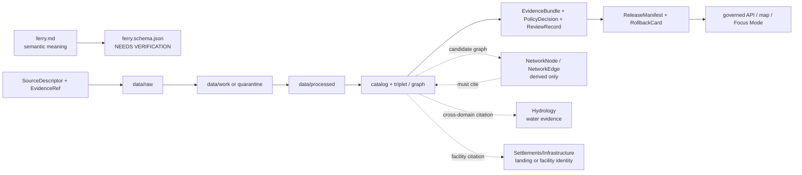

<!-- [KFM_META_BLOCK_V2]
doc_id: kfm://doc/contracts-domains-roads-rail-trade-ferry
title: Ferry Contract — Roads / Rail / Trade Routes
type: semantic-contract
version: v0.2
status: draft; PROPOSED; schema-missing; slug-CONFLICTED; NEEDS VERIFICATION before promotion
owners:
  - OWNER_TBD — Roads/Rail/Trade Routes domain steward
  - OWNER_TBD — Roads steward
  - OWNER_TBD — Rail steward
  - OWNER_TBD — Hydrology steward
  - OWNER_TBD — Settlements/Infrastructure steward
  - OWNER_TBD — Contracts steward
  - OWNER_TBD — Source steward
  - OWNER_TBD — Evidence steward
  - OWNER_TBD — Schema steward
  - OWNER_TBD — Policy steward
  - OWNER_TBD — Release steward
  - OWNER_TBD — Docs steward
created: NEEDS VERIFICATION — scaffold existed before v0.2 expansion
updated: 2026-06-23
policy_label: public; contracts; roads-rail-trade; ferry; crossing; transport-side-claim; ferry-service; route-membership; source-role-aware; temporal-scope-aware; evidence-bound; hydrology-boundary-aware; infrastructure-boundary-aware; operator-status-aware; release-gated; rollback-aware; not-live-service-status; not-routing-authority; not-legal-access; not-safety-advice; not-publication-authority
tags: [kfm, contracts, roads-rail-trade, ferry, crossing, river-crossing, road-segment, rail-segment, corridor-route, route-membership, transport-facility, operator-assignment, operator-status, access-restriction, route-event, status-event, hydrology, source-role, valid-time, EvidenceBundle, PolicyDecision, ReviewRecord, ReleaseManifest, RollbackCard]
related:
  - ./README.md
  - ./crossing.md
  - ./river_crossing.md
  - ./bridge.md
  - ./road_segment.md
  - ./rail_segment.md
  - ./corridor_route.md
  - ./route_membership.md
  - ./operator_assignment.md
  - ./operator_status.md
  - ./route_event.md
  - ./status_event.md
  - ./access_restriction.md
  - ./transport_facility.md
  - ./network_node.md
  - ./network_edge.md
  - ../roads/README.md
  - ../../../docs/domains/roads-rail-trade/README.md
  - ../../../docs/domains/roads-rail-trade/CANONICAL_PATHS.md
  - ../../../docs/domains/roads-rail-trade/OBJECT_FAMILIES.md
  - ../../../docs/domains/roads-rail-trade/IDENTITY_MODEL.md
  - ../../../docs/domains/roads-rail-trade/SOURCES.md
  - ../../../docs/domains/roads-rail-trade/sublanes/roads.md
  - ../../../docs/domains/roads-rail-trade/sublanes/rail.md
  - ../../../docs/domains/roads-rail-trade/GRAPH_PROJECTIONS.md
  - ../../../docs/domains/roads-rail-trade/MAP_UI_CONTRACTS.md
  - ../../../docs/runbooks/roads-rail-trade/PROMOTION_RUNBOOK.md
  - ../../../docs/runbooks/roads-rail-trade/ROLLBACK_RUNBOOK.md
  - ../../../schemas/contracts/v1/domains/roads-rail-trade/ferry.schema.json
  - ../../../policy/domains/roads-rail-trade/
  - ../../../fixtures/domains/roads-rail-trade/ferry/
  - ../../../tests/domains/roads-rail-trade/
  - ../../../release/candidates/roads-rail-trade/
notes:
  - "Expanded from a PROPOSED scaffold at contracts/domains/roads-rail-trade/ferry.md."
  - "A paired schema at schemas/contracts/v1/domains/roads-rail-trade/ferry.schema.json was not found in this task. Field realization remains PROPOSED."
  - "The parent object-family doctrine names Ferry as a Roads / Rail / Trade Routes object term, while hydrology, infrastructure, operator, live service, and legal-access claims remain separate authority surfaces."
  - "This contract defines the transport-side ferry crossing/service claim. It does not certify current ferry operation, public access, legal status, navigation safety, hydrologic condition, emergency status, route availability, or publication approval."
  - "The Roads / Rail / Trade Routes docs record a slug conflict between roads-rail-trade and transport for contract/schema homes. This file preserves the observed requested path and does not resolve the ADR question."
[/KFM_META_BLOCK_V2] -->

<a id="top"></a>

# Ferry Contract — Roads / Rail / Trade Routes

> Semantic contract for `ferry`: the transport-side claim that a route, road, rail, trail, corridor, crossing, or movement path used or was associated with a ferry crossing or ferry service — without becoming hydrology truth, current service status, legal public-access authority, navigation/safety advice, operator truth, route availability, map truth, or publication approval.

<p>
  
  
  
  
  
  
  
</p>

`contracts/domains/roads-rail-trade/ferry.md`

## Quick jumps

[Status](#status) · [Meaning](#meaning) · [Repo fit](#repo-fit) · [Schema posture](#schema-posture) · [Accepted uses](#accepted-uses) · [Exclusions](#exclusions) · [Recommended fields](#recommended-fields) · [Invariants](#invariants) · [Ferry claim families](#ferry-claim-families) · [Source-role and time rules](#source-role-and-time-rules) · [Lifecycle](#lifecycle) · [Validation](#validation) · [Rollback](#rollback) · [Evidence basis](#evidence-basis) · [Open questions](#open-questions)

---

## Status

> [!IMPORTANT]
> **Status:** `draft` / semantic contract  
> **Owner:** `OWNER_TBD`  
> **Contract path:** `contracts/domains/roads-rail-trade/ferry.md`  
> **Schema path:** `schemas/contracts/v1/domains/roads-rail-trade/ferry.schema.json` — **not found in this task**  
> **Truth posture:** target path and prior scaffold are confirmed from current repo evidence. `Ferry` is confirmed as a Roads / Rail / Trade Routes object term. Exact schema fields, validator behavior, fixture coverage, policy behavior, source registry behavior, release manifests, emitted proofs, public API behavior, map rendering, graph behavior, and runtime behavior remain **NEEDS VERIFICATION**.

> [!CAUTION]
> This contract defines ferry meaning only. It does **not** certify current ferry operation, public access, route availability, legal status, ticketing, operator authority, navigability, water level, weather, emergency status, vessel safety, map/API behavior, or publication approval.

---

## Meaning

`ferry` records the semantic meaning of a transport-side ferry crossing or ferry-service claim inside Roads / Rail / Trade Routes.

It may represent that a source asserts a ferry:

- carried or connected a `Road Segment`, `Rail Segment`, `CorridorRoute`, `RouteMembership`, historic route, trade route, trail, or movement corridor;
- participated in a `Crossing`, `River Crossing`, or other transport crossing relation;
- had a source-scoped name, landing, route, operator, season, schedule, map label, historic function, or crossing relation;
- was associated with an `OperatorAssignment`, `OperatorStatus`, `RouteEvent`, `StatusEvent`, `AccessRestriction`, or `TransportFacility` record;
- may feed a released map layer or network graph only as a governed, evidence-cited, release-gated derivative.

The ferry contract owns the **transport-side ferry claim**: how ferry evidence relates to movement, routes, crossings, access, and source-scoped transport semantics. The waterbody, river reach, flood condition, water level, or navigability evidence belongs to `hydrology` or source-specific water/hazard lanes. Landing/facility canonical identity may belong to `settlements-infrastructure`. Operator/legal/service status belongs to operator/status/event contracts and source authority. Live closure, public safety, and emergency claims require separate governed paths.

---

## Repo fit

| Responsibility | Path or root | Relationship |
|---|---|---|
| Parent contract lane | `./README.md` | Defines this folder as semantic contracts only. |
| Related crossing contracts | `./crossing.md`, `./river_crossing.md`, `./bridge.md` | Adjacent transport crossing meanings, where present. |
| Related segment/route contracts | `./road_segment.md`, `./rail_segment.md`, `./corridor_route.md`, `./route_membership.md` | Routes or segments that may depend on ferry evidence. |
| Related operator/event contracts | `./operator_assignment.md`, `./operator_status.md`, `./route_event.md`, `./status_event.md`, `./access_restriction.md` | Ferry service, status, access, and operator semantics. |
| Related graph contracts | `./network_node.md`, `./network_edge.md` | Derived topology; graph output must cite ferry evidence. |
| Road compatibility slice | `../roads/README.md` | Road-side ferry relation orientation; not canonical authority by itself. |
| Parent doctrine | `../../../docs/domains/roads-rail-trade/README.md` | Domain scope and object roster. |
| Object families | `../../../docs/domains/roads-rail-trade/OBJECT_FAMILIES.md` | `Ferry` family and identity posture. |
| Schemas | `../../../schemas/contracts/v1/domains/roads-rail-trade/` or ADR-selected alternate | Machine shape; paired schema missing in this task. |
| Policy | `../../../policy/domains/roads-rail-trade/` or ADR-selected alternate | Allow/deny/restrict/abstain decisions. |
| Fixtures/tests | `../../../fixtures/domains/roads-rail-trade/`, `../../../tests/domains/roads-rail-trade/` | Behavior proof; not contract prose. |
| Source registry | `../../../data/registry/sources/roads-rail-trade/` | Source authority, cadence, rights, and caveats. |
| Release/rollback | `../../../release/candidates/roads-rail-trade/` and release roots | Promotion, release, correction, and rollback. |

---

## Schema posture

A direct paired schema was checked at:

```text
schemas/contracts/v1/domains/roads-rail-trade/ferry.schema.json
```

That file was **not found** in this task.

> [!WARNING]
> Because no paired schema was confirmed, every field below is **PROPOSED** semantic guidance. Do not treat it as machine-enforced until schema, fixtures, validator, policy tests, source registry records, release checks, and runtime behavior are verified.

---

## Accepted uses

| Use | Allowed? | Rule |
|---|---:|---|
| Defining transport-side ferry semantics | Yes | Must preserve source role, affected route/crossing, time, evidence, and release posture. |
| Linking a ferry to road/rail/corridor evidence | Yes | Keep segment, route, membership, crossing, and ferry identity separate. |
| Linking to hydrology evidence | Yes | Cite hydrology refs; do not absorb river, water, flood, navigability, or water-level truth. |
| Linking to landing/facility evidence | Yes | Cite infrastructure/facility refs; do not absorb canonical facility identity. |
| Supporting access restrictions or status events | Conditional | Use separate restriction/status contracts and valid-time discipline. |
| Supporting map/Focus Mode display | Conditional | Requires EvidenceBundle, PolicyDecision, review/release state, and rollback target. |
| Supporting graph topology | Conditional | Derived graph edges must cite the source ferry/crossing relation and not replace it. |
| Certifying active service, public access, or safe passage | No | Requires current authoritative source and is not KFM routing/safety/legal advice. |

---

## Exclusions

`ferry` must not be used as:

| Misuse | Required outcome |
|---|---|
| Current ferry service status | `ABSTAIN` unless a current authoritative source, policy, review, and release state support it. |
| Legal public-access authority | `ABSTAIN` unless legal/agency source evidence and policy posture support the claim. |
| Navigation, water-level, flood, or weather truth | Reference Hydrology/Hazards/source authority; ferry only owns transport-side relation. |
| Vessel safety or operational safety advice | `DENY`; KFM does not provide safety certification or emergency guidance. |
| Operator ownership or legal-entity truth | Use operator/status contracts and source refs; do not infer from a ferry label. |
| Landing/facility canonical identity | Reference Settlements/Infrastructure or facility identity records. |
| Replacement for `Crossing`, `River Crossing`, `Bridge`, `RouteMembership`, `NetworkNode`, or `NetworkEdge` | Keep object families separate. |
| Public API/map payload | Use governed API/released artifacts only. |
| Publication approval | ReleaseManifest, ReviewRecord, PolicyDecision, and RollbackCard remain separate. |

---

## Recommended fields

The following fields are **PROPOSED** until a schema is added and validated.

| Field | Meaning |
|---|---|
| `id` | Canonical ferry contract object identifier. |
| `version` | Contract/object version. |
| `spec_hash` | Deterministic hash over normalized ferry claim content. |
| `domain` | Expected value: `roads-rail-trade` unless ADR selects another slug. |
| `ferry_name` | Source-stated ferry or crossing name. |
| `ferry_source_id` | Source-native ferry, route, crossing, landing, or facility identifier, if present and safe. |
| `ferry_type` | Passenger ferry, vehicle ferry, rail ferry, freight ferry, foot ferry, historic ferry, seasonal ferry, candidate ferry, or source-specific type. |
| `service_role` | Transport role asserted by the source. |
| `source_ref` | SourceDescriptor/source registry reference. |
| `source_role` | Accepted source role; must be preserved from admission through publication. |
| `crossing_ref` | Crossing ref associated with this ferry relation, if modeled separately. |
| `river_crossing_ref` | River Crossing ref, if water-crossing semantics are modeled separately. |
| `hydrology_ref` | Hydrology/waterbody ref; cited, not owned here. |
| `route_refs` | CorridorRoute, historic route, trade route, or route membership refs associated with the ferry. |
| `road_segment_refs` | Road Segment refs connected by or associated with the ferry. |
| `rail_segment_refs` | Rail Segment refs connected by or associated with the ferry. |
| `landing_refs` | Landing, dock, depot, facility, or infrastructure refs, if modeled separately. |
| `operator_assignment_refs` | OperatorAssignment / OperatorStatus refs, if supported. |
| `status_refs` | StatusEvent, RouteEvent, or AccessRestriction refs, if any. |
| `geometry_ref` | Point/line/polygon/generalized geometry reference; not legal location or safe passage proof by itself. |
| `network_node_ref` | Derived or source-supported network node reference, if separate. |
| `network_edge_refs` | Derived graph edge refs, if a graph projection represents ferry connectivity. |
| `valid_time` | Interval during which this ferry role is asserted to apply. |
| `source_time` | Source creation, publication, recording, timetable, map, roster, or update time. |
| `retrieval_time` | KFM retrieval/freeze time. |
| `release_time` | KFM governed release time, if released. |
| `evidence_refs` | EvidenceRefs or EvidenceBundle refs. |
| `policy_decision_ref` | PolicyDecision governing use or publication. |
| `review_ref` | ReviewRecord or steward review ref. |
| `release_manifest_ref` | ReleaseManifest for public/semi-public exposure. |
| `rollback_ref` | RollbackCard or rollback target. |
| `limitations` | Caveats: ferry claim only; not current service, legal access, hydrology, safety, live routing, operator truth, graph truth, or release authority. |

---

## Invariants

1. **Ferry is a transport-side claim.** It records a ferry relation or service assertion, not every fact about the river, landing, operator, vessel, legal status, or route availability.
2. **Ferry is not hydrology.** Waterbody, river, flood, water-level, and navigability evidence belong to Hydrology/Hazards or source-specific authority.
3. **Ferry is not current service truth.** Historic or administrative ferry evidence does not prove current operation, schedule, ticketing, route availability, or public access.
4. **Ferry is not legal advice.** Access, ownership, right-of-way, navigation authority, and public-use status require separate authoritative support.
5. **Ferry is not safety advice.** KFM does not certify vessel, crossing, weather, water, or emergency safety.
6. **Ferry is not graph truth.** Network nodes and edges may derive from ferry evidence but must not replace the evidence-backed ferry record.
7. **Ferry is source-role-aware.** Map labels, rosters, historic accounts, modeled candidates, and current authority feeds do not collapse into one truth posture.
8. **Ferry is time-aware.** Source time, valid time, retrieval time, release time, and correction time remain distinct where material.
9. **Publication requires release artifacts.** Public ferry display requires EvidenceBundle, PolicyDecision, ReviewRecord, ReleaseManifest, correction path, and rollback target.

---

## Ferry claim families

| Claim family | Meaning | Special guardrail |
|---|---|---|
| `vehicle_ferry` | Source asserts ferry carried road vehicles or wagon/road movement. | Not proof of current service, legal access, or route availability. |
| `passenger_ferry` | Source asserts passenger or foot ferry function. | Public access and safety remain separate. |
| `rail_ferry` | Source asserts rail-car or rail-associated ferry function. | Rail/operator/status relations must be explicit and time-scoped. |
| `freight_ferry` | Source asserts freight, stock, cargo, or trade movement function. | Corridor context is not raw movement proof. |
| `historic_ferry` | Historical source asserts a ferry once existed or functioned. | Preserve uncertainty and avoid current-status wording. |
| `seasonal_ferry` | Source asserts seasonal, conditional, or time-limited operation. | Valid time and source time are mandatory. |
| `landing_pair_claim` | Source asserts two landings formed a ferry crossing relation. | Landing/facility identity belongs elsewhere and must be cited. |
| `candidate_ferry` | OCR, map label, connector, graph, or model proposes a ferry. | Candidate until reviewed; no public release without evidence and policy gates. |

---

## Source-role and time rules

Ferry records must carry source role and time as part of meaning, not as optional decoration.

| Rule | Requirement |
|---|---|
| Source role is fixed at admission | Promotion never turns a map label, local history, OCR hit, roster row, or model output into current ferry truth. |
| Candidate ferries remain candidates | A map symbol, label, or spatial crossing can propose a ferry, but review and evidence closure are required before stronger claims. |
| Historic service is not current service | A 19th-century ferry claim, a 20th-century timetable, and a current authority feed are distinct time-scoped assertions. |
| Operator and status are separate | Operator, active/inactive status, schedule, public access, and restrictions belong in separate source-scoped refs. |
| Hydrology stays separate | Waterbody and crossing-condition evidence must be cited from owning sources/lanes. |
| Release time is explicit | Public display must cite the release artifact and rollback target. |

---

## Lifecycle



Contracts describe meaning. They do not move data, validate schemas, make policy decisions, close evidence, perform review, publish artifacts, define routes, render maps, certify operation, or authorize AI answers.

---

## Validation

Before this contract is treated as mature, maintainers should verify:

- [ ] the ADR-selected contract/schema slug and whether this file should remain under `contracts/domains/roads-rail-trade/` or migrate to `contracts/transport/`;
- [ ] paired schema exists and includes source role, ferry type, route/crossing refs, hydrology refs, landing/facility refs, operator/status refs, time axes, evidence, policy, review, release, and rollback refs;
- [ ] fixtures cover vehicle ferries, passenger ferries, rail ferries, freight ferries, historic ferries, seasonal ferries, landing-pair claims, and candidate OCR/map-label ferries;
- [ ] tests prevent historic, map-label, administrative, or candidate ferry records from implying current service;
- [ ] tests prevent ferry records from absorbing hydrology, facility/landing identity, operator/legal-entity truth, route availability, or legal access authority;
- [ ] tests preserve ferry / crossing / river crossing / bridge / route membership / network edge separation;
- [ ] policy tests block public access, current service, emergency, legal, safety, and sensitive-location claims unless source/release support exists;
- [ ] public DTOs and map/Focus Mode payloads require EvidenceBundle, PolicyDecision, ReviewRecord, ReleaseManifest, correction path, and RollbackCard;
- [ ] rollback invalidates derived graph nodes/edges, layer caches, API payloads, exports, Focus Mode states, and AI summaries that cited the ferry.

---

## Rollback

Rollback or correction is required when this contract:

- claims ferry schema, policy, fixtures, tests, source registry, lifecycle data, release, API, UI, graph, or runtime behavior exists without proof;
- hides the `roads-rail-trade` vs `transport` slug conflict;
- treats a map label, roster row, OCR hit, history note, or modeled crossing as confirmed ferry truth without evidence and review;
- collapses ferry, crossing, river crossing, bridge, road/rail segment, route membership, landing/facility, hydrology, operator assignment, network node, or network edge into one object;
- treats ferry evidence as current service, legal access, safe passage, public routing, hydrologic condition, or operator authority;
- publishes or renders unsupported ferry claims through maps, Focus Mode, exports, graph views, or AI narrative.

Rollback target: revert this file to prior scaffold blob SHA `ee6d6c00fa30f08cacb4b17f94522013eb449e76`, record drift if authority boundaries were affected, and invalidate downstream derivatives that cited the weakened ferry contract.

---

## Evidence basis

| Evidence | Status | Supports | Limit |
|---|---|---|---|
| Prior `contracts/domains/roads-rail-trade/ferry.md` | `CONFIRMED` | Target file existed as a PROPOSED scaffold. | Scaffold did not define authoritative semantic contract content. |
| `schemas/contracts/v1/domains/roads-rail-trade/ferry.schema.json` lookup | `CONFIRMED not found in this task` | Justifies `schema-missing` and PROPOSED field posture. | Does not rule out alternate schema homes such as `transport/`. |
| `contracts/domains/roads-rail-trade/bridge.md` | `CONFIRMED sibling style` | Adjacent expanded crossing-related semantic contract pattern with schema-missing posture. | Bridge-specific; does not define Ferry schema. |
| `docs/domains/roads-rail-trade/OBJECT_FAMILIES.md` | `CONFIRMED doctrine / PROPOSED field realization` | Names `Ferry` as a Roads / Rail / Trade Routes object-family term and preserves deterministic identity posture. | Field-level schemas and cardinalities remain NEEDS VERIFICATION. |
| Uploaded authoring prompt v2 | `CONFIRMED user-supplied guidance` | Requires evidence-grounded, visually polished, implementation-honest Markdown with verification and rollback posture. | Authoring guidance, not implementation proof. |

---

## Open questions

| ID | Question | Status |
|---|---|---|
| OQ-RRT-FERRY-01 | Should `ferry.md` remain at `contracts/domains/roads-rail-trade/` or migrate to `contracts/transport/` after slug ADR resolution? | OPEN / ADR NEEDED |
| OQ-RRT-FERRY-02 | Which `ferry_type`, `service_role`, and status enum values are accepted by schemas and validators? | OPEN / SCHEMA REVIEW |
| OQ-RRT-FERRY-03 | When should a ferry be modeled as `Ferry`, `Crossing`, `River Crossing`, `RouteMembership`, `TransportFacility`, or `NetworkEdge`? | OPEN / DOMAIN REVIEW |
| OQ-RRT-FERRY-04 | Which source families can confirm ferry function versus only propose a candidate from a map label, OCR hit, local history source, or graph inference? | OPEN / SOURCE STEWARD REVIEW |
| OQ-RRT-FERRY-05 | What public-safe language prevents historic ferry evidence from being mistaken for current service, public access, legal status, or safe passage? | OPEN / POLICY REVIEW |
| OQ-RRT-FERRY-06 | Which hydrology and infrastructure refs are required before a ferry/crossing relation can be publicly mapped? | OPEN / CROSS-LANE REVIEW |

<p align="right"><a href="#top">Back to top</a></p>
