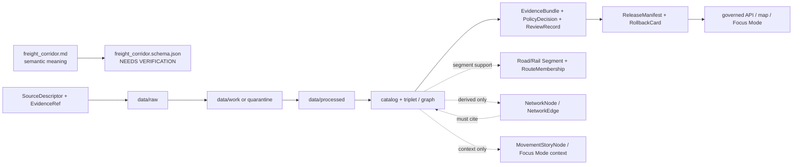

<!-- [KFM_META_BLOCK_V2]
doc_id: kfm://doc/contracts-domains-roads-rail-trade-freight-corridor
title: Freight Corridor Contract — Roads / Rail / Trade Routes
type: semantic-contract
version: v0.2
status: draft; PROPOSED; schema-missing; slug-CONFLICTED; NEEDS VERIFICATION before promotion
owners:
  - OWNER_TBD — Roads/Rail/Trade Routes domain steward
  - OWNER_TBD — Roads steward
  - OWNER_TBD — Rail steward
  - OWNER_TBD — Trade/logistics steward
  - OWNER_TBD — Contracts steward
  - OWNER_TBD — Source steward
  - OWNER_TBD — Evidence steward
  - OWNER_TBD — Schema steward
  - OWNER_TBD — Policy steward
  - OWNER_TBD — Release steward
  - OWNER_TBD — Docs steward
created: NEEDS VERIFICATION — scaffold existed before v0.2 expansion
updated: 2026-06-23
policy_label: public; contracts; roads-rail-trade; freight-corridor; logistics-corridor; transport-side-claim; corridor-context; source-role-aware; temporal-scope-aware; evidence-bound; graph-projection-aware; trade-context-aware; release-gated; rollback-aware; not-commodity-flow-proof; not-live-routing; not-commercial-intelligence; not-legal-designation-authority; not-publication-authority
tags: [kfm, contracts, roads-rail-trade, freight-corridor, logistics, corridor-route, route-membership, road-segment, rail-segment, freight-network, trade-context, network-edge, movement-story-node, source-role, valid-time, EvidenceBundle, PolicyDecision, ReviewRecord, ReleaseManifest, RollbackCard]
related:
  - ./README.md
  - ./corridor_route.md
  - ./trade_route_corridor.md
  - ./route_membership.md
  - ./road_segment.md
  - ./rail_segment.md
  - ./network_node.md
  - ./network_edge.md
  - ./movement_story_node.md
  - ./route_event.md
  - ./status_event.md
  - ./access_restriction.md
  - ./operator_assignment.md
  - ./operator_status.md
  - ../roads/README.md
  - ../../../docs/domains/roads-rail-trade/README.md
  - ../../../docs/domains/roads-rail-trade/CANONICAL_PATHS.md
  - ../../../docs/domains/roads-rail-trade/OBJECT_FAMILIES.md
  - ../../../docs/domains/roads-rail-trade/IDENTITY_MODEL.md
  - ../../../docs/domains/roads-rail-trade/SOURCES.md
  - ../../../docs/domains/roads-rail-trade/sublanes/roads.md
  - ../../../docs/domains/roads-rail-trade/sublanes/rail.md
  - ../../../docs/domains/roads-rail-trade/sublanes/trade-routes.md
  - ../../../docs/domains/roads-rail-trade/GRAPH_PROJECTIONS.md
  - ../../../docs/domains/roads-rail-trade/MAP_UI_CONTRACTS.md
  - ../../../docs/domains/roads-rail-trade/DATA_LIFECYCLE.md
  - ../../../docs/runbooks/roads-rail-trade/PROMOTION_RUNBOOK.md
  - ../../../docs/runbooks/roads-rail-trade/ROLLBACK_RUNBOOK.md
  - ../../../schemas/contracts/v1/domains/roads-rail-trade/freight_corridor.schema.json
  - ../../../policy/domains/roads-rail-trade/
  - ../../../fixtures/domains/roads-rail-trade/freight_corridor/
  - ../../../tests/domains/roads-rail-trade/
  - ../../../release/candidates/roads-rail-trade/
notes:
  - "Expanded from a PROPOSED scaffold at contracts/domains/roads-rail-trade/freight_corridor.md."
  - "A paired schema at schemas/contracts/v1/domains/roads-rail-trade/freight_corridor.schema.json was not found in this task. Field realization remains PROPOSED."
  - "The domain README names Freight Corridor as freight and logistics corridor context. The lifecycle doc lists freight-corridor context as a PUBLISHED viewing product only through governed APIs and manifests."
  - "This contract defines transport-side freight/logistics corridor context. It does not certify commodity flows, proprietary commercial intelligence, live routing, legal designation, operator status, security-sensitive supply-chain detail, or publication approval."
  - "The Roads / Rail / Trade Routes docs record a slug conflict between roads-rail-trade and transport for contract/schema homes. This file preserves the observed requested path and does not resolve the ADR question."
[/KFM_META_BLOCK_V2] -->

<a id="top"></a>

# Freight Corridor Contract — Roads / Rail / Trade Routes

> Semantic contract for `freight_corridor`: the evidence-bound transport-side claim that a road, rail, multimodal, historic, or derived corridor has freight/logistics relevance — without becoming commodity-flow proof, live routing authority, proprietary commercial intelligence, legal designation authority, graph truth, map truth, or publication approval.

<p>
  
  
  
  
  
  
  
</p>

`contracts/domains/roads-rail-trade/freight_corridor.md`

## Quick jumps

[Status](#status) · [Meaning](#meaning) · [Repo fit](#repo-fit) · [Schema posture](#schema-posture) · [Accepted uses](#accepted-uses) · [Exclusions](#exclusions) · [Recommended fields](#recommended-fields) · [Invariants](#invariants) · [Freight corridor claim families](#freight-corridor-claim-families) · [Source-role and time rules](#source-role-and-time-rules) · [Lifecycle](#lifecycle) · [Validation](#validation) · [Rollback](#rollback) · [Evidence basis](#evidence-basis) · [Open questions](#open-questions)

---

## Status

> [!IMPORTANT]
> **Status:** `draft` / semantic contract  
> **Owner:** `OWNER_TBD`  
> **Contract path:** `contracts/domains/roads-rail-trade/freight_corridor.md`  
> **Schema path:** `schemas/contracts/v1/domains/roads-rail-trade/freight_corridor.schema.json` — **not found in this task**  
> **Truth posture:** target path and prior scaffold are confirmed from current repo evidence. `Freight Corridor` is confirmed as a Roads / Rail / Trade Routes object term in the domain README. Exact schema fields, validator behavior, fixture coverage, policy behavior, source registry behavior, release manifests, emitted proofs, public API behavior, map rendering, graph behavior, and runtime behavior remain **NEEDS VERIFICATION**.

> [!CAUTION]
> This contract defines freight-corridor meaning only. It does **not** certify current freight movement, commodity volume, commercial routing, legal designation, public access, security-sensitive logistics, operator authority, emergency detour status, map/API behavior, or publication approval.

---

## Meaning

`freight_corridor` records the semantic meaning of a freight or logistics corridor context claim inside Roads / Rail / Trade Routes.

It may represent that a source asserts or supports a corridor as freight-relevant because it:

- groups `Road Segment`, `Rail Segment`, `CorridorRoute`, or `RouteMembership` evidence into a freight/logistics context;
- appears in a public, administrative, planning, regulatory, modeled, historical, or released source as a freight corridor, goods-movement corridor, logistics route, rail freight line, truck route, intermodal corridor, or trade corridor;
- contributes context to a map layer, Evidence Drawer, Focus Mode answer, route comparison, public-safe freight-corridor view, or derived graph projection;
- has source-scoped attributes such as corridor name, source-native ID, mode, segment membership, time scope, policy posture, generalized geometry, sensitivity label, or limitations;
- may connect to `NetworkNode`, `NetworkEdge`, `MovementStoryNode`, `OperatorAssignment`, `OperatorStatus`, `RouteEvent`, `StatusEvent`, or `AccessRestriction` records without absorbing those objects' authority.

The freight corridor contract owns the **transport-side corridor context**: how corridor evidence supports freight/logistics interpretation in KFM. It does not own raw shipment data, commodity volume, proprietary logistics intelligence, current routing availability, legal designation, economic forecast truth, operator truth, emergency status, graph truth, or public release authority.

---

## Repo fit

| Responsibility | Path or root | Relationship |
|---|---|---|
| Parent contract lane | `./README.md` | Defines this folder as semantic contracts only. |
| Route/corridor contract | `./corridor_route.md` | Related route/corridor entity semantics; freight corridor may specialize or contextualize route/corridor meaning. |
| Trade/historic corridor relation | `./trade_route_corridor.md` | Related trade/historic corridor semantics; do not collapse freight context and trade-route proof. |
| Segment/membership contracts | `./road_segment.md`, `./rail_segment.md`, `./route_membership.md` | Segment evidence and membership remain separate from corridor context. |
| Graph contracts | `./network_node.md`, `./network_edge.md` | Derived topology; graph output must cite freight corridor evidence and remain derivative. |
| Event/status contracts | `./route_event.md`, `./status_event.md`, `./access_restriction.md`, `./operator_status.md` | Time-bound status, restriction, operator, and event semantics. |
| Parent doctrine | `../../../docs/domains/roads-rail-trade/README.md` | Domain scope and object roster, including Freight Corridor. |
| Data lifecycle | `../../../docs/domains/roads-rail-trade/DATA_LIFECYCLE.md` | Shows freight-corridor context as a governed PUBLISHED viewing product only. |
| Schemas | `../../../schemas/contracts/v1/domains/roads-rail-trade/` or ADR-selected alternate | Machine shape; paired schema missing in this task. |
| Policy | `../../../policy/domains/roads-rail-trade/` or ADR-selected alternate | Allow/deny/restrict/abstain decisions, especially for sensitive logistics/security claims. |
| Fixtures/tests | `../../../fixtures/domains/roads-rail-trade/`, `../../../tests/domains/roads-rail-trade/` | Behavior proof; not contract prose. |
| Source registry | `../../../data/registry/sources/roads-rail-trade/` | Source authority, cadence, rights, and caveats. |
| Release/rollback | `../../../release/candidates/roads-rail-trade/` and release roots | Promotion, release, correction, and rollback. |

---

## Schema posture

A direct paired schema was checked at:

```text
schemas/contracts/v1/domains/roads-rail-trade/freight_corridor.schema.json
```

That file was **not found** in this task.

> [!WARNING]
> Because no paired schema was confirmed, every field below is **PROPOSED** semantic guidance. Do not treat it as machine-enforced until schema, fixtures, validator, policy tests, source registry records, release checks, and runtime behavior are verified.

---

## Accepted uses

| Use | Allowed? | Rule |
|---|---:|---|
| Defining freight/logistics corridor context | Yes | Must preserve source role, corridor scope, time, evidence, policy, and release posture. |
| Grouping road/rail segments into freight context | Yes | Use `RouteMembership` or equivalent refs; do not embed segment truth in the corridor. |
| Supporting public-safe freight-corridor map views | Conditional | Requires EvidenceBundle, PolicyDecision, ReviewRecord, ReleaseManifest, correction path, and RollbackCard. |
| Supporting graph/connectivity views | Conditional | Derived graph edges must cite evidence and remain downstream projections. |
| Linking to operator/status/restriction events | Conditional | Use separate operator/status/restriction contracts and valid-time discipline. |
| Representing generalized freight planning context | Conditional | Must surface uncertainty, source role, time scope, and limitations. |
| Proving commodity flows, shipment volumes, or commercial route choices | No | Requires separate authoritative/commercial evidence and policy review; do not infer. |
| Acting as live routing, emergency, legal, or security authority | No | Requires separate governed source and fail-closed policy posture. |

---

## Exclusions

`freight_corridor` must not be used as:

| Misuse | Required outcome |
|---|---|
| Commodity-flow proof | `ABSTAIN` unless supported by dedicated source, evidence, rights, policy, and release posture. |
| Proprietary commercial intelligence | `DENY` or restrict unless rights and sensitivity gates explicitly allow exposure. |
| Live routing or logistics recommendation | `DENY`; KFM is not a live freight routing system. |
| Legal freight-route designation authority | `ABSTAIN` unless authoritative source and time-scoped legal/status support exist. |
| Operator status or ownership truth | Use OperatorAssignment / OperatorStatus contracts and source refs. |
| Road/rail segment replacement | Segment evidence remains in road/rail segment contracts. |
| Graph canonical truth | Graph layers and network edges are derived and must cite evidence. |
| Public API/map payload by itself | Use governed API/released artifacts only. |
| Publication approval | ReleaseManifest, ReviewRecord, PolicyDecision, and RollbackCard remain separate. |

---

## Recommended fields

The following fields are **PROPOSED** until a schema is added and validated.

| Field | Meaning |
|---|---|
| `id` | Canonical freight-corridor contract object identifier. |
| `version` | Contract/object version. |
| `spec_hash` | Deterministic hash over normalized freight corridor claim content. |
| `domain` | Expected value: `roads-rail-trade` unless ADR selects another slug. |
| `corridor_name` | Source-stated freight/logistics corridor name. |
| `corridor_source_id` | Source-native corridor, route, freight-network, or planning ID, if present and safe. |
| `freight_corridor_type` | Rail freight, highway freight, truck route, intermodal, planning corridor, historic freight/trade context, candidate corridor, or source-specific type. |
| `mode_scope` | Road, rail, multimodal, water-linked, intermodal, or generalized mode scope. |
| `source_ref` | SourceDescriptor/source registry reference. |
| `source_role` | Accepted source role; must be preserved from admission through publication. |
| `corridor_route_refs` | CorridorRoute refs associated with this freight context. |
| `route_membership_refs` | RouteMembership refs attaching segments to the corridor. |
| `road_segment_refs` | Road Segment refs, where used as evidence. |
| `rail_segment_refs` | Rail Segment refs, where used as evidence. |
| `network_node_refs` | Network node refs, if a graph projection uses the corridor. |
| `network_edge_refs` | Derived network edge refs, if any. |
| `operator_assignment_refs` | OperatorAssignment / OperatorStatus refs, if supported. |
| `status_refs` | StatusEvent, RouteEvent, or AccessRestriction refs, if any. |
| `trade_context_refs` | TradeRouteCorridor, MovementStoryNode, or historic/trade context refs, where relevant. |
| `geometry_ref` | Point/line/polygon/generalized geometry reference; not routing or commercial proof by itself. |
| `generalization_ref` | Redaction/generalization transform or receipt ref, if public-safe geometry differs from source geometry. |
| `valid_time` | Interval during which this freight corridor context is asserted to apply. |
| `source_time` | Source creation, publication, planning, recording, update, or source-vintage time. |
| `retrieval_time` | KFM retrieval/freeze time. |
| `release_time` | KFM governed release time, if released. |
| `evidence_refs` | EvidenceRefs or EvidenceBundle refs. |
| `policy_decision_ref` | PolicyDecision governing use or publication. |
| `review_ref` | ReviewRecord or steward review ref. |
| `release_manifest_ref` | ReleaseManifest for public/semi-public exposure. |
| `rollback_ref` | RollbackCard or rollback target. |
| `limitations` | Caveats: corridor context only; not commodity-flow proof, commercial intelligence, live routing, legal designation, graph truth, or release authority. |

---

## Invariants

1. **Freight corridor is context, not flow proof.** It may show freight/logistics relevance, but it does not prove shipments, volumes, commodities, customers, or routing choices.
2. **Freight corridor is not live routing.** It does not provide route recommendation, detour advice, travel time, dispatch, emergency, or logistics-operational authority.
3. **Freight corridor is not legal designation authority.** Legal route/status assertions require authoritative source and time-scoped policy support.
4. **Freight corridor is not proprietary intelligence.** Sensitive, private, security-relevant, or rights-uncertain logistics detail fails closed or is generalized/restricted.
5. **Freight corridor is not segment truth.** Road/Rail Segment and RouteMembership objects remain separate evidence and relationship objects.
6. **Freight corridor is not operator truth.** Operator, jurisdiction, ownership, and service status belong in separate source-scoped refs.
7. **Freight corridor is not graph truth.** Network projections may derive from corridor evidence but must cite it and remain downstream. 
8. **Freight corridor is source-role-aware.** Planning, regulatory, administrative, observed, modeled, aggregate, synthetic, and candidate sources do not collapse into one authority posture.
9. **Freight corridor is time-aware.** Source time, valid time, retrieval time, release time, and correction time remain distinct where material.
10. **Publication requires release artifacts.** Public freight-corridor display requires EvidenceBundle, PolicyDecision, ReviewRecord, ReleaseManifest, correction path, and rollback target.

---

## Freight corridor claim families

| Claim family | Meaning | Special guardrail |
|---|---|---|
| `rail_freight_corridor` | Source asserts a rail-aligned freight/logistics corridor. | Not proof of current service, operator status, or commodity movement. |
| `highway_freight_corridor` | Source asserts a highway/truck freight corridor. | Not legal truck-route or live routing authority by itself. |
| `intermodal_corridor` | Source asserts combined road/rail/facility freight relevance. | Facility and operator identity must remain separately cited. |
| `planning_corridor` | Planning or administrative source identifies a freight corridor. | Planning context is not observed movement or legal status. |
| `regulatory_corridor` | Regulatory or authority source identifies a freight corridor/designation. | Time-scoped legal/designation support required. |
| `historic_freight_corridor` | Historical source supports freight/trade movement context. | Preserve uncertainty; avoid current-logistics wording. |
| `generalized_public_corridor` | Public-safe generalized corridor derived from sensitive/source data. | Requires transform receipt, review, policy, release, and rollback refs. |
| `candidate_freight_corridor` | Model, graph, connector, OCR, or map source proposes a freight corridor. | Candidate until reviewed; no public truth without evidence and policy gates. |

---

## Source-role and time rules

Freight-corridor records must carry source role and time as part of meaning, not as optional decoration.

| Rule | Requirement |
|---|---|
| Source role is fixed at admission | Promotion never turns planning/context/candidate/modeled evidence into observed freight movement or legal authority. |
| Corridor context is not movement proof | Freight relevance can be shown without implying shipment volume, commodity class, customer, or route choice. |
| Planning time is not valid time | A plan, study, corridor designation, release candidate, and current route status carry distinct time axes. |
| Operator and status are separate | Operator, service, jurisdiction, access restriction, and route status need separate time-scoped refs. |
| Sensitive logistics detail fails closed | Security-relevant, proprietary, critical-infrastructure, or rights-uncertain details require quarantine, redaction, generalization, denial, or staged access. |
| Release time is explicit | Public display must cite the release artifact and rollback target. |

---

## Lifecycle



Contracts describe meaning. They do not move data, validate schemas, make policy decisions, close evidence, perform review, publish artifacts, define routes, render maps, prove freight flow, or authorize AI answers.

---

## Validation

Before this contract is treated as mature, maintainers should verify:

- [ ] the ADR-selected contract/schema slug and whether this file should remain under `contracts/domains/roads-rail-trade/` or migrate to `contracts/transport/`;
- [ ] paired schema exists and includes source role, corridor type, mode scope, route refs, segment membership refs, graph refs, time axes, evidence, policy, review, release, and rollback refs;
- [ ] fixtures cover rail freight corridors, highway freight corridors, intermodal corridors, planning corridors, regulatory corridors, historic freight corridors, generalized public corridors, and candidate/model corridors;
- [ ] tests prevent planning/context/candidate/model corridor records from implying observed commodity movement or legal designation;
- [ ] tests prevent freight corridor records from absorbing road/rail segment identity, route membership, operator/legal-entity truth, access restrictions, or graph truth;
- [ ] tests preserve freight corridor / corridor route / trade route corridor / route membership / network edge separation;
- [ ] policy tests block proprietary, security-sensitive, critical-infrastructure, rights-uncertain, or overprecise logistics claims unless source/release support exists;
- [ ] public DTOs and map/Focus Mode payloads require EvidenceBundle, PolicyDecision, ReviewRecord, ReleaseManifest, correction path, and RollbackCard;
- [ ] rollback invalidates derived graph nodes/edges, layer caches, API payloads, exports, Focus Mode states, movement story nodes, and AI summaries that cited the freight corridor.

---

## Rollback

Rollback or correction is required when this contract:

- claims freight-corridor schema, policy, fixtures, tests, source registry, lifecycle data, release, API, UI, graph, or runtime behavior exists without proof;
- hides the `roads-rail-trade` vs `transport` slug conflict;
- treats corridor context as commodity-flow proof, live routing, legal designation, operator truth, proprietary commercial intelligence, or security-cleared logistics detail;
- collapses freight corridor, corridor route, trade route corridor, route membership, road/rail segment, operator status, network node, or network edge into one object;
- treats graph topology, map display, Focus Mode output, or AI narrative as canonical freight truth;
- publishes or renders unsupported freight-corridor claims through maps, exports, graph views, Focus Mode, or AI narrative.

Rollback target: revert this file to prior scaffold blob SHA `2d467e7726caf4182fc41ec6cbc9dbf3b7a26006`, record drift if authority boundaries were affected, and invalidate downstream derivatives that cited the weakened freight-corridor contract.

---

## Evidence basis

| Evidence | Status | Supports | Limit |
|---|---|---|---|
| Prior `contracts/domains/roads-rail-trade/freight_corridor.md` | `CONFIRMED` | Target file existed as a PROPOSED scaffold. | Scaffold did not define authoritative semantic contract content. |
| `schemas/contracts/v1/domains/roads-rail-trade/freight_corridor.schema.json` lookup | `CONFIRMED not found in this task` | Justifies `schema-missing` and PROPOSED field posture. | Does not rule out alternate schema homes such as `transport/`. |
| `docs/domains/roads-rail-trade/README.md` | `CONFIRMED doctrine / PROPOSED field realization` | Names Freight Corridor as freight and logistics corridor context, and states cross-lane non-ownership / governed API requirements. | Does not prove schema, validator, runtime, or public API maturity. |
| `docs/domains/roads-rail-trade/DATA_LIFECYCLE.md` | `CONFIRMED doctrine / PROPOSED implementation` | Places freight-corridor context in PUBLISHED viewing products served only through governed APIs and manifests. | Implementation paths/artifact IDs remain PROPOSED / NEEDS VERIFICATION. |
| `contracts/domains/roads-rail-trade/corridor_route.md` | `CONFIRMED sibling style` | Adjacent expanded route/corridor semantic contract pattern with schema-missing posture. | CorridorRoute-specific; does not define Freight Corridor schema. |
| Uploaded authoring prompt v2 | `CONFIRMED user-supplied guidance` | Requires evidence-grounded, visually polished, implementation-honest Markdown with verification and rollback posture. | Authoring guidance, not implementation proof. |

---

## Open questions

| ID | Question | Status |
|---|---|---|
| OQ-RRT-FC-01 | Should `freight_corridor.md` remain at `contracts/domains/roads-rail-trade/` or migrate to `contracts/transport/` after slug ADR resolution? | OPEN / ADR NEEDED |
| OQ-RRT-FC-02 | Which `freight_corridor_type`, `mode_scope`, trust-state, and sensitivity enum values are accepted by schemas and validators? | OPEN / SCHEMA REVIEW |
| OQ-RRT-FC-03 | When should a freight corridor be modeled as `Freight Corridor`, `CorridorRoute`, `TradeRouteCorridor`, `RouteMembership`, `NetworkEdge`, or `MovementStoryNode`? | OPEN / DOMAIN REVIEW |
| OQ-RRT-FC-04 | Which source families can confirm freight corridor context versus only propose a planning/model/candidate corridor? | OPEN / SOURCE STEWARD REVIEW |
| OQ-RRT-FC-05 | What public-safe language prevents freight corridor context from being mistaken for commodity-flow proof, live routing, legal status, or commercial intelligence? | OPEN / POLICY REVIEW |
| OQ-RRT-FC-06 | Which logistics/security-sensitive details must be generalized, restricted, delayed, or denied before public rendering? | OPEN / POLICY + SECURITY REVIEW |

<p align="right"><a href="#top">Back to top</a></p>
