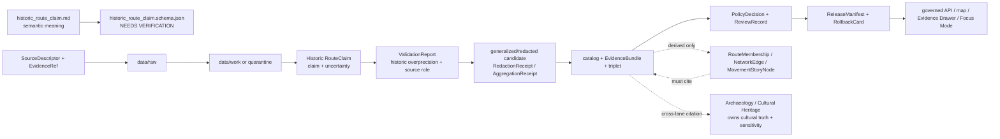

<!-- [KFM_META_BLOCK_V2]
doc_id: kfm://doc/contracts-domains-roads-rail-trade-historic-route-claim
title: Historic Route Claim Contract — Roads / Rail / Trade Routes
type: semantic-contract
version: v0.2
status: draft; PROPOSED; schema-missing; slug-CONFLICTED; high-sensitivity; NEEDS VERIFICATION before promotion
owners:
  - OWNER_TBD — Roads/Rail/Trade Routes domain steward
  - OWNER_TBD — Historic/trade-routes steward
  - OWNER_TBD — Archaeology/Cultural Heritage steward
  - OWNER_TBD — Sovereignty/cultural-sensitivity reviewer
  - OWNER_TBD — Contracts steward
  - OWNER_TBD — Source steward
  - OWNER_TBD — Evidence steward
  - OWNER_TBD — Schema steward
  - OWNER_TBD — Policy steward
  - OWNER_TBD — Release steward
  - OWNER_TBD — Docs steward
created: NEEDS VERIFICATION — scaffold existed before v0.2 expansion
updated: 2026-06-23
policy_label: public-scaffold; contracts; roads-rail-trade; historic-route-claim; historic-route; trade-routes; cultural-corridor; claim-not-fact; source-role-aware; temporal-scope-aware; uncertainty-aware; evidence-bound; sensitivity-first; steward-review-default; generalized-public-geometry; redaction-required-when-sensitive; graph-projection-aware; release-gated; rollback-aware; not-modern-survey-precision; not-archaeology-truth; not-cultural-truth; not-land-title; not-publication-authority
tags: [kfm, contracts, roads-rail-trade, historic-route-claim, historic-route, trade-route-corridor, corridor-route, route-membership, movement-story-node, uncertainty-surface, redaction-receipt, aggregation-receipt, source-role, valid-time, EvidenceBundle, PolicyDecision, ReviewRecord, ReleaseManifest, RollbackCard, cultural-heritage, sovereignty-review]
related:
  - ./README.md
  - ./corridor_route.md
  - ./trade_route_corridor.md
  - ./route_membership.md
  - ./movement_story_node.md
  - ./road_segment.md
  - ./rail_segment.md
  - ./network_node.md
  - ./network_edge.md
  - ./domain_observation.md
  - ./domain_feature_identity.md
  - ./domain_validation_report.md
  - ../roads/README.md
  - ../../../docs/domains/roads-rail-trade/README.md
  - ../../../docs/domains/roads-rail-trade/CANONICAL_PATHS.md
  - ../../../docs/domains/roads-rail-trade/OBJECT_FAMILIES.md
  - ../../../docs/domains/roads-rail-trade/IDENTITY_MODEL.md
  - ../../../docs/domains/roads-rail-trade/SOURCES.md
  - ../../../docs/domains/roads-rail-trade/DATA_LIFECYCLE.md
  - ../../../docs/domains/roads-rail-trade/sublanes/trade-routes.md
  - ../../../docs/domains/roads-rail-trade/GRAPH_PROJECTIONS.md
  - ../../../docs/domains/roads-rail-trade/MAP_UI_CONTRACTS.md
  - ../../../docs/runbooks/roads-rail-trade/PROMOTION_RUNBOOK.md
  - ../../../docs/runbooks/roads-rail-trade/ROLLBACK_RUNBOOK.md
  - ../../../schemas/contracts/v1/domains/roads-rail-trade/historic_route_claim.schema.json
  - ../../../policy/domains/roads-rail-trade/
  - ../../../fixtures/domains/roads-rail-trade/historic_route_claim/
  - ../../../tests/domains/roads-rail-trade/
  - ../../../release/candidates/roads-rail-trade/
notes:
  - "Expanded from a PROPOSED scaffold at contracts/domains/roads-rail-trade/historic_route_claim.md."
  - "A paired schema at schemas/contracts/v1/domains/roads-rail-trade/historic_route_claim.schema.json was not found in this task. Field realization remains PROPOSED."
  - "Object-family doctrine names Historic RouteClaim as a historical route assertion — a claim, not an observed event — with source id, object role, temporal scope, and normalized digest as the PROPOSED identity basis."
  - "Trade-routes sublane doctrine states that Historic RouteClaim records a claim about a historic alignment with evidence and uncertainty rather than as fact. Public geometry defaults to generalized output under steward review when historic, Indigenous, treaty, oral-history, cultural, or sensitive corridor evidence is involved."
  - "This contract defines the transport-side route-claim relation. It does not author archaeology/cultural truth, cultural sensitivity policy, exact site coordinates, land/title facts, modern legal route designation, public access, or publication approval."
  - "The Roads / Rail / Trade Routes docs record a slug conflict between roads-rail-trade and transport for contract/schema homes. This file preserves the observed requested path and does not resolve the ADR question."
[/KFM_META_BLOCK_V2] -->

<a id="top"></a>

# Historic Route Claim Contract — Roads / Rail / Trade Routes

> Semantic contract for `historic_route_claim`: the source-scoped claim that a historic route, trail, road, trade/mobility corridor, or alignment existed or may have followed a described path — without becoming confirmed alignment truth, archaeology/cultural truth, modern survey precision, land/title authority, legal public-access status, graph truth, map truth, or publication approval.

<p>
  
  
  
  
  
  
  
</p>

`contracts/domains/roads-rail-trade/historic_route_claim.md`

## Quick jumps

[Status](#status) · [Meaning](#meaning) · [Repo fit](#repo-fit) · [Schema posture](#schema-posture) · [Accepted uses](#accepted-uses) · [Exclusions](#exclusions) · [Recommended fields](#recommended-fields) · [Invariants](#invariants) · [Historic route claim families](#historic-route-claim-families) · [Source-role, uncertainty, and time rules](#source-role-uncertainty-and-time-rules) · [Sensitivity and publication posture](#sensitivity-and-publication-posture) · [Lifecycle](#lifecycle) · [Validation](#validation) · [Rollback](#rollback) · [Evidence basis](#evidence-basis) · [Open questions](#open-questions)

---

## Status

> [!IMPORTANT]
> **Status:** `draft` / semantic contract  
> **Owner:** `OWNER_TBD`  
> **Contract path:** `contracts/domains/roads-rail-trade/historic_route_claim.md`  
> **Schema path:** `schemas/contracts/v1/domains/roads-rail-trade/historic_route_claim.schema.json` — **not found in this task**  
> **Truth posture:** target path and prior scaffold are confirmed from current repo evidence. `Historic RouteClaim` is confirmed as a Roads / Rail / Trade Routes term, but field realization, validator behavior, fixture coverage, policy behavior, source registry behavior, release manifests, emitted proofs, public API behavior, map rendering, graph behavior, and runtime behavior remain **NEEDS VERIFICATION**.

> [!CAUTION]
> This contract defines a **claim**, not a confirmed route fact. It does **not** authorize exact historic/cultural corridor geometry, modern survey precision, archaeological site exposure, cultural truth, public access, legal status, land/title facts, graph truth, map/API behavior, or publication approval.

---

## Meaning

`historic_route_claim` records the semantic meaning of a source-scoped historical route assertion inside Roads / Rail / Trade Routes.

It may represent that a source claims, suggests, records, interprets, digitizes, or models that a route, trail, road, crossing path, trade/mobility corridor, military road, emigrant route, stage route, mail route, cattle trail, Indigenous corridor, or other historical movement corridor existed, crossed a place, followed an alignment, connected nodes, or related to a modern road/rail segment.

A historic route claim may carry:

- source-scoped wording, name, label, citation, route description, map symbol, oral-history relation, archival reference, or interpreted alignment;
- uncertainty about geometry, time, interpretation, source authority, cultural sensitivity, or route continuity;
- generalized or redacted geometry suitable for review or public display, when supported;
- links to `CorridorRoute`, `TradeRouteCorridor`, `RouteMembership`, `MovementStoryNode`, `Road Segment`, `Rail Segment`, `Crossing`, `River Crossing`, `Ferry`, `NetworkNode`, or `NetworkEdge` records;
- EvidenceBundle, PolicyDecision, ReviewRecord, RedactionReceipt, AggregationReceipt, ReleaseManifest, correction path, and RollbackCard refs where release is considered.

The historic route claim contract owns the **transport-side claim relation**: what a source asserts about a historical alignment and how KFM preserves the claim's evidence, uncertainty, time, source role, and sensitivity posture. It does not own archaeological site identity, cultural truth, exact site coordinates, sovereignty review, land/title claims, modern route legal status, modern access, graph canonical truth, or public release authority.

---

## Repo fit

| Responsibility | Path or root | Relationship |
|---|---|---|
| Parent contract lane | `./README.md` | Defines this folder as semantic contracts only. |
| Corridor route contract | `./corridor_route.md` | Route/corridor entity semantics; claims may point to a corridor entity but do not prove it. |
| Trade route corridor contract | `./trade_route_corridor.md` | Generalized trade/mobility corridor semantics; often downstream of reviewed claims. |
| Route membership contract | `./route_membership.md` | Segment-to-route membership remains a separate sourced, time-scoped relation. |
| Movement story node contract | `./movement_story_node.md` | Narrative/Focus Mode node that may cite a claim; generated narrative remains downstream. |
| Observation/identity contracts | `./domain_observation.md`, `./domain_feature_identity.md` | Observations and identity envelopes are adjacent but not replacements for claim semantics. |
| Graph contracts | `./network_node.md`, `./network_edge.md` | Derived topology; graph output must cite claims and EvidenceBundle refs. |
| Trade-routes sublane dossier | `../../../docs/domains/roads-rail-trade/sublanes/trade-routes.md` | Highest-sensitivity historic/trade-corridor posture and explicit non-ownership rules. |
| Data lifecycle | `../../../docs/domains/roads-rail-trade/DATA_LIFECYCLE.md` | Historic overprecision denial, generalized geometry, RedactionReceipt, ReviewRecord, and release gates. |
| Schemas | `../../../schemas/contracts/v1/domains/roads-rail-trade/` or ADR-selected alternate | Machine shape; paired schema missing in this task. |
| Policy | `../../../policy/domains/roads-rail-trade/` or ADR-selected alternate | Allow/deny/restrict/abstain decisions, especially for cultural, archaeological, and sovereignty-sensitive claims. |
| Fixtures/tests | `../../../fixtures/domains/roads-rail-trade/`, `../../../tests/domains/roads-rail-trade/` | Behavior proof; not contract prose. |
| Release/rollback | `../../../release/candidates/roads-rail-trade/` and release roots | Promotion, release, correction, and rollback. |

---

## Schema posture

A direct paired schema was checked at:

```text
schemas/contracts/v1/domains/roads-rail-trade/historic_route_claim.schema.json
```

That file was **not found** in this task.

> [!WARNING]
> Because no paired schema was confirmed, every field below is **PROPOSED** semantic guidance. Do not treat it as machine-enforced until schema, fixtures, validator, policy tests, source registry records, release checks, and runtime behavior are verified.

---

## Accepted uses

| Use | Allowed? | Rule |
|---|---:|---|
| Recording a source-scoped historic route claim | Yes | Must preserve source role, citation, uncertainty, temporal scope, and limitations. |
| Supporting a generalized historic route layer | Conditional | Requires EvidenceBundle, PolicyDecision, RedactionReceipt/AggregationReceipt as applicable, ReviewRecord, ReleaseManifest, correction path, and RollbackCard. |
| Linking a claim to modern road/rail evidence | Conditional | Keep historic claim and modern segment identity separate; the modern alignment must not absorb the claim. |
| Supporting movement-story or Focus Mode context | Conditional | Narrative must cite evidence and preserve uncertainty; AI text is downstream. |
| Supporting graph projection | Conditional | Derived graph edges/nodes must cite the claim and remain derivative. |
| Handling Indigenous, treaty, oral-history, cultural, or sensitive corridor evidence | Conditional | Defaults to steward review, restricted handling, and generalized public geometry. |
| Publishing exact alignment as authoritative historic truth | No | Requires stronger review, evidence, policy, rights, sensitivity, and release support; default is deny/generalize. |
| Replacing archaeology, cultural-heritage, land/title, or legal-access authority | No | Use owning domains and governed cross-lane refs. |

---

## Exclusions

`historic_route_claim` must not be used as:

| Misuse | Required outcome |
|---|---|
| Confirmed historic route truth | Keep as claim unless evidence/review explicitly promotes a bounded assertion. |
| Modern survey-precision linework | `DENY` or generalize when source uncertainty does not support precision. |
| Archaeological site identity or coordinates | `DENY`; use Archaeology/Cultural Heritage authority and sensitivity controls. |
| Cultural or Indigenous corridor truth | Require cultural-heritage / sovereignty review and owning-domain policy. |
| Land/title or private-property access claim | Use People/Land or legal/source authority; route claim cannot infer title/access. |
| Modern road/rail segment truth | Road/Rail Segment contracts remain separate. |
| Graph canonical truth | Graph layers and network edges are derived and must cite EvidenceBundle refs. |
| Public API/map payload by itself | Use governed API/released artifacts only. |
| Publication approval | ReleaseManifest, ReviewRecord, PolicyDecision, RedactionReceipt, correction path, and RollbackCard remain separate. |

---

## Recommended fields

The following fields are **PROPOSED** until a schema is added and validated.

| Field | Meaning |
|---|---|
| `id` | Canonical historic route claim identifier. |
| `version` | Contract/object version. |
| `spec_hash` | Deterministic hash over normalized claim content. |
| `domain` | Expected value: `roads-rail-trade` unless ADR selects another slug. |
| `claim_name` | Source-stated or KFM-normalized claim label. |
| `claim_type` | Wagon road, military road, emigrant route, stage route, mail route, cattle trail, Indigenous/trade corridor, ferry/crossing path, rail predecessor, candidate claim, or source-specific type. |
| `claim_statement` | Source-scoped statement being preserved. |
| `source_ref` | SourceDescriptor/source registry reference. |
| `source_role` | Accepted source role; must be preserved from admission through publication. |
| `source_native_id` | External/archive/map/source identifier, if present and safe. |
| `source_excerpt_ref` | Evidence excerpt, page, map sheet, oral-history ref, archival ref, or source location. |
| `interpretation_method_ref` | Method used to interpret/digitize the claim, if any. |
| `uncertainty_ref` | UncertaintySurface or equivalent uncertainty object/ref. |
| `uncertainty_summary` | Plain-language uncertainty statement for review/public-safe display. |
| `geometry_ref` | Candidate/generalized/redacted geometry reference; never proof of exact alignment by itself. |
| `precision_statement` | Statement of supported geometric precision. |
| `generalization_ref` | Generalization or aggregation transform/receipt ref. |
| `redaction_ref` | RedactionReceipt ref where sensitive route detail is suppressed. |
| `corridor_route_ref` | CorridorRoute ref, if the claim supports a route entity. |
| `trade_route_corridor_ref` | TradeRouteCorridor ref, if the claim supports a generalized corridor. |
| `route_membership_refs` | Sourced membership refs attaching segments/features to the claimed route. |
| `movement_story_node_refs` | Narrative/Focus Mode nodes that cite this claim. |
| `modern_segment_refs` | Road/Rail Segment refs used as context only. |
| `crossing_refs` | Crossing, river crossing, ferry, bridge, or ford refs, where relevant. |
| `valid_time` | Historical time interval asserted by the claim, if known. |
| `source_time` | Source creation, publication, recording, map, archive, oral-history, or update time. |
| `retrieval_time` | KFM retrieval/freeze time. |
| `review_time` | Steward/cultural-heritage review time, if reviewed. |
| `release_time` | KFM governed release time, if released. |
| `sensitivity_label` | Sensitivity/policy tier or review state. |
| `evidence_refs` | EvidenceRefs or EvidenceBundle refs. |
| `policy_decision_ref` | PolicyDecision governing use or publication. |
| `review_ref` | ReviewRecord, steward review, cultural-heritage review, or sovereignty-review ref. |
| `release_manifest_ref` | ReleaseManifest for public/semi-public exposure. |
| `rollback_ref` | RollbackCard or rollback target. |
| `limitations` | Caveats: claim only; not confirmed truth, exact coordinate authority, cultural truth, legal access, land/title, graph truth, or release authority. |

---

## Invariants

1. **Claim is not fact.** A Historic RouteClaim records what a source asserts, not what KFM has proven as a precise route.
2. **Uncertainty is part of meaning.** Geometry, wording, time, interpretation, source role, and cultural sensitivity must preserve uncertainty where present.
3. **No false precision.** Historic routes must not publish at modern-survey precision when the source does not support that precision.
4. **Cultural sensitivity fails closed.** Indigenous, treaty, oral-history, cultural, archaeological, or sovereignty-related corridor evidence defaults to steward review and generalized public geometry.
5. **Historic claim is not modern segment truth.** A present road or rail alignment may be context, but it does not absorb or publish the historic claim.
6. **Historic claim is not archaeology/cultural truth.** Archaeological site identity, exact coordinates, cultural interpretation, and sensitivity policy remain with owning domains/stewards.
7. **Historic claim is not land/title/access truth.** Property, title, public access, and private-land implications require separate authoritative support.
8. **Graph is derived.** Network edges, movement story nodes, and route memberships may cite claims but must not replace EvidenceBundle-backed claim records.
9. **Publication requires release artifacts.** Public display requires EvidenceBundle, PolicyDecision, ReviewRecord, RedactionReceipt/AggregationReceipt where applicable, ReleaseManifest, correction path, and RollbackCard.

---

## Historic route claim families

| Claim family | Meaning | Special guardrail |
|---|---|---|
| `map_label_claim` | A historic map label or symbol suggests a route/alignment. | Candidate/context until reviewed; no exact geometry by label alone. |
| `archival_text_claim` | A text, report, diary, newspaper, or archival source asserts a route. | Preserve wording, source role, and interpretive uncertainty. |
| `oral_history_claim` | Oral-history or community source supports route/mobility memory. | Requires cultural sensitivity and consent/steward review. |
| `indigenous_corridor_claim` | Indigenous trade, mobility, treaty, or cultural corridor relation. | Highest-sensitivity posture; generalized public geometry by default. |
| `military_or_stage_route_claim` | Military road, stage route, mail route, or emigrant route assertion. | Historic overprecision denial applies where alignment is uncertain. |
| `crossing_anchor_claim` | Claim is anchored by ford, ferry, river crossing, bridge, settlement, fort, or depot evidence. | Anchor identity belongs to owning contract/domain. |
| `modern_overlay_claim` | Historic claim overlaps a modern road/rail segment. | Modern segment must not absorb or publish historic/cultural sensitivity. |
| `modeled_candidate_claim` | Model, graph, OCR, georeference, or connector proposes a claim. | Candidate until reviewed; no public release without evidence/policy gates. |

---

## Source-role, uncertainty, and time rules

Historic route claims must carry source role, uncertainty, and time as core meaning.

| Rule | Requirement |
|---|---|
| Source role is fixed at admission | Promotion never turns a context source, map label, OCR hit, oral-history relation, model output, or local-history note into confirmed route truth. |
| Uncertainty is visible | The claim must preserve uncertainty enough for Evidence Drawer, review, and public-safe caveats. |
| Geometry is bounded by support | The published/generalized geometry may not imply precision beyond the source. |
| Historical valid time is distinct | The claimed historical period, source publication time, KFM retrieval time, review time, and release time are separate. |
| Cross-lane evidence stays cited | Archaeology, cultural heritage, settlements, hydrology, land/title, and modern road/rail evidence are cited, not absorbed. |
| Release time is explicit | Public display must cite the release artifact and rollback target. |

---

## Sensitivity and publication posture

Historic route claims sit in a higher-risk publication zone than modern public-road linework.

| Surface | Default posture | Required support before public exposure |
|---|---|---|
| Unverified historic alignment | Hold/generalize | EvidenceBundle, uncertainty statement, validation, review, release, rollback. |
| Indigenous / treaty / oral-history / cultural corridor | Steward review and generalized public geometry | Cultural/sovereignty review, PolicyDecision, RedactionReceipt, ReviewRecord, ReleaseManifest. |
| Exact archaeological/site coordinate relation | Deny public exposure by default | Owning-domain policy and named access path; never exposed by this contract alone. |
| Modern overlay with historic claim | Keep separate identities | Modern segment release does not release historic claim geometry. |
| Movement Story / Focus Mode narrative | Evidence-subordinate narrative | EvidenceBundle, claim caveats, policy state, AIReceipt where applicable, rollback target. |

---

## Lifecycle



Contracts describe meaning. They do not move data, validate schemas, make policy decisions, close evidence, perform review, publish artifacts, define exact routes, render maps, author cultural truth, expose site coordinates, or authorize AI answers.

---

## Validation

Before this contract is treated as mature, maintainers should verify:

- [ ] the ADR-selected contract/schema slug and whether this file should remain under `contracts/domains/roads-rail-trade/` or migrate to `contracts/transport/`;
- [ ] paired schema exists and includes source role, claim type, claim statement, uncertainty, precision statement, generalization/redaction refs, time axes, evidence, policy, review, release, and rollback refs;
- [ ] fixtures cover map-label claims, archival text claims, oral-history claims, Indigenous/cultural corridor claims, military/stage route claims, crossing-anchor claims, modern-overlay claims, and modeled candidate claims;
- [ ] tests enforce historic-overprecision denial when geometry precision exceeds source support;
- [ ] tests prevent modern road/rail alignment from absorbing historic/cultural claims or downgrading sensitivity posture;
- [ ] tests prevent map labels, OCR, model output, or context sources from becoming confirmed route truth without review;
- [ ] policy tests block exact archaeological/cultural/sensitive corridor coordinates unless an owning-domain policy and named access path permits exposure;
- [ ] public DTOs and map/Focus Mode payloads require EvidenceBundle, PolicyDecision, ReviewRecord, RedactionReceipt/AggregationReceipt where applicable, ReleaseManifest, correction path, and RollbackCard;
- [ ] rollback invalidates derived route memberships, graph edges, layer caches, API payloads, exports, Focus Mode states, movement story nodes, and AI summaries that cited the claim.

---

## Rollback

Rollback or correction is required when this contract:

- claims historic-route schema, policy, fixtures, tests, source registry, lifecycle data, release, API, UI, graph, or runtime behavior exists without proof;
- hides the `roads-rail-trade` vs `transport` slug conflict;
- treats a claim as confirmed historic route truth without EvidenceBundle, review, policy, release, and uncertainty support;
- publishes exact historic/cultural corridor geometry when only generalized geometry is supported;
- lets a modern road/rail segment absorb, overwrite, or silently publish a historic/cultural claim;
- exposes archaeological, cultural, sovereignty-sensitive, living-person, land/title, or sensitive-location detail through maps, graph, Focus Mode, exports, or AI narrative;
- treats graph topology, map display, movement story nodes, or generated language as canonical historic truth.

Rollback target: revert this file to prior scaffold blob SHA `ca42359755a5bff380591fecf4d30717e8572396`, record drift if authority boundaries were affected, and invalidate downstream derivatives that cited the weakened historic-route-claim contract.

---

## Evidence basis

| Evidence | Status | Supports | Limit |
|---|---|---|---|
| Prior `contracts/domains/roads-rail-trade/historic_route_claim.md` | `CONFIRMED` | Target file existed as a PROPOSED scaffold. | Scaffold did not define authoritative semantic contract content. |
| `schemas/contracts/v1/domains/roads-rail-trade/historic_route_claim.schema.json` lookup | `CONFIRMED not found in this task` | Justifies `schema-missing` and PROPOSED field posture. | Does not rule out alternate schema homes such as `transport/`. |
| `docs/domains/roads-rail-trade/OBJECT_FAMILIES.md` | `CONFIRMED term / PROPOSED field realization` | Names Historic RouteClaim as a historical route assertion, claim not observed event, with deterministic identity posture. | Field-level schema, validators, and runtime behavior remain NEEDS VERIFICATION. |
| `docs/domains/roads-rail-trade/DATA_LIFECYCLE.md` | `CONFIRMED doctrine / PROPOSED implementation` | Historic overprecision denial, UncertaintySurface, generalized geometry, RedactionReceipt, ReviewRecord, and sensitivity posture. | Implementation paths/artifact IDs remain PROPOSED / NEEDS VERIFICATION. |
| `docs/domains/roads-rail-trade/sublanes/trade-routes.md` | `CONFIRMED doctrine / PROPOSED sublane structure` | Highest-sensitivity historic/trade corridor posture, claim-not-fact language, explicit non-ownership, steward review, and generalized public geometry. | Sublane term/path remains PROPOSED / NEEDS VERIFICATION. |
| Uploaded authoring prompt v2 | `CONFIRMED user-supplied guidance` | Requires evidence-grounded, visually polished, implementation-honest Markdown with verification and rollback posture. | Authoring guidance, not implementation proof. |

---

## Open questions

| ID | Question | Status |
|---|---|---|
| OQ-RRT-HRC-01 | Should `historic_route_claim.md` remain at `contracts/domains/roads-rail-trade/` or migrate to `contracts/transport/` after slug ADR resolution? | OPEN / ADR NEEDED |
| OQ-RRT-HRC-02 | Which `claim_type`, `sensitivity_label`, `uncertainty`, and precision fields are required by schemas and validators? | OPEN / SCHEMA REVIEW |
| OQ-RRT-HRC-03 | What evidence/review threshold upgrades a claim from candidate/context to a released bounded assertion? | OPEN / EVIDENCE REVIEW |
| OQ-RRT-HRC-04 | Which cultural, Indigenous, treaty, oral-history, or archaeological claims require named steward or sovereignty review before any public geometry exists? | OPEN / POLICY REVIEW |
| OQ-RRT-HRC-05 | How should public-safe wording prevent a claim from being mistaken for confirmed route truth or modern legal access? | OPEN / UI + POLICY REVIEW |
| OQ-RRT-HRC-06 | How should movement-story nodes cite claims without turning narrative into evidence or route truth? | OPEN / FOCUS MODE REVIEW |

<p align="right"><a href="#top">Back to top</a></p>
