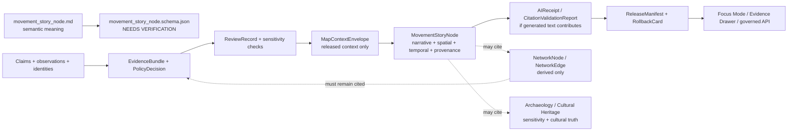

<!-- [KFM_META_BLOCK_V2]
doc_id: kfm://doc/contracts-domains-roads-rail-trade-movement-story-node
title: Movement Story Node Contract — Roads / Rail / Trade Routes
type: semantic-contract
version: v0.2
status: draft; PROPOSED; schema-missing; slug-CONFLICTED; high-sensitivity-adjacent; NEEDS VERIFICATION before promotion
owners:
  - OWNER_TBD — Roads/Rail/Trade Routes domain steward
  - OWNER_TBD — Historic/trade-routes steward
  - OWNER_TBD — Focus Mode steward
  - OWNER_TBD — Archaeology/Cultural Heritage steward
  - OWNER_TBD — Sovereignty/cultural-sensitivity reviewer
  - OWNER_TBD — Contracts steward
  - OWNER_TBD — Source steward
  - OWNER_TBD — Evidence steward
  - OWNER_TBD — Schema steward
  - OWNER_TBD — Policy steward
  - OWNER_TBD — Release steward
  - OWNER_TBD — Docs steward
created: NEEDS VERIFICATION — scaffold existed before v0.2 expansion
updated: 2026-06-23
policy_label: public-scaffold; contracts; roads-rail-trade; movement-story-node; Focus-Mode; narrative-node; spatial-temporal-provenance; CARE-link; evidence-subordinate; source-role-aware; temporal-scope-aware; citation-required; sensitivity-aware; steward-review-default-when-cultural; AI-subordinate; graph-projection-aware; release-gated; rollback-aware; not-evidence-bundle; not-generated-truth; not-cultural-truth; not-graph-truth; not-publication-authority
tags: [kfm, contracts, roads-rail-trade, movement-story-node, FocusMode, EvidenceDrawer, MapContextEnvelope, AIReceipt, CitationValidationReport, EvidenceBundle, HistoricRouteClaim, TradeRouteCorridor, CorridorRoute, RouteMembership, NetworkEdge, UncertaintySurface, PolicyDecision, ReviewRecord, ReleaseManifest, RollbackCard, cultural-heritage, sovereignty-review]
related:
  - ./README.md
  - ./historic_route_claim.md
  - ./trade_route_corridor.md
  - ./corridor_route.md
  - ./route_membership.md
  - ./network_node.md
  - ./network_edge.md
  - ./domain_observation.md
  - ./domain_feature_identity.md
  - ./domain_layer_descriptor.md
  - ./domain_validation_report.md
  - ./freight_corridor.md
  - ./route_event.md
  - ./status_event.md
  - ../roads/README.md
  - ../../../docs/domains/roads-rail-trade/README.md
  - ../../../docs/domains/roads-rail-trade/CANONICAL_PATHS.md
  - ../../../docs/domains/roads-rail-trade/OBJECT_FAMILIES.md
  - ../../../docs/domains/roads-rail-trade/IDENTITY_MODEL.md
  - ../../../docs/domains/roads-rail-trade/SOURCES.md
  - ../../../docs/domains/roads-rail-trade/DATA_LIFECYCLE.md
  - ../../../docs/domains/roads-rail-trade/sublanes/trade-routes.md
  - ../../../docs/domains/roads-rail-trade/GRAPH_PROJECTIONS.md
  - ../../../docs/domains/roads-rail-trade/MAP_UI_CONTRACTS.md
  - ../../../docs/runbooks/roads-rail-trade/PROMOTION_RUNBOOK.md
  - ../../../docs/runbooks/roads-rail-trade/ROLLBACK_RUNBOOK.md
  - ../../../schemas/contracts/v1/domains/roads-rail-trade/movement_story_node.schema.json
  - ../../../schemas/contracts/v1/map/
  - ../../../schemas/contracts/v1/ui/
  - ../../../schemas/contracts/v1/ai/
  - ../../../policy/domains/roads-rail-trade/
  - ../../../fixtures/domains/roads-rail-trade/movement_story_node/
  - ../../../tests/domains/roads-rail-trade/
  - ../../../release/candidates/roads-rail-trade/
notes:
  - "Expanded from a PROPOSED scaffold at contracts/domains/roads-rail-trade/movement_story_node.md."
  - "A paired schema at schemas/contracts/v1/domains/roads-rail-trade/movement_story_node.schema.json was not found in this task. Field realization remains PROPOSED."
  - "The domain README names Movement Story Node as a narrative + spatial + temporal + provenance + CARE link unit for Focus Mode."
  - "Trade-routes sublane doctrine names Movement Story Node as a narrative/interpretive node tied to historic movement evidence; field realization remains PROPOSED until schema verification."
  - "Map/UI doctrine confirms Focus Mode, Evidence Drawer, MapContextEnvelope, AIReceipt, and citation validation as downstream governed surfaces, not truth roots."
  - "This contract defines the semantic meaning of the node. It does not generate narrative truth, authorize AI output, define cross-cutting UI/AI schema shapes, replace EvidenceBundle, author cultural truth, expose sensitive coordinates, or approve publication."
  - "The Roads / Rail / Trade Routes docs record a slug conflict between roads-rail-trade and transport for contract/schema homes. This file preserves the observed requested path and does not resolve the ADR question."
[/KFM_META_BLOCK_V2] -->

<a id="top"></a>

# Movement Story Node Contract — Roads / Rail / Trade Routes

> Semantic contract for `movement_story_node`: the evidence-subordinate narrative, spatial, temporal, provenance, and CARE-link unit that Focus Mode may use to explain movement through roads, rail, historic routes, trade corridors, crossings, graph projections, and released map context — without becoming EvidenceBundle truth, generated-language truth, cultural truth, graph truth, map truth, or publication approval.

<p>
  
  
  
  
  
  
  
</p>

`contracts/domains/roads-rail-trade/movement_story_node.md`

## Quick jumps

[Status](#status) · [Meaning](#meaning) · [Repo fit](#repo-fit) · [Schema posture](#schema-posture) · [Accepted uses](#accepted-uses) · [Exclusions](#exclusions) · [Recommended fields](#recommended-fields) · [Invariants](#invariants) · [Movement story node families](#movement-story-node-families) · [Focus Mode and AI rules](#focus-mode-and-ai-rules) · [Sensitivity and publication posture](#sensitivity-and-publication-posture) · [Lifecycle](#lifecycle) · [Validation](#validation) · [Rollback](#rollback) · [Evidence basis](#evidence-basis) · [Open questions](#open-questions)

---

## Status

> [!IMPORTANT]
> **Status:** `draft` / semantic contract  
> **Owner:** `OWNER_TBD`  
> **Contract path:** `contracts/domains/roads-rail-trade/movement_story_node.md`  
> **Schema path:** `schemas/contracts/v1/domains/roads-rail-trade/movement_story_node.schema.json` — **not found in this task**  
> **Truth posture:** target path and prior scaffold are confirmed from current repo evidence. `Movement Story Node` is confirmed as a Roads / Rail / Trade Routes object term and as a Focus Mode narrative/provenance unit. Exact schema fields, validator behavior, fixture coverage, policy behavior, source registry behavior, release manifests, emitted proofs, public API behavior, map rendering, graph behavior, AI behavior, and runtime behavior remain **NEEDS VERIFICATION**.

> [!CAUTION]
> This contract defines movement-story-node meaning only. It does **not** author truth, generate approved narrative, replace EvidenceBundle, certify graph topology, define Focus Mode API schema, approve AI output, expose sensitive coordinates, author cultural meaning, or publish a map/API surface.

---

## Meaning

`movement_story_node` records the semantic meaning of a narrative/interpretive node used to explain movement evidence inside Roads / Rail / Trade Routes, especially in Focus Mode and Evidence Drawer experiences.

It may represent a bounded explanatory node that:

- connects a person, group, route, corridor, event, crossing, facility, freight context, or movement episode to released evidence and a public-safe map context;
- cites `HistoricRouteClaim`, `TradeRouteCorridor`, `CorridorRoute`, `RouteMembership`, `Road Segment`, `Rail Segment`, `Freight Corridor`, `Crossing`, `Bridge`, `Ferry`, `NetworkNode`, or `NetworkEdge` records without absorbing their authority;
- carries a spatial reference, temporal reference, source-role summary, uncertainty posture, evidence refs, policy state, review state, release state, and rollback target;
- supplies a governed context envelope for Focus Mode or AI-assisted explanation;
- preserves CARE, cultural-sensitivity, sovereignty-review, rights, and citation obligations where the node touches historic, Indigenous, treaty, oral-history, archaeological, living-person, land/title, or sensitive-location evidence.

The movement story node contract owns the **semantic role of the node**: how a narrative unit remains bounded, cited, policy-aware, and release-gated. It does not own the underlying evidence, source truth, graph truth, cultural truth, UI/AI schema shapes, generated prose, or publication authority.

---

## Repo fit

| Responsibility | Path or root | Relationship |
|---|---|---|
| Parent contract lane | `./README.md` | Defines this folder as semantic contracts only. |
| Historic route claim | `./historic_route_claim.md` | A node may cite claims, but does not make them fact. |
| Trade route corridor | `./trade_route_corridor.md` | A node may explain a corridor, but does not author corridor truth. |
| Route/corridor/membership contracts | `./corridor_route.md`, `./route_membership.md` | Node may cite route or membership relations; it does not replace them. |
| Graph contracts | `./network_node.md`, `./network_edge.md` | Node may cite derived graph projections; graph remains derivative. |
| Layer descriptor | `./domain_layer_descriptor.md` | Released map layer context must stay manifest-bound. |
| Observation / identity / validation | `./domain_observation.md`, `./domain_feature_identity.md`, `./domain_validation_report.md` | Node depends on these objects, but must not replace them. |
| Trade-routes sublane dossier | `../../../docs/domains/roads-rail-trade/sublanes/trade-routes.md` | Defines Movement Story Node as narrative/interpretive node tied to historic movement evidence. |
| Map/UI contracts | `../../../docs/domains/roads-rail-trade/MAP_UI_CONTRACTS.md` | Defines Focus Mode, Evidence Drawer, MapContextEnvelope, AIReceipt, and governed UI posture as downstream. |
| Cross-cutting UI/AI schemas | `../../../schemas/contracts/v1/map/`, `../../../schemas/contracts/v1/ui/`, `../../../schemas/contracts/v1/ai/` | Shape homes for map/AI envelopes; not owned by this domain contract. |
| Policy | `../../../policy/domains/roads-rail-trade/` or ADR-selected alternate | Allow/deny/restrict/abstain decisions. |
| Fixtures/tests | `../../../fixtures/domains/roads-rail-trade/`, `../../../tests/domains/roads-rail-trade/` | Behavior proof; not contract prose. |
| Release/rollback | `../../../release/candidates/roads-rail-trade/` and release roots | Promotion, release, correction, and rollback. |

---

## Schema posture

A direct paired schema was checked at:

```text
schemas/contracts/v1/domains/roads-rail-trade/movement_story_node.schema.json
```

That file was **not found** in this task.

> [!WARNING]
> Because no paired schema was confirmed, every field below is **PROPOSED** semantic guidance. Do not treat it as machine-enforced until schema, fixtures, validator, policy tests, source registry records, release checks, UI/AI schemas, and runtime behavior are verified.

---

## Accepted uses

| Use | Allowed? | Rule |
|---|---:|---|
| Defining a Focus Mode narrative/provenance node | Yes | Must cite evidence, policy, time, release state, and limitations. |
| Connecting route/corridor evidence into a public-safe explanation | Conditional | Requires EvidenceBundle, PolicyDecision, ReviewRecord, ReleaseManifest, correction path, and RollbackCard. |
| Carrying map context into Focus Mode | Conditional | Must use governed MapContextEnvelope / released artifacts; no RAW/WORK/QUARANTINE access. |
| Supporting AI-assisted explanation | Conditional | AI output must be evidence-subordinate and receipt/citation-validated where used. |
| Explaining historic/trade route uncertainty | Conditional | Must preserve uncertainty and cultural/steward review posture. |
| Supporting derived graph navigation | Conditional | Graph projection must remain derivative and cited. |
| Replacing EvidenceBundle, PolicyDecision, ReviewRecord, or ReleaseManifest | No | Those remain separate authority objects. |
| Generating authoritative narrative from uncited content | No | Cite-or-abstain remains the default truth posture. |

---

## Exclusions

`movement_story_node` must not be used as:

| Misuse | Required outcome |
|---|---|
| EvidenceBundle replacement | Use EvidenceBundle/EvidenceRef for claim support. |
| Generated-language truth | AI or narrative text cannot upgrade evidence. |
| Cultural or archaeological truth | Owning domains/stewards retain cultural truth, site identity, and sensitivity policy. |
| Graph canonical truth | Network nodes/edges are derived and must cite evidence. |
| Map layer or tile truth | Map/tiles/styles are delivery surfaces, not evidence. |
| Public API or Focus Mode schema authority | Cross-cutting map/ui/ai schemas own shape; this contract owns domain meaning. |
| Sensitive-location disclosure path | Deny, generalize, redact, stage, or restrict as policy requires. |
| Publication approval | ReleaseManifest, ReviewRecord, PolicyDecision, correction path, and RollbackCard remain separate. |

---

## Recommended fields

The following fields are **PROPOSED** until a schema is added and validated.

| Field | Meaning |
|---|---|
| `id` | Canonical movement story node identifier. |
| `version` | Contract/object version. |
| `spec_hash` | Deterministic hash over normalized node content. |
| `domain` | Expected value: `roads-rail-trade` unless ADR selects another slug. |
| `node_title` | Public-safe title or reviewer-facing label. |
| `node_kind` | Historic movement, trade corridor, route event, crossing episode, freight context, graph step, Focus Mode explanation, candidate narrative, or source-specific type. |
| `story_purpose` | Why the node exists and what claim/explanation it may support. |
| `source_refs` | SourceDescriptor/source registry refs supporting the node. |
| `source_role_summary` | Role posture of sources cited by the node. |
| `evidence_refs` | EvidenceRefs or EvidenceBundle refs. |
| `claim_refs` | HistoricRouteClaim, TradeRouteCorridor, CorridorRoute, RouteMembership, or related domain refs. |
| `graph_refs` | NetworkNode/NetworkEdge refs, if the node uses derived graph context. |
| `map_context_ref` | MapContextEnvelope or layer/context ref, where applicable. |
| `focus_mode_ref` | Focus Mode request/response/session ref, if materialized. |
| `ai_receipt_ref` | AIReceipt or generation receipt ref, if generated language contributed. |
| `citation_validation_ref` | CitationValidationReport ref for public/AI-facing text. |
| `spatial_ref` | Public-safe spatial reference; may be generalized/redacted. |
| `temporal_ref` | Valid/source/retrieval/release/correction time refs. |
| `uncertainty_ref` | UncertaintySurface or uncertainty statement ref, where applicable. |
| `care_link_ref` | CARE / cultural-sensitivity / stewardship link ref when applicable. |
| `sensitivity_label` | Sensitivity/policy tier or review state. |
| `redaction_ref` | RedactionReceipt ref where sensitive detail is suppressed. |
| `generalization_ref` | AggregationReceipt/generalization ref where public geometry/content is generalized. |
| `policy_decision_ref` | PolicyDecision governing use or publication. |
| `review_ref` | ReviewRecord or steward/cultural review ref. |
| `release_manifest_ref` | ReleaseManifest for public/semi-public exposure. |
| `rollback_ref` | RollbackCard or rollback target. |
| `limitations` | Caveats: narrative node only; not evidence, truth, cultural authority, graph truth, UI schema, AI approval, or release authority. |

---

## Invariants

1. **Story node is downstream.** It explains released/citable context; it does not create evidence or truth.
2. **Cite-or-abstain.** Every consequential node must resolve to EvidenceBundle or abstain from authoritative wording.
3. **AI is subordinate.** Generated text must never outrank evidence, policy, review state, source role, release state, or sensitivity posture.
4. **Node is not graph truth.** A node may cite graph projections, but graph output remains derived and rollbackable.
5. **Node is not cultural truth.** Cultural, Indigenous, archaeological, oral-history, and sovereignty-related meaning requires owning-domain and steward review.
6. **Node is not a leak path.** Sensitive locations, exact historic/cultural geometries, land/title details, living-person facts, and security-relevant details fail closed or generalize/redact.
7. **Node is time-aware.** Historical time, source time, retrieval time, release time, correction time, and narrative generation time remain distinct where material.
8. **Node is release-gated.** Public use requires EvidenceBundle, PolicyDecision, ReviewRecord, ReleaseManifest, correction path, and RollbackCard.
9. **Node is rollback-aware.** Corrected or withdrawn evidence must invalidate dependent story nodes, graph context, map context, exports, and AI summaries.

---

## Movement story node families

| Node family | Meaning | Special guardrail |
|---|---|---|
| `historic_route_explanation` | Explains a HistoricRouteClaim or historic route context. | Must preserve claim-not-fact posture and uncertainty. |
| `trade_corridor_explanation` | Explains TradeRouteCorridor or mobility corridor context. | Cultural/sovereignty review applies where relevant. |
| `crossing_episode` | Explains a crossing/ferry/ford/bridge relation in movement context. | Hydrology/infrastructure truth remains cross-lane cited. |
| `route_event_explanation` | Explains a designation, redesignation, status, restriction, or event. | Event/status contracts own time-bound semantics. |
| `freight_context_node` | Explains freight/logistics corridor context. | Context is not commodity-flow proof or live routing. |
| `graph_path_step` | Explains a derived graph step or edge in a movement story. | Graph is derived and must cite source evidence. |
| `focus_mode_narrative_node` | Public/interactive Focus Mode narrative node. | Requires governed API, evidence/citation validation, policy, release, and rollback. |
| `candidate_story_node` | Draft/review/generated node not yet released. | Review-only; no public surface until gates pass. |

---

## Focus Mode and AI rules

| Rule | Requirement |
|---|---|
| Focus Mode receives governed context | Use released artifacts, governed APIs, MapContextEnvelope, and EvidenceBundle refs; never direct RAW/WORK/QUARANTINE/internal-store access. |
| Narrative is bounded | The node must define what it explains and what it cannot claim. |
| Citations are structural | Evidence refs and citation validation are not decorative; unsupported claims must be removed, narrowed, denied, or abstained. |
| Generated language is receipt-bound | AI-assisted text must preserve AIReceipt/generation receipt and cannot become source truth. |
| Sensitive content is policy-bound | Redaction/generalization/staged access/denial must happen before public display. |
| Correction propagates | Evidence correction or rollback invalidates dependent node text, map context, graph context, exports, and AI summaries. |

---

## Sensitivity and publication posture

| Surface | Default posture | Required support before public exposure |
|---|---|---|
| Modern public-road/rail movement explanation | Public-safe when evidence/release supports | EvidenceBundle, PolicyDecision, ReviewRecord, ReleaseManifest, RollbackCard. |
| Historic route explanation | Generalized and uncertainty-forward | Historic RouteClaim support, UncertaintySurface, review, release, rollback. |
| Indigenous / treaty / oral-history / cultural corridor explanation | Steward review and generalized public geometry | Cultural/sovereignty review, PolicyDecision, RedactionReceipt, ReviewRecord, ReleaseManifest. |
| Archaeological/site coordinate relation | Deny public exposure by default | Owning-domain policy and named access path; never released by this node alone. |
| AI-generated movement summary | Evidence-subordinate and citation-validated | AIReceipt, citation validation, policy state, release state, rollback target. |

---

## Lifecycle



Contracts describe meaning. They do not move data, validate schemas, make policy decisions, close evidence, perform review, publish artifacts, define Focus Mode routes, generate approved prose, render maps, author cultural truth, expose site coordinates, or authorize AI answers.

---

## Validation

Before this contract is treated as mature, maintainers should verify:

- [ ] the ADR-selected contract/schema slug and whether this file should remain under `contracts/domains/roads-rail-trade/` or migrate to `contracts/transport/`;
- [ ] paired schema exists and includes node kind, evidence refs, claim refs, graph refs, map context refs, Focus Mode refs, AI receipt refs, citation validation refs, time axes, sensitivity labels, policy, review, release, and rollback refs;
- [ ] cross-cutting map/ui/ai schemas exist for MapContextEnvelope, FocusModeRequest/Response, AIReceipt, and CitationValidationReport where referenced;
- [ ] fixtures cover historic-route explanation, trade-corridor explanation, crossing episode, route-event explanation, freight context node, graph path step, Focus Mode narrative node, and candidate story node;
- [ ] tests prevent movement story nodes from replacing EvidenceBundle, PolicyDecision, ReviewRecord, ReleaseManifest, graph truth, or domain object contracts;
- [ ] tests prevent generated text from upgrading uncertain or unsupported claims;
- [ ] policy tests block sensitive coordinates, cultural corridor detail, archaeological site identity, living-person/land-title data, or security-relevant detail unless an owning-domain policy permits exposure;
- [ ] public DTOs and Focus Mode payloads require evidence, citation validation, policy, review, release, correction path, and rollback target;
- [ ] rollback invalidates dependent narrative text, graph steps, map context, exports, Focus Mode states, caches, and AI summaries that cited the node.

---

## Rollback

Rollback or correction is required when this contract:

- claims movement-story schema, UI/AI schemas, policy, fixtures, tests, source registry, lifecycle data, release, API, UI, graph, AI, or runtime behavior exists without proof;
- hides the `roads-rail-trade` vs `transport` slug conflict;
- treats a story node as evidence, cultural truth, graph truth, map truth, generated-language truth, or publication approval;
- lets Focus Mode or AI access RAW, WORK, QUARANTINE, canonical/internal stores, unreleased candidates, direct source feeds, or direct model runtime output as normal public path;
- exposes sensitive cultural, archaeological, living-person, land/title, precise historic route, or security-relevant detail through narrative, maps, graph, exports, or AI summaries;
- fails to invalidate dependent story nodes when cited evidence, policy, release, or rollback state changes.

Rollback target: revert this file to prior scaffold blob SHA `29de2476246881f6bcd5211d5fb80e6276c66885`, record drift if authority boundaries were affected, and invalidate downstream derivatives that cited the weakened movement-story-node contract.

---

## Evidence basis

| Evidence | Status | Supports | Limit |
|---|---|---|---|
| Prior `contracts/domains/roads-rail-trade/movement_story_node.md` | `CONFIRMED` | Target file existed as a PROPOSED scaffold. | Scaffold did not define authoritative semantic contract content. |
| `schemas/contracts/v1/domains/roads-rail-trade/movement_story_node.schema.json` lookup | `CONFIRMED not found in this task` | Justifies `schema-missing` and PROPOSED field posture. | Does not rule out alternate schema homes such as `transport/`. |
| `docs/domains/roads-rail-trade/README.md` | `CONFIRMED doctrine / PROPOSED field realization` | Names Movement Story Node as narrative + spatial + temporal + provenance + CARE link unit for Focus Mode and states cross-lane non-ownership. | Does not prove schema, validator, runtime, or public API maturity. |
| `docs/domains/roads-rail-trade/sublanes/trade-routes.md` | `CONFIRMED doctrine / PROPOSED sublane structure` | Names Movement Story Node as narrative/interpretive node tied to historic movement evidence; preserves source-role and sensitivity posture. | Sublane term/path remains PROPOSED / NEEDS VERIFICATION. |
| `docs/domains/roads-rail-trade/MAP_UI_CONTRACTS.md` | `CONFIRMED doctrine / PROPOSED implementation` | Establishes Focus Mode, Evidence Drawer, MapContextEnvelope, AIReceipt, citation validation, and governed UI trust membrane as downstream surfaces. | Concrete route names, schemas, validators, tests, dashboards, UI wiring, and runtime behavior remain NEEDS VERIFICATION. |
| Uploaded authoring prompt v2 | `CONFIRMED user-supplied guidance` | Requires evidence-grounded, visually polished, implementation-honest Markdown with verification and rollback posture. | Authoring guidance, not implementation proof. |

---

## Open questions

| ID | Question | Status |
|---|---|---|
| OQ-RRT-MSN-01 | Should `movement_story_node.md` remain at `contracts/domains/roads-rail-trade/` or migrate to `contracts/transport/` after slug ADR resolution? | OPEN / ADR NEEDED |
| OQ-RRT-MSN-02 | Which fields belong in this domain contract versus cross-cutting `FocusModeRequest`, `FocusModeResponse`, `MapContextEnvelope`, `AIReceipt`, and `CitationValidationReport` schemas? | OPEN / SCHEMA REVIEW |
| OQ-RRT-MSN-03 | What exact citation-validation threshold allows a movement story node to be public-facing? | OPEN / EVIDENCE + AI REVIEW |
| OQ-RRT-MSN-04 | Which cultural, Indigenous, treaty, oral-history, archaeological, or sensitive movement claims require named steward or sovereignty review before narrative generation? | OPEN / POLICY REVIEW |
| OQ-RRT-MSN-05 | How should public-safe wording prevent narrative from being mistaken for evidence, route truth, cultural truth, or legal access? | OPEN / UI + POLICY REVIEW |
| OQ-RRT-MSN-06 | How should rollback invalidate generated text, cached Focus Mode states, map context, exports, and graph steps that cited a withdrawn node? | OPEN / RELEASE REVIEW |

<p align="right"><a href="#top">Back to top</a></p>
