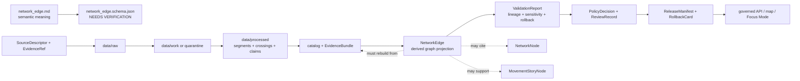

<!-- [KFM_META_BLOCK_V2]
doc_id: kfm://doc/contracts-domains-roads-rail-trade-network-edge
title: Network Edge Contract — Roads / Rail / Trade Routes
type: semantic-contract
version: v0.2
status: draft; PROPOSED; schema-missing; slug-CONFLICTED; graph-derived; NEEDS VERIFICATION before promotion
owners:
  - OWNER_TBD — Roads/Rail/Trade Routes domain steward
  - OWNER_TBD — Graph/analytics steward
  - OWNER_TBD — Roads steward
  - OWNER_TBD — Rail steward
  - OWNER_TBD — Historic/trade-routes steward
  - OWNER_TBD — Contracts steward
  - OWNER_TBD — Source steward
  - OWNER_TBD — Evidence steward
  - OWNER_TBD — Schema steward
  - OWNER_TBD — Policy steward
  - OWNER_TBD — Release steward
  - OWNER_TBD — Docs steward
created: NEEDS VERIFICATION — scaffold existed before v0.2 expansion
updated: 2026-06-23
policy_label: public; contracts; roads-rail-trade; network-edge; graph-projection; derived-read-model; evidence-bound; source-role-aware; temporal-scope-aware; sensitivity-inheriting; deterministic-derivation; rebuildable; rollback-aware; release-gated; not-canonical-truth; not-evidence-bundle; not-route-membership; not-live-routing; not-legal-access; not-publication-authority
tags: [kfm, contracts, roads-rail-trade, network-edge, network-node, graph-projection, route-membership, road-segment, rail-segment, crossing, bridge, ferry, corridor-route, freight-corridor, movement-story-node, EvidenceBundle, EvidenceRef, PolicyDecision, ReviewRecord, ReleaseManifest, RollbackCard, spec_hash, wasDerivedFrom]
related:
  - ./README.md
  - ./network_node.md
  - ./route_membership.md
  - ./road_segment.md
  - ./rail_segment.md
  - ./crossing.md
  - ./bridge.md
  - ./ferry.md
  - ./river_crossing.md
  - ./corridor_route.md
  - ./freight_corridor.md
  - ./trade_route_corridor.md
  - ./historic_route_claim.md
  - ./movement_story_node.md
  - ./domain_observation.md
  - ./domain_feature_identity.md
  - ./domain_validation_report.md
  - ./domain_layer_descriptor.md
  - ../roads/README.md
  - ../../../docs/domains/roads-rail-trade/README.md
  - ../../../docs/domains/roads-rail-trade/CANONICAL_PATHS.md
  - ../../../docs/domains/roads-rail-trade/OBJECT_FAMILIES.md
  - ../../../docs/domains/roads-rail-trade/IDENTITY_MODEL.md
  - ../../../docs/domains/roads-rail-trade/DATA_LIFECYCLE.md
  - ../../../docs/domains/roads-rail-trade/GRAPH_PROJECTIONS.md
  - ../../../docs/domains/roads-rail-trade/MAP_UI_CONTRACTS.md
  - ../../../docs/runbooks/roads-rail-trade/PROMOTION_RUNBOOK.md
  - ../../../docs/runbooks/roads-rail-trade/ROLLBACK_RUNBOOK.md
  - ../../../schemas/contracts/v1/domains/roads-rail-trade/network_edge.schema.json
  - ../../../policy/domains/roads-rail-trade/
  - ../../../fixtures/domains/roads-rail-trade/network_edge/
  - ../../../tests/domains/roads-rail-trade/
  - ../../../release/candidates/roads-rail-trade/
notes:
  - "Expanded from a PROPOSED scaffold at contracts/domains/roads-rail-trade/network_edge.md."
  - "A paired schema at schemas/contracts/v1/domains/roads-rail-trade/network_edge.schema.json was not found in this task. Field realization remains PROPOSED."
  - "Graph-projection doctrine states that Network Edge is a derived projection object built from Road/Rail Segments and EvidenceBundles. EvidenceBundle outranks the graph projection."
  - "The lifecycle doc places network edges in the CATALOG/TRIPLET phase as derived graph projections. Published graph views must be rebuildable or revertible without rewriting canonical segment records."
  - "This contract defines the semantic meaning of a network edge. It does not define graph runtime storage, routing algorithms, live navigation, route legality, segment truth, EvidenceBundle truth, public API shape, map rendering, or publication approval."
  - "The Roads / Rail / Trade Routes docs record a slug conflict between roads-rail-trade and transport for contract/schema homes. This file preserves the observed requested path and does not resolve the ADR question."
[/KFM_META_BLOCK_V2] -->

<a id="top"></a>

# Network Edge Contract — Roads / Rail / Trade Routes

> Semantic contract for `network_edge`: the derived graph-projection object that represents a traversable or interpretive connection between two Network Nodes, built from resolved evidence and released/catalog-closed transport objects — without becoming canonical route truth, segment truth, live routing authority, legal access authority, EvidenceBundle truth, or publication approval.

<p>
  
  
  
  
  
  
  
</p>

`contracts/domains/roads-rail-trade/network_edge.md`

## Quick jumps

[Status](#status) · [Meaning](#meaning) · [Repo fit](#repo-fit) · [Schema posture](#schema-posture) · [Accepted uses](#accepted-uses) · [Exclusions](#exclusions) · [Recommended fields](#recommended-fields) · [Invariants](#invariants) · [Network edge families](#network-edge-families) · [Derivation rules](#derivation-rules) · [Sensitivity and release posture](#sensitivity-and-release-posture) · [Lifecycle](#lifecycle) · [Validation](#validation) · [Rollback](#rollback) · [Evidence basis](#evidence-basis) · [Open questions](#open-questions)

---

## Status

> [!IMPORTANT]
> **Status:** `draft` / semantic contract  
> **Owner:** `OWNER_TBD`  
> **Contract path:** `contracts/domains/roads-rail-trade/network_edge.md`  
> **Schema path:** `schemas/contracts/v1/domains/roads-rail-trade/network_edge.schema.json` — **not found in this task**  
> **Truth posture:** target path and prior scaffold are confirmed from current repo evidence. `Network Edge` is confirmed as a Roads / Rail / Trade Routes graph-projection object term. Exact schema fields, validator behavior, fixture coverage, policy behavior, source registry behavior, release manifests, emitted proofs, public API behavior, map rendering, graph runtime behavior, and route/routing behavior remain **NEEDS VERIFICATION**.

> [!CAUTION]
> This contract defines network-edge meaning only. It does **not** prove a route is legally accessible, currently passable, safe, active, public, optimal, navigable, or published. It does not authorize live routing, emergency routing, logistics routing, graph runtime storage, map/API behavior, or publication approval.

---

## Meaning

`network_edge` records the semantic meaning of a derived transport-graph connection in Roads / Rail / Trade Routes.

It may represent that released or catalog-closed evidence supports a connection between two `NetworkNode` records through one or more underlying transport objects, such as:

- `Road Segment` evidence or released road derivatives;
- `Rail Segment` evidence or released rail derivatives;
- `Crossing`, `Bridge`, `Ferry`, or `River Crossing` relations;
- `CorridorRoute` or `RouteMembership` context;
- `Freight Corridor` context;
- `HistoricRouteClaim`, `TradeRouteCorridor`, or generalized historic/trade-route projections;
- released map-layer context or Focus Mode movement-story context.

A network edge is a **graph read-model element**. It answers a bounded question: what connection can be projected from evidence, at what time, from which sources, with what source role, sensitivity, uncertainty, release state, and rollback target? It is not the evidence itself, not the road/rail segment itself, not a route designation, not a legal access claim, and not a live routing instruction.

---

## Repo fit

| Responsibility | Path or root | Relationship |
|---|---|---|
| Parent contract lane | `./README.md` | Defines this folder as semantic contracts only. |
| Network node companion | `./network_node.md` | Edge endpoints; node file remains scaffold in current evidence. |
| Route membership companion | `./route_membership.md` | Segment-to-route relationship; edge does not replace membership. |
| Segment contracts | `./road_segment.md`, `./rail_segment.md` | Edge derives from segment evidence, not vice versa. |
| Crossing/facility contracts | `./crossing.md`, `./bridge.md`, `./ferry.md`, `./river_crossing.md` | Edge may cite crossing/facility relations; each keeps its own semantics. |
| Corridor contracts | `./corridor_route.md`, `./freight_corridor.md`, `./trade_route_corridor.md`, `./historic_route_claim.md` | Edge may support corridor views, but corridor/claim meaning remains separate. |
| Movement story node | `./movement_story_node.md` | Narrative node may cite edges; narrative remains downstream. |
| Graph doctrine | `../../../docs/domains/roads-rail-trade/GRAPH_PROJECTIONS.md` | Governs graph as derived, rebuildable, rollbackable projection over EvidenceBundles. |
| Data lifecycle | `../../../docs/domains/roads-rail-trade/DATA_LIFECYCLE.md` | Places graph projections at CATALOG/TRIPLET and public graph views behind release gates. |
| Schemas | `../../../schemas/contracts/v1/domains/roads-rail-trade/` or ADR-selected alternate | Machine shape; paired schema missing in this task. |
| Policy | `../../../policy/domains/roads-rail-trade/` or ADR-selected alternate | Allow/deny/restrict/abstain decisions and sensitivity inheritance. |
| Fixtures/tests | `../../../fixtures/domains/roads-rail-trade/`, `../../../tests/domains/roads-rail-trade/` | Behavior proof; not contract prose. |
| Release/rollback | `../../../release/candidates/roads-rail-trade/` and release roots | Promotion, release, correction, graph rebuild, and rollback. |

---

## Schema posture

A direct paired schema was checked at:

```text
schemas/contracts/v1/domains/roads-rail-trade/network_edge.schema.json
```

That file was **not found** in this task.

> [!WARNING]
> Because no paired schema was confirmed, every field below is **PROPOSED** semantic guidance. Do not treat it as machine-enforced until schema, fixtures, validator, policy tests, graph derivation code, source registry records, release checks, governed API behavior, and runtime behavior are verified.

---

## Accepted uses

| Use | Allowed? | Rule |
|---|---:|---|
| Defining derived transport-graph edge semantics | Yes | Must cite EvidenceBundle/EvidenceRef lineage and preserve source role, time, sensitivity, and rollback target. |
| Supporting derived graph/connectivity views | Yes | Public use requires governed API, release manifest, policy/review state, and rollback path. |
| Supporting route membership or corridor exploration | Conditional | Edge can be used as graph context, but does not replace route membership or corridor truth. |
| Supporting Focus Mode movement explanations | Conditional | Narrative must cite evidence; edge remains derived and rollbackable. |
| Modeling candidate connectivity for review | Conditional | Candidate/review-only edges must not render publicly or imply released connectivity. |
| Rebuilding graph from catalog-closed evidence | Yes | Deterministic rebuild is required for rollback and correction. |
| Proving legal access, safety, passability, ownership, active service, or live status | No | Requires separate authoritative evidence, policy, review, release, and often should abstain/deny. |
| Acting as canonical road/rail truth | No | EvidenceBundle and canonical segment/object records outrank the graph. |

---

## Exclusions

`network_edge` must not be used as:

| Misuse | Required outcome |
|---|---|
| Canonical truth store | Use canonical evidence-backed domain objects and EvidenceBundle. |
| EvidenceBundle replacement | Edge must cite EvidenceBundle; it is not evidence. |
| Road/Rail Segment replacement | Segment identity and attributes remain in segment contracts. |
| RouteMembership replacement | Route membership is a separate sourced, temporal relationship. |
| Live routing or navigation instruction | `DENY`; KFM graph is not live routing/safety infrastructure. |
| Legal access or public-road authority | `ABSTAIN` unless authoritative source and policy/release support exist. |
| Emergency detour, logistics, or operational guidance | `DENY` or restrict unless separately governed. |
| Sensitive-location laundering | Edge cannot lower the tier of its source evidence. |
| Publication approval | ReleaseManifest, ReviewRecord, PolicyDecision, correction path, and RollbackCard remain separate. |

---

## Recommended fields

The following fields are **PROPOSED** until a schema is added and validated.

| Field | Meaning |
|---|---|
| `id` | Canonical network-edge identifier. |
| `version` | Contract/object version. |
| `spec_hash` | Deterministic hash over normalized edge content. |
| `domain` | Expected value: `roads-rail-trade` unless ADR selects another slug. |
| `edge_kind` | Road, rail, crossing, ferry, bridge, corridor, historic, freight, candidate, derived, or source-specific edge type. |
| `from_node_ref` | Source/starting NetworkNode ref. |
| `to_node_ref` | Target/ending NetworkNode ref. |
| `directionality` | Directed, undirected, bidirectional, asymmetric, unknown, or source-specific. |
| `supporting_object_refs` | Road/Rail Segment, Crossing, Bridge, Ferry, CorridorRoute, RouteMembership, or other refs that support the edge. |
| `source_refs` | SourceDescriptor/source registry refs. |
| `source_role_summary` | Preserved source-role posture of supporting objects. |
| `evidence_refs` | EvidenceRefs or EvidenceBundle refs. |
| `was_derived_from` | Lineage refs back to catalog-closed evidence, receipts, and/or bundles. |
| `derivation_method_ref` | Graph derivation method or pipeline receipt ref. |
| `derivation_time` | Time the edge was derived. |
| `valid_time` | Time interval the edge is asserted to represent, if applicable. |
| `source_time` | Source publication/recording/update time of supporting evidence. |
| `retrieval_time` | KFM retrieval/freeze time of supporting evidence. |
| `release_time` | KFM governed release time, if released. |
| `weight_profile` | Optional graph weight/cost profile; not a routing recommendation by itself. |
| `access_profile_ref` | AccessRestriction or status refs, where separately supported. |
| `uncertainty_ref` | UncertaintySurface or uncertainty summary, especially for historic/generalized edges. |
| `sensitivity_label` | Sensitivity tier inherited from supporting evidence. |
| `generalization_ref` | Aggregation/generalization transform/receipt ref, if geometry is generalized. |
| `policy_decision_ref` | PolicyDecision governing use or publication. |
| `review_ref` | ReviewRecord or steward review ref. |
| `release_manifest_ref` | ReleaseManifest for public/semi-public exposure. |
| `rollback_ref` | RollbackCard or rollback target. |
| `limitations` | Caveats: edge is derived; not canonical truth, live routing, legal access, safety, evidence, or release authority. |

---

## Invariants

1. **Network edge is derived.** It is a read-model projection over EvidenceBundles and domain objects, not a root truth source.
2. **EvidenceBundle outranks the edge.** If edge state conflicts with evidence or canonical records, rebuild or roll back the edge.
3. **No evidence, no edge.** Unsupported connectivity must abstain, hold, or remain candidate-only.
4. **Source role is preserved.** Edges cannot upcast context/model/observation support into authority.
5. **Sensitivity is inherited.** Edge public tier cannot be lower-risk than the most restrictive supporting evidence without explicit policy transformation.
6. **Route membership stays separate.** Connectivity, route designation, and segment membership are different objects.
7. **Graph is rollbackable.** Published graph views must be rebuildable/revertible without rewriting canonical segment or evidence records.
8. **Edge is not live routing.** It does not imply passability, safety, legality, current operation, emergency detour, or routing suitability.
9. **Publication requires gates.** Public display requires EvidenceBundle, PolicyDecision, ReviewRecord, ReleaseManifest, correction path, and RollbackCard.

---

## Network edge families

| Edge family | Meaning | Special guardrail |
|---|---|---|
| `road_segment_edge` | Derived edge over road-segment evidence. | Not legal access or live routing authority. |
| `rail_segment_edge` | Derived edge over rail-segment evidence. | Operator/status/service remains separate and time-scoped. |
| `crossing_edge` | Derived connection through crossing, bridge, ferry, or river-crossing relation. | Crossing/facility/hydrology identity remains separately cited. |
| `route_membership_edge` | Edge used in route/corridor membership traversal. | Does not collapse membership, designation, and segment identity. |
| `freight_corridor_edge` | Edge used in freight/logistics corridor context. | Context is not commodity-flow proof or live logistics routing. |
| `historic_generalized_edge` | Generalized edge derived from historic/trade-route claims. | Requires uncertainty, generalization, review, and sensitivity handling. |
| `candidate_edge` | Model/graph/connector proposes connectivity for review. | Review-only; no public release without evidence/policy gates. |
| `released_graph_edge` | Edge included in a released derived graph view. | Requires release manifest and rollback target. |

---

## Derivation rules

| Rule | Requirement |
|---|---|
| Derive from catalog-closed support | Edge derivation reads resolved EvidenceBundle / catalog/triplet support, not raw source payloads. |
| Preserve lineage | Every edge must carry `wasDerivedFrom`, EvidenceRef/EvidenceBundle refs, and derivation receipt/method where available. |
| Preserve time | Source, valid, retrieval, derivation, release, and correction times remain distinct where material. |
| Preserve role | Authority, observation, context, model, candidate, administrative, and synthetic support remain visible. |
| Fail closed | Missing evidence, policy, review, release, or rollback support blocks publication. |
| Rebuild, do not patch truth | Corrected evidence triggers graph rebuild/rollback rather than manual graph edits as truth. |

---

## Sensitivity and release posture

| Surface | Default posture | Required support before public exposure |
|---|---|---|
| Modern public road/rail edge | Public-safe only when source/release support exists | EvidenceBundle, ValidationReport, PolicyDecision, ReviewRecord, ReleaseManifest, RollbackCard. |
| Facility/crossing edge | Depends on facility/hydrology/infrastructure sensitivity | Cross-lane EvidenceBundle refs and policy review. |
| Freight/logistics edge | Context-only, security-aware | Generalize/restrict proprietary or security-relevant logistics detail. |
| Historic/trade-route edge | Generalized and uncertainty-forward | UncertaintySurface, RedactionReceipt/AggregationReceipt, steward review, release, rollback. |
| Candidate/model edge | Review-only | No public surface until evidence closure and policy/release gates pass. |

---

## Lifecycle



Contracts describe meaning. They do not move data, validate schemas, execute graph derivation, define graph storage, run routing algorithms, make policy decisions, close evidence, perform review, publish artifacts, render maps, or authorize AI answers.

---

## Validation

Before this contract is treated as mature, maintainers should verify:

- [ ] the ADR-selected contract/schema slug and whether this file should remain under `contracts/domains/roads-rail-trade/` or migrate to `contracts/transport/`;
- [ ] paired schema exists and includes endpoint refs, edge kind, supporting object refs, source-role summary, evidence refs, derivation refs, time axes, sensitivity label, policy, review, release, and rollback refs;
- [ ] fixtures cover road edges, rail edges, crossing edges, route-membership edges, freight-corridor edges, historic generalized edges, candidate edges, and released graph edges;
- [ ] tests prove edges cannot exist without resolved EvidenceBundle/EvidenceRef support;
- [ ] tests prove source role and sensitivity tier are inherited from supporting evidence;
- [ ] tests prevent graph edges from replacing Road/Rail Segment, RouteMembership, CorridorRoute, EvidenceBundle, PolicyDecision, ReviewRecord, or ReleaseManifest objects;
- [ ] tests prevent graph edges from implying live routing, legal access, safety, passability, ownership, or operator status;
- [ ] tests prove graph projection rollback/rebuild invalidates derived layers, API payloads, exports, Focus Mode states, movement story nodes, caches, and AI summaries that cited the edge;
- [ ] public DTOs and map/Focus Mode payloads require EvidenceBundle, PolicyDecision, ReviewRecord, ReleaseManifest, correction path, and RollbackCard.

---

## Rollback

Rollback or correction is required when this contract:

- claims network-edge schema, graph derivation code, policy, fixtures, tests, source registry, lifecycle data, release, API, UI, graph runtime, or route behavior exists without proof;
- hides the `roads-rail-trade` vs `transport` slug conflict;
- treats graph edge state as canonical truth, evidence, route designation, live routing, legal access, safety, or publication approval;
- allows candidate/model/context edges to be displayed as released public connectivity without evidence and review;
- lowers sensitivity tiers or leaks sensitive historic/cultural/infrastructure/logistics detail through graph connectivity;
- fails to invalidate downstream graph views, layer descriptors, tile artifacts, API payloads, exports, Focus Mode states, movement story nodes, caches, or AI summaries after supporting evidence changes.

Rollback target: revert this file to prior scaffold blob SHA `8caafc44de8f270f7d582aa87c38aef1838e8d30`, record drift if authority boundaries were affected, and invalidate downstream derivatives that cited the weakened network-edge contract.

---

## Evidence basis

| Evidence | Status | Supports | Limit |
|---|---|---|---|
| Prior `contracts/domains/roads-rail-trade/network_edge.md` | `CONFIRMED` | Target file existed as a PROPOSED scaffold. | Scaffold did not define authoritative semantic contract content. |
| `schemas/contracts/v1/domains/roads-rail-trade/network_edge.schema.json` lookup | `CONFIRMED not found in this task` | Justifies `schema-missing` and PROPOSED field posture. | Does not rule out alternate schema homes such as `transport/`. |
| `docs/domains/roads-rail-trade/GRAPH_PROJECTIONS.md` | `CONFIRMED doctrine / PROPOSED implementation` | Graph is derived, not canonical; Network Edge is a projection object derived from Road/Rail Segments and EvidenceBundles; graph views must be rebuildable and rollbackable. | Implementation paths, schema names, validators, graph runtime, and API behavior remain NEEDS VERIFICATION. |
| `docs/domains/roads-rail-trade/DATA_LIFECYCLE.md` | `CONFIRMED doctrine / PROPOSED implementation` | Places network edges in CATALOG/TRIPLET graph projections and forbids direct public passthrough. | Does not prove schema, validator, runtime, or public API maturity. |
| `contracts/domains/roads-rail-trade/network_node.md` | `CONFIRMED sibling scaffold` | Confirms adjacent planned endpoint contract exists as scaffold. | Does not define Network Edge schema or mature node semantics. |
| Uploaded authoring prompt v2 | `CONFIRMED user-supplied guidance` | Requires evidence-grounded, visually polished, implementation-honest Markdown with verification and rollback posture. | Authoring guidance, not implementation proof. |

---

## Open questions

| ID | Question | Status |
|---|---|---|
| OQ-RRT-NE-01 | Should `network_edge.md` remain at `contracts/domains/roads-rail-trade/` or migrate to `contracts/transport/` after slug ADR resolution? | OPEN / ADR NEEDED |
| OQ-RRT-NE-02 | Which endpoint, derivation, source-role, sensitivity, and lineage fields are required by schemas and validators? | OPEN / SCHEMA REVIEW |
| OQ-RRT-NE-03 | What exact graph outcome enum distinguishes candidate, held, released, stale, rolled-back, and denied edges? | OPEN / GRAPH REVIEW |
| OQ-RRT-NE-04 | Which edge families may be public, generalized, restricted, or denied by default? | OPEN / POLICY REVIEW |
| OQ-RRT-NE-05 | How should graph edges cite EvidenceBundle and derivation receipts without becoming a second canonical store? | OPEN / EVIDENCE REVIEW |
| OQ-RRT-NE-06 | How should rollback invalidate published graph views, Focus Mode movement-story nodes, and AI summaries that cited an edge? | OPEN / RELEASE REVIEW |

<p align="right"><a href="#top">Back to top</a></p>
