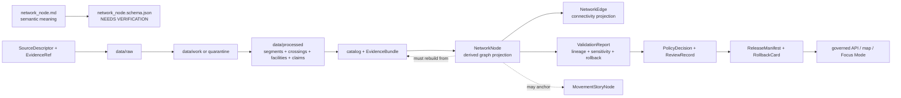

<!-- [KFM_META_BLOCK_V2]
doc_id: kfm://doc/contracts-domains-roads-rail-trade-network-node
title: Network Node Contract — Roads / Rail / Trade Routes
type: semantic-contract
version: v0.2
status: draft; PROPOSED; schema-missing; slug-CONFLICTED; graph-derived; NEEDS VERIFICATION before promotion
owners:
  - OWNER_TBD — Roads/Rail/Trade Routes domain steward
  - OWNER_TBD — Graph/analytics steward
  - OWNER_TBD — Roads steward
  - OWNER_TBD — Rail steward
  - OWNER_TBD — Historic/trade-routes steward
  - OWNER_TBD — Settlements/Infrastructure steward
  - OWNER_TBD — Hydrology steward
  - OWNER_TBD — Contracts steward
  - OWNER_TBD — Source steward
  - OWNER_TBD — Evidence steward
  - OWNER_TBD — Schema steward
  - OWNER_TBD — Policy steward
  - OWNER_TBD — Release steward
  - OWNER_TBD — Docs steward
created: NEEDS VERIFICATION — scaffold existed before v0.2 expansion
updated: 2026-06-23
policy_label: public; contracts; roads-rail-trade; network-node; graph-projection; derived-read-model; endpoint; junction; connection-point; evidence-bound; source-role-aware; temporal-scope-aware; sensitivity-inheriting; deterministic-derivation; rebuildable; rollback-aware; release-gated; not-canonical-place-truth; not-facility-truth; not-evidence-bundle; not-live-routing; not-legal-access; not-publication-authority
tags: [kfm, contracts, roads-rail-trade, network-node, network-edge, graph-projection, route-membership, road-segment, rail-segment, crossing, bridge, ferry, depot, yard, corridor-route, movement-story-node, EvidenceBundle, EvidenceRef, PolicyDecision, ReviewRecord, ReleaseManifest, RollbackCard, spec_hash, wasDerivedFrom]
related:
  - ./README.md
  - ./network_edge.md
  - ./route_membership.md
  - ./road_segment.md
  - ./rail_segment.md
  - ./crossing.md
  - ./bridge.md
  - ./ferry.md
  - ./river_crossing.md
  - ./depot.md
  - ./yard.md
  - ./siding.md
  - ./corridor_route.md
  - ./freight_corridor.md
  - ./trade_route_corridor.md
  - ./historic_route_claim.md
  - ./movement_story_node.md
  - ./domain_observation.md
  - ./domain_feature_identity.md
  - ./domain_validation_report.md
  - ./domain_layer_descriptor.md
  - ../roads/README.md
  - ../../../docs/domains/roads-rail-trade/README.md
  - ../../../docs/domains/roads-rail-trade/CANONICAL_PATHS.md
  - ../../../docs/domains/roads-rail-trade/OBJECT_FAMILIES.md
  - ../../../docs/domains/roads-rail-trade/IDENTITY_MODEL.md
  - ../../../docs/domains/roads-rail-trade/DATA_LIFECYCLE.md
  - ../../../docs/domains/roads-rail-trade/GRAPH_PROJECTIONS.md
  - ../../../docs/domains/roads-rail-trade/MAP_UI_CONTRACTS.md
  - ../../../docs/runbooks/roads-rail-trade/PROMOTION_RUNBOOK.md
  - ../../../docs/runbooks/roads-rail-trade/ROLLBACK_RUNBOOK.md
  - ../../../schemas/contracts/v1/domains/roads-rail-trade/network_node.schema.json
  - ../../../policy/domains/roads-rail-trade/
  - ../../../fixtures/domains/roads-rail-trade/network_node/
  - ../../../tests/domains/roads-rail-trade/
  - ../../../release/candidates/roads-rail-trade/
notes:
  - "Expanded from a PROPOSED scaffold at contracts/domains/roads-rail-trade/network_node.md."
  - "A paired schema at schemas/contracts/v1/domains/roads-rail-trade/network_node.schema.json was not found in this task. Field realization remains PROPOSED."
  - "Graph-projection doctrine states that Network Node is a derived projection object representing a connection point such as a junction, depot, crossing, or yard, derived from Road/Rail Segment endpoints, Crossings, Depots, and Yards."
  - "The lifecycle doc places graph projections in the CATALOG/TRIPLET phase. EvidenceBundle outranks any graph projection, and published graph views must be rebuildable or revertible without rewriting canonical segment records."
  - "This contract defines the semantic meaning of a network node. It does not define graph runtime storage, node-merging algorithms, canonical place/facility identity, legal access, segment truth, EvidenceBundle truth, public API shape, map rendering, or publication approval."
  - "The Roads / Rail / Trade Routes docs record a slug conflict between roads-rail-trade and transport for contract/schema homes. This file preserves the observed requested path and does not resolve the ADR question."
[/KFM_META_BLOCK_V2] -->

<a id="top"></a>

# Network Node Contract — Roads / Rail / Trade Routes

> Semantic contract for `network_node`: the derived graph-projection object that represents a connection point, junction, endpoint, crossing, depot/yard connector, or other transport-network node built from resolved evidence and catalog-closed transport objects — without becoming canonical place truth, facility truth, segment truth, live routing authority, legal access authority, EvidenceBundle truth, or publication approval.

<p>
  
  
  
  
  
  
  
</p>

`contracts/domains/roads-rail-trade/network_node.md`

## Quick jumps

[Status](#status) · [Meaning](#meaning) · [Repo fit](#repo-fit) · [Schema posture](#schema-posture) · [Accepted uses](#accepted-uses) · [Exclusions](#exclusions) · [Recommended fields](#recommended-fields) · [Invariants](#invariants) · [Network node families](#network-node-families) · [Derivation rules](#derivation-rules) · [Sensitivity and release posture](#sensitivity-and-release-posture) · [Lifecycle](#lifecycle) · [Validation](#validation) · [Rollback](#rollback) · [Evidence basis](#evidence-basis) · [Open questions](#open-questions)

---

## Status

> [!IMPORTANT]
> **Status:** `draft` / semantic contract  
> **Owner:** `OWNER_TBD`  
> **Contract path:** `contracts/domains/roads-rail-trade/network_node.md`  
> **Schema path:** `schemas/contracts/v1/domains/roads-rail-trade/network_node.schema.json` — **not found in this task**  
> **Truth posture:** target path and prior scaffold are confirmed from current repo evidence. `Network Node` is confirmed as a Roads / Rail / Trade Routes graph-projection object term. Exact schema fields, validator behavior, fixture coverage, policy behavior, source registry behavior, release manifests, emitted proofs, public API behavior, map rendering, graph runtime behavior, node-merging behavior, and route/routing behavior remain **NEEDS VERIFICATION**.

> [!CAUTION]
> This contract defines network-node meaning only. It does **not** prove a place, facility, junction, crossing, depot, yard, endpoint, route access point, public access point, or navigable/routable location exists as public truth. It does not authorize live routing, emergency routing, logistics routing, graph runtime storage, map/API behavior, or publication approval.

---

## Meaning

`network_node` records the semantic meaning of a derived transport-graph connection point in Roads / Rail / Trade Routes.

It may represent that released or catalog-closed evidence supports a graph endpoint or connection point derived from one or more underlying transport objects, such as:

- `Road Segment` endpoint, intersection, terminus, or junction evidence;
- `Rail Segment` endpoint, junction, switch-like relation, yard connector, siding connector, or terminus evidence;
- `Crossing`, `Bridge`, `Ferry`, or `River Crossing` relation evidence;
- `Depot`, `Yard`, `Siding`, or other transport facility context where that facility's canonical identity remains owned elsewhere when applicable;
- `CorridorRoute`, `RouteMembership`, `Freight Corridor`, `HistoricRouteClaim`, or `TradeRouteCorridor` context;
- released map-layer context or Focus Mode movement-story context.

A network node is a **graph read-model element**. It answers a bounded question: where does the derived graph need a connection point, at what time, from which evidence, with what source role, sensitivity, uncertainty, release state, and rollback target? It is not the evidence itself, not the canonical place/facility itself, not the segment itself, not a legal access point, and not a live routing instruction.

---

## Repo fit

| Responsibility | Path or root | Relationship |
|---|---|---|
| Parent contract lane | `./README.md` | Defines this folder as semantic contracts only. |
| Network edge companion | `./network_edge.md` | Edges connect nodes; the edge contract was expanded as a derived graph-projection contract. |
| Route membership companion | `./route_membership.md` | Segment-to-route relationship; node does not replace membership. |
| Segment contracts | `./road_segment.md`, `./rail_segment.md` | Node derives from segment endpoints/connectors, not vice versa. |
| Crossing/facility contracts | `./crossing.md`, `./bridge.md`, `./ferry.md`, `./river_crossing.md`, `./depot.md`, `./yard.md`, `./siding.md` | Node may cite crossing/facility relations; each keeps its own semantics and ownership boundary. |
| Corridor contracts | `./corridor_route.md`, `./freight_corridor.md`, `./trade_route_corridor.md`, `./historic_route_claim.md` | Node may support corridor views, but corridor/claim meaning remains separate. |
| Movement story node | `./movement_story_node.md` | Narrative node may cite graph nodes; narrative remains downstream. |
| Graph doctrine | `../../../docs/domains/roads-rail-trade/GRAPH_PROJECTIONS.md` | Governs graph as derived, rebuildable, rollbackable projection over EvidenceBundles. |
| Data lifecycle | `../../../docs/domains/roads-rail-trade/DATA_LIFECYCLE.md` | Places graph projections at CATALOG/TRIPLET and public graph views behind release gates. |
| Schemas | `../../../schemas/contracts/v1/domains/roads-rail-trade/` or ADR-selected alternate | Machine shape; paired schema missing in this task. |
| Policy | `../../../policy/domains/roads-rail-trade/` or ADR-selected alternate | Allow/deny/restrict/abstain decisions and sensitivity inheritance. |
| Fixtures/tests | `../../../fixtures/domains/roads-rail-trade/`, `../../../tests/domains/roads-rail-trade/` | Behavior proof; not contract prose. |
| Release/rollback | `../../../release/candidates/roads-rail-trade/` and release roots | Promotion, release, correction, graph rebuild, and rollback. |

---

## Schema posture

A direct paired schema was checked at:

```text
schemas/contracts/v1/domains/roads-rail-trade/network_node.schema.json
```

That file was **not found** in this task.

> [!WARNING]
> Because no paired schema was confirmed, every field below is **PROPOSED** semantic guidance. Do not treat it as machine-enforced until schema, fixtures, validator, policy tests, graph derivation code, source registry records, release checks, governed API behavior, and runtime behavior are verified.

---

## Accepted uses

| Use | Allowed? | Rule |
|---|---:|---|
| Defining derived transport-graph node semantics | Yes | Must cite EvidenceBundle/EvidenceRef lineage and preserve source role, time, sensitivity, and rollback target. |
| Supporting derived graph/connectivity views | Yes | Public use requires governed API, release manifest, policy/review state, and rollback path. |
| Representing segment endpoints or junctions for graph traversal | Conditional | Must be derived from evidence and not become canonical segment/place truth. |
| Representing crossing/facility connection points | Conditional | Must cite the owning crossing/facility evidence and not absorb canonical facility/place identity. |
| Supporting Focus Mode movement explanations | Conditional | Narrative must cite evidence; node remains derived and rollbackable. |
| Modeling candidate connection points for review | Conditional | Candidate/review-only nodes must not render publicly or imply released connectivity. |
| Proving legal access, safety, passability, ownership, active service, or live status | No | Requires separate authoritative evidence, policy, review, release, and often should abstain/deny. |
| Acting as canonical place/facility truth | No | EvidenceBundle and canonical owning-domain records outrank the graph node. |

---

## Exclusions

`network_node` must not be used as:

| Misuse | Required outcome |
|---|---|
| Canonical truth store | Use canonical evidence-backed domain objects and EvidenceBundle. |
| EvidenceBundle replacement | Node must cite EvidenceBundle; it is not evidence. |
| Place/facility canonical identity | Use Settlements/Infrastructure, Hydrology, Archaeology/Cultural Heritage, or other owning-domain records where applicable. |
| Road/Rail Segment replacement | Segment identity and attributes remain in segment contracts. |
| NetworkEdge replacement | Connectivity belongs in edge records; node is an endpoint/connection point. |
| Live routing or navigation instruction | `DENY`; KFM graph is not live routing/safety infrastructure. |
| Legal access or public-access authority | `ABSTAIN` unless authoritative source and policy/release support exist. |
| Sensitive-location laundering | Node cannot lower the tier of its source evidence or owning-domain object. |
| Publication approval | ReleaseManifest, ReviewRecord, PolicyDecision, correction path, and RollbackCard remain separate. |

---

## Recommended fields

The following fields are **PROPOSED** until a schema is added and validated.

| Field | Meaning |
|---|---|
| `id` | Canonical network-node identifier. |
| `version` | Contract/object version. |
| `spec_hash` | Deterministic hash over normalized node content. |
| `domain` | Expected value: `roads-rail-trade` unless ADR selects another slug. |
| `node_kind` | Junction, endpoint, terminus, crossing, depot connector, yard connector, siding connector, bridge connector, ferry connector, corridor anchor, candidate node, or source-specific node type. |
| `node_role` | Graph role: endpoint, intersection, transfer, crossing, facility connector, route anchor, story anchor, candidate, or released node. |
| `supporting_object_refs` | Road/Rail Segment, Crossing, Bridge, Ferry, Depot, Yard, Siding, CorridorRoute, RouteMembership, or other refs that support the node. |
| `connected_edge_refs` | NetworkEdge refs connected to this node, if materialized. |
| `source_refs` | SourceDescriptor/source registry refs. |
| `source_role_summary` | Preserved source-role posture of supporting objects. |
| `evidence_refs` | EvidenceRefs or EvidenceBundle refs. |
| `was_derived_from` | Lineage refs back to catalog-closed evidence, receipts, and/or bundles. |
| `derivation_method_ref` | Graph derivation method or pipeline receipt ref. |
| `derivation_time` | Time the node was derived. |
| `valid_time` | Time interval the node is asserted to represent, if applicable. |
| `source_time` | Source publication/recording/update time of supporting evidence. |
| `retrieval_time` | KFM retrieval/freeze time of supporting evidence. |
| `release_time` | KFM governed release time, if released. |
| `coordinate_ref` | Point/generalized coordinate reference; not public-safe location truth by itself. |
| `geometry_ref` | Optional node geometry/generalization ref. |
| `snap_rule_ref` | Derivation/snap/topology rule ref, if used. |
| `merge_rule_ref` | Node-merge/dedup rule ref, if used. |
| `uncertainty_ref` | UncertaintySurface or uncertainty summary, especially for historic/generalized nodes. |
| `sensitivity_label` | Sensitivity tier inherited from supporting evidence. |
| `generalization_ref` | Aggregation/generalization transform/receipt ref, if geometry is generalized. |
| `policy_decision_ref` | PolicyDecision governing use or publication. |
| `review_ref` | ReviewRecord or steward review ref. |
| `release_manifest_ref` | ReleaseManifest for public/semi-public exposure. |
| `rollback_ref` | RollbackCard or rollback target. |
| `limitations` | Caveats: node is derived; not canonical place/facility truth, live routing, legal access, safety, evidence, or release authority. |

---

## Invariants

1. **Network node is derived.** It is a read-model projection over EvidenceBundles and domain objects, not a root truth source.
2. **EvidenceBundle outranks the node.** If node state conflicts with evidence or canonical records, rebuild or roll back the node.
3. **No evidence, no node.** Unsupported connection points must abstain, hold, or remain candidate-only.
4. **Source role is preserved.** Nodes cannot upcast context/model/observation support into authority.
5. **Sensitivity is inherited.** Node public tier cannot be lower-risk than the most restrictive supporting evidence without explicit policy transformation.
6. **Facility/place truth stays separate.** Depots, yards, crossings, places, water features, archaeological sites, and cultural places keep their owning-domain semantics.
7. **Edges stay separate.** Nodes are connection points; traversability and connectivity belong in NetworkEdge records.
8. **Graph is rollbackable.** Published graph views must be rebuildable/revertible without rewriting canonical segment, facility, place, or evidence records.
9. **Node is not live routing.** It does not imply passability, safety, legality, current operation, emergency detour, or routing suitability.
10. **Publication requires gates.** Public display requires EvidenceBundle, PolicyDecision, ReviewRecord, ReleaseManifest, correction path, and RollbackCard.

---

## Network node families

| Node family | Meaning | Special guardrail |
|---|---|---|
| `road_junction_node` | Derived graph node at road intersection, endpoint, terminus, or connection. | Not legal access or live routing authority. |
| `rail_junction_node` | Derived graph node at rail endpoint, junction, yard/siding connector, or terminus. | Operator/status/service remains separate and time-scoped. |
| `crossing_node` | Derived node at crossing, bridge, ferry, ford, or river-crossing relation. | Crossing/facility/hydrology identity remains separately cited. |
| `facility_connector_node` | Derived node connected to depot, yard, siding, station, or facility context. | Facility canonical identity remains with owning contract/domain. |
| `corridor_anchor_node` | Node anchoring a corridor/route/trade-route/freight context. | Corridor/claim truth remains separate and cited. |
| `historic_generalized_node` | Generalized node derived from historic/trade-route claims. | Requires uncertainty, generalization, review, and sensitivity handling. |
| `candidate_node` | Model/graph/connector proposes a connection point for review. | Review-only; no public release without evidence/policy gates. |
| `released_graph_node` | Node included in a released derived graph view. | Requires release manifest and rollback target. |

---

## Derivation rules

| Rule | Requirement |
|---|---|
| Derive from catalog-closed support | Node derivation reads resolved EvidenceBundle / catalog/triplet support, not raw source payloads. |
| Preserve lineage | Every node must carry `wasDerivedFrom`, EvidenceRef/EvidenceBundle refs, and derivation receipt/method where available. |
| Preserve time | Source, valid, retrieval, derivation, release, and correction times remain distinct where material. |
| Preserve role | Authority, observation, context, model, candidate, administrative, and synthetic support remain visible. |
| Preserve ownership boundaries | Node derivation must not absorb place, facility, hydrology, archaeology, cultural, or land/title truth. |
| Fail closed | Missing evidence, policy, review, release, or rollback support blocks publication. |
| Rebuild, do not patch truth | Corrected evidence triggers graph rebuild/rollback rather than manual node edits as truth. |

---

## Sensitivity and release posture

| Surface | Default posture | Required support before public exposure |
|---|---|---|
| Modern public road/rail node | Public-safe only when source/release support exists | EvidenceBundle, ValidationReport, PolicyDecision, ReviewRecord, ReleaseManifest, RollbackCard. |
| Facility/crossing node | Depends on facility/hydrology/infrastructure sensitivity | Cross-lane EvidenceBundle refs and policy review. |
| Freight/logistics node | Context-only, security-aware | Generalize/restrict proprietary or security-relevant logistics detail. |
| Historic/trade-route node | Generalized and uncertainty-forward | UncertaintySurface, RedactionReceipt/AggregationReceipt, steward review, release, rollback. |
| Candidate/model node | Review-only | No public surface until evidence closure and policy/release gates pass. |

---

## Lifecycle



Contracts describe meaning. They do not move data, validate schemas, execute graph derivation, define graph storage, run routing algorithms, make policy decisions, close evidence, perform review, publish artifacts, render maps, or authorize AI answers.

---

## Validation

Before this contract is treated as mature, maintainers should verify:

- [ ] the ADR-selected contract/schema slug and whether this file should remain under `contracts/domains/roads-rail-trade/` or migrate to `contracts/transport/`;
- [ ] paired schema exists and includes node kind, node role, supporting object refs, connected edge refs, source-role summary, evidence refs, derivation refs, snap/merge rules, time axes, sensitivity label, policy, review, release, and rollback refs;
- [ ] fixtures cover road junction nodes, rail junction nodes, crossing nodes, facility connector nodes, corridor anchor nodes, historic generalized nodes, candidate nodes, and released graph nodes;
- [ ] tests prove nodes cannot exist without resolved EvidenceBundle/EvidenceRef support;
- [ ] tests prove source role and sensitivity tier are inherited from supporting evidence;
- [ ] tests prevent graph nodes from replacing Road/Rail Segment, Crossing, Depot/Yard, RouteMembership, CorridorRoute, EvidenceBundle, PolicyDecision, ReviewRecord, or ReleaseManifest objects;
- [ ] tests prevent graph nodes from implying live routing, legal access, safety, passability, ownership, operator status, or canonical place/facility identity;
- [ ] tests prove graph projection rollback/rebuild invalidates derived edges, layers, API payloads, exports, Focus Mode states, movement story nodes, caches, and AI summaries that cited the node;
- [ ] public DTOs and map/Focus Mode payloads require EvidenceBundle, PolicyDecision, ReviewRecord, ReleaseManifest, correction path, and RollbackCard.

---

## Rollback

Rollback or correction is required when this contract:

- claims network-node schema, graph derivation code, policy, fixtures, tests, source registry, lifecycle data, release, API, UI, graph runtime, or route behavior exists without proof;
- hides the `roads-rail-trade` vs `transport` slug conflict;
- treats graph node state as canonical truth, evidence, place/facility identity, live routing, legal access, safety, or publication approval;
- allows candidate/model/context nodes to be displayed as released public connectivity without evidence and review;
- lowers sensitivity tiers or leaks sensitive historic/cultural/infrastructure/logistics detail through graph endpoints;
- fails to invalidate downstream graph views, network edges, layer descriptors, tile artifacts, API payloads, exports, Focus Mode states, movement story nodes, caches, or AI summaries after supporting evidence changes.

Rollback target: revert this file to prior scaffold blob SHA `c87f8583aba590f7cac59b2ed98ad97d4aaa57b6`, record drift if authority boundaries were affected, and invalidate downstream derivatives that cited the weakened network-node contract.

---

## Evidence basis

| Evidence | Status | Supports | Limit |
|---|---|---|---|
| Prior `contracts/domains/roads-rail-trade/network_node.md` | `CONFIRMED` | Target file existed as a PROPOSED scaffold. | Scaffold did not define authoritative semantic contract content. |
| `schemas/contracts/v1/domains/roads-rail-trade/network_node.schema.json` lookup | `CONFIRMED not found in this task` | Justifies `schema-missing` and PROPOSED field posture. | Does not rule out alternate schema homes such as `transport/`. |
| `docs/domains/roads-rail-trade/GRAPH_PROJECTIONS.md` | `CONFIRMED doctrine / PROPOSED implementation` | Graph is derived, not canonical; Network Node is a projection object representing junctions, depots, crossings, and yards, derived from evidence. | Implementation paths, schema names, validators, graph runtime, and API behavior remain NEEDS VERIFICATION. |
| `docs/domains/roads-rail-trade/DATA_LIFECYCLE.md` | `CONFIRMED doctrine / PROPOSED implementation` | Places graph projections in CATALOG/TRIPLET and forbids direct public passthrough. | Does not prove schema, validator, runtime, or public API maturity. |
| `contracts/domains/roads-rail-trade/network_edge.md` | `CONFIRMED sibling contract` | Provides companion edge boundary: edges connect nodes and remain derived, rollbackable projections. | Does not prove network-node schema or runtime behavior. |
| Uploaded authoring prompt v2 | `CONFIRMED user-supplied guidance` | Requires evidence-grounded, visually polished, implementation-honest Markdown with verification and rollback posture. | Authoring guidance, not implementation proof. |

---

## Open questions

| ID | Question | Status |
|---|---|---|
| OQ-RRT-NN-01 | Should `network_node.md` remain at `contracts/domains/roads-rail-trade/` or migrate to `contracts/transport/` after slug ADR resolution? | OPEN / ADR NEEDED |
| OQ-RRT-NN-02 | Which endpoint, derivation, snap/merge, source-role, sensitivity, and lineage fields are required by schemas and validators? | OPEN / SCHEMA REVIEW |
| OQ-RRT-NN-03 | What exact graph outcome enum distinguishes candidate, held, released, stale, rolled-back, and denied nodes? | OPEN / GRAPH REVIEW |
| OQ-RRT-NN-04 | Which node families may be public, generalized, restricted, or denied by default? | OPEN / POLICY REVIEW |
| OQ-RRT-NN-05 | How should graph nodes cite EvidenceBundle and derivation receipts without becoming a second canonical place/facility store? | OPEN / EVIDENCE REVIEW |
| OQ-RRT-NN-06 | How should rollback invalidate published graph views, network edges, Focus Mode movement-story nodes, and AI summaries that cited a node? | OPEN / RELEASE REVIEW |

<p align="right"><a href="#top">Back to top</a></p>
