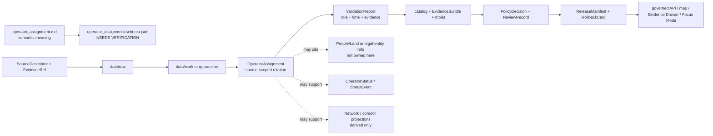

<!-- [KFM_META_BLOCK_V2]
doc_id: kfm://doc/contracts-domains-roads-rail-trade-operator-assignment
title: Operator Assignment Contract — Roads / Rail / Trade Routes
type: semantic-contract
version: v0.2
status: draft; PROPOSED; schema-missing; slug-CONFLICTED; operator-relation; NEEDS VERIFICATION before promotion
owners:
  - OWNER_TBD — Roads/Rail/Trade Routes domain steward
  - OWNER_TBD — Rail steward
  - OWNER_TBD — Roads steward
  - OWNER_TBD — Trade/logistics steward
  - OWNER_TBD — People/Land steward
  - OWNER_TBD — Contracts steward
  - OWNER_TBD — Source steward
  - OWNER_TBD — Evidence steward
  - OWNER_TBD — Schema steward
  - OWNER_TBD — Policy steward
  - OWNER_TBD — Release steward
  - OWNER_TBD — Docs steward
created: NEEDS VERIFICATION — scaffold existed before v0.2 expansion
updated: 2026-06-23
policy_label: public; contracts; roads-rail-trade; operator-assignment; operator-relation; owner-assignment; operational-control; source-role-aware; temporal-scope-aware; evidence-bound; legal-entity-boundary-aware; release-gated; rollback-aware; not-operator-status; not-legal-entity-truth; not-ownership-proof; not-title-record; not-current-service; not-publication-authority
tags: [kfm, contracts, roads-rail-trade, operator-assignment, OperatorAssignment, operator-status, rail-segment, road-segment, corridor-route, route-membership, freight-corridor, transport-facility, source-role, valid-time, EvidenceBundle, PolicyDecision, ReviewRecord, ReleaseManifest, RollbackCard, spec_hash]
related:
  - ./README.md
  - ./operator_status.md
  - ./road_segment.md
  - ./rail_segment.md
  - ./corridor_route.md
  - ./route_membership.md
  - ./freight_corridor.md
  - ./transport_facility.md
  - ./depot.md
  - ./yard.md
  - ./siding.md
  - ./route_event.md
  - ./status_event.md
  - ./access_restriction.md
  - ./domain_observation.md
  - ./domain_feature_identity.md
  - ./domain_validation_report.md
  - ./domain_layer_descriptor.md
  - ../roads/README.md
  - ../../../docs/domains/roads-rail-trade/README.md
  - ../../../docs/domains/roads-rail-trade/CANONICAL_PATHS.md
  - ../../../docs/domains/roads-rail-trade/OBJECT_FAMILIES.md
  - ../../../docs/domains/roads-rail-trade/IDENTITY_MODEL.md
  - ../../../docs/domains/roads-rail-trade/DATA_LIFECYCLE.md
  - ../../../docs/domains/roads-rail-trade/sublanes/rail.md
  - ../../../docs/domains/roads-rail-trade/GRAPH_PROJECTIONS.md
  - ../../../docs/domains/roads-rail-trade/MAP_UI_CONTRACTS.md
  - ../../../docs/runbooks/roads-rail-trade/PROMOTION_RUNBOOK.md
  - ../../../docs/runbooks/roads-rail-trade/ROLLBACK_RUNBOOK.md
  - ../../../schemas/contracts/v1/domains/roads-rail-trade/operator_assignment.schema.json
  - ../../../policy/domains/roads-rail-trade/
  - ../../../fixtures/domains/roads-rail-trade/operator_assignment/
  - ../../../tests/domains/roads-rail-trade/
  - ../../../release/candidates/roads-rail-trade/
notes:
  - "Expanded from a PROPOSED scaffold at contracts/domains/roads-rail-trade/operator_assignment.md."
  - "A paired schema at schemas/contracts/v1/domains/roads-rail-trade/operator_assignment.schema.json was not found in this task. Field realization remains PROPOSED."
  - "Object-family doctrine names OperatorAssignment as assignment of an operator/owner to a segment, line, or facility, with source id + object role + temporal scope + normalized digest as the PROPOSED identity basis."
  - "Rail sublane doctrine treats Operator Status / OperatorAssignment as rail-operator ownership and operational control over time, but explicitly leaves operator legal-entity facts to People/Land."
  - "This contract defines source-scoped operator assignment meaning. It does not prove legal ownership, corporate identity, title, jurisdiction, current service, active control, access rights, emergency status, or publication approval."
  - "The Roads / Rail / Trade Routes docs record a slug conflict between roads-rail-trade and transport for contract/schema homes. This file preserves the observed requested path and does not resolve the ADR question."
[/KFM_META_BLOCK_V2] -->

<a id="top"></a>

# Operator Assignment Contract — Roads / Rail / Trade Routes

> Semantic contract for `operator_assignment`: the source-scoped, time-aware assertion that an operator, owner, jurisdiction, railroad, agency, or operating party is assigned to a road segment, rail segment, line, corridor, route membership, facility, or freight/logistics context — without becoming legal-entity truth, title proof, corporate registry truth, operator status, current service authority, legal access authority, or publication approval.

<p>
  
  
  
  
  
  
  
</p>

`contracts/domains/roads-rail-trade/operator_assignment.md`

## Quick jumps

[Status](#status) · [Meaning](#meaning) · [Repo fit](#repo-fit) · [Schema posture](#schema-posture) · [Accepted uses](#accepted-uses) · [Exclusions](#exclusions) · [Recommended fields](#recommended-fields) · [Invariants](#invariants) · [Operator assignment families](#operator-assignment-families) · [Source-role and time rules](#source-role-and-time-rules) · [Lifecycle](#lifecycle) · [Validation](#validation) · [Rollback](#rollback) · [Evidence basis](#evidence-basis) · [Open questions](#open-questions)

---

## Status

> [!IMPORTANT]
> **Status:** `draft` / semantic contract  
> **Owner:** `OWNER_TBD`  
> **Contract path:** `contracts/domains/roads-rail-trade/operator_assignment.md`  
> **Schema path:** `schemas/contracts/v1/domains/roads-rail-trade/operator_assignment.schema.json` — **not found in this task**  
> **Truth posture:** target path and prior scaffold are confirmed from current repo evidence. `OperatorAssignment` is confirmed as a Roads / Rail / Trade Routes object-family term in the object-family dossier, and as a rail-specific realization in the rail sublane. Exact schema fields, validator behavior, fixture coverage, policy behavior, source registry behavior, release manifests, emitted proofs, public API behavior, map rendering, operator/legal-entity behavior, and runtime behavior remain **NEEDS VERIFICATION**.

> [!CAUTION]
> This contract defines operator-assignment meaning only. It does **not** prove corporate identity, ownership/title, jurisdiction, legal access, active service, current operations, emergency condition, public routing, map/API behavior, or publication approval.

---

## Meaning

`operator_assignment` records a source-scoped assignment relation between a transport object and an operator-like party.

It may represent that a source asserts an operator, owner, agency, railroad, jurisdiction, line operator, maintaining party, franchise holder, or administrative authority is associated with:

- a `Rail Segment`, `Road Segment`, line, branch, route, corridor, or segment group;
- a `CorridorRoute`, `RouteMembership`, `Freight Corridor`, or trade/logistics corridor context;
- a `Depot`, `Yard`, `Siding`, station, crossing, bridge, ferry, or other `TransportFacility` relation;
- an `OperatorStatus`, `StatusEvent`, `RouteEvent`, or `AccessRestriction` record where the assignment is time-bound;
- released map context, Evidence Drawer context, Focus Mode context, or graph projections that cite the assignment as evidence.

The operator assignment contract owns the **transport-side assignment relation**: what source says which party is associated with which transport object, during what time scope, with what source role, evidence, policy posture, review state, release state, and rollback target. It does not own the legal identity of the operator, company registry status, land/title facts, corporate succession, ownership proof, current service status, operational safety, or public access authority.

---

## Repo fit

| Responsibility | Path or root | Relationship |
|---|---|---|
| Parent contract lane | `./README.md` | Defines this folder as semantic contracts only. |
| Operator status companion | `./operator_status.md` | Status/condition over time remains separate from assignment relation. |
| Segment contracts | `./road_segment.md`, `./rail_segment.md` | Assignment may attach to segments; it does not define segment truth. |
| Route/corridor contracts | `./corridor_route.md`, `./route_membership.md`, `./freight_corridor.md` | Assignment may attach to route/corridor context without becoming route membership. |
| Facility contracts | `./transport_facility.md`, `./depot.md`, `./yard.md`, `./siding.md` | Assignment may cite facilities, but facility identity remains separate and often settlement/infrastructure-owned. |
| Event/restriction contracts | `./route_event.md`, `./status_event.md`, `./access_restriction.md` | Time-bound status/restriction events remain separate. |
| Observation/identity/validation | `./domain_observation.md`, `./domain_feature_identity.md`, `./domain_validation_report.md` | Assignment depends on source/evidence/identity/validation posture but does not replace them. |
| Object families | `../../../docs/domains/roads-rail-trade/OBJECT_FAMILIES.md` | Names OperatorAssignment and its PROPOSED identity basis. |
| Rail sublane | `../../../docs/domains/roads-rail-trade/sublanes/rail.md` | Places OperatorAssignment in rail operator/control context while leaving legal-entity truth outside this lane. |
| Schemas | `../../../schemas/contracts/v1/domains/roads-rail-trade/` or ADR-selected alternate | Machine shape; paired schema missing in this task. |
| Policy | `../../../policy/domains/roads-rail-trade/` or ADR-selected alternate | Allow/deny/restrict/abstain decisions. |
| Fixtures/tests | `../../../fixtures/domains/roads-rail-trade/`, `../../../tests/domains/roads-rail-trade/` | Behavior proof; not contract prose. |
| Release/rollback | `../../../release/candidates/roads-rail-trade/` and release roots | Promotion, release, correction, rollback, and derivative invalidation. |

---

## Schema posture

A direct paired schema was checked at:

```text
schemas/contracts/v1/domains/roads-rail-trade/operator_assignment.schema.json
```

That file was **not found** in this task.

> [!WARNING]
> Because no paired schema was confirmed, every field below is **PROPOSED** semantic guidance. Do not treat it as machine-enforced until schema, fixtures, validator, policy tests, source registry records, release checks, governed API behavior, and runtime behavior are verified.

---

## Accepted uses

| Use | Allowed? | Rule |
|---|---:|---|
| Recording a source-scoped operator/owner assignment relation | Yes | Must preserve source, source role, assigned object, assignment role, temporal scope, evidence, and limitations. |
| Linking an operator-like party to a segment, line, corridor, or facility | Yes | Use refs; do not embed operator legal identity or facility truth. |
| Supporting operator status or route event context | Conditional | Status/event semantics remain in separate contracts and valid-time records. |
| Supporting rail operator/control history | Conditional | Must preserve time, source role, and legal-entity boundary. |
| Supporting map/Focus Mode/Evidence Drawer display | Conditional | Requires EvidenceBundle, PolicyDecision, ReviewRecord, ReleaseManifest, correction path, and RollbackCard. |
| Supporting graph/corridor projections | Conditional | Assignment may be cited by graph or corridor projections but remains source-scoped. |
| Proving legal ownership, title, corporate identity, or current operational control | No | Requires separate legal/entity/title evidence and policy review; often People/Land-owned. |
| Acting as current service, safety, or public access authority | No | Requires separate governed source and fail-closed policy posture. |

---

## Exclusions

`operator_assignment` must not be used as:

| Misuse | Required outcome |
|---|---|
| Operator legal-entity truth | Cite People/Land, corporate registry, legal source, or other owning-domain record. |
| Ownership or title proof | `ABSTAIN` unless legal/title authority and policy/release support exist. |
| OperatorStatus replacement | Use `operator_status.md` or status/event records for active/inactive/operational state. |
| Current service authority | `ABSTAIN` unless current authoritative source and release state support it. |
| Public access or legal routing authority | `ABSTAIN`/`DENY`; access belongs to separate authoritative and policy-reviewed records. |
| Facility canonical identity | Use Settlements/Infrastructure or facility contracts. |
| Segment or corridor identity | Segment, CorridorRoute, and RouteMembership contracts remain separate. |
| Public API/map payload by itself | Use governed API/released artifacts only. |
| Publication approval | ReleaseManifest, ReviewRecord, PolicyDecision, correction path, and RollbackCard remain separate. |

---

## Recommended fields

The following fields are **PROPOSED** until a schema is added and validated.

| Field | Meaning |
|---|---|
| `id` | Canonical operator-assignment identifier. |
| `version` | Contract/object version. |
| `spec_hash` | Deterministic hash over normalized assignment content. |
| `domain` | Expected value: `roads-rail-trade` unless ADR selects another slug. |
| `assignment_type` | Owner, operator, maintainer, jurisdiction, railroad, concession/franchise, administrative assignment, candidate assignment, or source-specific type. |
| `assignment_role` | Role asserted by the source, such as owner, operator, lessee, maintainer, controller, dispatching party, agency, or historical operator. |
| `assigned_object_ref` | Segment, corridor, route membership, facility, crossing, or event object ref receiving the assignment. |
| `assigned_object_family` | Object family being assigned: Rail Segment, Road Segment, CorridorRoute, TransportFacility, etc. |
| `operator_ref` | Operator/legal-entity/source-party ref, when available and policy-safe. |
| `operator_label` | Source-stated operator name or label. Not sufficient legal-entity truth. |
| `operator_source_id` | Source-native operator or carrier ID, if present and safe. |
| `source_ref` | SourceDescriptor/source registry reference. |
| `source_role` | Accepted source role; must be preserved from admission through publication. |
| `source_native_id` | Source-native assignment, line, facility, segment, or roster ID. |
| `evidence_refs` | EvidenceRefs or EvidenceBundle refs. |
| `assignment_statement` | Source-scoped statement being preserved. |
| `valid_time` | Interval during which the assignment is asserted to apply. |
| `source_time` | Source creation, publication, roster, timetable, map, filing, or update time. |
| `retrieval_time` | KFM retrieval/freeze time. |
| `release_time` | KFM governed release time, if released. |
| `supersedes_ref` | Prior assignment superseded by this record, if any. |
| `superseded_by_ref` | Later assignment replacing this one, if any. |
| `operator_status_ref` | OperatorStatus or StatusEvent ref, where separate status evidence exists. |
| `route_event_ref` | RouteEvent ref, if assignment is connected to designation, transfer, abandonment, merger, or other event. |
| `policy_decision_ref` | PolicyDecision governing use or publication. |
| `review_ref` | ReviewRecord or steward review ref. |
| `release_manifest_ref` | ReleaseManifest for public/semi-public exposure. |
| `rollback_ref` | RollbackCard or rollback target. |
| `limitations` | Caveats: assignment relation only; not legal-entity truth, ownership proof, title, current service, legal access, segment truth, or release authority. |

---

## Invariants

1. **Assignment is a relation, not legal truth.** It records a source-scoped relationship between a party label/ref and a transport object.
2. **Legal-entity truth stays outside.** Company identity, title, corporate succession, land ownership, and legal registry status require owning-domain/source support.
3. **Assignment is not status.** Active/inactive, operating, abandoned, embargoed, leased, or current-service state belongs in `OperatorStatus`, `StatusEvent`, `RouteEvent`, or restriction records.
4. **Assignment is time-aware.** Source time, valid time, retrieval time, release time, and correction time remain distinct where material.
5. **Source role is preserved.** Rosters, maps, timetables, legal filings, local histories, and model outputs do not collapse into one authority posture.
6. **Assignment does not own target identity.** Segment, corridor, facility, crossing, and route identities remain in their own contracts/domains.
7. **No assignment without evidence.** Public-facing assignment claims require EvidenceBundle resolution and citation support.
8. **Publication requires gates.** Public display requires EvidenceBundle, PolicyDecision, ReviewRecord, ReleaseManifest, correction path, and RollbackCard.

---

## Operator assignment families

| Assignment family | Meaning | Special guardrail |
|---|---|---|
| `rail_operator_assignment` | Source asserts railroad/operator association with segment, line, corridor, yard, siding, depot, or facility. | Not current service or legal ownership proof by itself. |
| `road_jurisdiction_assignment` | Source asserts agency/jurisdiction/maintainer relation to road segment or corridor. | Administrative assignment is not access/legal status unless supported. |
| `maintainer_assignment` | Source asserts maintenance or responsibility relation. | Maintenance role does not prove owner/operator/legal access. |
| `facility_operator_assignment` | Source asserts operator relation to depot, yard, siding, station, crossing, bridge, or facility. | Facility identity remains separate and may be settlement/infrastructure-owned. |
| `corridor_operator_assignment` | Source asserts operator/owner/control relation to a route/corridor. | CorridorRoute/RouteMembership semantics remain separate. |
| `historic_operator_assignment` | Historical source asserts past operator, predecessor, railroad, agency, or owner relation. | Preserve uncertainty and avoid current-status wording. |
| `candidate_operator_assignment` | OCR, map label, model, graph, or connector proposes assignment. | Candidate until reviewed; no public truth without evidence and policy gates. |
| `supersession_assignment` | Assignment replaces or is replaced by another time-scoped assignment. | Preserve supersession lineage and rollback impact. |

---

## Source-role and time rules

Operator-assignment records must carry source role and time as core meaning.

| Rule | Requirement |
|---|---|
| Source role is fixed at admission | Promotion never turns an administrative roster, local history note, map label, OCR hit, or model output into legal/operator truth. |
| Operator label is not legal identity | Source-stated names and abbreviations require separate identity resolution before being treated as legal entities. |
| Assignment valid time is distinct | The period asserted by the source, source publication time, KFM retrieval time, review time, and release time are separate. |
| Assignment is distinct from status | An assignment may exist while service/status changes; status requires separate records. |
| Cross-lane evidence stays cited | People/Land, Settlements/Infrastructure, hazards, legal/title, or corporate-registry evidence is cited through governed refs, not absorbed. |
| Release time is explicit | Public display must cite the release artifact and rollback target. |

---

## Lifecycle



Contracts describe meaning. They do not move data, validate schemas, execute source reconciliation, make policy decisions, close evidence, perform review, publish artifacts, render maps, prove corporate identity, prove legal ownership, or authorize AI answers.

---

## Validation

Before this contract is treated as mature, maintainers should verify:

- [ ] the ADR-selected contract/schema slug and whether this file should remain under `contracts/domains/roads-rail-trade/` or migrate to `contracts/transport/`;
- [ ] paired schema exists and includes assignment type, role, assigned object ref, operator ref/label, source role, time axes, evidence, policy, review, release, and rollback refs;
- [ ] fixtures cover rail operator assignments, road jurisdiction assignments, maintainer assignments, facility operator assignments, corridor operator assignments, historic assignments, candidate assignments, and supersession assignments;
- [ ] tests prevent operator labels from becoming legal-entity truth without owning-domain evidence;
- [ ] tests prevent assignments from replacing OperatorStatus, StatusEvent, RouteEvent, AccessRestriction, segment identity, route membership, facility identity, or EvidenceBundle;
- [ ] tests preserve source role and time distinctions across rosters, maps, timetables, filings, OCR/model candidates, and historical sources;
- [ ] public DTOs and map/Focus Mode payloads require EvidenceBundle, PolicyDecision, ReviewRecord, ReleaseManifest, correction path, and RollbackCard;
- [ ] rollback invalidates derived layer descriptors, graph projections, API payloads, exports, Focus Mode states, movement story nodes, caches, and AI summaries that cited the assignment.

---

## Rollback

Rollback or correction is required when this contract:

- claims operator-assignment schema, policy, fixtures, tests, source registry, lifecycle data, release, API, UI, graph, legal-entity, or runtime behavior exists without proof;
- hides the `roads-rail-trade` vs `transport` slug conflict;
- treats assignment as legal-entity truth, ownership proof, title, current service status, public access, route legality, or publication approval;
- lets an administrative roster, map label, OCR hit, history note, or modeled output become authoritative operator truth without evidence and review;
- collapses assignment, operator status, segment identity, facility identity, route membership, or legal entity into one object;
- publishes or renders unsupported operator assignments through maps, graph views, Focus Mode, exports, or AI narrative.

Rollback target: revert this file to prior scaffold blob SHA `3f7bbf21d4e358e89cd1508a7960363540372cbe`, record drift if authority boundaries were affected, and invalidate downstream derivatives that cited the weakened operator-assignment contract.

---

## Evidence basis

| Evidence | Status | Supports | Limit |
|---|---|---|---|
| Prior `contracts/domains/roads-rail-trade/operator_assignment.md` | `CONFIRMED` | Target file existed as a PROPOSED scaffold. | Scaffold did not define authoritative semantic contract content. |
| `schemas/contracts/v1/domains/roads-rail-trade/operator_assignment.schema.json` lookup | `CONFIRMED not found in this task` | Justifies `schema-missing` and PROPOSED field posture. | Does not rule out alternate schema homes such as `transport/`. |
| `docs/domains/roads-rail-trade/OBJECT_FAMILIES.md` | `CONFIRMED term / PROPOSED field realization` | Names `OperatorAssignment`, gives purpose as assignment of operator/owner to segment/line/facility, and places it in the source-role/time-aware object spine. | Field-level schema, validators, and runtime behavior remain NEEDS VERIFICATION. |
| `docs/domains/roads-rail-trade/sublanes/rail.md` | `CONFIRMED doctrine / PROPOSED rail-specific realization` | Places OperatorAssignment with rail operator/control over time and states legal-entity facts belong outside the rail sublane. | Does not prove schema, validator, runtime, or public API maturity. |
| `docs/domains/roads-rail-trade/IDENTITY_MODEL.md` | `CONFIRMED doctrine / PROPOSED field realization` | Supplies deterministic identity envelope and spec_hash convention used by transport objects. | Exact OperatorAssignment field set for the digest remains NEEDS VERIFICATION. |
| Uploaded authoring prompt v2 | `CONFIRMED user-supplied guidance` | Requires evidence-grounded, visually polished, implementation-honest Markdown with verification and rollback posture. | Authoring guidance, not implementation proof. |

---

## Open questions

| ID | Question | Status |
|---|---|---|
| OQ-RRT-OA-01 | Should `operator_assignment.md` remain at `contracts/domains/roads-rail-trade/` or migrate to `contracts/transport/` after slug ADR resolution? | OPEN / ADR NEEDED |
| OQ-RRT-OA-02 | Which assignment types and roles are canonical across road, rail, freight, facility, and historic contexts? | OPEN / SCHEMA REVIEW |
| OQ-RRT-OA-03 | Which operator identifiers may be public, and which require People/Land or legal-entity policy controls? | OPEN / POLICY REVIEW |
| OQ-RRT-OA-04 | What evidence threshold distinguishes source-stated operator assignment from verified legal ownership or active operational control? | OPEN / EVIDENCE REVIEW |
| OQ-RRT-OA-05 | How should supersession, merger, abandonment, lease, trackage-rights, and jurisdiction changes be modeled without collapsing status and assignment? | OPEN / DOMAIN REVIEW |
| OQ-RRT-OA-06 | How should rollback invalidate graph, map, Focus Mode, exports, and AI summaries that cited a withdrawn assignment? | OPEN / RELEASE REVIEW |

<p align="right"><a href="#top">Back to top</a></p>
