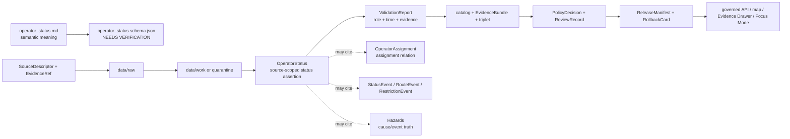

<!-- [KFM_META_BLOCK_V2]
doc_id: kfm://doc/contracts-domains-roads-rail-trade-operator-status
title: Operator Status Contract — Roads / Rail / Trade Routes
type: semantic-contract
version: v0.2
status: draft; PROPOSED; schema-missing; slug-CONFLICTED; operator-status; NEEDS VERIFICATION before promotion
owners:
  - OWNER_TBD — Roads/Rail/Trade Routes domain steward
  - OWNER_TBD — Rail steward
  - OWNER_TBD — Roads steward
  - OWNER_TBD — Trade/logistics steward
  - OWNER_TBD — Hazards steward
  - OWNER_TBD — People/Land steward
  - OWNER_TBD — Contracts steward
  - OWNER_TBD — Source steward
  - OWNER_TBD — Evidence steward
  - OWNER_TBD — Schema steward
  - OWNER_TBD — Policy steward
  - OWNER_TBD — Release steward
  - OWNER_TBD — Docs steward
created: NEEDS VERIFICATION — scaffold existed before v0.2 expansion
updated: 2026-06-23
policy_label: public; contracts; roads-rail-trade; operator-status; operational-control-status; operator-jurisdiction-status; status-event-adjacent; source-role-aware; temporal-scope-aware; evidence-bound; legal-entity-boundary-aware; hazard-boundary-aware; release-gated; rollback-aware; not-operator-assignment; not-legal-entity-truth; not-current-service-feed; not-safety-advice; not-live-routing; not-publication-authority
tags: [kfm, contracts, roads-rail-trade, operator-status, OperatorStatus, operator-assignment, status-event, route-event, access-restriction, restriction-event, rail-segment, road-segment, corridor-route, route-membership, transport-facility, source-role, valid-time, EvidenceBundle, PolicyDecision, ReviewRecord, ReleaseManifest, RollbackCard, spec_hash]
related:
  - ./README.md
  - ./operator_assignment.md
  - ./status_event.md
  - ./route_event.md
  - ./access_restriction.md
  - ./restriction_event.md
  - ./road_segment.md
  - ./rail_segment.md
  - ./corridor_route.md
  - ./route_membership.md
  - ./freight_corridor.md
  - ./transport_facility.md
  - ./depot.md
  - ./yard.md
  - ./siding.md
  - ./domain_observation.md
  - ./domain_feature_identity.md
  - ./domain_validation_report.md
  - ./domain_layer_descriptor.md
  - ../roads/README.md
  - ../../../docs/domains/roads-rail-trade/README.md
  - ../../../docs/domains/roads-rail-trade/CANONICAL_PATHS.md
  - ../../../docs/domains/roads-rail-trade/OBJECT_FAMILIES.md
  - ../../../docs/domains/roads-rail-trade/IDENTITY_MODEL.md
  - ../../../docs/domains/roads-rail-trade/DATA_LIFECYCLE.md
  - ../../../docs/domains/roads-rail-trade/sublanes/rail.md
  - ../../../docs/domains/roads-rail-trade/GRAPH_PROJECTIONS.md
  - ../../../docs/domains/roads-rail-trade/MAP_UI_CONTRACTS.md
  - ../../../docs/runbooks/roads-rail-trade/PROMOTION_RUNBOOK.md
  - ../../../docs/runbooks/roads-rail-trade/ROLLBACK_RUNBOOK.md
  - ../../../schemas/contracts/v1/domains/roads-rail-trade/operator_status.schema.json
  - ../../../policy/domains/roads-rail-trade/
  - ../../../fixtures/domains/roads-rail-trade/operator_status/
  - ../../../tests/domains/roads-rail-trade/
  - ../../../release/candidates/roads-rail-trade/
notes:
  - "Expanded from a PROPOSED scaffold at contracts/domains/roads-rail-trade/operator_status.md."
  - "A paired schema at schemas/contracts/v1/domains/roads-rail-trade/operator_status.schema.json was not found in this task. Field realization remains PROPOSED."
  - "The domain README names Operator Status as an operator-jurisdiction assertion over a segment in time and notes Rail Segment operator status is separate."
  - "Object-family doctrine preserves source-role/time identity and warns against administrative-as-observed collapse; status/event records must remain distinct from administrative compilations."
  - "Rail sublane doctrine treats Operator Status / OperatorAssignment as rail-operator ownership and operational control over time, but explicitly leaves operator legal-entity facts to People/Land and hazard event truth to Hazards."
  - "This contract defines source-scoped operator status meaning. It does not prove legal ownership, corporate identity, active service, emergency condition, safety, legal access, live routing, or publication approval."
  - "The Roads / Rail / Trade Routes docs record a slug conflict between roads-rail-trade and transport for contract/schema homes. This file preserves the observed requested path and does not resolve the ADR question."
[/KFM_META_BLOCK_V2] -->

<a id="top"></a>

# Operator Status Contract — Roads / Rail / Trade Routes

> Semantic contract for `operator_status`: the source-scoped, time-aware assertion about the status, jurisdiction, operational-control condition, or operator-related state of a transport object — without becoming operator assignment, legal-entity truth, ownership/title proof, current service feed, live routing authority, safety advice, emergency authority, or publication approval.

<p>
  
  
  
  
  
  
  
</p>

`contracts/domains/roads-rail-trade/operator_status.md`

## Quick jumps

[Status](#status) · [Meaning](#meaning) · [Repo fit](#repo-fit) · [Schema posture](#schema-posture) · [Accepted uses](#accepted-uses) · [Exclusions](#exclusions) · [Recommended fields](#recommended-fields) · [Invariants](#invariants) · [Operator status families](#operator-status-families) · [Source-role and time rules](#source-role-and-time-rules) · [Lifecycle](#lifecycle) · [Validation](#validation) · [Rollback](#rollback) · [Evidence basis](#evidence-basis) · [Open questions](#open-questions)

---

## Status

> [!IMPORTANT]
> **Status:** `draft` / semantic contract  
> **Owner:** `OWNER_TBD`  
> **Contract path:** `contracts/domains/roads-rail-trade/operator_status.md`  
> **Schema path:** `schemas/contracts/v1/domains/roads-rail-trade/operator_status.schema.json` — **not found in this task**  
> **Truth posture:** target path and prior scaffold are confirmed from current repo evidence. `Operator Status` is confirmed in the Roads / Rail / Trade Routes domain README as an operator-jurisdiction assertion over a segment in time, and as a rail-specific realization in the rail sublane. Exact schema fields, validator behavior, fixture coverage, policy behavior, source registry behavior, release manifests, emitted proofs, public API behavior, map rendering, operator/legal-entity behavior, live status behavior, and runtime behavior remain **NEEDS VERIFICATION**.

> [!CAUTION]
> This contract defines operator-status meaning only. It does **not** prove corporate identity, ownership/title, jurisdiction as law, legal access, active service, current operations, emergency condition, safety, public routing, map/API behavior, or publication approval.

---

## Meaning

`operator_status` records a source-scoped status assertion about an operator-related condition over time.

It may represent that a source asserts a status, condition, or operator/jurisdiction state for:

- a `Rail Segment`, `Road Segment`, branch, line, route, corridor, or segment group;
- a `CorridorRoute`, `RouteMembership`, `Freight Corridor`, or trade/logistics corridor context;
- a `Depot`, `Yard`, `Siding`, station, crossing, bridge, ferry, or other `TransportFacility` relation;
- an `OperatorAssignment`, where the status describes the condition or temporal state of the assignment rather than assigning the operator itself;
- a `StatusEvent`, `RouteEvent`, `AccessRestriction`, or `RestrictionEvent`, where the status is event-bound;
- released map context, Evidence Drawer context, Focus Mode context, or graph projections that cite the status as evidence.

The operator status contract owns the **transport-side status assertion**: what source says about an operator-related state, during what time scope, with what source role, evidence, policy posture, review state, release state, and rollback target. It does not own the legal identity of the operator, company registry status, land/title facts, assignment relation itself, route legality, active service truth, hazard-event truth, public safety, or public access authority.

---

## Repo fit

| Responsibility | Path or root | Relationship |
|---|---|---|
| Parent contract lane | `./README.md` | Defines this folder as semantic contracts only. |
| Operator assignment companion | `./operator_assignment.md` | Assignment relation remains separate from status/condition over time. |
| Event/status companions | `./status_event.md`, `./route_event.md`, `./access_restriction.md`, `./restriction_event.md` | Event and restriction semantics remain separate but may cite status. |
| Segment contracts | `./road_segment.md`, `./rail_segment.md` | Status may attach to segments; it does not define segment truth. |
| Route/corridor contracts | `./corridor_route.md`, `./route_membership.md`, `./freight_corridor.md` | Status may attach to route/corridor context without becoming route membership. |
| Facility contracts | `./transport_facility.md`, `./depot.md`, `./yard.md`, `./siding.md` | Status may cite facilities, but facility identity remains separate and often settlement/infrastructure-owned. |
| Observation/identity/validation | `./domain_observation.md`, `./domain_feature_identity.md`, `./domain_validation_report.md` | Status depends on source/evidence/identity/validation posture but does not replace them. |
| Domain README | `../../../docs/domains/roads-rail-trade/README.md` | Names Operator Status and states Rail Segment operator status is separate. |
| Object families | `../../../docs/domains/roads-rail-trade/OBJECT_FAMILIES.md` | Establishes source-role/time-aware identity and anti-collapse posture. |
| Rail sublane | `../../../docs/domains/roads-rail-trade/sublanes/rail.md` | Places Operator Status / OperatorAssignment in rail operator/control-over-time context. |
| Schemas | `../../../schemas/contracts/v1/domains/roads-rail-trade/` or ADR-selected alternate | Machine shape; paired schema missing in this task. |
| Policy | `../../../policy/domains/roads-rail-trade/` or ADR-selected alternate | Allow/deny/restrict/abstain decisions. |
| Fixtures/tests | `../../../fixtures/domains/roads-rail-trade/`, `../../../tests/domains/roads-rail-trade/` | Behavior proof; not contract prose. |
| Release/rollback | `../../../release/candidates/roads-rail-trade/` and release roots | Promotion, release, correction, rollback, and derivative invalidation. |

---

## Schema posture

A direct paired schema was checked at:

```text
schemas/contracts/v1/domains/roads-rail-trade/operator_status.schema.json
```

That file was **not found** in this task.

> [!WARNING]
> Because no paired schema was confirmed, every field below is **PROPOSED** semantic guidance. Do not treat it as machine-enforced until schema, fixtures, validator, policy tests, source registry records, release checks, governed API behavior, and runtime behavior are verified.

---

## Accepted uses

| Use | Allowed? | Rule |
|---|---:|---|
| Recording a source-scoped operator/jurisdiction status over time | Yes | Must preserve source, source role, target object, status type, temporal scope, evidence, and limitations. |
| Linking status to a segment, line, corridor, facility, or assignment | Yes | Use refs; do not embed operator legal identity, assignment truth, or facility truth. |
| Supporting route events or restrictions | Conditional | RouteEvent, StatusEvent, AccessRestriction, and RestrictionEvent semantics remain separate. |
| Supporting rail operator/control history | Conditional | Must preserve time, source role, and legal-entity boundary. |
| Supporting map/Focus Mode/Evidence Drawer display | Conditional | Requires EvidenceBundle, PolicyDecision, ReviewRecord, ReleaseManifest, correction path, and RollbackCard. |
| Supporting graph/corridor projections | Conditional | Status may be cited by graph or corridor projections but remains source-scoped. |
| Proving current active service, legal ownership, public access, or safety | No | Requires separate authoritative evidence and policy review; often should abstain or deny. |
| Acting as a live operations feed | No | Direct live-feed passthrough is outside this contract and must not bypass the trust membrane. |

---

## Exclusions

`operator_status` must not be used as:

| Misuse | Required outcome |
|---|---|
| OperatorAssignment replacement | Use `operator_assignment.md` for assignment relation. |
| Operator legal-entity truth | Cite People/Land, corporate registry, legal source, or other owning-domain record. |
| Ownership or title proof | `ABSTAIN` unless legal/title authority and policy/release support exist. |
| Current service authority | `ABSTAIN` unless current authoritative source and release state support it. |
| Public access or legal routing authority | `ABSTAIN`/`DENY`; access belongs to separate authoritative and policy-reviewed records. |
| Hazard event authority | Use Hazards or source-specific hazard lane for flood/fire/smoke/disaster cause and status. |
| Facility canonical identity | Use Settlements/Infrastructure or facility contracts. |
| Public API/map payload by itself | Use governed API/released artifacts only. |
| Publication approval | ReleaseManifest, ReviewRecord, PolicyDecision, correction path, and RollbackCard remain separate. |

---

## Recommended fields

The following fields are **PROPOSED** until a schema is added and validated.

| Field | Meaning |
|---|---|
| `id` | Canonical operator-status identifier. |
| `version` | Contract/object version. |
| `spec_hash` | Deterministic hash over normalized status content. |
| `domain` | Expected value: `roads-rail-trade` unless ADR selects another slug. |
| `status_type` | Active, inactive, abandoned, embargoed, leased, out-of-service, transferred, jurisdictional, administrative, candidate, historical, or source-specific status type. |
| `status_role` | Role asserted by the source, such as operational control, jurisdiction, service state, restriction-linked state, or administrative status. |
| `status_statement` | Source-scoped status statement being preserved. |
| `target_object_ref` | Segment, corridor, route membership, facility, crossing, assignment, or event object ref receiving the status. |
| `target_object_family` | Object family receiving the status: Rail Segment, Road Segment, CorridorRoute, TransportFacility, OperatorAssignment, etc. |
| `operator_assignment_ref` | OperatorAssignment ref, where status modifies or describes an assignment relation. |
| `operator_ref` | Operator/legal-entity/source-party ref, when available and policy-safe. |
| `operator_label` | Source-stated operator name or label. Not sufficient legal-entity truth. |
| `source_ref` | SourceDescriptor/source registry reference. |
| `source_role` | Accepted source role; must be preserved from admission through publication. |
| `source_native_id` | Source-native status, line, facility, segment, roster, or event ID. |
| `evidence_refs` | EvidenceRefs or EvidenceBundle refs. |
| `valid_time` | Interval during which the status is asserted to apply. |
| `source_time` | Source creation, publication, roster, timetable, map, filing, feed, or update time. |
| `retrieval_time` | KFM retrieval/freeze time. |
| `release_time` | KFM governed release time, if released. |
| `supersedes_ref` | Prior status superseded by this record, if any. |
| `superseded_by_ref` | Later status replacing this one, if any. |
| `route_event_ref` | RouteEvent ref, if status is connected to designation, transfer, abandonment, outage, or other event. |
| `status_event_ref` | StatusEvent ref, if a separate event record materializes the change. |
| `restriction_ref` | AccessRestriction or RestrictionEvent ref, if status is tied to closure, embargo, clearance, permitting, or limit. |
| `policy_decision_ref` | PolicyDecision governing use or publication. |
| `review_ref` | ReviewRecord or steward review ref. |
| `release_manifest_ref` | ReleaseManifest for public/semi-public exposure. |
| `rollback_ref` | RollbackCard or rollback target. |
| `limitations` | Caveats: status assertion only; not assignment, legal-entity truth, ownership proof, current service feed, legal access, safety, or release authority. |

---

## Invariants

1. **Status is a time-bound assertion.** It records a source-scoped condition/state, not all facts about the operator or object.
2. **Status is not assignment.** Assignment relation belongs in `operator_assignment`; status describes condition or state over time.
3. **Legal-entity truth stays outside.** Company identity, title, corporate succession, land ownership, and legal registry status require owning-domain/source support.
4. **Status is not live operations.** A status record does not become a current feed, routing instruction, service guarantee, or safety advisory.
5. **Source role is preserved.** Rosters, maps, timetables, legal filings, event feeds, local histories, and model outputs do not collapse into one authority posture.
6. **Status does not own target identity.** Segment, corridor, facility, crossing, event, and assignment identities remain in their own contracts/domains.
7. **No public status without evidence.** Public-facing status claims require EvidenceBundle resolution and citation support.
8. **Hazard causes stay separate.** Flood/fire/smoke/disaster truth belongs to Hazards or authoritative source lanes, not operator status prose.
9. **Publication requires gates.** Public display requires EvidenceBundle, PolicyDecision, ReviewRecord, ReleaseManifest, correction path, and RollbackCard.

---

## Operator status families

| Status family | Meaning | Special guardrail |
|---|---|---|
| `rail_operator_status` | Source asserts operational-control or service status for a rail line, segment, yard, siding, depot, or corridor. | Not current service, safety, or legal ownership proof by itself. |
| `road_jurisdiction_status` | Source asserts agency/jurisdiction/maintenance status for a road segment or corridor. | Administrative status is not access/legal status unless supported. |
| `facility_status` | Source asserts status of depot, yard, siding, station, crossing, bridge, ferry, or facility context. | Facility identity remains separate and may be settlement/infrastructure-owned. |
| `restriction_linked_status` | Source connects operator/jurisdiction status to closure, embargo, weight/height, clearance, permitting, or seasonal limits. | RestrictionEvent/AccessRestriction contract owns restriction semantics. |
| `historical_status` | Historical source asserts past operator state, abandonment, lease, transfer, predecessor, or service condition. | Preserve uncertainty and avoid current-status wording. |
| `event_linked_status` | Status arises from route event, outage, transfer, merger, designation, or decommissioning. | RouteEvent/StatusEvent must carry event semantics. |
| `candidate_status` | OCR, map label, model, graph, feed prefilter, or connector proposes status. | Candidate until reviewed; no public truth without evidence and policy gates. |
| `supersession_status` | Status replaces or is replaced by another time-scoped status. | Preserve supersession lineage and rollback impact. |

---

## Source-role and time rules

Operator-status records must carry source role and time as core meaning.

| Rule | Requirement |
|---|---|
| Source role is fixed at admission | Promotion never turns an administrative roster, local history note, map label, event feed, OCR hit, or model output into legal/current status truth. |
| Status label is not legal status | Source-stated status words require source role, policy, and review before public wording strengthens them. |
| Status valid time is distinct | The period asserted by the source, source publication/feed time, KFM retrieval time, review time, and release time are separate. |
| Status is distinct from assignment | An operator may be assigned while its service, operation, access, or condition status changes over time. |
| Cross-lane evidence stays cited | People/Land, Settlements/Infrastructure, Hazards, legal/title, or corporate-registry evidence is cited through governed refs, not absorbed. |
| Release time is explicit | Public display must cite the release artifact and rollback target. |

---

## Lifecycle



Contracts describe meaning. They do not move data, validate schemas, execute feed ingestion, make policy decisions, close evidence, perform review, publish artifacts, render maps, prove corporate identity, prove legal ownership, provide live operational status, or authorize AI answers.

---

## Validation

Before this contract is treated as mature, maintainers should verify:

- [ ] the ADR-selected contract/schema slug and whether this file should remain under `contracts/domains/roads-rail-trade/` or migrate to `contracts/transport/`;
- [ ] paired schema exists and includes status type, status role, target object ref, assignment ref, operator ref/label, source role, time axes, evidence, policy, review, release, and rollback refs;
- [ ] fixtures cover rail operator status, road jurisdiction status, facility status, restriction-linked status, historical status, event-linked status, candidate status, and supersession status;
- [ ] tests prevent status labels from becoming legal-entity truth, ownership proof, assignment truth, current service truth, legal access, or safety advice without owning-domain evidence;
- [ ] tests prevent statuses from replacing OperatorAssignment, StatusEvent, RouteEvent, AccessRestriction, segment identity, route membership, facility identity, hazard events, or EvidenceBundle;
- [ ] tests preserve source role and time distinctions across rosters, maps, timetables, feeds, filings, OCR/model candidates, and historical sources;
- [ ] public DTOs and map/Focus Mode payloads require EvidenceBundle, PolicyDecision, ReviewRecord, ReleaseManifest, correction path, and RollbackCard;
- [ ] rollback invalidates derived layer descriptors, graph projections, API payloads, exports, Focus Mode states, movement story nodes, caches, and AI summaries that cited the status.

---

## Rollback

Rollback or correction is required when this contract:

- claims operator-status schema, policy, fixtures, tests, source registry, lifecycle data, release, API, UI, graph, legal-entity, live-status, or runtime behavior exists without proof;
- hides the `roads-rail-trade` vs `transport` slug conflict;
- treats status as operator assignment, legal-entity truth, ownership proof, title, current service feed, public access, route legality, safety advice, hazard truth, or publication approval;
- lets an administrative roster, map label, OCR hit, history note, feed prefilter, or modeled output become authoritative status truth without evidence and review;
- collapses status, assignment, event, restriction, segment identity, facility identity, route membership, legal entity, or hazard cause into one object;
- publishes or renders unsupported operator statuses through maps, graph views, Focus Mode, exports, or AI narrative.

Rollback target: revert this file to prior scaffold blob SHA `db5508a60966e9c2df214cccc46228931d747e60`, record drift if authority boundaries were affected, and invalidate downstream derivatives that cited the weakened operator-status contract.

---

## Evidence basis

| Evidence | Status | Supports | Limit |
|---|---|---|---|
| Prior `contracts/domains/roads-rail-trade/operator_status.md` | `CONFIRMED` | Target file existed as a PROPOSED scaffold. | Scaffold did not define authoritative semantic contract content. |
| `schemas/contracts/v1/domains/roads-rail-trade/operator_status.schema.json` lookup | `CONFIRMED not found in this task` | Justifies `schema-missing` and PROPOSED field posture. | Does not rule out alternate schema homes such as `transport/`. |
| `docs/domains/roads-rail-trade/README.md` | `CONFIRMED term / PROPOSED field realization` | Names `Operator Status` as operator-jurisdiction assertion over a segment in time and states Rail Segment operator status is separate. | Field-level schema, validators, and runtime behavior remain NEEDS VERIFICATION. |
| `docs/domains/roads-rail-trade/OBJECT_FAMILIES.md` | `CONFIRMED doctrine / PROPOSED field realization` | Supports source-role/time identity, StatusEvent/RestrictionEvent separation, OperatorAssignment relation, and administrative-as-observed denial. | Does not itself define OperatorStatus schema. |
| `docs/domains/roads-rail-trade/sublanes/rail.md` | `CONFIRMED doctrine / PROPOSED rail-specific realization` | Places Operator Status / OperatorAssignment with rail operator/control over time and leaves legal-entity and hazard truth outside the rail sublane. | Does not prove schema, validator, runtime, or public API maturity. |
| `contracts/domains/roads-rail-trade/operator_assignment.md` | `CONFIRMED sibling contract` | Provides companion assignment boundary: assignment relation remains separate from status/condition over time. | Does not prove OperatorStatus schema or runtime behavior. |
| Uploaded authoring prompt v2 | `CONFIRMED user-supplied guidance` | Requires evidence-grounded, visually polished, implementation-honest Markdown with verification and rollback posture. | Authoring guidance, not implementation proof. |

---

## Open questions

| ID | Question | Status |
|---|---|---|
| OQ-RRT-OS-01 | Should `operator_status.md` remain at `contracts/domains/roads-rail-trade/` or migrate to `contracts/transport/` after slug ADR resolution? | OPEN / ADR NEEDED |
| OQ-RRT-OS-02 | Which status types and roles are canonical across road, rail, freight, facility, restriction, and historic contexts? | OPEN / SCHEMA REVIEW |
| OQ-RRT-OS-03 | Which status labels may be public, and which require People/Land, Hazards, legal, or operator-source policy controls? | OPEN / POLICY REVIEW |
| OQ-RRT-OS-04 | What evidence threshold distinguishes source-stated operator status from verified current service or legal operational control? | OPEN / EVIDENCE REVIEW |
| OQ-RRT-OS-05 | How should supersession, merger, abandonment, lease, embargo, outage, and jurisdiction changes be modeled without collapsing status, assignment, event, and restriction? | OPEN / DOMAIN REVIEW |
| OQ-RRT-OS-06 | How should rollback invalidate graph, map, Focus Mode, exports, and AI summaries that cited a withdrawn status? | OPEN / RELEASE REVIEW |

<p align="right"><a href="#top">Back to top</a></p>
