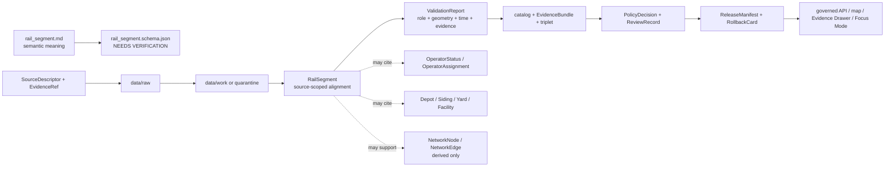

<!-- [KFM_META_BLOCK_V2]
doc_id: kfm://doc/contracts-domains-roads-rail-trade-rail-segment
title: Rail Segment Contract — Roads / Rail / Trade Routes
type: semantic-contract
version: v0.2
status: draft; PROPOSED; schema-missing; slug-CONFLICTED; NEEDS VERIFICATION before promotion
owners:
  - OWNER_TBD — Roads/Rail/Trade Routes domain steward
  - OWNER_TBD — Rail steward
  - OWNER_TBD — Contracts steward
  - OWNER_TBD — Source steward
  - OWNER_TBD — Evidence steward
  - OWNER_TBD — Schema steward
  - OWNER_TBD — Policy steward
  - OWNER_TBD — Release steward
  - OWNER_TBD — Docs steward
created: NEEDS VERIFICATION — scaffold existed before v0.2 expansion
updated: 2026-06-23
policy_label: public; contracts; roads-rail-trade; rail-segment; rail-alignment-evidence; source-role-aware; temporal-scope-aware; evidence-bound; operator-status-separate; facility-identity-separate; hydrology-boundary-aware; hazard-boundary-aware; graph-derived; release-gated; rollback-aware; not-operator-status; not-legal-entity-truth; not-live-service; not-routing-authority; not-publication-authority
tags: [kfm, contracts, roads-rail-trade, rail-segment, rail-alignment, track-centerline, branchline, mainline, historic-rail, abandoned-rail, corridor-route, route-membership, crossing, bridge, depot, siding, yard, operator-status, operator-assignment, access-restriction, network-edge, network-node, EvidenceBundle, PolicyDecision, ReviewRecord, ReleaseManifest, RollbackCard, spec_hash]
related:
  - ./README.md
  - ./road_segment.md
  - ./corridor_route.md
  - ./route_membership.md
  - ./crossing.md
  - ./bridge.md
  - ./river_crossing.md
  - ./depot.md
  - ./siding.md
  - ./yard.md
  - ./transport_facility.md
  - ./operator_status.md
  - ./operator_assignment.md
  - ./route_event.md
  - ./status_event.md
  - ./access_restriction.md
  - ./restriction_event.md
  - ./network_node.md
  - ./network_edge.md
  - ./historic_route_claim.md
  - ./movement_story_node.md
  - ./domain_observation.md
  - ./domain_feature_identity.md
  - ./domain_validation_report.md
  - ./domain_layer_descriptor.md
  - ../roads/README.md
  - ../../../docs/domains/roads-rail-trade/README.md
  - ../../../docs/domains/roads-rail-trade/CANONICAL_PATHS.md
  - ../../../docs/domains/roads-rail-trade/OBJECT_FAMILIES.md
  - ../../../docs/domains/roads-rail-trade/IDENTITY_MODEL.md
  - ../../../docs/domains/roads-rail-trade/DATA_LIFECYCLE.md
  - ../../../docs/domains/roads-rail-trade/sublanes/rail.md
  - ../../../docs/domains/roads-rail-trade/GRAPH_PROJECTIONS.md
  - ../../../docs/domains/roads-rail-trade/MAP_UI_CONTRACTS.md
  - ../../../docs/runbooks/roads-rail-trade/PROMOTION_RUNBOOK.md
  - ../../../docs/runbooks/roads-rail-trade/ROLLBACK_RUNBOOK.md
  - ../../../schemas/contracts/v1/domains/roads-rail-trade/rail_segment.schema.json
  - ../../../policy/domains/roads-rail-trade/
  - ../../../fixtures/domains/roads-rail-trade/rail_segment/
  - ../../../tests/domains/roads-rail-trade/
  - ../../../release/candidates/roads-rail-trade/
notes:
  - "Expanded from a PROPOSED scaffold at contracts/domains/roads-rail-trade/rail_segment.md."
  - "A paired schema at schemas/contracts/v1/domains/roads-rail-trade/rail_segment.schema.json was not found in this task. Field realization remains PROPOSED."
  - "The domain README names Rail Segment as rail alignment evidence and states operator status is separate."
  - "The rail sublane names Rail Segment as track centerlines, alignments, branchlines, and mainlines, historic and current. It also separates depots/sidings/yards, operator status/assignment, restrictions/events, and graph projections."
  - "Object-family doctrine names Rail Segment as rail-segment evidence or released derivative, with source id + object role + temporal scope + normalized digest as the PROPOSED identity basis."
  - "This contract defines source-scoped rail-segment meaning. It does not prove operator status, legal ownership, facility identity, current service, legal access, live routing, graph truth, or publication approval."
  - "The Roads / Rail / Trade Routes docs record a slug conflict between roads-rail-trade and transport for contract/schema homes. This file preserves the observed requested path and does not resolve the ADR question."
[/KFM_META_BLOCK_V2] -->

<a id="top"></a>

# Rail Segment Contract — Roads / Rail / Trade Routes

> Semantic contract for `rail_segment`: the evidence-bound rail alignment, track-centerline, branchline, mainline, abandoned-line, or released derivative segment asserted by a source within Roads / Rail / Trade Routes — without becoming operator status, legal ownership, current service authority, facility identity, live routing, graph truth, map truth, or publication approval.

<p>
  
  
  
  
  
  
  
</p>

`contracts/domains/roads-rail-trade/rail_segment.md`

## Quick jumps

[Status](#status) · [Meaning](#meaning) · [Repo fit](#repo-fit) · [Schema posture](#schema-posture) · [Accepted uses](#accepted-uses) · [Exclusions](#exclusions) · [Recommended fields](#recommended-fields) · [Invariants](#invariants) · [Rail segment families](#rail-segment-families) · [Source-role and time rules](#source-role-and-time-rules) · [Lifecycle](#lifecycle) · [Validation](#validation) · [Rollback](#rollback) · [Evidence basis](#evidence-basis) · [Open questions](#open-questions)

---

## Status

> [!IMPORTANT]
> **Status:** `draft` / semantic contract  
> **Owner:** `OWNER_TBD`  
> **Contract path:** `contracts/domains/roads-rail-trade/rail_segment.md`  
> **Schema path:** `schemas/contracts/v1/domains/roads-rail-trade/rail_segment.schema.json` — **not found in this task**  
> **Truth posture:** target path and prior scaffold are confirmed from current repo evidence. `Rail Segment` is confirmed in the Roads / Rail / Trade Routes domain README, object-family dossier, and rail sublane. Exact schema fields, validator behavior, fixture coverage, source registry behavior, operator status behavior, graph behavior, policy behavior, release manifests, public API behavior, map rendering, and runtime behavior remain **NEEDS VERIFICATION**.

> [!CAUTION]
> This contract defines rail-segment meaning only. It does **not** prove current rail service, legal ownership, operator control, rail safety, public access, route availability, live status, facility identity, hydrologic condition, hazard cause, graph routing, map/API behavior, or publication approval.

---

## Meaning

`rail_segment` records a source-scoped rail alignment or released rail derivative in Roads / Rail / Trade Routes.

It may represent that a source asserts or supports a rail segment such as:

- a track centerline, rail alignment, branchline, mainline, industrial spur, siding connector, yard connector, abandoned alignment, predecessor-railroad line, or historic rail corridor segment;
- a segment that participates in `CorridorRoute`, `RouteMembership`, `Freight Corridor`, `HistoricRouteClaim`, or `TradeRouteCorridor` context;
- a segment related to `Crossing`, `Bridge`, `River Crossing`, depot, siding, yard, or other facility/crossing evidence;
- a segment cited by `OperatorStatus`, `OperatorAssignment`, `AccessRestriction`, `RestrictionEvent`, `RouteEvent`, or `StatusEvent` records;
- a source object that may support derived `NetworkNode`, `NetworkEdge`, map layer, Evidence Drawer, Focus Mode, or Movement Story Node surfaces after governance gates pass.

The rail segment contract owns the **transport-side rail alignment segment**: what source says about a bounded rail-alignment object, with source role, time scope, identity envelope, geometry support, evidence refs, policy posture, review state, release state, and rollback target. It does not own operator/legal-entity truth, current service truth, facility/place identity, hazard truth, hydrology truth, land/title facts, graph topology, map rendering, or public release authority.

---

## Repo fit

| Responsibility | Path or root | Relationship |
|---|---|---|
| Parent contract lane | `./README.md` | Defines this folder as semantic contracts only. |
| Road segment companion | `./road_segment.md` | Parallel road-side scaffold; not a replacement for rail segment. |
| Route/corridor contracts | `./corridor_route.md`, `./route_membership.md`, `./freight_corridor.md`, `./historic_route_claim.md`, `./trade_route_corridor.md` | Rail segment may support routes/corridors; those relationships remain separate. |
| Crossing/facility contracts | `./crossing.md`, `./bridge.md`, `./river_crossing.md`, `./depot.md`, `./siding.md`, `./yard.md`, `./transport_facility.md` | Rail segment may cite these, but they keep their own semantics and ownership boundaries. |
| Operator/status/restriction contracts | `./operator_status.md`, `./operator_assignment.md`, `./access_restriction.md`, `./restriction_event.md`, `./route_event.md`, `./status_event.md` | Operational, legal, restriction, and event semantics remain separate. |
| Graph contracts | `./network_node.md`, `./network_edge.md` | Graph projections derive from rail-segment evidence but do not replace it. |
| Rail sublane | `../../../docs/domains/roads-rail-trade/sublanes/rail.md` | Names rail-specific realizations, explicit non-ownership, and rail sublane boundaries. |
| Object families | `../../../docs/domains/roads-rail-trade/OBJECT_FAMILIES.md` | Names Rail Segment and its PROPOSED identity basis. |
| Identity model | `../../../docs/domains/roads-rail-trade/IDENTITY_MODEL.md` | Defines deterministic identity envelope and `spec_hash` posture. |
| Data lifecycle | `../../../docs/domains/roads-rail-trade/DATA_LIFECYCLE.md` | Defines RAW→PUBLISHED lifecycle, trust membrane, graph derivation, and release gates. |
| Schemas | `../../../schemas/contracts/v1/domains/roads-rail-trade/` or ADR-selected alternate | Machine shape; paired schema missing in this task. |
| Policy | `../../../policy/domains/roads-rail-trade/` or ADR-selected alternate | Allow/deny/restrict/abstain decisions and sensitivity handling. |
| Fixtures/tests | `../../../fixtures/domains/roads-rail-trade/`, `../../../tests/domains/roads-rail-trade/` | Behavior proof; not contract prose. |
| Release/rollback | `../../../release/candidates/roads-rail-trade/` and release roots | Promotion, release, correction, rollback, and derivative invalidation. |

---

## Schema posture

A direct paired schema was checked at:

```text
schemas/contracts/v1/domains/roads-rail-trade/rail_segment.schema.json
```

That file was **not found** in this task.

> [!WARNING]
> Because no paired schema was confirmed, every field below is **PROPOSED** semantic guidance. Do not treat it as machine-enforced until schema, fixtures, validator, source registry records, policy tests, release checks, governed API behavior, map behavior, graph behavior, and runtime behavior are verified.

---

## Accepted uses

| Use | Allowed? | Rule |
|---|---:|---|
| Recording rail alignment evidence or released derivative | Yes | Must preserve source role, time scope, identity, geometry support, evidence, and limitations. |
| Supporting route/corridor membership | Yes | Use `RouteMembership`/`CorridorRoute` refs; do not embed route truth in the segment. |
| Supporting crossings, bridges, depots, sidings, yards, and facilities | Conditional | Use refs; do not absorb settlement/infrastructure, hydrology, or facility identity. |
| Supporting operator status or assignment | Conditional | Use separate operator contracts and valid-time discipline. |
| Supporting restrictions, route events, or status events | Conditional | Event/restriction semantics remain separate and source-scoped. |
| Supporting graph projections | Conditional | `NetworkNode`/`NetworkEdge` are derived and rollbackable. |
| Supporting public map/Focus Mode display | Conditional | Requires EvidenceBundle, PolicyDecision, ReviewRecord, ReleaseManifest, correction path, and RollbackCard. |
| Proving current service, safety, ownership, operator control, or legal access | No | Requires separate authoritative evidence and policy review; often should abstain or deny. |

---

## Exclusions

`rail_segment` must not be used as:

| Misuse | Required outcome |
|---|---|
| Operator status or active service authority | Use `operator_status.md`, `status_event.md`, source authority, and policy/release gates. |
| Operator legal-entity or ownership proof | Cite People/Land, corporate registry, legal source, or other owning-domain record. |
| Depot/siding/yard canonical place/facility truth | Use Settlements/Infrastructure or facility contracts. |
| Hydrology or hazard truth | Cite Hydrology or Hazards; do not author water/flood/fire/smoke cause here. |
| Legal public access or routing authority | `ABSTAIN`/`DENY` unless authoritative source and policy/release support exist. |
| Network graph truth | Graph nodes/edges are derived; EvidenceBundle and segment records outrank projections. |
| Public API/map payload by itself | Use governed API/released artifacts only. |
| Publication approval | ReleaseManifest, ReviewRecord, PolicyDecision, correction path, and RollbackCard remain separate. |

---

## Recommended fields

The following fields are **PROPOSED** until a schema is added and validated.

| Field | Meaning |
|---|---|
| `id` | Canonical rail-segment identifier. |
| `version` | Contract/object version. |
| `spec_hash` | Deterministic hash over normalized rail-segment identity/content envelope. |
| `domain` | Expected value: `roads-rail-trade` unless ADR selects another slug. |
| `segment_name` | Source-stated or normalized segment/line label, if any. |
| `segment_type` | Mainline, branchline, spur, siding connector, yard connector, abandoned line, historic alignment, industrial lead, candidate, or source-specific type. |
| `source_ref` | SourceDescriptor/source registry reference. |
| `source_role` | Accepted source role; must be preserved from admission through publication. |
| `source_native_id` | Source-native segment, line, asset, crossing, or geometry ID. |
| `evidence_refs` | EvidenceRefs or EvidenceBundle refs. |
| `geometry_ref` | Geometry reference or generalized geometry ref. Not sufficient identity by itself. |
| `precision_statement` | Statement of supported positional precision and source limitations. |
| `valid_time` | Interval during which the source asserts the segment/alignment applies. |
| `source_time` | Source creation, publication, map, roster, timetable, filing, or update time. |
| `retrieval_time` | KFM retrieval/freeze time. |
| `release_time` | KFM governed release time, if released. |
| `corridor_route_refs` | CorridorRoute refs associated with this segment. |
| `route_membership_refs` | RouteMembership refs attaching the segment to routes/corridors. |
| `crossing_refs` | Crossing, bridge, river crossing, ferry, or facility refs, if separate. |
| `facility_refs` | Depot, siding, yard, station, terminal, or TransportFacility refs, if separate. |
| `operator_status_refs` | OperatorStatus refs, if separately supported. |
| `operator_assignment_refs` | OperatorAssignment refs, if separately supported. |
| `restriction_refs` | AccessRestriction or RestrictionEvent refs, if separately supported. |
| `route_event_refs` | RouteEvent or StatusEvent refs, if separately supported. |
| `network_node_refs` | Derived NetworkNode refs, if materialized. |
| `network_edge_refs` | Derived NetworkEdge refs, if materialized. |
| `sensitivity_label` | Sensitivity/policy tier inherited from source and cross-lane context. |
| `generalization_ref` | Aggregation/generalization transform/receipt ref, if public geometry differs from source geometry. |
| `policy_decision_ref` | PolicyDecision governing use or publication. |
| `review_ref` | ReviewRecord or steward review ref. |
| `release_manifest_ref` | ReleaseManifest for public/semi-public exposure. |
| `rollback_ref` | RollbackCard or rollback target. |
| `limitations` | Caveats: rail alignment evidence only; not operator status, legal ownership, facility truth, live service, legal access, graph truth, or release authority. |

---

## Invariants

1. **Rail segment is evidence-bound.** It records source-supported rail alignment or released derivative semantics, not sovereign route truth.
2. **Identity is not geometry alone.** Geometry can be content, but identity must include source, role, temporal scope, and normalized digest.
3. **Operator status is separate.** Active/inactive, operating, abandoned, embargoed, leased, or current-service status belongs in operator/status/event records.
4. **Operator legal identity is separate.** Corporate identity, ownership, title, and land facts require People/Land or legal/source authority.
5. **Facility identity is separate.** Depots, sidings, yards, stations, terminals, and facilities preserve their own contract/domain boundaries.
6. **Hydrology and hazards are separate.** Water-feature, flood, fire, smoke, and emergency-condition truth must be cited from owning lanes.
7. **Graph is derived.** Network nodes and edges may be derived from rail segments, but graph projections do not replace segment evidence.
8. **Source role is preserved.** Regulatory, administrative, observed, modeled, aggregate, candidate, and synthetic sources do not collapse into one authority posture.
9. **Publication requires gates.** Public display requires EvidenceBundle, PolicyDecision, ReviewRecord, ReleaseManifest, correction path, and RollbackCard.

---

## Rail segment families

| Segment family | Meaning | Special guardrail |
|---|---|---|
| `current_alignment_segment` | Source asserts current rail alignment/track centerline. | Not proof of active service or legal access by itself. |
| `mainline_segment` | Source asserts a mainline or primary rail alignment. | Operator/status and route membership remain separate. |
| `branchline_segment` | Source asserts branchline alignment. | Line name/corridor grouping must be separately cited. |
| `industrial_or_spur_segment` | Source asserts industrial lead, spur, or local rail connection. | May be sensitive or facility-adjacent; policy review may restrict display. |
| `siding_connector_segment` | Source asserts a siding-related rail segment. | Siding/facility identity remains separate. |
| `yard_connector_segment` | Source asserts yard/terminal-related rail segment. | Yard/facility identity remains separate and may be settlement/infrastructure-owned. |
| `abandoned_or_historic_segment` | Source asserts abandoned, former, or historic rail alignment. | Preserve uncertainty and avoid current-service wording. |
| `candidate_segment` | OCR, map label, model, graph, or connector proposes a rail segment. | Candidate until reviewed; no public truth without evidence and policy gates. |
| `released_public_segment` | Segment included in a governed public rail layer. | Requires release manifest and rollback target. |

---

## Source-role and time rules

Rail-segment records must carry source role and time as core meaning.

| Rule | Requirement |
|---|---|
| Source role is fixed at admission | Promotion never turns a context layer, map label, roster, OCR hit, or model output into rail authority. |
| Geometry is not enough | Similar track centerlines from different sources, vintages, roles, or rights remain distinct until reconciled by governed process. |
| Segment valid time is distinct | The period asserted by the source, source publication/update time, KFM retrieval time, review time, and release time are separate. |
| Current-looking geometry is not current service | Track linework does not prove active service, operator control, safety, or access. |
| Cross-lane evidence stays cited | Settlements/Infrastructure, Hydrology, Hazards, People/Land, Archaeology/Cultural Heritage, and legal/title sources are cited through governed refs, not absorbed. |
| Release time is explicit | Public display must cite the release artifact and rollback target. |

---

## Lifecycle



Contracts describe meaning. They do not move data, validate schemas, execute source reconciliation, make policy decisions, close evidence, perform review, publish artifacts, render maps, prove operator status, prove legal ownership, provide live service state, or authorize AI answers.

---

## Validation

Before this contract is treated as mature, maintainers should verify:

- [ ] the ADR-selected contract/schema slug and whether this file should remain under `contracts/domains/roads-rail-trade/` or migrate to `contracts/transport/`;
- [ ] paired schema exists and includes segment type, source role, source-native ID, geometry refs, precision statement, time axes, route/corridor refs, operator/status refs, facility refs, evidence, policy, review, release, and rollback refs;
- [ ] fixtures cover current alignments, mainlines, branchlines, spurs, siding connectors, yard connectors, abandoned/historic segments, candidate segments, and released public segments;
- [ ] tests prevent rail segments from proving operator status, current service, legal access, ownership/title, facility identity, hazard truth, or hydrology truth;
- [ ] tests preserve source role and time distinctions across regulatory, administrative, observed, modeled, aggregate, candidate, and synthetic sources;
- [ ] tests prevent geometry-only identity collapse and require deterministic `spec_hash` posture;
- [ ] tests prove graph projections derive from rail-segment evidence and rollback/rebuild without rewriting segment truth;
- [ ] public DTOs and map/Focus Mode payloads require EvidenceBundle, PolicyDecision, ReviewRecord, ReleaseManifest, correction path, and RollbackCard;
- [ ] rollback invalidates derived layer descriptors, graph projections, API payloads, exports, Focus Mode states, movement story nodes, caches, and AI summaries that cited the segment.

---

## Rollback

Rollback or correction is required when this contract:

- claims rail-segment schema, policy, fixtures, tests, source registry, lifecycle data, release, API, UI, graph, operator-status, or runtime behavior exists without proof;
- hides the `roads-rail-trade` vs `transport` slug conflict;
- treats rail segment geometry as identity, operator status, current service, legal access, safety, ownership proof, route legality, graph truth, or publication approval;
- lets a regulatory/admin/context/map/model/candidate source become stronger authority without evidence and review;
- collapses rail segment, route membership, operator assignment/status, depot/siding/yard/facility identity, crossing/bridge/hydrology, or graph node/edge into one object;
- publishes or renders unsupported rail segments through maps, graph views, Focus Mode, exports, or AI narrative.

Rollback target: revert this file to prior scaffold blob SHA `a0f35586d6638932630b1e0c08c88e1073c2f492`, record drift if authority boundaries were affected, and invalidate downstream derivatives that cited the weakened rail-segment contract.

---

## Evidence basis

| Evidence | Status | Supports | Limit |
|---|---|---|---|
| Prior `contracts/domains/roads-rail-trade/rail_segment.md` | `CONFIRMED` | Target file existed as a PROPOSED scaffold. | Scaffold did not define authoritative semantic contract content. |
| `schemas/contracts/v1/domains/roads-rail-trade/rail_segment.schema.json` lookup | `CONFIRMED not found in this task` | Justifies `schema-missing` and PROPOSED field posture. | Does not rule out alternate schema homes such as `transport/`. |
| `docs/domains/roads-rail-trade/README.md` | `CONFIRMED term / PROPOSED field realization` | Names Rail Segment as rail alignment evidence and states operator status is separate. | Field-level schema, validators, and runtime behavior remain NEEDS VERIFICATION. |
| `docs/domains/roads-rail-trade/sublanes/rail.md` | `CONFIRMED doctrine / PROPOSED rail-specific realization` | Defines rail-specific scope: track centerlines, alignments, branchlines, mainlines; separates depots/facilities, operator status/assignment, restrictions/events, graph projections, and cross-lane authority. | Does not prove schema, validator, runtime, or public API maturity. |
| `docs/domains/roads-rail-trade/OBJECT_FAMILIES.md` | `CONFIRMED term / PROPOSED field realization` | Names Rail Segment as rail-segment evidence/released derivative and gives PROPOSED deterministic identity basis. | Exact field set remains NEEDS VERIFICATION. |
| `docs/domains/roads-rail-trade/IDENTITY_MODEL.md` | `CONFIRMED doctrine / PROPOSED field realization` | Defines identity envelope and `spec_hash`; warns identity is not raw geometry alone. | Exact Rail Segment digest fields remain NEEDS VERIFICATION. |
| `docs/domains/roads-rail-trade/DATA_LIFECYCLE.md` | `CONFIRMED doctrine / PROPOSED implementation` | Defines lifecycle, trust membrane, public access through governed APIs/manifests, and graph projections as derived. | Does not prove runtime, API, release, validator, or test maturity. |
| Uploaded authoring prompt v2 | `CONFIRMED user-supplied guidance` | Requires evidence-grounded, visually polished, implementation-honest Markdown with verification and rollback posture. | Authoring guidance, not implementation proof. |

---

## Open questions

| ID | Question | Status |
|---|---|---|
| OQ-RRT-RS-01 | Should `rail_segment.md` remain at `contracts/domains/roads-rail-trade/` or migrate to `contracts/transport/` after slug ADR resolution? | OPEN / ADR NEEDED |
| OQ-RRT-RS-02 | Which segment types, source roles, precision fields, and geometry refs are canonical across current, historic, abandoned, and candidate rail evidence? | OPEN / SCHEMA REVIEW |
| OQ-RRT-RS-03 | What evidence threshold distinguishes current rail alignment from active service or operator control? | OPEN / EVIDENCE REVIEW |
| OQ-RRT-RS-04 | How should rail segment refs to depot, siding, yard, crossing, bridge, hydrology, hazard, and People/Land records be modeled without ownership collapse? | OPEN / CROSS-LANE REVIEW |
| OQ-RRT-RS-05 | How should graph nodes/edges cite rail segments without becoming a second canonical rail network store? | OPEN / GRAPH REVIEW |
| OQ-RRT-RS-06 | How should rollback invalidate maps, graph views, Focus Mode, exports, and AI summaries that cited a withdrawn rail segment? | OPEN / RELEASE REVIEW |

<p align="right"><a href="#top">Back to top</a></p>
