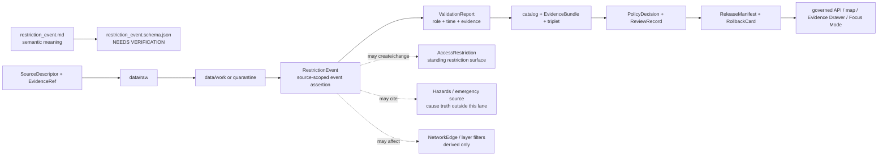

<!-- [KFM_META_BLOCK_V2]
doc_id: kfm://doc/contracts-domains-roads-rail-trade-restriction-event
title: Restriction Event Contract — Roads / Rail / Trade Routes
type: semantic-contract
version: v0.2
status: draft; PROPOSED; schema-missing; slug-CONFLICTED; event-form; NEEDS VERIFICATION before promotion
owners:
  - OWNER_TBD — Roads/Rail/Trade Routes domain steward
  - OWNER_TBD — Roads steward
  - OWNER_TBD — Rail steward
  - OWNER_TBD — Hazards steward
  - OWNER_TBD — Contracts steward
  - OWNER_TBD — Source steward
  - OWNER_TBD — Evidence steward
  - OWNER_TBD — Schema steward
  - OWNER_TBD — Policy steward
  - OWNER_TBD — Release steward
  - OWNER_TBD — Docs steward
created: NEEDS VERIFICATION — scaffold existed before v0.2 expansion
updated: 2026-06-23
policy_label: public; contracts; roads-rail-trade; restriction-event; access-restriction; closure-event; limit-event; time-bound-event; source-role-aware; temporal-scope-aware; evidence-bound; hazard-boundary-aware; legal-boundary-aware; release-gated; rollback-aware; not-live-alert; not-emergency-authority; not-routing-advice; not-legal-advice; not-publication-authority
tags: [kfm, contracts, roads-rail-trade, restriction-event, access-restriction, status-event, route-event, road-segment, rail-segment, corridor-route, route-membership, crossing, bridge, ferry, transport-facility, operator-status, source-role, valid-time, EvidenceBundle, PolicyDecision, ReviewRecord, ReleaseManifest, RollbackCard, spec_hash]
related:
  - ./README.md
  - ./access_restriction.md
  - ./status_event.md
  - ./route_event.md
  - ./operator_status.md
  - ./operator_assignment.md
  - ./road_segment.md
  - ./rail_segment.md
  - ./corridor_route.md
  - ./route_membership.md
  - ./crossing.md
  - ./bridge.md
  - ./ferry.md
  - ./river_crossing.md
  - ./transport_facility.md
  - ./depot.md
  - ./siding.md
  - ./yard.md
  - ./network_node.md
  - ./network_edge.md
  - ./domain_observation.md
  - ./domain_feature_identity.md
  - ./domain_validation_report.md
  - ./domain_layer_descriptor.md
  - ../roads/README.md
  - ../../../docs/domains/roads-rail-trade/README.md
  - ../../../docs/domains/roads-rail-trade/CANONICAL_PATHS.md
  - ../../../docs/domains/roads-rail-trade/OBJECT_FAMILIES.md
  - ../../../docs/domains/roads-rail-trade/IDENTITY_MODEL.md
  - ../../../docs/domains/roads-rail-trade/DATA_LIFECYCLE.md
  - ../../../docs/domains/roads-rail-trade/sublanes/roads.md
  - ../../../docs/domains/roads-rail-trade/sublanes/rail.md
  - ../../../docs/domains/roads-rail-trade/GRAPH_PROJECTIONS.md
  - ../../../docs/domains/roads-rail-trade/MAP_UI_CONTRACTS.md
  - ../../../docs/runbooks/roads-rail-trade/PROMOTION_RUNBOOK.md
  - ../../../docs/runbooks/roads-rail-trade/ROLLBACK_RUNBOOK.md
  - ../../../schemas/contracts/v1/domains/roads-rail-trade/restriction_event.schema.json
  - ../../../policy/domains/roads-rail-trade/
  - ../../../fixtures/domains/roads-rail-trade/restriction_event/
  - ../../../tests/domains/roads-rail-trade/
  - ../../../release/candidates/roads-rail-trade/
notes:
  - "Expanded from a PROPOSED scaffold at contracts/domains/roads-rail-trade/restriction_event.md."
  - "A paired schema at schemas/contracts/v1/domains/roads-rail-trade/restriction_event.schema.json was not found in this task. Field realization remains PROPOSED."
  - "The domain README names Access Restriction as closure, weight/height, permitting, and seasonal limits, while object-family doctrine names RestrictionEvent as a restriction bound to time and place."
  - "The existing access_restriction contract treats Access Restriction as the restriction semantics surface and preserves RestrictionEvent as likely event-form realization pending schema/ADR review."
  - "Rail sublane doctrine includes Access Restriction / RestrictionEvent for embargoes, slow orders, closures, and weight/clearance restrictions, while hazard event truth remains outside this lane."
  - "This contract defines source-scoped restriction event meaning. It does not provide live closure feeds, emergency alerts, permit advice, legal routing authority, safety guidance, hazard-cause truth, or publication approval."
  - "The Roads / Rail / Trade Routes docs record a slug conflict between roads-rail-trade and transport for contract/schema homes. This file preserves the observed requested path and does not resolve the ADR question."
[/KFM_META_BLOCK_V2] -->

<a id="top"></a>

# Restriction Event Contract — Roads / Rail / Trade Routes

> Semantic contract for `restriction_event`: the source-scoped, time-bound event-form assertion that a restriction, closure, limit, embargo, permit condition, clearance limit, seasonal rule, access constraint, or movement limitation began, changed, applied, was observed, or ended for a transport object — without becoming live alerting, emergency authority, legal advice, permit advice, safety advice, route availability truth, or publication approval.

<p>
  
  
  
  
  
  
  
</p>

`contracts/domains/roads-rail-trade/restriction_event.md`

## Quick jumps

[Status](#status) · [Meaning](#meaning) · [Repo fit](#repo-fit) · [Schema posture](#schema-posture) · [Accepted uses](#accepted-uses) · [Exclusions](#exclusions) · [Recommended fields](#recommended-fields) · [Invariants](#invariants) · [Restriction event families](#restriction-event-families) · [Source-role and time rules](#source-role-and-time-rules) · [Lifecycle](#lifecycle) · [Validation](#validation) · [Rollback](#rollback) · [Evidence basis](#evidence-basis) · [Open questions](#open-questions)

---

## Status

> [!IMPORTANT]
> **Status:** `draft` / semantic contract  
> **Owner:** `OWNER_TBD`  
> **Contract path:** `contracts/domains/roads-rail-trade/restriction_event.md`  
> **Schema path:** `schemas/contracts/v1/domains/roads-rail-trade/restriction_event.schema.json` — **not found in this task**  
> **Truth posture:** target path and prior scaffold are confirmed from current repo evidence. `RestrictionEvent` is confirmed as an object-family term in the object-family dossier, and Access Restriction is confirmed in the domain README as closure, weight/height, permitting, and seasonal limits. Exact schema fields, validator behavior, fixture coverage, policy behavior, source registry behavior, release manifests, emitted proofs, public API behavior, map rendering, live-feed behavior, hazard integration, and runtime behavior remain **NEEDS VERIFICATION**.

> [!CAUTION]
> This contract defines restriction-event meaning only. It does **not** provide live routing, emergency detour advice, evacuation alerts, road-closure authority, railroad operating authority, legal permit advice, engineering/safety advice, public API behavior, map rendering permission, or publication approval.

---

## Meaning

`restriction_event` records a source-scoped event assertion about a restriction affecting movement, access, clearance, weight, height, permitting, seasonality, operating status, or allowed use across a transport object.

It may represent that a source says a restriction:

- began, ended, changed, was observed, was scheduled, was posted, was superseded, was rescinded, or applied during a valid time window;
- affected a `Road Segment`, `Rail Segment`, `CorridorRoute`, `RouteMembership`, `Crossing`, `Bridge`, `Ferry`, `River Crossing`, `Depot`, `Siding`, `Yard`, or `TransportFacility`;
- was associated with `AccessRestriction`, `StatusEvent`, `RouteEvent`, `OperatorStatus`, or `OperatorAssignment` records;
- affected a derived `NetworkEdge` only as downstream graph context that must cite EvidenceBundle lineage;
- resulted in public-safe map, Evidence Drawer, Focus Mode, export, or graph context only after evidence, policy, review, release, and rollback gates pass.

The restriction event contract owns the **event-form restriction assertion**: what source says happened, changed, applied, or was observed in relation to a restriction, with source role, affected object, time scope, evidence refs, policy posture, review state, release state, and rollback target. It does not own the standing restriction surface, legal status, permit advice, emergency alerting, hazard cause, live routing, public safety guidance, or publication authority.

---

## Repo fit

| Responsibility | Path or root | Relationship |
|---|---|---|
| Parent contract lane | `./README.md` | Defines this folder as semantic contracts only. |
| Standing restriction surface | `./access_restriction.md` | Adjacent semantic surface for restriction meaning; this file defines event-form changes/assertions. |
| Event/status companions | `./status_event.md`, `./route_event.md` | Related event contracts; each keeps its own event semantics. |
| Operator/status companions | `./operator_status.md`, `./operator_assignment.md` | Operator conditions and assignment relations remain separate. |
| Segment contracts | `./road_segment.md`, `./rail_segment.md` | Restriction events may attach to segments; they do not define segment truth. |
| Route/corridor contracts | `./corridor_route.md`, `./route_membership.md` | Restriction events may affect route/corridor context without becoming route membership. |
| Facility/crossing contracts | `./crossing.md`, `./bridge.md`, `./ferry.md`, `./river_crossing.md`, `./transport_facility.md`, `./depot.md`, `./siding.md`, `./yard.md` | Restriction events may cite these, but they keep their own semantics and ownership boundaries. |
| Graph contracts | `./network_node.md`, `./network_edge.md` | Graph projections may consume restriction events, but graph remains derived. |
| Domain README | `../../../docs/domains/roads-rail-trade/README.md` | Names Access Restriction and confirms domain non-ownership of hazard/legal/cross-lane truth. |
| Object families | `../../../docs/domains/roads-rail-trade/OBJECT_FAMILIES.md` | Names RestrictionEvent and its PROPOSED identity basis. |
| Data lifecycle | `../../../docs/domains/roads-rail-trade/DATA_LIFECYCLE.md` | Defines lifecycle, slug conflict, and trust membrane. |
| Schemas | `../../../schemas/contracts/v1/domains/roads-rail-trade/` or ADR-selected alternate | Machine shape; paired schema missing in this task. |
| Policy | `../../../policy/domains/roads-rail-trade/` or ADR-selected alternate | Allow/deny/restrict/abstain decisions and safety/legal boundaries. |
| Fixtures/tests | `../../../fixtures/domains/roads-rail-trade/`, `../../../tests/domains/roads-rail-trade/` | Behavior proof; not contract prose. |
| Release/rollback | `../../../release/candidates/roads-rail-trade/` and release roots | Promotion, release, correction, rollback, and derivative invalidation. |

---

## Schema posture

A direct paired schema was checked at:

```text
schemas/contracts/v1/domains/roads-rail-trade/restriction_event.schema.json
```

That file was **not found** in this task.

> [!WARNING]
> Because no paired schema was confirmed, every field below is **PROPOSED** semantic guidance. Do not treat it as machine-enforced until schema, fixtures, validator, policy tests, source registry records, release checks, governed API behavior, graph behavior, map behavior, and runtime behavior are verified.

---

## Accepted uses

| Use | Allowed? | Rule |
|---|---:|---|
| Recording a sourced restriction event | Yes | Must preserve source role, affected object, event type, valid time, source time, evidence, and limitations. |
| Explaining a change to an access restriction | Yes | Use refs to `access_restriction`; do not duplicate or absorb standing restriction semantics. |
| Supporting road/rail restriction timelines | Conditional | Timeline output must cite EvidenceBundle and preserve source-role/time uncertainty. |
| Supporting graph weighting or traversal filters | Conditional | Downstream only; graph filters must never replace canonical evidence or provide live routing advice. |
| Supporting Focus Mode or Evidence Drawer | Conditional | Requires EvidenceBundle, PolicyDecision, ReviewRecord, ReleaseManifest, correction path, and RollbackCard. |
| Linking to hazards or emergency causes | Conditional | Cite owning Hazards/source records; do not author hazard truth here. |
| Acting as live closure, emergency alert, routing, permit, or safety advice | No | Requires separate governed live/public-safety posture; default is DENY or ABSTAIN. |
| Certifying legal access or permit status | No | KFM records evidence; it does not issue legal/permit advice. |

---

## Exclusions

`restriction_event` must not be used as:

| Misuse | Required outcome |
|---|---|
| Live navigation/routing instruction | `DENY` unless separately governed as a real-time routing system. |
| Emergency closure/evacuation alert | `DENY`; hazards/emergency authority remains separate. |
| Legal access or permit certification | `ABSTAIN` unless authoritative source, legal caveat, policy, review, and release support exist. |
| Permit, trucking, oversize/overweight, clearance, or safety advice | `ABSTAIN`; cite source and caveat; do not advise. |
| Proof that a route/segment is public or private | `ABSTAIN`; restriction event is one assertion, not full legal status proof. |
| AccessRestriction replacement | Use `access_restriction.md` for standing restriction semantics. |
| StatusEvent or RouteEvent replacement | Keep event type, route status, and restriction semantics distinct. |
| Hazard event truth | Cite Hazards or authoritative source lane; do not absorb hazard cause/status. |
| Public API/map payload by itself | Use governed API/released artifacts only. |
| Publication approval | ReleaseManifest, ReviewRecord, PolicyDecision, correction path, and RollbackCard remain separate. |

---

## Recommended fields

The following fields are **PROPOSED** until a schema is added and validated.

| Field | Meaning |
|---|---|
| `id` | Canonical restriction-event identifier. |
| `version` | Contract/object version. |
| `spec_hash` | Deterministic hash over normalized restriction-event content. |
| `domain` | Expected value: `roads-rail-trade` unless ADR selects another slug. |
| `event_type` | Closure, reopening, weight limit, height limit, clearance limit, embargo, slow order, seasonal closure, permit condition, restriction update, rescission, candidate event, or source-specific type. |
| `event_role` | Begins, ends, changes, observes, schedules, posts, supersedes, rescinds, confirms, or proposes a restriction. |
| `event_statement` | Source-scoped event statement being preserved. |
| `restriction_ref` | AccessRestriction ref, if the standing restriction is materialized separately. |
| `affected_object_ref` | Segment, route, corridor, crossing, bridge, ferry, facility, graph, or event object ref receiving the event. |
| `affected_object_family` | Object family affected by the event. |
| `source_ref` | SourceDescriptor/source registry reference. |
| `source_role` | Accepted source role; must be preserved from admission through publication. |
| `source_native_id` | Source-native event, restriction, closure, segment, route, crossing, or facility ID. |
| `evidence_refs` | EvidenceRefs or EvidenceBundle refs. |
| `valid_time` | Interval during which the restriction event is asserted to apply. |
| `event_time` | Time the event happened or is said to happen, if distinct from valid interval. |
| `source_time` | Source creation, publication, feed, roster, filing, bulletin, map, or update time. |
| `retrieval_time` | KFM retrieval/freeze time. |
| `release_time` | KFM governed release time, if released. |
| `supersedes_ref` | Prior restriction event superseded by this record, if any. |
| `superseded_by_ref` | Later restriction event replacing this one, if any. |
| `status_event_ref` | StatusEvent ref, if a separate status change exists. |
| `route_event_ref` | RouteEvent ref, if a route designation/status event exists. |
| `operator_status_ref` | OperatorStatus ref, if restriction is operator/status-linked. |
| `hazard_ref` | Hazard/cause/event ref, if cited from owning lane. |
| `network_effect_ref` | Derived graph effect ref, if graph projection uses this event. |
| `sensitivity_label` | Sensitivity/policy tier inherited from source, affected object, and event context. |
| `policy_decision_ref` | PolicyDecision governing use or publication. |
| `review_ref` | ReviewRecord or steward review ref. |
| `release_manifest_ref` | ReleaseManifest for public/semi-public exposure. |
| `rollback_ref` | RollbackCard or rollback target. |
| `limitations` | Caveats: restriction event only; not live alert, legal advice, permit advice, safety advice, hazard truth, route availability, or release authority. |

---

## Invariants

1. **Restriction event is time-bound.** It records a sourced change/assertion about a restriction, not all access truth about the object.
2. **Event is not standing semantics.** Standing restriction meaning belongs in `access_restriction`; this file preserves event-form changes or observations.
3. **Event is not live alerting.** A restriction event does not become a current feed, emergency alert, detour, route recommendation, or safety advisory.
4. **Hazard causes stay separate.** Flood, fire, smoke, construction hazard, accident, or emergency truth belongs to Hazards or authoritative source lanes.
5. **Legal/permit advice is out of scope.** Restrictions may cite legal sources, but KFM does not issue legal, trucking, rail-operating, or permit guidance.
6. **Source role is preserved.** Feed entries, administrative compilations, bulletins, maps, notices, user reports, OCR hits, and models do not collapse into one authority posture.
7. **Graph is derived.** Network effects may derive from restriction events, but graph filters do not become the event or evidence.
8. **No public event without evidence.** Public-facing restriction event claims require EvidenceBundle resolution and citation support.
9. **Publication requires gates.** Public display requires EvidenceBundle, PolicyDecision, ReviewRecord, ReleaseManifest, correction path, and RollbackCard.

---

## Restriction event families

| Event family | Meaning | Special guardrail |
|---|---|---|
| `closure_event` | Source asserts closure begins, applies, changes, or ends. | Not live closure or emergency advice by itself. |
| `weight_limit_event` | Source asserts a weight restriction or change. | Not trucking/permit advice; public wording must caveat. |
| `height_or_clearance_event` | Source asserts height, vertical clearance, width, or clearance change. | Not route suitability or safety advice. |
| `embargo_or_slow_order_event` | Source asserts rail embargo, slow order, clearance, or operating limitation. | Not current rail operating authority by itself. |
| `seasonal_restriction_event` | Source asserts seasonal limit, closure, permit window, or reopening. | Valid-time and source-time distinction required. |
| `permit_condition_event` | Source asserts a permit/authorization condition changed or applies. | Do not provide legal advice; cite source and caveat. |
| `hazard_linked_restriction_event` | Restriction is associated with flood, fire, smoke, storm, crash, or other hazard. | Hazard truth remains with Hazards/source authority. |
| `candidate_restriction_event` | OCR, feed prefilter, model, map, or connector proposes an event. | Candidate until reviewed; no public truth without evidence/policy gates. |
| `supersession_restriction_event` | Event supersedes or is superseded by another restriction event. | Preserve supersession lineage and rollback impact. |

---

## Source-role and time rules

Restriction-event records must carry source role and time as core meaning.

| Rule | Requirement |
|---|---|
| Source role is fixed at admission | Promotion never turns a feed prefilter, map label, OCR hit, user report, administrative list, or model output into authoritative live closure truth. |
| Event time is not release time | Event time, valid interval, source publication/update time, KFM retrieval time, review time, and release time are separate. |
| Current-looking data is not current advice | A fresh source record can support evidence, but it does not make KFM a live routing or emergency system. |
| Restriction event is distinct from access restriction | Event records may create/change/close/reopen restrictions; the standing restriction surface remains separate. |
| Cross-lane evidence stays cited | Hazards, legal/title, People/Land, Settlements/Infrastructure, Hydrology, and agency feeds are cited through governed refs, not absorbed. |
| Release time is explicit | Public display must cite the release artifact and rollback target. |

---

## Lifecycle



Contracts describe meaning. They do not move data, validate schemas, execute source ingestion, make policy decisions, close evidence, perform review, publish artifacts, render maps, provide live closure status, issue permits, certify route safety, author hazard truth, or authorize AI answers.

---

## Validation

Before this contract is treated as mature, maintainers should verify:

- [ ] the ADR-selected contract/schema slug and whether this file should remain under `contracts/domains/roads-rail-trade/` or migrate to `contracts/transport/`;
- [ ] paired schema exists and includes event type, event role, restriction ref, affected object ref, source role, time axes, evidence, policy, review, release, and rollback refs;
- [ ] fixtures cover closure, reopening, weight limit, height/clearance, embargo/slow order, seasonal restriction, permit condition, hazard-linked, candidate, and supersession events;
- [ ] tests prevent restriction events from becoming live routing, emergency alerting, legal access, permit advice, safety advice, or hazard truth;
- [ ] tests preserve source role and time distinctions across feeds, bulletins, rosters, administrative compilations, maps, OCR/model candidates, and historical sources;
- [ ] tests prevent events from replacing AccessRestriction, StatusEvent, RouteEvent, OperatorStatus, segment identity, route membership, facility identity, hazard events, or EvidenceBundle;
- [ ] graph tests prove restriction effects remain derived and rollbackable;
- [ ] public DTOs and map/Focus Mode payloads require EvidenceBundle, PolicyDecision, ReviewRecord, ReleaseManifest, correction path, and RollbackCard;
- [ ] rollback invalidates derived layer descriptors, graph filters, API payloads, exports, Focus Mode states, movement story nodes, caches, and AI summaries that cited the event.

---

## Rollback

Rollback or correction is required when this contract:

- claims restriction-event schema, policy, fixtures, tests, source registry, lifecycle data, release, API, UI, graph, live-feed, legal, or runtime behavior exists without proof;
- hides the `roads-rail-trade` vs `transport` slug conflict;
- treats a restriction event as live closure feed, emergency alert, legal access status, permit advice, safety advice, hazard truth, route availability, or publication approval;
- lets an administrative list, feed prefilter, map label, OCR hit, history note, or model output become authoritative restriction truth without evidence and review;
- collapses restriction event, access restriction, status event, route event, hazard cause, segment identity, facility identity, route membership, or graph effect into one object;
- publishes or renders unsupported restriction events through maps, graph filters, Focus Mode, exports, or AI narrative.

Rollback target: revert this file to prior scaffold blob SHA `7e4e5896f57bcfcf9ffca942c7797df389db9be1`, record drift if authority boundaries were affected, and invalidate downstream derivatives that cited the weakened restriction-event contract.

---

## Evidence basis

| Evidence | Status | Supports | Limit |
|---|---|---|---|
| Prior `contracts/domains/roads-rail-trade/restriction_event.md` | `CONFIRMED` | Target file existed as a PROPOSED scaffold. | Scaffold did not define authoritative semantic contract content. |
| `schemas/contracts/v1/domains/roads-rail-trade/restriction_event.schema.json` lookup | `CONFIRMED not found in this task` | Justifies `schema-missing` and PROPOSED field posture. | Does not rule out alternate schema homes such as `transport/`. |
| `contracts/domains/roads-rail-trade/access_restriction.md` | `CONFIRMED sibling contract` | Establishes Access Restriction as standing restriction semantics and preserves RestrictionEvent as likely event-form realization pending schema/ADR review. | Does not prove RestrictionEvent schema or runtime behavior. |
| `docs/domains/roads-rail-trade/README.md` | `CONFIRMED term / PROPOSED field realization` | Names Access Restriction as closure, weight/height, permitting, and seasonal limits; confirms cross-lane non-ownership. | Does not itself define RestrictionEvent schema. |
| `docs/domains/roads-rail-trade/OBJECT_FAMILIES.md` | `CONFIRMED term / PROPOSED field realization` | Names RestrictionEvent as a restriction bound to time and place and shows it as time-bound event/assertion. | Field-level schema, validators, and runtime behavior remain NEEDS VERIFICATION. |
| `docs/domains/roads-rail-trade/sublanes/rail.md` | `CONFIRMED doctrine / PROPOSED rail-specific realization` | Places Access Restriction / RestrictionEvent in rail embargo, slow-order, closure, and weight/clearance contexts; leaves hazard truth outside the rail sublane. | Does not prove schema, validator, runtime, or public API maturity. |
| `docs/domains/roads-rail-trade/DATA_LIFECYCLE.md` | `CONFIRMED doctrine / PROPOSED implementation` | Confirms slug conflict and that promotion/publication must follow governed lifecycle and trust membrane. | Does not prove runtime, API, release, validator, or test maturity. |
| Uploaded authoring prompt v2 | `CONFIRMED user-supplied guidance` | Requires evidence-grounded, visually polished, implementation-honest Markdown with verification and rollback posture. | Authoring guidance, not implementation proof. |

---

## Open questions

| ID | Question | Status |
|---|---|---|
| OQ-RRT-RE-01 | Should `restriction_event.md` remain at `contracts/domains/roads-rail-trade/` or migrate to `contracts/transport/` after slug ADR resolution? | OPEN / ADR NEEDED |
| OQ-RRT-RE-02 | Which event types and roles are canonical across road, rail, freight, facility, bridge, crossing, and historic contexts? | OPEN / SCHEMA REVIEW |
| OQ-RRT-RE-03 | How should `RestrictionEvent` relate to `AccessRestriction`, `StatusEvent`, and `RouteEvent` without collapsing event semantics? | OPEN / DOMAIN REVIEW |
| OQ-RRT-RE-04 | Which source families can support public restriction events, and which remain candidate/review-only due to cadence, rights, or safety risk? | OPEN / SOURCE + POLICY REVIEW |
| OQ-RRT-RE-05 | How should public-safe wording prevent restriction events from being mistaken for live alerts, legal access, permit advice, or safety advice? | OPEN / UI + POLICY REVIEW |
| OQ-RRT-RE-06 | How should rollback invalidate graph filters, maps, Focus Mode states, exports, and AI summaries that cited a withdrawn restriction event? | OPEN / RELEASE REVIEW |

<p align="right"><a href="#top">Back to top</a></p>
