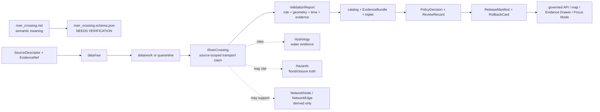

<!-- [KFM_META_BLOCK_V2]
doc_id: kfm://doc/contracts-domains-roads-rail-trade-river-crossing
title: River Crossing Contract — Roads / Rail / Trade Routes
type: semantic-contract
version: v0.2
status: draft; PROPOSED; schema-missing; slug-CONFLICTED; hydrology-boundary; NEEDS VERIFICATION before promotion
owners:
  - OWNER_TBD — Roads/Rail/Trade Routes domain steward
  - OWNER_TBD — Roads steward
  - OWNER_TBD — Rail steward
  - OWNER_TBD — Hydrology steward
  - OWNER_TBD — Archaeology/Cultural Heritage steward
  - OWNER_TBD — Settlements/Infrastructure steward
  - OWNER_TBD — Hazards steward
  - OWNER_TBD — Contracts steward
  - OWNER_TBD — Source steward
  - OWNER_TBD — Evidence steward
  - OWNER_TBD — Schema steward
  - OWNER_TBD — Policy steward
  - OWNER_TBD — Release steward
  - OWNER_TBD — Docs steward
created: NEEDS VERIFICATION — scaffold existed before v0.2 expansion
updated: 2026-06-23
policy_label: public; contracts; roads-rail-trade; river-crossing; ford; fording-crossing; transport-side-claim; hydrology-boundary-aware; source-role-aware; temporal-scope-aware; evidence-bound; sensitivity-aware; crossing-specialization; release-gated; rollback-aware; not-water-evidence; not-flood-condition; not-safe-passage; not-navigation-advice; not-legal-access; not-publication-authority
tags: [kfm, contracts, roads-rail-trade, river-crossing, ford, fording-crossing, crossing, bridge, ferry, road-segment, rail-segment, corridor-route, route-membership, historic-route-claim, trade-route-corridor, hydrology, hazards, archaeology, cultural-heritage, source-role, valid-time, EvidenceBundle, PolicyDecision, ReviewRecord, ReleaseManifest, RollbackCard, spec_hash]
related:
  - ./README.md
  - ./crossing.md
  - ./bridge.md
  - ./ferry.md
  - ./road_segment.md
  - ./rail_segment.md
  - ./corridor_route.md
  - ./route_membership.md
  - ./historic_route_claim.md
  - ./trade_route_corridor.md
  - ./movement_story_node.md
  - ./access_restriction.md
  - ./restriction_event.md
  - ./route_event.md
  - ./status_event.md
  - ./network_node.md
  - ./network_edge.md
  - ./domain_observation.md
  - ./domain_feature_identity.md
  - ./domain_validation_report.md
  - ./domain_layer_descriptor.md
  - ../roads/README.md
  - ../../../docs/domains/roads-rail-trade/README.md
  - ../../../docs/domains/roads-rail-trade/CANONICAL_PATHS.md
  - ../../../docs/domains/roads-rail-trade/OBJECT_FAMILIES.md
  - ../../../docs/domains/roads-rail-trade/IDENTITY_MODEL.md
  - ../../../docs/domains/roads-rail-trade/DATA_LIFECYCLE.md
  - ../../../docs/domains/roads-rail-trade/SOURCES.md
  - ../../../docs/domains/roads-rail-trade/sublanes/roads.md
  - ../../../docs/domains/roads-rail-trade/sublanes/rail.md
  - ../../../docs/domains/roads-rail-trade/sublanes/trade-routes.md
  - ../../../docs/domains/roads-rail-trade/GRAPH_PROJECTIONS.md
  - ../../../docs/domains/roads-rail-trade/MAP_UI_CONTRACTS.md
  - ../../../docs/runbooks/roads-rail-trade/PROMOTION_RUNBOOK.md
  - ../../../docs/runbooks/roads-rail-trade/ROLLBACK_RUNBOOK.md
  - ../../../schemas/contracts/v1/domains/roads-rail-trade/river_crossing.schema.json
  - ../../../policy/domains/roads-rail-trade/
  - ../../../fixtures/domains/roads-rail-trade/river_crossing/
  - ../../../tests/domains/roads-rail-trade/
  - ../../../release/candidates/roads-rail-trade/
notes:
  - "Expanded from a PROPOSED scaffold at contracts/domains/roads-rail-trade/river_crossing.md."
  - "A paired schema at schemas/contracts/v1/domains/roads-rail-trade/river_crossing.schema.json was not found in this task. Field realization remains PROPOSED."
  - "The domain README names River Crossing as a ford / fording crossing object and states that Hydrology owns the water evidence."
  - "The existing Crossing contract frames River Crossing as a specialized companion record and keeps waterbody evidence, hazard causes, legal access, live closure, and bridge/ferry specialization separate."
  - "This contract defines the transport-side river-crossing claim. It does not certify water conditions, flood state, safe passage, navigability, hydrology truth, cultural/archaeological truth, legal access, live routing, or publication approval."
  - "The Roads / Rail / Trade Routes docs record a slug conflict between roads-rail-trade and transport for contract/schema homes. This file preserves the observed requested path and does not resolve the ADR question."
[/KFM_META_BLOCK_V2] -->

<a id="top"></a>

# River Crossing Contract — Roads / Rail / Trade Routes

> Semantic contract for `river_crossing`: the transport-side claim that a road, rail line, trail, historic route, trade corridor, ferry path, bridge approach, or movement corridor crossed, forded, or was associated with a river or watercourse — without becoming hydrology truth, flood/current condition, safe-passage advice, navigability advice, archaeological/cultural truth, legal access authority, graph truth, map truth, or publication approval.

<p>
  
  
  
  
  
  
  
</p>

`contracts/domains/roads-rail-trade/river_crossing.md`

## Quick jumps

[Status](#status) · [Meaning](#meaning) · [Repo fit](#repo-fit) · [Schema posture](#schema-posture) · [Accepted uses](#accepted-uses) · [Exclusions](#exclusions) · [Recommended fields](#recommended-fields) · [Invariants](#invariants) · [River crossing claim families](#river-crossing-claim-families) · [Source-role and time rules](#source-role-and-time-rules) · [Sensitivity and publication posture](#sensitivity-and-publication-posture) · [Lifecycle](#lifecycle) · [Validation](#validation) · [Rollback](#rollback) · [Evidence basis](#evidence-basis) · [Open questions](#open-questions)

---

## Status

> [!IMPORTANT]
> **Status:** `draft` / semantic contract  
> **Owner:** `OWNER_TBD`  
> **Contract path:** `contracts/domains/roads-rail-trade/river_crossing.md`  
> **Schema path:** `schemas/contracts/v1/domains/roads-rail-trade/river_crossing.schema.json` — **not found in this task**  
> **Truth posture:** target path and prior scaffold are confirmed from current repo evidence. `River Crossing` is confirmed as a Roads / Rail / Trade Routes object term in the domain README, which also states Hydrology owns the water evidence. Exact schema fields, validator behavior, fixture coverage, policy behavior, source registry behavior, release manifests, emitted proofs, public API behavior, map rendering, hydrology joins, hazard joins, graph behavior, and runtime behavior remain **NEEDS VERIFICATION**.

> [!CAUTION]
> This contract defines river-crossing meaning only. It does **not** certify water depth, flow, flood condition, fordability, bridge condition, ferry operation, navigation safety, route safety, legal access, current closure status, emergency routing, cultural/archaeological sensitivity, map/API behavior, or publication approval.

---

## Meaning

`river_crossing` records a source-scoped transport-side assertion about a river, stream, creek, ford, watercourse, or hydrologic barrier crossing.

It may represent that a source asserts:

- a `Road Segment`, `Rail Segment`, trail, corridor, route, or historic movement path crosses a watercourse;
- a crossing was forded, bridged, ferried, seasonal, impassable, historic, candidate, modeled, administrative, or observed;
- a `Crossing`, `Bridge`, `Ferry`, `CorridorRoute`, `RouteMembership`, `HistoricRouteClaim`, or `TradeRouteCorridor` participates in or depends on a river-crossing relation;
- an access restriction, route event, status event, operator status, network node/edge, map layer, Evidence Drawer view, or Focus Mode explanation cites the crossing as evidence;
- a public-safe released derivative generalizes, redacts, or explains the crossing without exposing sensitive hydrologic, cultural, archaeological, infrastructure, or safety-risk detail.

The river crossing contract owns the **transport-side crossing claim**: how movement evidence relates to a river or watercourse crossing, with source role, time, identity, evidence, uncertainty, policy posture, review state, release state, and rollback target. Waterbody identity, river reach, flood condition, water level, hydrologic geometry, current conditions, and navigability evidence belong to Hydrology or source-specific hazard/water lanes. Archaeological/cultural meanings and exact sensitive coordinates belong to Archaeology/Cultural Heritage or other owning lanes. Structure identity may belong to Settlements/Infrastructure. Live closure/safety/emergency claims require separate governed paths.

---

## Repo fit

| Responsibility | Path or root | Relationship |
|---|---|---|
| Parent contract lane | `./README.md` | Defines this folder as semantic contracts only. |
| General crossing contract | `./crossing.md` | Broad transport crossing relation; river crossing is the watercourse/ford specialization. |
| Related crossing specializations | `./bridge.md`, `./ferry.md` | Bridge/ferry semantics remain separate from river-crossing meaning. |
| Segment contracts | `./road_segment.md`, `./rail_segment.md` | River crossing may attach to road/rail segments but does not define segment truth. |
| Route/corridor contracts | `./corridor_route.md`, `./route_membership.md`, `./historic_route_claim.md`, `./trade_route_corridor.md` | Crossing may support route/corridor evidence without becoming route truth. |
| Event/restriction contracts | `./access_restriction.md`, `./restriction_event.md`, `./route_event.md`, `./status_event.md` | Restrictions and events remain separate time-scoped records. |
| Graph contracts | `./network_node.md`, `./network_edge.md` | Derived topology may cite river crossing evidence; graph remains downstream. |
| Movement story node | `./movement_story_node.md` | Narrative may cite crossing evidence but remains evidence-subordinate. |
| Domain README | `../../../docs/domains/roads-rail-trade/README.md` | Names River Crossing and confirms Hydrology ownership of water evidence. |
| Object families | `../../../docs/domains/roads-rail-trade/OBJECT_FAMILIES.md` | `Crossing` and related crossing vocabulary/identity posture. |
| Hydrology / hazard ownership | Cross-lane refs through EvidenceBundle/governed APIs | Water evidence, flood conditions, and hazard causes remain outside this contract. |
| Schemas | `../../../schemas/contracts/v1/domains/roads-rail-trade/` or ADR-selected alternate | Machine shape; paired schema missing in this task. |
| Policy | `../../../policy/domains/roads-rail-trade/` or ADR-selected alternate | Allow/deny/restrict/abstain decisions and sensitivity handling. |
| Fixtures/tests | `../../../fixtures/domains/roads-rail-trade/`, `../../../tests/domains/roads-rail-trade/` | Behavior proof; not contract prose. |
| Release/rollback | `../../../release/candidates/roads-rail-trade/` and release roots | Promotion, release, correction, rollback, and derivative invalidation. |

---

## Schema posture

A direct paired schema was checked at:

```text
schemas/contracts/v1/domains/roads-rail-trade/river_crossing.schema.json
```

That file was **not found** in this task.

> [!WARNING]
> Because no paired schema was confirmed, every field below is **PROPOSED** semantic guidance. Do not treat it as machine-enforced until schema, fixtures, validator, source registry records, policy tests, hydrology/hazard join behavior, release checks, governed API behavior, map behavior, graph behavior, and runtime behavior are verified.

---

## Accepted uses

| Use | Allowed? | Rule |
|---|---:|---|
| Recording a source-scoped river/ford crossing claim | Yes | Must preserve source role, time, evidence, waterbody refs, uncertainty, policy, and limitations. |
| Linking a crossing to road/rail/route evidence | Yes | Use refs; do not embed segment, route, bridge, ferry, or hydrology truth. |
| Supporting historic/trade route interpretation | Conditional | Preserve claim-not-fact posture, uncertainty, cultural sensitivity, and generalized public geometry where needed. |
| Supporting hydrology or hazard context | Conditional | Cite owning Hydrology/Hazards refs; never absorb water/flood/current-condition truth. |
| Supporting graph projections | Conditional | Network nodes/edges remain derived and must cite crossing evidence. |
| Supporting public map/Focus Mode display | Conditional | Requires EvidenceBundle, PolicyDecision, ReviewRecord, ReleaseManifest, correction path, and RollbackCard. |
| Certifying fordability, safe passage, current water condition, or navigability | No | Default `DENY` or `ABSTAIN`; KFM is not safety/navigation/emergency authority. |
| Certifying legal access, right-of-way, bridge condition, ferry service, or public route availability | No | Requires separate authoritative evidence and policy/release support. |

---

## Exclusions

`river_crossing` must not be used as:

| Misuse | Required outcome |
|---|---|
| Hydrology truth | Cite Hydrology; do not own waterbody identity, stream geometry, water level, flow, or flood state. |
| Safe-passage or fording advice | `DENY`; KFM does not certify crossing safety or route suitability. |
| Navigation or boating advice | `DENY`; navigability/safety belongs to authoritative water/safety sources. |
| Live flood/closure/emergency feed | `DENY` unless separately governed as a live safety system; this contract is not that. |
| Bridge/ferry condition or operation proof | Use `bridge.md`, `ferry.md`, operator/status records, and authoritative sources. |
| Archaeological/cultural corridor truth | Use Archaeology/Cultural Heritage and steward review; avoid sensitive coordinate exposure. |
| Legal access, right-of-way, or title proof | `ABSTAIN`; cite legal/land/title authority if available and policy-cleared. |
| Graph canonical truth | Network nodes/edges are derived and rollbackable. |
| Public API/map payload by itself | Use governed API/released artifacts only. |
| Publication approval | ReleaseManifest, ReviewRecord, PolicyDecision, correction path, and RollbackCard remain separate. |

---

## Recommended fields

The following fields are **PROPOSED** until a schema is added and validated.

| Field | Meaning |
|---|---|
| `id` | Canonical river-crossing identifier. |
| `version` | Contract/object version. |
| `spec_hash` | Deterministic hash over normalized river-crossing claim content. |
| `domain` | Expected value: `roads-rail-trade` unless ADR selects another slug. |
| `crossing_name` | Source-stated or normalized crossing/ford label, if any. |
| `crossing_type` | Ford, ford candidate, river crossing, stream crossing, bridge-associated crossing, ferry-associated crossing, historic crossing, seasonal crossing, candidate, or source-specific type. |
| `crossing_statement` | Source-scoped crossing statement being preserved. |
| `source_ref` | SourceDescriptor/source registry reference. |
| `source_role` | Accepted source role; must be preserved from admission through publication. |
| `source_native_id` | Source-native crossing, route, segment, bridge, ford, waterbody, map, or feature ID. |
| `evidence_refs` | EvidenceRefs or EvidenceBundle refs. |
| `waterbody_ref` | Hydrology/waterbody/ref; cited, not owned here. |
| `hydrology_evidence_ref` | Hydrology EvidenceBundle/ref supporting water feature identity or context. |
| `hazard_ref` | Hazard/flood/closure/source ref, if separately supported. |
| `road_segment_refs` | Road Segment refs associated with the crossing. |
| `rail_segment_refs` | Rail Segment refs associated with the crossing. |
| `route_refs` | CorridorRoute, RouteMembership, HistoricRouteClaim, or TradeRouteCorridor refs. |
| `bridge_ref` | Bridge ref, if a bridge specialization exists separately. |
| `ferry_ref` | Ferry ref, if a ferry specialization exists separately. |
| `geometry_ref` | Candidate/generalized/redacted geometry reference; not safe-passage or hydrology truth. |
| `precision_statement` | Statement of supported location precision and source limitations. |
| `uncertainty_ref` | UncertaintySurface or uncertainty summary for historic/candidate crossings. |
| `valid_time` | Interval during which this crossing relation is asserted to apply. |
| `source_time` | Source creation, publication, map, record, observation, or update time. |
| `retrieval_time` | KFM retrieval/freeze time. |
| `release_time` | KFM governed release time, if released. |
| `network_node_refs` | Derived NetworkNode refs, if materialized. |
| `network_edge_refs` | Derived NetworkEdge refs, if materialized. |
| `sensitivity_label` | Sensitivity/policy tier inherited from source, hydrology, cultural, infrastructure, or safety context. |
| `redaction_ref` | RedactionReceipt ref where sensitive detail is suppressed. |
| `generalization_ref` | Aggregation/generalization transform/receipt ref where public geometry differs from source geometry. |
| `policy_decision_ref` | PolicyDecision governing use or publication. |
| `review_ref` | ReviewRecord or steward review ref. |
| `release_manifest_ref` | ReleaseManifest for public/semi-public exposure. |
| `rollback_ref` | RollbackCard or rollback target. |
| `limitations` | Caveats: transport-side crossing only; not hydrology truth, flood/current condition, safe passage, navigation advice, legal access, cultural truth, graph truth, or release authority. |

---

## Invariants

1. **River crossing is transport-side.** It records how movement evidence relates to a watercourse crossing, not all facts about the watercourse.
2. **Hydrology owns water evidence.** Waterbody identity, river geometry, flow, water level, flood state, and hydrologic conditions remain with Hydrology or authoritative water/hazard sources.
3. **Safe passage is out of scope.** A crossing/ford claim never certifies fordability, passability, route suitability, or navigation safety.
4. **Bridge/ferry stay separate.** Bridge and Ferry contracts own their own transport-side specializations; river crossing may cite them but does not absorb them.
5. **Cultural and archaeological truth stay separate.** Historic, Indigenous, treaty, oral-history, archaeological, or culturally sensitive crossing claims require owning-domain/steward review and generalized public posture where needed.
6. **Legal access is separate.** Right-of-way, land/title, public/private access, and legal route status require separate authoritative support.
7. **Source role is preserved.** Map labels, local histories, administrative data, observations, hydrology joins, OCR hits, and modeled candidates do not collapse into authority.
8. **Graph is derived.** Network nodes/edges may derive from river crossing evidence but do not replace it.
9. **Publication requires gates.** Public display requires EvidenceBundle, PolicyDecision, ReviewRecord, ReleaseManifest, correction path, and RollbackCard.

---

## River crossing claim families

| Claim family | Meaning | Special guardrail |
|---|---|---|
| `ford_claim` | Source asserts or suggests a ford/fording crossing. | Not safe-passage or current water-condition proof. |
| `river_crossing_claim` | Source asserts a transport route crosses a watercourse. | Hydrology identity remains cited, not owned. |
| `bridge_associated_crossing` | Crossing is associated with bridge evidence. | Bridge structure/condition remains separate. |
| `ferry_associated_crossing` | Crossing is associated with ferry evidence. | Ferry operation/service status remains separate. |
| `historic_crossing_claim` | Historical source asserts a crossing along a historic route/trail/corridor. | Preserve uncertainty and sensitivity; avoid false precision. |
| `indigenous_or_cultural_crossing_claim` | Source relates crossing to Indigenous, treaty, oral-history, or cultural movement evidence. | Steward review and generalized public geometry by default. |
| `hazard_linked_crossing_claim` | Crossing is tied to flood/closure/unsafe condition evidence. | Hazard truth remains outside this contract. |
| `candidate_crossing` | OCR, map label, model, graph, or connector proposes a crossing. | Candidate until reviewed; no public truth without evidence and policy gates. |
| `released_public_crossing` | Crossing included in governed public layer or Focus Mode. | Requires release manifest and rollback target. |

---

## Source-role and time rules

River-crossing records must carry source role and time as core meaning.

| Rule | Requirement |
|---|---|
| Source role is fixed at admission | Promotion never turns a context layer, map label, hydrology join, OCR hit, local-history note, or model output into authoritative crossing truth. |
| Hydrology ref is not ownership transfer | A waterbody/hydrology ref supports context but does not move water truth into Roads/Rail/Trade. |
| Crossing valid time is distinct | Historical validity, source publication time, KFM retrieval time, review time, and release time are separate. |
| Current-looking location is not current condition | A crossing point does not imply safe passage, water level, flood state, bridge condition, or ferry service. |
| Cross-lane evidence stays cited | Hydrology, Hazards, Archaeology/Cultural Heritage, Settlements/Infrastructure, People/Land, and legal sources are cited through governed refs, not absorbed. |
| Release time is explicit | Public display must cite the release artifact and rollback target. |

---

## Sensitivity and publication posture

| Surface | Default posture | Required support before public exposure |
|---|---|---|
| Modern public road/rail river crossing | Public-safe only when source/release support exists | EvidenceBundle, PolicyDecision, ReviewRecord, ReleaseManifest, RollbackCard. |
| Ford / fording claim | Uncertainty-forward and safety-caveated | EvidenceBundle, source-role statement, no safe-passage wording. |
| Historic/trade-route crossing | Generalized and uncertainty-forward | Historic RouteClaim support, UncertaintySurface, review, release, rollback. |
| Indigenous / treaty / oral-history / cultural crossing | Steward review and generalized public geometry | Cultural/sovereignty review, PolicyDecision, RedactionReceipt, ReviewRecord, ReleaseManifest. |
| Hazard/flood-linked crossing | No live safety interpretation by this contract | Hazard/source refs, policy, and explicit non-alert caveat. |
| Candidate/model crossing | Review-only | No public surface until evidence closure and policy/release gates pass. |

---

## Lifecycle



Contracts describe meaning. They do not move data, validate schemas, execute source reconciliation, make policy decisions, close evidence, perform review, publish artifacts, render maps, prove hydrology, prove water condition, certify safety, authorize legal access, or authorize AI answers.

---

## Validation

Before this contract is treated as mature, maintainers should verify:

- [ ] the ADR-selected contract/schema slug and whether this file should remain under `contracts/domains/roads-rail-trade/` or migrate to `contracts/transport/`;
- [ ] paired schema exists and includes crossing type, source role, source-native ID, waterbody refs, hydrology refs, geometry refs, precision/uncertainty, route/segment refs, bridge/ferry refs, time axes, evidence, policy, review, release, and rollback refs;
- [ ] fixtures cover ford claims, river-crossing claims, bridge-associated crossings, ferry-associated crossings, historic crossings, Indigenous/cultural crossings, hazard-linked crossings, candidate crossings, and released public crossings;
- [ ] tests prevent river crossings from proving hydrology, flood condition, safe passage, navigation advice, legal access, bridge condition, ferry service, hazard truth, or cultural truth;
- [ ] tests preserve source role and time distinctions across maps, administrative records, local histories, observations, hydrology joins, OCR/model candidates, and historical sources;
- [ ] tests prevent geometry-only identity collapse and require deterministic `spec_hash` posture;
- [ ] tests prove graph projections derive from crossing evidence and rollback/rebuild without rewriting crossing truth;
- [ ] public DTOs and map/Focus Mode payloads require EvidenceBundle, PolicyDecision, ReviewRecord, ReleaseManifest, correction path, and RollbackCard;
- [ ] rollback invalidates derived layer descriptors, graph projections, API payloads, exports, Focus Mode states, movement story nodes, caches, and AI summaries that cited the crossing.

---

## Rollback

Rollback or correction is required when this contract:

- claims river-crossing schema, policy, fixtures, tests, source registry, lifecycle data, release, API, UI, graph, hydrology, hazard, or runtime behavior exists without proof;
- hides the `roads-rail-trade` vs `transport` slug conflict;
- treats a river crossing as hydrology truth, flood/current condition, safe passage, navigation advice, legal access, bridge/ferry operation, hazard truth, cultural truth, graph truth, or publication approval;
- lets a map label, hydrology join, OCR hit, local history note, or modeled candidate become authoritative crossing truth without evidence and review;
- collapses river crossing, crossing, bridge, ferry, road/rail segment, hydrology, hazard, cultural corridor, route membership, facility identity, or graph node/edge into one object;
- publishes or renders unsupported river crossings through maps, graph views, Focus Mode, exports, or AI narrative.

Rollback target: revert this file to prior scaffold blob SHA `98c84e3589f8ccb37e3f74aa8187a8c6c52e5e4f`, record drift if authority boundaries were affected, and invalidate downstream derivatives that cited the weakened river-crossing contract.

---

## Evidence basis

| Evidence | Status | Supports | Limit |
|---|---|---|---|
| Prior `contracts/domains/roads-rail-trade/river_crossing.md` | `CONFIRMED` | Target file existed as a PROPOSED scaffold. | Scaffold did not define authoritative semantic contract content. |
| `schemas/contracts/v1/domains/roads-rail-trade/river_crossing.schema.json` lookup | `CONFIRMED not found in this task` | Justifies `schema-missing` and PROPOSED field posture. | Does not rule out alternate schema homes such as `transport/`. |
| `docs/domains/roads-rail-trade/README.md` | `CONFIRMED term / PROPOSED field realization` | Names River Crossing as ford/fording crossing and states Hydrology owns water evidence; confirms cross-lane non-ownership. | Field-level schema, validators, and runtime behavior remain NEEDS VERIFICATION. |
| `contracts/domains/roads-rail-trade/crossing.md` | `CONFIRMED sibling contract` | Establishes broad transport-side crossing boundary and names River Crossing as a specialization; keeps hydrology truth, safety, legal access, and publication separate. | Does not prove RiverCrossing schema or runtime behavior. |
| `contracts/domains/roads-rail-trade/ferry.md` | `CONFIRMED sibling contract` | Establishes parallel transport-side crossing/service boundary and separation from hydrology, live service, safety, legal access, and publication authority. | Ferry-specific; does not define river-crossing schema. |
| `docs/domains/roads-rail-trade/OBJECT_FAMILIES.md` | `CONFIRMED term spine / PROPOSED field realization` | Names Crossing/Ferry/Bridge in object-family spine and provides deterministic identity posture for transport object families. | River Crossing appears in domain README roster, while field-level schema remains missing. |
| Uploaded authoring prompt v2 | `CONFIRMED user-supplied guidance` | Requires evidence-grounded, visually polished, implementation-honest Markdown with verification and rollback posture. | Authoring guidance, not implementation proof. |

---

## Open questions

| ID | Question | Status |
|---|---|---|
| OQ-RRT-RC-01 | Should `river_crossing.md` remain at `contracts/domains/roads-rail-trade/` or migrate to `contracts/transport/` after slug ADR resolution? | OPEN / ADR NEEDED |
| OQ-RRT-RC-02 | Which `crossing_type`, hydrology refs, precision fields, uncertainty fields, and sensitivity labels are canonical for ford/river-crossing evidence? | OPEN / SCHEMA REVIEW |
| OQ-RRT-RC-03 | When should a water crossing be modeled as `Crossing`, `River Crossing`, `Bridge`, `Ferry`, `RouteMembership`, or `NetworkEdge`? | OPEN / DOMAIN REVIEW |
| OQ-RRT-RC-04 | Which hydrology/hazard sources may be cited without implying current water/flood/safety conditions? | OPEN / SOURCE + POLICY REVIEW |
| OQ-RRT-RC-05 | Which historic, Indigenous, treaty, oral-history, or archaeological river crossings require named steward or sovereignty review before public geometry exists? | OPEN / POLICY REVIEW |
| OQ-RRT-RC-06 | How should rollback invalidate maps, graph views, Focus Mode, exports, and AI summaries that cited a withdrawn river crossing? | OPEN / RELEASE REVIEW |

<p align="right"><a href="#top">Back to top</a></p>
