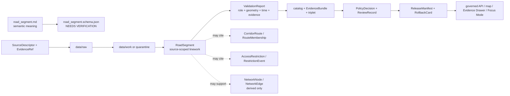

<!-- [KFM_META_BLOCK_V2]
doc_id: kfm://doc/contracts-domains-roads-rail-trade-road-segment
title: Road Segment Contract — Roads / Rail / Trade Routes
type: semantic-contract
version: v0.2
status: draft; PROPOSED; schema-missing; slug-CONFLICTED; NEEDS VERIFICATION before promotion
owners:
  - OWNER_TBD — Roads/Rail/Trade Routes domain steward
  - OWNER_TBD — Roads steward
  - OWNER_TBD — Contracts steward
  - OWNER_TBD — Source steward
  - OWNER_TBD — Evidence steward
  - OWNER_TBD — Schema steward
  - OWNER_TBD — Policy steward
  - OWNER_TBD — Release steward
  - OWNER_TBD — Docs steward
created: NEEDS VERIFICATION — scaffold existed before v0.2 expansion
updated: 2026-06-23
policy_label: public; contracts; roads-rail-trade; road-segment; road-linework-evidence; source-role-aware; temporal-scope-aware; evidence-bound; route-membership-separated; administration-boundary-aware; legal-status-boundary-aware; hydrology-boundary-aware; hazard-boundary-aware; graph-derived; release-gated; rollback-aware; not-road-authority; not-legal-access; not-live-routing; not-emergency-alert; not-publication-authority
tags: [kfm, contracts, roads-rail-trade, road-segment, road-linework, inherited-road, modern-road, corridor-route, route-membership, crossing, bridge, ferry, river-crossing, access-restriction, restriction-event, status-event, route-event, operator-assignment, network-edge, network-node, EvidenceBundle, PolicyDecision, ReviewRecord, ReleaseManifest, RollbackCard, spec_hash]
related:
  - ./README.md
  - ./rail_segment.md
  - ./corridor_route.md
  - ./route_membership.md
  - ./crossing.md
  - ./bridge.md
  - ./river_crossing.md
  - ./ferry.md
  - ./transport_facility.md
  - ./operator_status.md
  - ./operator_assignment.md
  - ./route_event.md
  - ./status_event.md
  - ./access_restriction.md
  - ./restriction_event.md
  - ./network_node.md
  - ./network_edge.md
  - ./historic_route_claim.md
  - ./trade_route_corridor.md
  - ./movement_story_node.md
  - ./domain_observation.md
  - ./domain_feature_identity.md
  - ./domain_validation_report.md
  - ./domain_layer_descriptor.md
  - ../roads/README.md
  - ../../../docs/domains/roads-rail-trade/README.md
  - ../../../docs/domains/roads-rail-trade/CANONICAL_PATHS.md
  - ../../../docs/domains/roads-rail-trade/OBJECT_FAMILIES.md
  - ../../../docs/domains/roads-rail-trade/IDENTITY_MODEL.md
  - ../../../docs/domains/roads-rail-trade/DATA_LIFECYCLE.md
  - ../../../docs/domains/roads-rail-trade/sublanes/roads.md
  - ../../../docs/domains/roads-rail-trade/sublanes/rail.md
  - ../../../docs/domains/roads-rail-trade/sublanes/trade-routes.md
  - ../../../docs/domains/roads-rail-trade/GRAPH_PROJECTIONS.md
  - ../../../docs/domains/roads-rail-trade/MAP_UI_CONTRACTS.md
  - ../../../docs/runbooks/roads-rail-trade/PROMOTION_RUNBOOK.md
  - ../../../docs/runbooks/roads-rail-trade/ROLLBACK_RUNBOOK.md
  - ../../../schemas/contracts/v1/domains/roads-rail-trade/road_segment.schema.json
  - ../../../policy/domains/roads-rail-trade/
  - ../../../fixtures/domains/roads-rail-trade/road_segment/
  - ../../../tests/domains/roads-rail-trade/
  - ../../../release/candidates/roads-rail-trade/
notes:
  - "Expanded from a PROPOSED scaffold at contracts/domains/roads-rail-trade/road_segment.md."
  - "A paired schema at schemas/contracts/v1/domains/roads-rail-trade/road_segment.schema.json was not found in this task. Field realization remains PROPOSED."
  - "The domain README names Road Segment as modern and inherited road linework as evidence, not authority over administration."
  - "The roads sublane names Road Segment as the canonical road-edge evidence object carrying source role, geometry fingerprint, times, and EvidenceRef closure, while route membership, corridor route, restriction/status/operator events, hydrology, hazards, cultural claims, and legal status remain separate."
  - "Object-family doctrine names Road Segment as road-segment evidence or released derivative, with source id + object role + temporal scope + normalized digest as the PROPOSED identity basis."
  - "This contract defines source-scoped road-segment meaning. It does not prove road administration, legal designation, jurisdiction, public/private access, live routing, emergency status, hazard truth, graph truth, or publication approval."
  - "The Roads / Rail / Trade Routes docs record a slug conflict between roads-rail-trade and transport for contract/schema homes. This file preserves the observed requested path and does not resolve the ADR question."
[/KFM_META_BLOCK_V2] -->

<a id="top"></a>

# Road Segment Contract — Roads / Rail / Trade Routes

> Semantic contract for `road_segment`: the evidence-bound modern, inherited, administrative, observed, or released derivative road linework segment asserted by a source within Roads / Rail / Trade Routes — without becoming road-administration authority, legal designation, public/private access truth, live routing, emergency alerting, graph truth, map truth, or publication approval.

<p>
  
  
  
  
  
  
  
</p>

`contracts/domains/roads-rail-trade/road_segment.md`

## Quick jumps

[Status](#status) · [Meaning](#meaning) · [Repo fit](#repo-fit) · [Schema posture](#schema-posture) · [Accepted uses](#accepted-uses) · [Exclusions](#exclusions) · [Recommended fields](#recommended-fields) · [Invariants](#invariants) · [Road segment families](#road-segment-families) · [Source-role and time rules](#source-role-and-time-rules) · [Lifecycle](#lifecycle) · [Validation](#validation) · [Rollback](#rollback) · [Evidence basis](#evidence-basis) · [Open questions](#open-questions)

---

## Status

> [!IMPORTANT]
> **Status:** `draft` / semantic contract  
> **Owner:** `OWNER_TBD`  
> **Contract path:** `contracts/domains/roads-rail-trade/road_segment.md`  
> **Schema path:** `schemas/contracts/v1/domains/roads-rail-trade/road_segment.schema.json` — **not found in this task**  
> **Truth posture:** target path and prior scaffold are confirmed from current repo evidence. `Road Segment` is confirmed in the Roads / Rail / Trade Routes domain README, object-family dossier, and roads sublane. Exact schema fields, validator behavior, fixture coverage, source registry behavior, route-membership behavior, administration/legal-status behavior, graph behavior, policy behavior, release manifests, public API behavior, map rendering, and runtime behavior remain **NEEDS VERIFICATION**.

> [!CAUTION]
> This contract defines road-segment meaning only. It does **not** prove road administration, jurisdiction, legal designation, public/private access, right-of-way, current open/closed status, emergency detour status, safety, routing suitability, hazard cause, hydrology condition, map/API behavior, or publication approval.

---

## Meaning

`road_segment` records a source-scoped road edge, road linework segment, inherited road alignment, or released road derivative in Roads / Rail / Trade Routes.

It may represent that a source asserts or supports a road segment such as:

- a road centerline, road edge, highway segment, county road, street segment, inherited alignment, administrative linework, truck-route segment, bridge approach, crossing approach, ferry approach, or candidate road segment;
- a segment that participates in `CorridorRoute`, `RouteMembership`, `Freight Corridor`, `HistoricRouteClaim`, or `TradeRouteCorridor` context;
- a segment related to `Crossing`, `Bridge`, `River Crossing`, `Ferry`, rest area, port-of-entry, weigh station, or other road-aligned `TransportFacility` evidence;
- a segment cited by `OperatorAssignment`, `OperatorStatus`, `AccessRestriction`, `RestrictionEvent`, `RouteEvent`, or `StatusEvent` records;
- a source object that may support derived `NetworkNode`, `NetworkEdge`, map layer, Evidence Drawer, Focus Mode, or Movement Story Node surfaces after governance gates pass.

The road segment contract owns the **transport-side road linework segment**: what source says about a bounded road object, with source role, time scope, identity envelope, geometry support, evidence refs, policy posture, review state, release state, and rollback target. It does not own route designation, route membership, road administration, legal access, jurisdiction, hazard truth, hydrology truth, land/title facts, cultural/historic route truth, graph topology, map rendering, or public release authority.

---

## Repo fit

| Responsibility | Path or root | Relationship |
|---|---|---|
| Parent contract lane | `./README.md` | Defines this folder as semantic contracts only. |
| Rail segment companion | `./rail_segment.md` | Parallel rail-side contract; not a replacement for road segment. |
| Route/corridor contracts | `./corridor_route.md`, `./route_membership.md`, `./freight_corridor.md`, `./historic_route_claim.md`, `./trade_route_corridor.md` | Road segment may support routes/corridors; those relationships remain separate. |
| Crossing/facility contracts | `./crossing.md`, `./bridge.md`, `./river_crossing.md`, `./ferry.md`, `./transport_facility.md` | Road segment may cite these, but they keep their own semantics and ownership boundaries. |
| Operator/status/restriction contracts | `./operator_status.md`, `./operator_assignment.md`, `./access_restriction.md`, `./restriction_event.md`, `./route_event.md`, `./status_event.md` | Administration, restriction, event, and status semantics remain separate. |
| Graph contracts | `./network_node.md`, `./network_edge.md` | Graph projections derive from road-segment evidence but do not replace it. |
| Roads sublane | `../../../docs/domains/roads-rail-trade/sublanes/roads.md` | Names road-specific realizations, non-ownership boundaries, and route/membership separation. |
| Object families | `../../../docs/domains/roads-rail-trade/OBJECT_FAMILIES.md` | Names Road Segment and its PROPOSED identity basis. |
| Identity model | `../../../docs/domains/roads-rail-trade/IDENTITY_MODEL.md` | Defines deterministic identity envelope and `spec_hash` posture. |
| Data lifecycle | `../../../docs/domains/roads-rail-trade/DATA_LIFECYCLE.md` | Defines RAW→PUBLISHED lifecycle, trust membrane, graph derivation, and release gates. |
| Schemas | `../../../schemas/contracts/v1/domains/roads-rail-trade/` or ADR-selected alternate | Machine shape; paired schema missing in this task. |
| Policy | `../../../policy/domains/roads-rail-trade/` or ADR-selected alternate | Allow/deny/restrict/abstain decisions and sensitivity handling. |
| Fixtures/tests | `../../../fixtures/domains/roads-rail-trade/`, `../../../tests/domains/roads-rail-trade/` | Behavior proof; not contract prose. |
| Release/rollback | `../../../release/candidates/roads-rail-trade/` and release roots | Promotion, release, correction, rollback, and derivative invalidation. |

---

## Schema posture

A direct paired schema was checked at:

```text
schemas/contracts/v1/domains/roads-rail-trade/road_segment.schema.json
```

That file was **not found** in this task.

> [!WARNING]
> Because no paired schema was confirmed, every field below is **PROPOSED** semantic guidance. Do not treat it as machine-enforced until schema, fixtures, validator, source registry records, policy tests, release checks, governed API behavior, map behavior, graph behavior, and runtime behavior are verified.

---

## Accepted uses

| Use | Allowed? | Rule |
|---|---:|---|
| Recording road linework evidence or released derivative | Yes | Must preserve source role, time scope, identity, geometry support, evidence, and limitations. |
| Supporting route/corridor membership | Yes | Use `RouteMembership`/`CorridorRoute` refs; do not embed route truth in the segment. |
| Supporting crossings, bridges, ferries, river crossings, and road facilities | Conditional | Use refs; do not absorb infrastructure, hydrology, hazard, or facility identity. |
| Supporting operator/jurisdiction/status/restriction records | Conditional | Use separate contracts and valid-time discipline. |
| Supporting public map/Focus Mode display | Conditional | Requires EvidenceBundle, PolicyDecision, ReviewRecord, ReleaseManifest, correction path, and RollbackCard. |
| Supporting graph projections | Conditional | `NetworkNode`/`NetworkEdge` are derived and rollbackable. |
| Proving road administration, legal designation, public access, route legality, current closure, or safety | No | Requires separate authoritative evidence and policy review; often should abstain or deny. |
| Acting as live routing, emergency alerting, detour, or permit advice | No | KFM is not live routing or emergency authority under this contract. |

---

## Exclusions

`road_segment` must not be used as:

| Misuse | Required outcome |
|---|---|
| Route designation or route membership proof | Use `corridor_route.md` and `route_membership.md`; do not flatten route into segment. |
| Road administration/jurisdiction authority | Use OperatorAssignment/OperatorStatus or authoritative administrative source refs with policy/release support. |
| Legal public/private access truth | `ABSTAIN` unless authoritative legal/source support and release posture exist. |
| Live closure, routing, detour, or emergency alert | `DENY`; use separately governed live/safety systems if ever approved. |
| Bridge/ferry/river-crossing truth | Use related crossing/facility contracts and owning domains. |
| Hydrology or hazard truth | Cite Hydrology or Hazards; do not author water/flood/fire/smoke cause here. |
| Land/title or right-of-way proof | Cite People/Land/legal authority; road segment geometry is not title proof. |
| Graph canonical truth | Graph nodes/edges are derived; EvidenceBundle and segment records outrank projections. |
| Public API/map payload by itself | Use governed API/released artifacts only. |
| Publication approval | ReleaseManifest, ReviewRecord, PolicyDecision, correction path, and RollbackCard remain separate. |

---

## Recommended fields

The following fields are **PROPOSED** until a schema is added and validated.

| Field | Meaning |
|---|---|
| `id` | Canonical road-segment identifier. |
| `version` | Contract/object version. |
| `spec_hash` | Deterministic hash over normalized road-segment identity/content envelope. |
| `domain` | Expected value: `roads-rail-trade` unless ADR selects another slug. |
| `segment_name` | Source-stated or normalized road/street/highway label, if any. |
| `segment_type` | Highway, county road, street, inherited road, truck-route segment, approach, ramp, bridge approach, ferry approach, candidate, or source-specific type. |
| `source_ref` | SourceDescriptor/source registry reference. |
| `source_role` | Accepted source role; must be preserved from admission through publication. |
| `source_native_id` | Source-native segment, road, route, asset, geometry, or feature ID. |
| `evidence_refs` | EvidenceRefs or EvidenceBundle refs. |
| `geometry_ref` | Geometry reference or generalized geometry ref. Not sufficient identity by itself. |
| `geometry_fingerprint` | PROPOSED geometry fingerprint or normalized digest component. |
| `precision_statement` | Statement of supported positional precision and source limitations. |
| `valid_time` | Interval during which the source asserts the segment/alignment applies. |
| `source_time` | Source creation, publication, map, feed, inventory, filing, or update time. |
| `retrieval_time` | KFM retrieval/freeze time. |
| `release_time` | KFM governed release time, if released. |
| `corridor_route_refs` | CorridorRoute refs associated with this segment. |
| `route_membership_refs` | RouteMembership refs attaching the segment to routes/corridors. |
| `crossing_refs` | Crossing, bridge, river crossing, ferry, or facility refs, if separate. |
| `facility_refs` | Road-aligned TransportFacility refs, if separate. |
| `operator_assignment_refs` | OperatorAssignment refs, if separately supported. |
| `operator_status_refs` | OperatorStatus refs, if separately supported. |
| `restriction_refs` | AccessRestriction or RestrictionEvent refs, if separately supported. |
| `route_event_refs` | RouteEvent or StatusEvent refs, if separately supported. |
| `network_node_refs` | Derived NetworkNode refs, if materialized. |
| `network_edge_refs` | Derived NetworkEdge refs, if materialized. |
| `sensitivity_label` | Sensitivity/policy tier inherited from source and cross-lane context. |
| `generalization_ref` | Aggregation/generalization transform/receipt ref, if public geometry differs from source geometry. |
| `policy_decision_ref` | PolicyDecision governing use or publication. |
| `review_ref` | ReviewRecord or steward review ref. |
| `release_manifest_ref` | ReleaseManifest for public/semi-public exposure. |
| `rollback_ref` | RollbackCard or rollback target. |
| `limitations` | Caveats: road linework evidence only; not administration, legal access, route designation, live routing, hazard truth, graph truth, or release authority. |

---

## Invariants

1. **Road segment is evidence-bound.** It records source-supported road linework or released derivative semantics, not sovereign road truth.
2. **Identity is not geometry alone.** Geometry can be content, but identity must include source, role, temporal scope, and normalized digest.
3. **Segment is not route.** Route designation and membership remain in `CorridorRoute` and `RouteMembership` records.
4. **Administration is separate.** Jurisdiction, operator, owner, maintainer, and legal status require separate source-scoped records.
5. **Access is separate.** Public/private status, right-of-way, restrictions, closures, and legal routing are not inferred from linework.
6. **Cross-lane truth stays separate.** Hydrology, Hazards, Settlements/Infrastructure, Archaeology/Cultural Heritage, People/Land, and legal/title sources remain owning lanes.
7. **Graph is derived.** Network nodes and edges may be derived from road segments, but graph projections do not replace segment evidence.
8. **Source role is preserved.** Regulatory, administrative, observed, modeled, aggregate, candidate, context, and synthetic sources do not collapse into one authority posture.
9. **Publication requires gates.** Public display requires EvidenceBundle, PolicyDecision, ReviewRecord, ReleaseManifest, correction path, and RollbackCard.

---

## Road segment families

| Segment family | Meaning | Special guardrail |
|---|---|---|
| `modern_road_centerline` | Source asserts current or contemporary road centerline/edge. | Not proof of public access, jurisdiction, or open status by itself. |
| `highway_segment` | Source asserts highway or state/federal route linework. | Route designation and membership remain separate. |
| `county_or_local_road_segment` | Source asserts county, municipal, township, or local road linework. | Administration/jurisdiction must be separately supported. |
| `street_segment` | Source asserts street or urban road linework. | Legal access and maintenance status remain separate. |
| `truck_or_freight_context_segment` | Segment appears in freight/truck-route context. | Context is not legal truck routing or permit advice. |
| `approach_segment` | Segment approaches a bridge, ferry, river crossing, intersection, facility, or route node. | Crossing/facility semantics remain separate. |
| `historic_or_inherited_alignment_segment` | Source asserts inherited, former, or historically relevant road alignment. | Preserve uncertainty and avoid current-status wording. |
| `candidate_segment` | OCR, map label, model, graph, or connector proposes a road segment. | Candidate until reviewed; no public truth without evidence and policy gates. |
| `released_public_segment` | Segment included in a governed public roads layer. | Requires release manifest and rollback target. |

---

## Source-role and time rules

Road-segment records must carry source role and time as core meaning.

| Rule | Requirement |
|---|---|
| Source role is fixed at admission | Promotion never turns a context layer, map label, OSM/GNIS record, feed prefilter, or model output into road authority. |
| Geometry is not enough | Similar road centerlines from different sources, vintages, roles, or rights remain distinct until reconciled by governed process. |
| Segment valid time is distinct | The period asserted by the source, source publication/update time, KFM retrieval time, review time, and release time are separate. |
| Current-looking geometry is not current access | Road linework does not prove open status, public/private status, jurisdiction, safety, route legality, or emergency condition. |
| Route membership remains a relationship | A segment participating in US-50, K-4, a truck route, or a historic corridor does not become the route itself. |
| Cross-lane evidence stays cited | Settlements/Infrastructure, Hydrology, Hazards, People/Land, Archaeology/Cultural Heritage, and legal/title sources are cited through governed refs, not absorbed. |
| Release time is explicit | Public display must cite the release artifact and rollback target. |

---

## Lifecycle



Contracts describe meaning. They do not move data, validate schemas, execute source reconciliation, make policy decisions, close evidence, perform review, publish artifacts, render maps, prove road administration, provide live routing, or authorize AI answers.

---

## Validation

Before this contract is treated as mature, maintainers should verify:

- [ ] the ADR-selected contract/schema slug and whether this file should remain under `contracts/domains/roads-rail-trade/` or migrate to `contracts/transport/`;
- [ ] paired schema exists and includes segment type, source role, source-native ID, geometry refs, geometry fingerprint, precision statement, time axes, route/corridor refs, operator/status refs, restriction refs, evidence, policy, review, release, and rollback refs;
- [ ] fixtures cover modern road centerlines, highways, county/local roads, streets, truck/freight context segments, crossing approaches, historic/inherited alignments, candidate segments, and released public segments;
- [ ] tests prevent road segments from proving route designation, route membership, jurisdiction, operator/maintainer status, public/private access, legal routing, closure status, hazard truth, or hydrology truth;
- [ ] tests preserve source role and time distinctions across regulatory, administrative, observed, modeled, aggregate, candidate, context, and synthetic sources;
- [ ] tests prevent geometry-only identity collapse and require deterministic `spec_hash` posture;
- [ ] tests prove graph projections derive from road-segment evidence and rollback/rebuild without rewriting segment truth;
- [ ] public DTOs and map/Focus Mode payloads require EvidenceBundle, PolicyDecision, ReviewRecord, ReleaseManifest, correction path, and RollbackCard;
- [ ] rollback invalidates derived layer descriptors, graph projections, API payloads, exports, Focus Mode states, movement story nodes, caches, and AI summaries that cited the segment.

---

## Rollback

Rollback or correction is required when this contract:

- claims road-segment schema, policy, fixtures, tests, source registry, lifecycle data, release, API, UI, graph, route-membership, or runtime behavior exists without proof;
- hides the `roads-rail-trade` vs `transport` slug conflict;
- treats road segment geometry as identity, route designation, legal access, safety, public/private status, jurisdiction, ownership proof, route legality, graph truth, or publication approval;
- lets a regulatory/admin/context/map/model/candidate source become stronger authority without evidence and review;
- collapses road segment, route membership, corridor route, operator assignment/status, access restriction, crossing/bridge/river crossing/ferry, hydrology, hazard, cultural corridor, or graph node/edge into one object;
- publishes or renders unsupported road segments through maps, graph views, Focus Mode, exports, or AI narrative.

Rollback target: revert this file to prior scaffold blob SHA `5565d540ac4399cf35b919befb08d550459664d4`, record drift if authority boundaries were affected, and invalidate downstream derivatives that cited the weakened road-segment contract.

---

## Evidence basis

| Evidence | Status | Supports | Limit |
|---|---|---|---|
| Prior `contracts/domains/roads-rail-trade/road_segment.md` | `CONFIRMED` | Target file existed as a PROPOSED scaffold. | Scaffold did not define authoritative semantic contract content. |
| `schemas/contracts/v1/domains/roads-rail-trade/road_segment.schema.json` lookup | `CONFIRMED not found in this task` | Justifies `schema-missing` and PROPOSED field posture. | Does not rule out alternate schema homes such as `transport/`. |
| `docs/domains/roads-rail-trade/README.md` | `CONFIRMED term / PROPOSED field realization` | Names Road Segment as modern and inherited road linework as evidence, not authority over administration; confirms cross-lane non-ownership. | Field-level schema, validators, and runtime behavior remain NEEDS VERIFICATION. |
| `docs/domains/roads-rail-trade/sublanes/roads.md` | `CONFIRMED doctrine / PROPOSED road-specific realization` | Defines Road Segment as road-edge evidence with source role, geometry fingerprint, time, and EvidenceRef closure; separates route membership, corridor route, restrictions/events, cultural truth, hydrology, hazards, and legal status. | Does not prove schema, validator, runtime, or public API maturity. |
| `docs/domains/roads-rail-trade/OBJECT_FAMILIES.md` | `CONFIRMED term / PROPOSED field realization` | Names Road Segment as road-segment evidence/released derivative and gives PROPOSED deterministic identity basis. | Exact field set remains NEEDS VERIFICATION. |
| `docs/domains/roads-rail-trade/IDENTITY_MODEL.md` | `CONFIRMED doctrine / PROPOSED field realization` | Defines identity envelope and `spec_hash`; warns identity is not raw geometry alone. | Exact Road Segment digest fields remain NEEDS VERIFICATION. |
| `docs/domains/roads-rail-trade/DATA_LIFECYCLE.md` | `CONFIRMED doctrine / PROPOSED implementation` | Defines lifecycle, trust membrane, public access through governed APIs/manifests, and graph projections as derived. | Does not prove runtime, API, release, validator, or test maturity. |
| `contracts/domains/roads-rail-trade/rail_segment.md` | `CONFIRMED sibling contract` | Provides parallel segment-contract pattern and rail-side boundary language. | Rail-specific; does not define Road Segment schema. |
| Uploaded authoring prompt v2 | `CONFIRMED user-supplied guidance` | Requires evidence-grounded, visually polished, implementation-honest Markdown with verification and rollback posture. | Authoring guidance, not implementation proof. |

---

## Open questions

| ID | Question | Status |
|---|---|---|
| OQ-RRT-RSEG-01 | Should `road_segment.md` remain at `contracts/domains/roads-rail-trade/` or migrate to `contracts/transport/` after slug ADR resolution? | OPEN / ADR NEEDED |
| OQ-RRT-RSEG-02 | Which segment types, source roles, geometry fingerprint fields, precision fields, and route refs are canonical across modern, inherited, administrative, and candidate road evidence? | OPEN / SCHEMA REVIEW |
| OQ-RRT-RSEG-03 | What evidence threshold distinguishes road linework from legal route designation, public access, jurisdiction, or current open status? | OPEN / EVIDENCE REVIEW |
| OQ-RRT-RSEG-04 | How should road segment refs to bridge, ferry, river crossing, hydrology, hazard, facility, People/Land, and cultural records be modeled without ownership collapse? | OPEN / CROSS-LANE REVIEW |
| OQ-RRT-RSEG-05 | How should route membership and graph nodes/edges cite road segments without becoming a second canonical road-network store? | OPEN / GRAPH REVIEW |
| OQ-RRT-RSEG-06 | How should rollback invalidate maps, graph views, Focus Mode, exports, and AI summaries that cited a withdrawn road segment? | OPEN / RELEASE REVIEW |

<p align="right"><a href="#top">Back to top</a></p>
