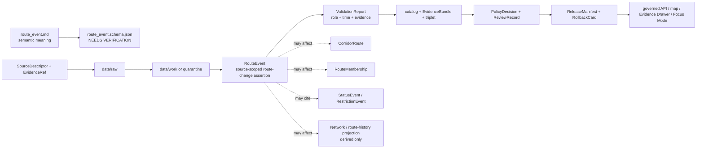

<!-- [KFM_META_BLOCK_V2]
doc_id: kfm://doc/contracts-domains-roads-rail-trade-route-event
title: Route Event Contract — Roads / Rail / Trade Routes
type: semantic-contract
version: v0.2
status: draft; PROPOSED; schema-missing; slug-CONFLICTED; event-form; NEEDS VERIFICATION before promotion
owners:
  - OWNER_TBD — Roads/Rail/Trade Routes domain steward
  - OWNER_TBD — Roads steward
  - OWNER_TBD — Rail steward
  - OWNER_TBD — Historic/trade-routes steward
  - OWNER_TBD — Contracts steward
  - OWNER_TBD — Source steward
  - OWNER_TBD — Evidence steward
  - OWNER_TBD — Schema steward
  - OWNER_TBD — Policy steward
  - OWNER_TBD — Release steward
  - OWNER_TBD — Docs steward
created: NEEDS VERIFICATION — scaffold existed before v0.2 expansion
updated: 2026-06-23
policy_label: public; contracts; roads-rail-trade; route-event; designation-event; redesignation-event; decommissioning-event; route-status-adjacent; time-bound-event; source-role-aware; temporal-scope-aware; evidence-bound; route-membership-separated; legal-status-boundary-aware; release-gated; rollback-aware; not-route-identity; not-route-membership; not-live-routing; not-legal-advice; not-publication-authority
tags: [kfm, contracts, roads-rail-trade, route-event, status-event, restriction-event, corridor-route, route-membership, road-segment, rail-segment, freight-corridor, historic-route-claim, trade-route-corridor, movement-story-node, source-role, valid-time, EvidenceBundle, PolicyDecision, ReviewRecord, ReleaseManifest, RollbackCard, spec_hash]
related:
  - ./README.md
  - ./status_event.md
  - ./restriction_event.md
  - ./access_restriction.md
  - ./operator_status.md
  - ./operator_assignment.md
  - ./corridor_route.md
  - ./route_membership.md
  - ./road_segment.md
  - ./rail_segment.md
  - ./freight_corridor.md
  - ./historic_route_claim.md
  - ./trade_route_corridor.md
  - ./movement_story_node.md
  - ./crossing.md
  - ./bridge.md
  - ./ferry.md
  - ./river_crossing.md
  - ./transport_facility.md
  - ./network_node.md
  - ./network_edge.md
  - ./domain_observation.md
  - ./domain_feature_identity.md
  - ./domain_validation_report.md
  - ./domain_layer_descriptor.md
  - ../roads/README.md
  - ../../../docs/domains/roads-rail-trade/README.md
  - ../../../docs/domains/roads-rail-trade/CANONICAL_PATHS.md
  - ../../../docs/domains/roads-rail-trade/OBJECT_FAMILIES.md
  - ../../../docs/domains/roads-rail-trade/IDENTITY_MODEL.md
  - ../../../docs/domains/roads-rail-trade/DATA_LIFECYCLE.md
  - ../../../docs/domains/roads-rail-trade/sublanes/roads.md
  - ../../../docs/domains/roads-rail-trade/sublanes/rail.md
  - ../../../docs/domains/roads-rail-trade/sublanes/trade-routes.md
  - ../../../docs/domains/roads-rail-trade/GRAPH_PROJECTIONS.md
  - ../../../docs/domains/roads-rail-trade/MAP_UI_CONTRACTS.md
  - ../../../docs/runbooks/roads-rail-trade/PROMOTION_RUNBOOK.md
  - ../../../docs/runbooks/roads-rail-trade/ROLLBACK_RUNBOOK.md
  - ../../../schemas/contracts/v1/domains/roads-rail-trade/route_event.schema.json
  - ../../../policy/domains/roads-rail-trade/
  - ../../../fixtures/domains/roads-rail-trade/route_event/
  - ../../../tests/domains/roads-rail-trade/
  - ../../../release/candidates/roads-rail-trade/
notes:
  - "Expanded from a PROPOSED scaffold at contracts/domains/roads-rail-trade/route_event.md."
  - "A paired schema at schemas/contracts/v1/domains/roads-rail-trade/route_event.schema.json was not found in this task. Field realization remains PROPOSED."
  - "The domain README names Route Event as designation, redesignation, decommissioning, etc."
  - "The roads sublane treats Route Event as a CONFIRMED term and describes StatusEvent as a PROPOSED realization of Route Event for operational state changes."
  - "Object-family doctrine names StatusEvent and RestrictionEvent as time-bound event/assertion families, while Route Event appears in the domain roster; this file preserves Route Event as the broader route-change event surface pending schema/ADR review."
  - "This contract defines source-scoped route-event meaning. It does not prove route identity, route membership, legal designation, public access, current status, restriction status, live routing, graph truth, or publication approval."
  - "The Roads / Rail / Trade Routes docs record a slug conflict between roads-rail-trade and transport for contract/schema homes. This file preserves the observed requested path and does not resolve the ADR question."
[/KFM_META_BLOCK_V2] -->

<a id="top"></a>

# Route Event Contract — Roads / Rail / Trade Routes

> Semantic contract for `route_event`: the source-scoped, time-bound assertion that a route, corridor, designation, membership context, line, road/rail route, freight corridor, historic route claim, or trade-route corridor was designated, redesignated, renamed, created, extended, realigned, transferred, decommissioned, superseded, retired, or otherwise changed — without becoming route identity, route membership, legal access authority, live routing, status/restriction truth, graph truth, map truth, or publication approval.

<p>
  
  
  
  
  
  
  
</p>

`contracts/domains/roads-rail-trade/route_event.md`

## Quick jumps

[Status](#status) · [Meaning](#meaning) · [Repo fit](#repo-fit) · [Schema posture](#schema-posture) · [Accepted uses](#accepted-uses) · [Exclusions](#exclusions) · [Recommended fields](#recommended-fields) · [Invariants](#invariants) · [Route event families](#route-event-families) · [Source-role and time rules](#source-role-and-time-rules) · [Lifecycle](#lifecycle) · [Validation](#validation) · [Rollback](#rollback) · [Evidence basis](#evidence-basis) · [Open questions](#open-questions)

---

## Status

> [!IMPORTANT]
> **Status:** `draft` / semantic contract  
> **Owner:** `OWNER_TBD`  
> **Contract path:** `contracts/domains/roads-rail-trade/route_event.md`  
> **Schema path:** `schemas/contracts/v1/domains/roads-rail-trade/route_event.schema.json` — **not found in this task**  
> **Truth posture:** target path and prior scaffold are confirmed from current repo evidence. `Route Event` is confirmed in the Roads / Rail / Trade Routes domain README as designation, redesignation, decommissioning, etc. Exact schema fields, validator behavior, fixture coverage, source registry behavior, route-membership behavior, legal-designation behavior, policy behavior, release manifests, public API behavior, map rendering, graph behavior, and runtime behavior remain **NEEDS VERIFICATION**.

> [!CAUTION]
> This contract defines route-event meaning only. It does **not** prove a route exists as a canonical entity, that a segment belongs to a route, that a route is legally open, that a designation is currently valid, that a restriction/status event applies, that a route is safe or routable, or that the event is approved for publication.

---

## Meaning

`route_event` records a source-scoped event assertion about a route or corridor changing through time.

It may represent that a source says a route or corridor was:

- designated, redesignated, renumbered, renamed, created, extended, shortened, realigned, transferred, merged, split, decommissioned, retired, abandoned, superseded, rescinded, or otherwise changed;
- associated with a `CorridorRoute`, `RouteMembership`, `Road Segment`, `Rail Segment`, `Freight Corridor`, `HistoricRouteClaim`, or `TradeRouteCorridor`;
- related to `StatusEvent`, `RestrictionEvent`, `AccessRestriction`, `OperatorAssignment`, or `OperatorStatus` records without replacing those records;
- cited by a `NetworkNode`, `NetworkEdge`, map layer, Evidence Drawer view, Focus Mode explanation, export, or `MovementStoryNode` after governance gates pass.

The route event contract owns the **event-form route-change assertion**: what source says changed, when, about which route/corridor/member context, with what source role, evidence refs, policy posture, review state, release state, and rollback target. It does not own route identity, segment identity, route membership, legal designation authority, access status, operator truth, restriction truth, graph topology, map rendering, or public release authority.

---

## Repo fit

| Responsibility | Path or root | Relationship |
|---|---|---|
| Parent contract lane | `./README.md` | Defines this folder as semantic contracts only. |
| Route/corridor contracts | `./corridor_route.md`, `./route_membership.md` | Route event may cite these, but route identity and membership remain separate. |
| Segment contracts | `./road_segment.md`, `./rail_segment.md` | Route event may affect or reference segments; it does not define segment truth. |
| Event companions | `./status_event.md`, `./restriction_event.md`, `./access_restriction.md` | Operational status and restriction events remain distinct event surfaces. |
| Operator companions | `./operator_assignment.md`, `./operator_status.md` | Operator assignment/status may be event-related but are not route-event truth. |
| Corridor/history companions | `./freight_corridor.md`, `./historic_route_claim.md`, `./trade_route_corridor.md` | Route event may contextualize corridor changes; claim/corridor semantics remain separate. |
| Graph contracts | `./network_node.md`, `./network_edge.md` | Graph projections may consume route events but remain derived. |
| Movement story node | `./movement_story_node.md` | Narrative may cite route events but remains evidence-subordinate. |
| Domain README | `../../../docs/domains/roads-rail-trade/README.md` | Names Route Event and cross-lane non-ownership rules. |
| Roads sublane | `../../../docs/domains/roads-rail-trade/sublanes/roads.md` | Confirms route/membership/segment separation and frames StatusEvent as a PROPOSED Route Event realization. |
| Object families | `../../../docs/domains/roads-rail-trade/OBJECT_FAMILIES.md` | Provides object-family spine, event-family context, and deterministic identity posture. |
| Schemas | `../../../schemas/contracts/v1/domains/roads-rail-trade/` or ADR-selected alternate | Machine shape; paired schema missing in this task. |
| Policy | `../../../policy/domains/roads-rail-trade/` or ADR-selected alternate | Allow/deny/restrict/abstain decisions and legal/safety boundaries. |
| Fixtures/tests | `../../../fixtures/domains/roads-rail-trade/`, `../../../tests/domains/roads-rail-trade/` | Behavior proof; not contract prose. |
| Release/rollback | `../../../release/candidates/roads-rail-trade/` and release roots | Promotion, release, correction, rollback, and derivative invalidation. |

---

## Schema posture

A direct paired schema was checked at:

```text
schemas/contracts/v1/domains/roads-rail-trade/route_event.schema.json
```

That file was **not found** in this task.

> [!WARNING]
> Because no paired schema was confirmed, every field below is **PROPOSED** semantic guidance. Do not treat it as machine-enforced until schema, fixtures, validator, policy tests, source registry records, release checks, governed API behavior, graph behavior, map behavior, and runtime behavior are verified.

---

## Accepted uses

| Use | Allowed? | Rule |
|---|---:|---|
| Recording a sourced route-change event | Yes | Must preserve source role, route/corridor refs, event type, valid time, source time, evidence, and limitations. |
| Explaining designation/redesignation/decommissioning history | Yes | Must stay time-scoped and source-scoped; no legal/status strengthening without support. |
| Linking to CorridorRoute or RouteMembership | Conditional | Use refs; never collapse event, route, and membership into one object. |
| Linking to status/restriction/operator events | Conditional | Each event/relation keeps its own contract and valid-time semantics. |
| Supporting Focus Mode or Evidence Drawer | Conditional | Requires EvidenceBundle, PolicyDecision, ReviewRecord, ReleaseManifest, correction path, and RollbackCard. |
| Supporting graph or route-history projections | Conditional | Downstream only; graph/corridor views must cite route-event evidence and remain rollbackable. |
| Certifying legal designation, current route status, route availability, or access | No | Requires separate authoritative source and policy/release support; default to ABSTAIN when insufficient. |
| Acting as live routing, navigation, detour, emergency, or safety advice | No | KFM is not live routing or public-safety authority under this contract. |

---

## Exclusions

`route_event` must not be used as:

| Misuse | Required outcome |
|---|---|
| CorridorRoute replacement | Use `corridor_route.md` for route/corridor entity semantics. |
| RouteMembership replacement | Use `route_membership.md` for sourced segment-to-route membership. |
| Road/Rail Segment replacement | Segment identity remains in segment contracts. |
| StatusEvent or RestrictionEvent replacement | Operational state and restriction changes remain distinct event surfaces. |
| Legal designation or access certification | `ABSTAIN` unless authoritative legal/source support and release posture exist. |
| Live route status or detour advice | `DENY`; use separately governed live/safety systems if ever approved. |
| Operator status or ownership proof | Use OperatorAssignment/OperatorStatus and legal/entity refs. |
| Graph canonical truth | Network projections are derived and rollbackable. |
| Public API/map payload by itself | Use governed API/released artifacts only. |
| Publication approval | ReleaseManifest, ReviewRecord, PolicyDecision, correction path, and RollbackCard remain separate. |

---

## Recommended fields

The following fields are **PROPOSED** until a schema is added and validated.

| Field | Meaning |
|---|---|
| `id` | Canonical route-event identifier. |
| `version` | Contract/object version. |
| `spec_hash` | Deterministic hash over normalized route-event content. |
| `domain` | Expected value: `roads-rail-trade` unless ADR selects another slug. |
| `event_type` | Designation, redesignation, renumbering, naming, creation, extension, realignment, transfer, merger, split, decommissioning, retirement, abandonment, supersession, rescission, candidate event, or source-specific type. |
| `event_role` | Begins, ends, changes, confirms, proposes, supersedes, rescinds, or records a route/corridor change. |
| `event_statement` | Source-scoped event statement being preserved. |
| `route_ref` | CorridorRoute or route/corridor ref affected by the event. |
| `route_membership_refs` | RouteMembership refs affected or created by the event, if separately materialized. |
| `affected_object_refs` | Segment, crossing, facility, corridor, membership, operator/status, or graph refs affected by the event. |
| `source_ref` | SourceDescriptor/source registry reference. |
| `source_role` | Accepted source role; must be preserved from admission through publication. |
| `source_native_id` | Source-native event, route, designation, segment, filing, map, or inventory ID. |
| `evidence_refs` | EvidenceRefs or EvidenceBundle refs. |
| `valid_time` | Interval during which the event's route/corridor effect is asserted to apply. |
| `event_time` | Time the event happened or is said to happen, if distinct from valid interval. |
| `source_time` | Source creation, publication, filing, map, roster, bulletin, or update time. |
| `retrieval_time` | KFM retrieval/freeze time. |
| `release_time` | KFM governed release time, if released. |
| `supersedes_ref` | Prior route event or route state superseded by this record, if any. |
| `superseded_by_ref` | Later route event replacing this one, if any. |
| `status_event_ref` | StatusEvent ref, if a separate operational/status change exists. |
| `restriction_event_ref` | RestrictionEvent ref, if a restriction change exists. |
| `operator_assignment_ref` | OperatorAssignment ref, if a transfer/assignment relation exists separately. |
| `legal_authority_ref` | Legal/source authority ref, where policy permits and source supports it. |
| `network_effect_ref` | Derived graph or route-history effect ref, if graph projection uses this event. |
| `sensitivity_label` | Sensitivity/policy tier inherited from source and affected objects. |
| `policy_decision_ref` | PolicyDecision governing use or publication. |
| `review_ref` | ReviewRecord or steward review ref. |
| `release_manifest_ref` | ReleaseManifest for public/semi-public exposure. |
| `rollback_ref` | RollbackCard or rollback target. |
| `limitations` | Caveats: route event only; not route identity, route membership, legal designation, current status, access, live routing, graph truth, or release authority. |

---

## Invariants

1. **Route event is time-bound.** It records a sourced change/assertion about a route or corridor, not all route truth.
2. **Event is not route identity.** The route as an entity belongs in `CorridorRoute` or related route/corridor contracts.
3. **Event is not membership.** Segment-to-route membership belongs in `RouteMembership`; the event may cite or trigger membership records.
4. **Event is not legal access.** Legal designation, public/private status, and access require authoritative support and policy review.
5. **Event is not live routing.** A route event is not a detour, live routing instruction, service guarantee, or safety advisory.
6. **Status/restriction stay separate.** Operational status, construction state, closure, weight/height limit, or permit condition belong in separate status/restriction records.
7. **Source role is preserved.** Statutes, agency logs, maps, inventories, local histories, OCR hits, and model outputs do not collapse into one authority posture.
8. **Graph is derived.** Network and route-history projections may derive from route events but do not replace them.
9. **Publication requires gates.** Public display requires EvidenceBundle, PolicyDecision, ReviewRecord, ReleaseManifest, correction path, and RollbackCard.

---

## Route event families

| Event family | Meaning | Special guardrail |
|---|---|---|
| `designation_event` | Source asserts a route/corridor designation begins or is adopted. | Not legal/current validity proof unless authoritative and time-scoped. |
| `redesignation_event` | Source asserts route number/name/class changes. | Preserve old/new refs and valid-time distinctions. |
| `realignment_event` | Source asserts a route alignment changes. | RouteMembership/segment refs remain separate. |
| `extension_or_truncation_event` | Source asserts route length/scope changes. | Do not infer segment membership without support. |
| `transfer_or_jurisdiction_event` | Source asserts responsibility/control/agency relation changes. | OperatorAssignment/OperatorStatus and legal/entity truth remain separate. |
| `decommissioning_event` | Source asserts route/corridor is retired, abandoned, removed, or superseded. | Not proof of physical segment removal or legal access change by itself. |
| `historic_route_event` | Historic source asserts event in historic route/corridor development. | Preserve uncertainty and claim-not-fact posture. |
| `candidate_route_event` | OCR, map label, model, graph, or connector proposes an event. | Candidate until reviewed; no public truth without evidence/policy gates. |
| `supersession_route_event` | Event supersedes or is superseded by another route event or route state. | Preserve supersession lineage and rollback impact. |

---

## Source-role and time rules

Route-event records must carry source role and time as core meaning.

| Rule | Requirement |
|---|---|
| Source role is fixed at admission | Promotion never turns a map label, OCR hit, local-history note, administrative list, or model output into authoritative route law. |
| Event time is not release time | Event time, valid interval, source publication/update time, KFM retrieval time, review time, and release time are separate. |
| Route event is distinct from route membership | A designation/redesignation may affect membership, but membership records must carry their own evidence and time scope. |
| Route event is distinct from status/restriction | Open/closed/restricted/under-construction and access limits belong in status/restriction records. |
| Cross-lane evidence stays cited | Legal, People/Land, Settlements/Infrastructure, Hydrology, Hazards, Archaeology/Cultural Heritage, and agency evidence is cited through governed refs, not absorbed. |
| Release time is explicit | Public display must cite the release artifact and rollback target. |

---

## Lifecycle



Contracts describe meaning. They do not move data, validate schemas, execute source ingestion, make policy decisions, close evidence, perform review, publish artifacts, render maps, certify legal route status, provide live routing, or authorize AI answers.

---

## Validation

Before this contract is treated as mature, maintainers should verify:

- [ ] the ADR-selected contract/schema slug and whether this file should remain under `contracts/domains/roads-rail-trade/` or migrate to `contracts/transport/`;
- [ ] paired schema exists and includes event type, event role, route refs, membership refs, affected object refs, source role, time axes, evidence, policy, review, release, and rollback refs;
- [ ] fixtures cover designation, redesignation, renumbering, realignment, extension/truncation, transfer/jurisdiction, decommissioning, historic route events, candidate events, and supersession events;
- [ ] tests prevent route events from becoming CorridorRoute, RouteMembership, Road/Rail Segment, StatusEvent, RestrictionEvent, OperatorAssignment, EvidenceBundle, PolicyDecision, ReviewRecord, or ReleaseManifest objects;
- [ ] tests prevent route events from proving legal access, current open/closed status, route safety, live routing, or public/private access without owning evidence and policy support;
- [ ] tests preserve source role and time distinctions across statutes, agency inventories, maps, local histories, OCR/model candidates, and historical sources;
- [ ] graph tests prove route-event effects remain derived and rollbackable;
- [ ] public DTOs and map/Focus Mode payloads require EvidenceBundle, PolicyDecision, ReviewRecord, ReleaseManifest, correction path, and RollbackCard;
- [ ] rollback invalidates derived route history, graph projections, layer descriptors, API payloads, exports, Focus Mode states, movement story nodes, caches, and AI summaries that cited the event.

---

## Rollback

Rollback or correction is required when this contract:

- claims route-event schema, policy, fixtures, tests, source registry, lifecycle data, release, API, UI, graph, legal-designation, or runtime behavior exists without proof;
- hides the `roads-rail-trade` vs `transport` slug conflict;
- treats a route event as route identity, route membership, legal designation, public/private access status, current route status, safety advice, live routing, graph truth, or publication approval;
- lets a map label, OCR hit, local history note, administrative list, or modeled output become authoritative route-event truth without evidence and review;
- collapses route event, corridor route, route membership, road/rail segment, status event, restriction event, operator assignment/status, legal authority, or graph effect into one object;
- publishes or renders unsupported route events through maps, graph filters, Focus Mode, exports, or AI narrative.

Rollback target: revert this file to prior scaffold blob SHA `fb19a2fe7fda8fce10cb7e46f94bec3a888a7c98`, record drift if authority boundaries were affected, and invalidate downstream derivatives that cited the weakened route-event contract.

---

## Evidence basis

| Evidence | Status | Supports | Limit |
|---|---|---|---|
| Prior `contracts/domains/roads-rail-trade/route_event.md` | `CONFIRMED` | Target file existed as a PROPOSED scaffold. | Scaffold did not define authoritative semantic contract content. |
| `schemas/contracts/v1/domains/roads-rail-trade/route_event.schema.json` lookup | `CONFIRMED not found in this task` | Justifies `schema-missing` and PROPOSED field posture. | Does not rule out alternate schema homes such as `transport/`. |
| `docs/domains/roads-rail-trade/README.md` | `CONFIRMED term / PROPOSED field realization` | Names Route Event as designation, redesignation, decommissioning, etc.; confirms cross-lane non-ownership. | Field-level schema, validators, and runtime behavior remain NEEDS VERIFICATION. |
| `docs/domains/roads-rail-trade/sublanes/roads.md` | `CONFIRMED doctrine / PROPOSED road-specific realization` | Confirms Route Event term, StatusEvent as PROPOSED Route Event realization, and route / membership / segment separation. | Does not prove RouteEvent schema, validator, runtime, or public API maturity. |
| `docs/domains/roads-rail-trade/OBJECT_FAMILIES.md` | `CONFIRMED object-family spine / PROPOSED field realization` | Establishes source-role/time-aware identity basis and adjacent event families; retains several related terms pending reconciliation. | Route Event is in domain roster, while exact object-family/schema realization remains NEEDS VERIFICATION. |
| `contracts/domains/roads-rail-trade/restriction_event.md` | `CONFIRMED sibling contract` | Provides adjacent event-form pattern and restriction/status boundary language. | Restriction-specific; does not define RouteEvent schema. |
| `contracts/domains/roads-rail-trade/status_event.md` | `CONFIRMED sibling scaffold` | Confirms adjacent planned StatusEvent path exists as scaffold. | Does not define StatusEvent or RouteEvent schema. |
| Uploaded authoring prompt v2 | `CONFIRMED user-supplied guidance` | Requires evidence-grounded, visually polished, implementation-honest Markdown with verification and rollback posture. | Authoring guidance, not implementation proof. |

---

## Open questions

| ID | Question | Status |
|---|---|---|
| OQ-RRT-REV-01 | Should `route_event.md` remain at `contracts/domains/roads-rail-trade/` or migrate to `contracts/transport/` after slug ADR resolution? | OPEN / ADR NEEDED |
| OQ-RRT-REV-02 | Which route-event types and roles are canonical across road, rail, freight, historic route, trade-route, and administrative contexts? | OPEN / SCHEMA REVIEW |
| OQ-RRT-REV-03 | How should `RouteEvent` relate to `StatusEvent`, `RestrictionEvent`, `CorridorRoute`, and `RouteMembership` without collapsing event semantics? | OPEN / DOMAIN REVIEW |
| OQ-RRT-REV-04 | Which source families can support public route-designation events, and which remain candidate/review-only due to rights, authority, or legal-status risk? | OPEN / SOURCE + POLICY REVIEW |
| OQ-RRT-REV-05 | How should public-safe wording prevent route events from being mistaken for legal access, current route status, or live routing advice? | OPEN / UI + POLICY REVIEW |
| OQ-RRT-REV-06 | How should rollback invalidate route-history projections, maps, Focus Mode states, exports, and AI summaries that cited a withdrawn route event? | OPEN / RELEASE REVIEW |

<p align="right"><a href="#top">Back to top</a></p>
