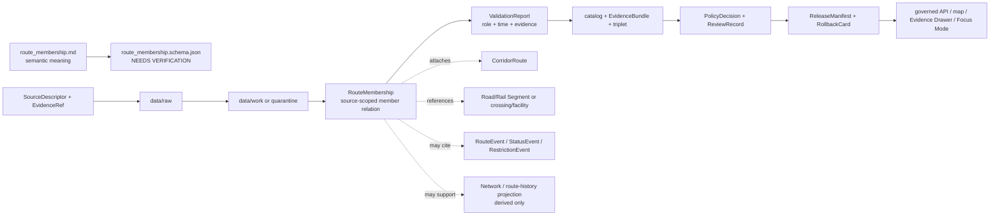

<!-- [KFM_META_BLOCK_V2]
doc_id: kfm://doc/contracts-domains-roads-rail-trade-route-membership
title: Route Membership Contract — Roads / Rail / Trade Routes
type: semantic-contract
version: v0.2
status: draft; PROPOSED; schema-missing; slug-CONFLICTED; associative-claim; NEEDS VERIFICATION before promotion
owners:
  - OWNER_TBD — Roads/Rail/Trade Routes domain steward
  - OWNER_TBD — Roads steward
  - OWNER_TBD — Rail steward
  - OWNER_TBD — Historic/trade-routes steward
  - OWNER_TBD — Contracts steward
  - OWNER_TBD — Source steward
  - OWNER_TBD — Evidence steward
  - OWNER_TBD — Schema steward
  - OWNER_TBD — Policy steward
  - OWNER_TBD — Release steward
  - OWNER_TBD — Docs steward
created: NEEDS VERIFICATION — scaffold existed before v0.2 expansion
updated: 2026-06-23
policy_label: public; contracts; roads-rail-trade; route-membership; associative-claim; segment-to-route-relation; source-role-aware; temporal-scope-aware; evidence-bound; route-identity-separated; segment-identity-separated; legal-status-boundary-aware; graph-derived; release-gated; rollback-aware; not-segment; not-route; not-live-routing; not-legal-designation-authority; not-publication-authority
tags: [kfm, contracts, roads-rail-trade, route-membership, corridor-route, road-segment, rail-segment, freight-corridor, historic-route-claim, trade-route-corridor, route-event, status-event, restriction-event, network-edge, network-node, movement-story-node, source-role, valid-time, EvidenceBundle, PolicyDecision, ReviewRecord, ReleaseManifest, RollbackCard, spec_hash]
related:
  - ./README.md
  - ./corridor_route.md
  - ./road_segment.md
  - ./rail_segment.md
  - ./freight_corridor.md
  - ./historic_route_claim.md
  - ./trade_route_corridor.md
  - ./route_event.md
  - ./status_event.md
  - ./restriction_event.md
  - ./access_restriction.md
  - ./operator_assignment.md
  - ./operator_status.md
  - ./crossing.md
  - ./bridge.md
  - ./ferry.md
  - ./river_crossing.md
  - ./transport_facility.md
  - ./network_node.md
  - ./network_edge.md
  - ./movement_story_node.md
  - ./domain_observation.md
  - ./domain_feature_identity.md
  - ./domain_validation_report.md
  - ./domain_layer_descriptor.md
  - ../roads/README.md
  - ../../../docs/domains/roads-rail-trade/README.md
  - ../../../docs/domains/roads-rail-trade/CANONICAL_PATHS.md
  - ../../../docs/domains/roads-rail-trade/OBJECT_FAMILIES.md
  - ../../../docs/domains/roads-rail-trade/IDENTITY_MODEL.md
  - ../../../docs/domains/roads-rail-trade/DATA_LIFECYCLE.md
  - ../../../docs/domains/roads-rail-trade/sublanes/roads.md
  - ../../../docs/domains/roads-rail-trade/sublanes/rail.md
  - ../../../docs/domains/roads-rail-trade/sublanes/trade-routes.md
  - ../../../docs/domains/roads-rail-trade/GRAPH_PROJECTIONS.md
  - ../../../docs/domains/roads-rail-trade/MAP_UI_CONTRACTS.md
  - ../../../docs/runbooks/roads-rail-trade/PROMOTION_RUNBOOK.md
  - ../../../docs/runbooks/roads-rail-trade/ROLLBACK_RUNBOOK.md
  - ../../../schemas/contracts/v1/domains/roads-rail-trade/route_membership.schema.json
  - ../../../policy/domains/roads-rail-trade/
  - ../../../fixtures/domains/roads-rail-trade/route_membership/
  - ../../../tests/domains/roads-rail-trade/
  - ../../../release/candidates/roads-rail-trade/
notes:
  - "Expanded from a PROPOSED scaffold at contracts/domains/roads-rail-trade/route_membership.md."
  - "A paired schema at schemas/contracts/v1/domains/roads-rail-trade/route_membership.schema.json was not found in this task. Field realization remains PROPOSED."
  - "Object-family doctrine names RouteMembership as membership of a segment in a corridor/route, with source id + object role + temporal scope + normalized digest as the PROPOSED identity basis."
  - "The roads sublane explicitly warns that designation is not membership and membership is not segment; this contract preserves that three-way separation."
  - "The companion CorridorRoute contract treats a route/corridor as the route entity itself. RouteMembership is the source-scoped temporal relationship attaching Road/Rail Segments, crossings, facilities, or historic claims to that route."
  - "This contract defines source-scoped route-membership meaning. It does not prove route identity, segment identity, legal designation, public access, live routing, graph truth, map truth, or publication approval."
  - "The Roads / Rail / Trade Routes docs record a slug conflict between roads-rail-trade and transport for contract/schema homes. This file preserves the observed requested path and does not resolve the ADR question."
[/KFM_META_BLOCK_V2] -->

<a id="top"></a>

# Route Membership Contract — Roads / Rail / Trade Routes

> Semantic contract for `route_membership`: the source-scoped, time-aware relationship that attaches a Road Segment, Rail Segment, crossing, facility, historic claim, freight context, or other transport object to a CorridorRoute or route/corridor entity — without becoming the segment itself, the route itself, legal route designation, public/private access truth, live routing, graph truth, map truth, or publication approval.

<p>
  
  
  
  
  
  
  
</p>

`contracts/domains/roads-rail-trade/route_membership.md`

## Quick jumps

[Status](#status) · [Meaning](#meaning) · [Repo fit](#repo-fit) · [Schema posture](#schema-posture) · [Accepted uses](#accepted-uses) · [Exclusions](#exclusions) · [Recommended fields](#recommended-fields) · [Invariants](#invariants) · [Route membership families](#route-membership-families) · [Source-role and time rules](#source-role-and-time-rules) · [Lifecycle](#lifecycle) · [Validation](#validation) · [Rollback](#rollback) · [Evidence basis](#evidence-basis) · [Open questions](#open-questions)

---

## Status

> [!IMPORTANT]
> **Status:** `draft` / semantic contract  
> **Owner:** `OWNER_TBD`  
> **Contract path:** `contracts/domains/roads-rail-trade/route_membership.md`  
> **Schema path:** `schemas/contracts/v1/domains/roads-rail-trade/route_membership.schema.json` — **not found in this task**  
> **Truth posture:** target path and prior scaffold are confirmed from current repo evidence. `RouteMembership` is confirmed as a Roads / Rail / Trade Routes object-family term and as the relationship attaching a segment to a CorridorRoute under source role and temporal scope. Exact schema fields, validator behavior, fixture coverage, source registry behavior, route behavior, segment behavior, policy behavior, release manifests, public API behavior, map rendering, graph behavior, and runtime behavior remain **NEEDS VERIFICATION**.

> [!CAUTION]
> This contract defines route-membership meaning only. It does **not** prove route identity, segment identity, legal route designation, current route status, public/private access, right-of-way, safe/routable travel, graph topology, public map/API behavior, or publication approval.

---

## Meaning

`route_membership` records the associative claim that a transport object belongs to, participates in, composes, anchors, or is interpreted as part of a route/corridor entity during a stated temporal scope.

It may represent that a source asserts:

- a `Road Segment` belongs to a highway, numbered route, county route, truck route, detour corridor, scenic route, or other `CorridorRoute`;
- a `Rail Segment` belongs to a railroad line, branch, corridor, freight route, service corridor, or rail `CorridorRoute`;
- a crossing, bridge, ferry, river crossing, depot, siding, yard, station, or `TransportFacility` participates in a route/corridor context;
- a `HistoricRouteClaim`, `TradeRouteCorridor`, or generalized historic/trade route relation uses a segment/crossing/facility as part of its interpreted route fabric;
- a `RouteEvent`, `StatusEvent`, `RestrictionEvent`, `OperatorAssignment`, `OperatorStatus`, `NetworkEdge`, map layer, Evidence Drawer view, Focus Mode explanation, export, or `MovementStoryNode` cites the membership after governance gates pass.

The route-membership contract owns the **relationship claim**: what source says is a member of what route/corridor, during what time, with what source role, evidence, policy posture, review state, release state, and rollback target. It does not own the route/corridor entity, the member object identity, legal designation, legal access, current status, graph topology, map rendering, or public release authority.

---

## Repo fit

| Responsibility | Path or root | Relationship |
|---|---|---|
| Parent contract lane | `./README.md` | Defines this folder as semantic contracts only. |
| Route entity companion | `./corridor_route.md` | Route/corridor identity; membership attaches objects to this route. |
| Segment companions | `./road_segment.md`, `./rail_segment.md` | Segment identity remains separate from membership. |
| Corridor/history companions | `./freight_corridor.md`, `./historic_route_claim.md`, `./trade_route_corridor.md` | Membership can support corridor interpretation without replacing corridor/claim truth. |
| Event/status/restriction companions | `./route_event.md`, `./status_event.md`, `./restriction_event.md`, `./access_restriction.md` | Time-bound events and restrictions may cite membership; membership does not replace them. |
| Operator companions | `./operator_assignment.md`, `./operator_status.md` | Operator relations remain separate from membership. |
| Crossing/facility companions | `./crossing.md`, `./bridge.md`, `./ferry.md`, `./river_crossing.md`, `./transport_facility.md` | Membership may attach these to routes/corridors; their identity stays separate. |
| Graph contracts | `./network_node.md`, `./network_edge.md` | Graph projections may consume memberships but remain derived and rollbackable. |
| Movement story node | `./movement_story_node.md` | Narrative may cite membership but remains evidence-subordinate. |
| Domain README | `../../../docs/domains/roads-rail-trade/README.md` | Domain roster and cross-lane non-ownership rules. |
| Roads sublane | `../../../docs/domains/roads-rail-trade/sublanes/roads.md` | Explicitly separates segment, route, and membership. |
| Object families | `../../../docs/domains/roads-rail-trade/OBJECT_FAMILIES.md` | Names RouteMembership and its PROPOSED identity basis. |
| Identity model | `../../../docs/domains/roads-rail-trade/IDENTITY_MODEL.md` | Defines deterministic identity envelope and `spec_hash` posture. |
| Data lifecycle | `../../../docs/domains/roads-rail-trade/DATA_LIFECYCLE.md` | Defines lifecycle, trust membrane, graph derivation, and release gates. |
| Schemas | `../../../schemas/contracts/v1/domains/roads-rail-trade/` or ADR-selected alternate | Machine shape; paired schema missing in this task. |
| Policy | `../../../policy/domains/roads-rail-trade/` or ADR-selected alternate | Allow/deny/restrict/abstain decisions and legal/safety boundaries. |
| Fixtures/tests | `../../../fixtures/domains/roads-rail-trade/`, `../../../tests/domains/roads-rail-trade/` | Behavior proof; not contract prose. |
| Release/rollback | `../../../release/candidates/roads-rail-trade/` and release roots | Promotion, release, correction, rollback, and derivative invalidation. |

---

## Schema posture

A direct paired schema was checked at:

```text
schemas/contracts/v1/domains/roads-rail-trade/route_membership.schema.json
```

That file was **not found** in this task.

> [!WARNING]
> Because no paired schema was confirmed, every field below is **PROPOSED** semantic guidance. Do not treat it as machine-enforced until schema, fixtures, validator, policy tests, source registry records, release checks, governed API behavior, graph behavior, map behavior, and runtime behavior are verified.

---

## Accepted uses

| Use | Allowed? | Rule |
|---|---:|---|
| Recording a sourced segment-to-route/corridor membership | Yes | Must preserve source role, member ref, route ref, temporal scope, evidence, and limitations. |
| Attaching Road/Rail Segments to CorridorRoute | Yes | Use refs; do not embed route identity in the segment or segment geometry in the route. |
| Attaching crossings/facilities to route/corridor context | Conditional | Crossing/facility identity remains separate and may be cross-lane owned. |
| Supporting route history or route events | Conditional | RouteEvent records remain separate and may create/change/supersede memberships. |
| Supporting historic/trade route interpretation | Conditional | Preserve claim-not-fact posture, uncertainty, source role, sensitivity, and generalized public geometry where needed. |
| Supporting graph projections | Conditional | Network edges/nodes and route-history projections are derived and must cite EvidenceBundle lineage. |
| Supporting public map/Focus Mode display | Conditional | Requires EvidenceBundle, PolicyDecision, ReviewRecord, ReleaseManifest, correction path, and RollbackCard. |
| Proving legal designation, public access, current status, route availability, or safe routing | No | Requires separate authoritative evidence and policy review; often should abstain or deny. |

---

## Exclusions

`route_membership` must not be used as:

| Misuse | Required outcome |
|---|---|
| CorridorRoute replacement | Use `corridor_route.md` for route/corridor entity semantics. |
| Road/Rail Segment replacement | Segment identity and linework remain in segment contracts. |
| RouteEvent replacement | Use `route_event.md` for designation/redesignation/decommissioning changes. |
| Legal route designation or statutory authority | `ABSTAIN` unless authoritative legal/source support and release posture exist. |
| Public/private access or right-of-way proof | `ABSTAIN`; membership is not land/title or access authority. |
| Live route availability, detour, navigation, or safety advice | `DENY`; use separately governed live/safety systems if ever approved. |
| Operator/status/restriction proof | Use OperatorAssignment, OperatorStatus, StatusEvent, AccessRestriction, and RestrictionEvent records. |
| Graph canonical truth | Graph nodes/edges are derived and rollbackable. |
| Public API/map payload by itself | Use governed API/released artifacts only. |
| Publication approval | ReleaseManifest, ReviewRecord, PolicyDecision, correction path, and RollbackCard remain separate. |

---

## Recommended fields

The following fields are **PROPOSED** until a schema is added and validated.

| Field | Meaning |
|---|---|
| `id` | Canonical route-membership identifier. |
| `version` | Contract/object version. |
| `spec_hash` | Deterministic hash over normalized route-membership content. |
| `domain` | Expected value: `roads-rail-trade` unless ADR selects another slug. |
| `membership_type` | Road segment, rail segment, crossing, facility, route-claim, trade-corridor, freight-corridor, candidate, historic, or source-specific membership type. |
| `membership_role` | Member, former member, proposed member, inferred member, candidate member, anchor, approach, connector, context member, or source-specific role. |
| `route_ref` | CorridorRoute, FreightCorridor, TradeRouteCorridor, or route/corridor entity ref. |
| `member_ref` | RoadSegment, RailSegment, Crossing, Bridge, Ferry, RiverCrossing, TransportFacility, HistoricRouteClaim, or other supported member ref. |
| `member_family` | Object family of the member object. |
| `source_ref` | SourceDescriptor/source registry reference. |
| `source_role` | Accepted source role; must be preserved from admission through publication. |
| `source_native_id` | Source-native route, membership, segment, line, event, or map ID. |
| `membership_statement` | Source-scoped statement being preserved. |
| `evidence_refs` | EvidenceRefs or EvidenceBundle refs. |
| `valid_time` | Interval during which the membership is asserted to apply. |
| `source_time` | Source creation, publication, filing, map, roster, inventory, or update time. |
| `retrieval_time` | KFM retrieval/freeze time. |
| `release_time` | KFM governed release time, if released. |
| `route_event_ref` | RouteEvent ref that created/changed/superseded the membership, if separately materialized. |
| `status_event_ref` | StatusEvent ref, if membership status has a separate event. |
| `restriction_event_ref` | RestrictionEvent ref, if membership is affected by a restriction event. |
| `operator_assignment_ref` | OperatorAssignment ref, where membership is tied to operator/control relation. |
| `geometry_ref` | Optional generalized/derived geometry ref for the member relation; not identity by itself. |
| `uncertainty_ref` | UncertaintySurface or uncertainty summary, especially for historic/generalized memberships. |
| `network_effect_ref` | Derived graph or route-history effect ref, if graph projection uses this membership. |
| `sensitivity_label` | Sensitivity/policy tier inherited from source, route, member, and cross-lane context. |
| `policy_decision_ref` | PolicyDecision governing use or publication. |
| `review_ref` | ReviewRecord or steward review ref. |
| `release_manifest_ref` | ReleaseManifest for public/semi-public exposure. |
| `rollback_ref` | RollbackCard or rollback target. |
| `limitations` | Caveats: membership relation only; not route identity, segment identity, legal designation, access, live routing, graph truth, or release authority. |

---

## Invariants

1. **Membership is a relationship.** It attaches a member object to a route/corridor; it is not the route and not the member object.
2. **Segment is not route.** A segment participating in US-50, K-4, a rail line, a freight corridor, or a historic route remains a segment with separate identity.
3. **Route is not membership.** The route/corridor entity remains in `CorridorRoute` or related corridor contracts.
4. **Membership is time-scoped.** Source time, valid time, retrieval time, release time, correction time, and supersession time remain distinct where material.
5. **Legal designation is separate.** Membership does not prove statutory designation, access, right-of-way, public/private status, or route legality.
6. **Events stay separate.** RouteEvent, StatusEvent, RestrictionEvent, OperatorAssignment, and OperatorStatus records may explain changes but do not collapse into membership.
7. **Source role is preserved.** Agency inventories, route logs, signs, maps, local histories, OCR hits, and graph/model outputs do not collapse into one authority posture.
8. **Graph is derived.** Network edges, route-history projections, and Focus Mode movement paths may derive from membership but do not replace it.
9. **Publication requires gates.** Public display requires EvidenceBundle, PolicyDecision, ReviewRecord, ReleaseManifest, correction path, and RollbackCard.

---

## Route membership families

| Membership family | Meaning | Special guardrail |
|---|---|---|
| `road_route_membership` | Road segment belongs to or participates in a road CorridorRoute. | Not legal access, route designation, or open-status proof by itself. |
| `rail_route_membership` | Rail segment belongs to or participates in a rail line/corridor route. | Operator/service status remains separate. |
| `freight_corridor_membership` | Segment/facility participates in freight/logistics corridor context. | Context is not commodity-flow proof or live logistics routing. |
| `historic_route_membership` | Segment/crossing/facility/claim participates in historic route interpretation. | Preserve uncertainty and claim-not-fact posture. |
| `trade_route_membership` | Member participates in generalized trade-route corridor context. | Cultural/sovereignty review may be required. |
| `crossing_or_facility_membership` | Crossing, bridge, ferry, river crossing, or facility is associated with route/corridor. | Crossing/facility identity remains separate. |
| `candidate_membership` | OCR, map label, model, graph, or connector proposes membership. | Candidate until reviewed; no public truth without evidence/policy gates. |
| `supersession_membership` | Membership replaces or is replaced by another membership. | Preserve supersession lineage and rollback impact. |
| `released_public_membership` | Membership included in a governed public route/corridor layer. | Requires release manifest and rollback target. |

---

## Source-role and time rules

Route-membership records must carry source role and time as core meaning.

| Rule | Requirement |
|---|---|
| Source role is fixed at admission | Promotion never turns a map label, OSM/GNIS context, OCR hit, local-history note, sign observation, or model output into authoritative route law. |
| Membership valid time is distinct | The period asserted by the source, source publication/update time, KFM retrieval time, review time, and release time are separate. |
| Membership is distinct from route event | A designation/redesignation may create or alter membership, but event and membership records remain separate. |
| Membership is distinct from status/restriction | Open/closed/restricted/under-construction and access limits belong in status/restriction records. |
| Route membership is not geometry-only | A route line can be rendered from member objects, but membership identity is source/role/time/digest-bound. |
| Cross-lane evidence stays cited | Legal, People/Land, Settlements/Infrastructure, Hydrology, Hazards, Archaeology/Cultural Heritage, and agency evidence is cited through governed refs, not absorbed. |
| Release time is explicit | Public display must cite the release artifact and rollback target. |

---

## Lifecycle



Contracts describe meaning. They do not move data, validate schemas, execute source ingestion, make policy decisions, close evidence, perform review, publish artifacts, render maps, certify legal route status, provide live routing, or authorize AI answers.

---

## Validation

Before this contract is treated as mature, maintainers should verify:

- [ ] the ADR-selected contract/schema slug and whether this file should remain under `contracts/domains/roads-rail-trade/` or migrate to `contracts/transport/`;
- [ ] paired schema exists and includes membership type, membership role, route refs, member refs, source role, time axes, evidence, policy, review, release, and rollback refs;
- [ ] fixtures cover road route memberships, rail route memberships, freight-corridor memberships, historic-route memberships, trade-route memberships, crossing/facility memberships, candidate memberships, supersession memberships, and released public memberships;
- [ ] tests prevent route memberships from becoming CorridorRoute, Road/Rail Segment, RouteEvent, StatusEvent, RestrictionEvent, OperatorAssignment, EvidenceBundle, PolicyDecision, ReviewRecord, or ReleaseManifest objects;
- [ ] tests prevent memberships from proving legal designation, public/private access, current open/closed status, route safety, live routing, or jurisdiction without owning evidence and policy support;
- [ ] tests preserve source role and time distinctions across route logs, agency inventories, maps, signs, local histories, OCR/model candidates, and historical sources;
- [ ] graph tests prove membership-derived projections remain derived and rollbackable;
- [ ] public DTOs and map/Focus Mode payloads require EvidenceBundle, PolicyDecision, ReviewRecord, ReleaseManifest, correction path, and RollbackCard;
- [ ] rollback invalidates derived route lines, route-history projections, graph projections, layer descriptors, API payloads, exports, Focus Mode states, movement story nodes, caches, and AI summaries that cited the membership.

---

## Rollback

Rollback or correction is required when this contract:

- claims route-membership schema, policy, fixtures, tests, source registry, lifecycle data, release, API, UI, graph, legal-designation, or runtime behavior exists without proof;
- hides the `roads-rail-trade` vs `transport` slug conflict;
- treats route membership as route identity, segment identity, legal designation, public/private access status, current route status, safety advice, live routing, graph truth, or publication approval;
- lets a map label, OCR hit, local history note, sign observation, administrative list, or modeled output become authoritative membership truth without evidence and review;
- collapses route membership, corridor route, road/rail segment, route event, status event, restriction event, operator assignment/status, legal authority, or graph effect into one object;
- publishes or renders unsupported memberships through maps, graph filters, Focus Mode, exports, or AI narrative.

Rollback target: revert this file to prior scaffold blob SHA `5c293c8bcb08940666d820f9848f860bd2dfd11c`, record drift if authority boundaries were affected, and invalidate downstream derivatives that cited the weakened route-membership contract.

---

## Evidence basis

| Evidence | Status | Supports | Limit |
|---|---|---|---|
| Prior `contracts/domains/roads-rail-trade/route_membership.md` | `CONFIRMED` | Target file existed as a PROPOSED scaffold. | Scaffold did not define authoritative semantic contract content. |
| `schemas/contracts/v1/domains/roads-rail-trade/route_membership.schema.json` lookup | `CONFIRMED not found in this task` | Justifies `schema-missing` and PROPOSED field posture. | Does not rule out alternate schema homes such as `transport/`. |
| `docs/domains/roads-rail-trade/OBJECT_FAMILIES.md` | `CONFIRMED term / PROPOSED field realization` | Names `RouteMembership` as membership of a segment in a corridor/route and gives PROPOSED deterministic identity basis. | Field-level schema, validators, and runtime behavior remain NEEDS VERIFICATION. |
| `docs/domains/roads-rail-trade/sublanes/roads.md` | `CONFIRMED doctrine / PROPOSED road-specific realization` | States designation is not membership and membership is not segment; keeps segment, route, and membership distinct. | Does not prove RouteMembership schema, validator, runtime, or public API maturity. |
| `contracts/domains/roads-rail-trade/corridor_route.md` | `CONFIRMED sibling contract` | Establishes route/corridor entity boundary and states RouteMembership attaches segments to routes. | Corridor-specific; does not define RouteMembership schema. |
| `contracts/domains/roads-rail-trade/road_segment.md` | `CONFIRMED sibling contract` | Establishes road-segment boundary and states route membership is separate from road linework evidence. | Road-specific; does not define RouteMembership schema. |
| `docs/domains/roads-rail-trade/IDENTITY_MODEL.md` | `CONFIRMED doctrine / PROPOSED field realization` | Defines identity envelope and `spec_hash`; warns identity is not raw geometry alone. | Exact RouteMembership digest fields remain NEEDS VERIFICATION. |
| `docs/domains/roads-rail-trade/DATA_LIFECYCLE.md` | `CONFIRMED doctrine / PROPOSED implementation` | Defines lifecycle, trust membrane, public access through governed APIs/manifests, and graph projections as derived. | Does not prove runtime, API, release, validator, or test maturity. |
| Uploaded authoring prompt v2 | `CONFIRMED user-supplied guidance` | Requires evidence-grounded, visually polished, implementation-honest Markdown with verification and rollback posture. | Authoring guidance, not implementation proof. |

---

## Open questions

| ID | Question | Status |
|---|---|---|
| OQ-RRT-RM-01 | Should `route_membership.md` remain at `contracts/domains/roads-rail-trade/` or migrate to `contracts/transport/` after slug ADR resolution? | OPEN / ADR NEEDED |
| OQ-RRT-RM-02 | Which membership types and roles are canonical across road, rail, freight, historic route, trade-route, crossing, facility, and administrative contexts? | OPEN / SCHEMA REVIEW |
| OQ-RRT-RM-03 | How should `RouteMembership` relate to `RouteEvent`, `CorridorRoute`, `StatusEvent`, and `RestrictionEvent` without collapsing relationship and event semantics? | OPEN / DOMAIN REVIEW |
| OQ-RRT-RM-04 | Which source families can support public route memberships, and which remain candidate/review-only due to authority, rights, or legal-status risk? | OPEN / SOURCE + POLICY REVIEW |
| OQ-RRT-RM-05 | How should public-safe wording prevent memberships from being mistaken for legal route designation, access authority, or live routing advice? | OPEN / UI + POLICY REVIEW |
| OQ-RRT-RM-06 | How should rollback invalidate route lines, route-history projections, maps, Focus Mode states, exports, and AI summaries that cited a withdrawn membership? | OPEN / RELEASE REVIEW |

<p align="right"><a href="#top">Back to top</a></p>
